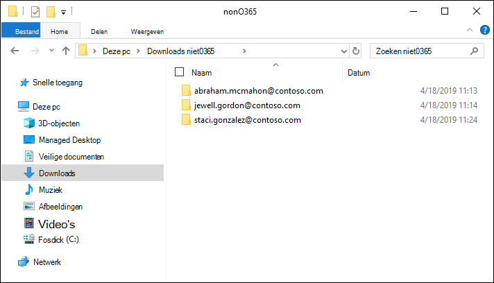
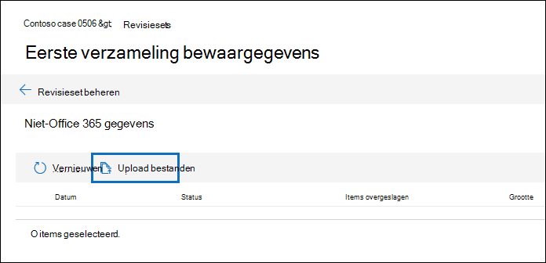
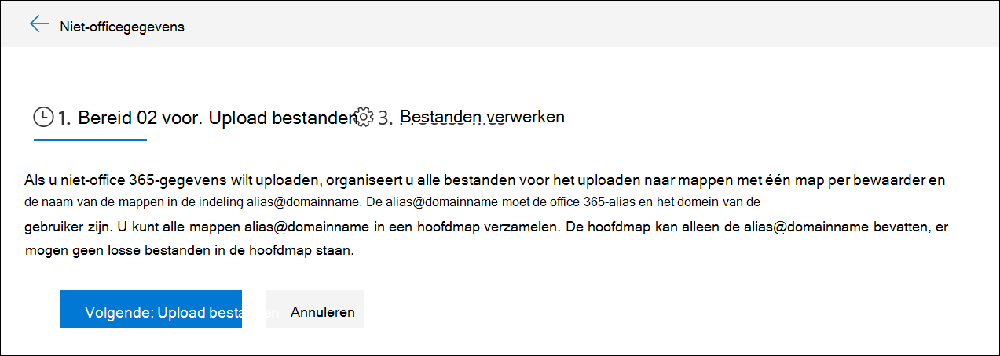
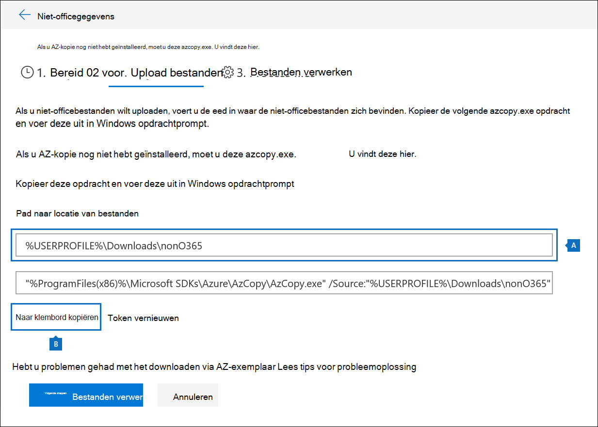
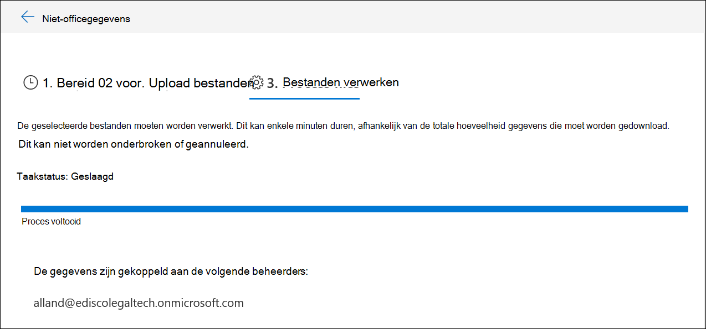

# Niet-Microsoft 365 in een revisieset ladenLoad non-Microsoft 365 data into a review set

Niet alle documenten die u moet analyseren in Advanced eDiscovery bevinden zich in Microsoft 365.Not all documents that you need to analyze in Advanced eDiscovery are located in Microsoft 365. Met de functie Microsoft 365 gegevens importeren in Advanced eDiscovery, kunt u documenten die zich niet in Microsoft 365 bevinden, uploaden naar een revisieset.With the non-Microsoft 365 data import feature in Advanced eDiscovery, you can upload documents that aren't located in Microsoft 365 to a review set. In dit artikel wordt beschreven hoe u uw niet-Microsoft 365 documenten kunt Advanced eDiscovery voor analyse.This article shows you how to bring your non-Microsoft 365 documents into Advanced eDiscovery for analysis.

## Vereisten voor het uploaden van niet-Office 365 inhoudRequirements to upload non-Office 365 content

Voor het gebruik van de functie Microsoft 365 uploaden die in dit artikel wordt beschreven, moet u het volgende hebben:Using the upload non-Microsoft 365 feature described in this article requires that you have the following:

- Aan alle bewaarders die u niet-Microsoft 365 wilt koppelen, moet de juiste licentie worden toegewezen.All custodians that you want to associate non-Microsoft 365 content to must be assigned the appropriate license. Zie Aan de slag [met Advanced eDiscovery.](get-started-with-advanced-ediscovery.md#step-1-verify-and-assign-appropriate-licenses)For more information, see [Get started with Advanced eDiscovery](get-started-with-advanced-ediscovery.md#step-1-verify-and-assign-appropriate-licenses).

- Een bestaand Advanced eDiscovery geval.An existing Advanced eDiscovery case.

- Bewaarders moeten aan de zaak worden toegevoegd voordat u de niet-Microsoft 365 gegevens kunt uploaden en eraan kunt koppelen.Custodians must be added to the case before you can upload and associate the non-Microsoft 365 data to them.

- Niet-Microsoft 365 gegevens moeten een bestandstype zijn dat wordt ondersteund door Advanced eDiscovery.Non-Microsoft 365 data must be a file type that's supported by Advanced eDiscovery. Zie Ondersteunde [bestandstypen in Advanced eDiscovery.](supported-filetypes-ediscovery20.md)For more information, see [Supported file types in Advanced eDiscovery](supported-filetypes-ediscovery20.md).

- Alle bestanden die naar een revisieset worden geüpload, moeten zich bevinden in mappen, waar elke map is gekoppeld aan een specifieke bewaarder.All files that are uploaded to a review set must be located in folders, where each folder is associated with a specific custodian. De namen voor deze mappen moeten de volgende naamgevingsindeling gebruiken: *alias@domainname.*The names for these folders must use the following naming format: *alias@domainname*. De alias@domainname moet de alias en het domein van Microsoft 365 gebruiker zijn.The alias@domainname must be the user's Microsoft 365 alias and domain. U kunt alle mappen alias@domainname in een hoofdmap verzamelen.You can collect all the alias@domainname folders in a root folder. De hoofdmap kan alleen de alias@domainname bevatten.The root folder can only contain the alias@domainname folders. Losse bestanden in de hoofdmap worden niet ondersteund.Loose files in the root folder aren't supported.

   De mapstructuur voor de niet-Microsoft 365 gegevens die u wilt uploaden, lijkt op het volgende voorbeeld:The folder structure for the non-Microsoft 365 data that you want to upload would be similar to the following example:

   - c:\nonO365\abraham.mcmahon@contoso.comc:\nonO365\abraham.mcmahon@contoso.com
   - c:\nonO365\jewell.gordon@contoso.comc:\nonO365\jewell.gordon@contoso.com
   - c:\nonO365\staci.gonzalez@contoso.comc:\nonO365\staci.gonzalez@contoso.com

   Waar abraham.mcmahon@contoso.com, jewell.gordon@contoso.com en staci.gonzalez@contoso.com de SMTP-adressen van bewaarders in de zaak zijn.Where abraham.mcmahon@contoso.com, jewell.gordon@contoso.com, and staci.gonzalez@contoso.com are the SMTP addresses of custodians in the case.

   

- Een account dat is toegewezen aan de rollengroep eDiscovery Manager (en is toegevoegd als eDiscovery-beheerder).An account that is assigned to the eDiscovery Manager role group (and added as eDiscovery Administrator).

- Het hulpprogramma AzCopy v8.1 is geïnstalleerd op een computer die toegang heeft tot de niet-Microsoft 365 inhoudsmapstructuur.The AzCopy v8.1 tool installed on a computer that has access to the non-Microsoft 365 content folder structure. Zie Gegevens overbrengen met de [AzCopy v8.1](/previous-versions/azure/storage/storage-use-azcopy)op Windows .To install AzCopy, see [Transfer data with the AzCopy v8.1 on Windows](/previous-versions/azure/storage/storage-use-azcopy). Installeer AzCopy op de standaardlocatie, **%ProgramFiles(x86)%\Microsoft SDKs\Azure\AzCopy.**Be sure to install AzCopy in the default location, which is **%ProgramFiles(x86)%\Microsoft SDKs\Azure\AzCopy**. U moet AzCopy v8.1 gebruiken.You must use AzCopy v8.1. Andere versies van AzCopy werken mogelijk niet bij het laden van niet-Microsoft 365 gegevens in Advanced eDiscovery.Other versions of AzCopy may not work when loading non-Microsoft 365 data in Advanced eDiscovery.

## Upload niet-Microsoft 365 inhoud in Advanced eDiscoveryUpload non-Microsoft 365 content into Advanced eDiscovery

1. Als eDiscovery Manager of eDiscovery-beheerder opent u Advanced eDiscovery en gaat u naar het geval dat de niet-Microsoft 365 gegevens worden geüpload naar.As an eDiscovery Manager or eDiscovery Administrator, open Advanced eDiscovery, and go to the case that the non-Microsoft 365 data will be uploaded to.  

2. Klik **op Revisiesets** en selecteer vervolgens de revisieset om de niet-Microsoft 365 te uploaden.Click **Review sets**, and then select the review set to upload the non-Microsoft 365 data to.  Als u geen revisieset hebt, kunt u er een maken.If you don't have a review set, you can create one. 
 
3. Klik in de revisieset op **Controleset beheren** en klik vervolgens op **Uploads weergeven** op de **tegel Niet-Microsoft 365 gegevens.**In the review set, click **Manage review set**, and then click **View uploads** on the **Non-Microsoft 365 data** tile.

4. Klik **Upload om** de wizard Gegevens importeren te starten.Click **Upload files** to start the data import wizard.

   

   De eerste stap in de wizard bereidt een beveiligde door Microsoft verstrekte Azure Storage voor om de bestanden te uploaden naar.The first step in the wizard prepares a secure Microsoft-provided Azure Storage location to upload the files to.  Wanneer de voorbereiding is voltooid, wordt de **knop Volgende: Upload bestanden** actief.When the preparation is completed, the **Next: Upload files** button becomes active.

   
 
5. Klik **op Volgende: Upload bestanden.**Click **Next: Upload files**.

6. Ga op **Upload pagina bestanden** als volgt te werk:On the **Upload files** page, do the following:

   

   a.a. Controleer  of typ in het vak Pad naar locatie van bestanden de locatie van de hoofdmap waar u de niet-Microsoft 365 gegevens hebt opgeslagen die u wilt uploaden.In the **Path to location of files** box, verify or type the location of the root folder where you've stored the non-Microsoft 365 data you want to upload. Voor de locatie van de voorbeeldbestanden die worden weergegeven in de sectie Voordat u **begint,** typt u **bijvoorbeeld %USERPROFILE\Downloads\nonO365.**For example, for the location of the example files shown in the **Before you begin section**, you would type **%USERPROFILE\Downloads\nonO365**. Als u de juiste locatie geeft, zorgt u ervoor dat de opdracht AzCopy die in het vak onder het pad wordt weergegeven, correct wordt bijgewerkt.Providing the correct location ensures the AzCopy command displayed in box under the path is properly updated.

   b.b. Klik **op Kopiëren naar klembord** om de opdracht te kopiëren die in het vak wordt weergegeven.Click **Copy to clipboard** to copy the command that is displayed in the box.

7. Start een Windows opdrachtprompt, plak de opdracht die u hebt gekopieerd in de vorige stap en druk vervolgens op **Enter** om de opdracht AzCopy te starten.Start a Windows command prompt, paste the command that you copied in the previous step, and then press **Enter** to start the AzCopy command.  Nadat u de opdracht hebt start, worden de niet-Microsoft 365 geüpload naar de Azure Storage locatie die is voorbereid in stap 4.After you start the command, the non-Microsoft 365 files will be uploaded to the Azure Storage location that was prepared in step 4.

   

   > [!NOTE]
   > Zoals eerder vermeld, moet u AzCopy v8.1 gebruiken om de opdracht te kunnen gebruiken die is opgegeven op de pagina Upload **bestanden.**As previously stated, you must use AzCopy v8.1 to successfully use the command that's provided on the **Upload files** page. Als de opgegeven Opdracht AzCopy mislukt, raadpleegt u [AzCopy](troubleshooting-azcopy.md)oplossen in Advanced eDiscovery.If the supplied AzCopy command fails, please see [Troubleshoot AzCopy in Advanced eDiscovery](troubleshooting-azcopy.md).

8. Ga terug naar het beveiligings- & compliancecentrum en klik op **Volgende: Bestanden** verwerken in de wizard.Go back to the Security & Compliance Center, and click **Next: Process files** in the wizard.  Hiermee start u de verwerking, tekstextractie en indexering van de niet-Microsoft 365 bestanden die zijn geüpload naar de Azure Storage locatie.This initiates processing, text extraction, and indexing of the non-Microsoft 365 files that were uploaded to the Azure Storage location.  

9. Volg de voortgang van het  verwerken van de  bestanden op de pagina Bestanden verwerken of op het tabblad Taken door een taak met de naam Niet-Microsoft 365 toevoegen aan **een revisieset weer te geven.**Track the progress of processing the files on the **Process files** page or on the **Jobs** tab by viewing a job named **Adding non-Microsoft 365 data to a review set**.  Nadat de taak is voltooid, zijn de nieuwe bestanden beschikbaar in de revisieset.After the job is finished, the new files will be available in the review set.

   

10. Nadat de verwerking is voltooid, kunt u de wizard sluiten.After the processing is finished, you can close the wizard.