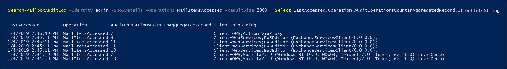

# <a name="use-advanced-audit-to-investigate-compromised-accounts"></a><span data-ttu-id="f1ac1-103">Geavanceerde controle gebruiken om verdachte accounts te onderzoeken</span><span class="sxs-lookup"><span data-stu-id="f1ac1-103">Use Advanced Audit to investigate compromised accounts</span></span>

<span data-ttu-id="f1ac1-104">Een gehackt gebruikersaccount (ook wel een *accountovername* genoemd) is een type aanval waarbij kwaadwillende gebruikers toegang krijgen tot een gebruikersaccount en gebruikersacties kunnen uitvoeren.</span><span class="sxs-lookup"><span data-stu-id="f1ac1-104">A compromised user account (also called an *account takeover*) is a type of attack when an attacker gains access to a user account and operates as the user.</span></span> <span data-ttu-id="f1ac1-105">Dit type aanvallen kan soms meer schade veroorzaken dan de aanvaller mogelijk heeft bedoeld.</span><span class="sxs-lookup"><span data-stu-id="f1ac1-105">These types of attacks sometimes cause more damage than the attacker may have intended.</span></span> <span data-ttu-id="f1ac1-106">Bij het onderzoeken van gehackte e-mailaccounts moet u ervan uitgaan dat er meer e-mailgegevens zijn gehackt dan op het eerste gezicht het geval lijkt door de werkelijke aanwezigheid van de aanvaller te traceren.</span><span class="sxs-lookup"><span data-stu-id="f1ac1-106">When investigating compromised email accounts, you have to assume that more mail data was compromised than may be indicated by tracing the attacker's actual presence.</span></span> <span data-ttu-id="f1ac1-107">Afhankelijk van het type gegevens in e-mailberichten, moet u ervan uitgaan dat gevoelige informatie in gevaar is gebracht of dat u te maken krijgt met wettelijke boetes, tenzij u kunt bewijzen dat gevoelige informatie niet openbaar is geworden.</span><span class="sxs-lookup"><span data-stu-id="f1ac1-107">Depending on the type of data in email messages, you have to assume that sensitive information was compromised or face regulatory fines unless you can prove that sensitive information wasn't exposed.</span></span> <span data-ttu-id="f1ac1-108">Zo kunnen organisaties die aan de HIPAA-regelgeving moeten voldoen rekenen op aanzienlijke boetes als er bewijs is dat patiëntenzorginformatie (PHI) openbaar is geworden.</span><span class="sxs-lookup"><span data-stu-id="f1ac1-108">For example, HIPAA-regulated organizations face significant fines if there is evidence that patient health information (PHI) was exposed.</span></span> <span data-ttu-id="f1ac1-109">In dit geval zullen kwaadwillende gebruikers waarschijnlijk niet geïnteresseerd zijn in PHI. Toch moeten organisaties een melding maken van het lekken van gegevens, tenzij ze het tegendeel kunnen aantonen.</span><span class="sxs-lookup"><span data-stu-id="f1ac1-109">In these cases, attackers are unlikely to be interested in PHI, but organizations still must report data breaches unless they can prove otherwise.</span></span>

<span data-ttu-id="f1ac1-110">Om u te helpen bij het onderzoeken van gehackte e-mailaccounts controleren we nu de toegang van e-mailgegevens door e-mailprotocollen en -clients met de *MailItemsAccessed*-actie voor postvakcontrole.</span><span class="sxs-lookup"><span data-stu-id="f1ac1-110">To help you with investigating compromise email accounts, we're now auditing accesses of mail data by mail protocols and clients with the *MailItemsAccessed* mailbox auditing action.</span></span> <span data-ttu-id="f1ac1-111">Deze nieuwe controleactie helpt gebruikers een beter inzicht te krijgen in inbreuken op e-mailgegevens en de omvang van aanvallen in kaart te brengen voor specifieke e-mailitems die mogelijk zijn gehackt.</span><span class="sxs-lookup"><span data-stu-id="f1ac1-111">This new audited action will help investigators better understand email data breaches and help you identify the scope of compromises to specific mail items that may been compromised.</span></span> <span data-ttu-id="f1ac1-112">Deze nieuwe controleactie is bedoeld om te controleren of bepaalde e-mailgegevens niet zijn gehackt.</span><span class="sxs-lookup"><span data-stu-id="f1ac1-112">The goal of using this new auditing action is forensics defensibility to help assert that a specific piece of mail data was not compromised.</span></span> <span data-ttu-id="f1ac1-113">Als kwaadwillende gebruikers toegang tot een bepaald e-mailbericht hebben gekregen, controleert Exchange Online die gebeurtenis, ook al is er geen bewijs dat het e-mailitem daadwerkelijk is gelezen.</span><span class="sxs-lookup"><span data-stu-id="f1ac1-113">If an attacker gained access to a specific piece of mail, Exchange Online audits the event even though there is no indication that the mail item was actually read.</span></span>

## <a name="the-mailitemsaccessed-mailbox-auditing-action"></a><span data-ttu-id="f1ac1-114">De postvakcontroleactie MailItemsAccessed</span><span class="sxs-lookup"><span data-stu-id="f1ac1-114">The MailItemsAccessed mailbox auditing action</span></span>

<span data-ttu-id="f1ac1-115">De nieuwe actie MailItemsAccessed maakt deel uit van de nieuwe functionaliteit [Geavanceerde audit](advanced-audit.md).</span><span class="sxs-lookup"><span data-stu-id="f1ac1-115">The new MailItemsAccessed action is part of the new [Advanced Audit](advanced-audit.md) functionality.</span></span> <span data-ttu-id="f1ac1-116">De actie maakt deel uit van de [controle van Exchange-postvakken](/office365/securitycompliance/enable-mailbox-auditing#mailbox-auditing-actions) en is standaard ingeschakeld voor gebruikers met een Office 365- of Microsoft 365 E5-licentie of voor organisaties met een Microsoft 365 E5 compliance-abonnement.</span><span class="sxs-lookup"><span data-stu-id="f1ac1-116">It's part of [Exchange mailbox auditing](/office365/securitycompliance/enable-mailbox-auditing#mailbox-auditing-actions) and is enabled by default for users that are assigned an Office 365 or Microsoft 365 E5 license or for organizations with a Microsoft 365 E5 Compliance add-on subscription.</span></span>

<span data-ttu-id="f1ac1-117">De actie MailItemsAccessed voor postvakcontroleactie heeft betrekking op alle e-mailprotocollen: POP, IMAP, MAPI, EWS, Exchange ActiveSync en REST.</span><span class="sxs-lookup"><span data-stu-id="f1ac1-117">The MailItemsAccessed mailbox auditing action covers all mail protocols: POP, IMAP, MAPI, EWS, Exchange ActiveSync, and REST.</span></span> <span data-ttu-id="f1ac1-118">Daarnaast worden beide soorten toegang tot e-mail (*sync* en *bind*) ondersteund.</span><span class="sxs-lookup"><span data-stu-id="f1ac1-118">It also covers both types of accessing mail: *sync* and *bind*.</span></span>

### <a name="auditing-sync-access"></a><span data-ttu-id="f1ac1-119">Synchronisatietoegang controleren</span><span class="sxs-lookup"><span data-stu-id="f1ac1-119">Auditing sync access</span></span>

<span data-ttu-id="f1ac1-120">Synchronisatiebewerkingen worden alleen opgenomen wanneer een postvak wordt gebruikt in een bureaubladversie van de Outlook-client voor Windows of Mac.</span><span class="sxs-lookup"><span data-stu-id="f1ac1-120">Sync operations are only recorded when a mailbox is accessed by a desktop version of the Outlook client for Windows or Mac.</span></span> <span data-ttu-id="f1ac1-121">Tijdens de synchronisatie door deze clients meestal een groot aantal e-mailitems gedownload van de cloud naar een lokale computer.</span><span class="sxs-lookup"><span data-stu-id="f1ac1-121">During the sync operation, these clients typically download a large set of mail items from the cloud to a local computer.</span></span> <span data-ttu-id="f1ac1-122">Het auditvolume voor synchronisatiebewerkingen is enorm.</span><span class="sxs-lookup"><span data-stu-id="f1ac1-122">The audit volume for sync operations is huge.</span></span> <span data-ttu-id="f1ac1-123">Daarom genereren we geen controlerecord voor elk e-mailitem dat wordt gesynchroniseerd, maar we een controlegebeurtenis voor de e-mailmap met items die zijn gesynchroniseerd.</span><span class="sxs-lookup"><span data-stu-id="f1ac1-123">So, instead of generating an audit record for each mail item that's synched, we just generate an audit event for the mail folder containing items that were synched.</span></span> <span data-ttu-id="f1ac1-124">Daardoor wordt aangenomen dat *alle* e-mailitems in de gesynchroniseerde map zijn gehackt.</span><span class="sxs-lookup"><span data-stu-id="f1ac1-124">This makes the assumption that *all* mail items in the synched folder have been compromised.</span></span> <span data-ttu-id="f1ac1-125">Het toegangstype wordt vastgelegd in het veld OperationProperties van de auditrecord.</span><span class="sxs-lookup"><span data-stu-id="f1ac1-125">The access type is recorded in the OperationProperties field of the audit record.</span></span> 

<span data-ttu-id="f1ac1-126">Zie stap 2 in de sectie [MailItemsAccessed-auditrecords gebruiken voor forenstisch onderzoek](#use-mailitemsaccessed-audit-records-for-forensic-investigations) voor een voorbeeld van het weergeven van het type synchronisatietoegang in een controlerecord.</span><span class="sxs-lookup"><span data-stu-id="f1ac1-126">See step 2 in the [Use MailItemsAccessed audit records for forensic investigations](#use-mailitemsaccessed-audit-records-for-forensic-investigations) section for an example of displaying the sync access type in an audit record.</span></span>

### <a name="auditing-bind-access"></a><span data-ttu-id="f1ac1-127">Bind-toegang controleren</span><span class="sxs-lookup"><span data-stu-id="f1ac1-127">Auditing bind access</span></span>

<span data-ttu-id="f1ac1-128">Een bind-bewerking is een afzonderlijke toegang tot een e-mailbericht.</span><span class="sxs-lookup"><span data-stu-id="f1ac1-128">A bind operation is an individual access to an email message.</span></span> <span data-ttu-id="f1ac1-129">Voor bind-toegang wordt de InternetMessageId van afzonderlijke berichten opgenomen in de auditrecord.</span><span class="sxs-lookup"><span data-stu-id="f1ac1-129">For bind access, the InternetMessageId of individual messages will be recorded in the audit record.</span></span> <span data-ttu-id="f1ac1-130">De MailItemsAccessed-controleactie registreert bind-bewerkingen en voegt deze samen tot één controlerecord.</span><span class="sxs-lookup"><span data-stu-id="f1ac1-130">The MailItemsAccessed audit action records bind operations and then aggregates into a single audit record.</span></span> <span data-ttu-id="f1ac1-131">Alle bind-bewerkingen die binnen een interval van twee minuten plaatsvinden, worden samengevoegd in één controlerecord in het veld Folders binnen de eigenschap AuditData.</span><span class="sxs-lookup"><span data-stu-id="f1ac1-131">All bind operations that occur within a 2-minute interval are aggregated in a single audit record in the Folders field within the AuditData property.</span></span> <span data-ttu-id="f1ac1-132">Elk bericht dat is geopend, wordt geïdentificeerd aan de hand van de InternetMessageId.</span><span class="sxs-lookup"><span data-stu-id="f1ac1-132">Each message that was accessed is identified by its InternetMessageId.</span></span> <span data-ttu-id="f1ac1-133">Het aantal bind-bewerkingen dat in de record is samengevoegd, wordt weergegeven in het veld OperationCount in de eigenschap AuditData.</span><span class="sxs-lookup"><span data-stu-id="f1ac1-133">The number of bind operations that were aggregated in the record is displayed in the OperationCount field in the AuditData property.</span></span>

<span data-ttu-id="f1ac1-134">Zie stap 4 in de sectie [MailItemsAccessed-auditrecords gebruiken voor forenstisch onderzoek](#use-mailitemsaccessed-audit-records-for-forensic-investigations) voor een voorbeeld van het weergeven van het type bind-toegang in een controlerecord.</span><span class="sxs-lookup"><span data-stu-id="f1ac1-134">See step 4 in the [Use MailItemsAccessed audit records for forensic investigations](#use-mailitemsaccessed-audit-records-for-forensic-investigations) section for an example of displaying the bind access type in an audit record.</span></span>

### <a name="throttling-of-mailitemsaccessed-audit-records"></a><span data-ttu-id="f1ac1-135">MailItemsAccessed-controlerecords beperken</span><span class="sxs-lookup"><span data-stu-id="f1ac1-135">Throttling of MailItemsAccessed audit records</span></span>

<span data-ttu-id="f1ac1-136">Als er binnen 24 uur meer dan 1000 MailItemsAccessed-controlerecords worden gegenereerd, worden er in Exchange Online geen controlerecords meer gegenereerd voor MailItemsAccessed-activiteit.</span><span class="sxs-lookup"><span data-stu-id="f1ac1-136">If more than 1,000 MailItemsAccessed audit records are generated in less than 24 hours, Exchange Online will stop generating auditing records for MailItemsAccessed activity.</span></span> <span data-ttu-id="f1ac1-137">Als een postvak wordt beperkt, wordt de MailItemsAccessed-activiteit pas 24 uur nadat het postvak is beperkt geregistreerd.</span><span class="sxs-lookup"><span data-stu-id="f1ac1-137">When a mailbox is throttled, MailItemsAccessed activity will not be logged for 24 hours after the mailbox was throttled.</span></span> <span data-ttu-id="f1ac1-138">Als dit gebeurt, is er een kans dat het postvak in de loop van de periode is gehackt.</span><span class="sxs-lookup"><span data-stu-id="f1ac1-138">If this occurs, there's a potential that mailbox could have been compromised during this period.</span></span> <span data-ttu-id="f1ac1-139">De registratie van MailItemsAccessed-activiteit wordt na 24 uur hervat.</span><span class="sxs-lookup"><span data-stu-id="f1ac1-139">The recording of MailItemsAccessed activity will be resumed following a 24-hour period.</span></span>  

<span data-ttu-id="f1ac1-140">Hier zijn enkele dingen die u in gedachten moet houden bij beperking van activiteiten:</span><span class="sxs-lookup"><span data-stu-id="f1ac1-140">Here's a few things to keep in mind about throttling:</span></span>

- <span data-ttu-id="f1ac1-141">Minder dan 1% van alle postvakken in Exchange Online wordt beperkt</span><span class="sxs-lookup"><span data-stu-id="f1ac1-141">Less than 1% of all mailboxes in Exchange Online are throttled</span></span>

- <span data-ttu-id="f1ac1-142">Wanneer een postvak wordt beperkt, worden alleen controlerecords voor MailItemsAccessed-activiteiten niet gecontroleerd.</span><span class="sxs-lookup"><span data-stu-id="f1ac1-142">When a mailbox is throttling, only audit records for MailItemsAccessed activity are not audited.</span></span> <span data-ttu-id="f1ac1-143">Andere postvakcontroleacties worden niet beïnvloed.</span><span class="sxs-lookup"><span data-stu-id="f1ac1-143">Other mailbox auditing actions aren't affected.</span></span>

- <span data-ttu-id="f1ac1-144">Postvakken worden alleen beperkt voor bind-bewerkingen.</span><span class="sxs-lookup"><span data-stu-id="f1ac1-144">Mailboxes are throttled only for Bind operations.</span></span> <span data-ttu-id="f1ac1-145">Controlerecords voor synchronisatiebewerkingen worden niet beperkt.</span><span class="sxs-lookup"><span data-stu-id="f1ac1-145">Audit records for sync operations are not throttled.</span></span>

- <span data-ttu-id="f1ac1-146">Als een postvak wordt beperkt, kunt u aannemen dat er MailItemsAccessed-activiteit is die niet is vastgelegd in de auditlogboeken.</span><span class="sxs-lookup"><span data-stu-id="f1ac1-146">If a mailbox is throttled, you can probably assume there was MailItemsAccessed activity that wasn't recorded in the audit logs.</span></span>

<span data-ttu-id="f1ac1-147">Zie stap 1 in de sectie [MailItemsAccessed-auditrecords gebruiken voor forenstisch onderzoek](#use-mailitemsaccessed-audit-records-for-forensic-investigations) voor een voorbeeld van het weergeven van de eigenschap IsThrottled in een controlerecord.</span><span class="sxs-lookup"><span data-stu-id="f1ac1-147">See step 1 in the [Use MailItemsAccessed audit records for forensic investigations](#use-mailitemsaccessed-audit-records-for-forensic-investigations) section for an example of displaying the IsThrottled property in an audit record.</span></span>

## <a name="use-mailitemsaccessed-audit-records-for-forensic-investigations"></a><span data-ttu-id="f1ac1-148">MailItemsAccessed-controlerecords gebruiken voor forensisch onderzoek</span><span class="sxs-lookup"><span data-stu-id="f1ac1-148">Use MailItemsAccessed audit records for forensic investigations</span></span>

<span data-ttu-id="f1ac1-149">Met postvakcontrole worden controlerecords gegenereerd voor toegang tot e-mailberichten, zodat u zeker weet dat er geen e-mailberichten zijn gehackt.</span><span class="sxs-lookup"><span data-stu-id="f1ac1-149">Mailbox auditing generates audit records for access to email messages so that you can be confident that email messages haven't been compromised.</span></span> <span data-ttu-id="f1ac1-150">Wanneer we niet zeker weten of er wel of niet toegang tot bepaalde gegevens is gekregen, zullen we om deze reden ervan uitgaan dat dat wel het geval is door alle toegangsactiviteiten voor e-mail te registreren.</span><span class="sxs-lookup"><span data-stu-id="f1ac1-150">For this reason, in circumstances where we're not certain that some data has been accessed, we assume that it has by recording all mail access activity.</span></span>

<span data-ttu-id="f1ac1-151">MailItemsAccessed-controlerecords voor forensische controles worden meestal gebruikt nadat een gegevenslek is opgelost en de aanvaller is buitengesloten.</span><span class="sxs-lookup"><span data-stu-id="f1ac1-151">Using MailItemsAccessed audit records for forensics purposes is typically performed after a data breach has been resolved and the attacker has been evicted.</span></span> <span data-ttu-id="f1ac1-152">Om uw onderzoek te starten, moet u de reeks gehackte postvakken in kaart brengen en vaststellen in welke periode en op welk tijdstip kwaadwillende gebruikers toegang hebben gehad tot postvakken in uw organisatie.</span><span class="sxs-lookup"><span data-stu-id="f1ac1-152">To begin your investigation, you should identify the set of mailboxes that they have been compromised and determine the time frame when attacker had access to mailboxes in your organization.</span></span> <span data-ttu-id="f1ac1-153">Vervolgens kunt u de **Search-UnifiedAuditLog**- of **Search-MailboxAuditLog** cmdlets in [Exchange Online PowerShell](/powershell/exchange/connect-to-exchange-online-powershell) gebruiken om te zoeken naar controlerecords die overeenkomen met de gegevenslek.</span><span class="sxs-lookup"><span data-stu-id="f1ac1-153">Then, you can use the **Search-UnifiedAuditLog** or **Search-MailboxAuditLog** cmdlets in [Exchange Online PowerShell](/powershell/exchange/connect-to-exchange-online-powershell) to search audit records that correspond to the data breach.</span></span> 

<span data-ttu-id="f1ac1-154">U kunt een van de volgende opdrachten uitvoeren om te zoeken naar MailItemsAccessed-controlerecords:</span><span class="sxs-lookup"><span data-stu-id="f1ac1-154">You can run one of the following commands to search for MailItemsAccessed audit records:</span></span>

<span data-ttu-id="f1ac1-155">**Geïntegreerd auditlogboek**</span><span class="sxs-lookup"><span data-stu-id="f1ac1-155">**Unified audit log**</span></span>

```powershell
Search-UnifiedAuditLog -StartDate 01/06/2020 -EndDate 01/20/2020 -UserIds <user1,user2> -Operations MailItemsAccessed -ResultSize 1000
```

<span data-ttu-id="f1ac1-156">**Auditlogboek van postvak**</span><span class="sxs-lookup"><span data-stu-id="f1ac1-156">**Mailbox audit log**</span></span>

```powershell
Search-MailboxAuditLog -Identity <user> -StartDate 01/06/2020 -EndDate 01/20/2020 -Operations MailItemsAccessed -ResultSize 1000 -ShowDetails
```

> [!TIP]
> <span data-ttu-id="f1ac1-157">Een belangrijk verschil tussen deze twee cmdlets is dat u de cmdlet **Search-UnifiedAuditLog** kunt gebruiken om te zoeken naar controlerecords voor activiteiten die door een of meer gebruikers zijn uitgevoerd.</span><span class="sxs-lookup"><span data-stu-id="f1ac1-157">One primary difference between these two cmdlets in that you can use the **Search-UnifiedAuditLog** cmdlet to search for audit records for activity performed by one or more users.</span></span> <span data-ttu-id="f1ac1-158">Dat komt omdat *UserIds* een parameter met meerdere waarden is.</span><span class="sxs-lookup"><span data-stu-id="f1ac1-158">That's because *UserIds* is a multi-value parameter.</span></span> <span data-ttu-id="f1ac1-159">Met de **Search-MailboxAuditLog**-cmdlet wordt gezocht naar één gebruiker in het auditlogboek van het postvak.</span><span class="sxs-lookup"><span data-stu-id="f1ac1-159">The **Search-MailboxAuditLog** cmdlet searches the mailbox audit log for a single user.</span></span>

<span data-ttu-id="f1ac1-160">Hier volgen de stappen voor het gebruik van MailItemsAccessed-controlerecords om hack te onderzoeken.</span><span class="sxs-lookup"><span data-stu-id="f1ac1-160">Here are the steps for using MailItemsAccessed audit records to investigate a compromised user attack.</span></span> <span data-ttu-id="f1ac1-161">Elke stap toont de syntaxis van de opdracht voor de **Search-UnifiedAuditLog**- of **Search-MailboxAuditLog** cmdlets.</span><span class="sxs-lookup"><span data-stu-id="f1ac1-161">Each step shows the command syntax for the **Search-UnifiedAuditLog** or **Search-MailboxAuditLog** cmdlets.</span></span>

1. <span data-ttu-id="f1ac1-162">Controleer of het postvak is beperkt.</span><span class="sxs-lookup"><span data-stu-id="f1ac1-162">Check whether the mailbox has been throttled.</span></span> <span data-ttu-id="f1ac1-163">Dat zou betekenen dat sommige controlerecords voor postvakken niet zouden zijn vastgelegd.</span><span class="sxs-lookup"><span data-stu-id="f1ac1-163">If so, this would mean that some mailbox auditing records would not have been logged.</span></span> <span data-ttu-id="f1ac1-164">Wanneer 'IsThrottled' in controlerecords 'Waar' is, moet u ervan uitgaan dat gedurende 24 uur nadat deze record is gegenereerd alle toegang tot het postvak niet is gecontroleerd en dat alle e-mailgegevens zijn gehackt.</span><span class="sxs-lookup"><span data-stu-id="f1ac1-164">In the case that any audit records have the "IsThrottled" is "True," you should assume that for a 24-hour period afterwards that record was generated, that any access to the mailbox was not audited and that all mail data has been compromised.</span></span>

   <span data-ttu-id="f1ac1-165">Voer de volgende opdracht uit om te zoeken naar MailItemsAccessed-records waarbij het postvak is beperkt:</span><span class="sxs-lookup"><span data-stu-id="f1ac1-165">To search for MailItemsAccessed records where the mailbox was throttled, run the following command:</span></span>

   <span data-ttu-id="f1ac1-166">**Geïntegreerd auditlogboek**</span><span class="sxs-lookup"><span data-stu-id="f1ac1-166">**Unified audit log**</span></span>
 
   ```powershell
   Search-UnifiedAuditLog -StartDate 01/06/2020 -EndDate 01/20/2020 -UserIds <user1,user2> -Operations MailItemsAccessed -ResultSize 1000 | Where {$_.AuditData -like '*"IsThrottled","Value":"True"*'} | FL
   ```

   <span data-ttu-id="f1ac1-167">**Auditlogboek van postvak**</span><span class="sxs-lookup"><span data-stu-id="f1ac1-167">**Mailbox audit log**</span></span>

   ```powershell
   Search-MailboxAuditLog -StartDate 01/06/2020 -EndDate 01/20/2020 -Identity <user> -Operations MailItemsAccessed -ResultSize 10000 -ShowDetails | Where {$_.OperationProperties -like "*IsThrottled:True*"} | FL
   ```

2. <span data-ttu-id="f1ac1-168">Controleer op synchronisatieactiviteiten.</span><span class="sxs-lookup"><span data-stu-id="f1ac1-168">Check for sync activities.</span></span> <span data-ttu-id="f1ac1-169">Als een aanvaller een e-mailclient gebruikt om berichten in een postvak te downloaden, kan hij de computer loskoppelen van internet en de berichten lokaal openen zonder interactie met de server.</span><span class="sxs-lookup"><span data-stu-id="f1ac1-169">If an attacker uses an email client to downloaded messages in a mailbox, they can disconnect the computer from the Internet and access the messages locally without interacting with the server.</span></span> <span data-ttu-id="f1ac1-170">Dit betekent dat deze activiteiten niet kunnen worden gecontroleerd door postvakcontroles.</span><span class="sxs-lookup"><span data-stu-id="f1ac1-170">This means that mailbox auditing would not be able to audit these activities.</span></span>

   <span data-ttu-id="f1ac1-171">Voer de volgende opdracht uit als u wilt zoeken naar MailItemsAccessed-records waarbij de e-mailitems toegankelijk waren via een synchronisatiebewerking:</span><span class="sxs-lookup"><span data-stu-id="f1ac1-171">To search for MailItemsAccessed records where the mail items were accessed by a sync operation, run the following command:</span></span>

   <span data-ttu-id="f1ac1-172">**Geïntegreerd auditlogboek**</span><span class="sxs-lookup"><span data-stu-id="f1ac1-172">**Unified audit log**</span></span>

   ```powershell
   Search-UnifiedAuditLog -StartDate 01/06/2020 -EndDate 02/20/2020 -UserIds <user1,user2> -Operations MailItemsAccessed -ResultSize 1000 | Where {$_.AuditData -like '*"MailAccessType","Value":"Sync"*'} | FL
   ```

   <span data-ttu-id="f1ac1-173">**Auditlogboek van postvak**</span><span class="sxs-lookup"><span data-stu-id="f1ac1-173">**Mailbox audit log**</span></span>

   ```powershell
   Search-MailboxAuditLog -StartDate 01/06/2020 -EndDate 01/20/2020 -Identity <user> -Operations MailItemsAccessed -ResultSize 10000 -ShowDetails | Where {$_.OperationProperties -like "*MailAccessType:Sync*"} | FL
   ```

3. <span data-ttu-id="f1ac1-174">Controleer of er synchronisatieactiviteiten hebben plaatsgevonden in dezelfde context als die die door de aanvaller is gebruikt om toegang te krijgen tot het postvak.</span><span class="sxs-lookup"><span data-stu-id="f1ac1-174">Check sync activities to determine in any of them have occurred in the same context as the one used by the attacker access the mailbox.</span></span> <span data-ttu-id="f1ac1-175">De context wordt in kaart gebracht en onderscheiden aan de hand van het IP-adres van de clientcomputer die werd gebruikt voor toegang tot het postvak en het e-mailprotocol.</span><span class="sxs-lookup"><span data-stu-id="f1ac1-175">Context is identified and differentiated by the IP address of the client computer used to access the mailbox and the mail protocol.</span></span> <span data-ttu-id="f1ac1-176">Zie voor meer informatie de sectie [De toegangscontexten van verschillende controlerecords identificeren](#identifying-the-access-contexts-of-different-audit-records).</span><span class="sxs-lookup"><span data-stu-id="f1ac1-176">For more information, see the [Identifying the access contexts of different audit records](#identifying-the-access-contexts-of-different-audit-records) section.</span></span>

   <span data-ttu-id="f1ac1-177">Gebruik de onderstaande eigenschappen voor uw onderzoek.</span><span class="sxs-lookup"><span data-stu-id="f1ac1-177">Use the properties listed below to investigate.</span></span> <span data-ttu-id="f1ac1-178">Deze eigenschappen bevinden zich in de eigenschap AuditData of OperationProperties.</span><span class="sxs-lookup"><span data-stu-id="f1ac1-178">These properties are located in the AuditData or OperationProperties property.</span></span> <span data-ttu-id="f1ac1-179">Als een van de synchronisaties in dezelfde context plaatsvond als de kwaadwillende activiteit kunt u ervan uitgaan dat de aanvallers alle e-mailitems naar hun client hebben gesynchroniseerd, wat betekent dat het hele postvak waarschijnlijk is gehackt.</span><span class="sxs-lookup"><span data-stu-id="f1ac1-179">If any of the syncs occur in the same context as the attacker activity, assume the attacker has synced all mail items to their client, which means the entire mailbox has probably been compromised.</span></span>

   |<span data-ttu-id="f1ac1-180">Eigenschap</span><span class="sxs-lookup"><span data-stu-id="f1ac1-180">Property</span></span>         | <span data-ttu-id="f1ac1-181">Omschrijving</span><span class="sxs-lookup"><span data-stu-id="f1ac1-181">Description</span></span> |
   |:---------------- | :----------|
   |<span data-ttu-id="f1ac1-182">ClientInfoString</span><span class="sxs-lookup"><span data-stu-id="f1ac1-182">ClientInfoString</span></span> | <span data-ttu-id="f1ac1-183">Beschrijft het protocol en de client (inclusief versie)</span><span class="sxs-lookup"><span data-stu-id="f1ac1-183">Describes protocol, client (includes version)</span></span>|
   |<span data-ttu-id="f1ac1-184">ClientIPAddress</span><span class="sxs-lookup"><span data-stu-id="f1ac1-184">ClientIPAddress</span></span>  | <span data-ttu-id="f1ac1-185">IP-adres van de clientmachine.</span><span class="sxs-lookup"><span data-stu-id="f1ac1-185">IP address of the client machine.</span></span>|
   |<span data-ttu-id="f1ac1-186">SessionId</span><span class="sxs-lookup"><span data-stu-id="f1ac1-186">SessionId</span></span>        | <span data-ttu-id="f1ac1-187">Sessie-id helpt om acties van aanvallers te onderscheiden van de dagelijkse gebruikersactiviteiten op hetzelfde account (in het geval van een gehackt account)</span><span class="sxs-lookup"><span data-stu-id="f1ac1-187">Session ID helps to differentiate attacker actions vs day-to-day user activities on the same account (in the case of a compromised account)</span></span>|
   |<span data-ttu-id="f1ac1-188">UserID</span><span class="sxs-lookup"><span data-stu-id="f1ac1-188">UserId</span></span>           | <span data-ttu-id="f1ac1-189">De UPN van de gebruiker die het bericht leest.</span><span class="sxs-lookup"><span data-stu-id="f1ac1-189">UPN of the user reading the message.</span></span>|
   |||

4. <span data-ttu-id="f1ac1-190">Controleer op bind-activiteiten.</span><span class="sxs-lookup"><span data-stu-id="f1ac1-190">Check for bind activities.</span></span> <span data-ttu-id="f1ac1-191">Nadat u stap 2 en 3 hebt uitgevoerd, kunt u erop vertrouwen dat alle andere toegang tot e-mailberichten door de aanvaller zal worden vastgelegd in de controlerecords van MailItemsAccessed die de eigenschap MailAccessType hebben met de waarde 'Bind'.</span><span class="sxs-lookup"><span data-stu-id="f1ac1-191">After performing steps 2 and step 3, you can be confident that all other access to email messages by the attacker will be captured in the MailItemsAccessed audit records that have a MailAccessType property with a value of "Bind".</span></span>

   <span data-ttu-id="f1ac1-192">Voer de volgende opdracht uit als u wilt zoeken naar MailItemsAccessed-records waarbij de e-mailitems toegankelijk waren via een bind-bewerking.</span><span class="sxs-lookup"><span data-stu-id="f1ac1-192">To search for MailItemsAccessed records where the mail items were accessed by a Bind operation, run the following command.</span></span>

   <span data-ttu-id="f1ac1-193">**Geïntegreerd auditlogboek**</span><span class="sxs-lookup"><span data-stu-id="f1ac1-193">**Unified audit log**</span></span>

   ```powershell
   Search-UnifiedAuditLog -StartDate 01/06/2020 -EndDate 01/20/2020 -UserIds <user1,user2> -Operations MailItemsAccessed -ResultSize 1000 | Where {$_.AuditData -like '*"MailAccessType","Value":"Bind"*'} | FL
   ```
 
   <span data-ttu-id="f1ac1-194">**Auditlogboek van postvak**</span><span class="sxs-lookup"><span data-stu-id="f1ac1-194">**Mailbox audit log**</span></span>
   
   ```powershell
   Search-MailboxAuditLog -StartDate 01/06/2020 -EndDate 01/20/2020 -Identity <user> -Operations MailItemsAccessed -ResultSize 10000 -ShowDetails | Where {$_.OperationProperties -like "*MailAccessType:Bind*"} | FL
   ```

   <span data-ttu-id="f1ac1-195">E-mailberichten die zijn verzonden, worden geïdentificeerd aan de hand van de id van hun internetbericht. U kunt ook controleren of er controlerecords zijn die dezelfde context hebben als die van andere aanvallen.</span><span class="sxs-lookup"><span data-stu-id="f1ac1-195">Email messages that were accessed are identified by their internet message Id. You can also check to see if any audit records have the same context as the ones for other attacker activity.</span></span> <span data-ttu-id="f1ac1-196">Zie voor meer informatie de sectie [De toegangscontexten van verschillende controlerecords identificeren](#identifying-the-access-contexts-of-different-audit-records).</span><span class="sxs-lookup"><span data-stu-id="f1ac1-196">For more information, see the [Identifying the access contexts of different audit records](#identifying-the-access-contexts-of-different-audit-records) section.</span></span>
 
   <span data-ttu-id="f1ac1-197">U kunt de controlegegevens op twee verschillende manieren gebruiken om bind-bewerkingen uit te voeren:</span><span class="sxs-lookup"><span data-stu-id="f1ac1-197">You can use the audit data for bind operations in two different ways:</span></span>

     - <span data-ttu-id="f1ac1-198">Bekijk of verzamel alle e-mailberichten die de kwaadwillende gebruikers kunnen openen door de InternetMessageId te gebruiken en te controleren of een van deze berichten gevoelige informatie bevat.</span><span class="sxs-lookup"><span data-stu-id="f1ac1-198">Access or collect all email messages the attacker accessed by using the InternetMessageId to find them and then checking to see if any of those messages contains sensitive information.</span></span>

     - <span data-ttu-id="f1ac1-199">Gebruik de InternetMessageId om te zoeken naar controlerecords die zijn gerelateerd aan een reeks mogelijk gevoelige e-mailberichten.</span><span class="sxs-lookup"><span data-stu-id="f1ac1-199">Use the InternetMessageId to search audit records related to a set of potentially sensitive email messages.</span></span> <span data-ttu-id="f1ac1-200">Dit is handig als u zich zorgen maakt over een klein aantal berichten.</span><span class="sxs-lookup"><span data-stu-id="f1ac1-200">This is useful if you're concerned only about a small number of messages.</span></span>

## <a name="filtering-of-duplicate-audit-records"></a><span data-ttu-id="f1ac1-201">Dubbele controlerecords filteren</span><span class="sxs-lookup"><span data-stu-id="f1ac1-201">Filtering of duplicate audit records</span></span>

<span data-ttu-id="f1ac1-202">Dubbele controlerecords voor dezelfde bind-bewerkingen die binnen een uur plaatsvonden, worden gefilterd om controleruis te verwijderen.</span><span class="sxs-lookup"><span data-stu-id="f1ac1-202">Duplicate audit records for the same bind operations that occur within an hour of each other are filtered out to remove auditing noise.</span></span> <span data-ttu-id="f1ac1-203">Ook synchronisatiebewerkingen worden gefilterd met intervallen van één uur.</span><span class="sxs-lookup"><span data-stu-id="f1ac1-203">Sync operations are also filtered out at one-hour intervals.</span></span> <span data-ttu-id="f1ac1-204">De uitzondering op deze de-duplicatieprocedure geldt als een van de eigenschappen die in de volgende tabel worden beschreven afwijkt voor dezelfde InternetMessageId.</span><span class="sxs-lookup"><span data-stu-id="f1ac1-204">The exception to this de-duplication process occurs if, for the same InternetMessageId, any of the properties described in the following table are different.</span></span> <span data-ttu-id="f1ac1-205">Als een van deze eigenschappen in een dubbele bewerking anders is, wordt er een nieuwe auditrecord gegenereerd.</span><span class="sxs-lookup"><span data-stu-id="f1ac1-205">If one of these properties is different in a duplicate operation, a new audit record is generated.</span></span> <span data-ttu-id="f1ac1-206">Dit proces wordt uitgebreider beschreven in de volgende sectie.</span><span class="sxs-lookup"><span data-stu-id="f1ac1-206">This process is described in more detail in the next section.</span></span>

| <span data-ttu-id="f1ac1-207">Eigenschap</span><span class="sxs-lookup"><span data-stu-id="f1ac1-207">Property</span></span>| <span data-ttu-id="f1ac1-208">Omschrijving</span><span class="sxs-lookup"><span data-stu-id="f1ac1-208">Description</span></span>|
|:--------|:---------|
|<span data-ttu-id="f1ac1-209">ClientIPAddress</span><span class="sxs-lookup"><span data-stu-id="f1ac1-209">ClientIPAddress</span></span> | <span data-ttu-id="f1ac1-210">IP-adres van de clientcomputer.</span><span class="sxs-lookup"><span data-stu-id="f1ac1-210">IP address of the client computer.</span></span>|
|<span data-ttu-id="f1ac1-211">ClientInfoString</span><span class="sxs-lookup"><span data-stu-id="f1ac1-211">ClientInfoString</span></span>| <span data-ttu-id="f1ac1-212">Het clientprotocol, dat wordt gebruikt voor toegang tot het postvak.</span><span class="sxs-lookup"><span data-stu-id="f1ac1-212">The client protocol, client used to access the mailbox.</span></span>| 
|<span data-ttu-id="f1ac1-213">ParentFolder</span><span class="sxs-lookup"><span data-stu-id="f1ac1-213">ParentFolder</span></span>    | <span data-ttu-id="f1ac1-214">Het volledige pad naar de map van het e-mailitem dat is geopend.</span><span class="sxs-lookup"><span data-stu-id="f1ac1-214">The full folder path of the mail item that was accessed.</span></span> |
|<span data-ttu-id="f1ac1-215">Logon_type</span><span class="sxs-lookup"><span data-stu-id="f1ac1-215">Logon_type</span></span>      | <span data-ttu-id="f1ac1-216">Het aanmeldingstype van de gebruiker die de actie heeft uitgevoerd.</span><span class="sxs-lookup"><span data-stu-id="f1ac1-216">The logon type of the user who performed the action.</span></span> <span data-ttu-id="f1ac1-217">De aanmeldingstypen (en de bijbehorende enum-waarde) zijn Owner (0), Admin (1) of Delegate (2).</span><span class="sxs-lookup"><span data-stu-id="f1ac1-217">The logon types (and their corresponding Enum value) are Owner (0), Admin (1), or Delegate (2).</span></span>|
|<span data-ttu-id="f1ac1-218">MailAccessType</span><span class="sxs-lookup"><span data-stu-id="f1ac1-218">MailAccessType</span></span>  | <span data-ttu-id="f1ac1-219">Of de toegang een bind- of synchronisatiebewerking is.</span><span class="sxs-lookup"><span data-stu-id="f1ac1-219">Whether the access is a bind or a sync operation.</span></span>|
|<span data-ttu-id="f1ac1-220">MailboxUPN</span><span class="sxs-lookup"><span data-stu-id="f1ac1-220">MailboxUPN</span></span>      | <span data-ttu-id="f1ac1-221">De UPN van het postvak waarin zich het bericht bevindt dat is gelezen.</span><span class="sxs-lookup"><span data-stu-id="f1ac1-221">The UPN of the mailbox where the message being read is located.</span></span>|
|<span data-ttu-id="f1ac1-222">Gebruiker</span><span class="sxs-lookup"><span data-stu-id="f1ac1-222">User</span></span>            | <span data-ttu-id="f1ac1-223">De UPN van de gebruiker die het bericht leest.</span><span class="sxs-lookup"><span data-stu-id="f1ac1-223">The UPN of the user reading the message.</span></span>|
|<span data-ttu-id="f1ac1-224">SessionId</span><span class="sxs-lookup"><span data-stu-id="f1ac1-224">SessionId</span></span>       | <span data-ttu-id="f1ac1-225">Met de sessie-id kunt u onderscheid maken tussen kwaadwillende acties en dagelijkse gebruikersactiviteiten in hetzelfde postvak (in het geval van een accounthack). Zie [Aanvallen contextualiseren binnen sessies in Exchange Online](https://techcommunity.microsoft.com/t5/exchange-team-blog/contextualizing-attacker-activity-within-sessions-in-exchange/ba-p/608801).</span><span class="sxs-lookup"><span data-stu-id="f1ac1-225">The Session Id helps to differentiate attacker actions and day-to-day user activities in the same mailbox (in the case of account compromise) For more information about sessions, see [Contextualizing attacker activity within sessions in Exchange Online](https://techcommunity.microsoft.com/t5/exchange-team-blog/contextualizing-attacker-activity-within-sessions-in-exchange/ba-p/608801).</span></span>|
||||

## <a name="identifying-the-access-contexts-of-different-audit-records"></a><span data-ttu-id="f1ac1-226">De toegangscontexten van verschillende controlerecords identificeren</span><span class="sxs-lookup"><span data-stu-id="f1ac1-226">Identifying the access contexts of different audit records</span></span>

<span data-ttu-id="f1ac1-227">Het is gebruikelijk dat aanvallers een postvak openen op hetzelfde moment dat de eigenaar van het postvak dat doet.</span><span class="sxs-lookup"><span data-stu-id="f1ac1-227">It's common that an attacker may access a mailbox at the same time the mailbox owner is accessing it.</span></span> <span data-ttu-id="f1ac1-228">Om onderscheid te maken tussen toegang door aanvallers en de eigenaar van het postvak zijn er eigenschappen van controlerecords die de context van de toegang definiëren.</span><span class="sxs-lookup"><span data-stu-id="f1ac1-228">To differentiate between access by the attacker and the mailbox owner, there are audit record properties that define the context of the access.</span></span> <span data-ttu-id="f1ac1-229">Zoals eerder uitgelegd, worden afzonderlijke controlerecords gegenereerd wanneer de waarden voor deze eigenschappen verschillen –zelfs wanneer de activiteit plaatsvindt binnen het samenvoegingsinterval.</span><span class="sxs-lookup"><span data-stu-id="f1ac1-229">As previously explained, when the values for these properties are different, even when the activity occurs within the aggregation interval, separate audit records are generated.</span></span> <span data-ttu-id="f1ac1-230">Het volgende voorbeeld toont drie verschillende controlerecords.</span><span class="sxs-lookup"><span data-stu-id="f1ac1-230">In the following example, there are three different audit records.</span></span> <span data-ttu-id="f1ac1-231">Elke record onderscheidt zich door de eigenschappen Session Id en ClientIPAddress.</span><span class="sxs-lookup"><span data-stu-id="f1ac1-231">Each one is differentiated by the Session Id and ClientIPAddress properties.</span></span> <span data-ttu-id="f1ac1-232">Ook is te zien welke berichten werden geopend.</span><span class="sxs-lookup"><span data-stu-id="f1ac1-232">The messages that were accessed are also identified.</span></span>

|<span data-ttu-id="f1ac1-233">Controlerecord 1</span><span class="sxs-lookup"><span data-stu-id="f1ac1-233">Audit record 1</span></span>  |<span data-ttu-id="f1ac1-234">Controlerecord 2</span><span class="sxs-lookup"><span data-stu-id="f1ac1-234">Audit record 2</span></span>  |<span data-ttu-id="f1ac1-235">Controlerecord 3</span><span class="sxs-lookup"><span data-stu-id="f1ac1-235">Audit record 3</span></span>|
|---------|---------|---------|
|<span data-ttu-id="f1ac1-236">ClientIPAddress **1**</span><span class="sxs-lookup"><span data-stu-id="f1ac1-236">ClientIPAddress **1**</span></span><br/><span data-ttu-id="f1ac1-237">SessionId **2**</span><span class="sxs-lookup"><span data-stu-id="f1ac1-237">SessionId **2**</span></span>|<span data-ttu-id="f1ac1-238">ClientIPAddress **2**</span><span class="sxs-lookup"><span data-stu-id="f1ac1-238">ClientIPAddress **2**</span></span><br/><span data-ttu-id="f1ac1-239">SessionId **2**</span><span class="sxs-lookup"><span data-stu-id="f1ac1-239">SessionId **2**</span></span>|<span data-ttu-id="f1ac1-240">ClientIPAddress **1**</span><span class="sxs-lookup"><span data-stu-id="f1ac1-240">ClientIPAddress **1**</span></span><br/><span data-ttu-id="f1ac1-241">SessionId **3**</span><span class="sxs-lookup"><span data-stu-id="f1ac1-241">SessionId **3**</span></span>|
|<span data-ttu-id="f1ac1-242">InternetMessageId **A**</span><span class="sxs-lookup"><span data-stu-id="f1ac1-242">InternetMessageId **A**</span></span><br/><span data-ttu-id="f1ac1-243">InternetMessageId **D**</span><span class="sxs-lookup"><span data-stu-id="f1ac1-243">InternetMessageId **D**</span></span><br/><span data-ttu-id="f1ac1-244">InternetMessageId **E**</span><span class="sxs-lookup"><span data-stu-id="f1ac1-244">InternetMessageId **E**</span></span><br/><span data-ttu-id="f1ac1-245">InternetMessageId **F**</span><span class="sxs-lookup"><span data-stu-id="f1ac1-245">InternetMessageId **F**</span></span><br/>|<span data-ttu-id="f1ac1-246">InternetMessageId **A**</span><span class="sxs-lookup"><span data-stu-id="f1ac1-246">InternetMessageId **A**</span></span><br/><span data-ttu-id="f1ac1-247">InternetMessageId **C**</span><span class="sxs-lookup"><span data-stu-id="f1ac1-247">InternetMessageId **C**</span></span>|<span data-ttu-id="f1ac1-248">InternetMessageId **B**</span><span class="sxs-lookup"><span data-stu-id="f1ac1-248">InternetMessageId **B**</span></span> |
||||

<span data-ttu-id="f1ac1-249">Als een van de eigenschappen in de tabel in de [vorige sectie](#filtering-of-duplicate-audit-records) verschilt, wordt er een afzonderlijke controlerecord gegenereerd om de nieuwe context bij te houden.</span><span class="sxs-lookup"><span data-stu-id="f1ac1-249">If any of the properties listed in the table in the [previous section](#filtering-of-duplicate-audit-records) are different, a separate audit record is generated to track the new context.</span></span> <span data-ttu-id="f1ac1-250">Toegangspogingen worden, afhankelijk van de context waarin de activiteit heeft plaatsgevonden, gesorteerd in de afzonderlijke controlerecords.</span><span class="sxs-lookup"><span data-stu-id="f1ac1-250">Accesses will be sorted into the separate audit records depending on the context in which the activity took place.</span></span>

<span data-ttu-id="f1ac1-251">In controlerecords die in de volgende schermafbeelding worden weergegeven, worden bijvoorbeeld, afhankelijk van de context waarin de toegang heeft plaatsgevonden, de toegangsactiviteit gesorteerd in verschillende controlerecords hoewel we tegelijkertijd e-mail openen via EWSEditor en OWA.</span><span class="sxs-lookup"><span data-stu-id="f1ac1-251">For example, in audit records shown in the following screenshot, though we are accessing mail from EWSEditor and OWA simultaneously, the access activity is collated in different audit records depending on the context in which the access took place.</span></span> <span data-ttu-id="f1ac1-252">In dit geval wordt de context gedefinieerd door verschillende waarden voor de eigenschap ClientInfoString.</span><span class="sxs-lookup"><span data-stu-id="f1ac1-252">In this case, the context is defined by different values for the ClientInfoString property.</span></span>



<span data-ttu-id="f1ac1-254">Dit is de syntaxis voor de opdracht die in de vorige schermafbeelding wordt weergegeven:</span><span class="sxs-lookup"><span data-stu-id="f1ac1-254">Here is the syntax for the command shown in the previous screenshot:</span></span>

```powershell
Search-MailboxAuditLog -Identity admin -ShowDetails -Operations MailItemsAccessed -ResultSize 2000 | Select LastAccessed,Operation,AuditOperationsCountInAggregatedRecord,ClientInfoString
```