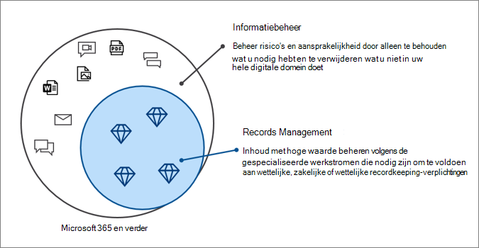

# Microsoft Information Governance in Microsoft 365Microsoft Information Governance in Microsoft 365

>*[Richtlijnen voor Microsoft 365-licenties voor beveiliging en compliance](/office365/servicedescriptions/microsoft-365-service-descriptions/microsoft-365-tenantlevel-services-licensing-guidance/microsoft-365-security-compliance-licensing-guidance).**[Microsoft 365 licensing guidance for security & compliance](/office365/servicedescriptions/microsoft-365-service-descriptions/microsoft-365-tenantlevel-services-licensing-guidance/microsoft-365-security-compliance-licensing-guidance).*

Gebruik Microsoft Information Governance-mogelijkheden (soms afgekort tot MIG) om uw gegevens te beheren voor nalevings- of wettelijke vereisten.Use Microsoft Information Governance (sometimes abbreviated to MIG) capabilities to govern your data for compliance or regulatory requirements.

Wilt u uw gegevens beschermen?Looking to protect your data? Zie [Microsoft Information Protection in Microsoft 365](information-protection.md).See [Microsoft Information Protection in Microsoft 365](information-protection.md).

## InformatiebeheerInformation governance

Om te bewaren wat u nodig hebt en te verwijderen wat u niet nodig hebt:To keep what you need and delete what you don't:
 
|MogelijkheidCapability|Welke problemen worden ermee opgelost?What problems does it solve?|Aan de slagGet started|
|:------|:------------|:--------------------|:-----------------------------|
|[Bewaarbeleid en retentielabelsRetention policies and retention labels](retention.md)| Inhoud bewaren of verwijderen met beleidsbeheer en een verwijderingswerkstroom voor e-mail, documenten, chatberichten en meerRetain or delete content with policy management and a deletion workflow for email, documents, instant messages, and more   Voorbeeldscenario: [Een retentielabel automatisch toepassen op inhoud](apply-retention-labels-automatically.md)Example scenario: [Apply a retention label to content automatically](apply-retention-labels-automatically.md) | [Aan de slag met bewaarbeleid en retentielabelsGet started with retention policies and retention labels](get-started-with-retention.md)|
|[ImportserviceImport service](importing-pst-files-to-office-365.md)| PST-bestanden bulksgewijs importeren in Exchange Online-postvakken om e-mailberichten te bewaren en te doorzoeken voor nalevings- of wettelijke vereistenBulk-import PST files to Exchange Online mailboxes to retain and search email messages for compliance or regulatory requirements | [Uploaden via het netwerk gebruiken om de PST-bestanden van uw organisatie te importeren in Microsoft 365Use network upload to import your organization's PST files to Microsoft 365](use-network-upload-to-import-pst-files.md)|
|[Gegevens van derden archiverenArchive third-party data](archiving-third-party-data.md)| Gegevens van derden uit sociale-mediaplatformen, chatplatformen en documentsamenwerkingsplatformen importeren, archiveren en er nalevingsoplossingen op toepassenImport, archive, and apply compliance solutions to third-party data from social media platforms, instant messaging platforms, and document collaboration platforms| [Connectors van derdenThird-party connectors](archiving-third-party-data.md#third-party-data-connectors)|
|[Inactieve postvakkenInactive mailboxes](inactive-mailboxes-in-office-365.md)| Postvakinhoud bewaren nadat werknemers de organisatie verlatenRetain mailbox content after employees leave the organization | [Inactieve postvakken maken en beherenCreate and manage inactive mailboxes](create-and-manage-inactive-mailboxes.md)|

## RecordbeheerRecords management

Hoogwaardige inhoud beheren voor juridische, zakelijke of wettelijke verplichtingen:To manage high-value content for legal, business, or regulatory obligations:

|MogelijkheidCapability|Welke problemen worden ermee opgelost?What problems does it solve?|Aan de slagGet started|
|:------|:------------|---------------------|:----------------------------|
|[RecordbeheerRecords management](records-management.md)| Eén oplossing voor e-mail en documenten die bewaarschema's en vereisten opneemt in een bestandsplan dat de volledige levenscyclus van uw inhoud ondersteunt met declaratie, bewaring en verwijdering van recordsA single solution for email and documents that incorporates retention schedules and requirements into a file plan that supports the full lifecycle of your content with records declaration, retention, and disposition   Voorbeeldscenario: [Verwijdering van records](disposition.md#disposition-of-records)Example scenario: [Disposition of records](disposition.md#disposition-of-records)|[Aan de slag met recordbeheerGet started with records management](get-started-with-records-management.md) |