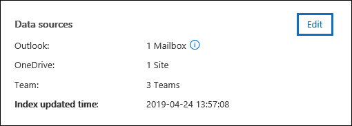

# Beheerders beheren in een Advanced eDiscovery zaak

De pagina Bewaarders op het **tabblad Bronnen** in Advanced eDiscovery zaak bevat een lijst met alle bewaarders die aan de zaak zijn toegevoegd. Nadat u bewaarders aan een zaak hebt toevoegen, worden gegevens over elke bewaarder automatisch verzameld uit Azure Active Directory en kunnen ze worden bekeken in Advanced eDiscovery.

## Bewaardetails weergeven

Als u de details van een voogd wilt bekijken, klikt u op de bewaarder in de lijst op **het tabblad Bewaarders.** Er wordt een flyoutpagina weergegeven met de volgende informatie over de bewaarder:

- Contactgegevens

  - **Weergavenaam:** de naam die wordt weergegeven in het adresboek voor de bewaarder. Dit is meestal de combinatie van de voornaam, het middelste begin en de achternaam van de bewaarder.
  
   - **Mail/SMTP:** het primaire SMTP-adres voor de beheerder, bijvoorbeeld brianj@contoso.onmicrosoft.com. De naam van de hoofdgebruiker (UPN) van de bewaarder wordt ook vermeld.

  - **Titel** - De functie van de bewaarder.

  - **Afdeling** - De naam van de afdeling waarin de voogd werkt.

  - **Manager** - De beheerder van de voogd. De aangewezen manager ontvangt elke escalatiecommunicatie voor deze beheerder.
  
- Locatiegegevens

  - **Plaats** : de plaats waar de bewaarder zich bevindt.

  - **Staat** - De staat of provincie in het adres van de bewaarder.

  - **Land/regio** : het land/de regio waar de bewaarder zich bevindt.

  - **Office** - De kantoorlocatie in de bedrijfsruimte van de beheerder.

- Case-informatie

  - **Status van wacht** houden: geeft aan of de bewaarder in de wacht is geplaatst. 

  - **Communicatiestatus:** geeft aan of de bewaarder een bewaartermijn heeft gekregen. Als de bewaarder een kennisgeving heeft afgegeven, wordt deze waarde van deze eigenschap **gepubliceerd.** Als de bewaarder geen kennisgeving heeft gekregen, is de status **Niet-gepubliceerd.** 

  - **Status** : de status van de bewaarder in de zaak. Een status van **Actief** geeft aan dat de bewaarder deel uitmaakt van de zaak. Als een voogd uit een zaak wordt vrijgegeven, wordt de status gewijzigd in **Uitgebracht.** 

- Gegevensbronnen en indexeringsgegevens

    - **Gegevensbronnen:** toont het aantal en het type gegevensbronnen (postvakken, sites en Teams) dat is gekoppeld aan de bewaarder en die deel uitmaken van de zaak.

    - **Bijgewerkte tijd indexeren:** geeft de tijd en datum aan waarop de geavanceerde indexeringsbaan voor het laatst is geactiveerd. Deze eigenschap geeft ook aan wanneer het geavanceerde indexeringsproces momenteel wordt uitgevoerd.

## Een voogd bewerken

Naarmate uw zaak vordert, kunt u ontdekken dat er mogelijk aanvullende gegevensbronnen zijn die relevant zijn voor een specifieke bewaarder & uw zaak. In andere scenario's wilt u mogelijk bepaalde gegevensbronnen verwijderen die zijn beoordeeld en als niet relevant worden beschouwd.

De gegevensbronnen bijwerken die zijn gekoppeld aan een bewaarder:

1. Ga naar **eDiscovery > Advanced eDiscovery** en open de zaak.
  
2. Klik op **het tabblad** Bronnen.
  
3. Selecteer op **de pagina Bewaarders** een bewaarder in de lijst en klik **op Bewerken** op de flyoutpagina.

    
  
4. Klik **op het tabblad Gegevensbronnen** kiezen om de instellingen voor het postvak en Exchange OneDrive van de beheerder te wijzigen en klik op **Gegevensbronnen kiezen.**
  
5. Klik op het tabblad Extra **gegevensbronnen** selecteren om postvakken Teams, SharePoint of Exchange aan de bewaarder toe te voegen of te verwijderen. 

    Zie Beheerders toevoegen aan een zaak voor meer informatie over gegevensbronnen die zijn gekoppeld aan [een](add-custodians-to-case.md)voogd. 
  
6. Klik **op Bewaar bewaarplaats plaatsen om** de bewaarplaats voor de bewaarder in of uit te schakelen.

## Bewaargegevens opnieuw indexeren

In de meeste eDiscovery-werkstromen voor juridische onderzoeken wordt een subset van de gegevens van een bewaarder doorzocht nadat de bewaarder is toegevoegd aan een juridische zaak. Vanwege zeer grote bestandsgrootten of mogelijke gegevensbeschaving, kunnen sommige items in de gegevensbronnen die zijn gekoppeld aan een bewaarder gedeeltelijk worden geïndexeerd. Met de [geavanceerde indexeringsfunctie](indexing-custodian-data.md) in de Advanced eDiscovery kunnen de meeste gedeeltelijk geïndexeerde items automatisch worden gesaneerd door deze items op aanvraag opnieuw te indexeren.

Wanneer een bewaarder aan een zaak wordt toegevoegd, worden de gegevens in de gegevensbronnen die aan de bewaarder zijn gekoppeld, automatisch opnieuw geïndexeerd (door het geavanceerde indexeringsproces). Dit betekent dat u de gegevens op hun plaats kunt laten in plaats van de gegevens te moeten downloaden en herstellen en vervolgens offline kunt doorzoeken). Tijdens de levenscyclus van een juridische zaak kunnen nieuwe gegevensbronnen echter worden gekoppeld aan een bewaarder. In dit geval kunt u de gegevens van de bewaarder opnieuw indexeren door het geavanceerde indexeringsproces opnieuw uit te werken om gedeeltelijk geïndexeerde items te corrigeren en de index voor de gegevens van de bewaarder bij te werken.

Als u het proces voor het opnieuw indexeren wilt activeren om gedeeltelijk geïndexeerde items aan te pakken:

1. Ga naar **eDiscovery > Advanced eDiscovery** en open de zaak.

2. Klik op **het tabblad** Bronnen.

3. Selecteer op **de pagina Bewaarders** een bewaarder waarvan de gegevens opnieuw moeten worden geïndexeerd.

4. Klik op de flyoutpagina op **Index bijwerken.**

   Er wordt een dialoogvenster weergegeven waarin wordt gezegd dat de indexbaan is gemaakt.

Het opnieuw indexeren van bewaargegevens is een langlopende procedure. de bijbehorende taak die is gemaakt, heet Gegevens van beheerders opnieuw **indexeren.** U kunt de voortgang bijhouden op **het** tabblad Taken of op het tabblad **Bewaarders** door de status in de kolom **Indexeringsstatus te** controleren.

Zie voor meer informatie:

- [Werken met verwerkingsfouten](processing-data-for-case.md)

- [Taken beheren](managing-jobs-ediscovery20.md)

## Een bewaarder vrij laten van een zaak

Een bewaarder wordt uitgebracht in situaties waarin een zaak is gesloten, de bewaarder niet langer verplicht is inhoud voor een zaak te bewaren of wanneer de bewaarder niet langer relevant wordt geacht voor de zaak. 

Als u een bewaarder vrij laat nadat een bewaartermijn is gepubliceerd, wordt een releasebericht verzonden naar de bewaarder. Bovendien worden alle bewaarnemingen die zijn geplaatst op gegevensbronnen die aan de bewaarder zijn gekoppeld, verwijderd. Als de bewaarder is geplaatst in een stilte- of bewaartermijn, waarbij geen meldingen over wettelijke bewaartermijnen zijn afgegeven, wordt er geen releasemelding verzonden, maar worden alle bewaarnemingen die zijn geplaatst op gegevensbronnen die aan die bewaarder zijn gekoppeld, verwijderd.

Een bewaarder vrij laten: 

1. Ga naar **eDiscovery > Advanced eDiscovery** en open de zaak.

2. Klik op **het tabblad** Bronnen.

3. Selecteer op **de pagina Bewaarders** de bewaarder die uit de zaak wordt vrijgegeven.

4. Klik op de flyoutpagina op **Release bewaarder.**

   Er wordt een waarschuwingspagina weergegeven waarin wordt uitgelegd dat als een bewaarplaats wordt geplaatst op een gegevensbron die aan de bewaarder is gekoppeld, de bewaarplaats wordt verwijderd en dat alle andere bewaarplaats die is gekoppeld aan een ander Advanced eDiscovery-geval, nog steeds van toepassing is. Dit geldt ook voor andere typen bewarings- en bewaarfuncties (zoals een Microsoft 365 bewaarbeleid).

5. Klik **op Ja** om te bevestigen dat u de bewaarder wilt vrij laten. 

    De status voor deze gebruiker op het tabblad **Bewaarders** is ingesteld op **Uitgebracht** en de **status Wacht** op de flyout-pagina wordt gewijzigd in **Onwaar.** 

> [!NOTE]
> Een bewaarder kan tegelijk betrokken zijn bij verschillende rechtszaken. Wanneer een voogd uit een zaak wordt vrijgegeven, worden de bewaar- en meldingen voor andere zaken niet beïnvloed.

## Beheerders bulksgewijs bewerken

U kunt de bulkeditor gebruiken om meerdere bewaarders tegelijk te bewerken. Hiervoor selecteert u twee of meer bewaarders op het tabblad **Bewaarders** om de bulkeditor weer te geven en klikt u vervolgens op een van de taken.

