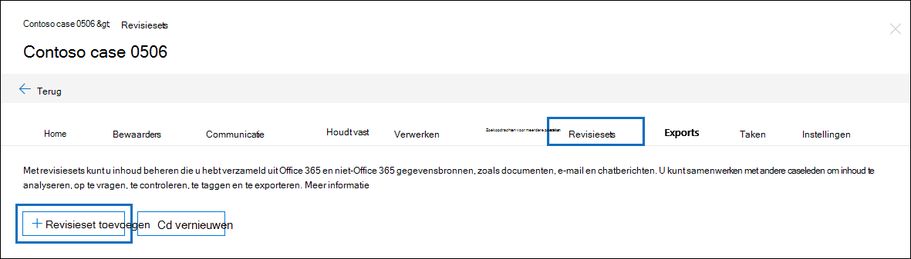
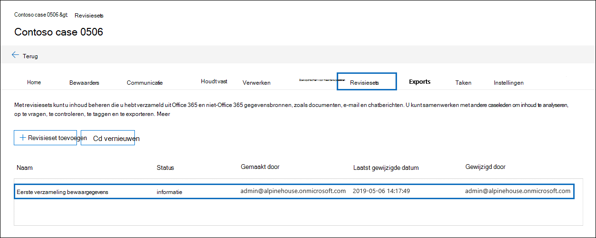
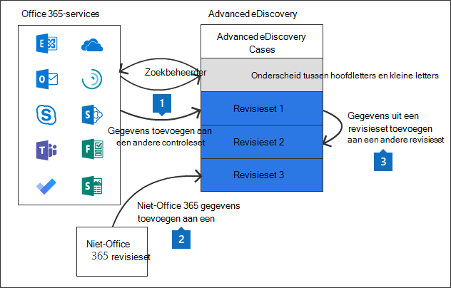

# Revisiesets beheren in Advanced eDiscovery

Revisiesets zijn een statische set documenten waarin u gegevens in een zaak kunt analyseren, query's kunt uitvoeren, weergeven, taggen en exporteren. Zie voor meer informatie over het uitvoeren van deze taken:

- [Gegevens in een revisieset analyseren](analyzing-data-in-review-set.md)

- [Een query uitvoeren op de gegevens in een controleset](review-set-search.md)

- [Documenten weergeven in een controleset](view-documents-in-review-set.md)

- [Documenten taggen in een controleset](tagging-documents.md)

- [Casegegevens exporteren](exporting-data-ediscover20.md)

## Een revisieset maken

Revisiesets kunnen worden gemaakt op het tabblad **Revisiesets** door op **+ Revisieset toevoegen te klikken.**

Typ op **de flyout** pagina Revisieset toevoegen een naam voor de revisieset en klik vervolgens op **Opslaan.** De nieuwe revisieset wordt weergegeven in de lijst op **het tabblad Revisiesets.**

Er zijn drie verschillende manieren om gegevens toe te voegen aan een revisieset in een Advanced eDiscovery geval.

1. [Zoekresultaten toevoegen aan een controleset](add-data-to-review-set.md)

2. [Niet-Microsoft 365 in een revisieset laden](load-non-Office-365-data-into-a-review-set.md)

3. [Gegevens toevoegen aan een revisieset uit een andere revisieset](add-data-to-review-set-from-another-review-set.md)
