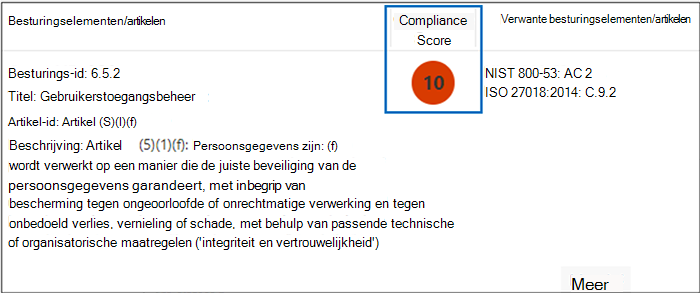
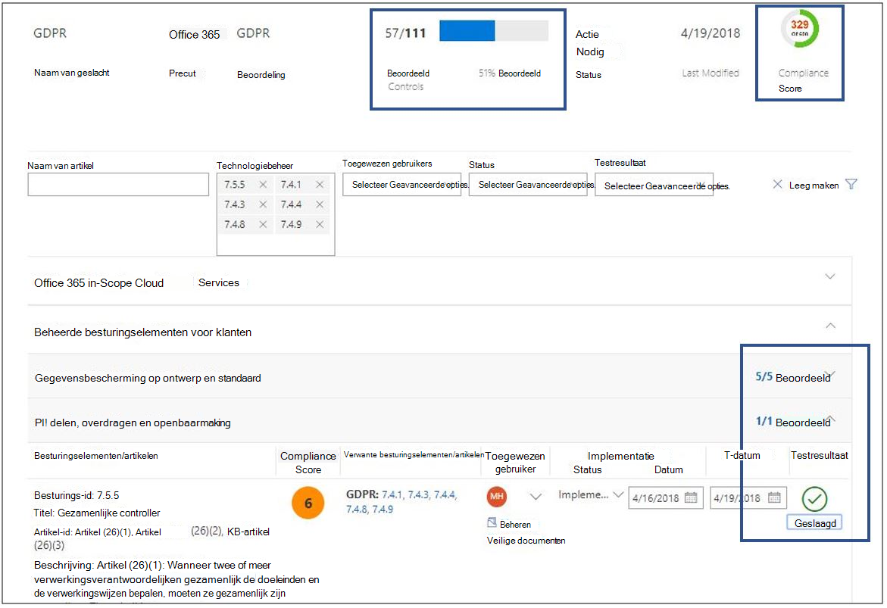
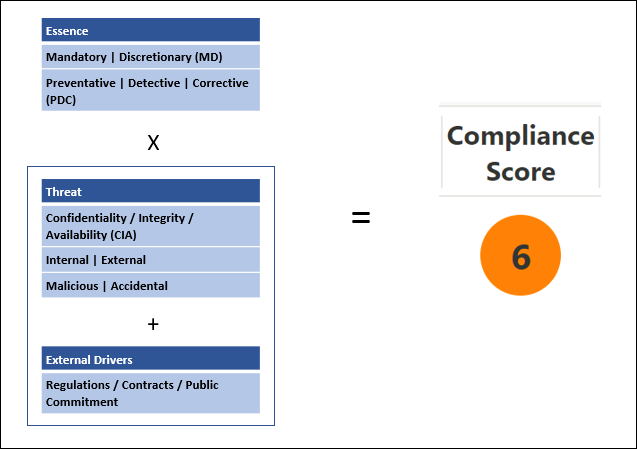
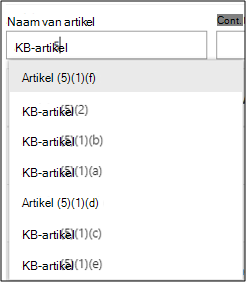

# Microsoft Compliancebeheer (klassiek)

> [!IMPORTANT]
> **Compliancebeheer (klassiek) wordt binnenkort verwijderd uit de Microsoft Service Trust Portal.** Het is raadzaam om over te stappen op de nieuwe versie van [Compliancebeheer in het Microsoft 365-compliancecentrum](https://compliance.microsoft.com/). Dit biedt een verbeterde gebruikerservaring en bijgewerkte toewijzing van controles. Klanten met beoordelingen in de klassieke versie moeten nieuwe beoordelingen maken in het nieuwe Compliancebeheer. Bestaande gegevens, inclusief uw beoordelingen, controles en andere gegevens, worden niet overgebracht naar het nieuwe Compliancebeheer. [Lees meer over de overgang](compliance-manager-faq.md#whats-happening-to-compliance-manager-classic-in-the-service-trust-portal).

*Compliancebeheer is niet beschikbaar in Office 365 beheerd door 21Vianet, Office 365 Germany, Office 365 U.S. Government Community High (GCC Hoog) of Office 365 Department of Defense.*

Met Compliancebeheer, een op werkstromen gebaseerd hulpprogramma voor risicoanalyse in de Microsoft [Service Trust Portal](./get-started-with-service-trust-portal.md), kunt u de complianceactiviteiten op het gebied van regelgeving van uw organisatie bijhouden, toewijzen en verifiëren voor Microsoft Professional Services en Microsoft-cloudservices, zoals Microsoft Office 365, Microsoft Dynamics 365 en Microsoft Azure.

Compliancebeheer:

- Combineert de gedetailleerde informatie die Microsoft aan auditors en regulerende instanties levert als onderdeel van verschillende audits door derden van de cloudservices van Microsoft op basis van verschillende standaarden (bijvoorbeeld ISO 27001, ISO 27018 en NIST) en informatie die Microsoft intern verzamelt op basis van de compliance van regelgeving (zoals HIPAA en de algemene verordening gegevensbescherming of AVG van de EU) met uw eigen zelfevaluatie van de compliance van deze standaarden en regelgeving door uw organisatie.

- Hiermee kunt u compliance- en evaluatieactiviteiten toewijzen, bijhouden en registreren, zodat uw organisatie obstakels voor teams kan oplossen om de compliancedoelstellingen te bereiken.

- Biedt een compliancescore waarmee u uw voortgang kunt bijhouden en prioriteiten kunt stellen voor de auditcontroles die zorgen dat de risico's in uw organisatie worden beperkt.

- Biedt een veilige opslagplaats voor het uploaden en beheren van bewijs en andere artefacten met betrekking tot uw complianceactiviteiten.

- Levert gedetailleerde rapporten in Microsoft Excel over de complianceactiviteiten die door Microsoft en uw organisatie worden uitgevoerd. Deze rapporten kunnen worden gestuurd naar auditors, regulerende instanties en andere belanghebbenden voor compliance.

> [!IMPORTANT]
> Compliancebeheer is een dashboard dat een overzicht biedt van de status van uw gegevensbescherming en compliance en aanbevelingen geeft voor het verbeteren van de gegevensbescherming en compliance. Acties van de klant in Compliance Manager zijn aanbevelingen. Het is aan elke organisatie om de effectiviteit van deze aanbevelingen te evalueren in hun respectieve regelgevingsomgeving, voorafgaand aan implementatie. Aanbevelingen van Compliancebeheer mogen niet worden geïnterpreteerd als een garantie voor compliance.

## Wat is Compliancebeheer?

Compliancebeheer is een op werkstromen gebaseerd hulpprogramma voor risicoanalyse waarmee u de compliance van regelgeving kunt beheren binnen het model voor gedeelde verantwoordelijkheid van de cloud. Compliancebeheer bevat een dashboardweergave van standaarden en voorschriften en beoordelingen met de implementatiedetails en testresultaten voor controles van Microsoft en implementatierichtlijnen en -tracering voor klantcontroles die uw organisatie kan invoeren. Compliancebeheer biedt controledefinities voor certificeringsevaluaties, richtlijnen voor de implementatie en het testen van controles, het vaststellen van scores voor controles op basis van risico's, op rollen gebaseerd toegangsbeheer en een in-place werkstroom voor actietoewijzing voor controles om controle-implementatie, teststatus en bewijsbeheer bij te houden. Compliancebeheer optimaliseert de compliancewerkbelasting, omdat klanten evaluaties op logische wijze kunnen groeperen en tests voor evaluatiecontroles toe te passen op identieke of verwante controles. Zo hoeft er niet dubbel werk te worden gedaan om te voldoen aan identieke controlevereisten voor verschillende certificeringen.

## Evaluaties in Compliancebeheer

Het kernonderdeel van Compliancebeheer wordt een *Evaluatie* genoemd. Een Evaluatie is een evaluatie van een Microsoft-service op basis van een certificeringsstandaard of regelgeving voor gegevensbescherming (zoals ISO 27001:2013 en de AVG). Met evaluaties kunt u de gegevensbeschermings- en compliancestatus van uw organisatie bekijken ten opzichte van de geselecteerde industriestandaard voor de geselecteerde Microsoft-cloudservice. Evaluaties worden voltooid door de implementatie van de controles die zijn toegewezen aan de certificeringsstandaard die wordt geëvalueerd.

De structuur van een evaluatie is gebaseerd op de verantwoordelijkheid die Microsoft en uw organisatie delen voor het evalueren van beveiligings- en compliancerisico's in de cloud en voor de implementatie van de beveiliging voor gegevensbescherming die is opgegeven door een compliancestandaard, gegevensbeschermingsstandaard, regelgeving of wet.

Een evaluatie bestaat uit verschillende onderdelen:

- **Services in het bereik**: elke evaluatie is van toepassing op een specifieke set Microsoft-services, die worden vermeld in de sectie Cloudservices in bereik.

- **Door Microsoft beheerde controles**: voor elke cloudservice implementeert en beheert Microsoft een set *controles* als onderdeel van de compliance van verschillende standaarden en voorschriften door Microsoft. Deze controles zijn ingedeeld in *controlegroepen* die zijn afgestemd op de structuur van de bijbehorende certificering of regelgeving voor de desbetreffende evaluatie. Voor elke door Microsoft beheerde controle bevat Compliancebeheer informatie over hoe Microsoft de controle heeft geïmplementeerd, samen met hoe en wanneer de implementatie is getest en gevalideerd door een onafhankelijke, externe auditor.

  Hier is een voorbeeld van drie Microsoft-controles in de controlegroep **Beveiliging** van een evaluatie van Office 365 en de AVG.

    

  a. Geeft de volgende informatie op uit de certificering of regelgeving die is toegewezen aan de controle van Microsoft.

  - **Controle-id**: het sectie- of artikelnummer uit de certificering of regelgeving die aan de controle is toegewezen.

  - **Titel**: de titel van de bijbehorende certificering of regelgeving.

  - **Artikel-id**: dit veld is alleen opgenomen voor AVG-evaluaties, omdat dit het bijbehorende artikelnummer voor de AVG aangeeft.

  - **Beschrijving**: de tekst van de standaard of regelgeving die is toegewezen aan de geselecteerde, door Microsoft beheerde controle.

  b. De compliancescore voor de controle, waarmee het risiconiveau (als gevolg van een fout in verband met niet-compliance of controle) wordt aangegeven dat is gekoppeld aan elke door Microsoft beheerde controle. Zie [De compliancescore](#understanding-the-compliance-score) voor meer informatie. Compliancescores worden beoordeeld van 1 tot en met 10 en hebben kleurcodes. Geel geeft controles met laag risico aan, oranje staat voor controles met gemiddeld risico en rood geeft controles met hoog risico aan.

  c. Informatie over de implementatiestatus van een controle, de datum waarop de controle is getest, wie de test heeft uitgevoerd en het testresultaat.

  d. Voor elke controle kunt u op **Meer** klikken voor aanvullende informatie, waaronder details van de implementatie van de controle door Microsoft en informatie over hoe de controle is getest en gevalideerd door een onafhankelijke, externe auditor.

- **Door de klant beheerde controles**: dit is de verzameling controles die worden beheerd door uw organisatie. Uw organisatie is verantwoordelijk voor de implementatie van deze controles als onderdeel van uw complianceproces voor een bepaalde standaard of regelgeving. Door de klant beheerde controles zijn ook ingedeeld in controlegroepen voor de bijbehorende certificering of regelgeving. Gebruik de door de klant beheerde controles om de aanbevolen acties te implementeren die door Microsoft worden voorgesteld als onderdeel van uw complianceactiviteiten. Uw organisatie kan met de voorgeschreven richtlijnen en aanbevolen klantacties voor elke door de klant beheerde controle het implementatie- en evaluatieproces voor deze controle beheren.

  Door de klant beheerde controles in Evaluaties hebben ook ingebouwde functionaliteit voor werkstroombeheer waarmee u de voortgang van uw organisatie bij te houden wat betreft het voltooien van de evaluatie. Een compliance officer in uw organisatie kan bijvoorbeeld een actie-item toewijzen aan een IT-beheerder die de verantwoordelijkheid en de benodigde machtigingen heeft om de acties uit te voeren die worden aanbevolen voor de controle. Wanneer deze werkzaamheden zijn voltooid, kan de IT-beheerder bewijs van de implementatietaken (bijvoorbeeld schermafbeeldingen van configuratie- of beleidsinstellingen) uploaden en het actie-item vervolgens weer toewijzen aan de compliance officer om het verzamelde bewijs te evalueren, de implementatie van de controle te testen en de implementatiedatum en testresultaten vast te leggen in Compliancebeheer. Zie de sectie [Het evaluatieproces beheren](#managing-the-assessment-process) in het artikel voor meer informatie.

## Machtigingen en op rollen gebaseerd toegangsbeheer

In Compliancebeheer wordt een machtigingsmodel voor op rollen gebaseerd toegangsbeheer gebruikt. Alleen gebruikers aan wie een gebruikersrol is toegewezen, hebben toegang tot Compliancebeheer en de acties die voor elke gebruiker zijn toegestaan, worden beperkt per roltype.

Er is geen standaardrol **Gasttoegang** meer. Aan elke gebruiker moet een rol worden toegewezen om toegang te krijgen tot en te werken binnen Compliancebeheer.

In de volgende tabel wordt elke machtiging van Compliancebeheer beschreven en wat de gebruiker hiermee kan doen. In de tabel wordt ook aangegeven aan welke rol elke machtiging is toegewezen.

|Machtiging|Compliancebeheer - Lezer|Compliancebeheer - Inzender|Compliancebeheer - Beoordelaar|Compliancebeheer - Beheerder|Portalbeheerder|
|---|:---:|:---:|:---:|:---:|:---:|
|**Gegevens lezen**: gebruikers kunnen gegevens lezen, maar niet bewerken.||||||
|**Gegevens bewerken**: gebruikers kunnen alle velden bewerken, behalve de velden Testresultaat en Testdatum.||||||
|**Testresultaten bewerken**: gebruikers de velden Testresultaat en Testdatum bewerken.||||||
|**Evaluaties beheren**: gebruikers kunnen evaluaties maken, archiveren en verwijderen.||||||
|**Gebruikers beheren**: gebruikers kunnen andere gebruikers in hun organisatie toevoegen aan de rollen Lezer, Inzender, Beoordelaar en Beheerder. Alleen gebruikers met de rol Globale beheerder in uw organisatie kunnen gebruikers toevoegen aan of verwijderen uit de rol Portalbeheerder.||||||
|

## De compliancescore

In het dashboard van Compliancebeheer wordt de rechtsboven in de tegel een totale score weergegeven voor Office 365-evaluaties. Dit is de totale compliancescore voor de evaluatie die bestaat uit alle punten die zijn ontvangen voor elke controle-evaluatie die is gemarkeerd als Geïmplementeerd en getest in de evaluatie. Wanneer u een evaluatie toevoegt, ziet u dat de compliancescore al bijna klaar is, omdat de punten voor de door Microsoft beheerde controles die door Microsoft zijn geïmplementeerd en door onafhankelijke partijen zijn getest, al zijn toegepast.

De resterende punten zijn het resultaat van een succesvolle evaluatie van de klantcontrole, van de implementatie en test van de door de klant beheerde controles. Elk daarvan heeft een specifieke waarde die wordt opgeteld bij de totale compliancescore.

Bij elke evaluatie wordt een op risico's gebaseerde compliancescore weergegeven zodat u het risiconiveau (vanwege een fout door niet-compliance of controle) kunt evalueren dat is gekoppeld aan elke controle (inclusief door Microsoft beheerde en door de klant beheerde controles) in een evaluatie. Aan elke door de klant beheerde controle wordt een mogelijk aantal punten (een zogenaamde *ernstclassificatie) toegewezen op een schaal van 1 tot 10, waarbij meer punten worden toegekend voor controles waarvoor een hogere risicofactor geldt als de controle mislukt en er minder punten worden toegekend voor controles met een lager risico.

De controle voor de evaluatie van Gebruikerstoegangsbeheer die u hieronder ziet, heeft bijvoorbeeld een zeer hoge ernstclassificatie en krijgt een toegewezen waarde van 10.

 Ter vergelijking: de controle voor de evaluatie van Gegevensback-up die u hieronder ziet, heeft een lagere ernstclassificatie en krijgt een toegewezen waarde van 3.

Aan elke controle wordt een standaardernstclassificatie toegewezen door Compliancebeheer. Risicoclassificaties worden berekend op basis van de volgende criteria:

- Of een controle incidenten voorkomt (hoogste classificatie), incidenten detecteert die zijn gebeurd of de gevolgen van een incident corrigeert (laagste classificatie). Bij de ernstclassificatie wordt aan een verplichte controle die een bedreiging voorkomt, het hoogste aantal punten toegewezen. Aan controles die detecteren of corrigeren (ongeacht of ze verplicht of discretionair zijn) wordt het laagste aantal punten toegewezen.

- Of een controle (na implementatie) verplicht is en daarom niet kan worden overgeslagen door gebruikers (bijvoorbeeld gebruikers die hun wachtwoord opnieuw moeten instellen en aan de wachtwoordvereisten voor lengte en tekens moeten voldoen) of discretionair en door gebruikers kan worden overgeslagen (bijvoorbeeld bedrijfsregels waarvoor gebruikers hun scherm moeten vergrendelen wanneer ze niet bij hun computer zijn).

- Controles met betrekking tot risico's voor vertrouwelijkheid, integriteit en beschikbaarheid van gegevens: of deze risico's afkomstig zijn van interne of externe bedreigingen en of de bedreiging schadelijk of onopzettelijk is. Aan controles die kunnen helpen voorkomen dat een externe kwaadwillende gebruiker inbreuk maakt op het netwerk en toegang krijgt tot persoonsgegevens, worden bijvoorbeeld meer punten toegewezen dan aan een controle die moet voorkomen dat een werknemer per ongeluk een netwerkrouterinstelling verkeerd configureert, wat zou leiden tot een netwerkstoring).

- Risico's met betrekking tot juridische en externe factoren, zoals contracten, voorschriften en openbare afspraken, voor elke controle.

De weergegeven compliancescorewaarden voor de controle worden *in zijn geheel* toegepast op de totale compliancescore op basis van goedgekeurd/afgekeurd: de controle wordt geïmplementeerd en slaagt voor de volgende evaluatietest of wordt afgekeurd. Een test kan niet gedeeltelijk slagen voor een gedeeltelijke implementatie. Alleen wanneer voor de controle de **implementatiestatus** is ingesteld op **Geïmplementeerd** of **Alternatieve implementatie** en het **Testresultaat** is ingesteld op **Geslaagd** worden de toegewezen punten toegevoegd aan de totale compliancescore.

Het belangrijkste is dat u met de compliancescore de prioriteit kunt bepalen van de controles die als eerste moeten worden geïmplementeerd. Er wordt namelijk aangegeven welke controles een groter potentieel risico vormen als er een fout optreedt bij een controle. Als evaluatiecontroles zijn gerelateerd aan andere controles (binnen dezelfde evaluatie of in een andere evaluatie in dezelfde evaluatiegroep), kost de synchronisatie van controletestresultaten aanzienlijk minder werk wanneer één controle met succes wordt afgerond.

In de onderstaande afbeelding zien we bijvoorbeeld dat de evaluatie Office 365 - AVG momenteel voor 46% is geëvalueerd en dat 51 van de 111 evaluatiecontroles zijn uitgevoerd voor een totale compliancescore van 289 van een mogelijke 600.

Binnen de evaluatie is AVG-controle 7.5.5 gerelateerd aan vijf andere controles (7.4.1, 7.4.3, 7.4.4, 7.4.8 en 7.4.9) die elk een gemiddelde tot hoge risicobeoordelingsscore van 6 of 8 hebben. We hebben al deze controles geselecteerd met het evaluatiefilter, waardoor ze zichtbaar zijn in de evaluatieweergave. Hieronder ziet u dat geen van deze controles zijn geëvalueerd.

 Omdat deze zes controles zijn gerelateerd, worden na voltooiing van een van de controles de testresultaten gesynchroniseerd voor de gerelateerde controles binnen de evaluatie (net zoals voor gerelateerde controles in een evaluatie die zich in dezelfde evaluatiegroep bevindt). Wanneer AVG-controle 7.5.5 is geïmplementeerd en getest, wordt het detailgebied van de controle vernieuwd en wordt aangegeven dat alle zes de controles zijn geëvalueerd. Hierbij neemt het aantal geëvalueerde controles toe tot 57 en 51% geëvalueerd wordt de totale compliancescore gewijzigd met +40.

Dit dialoogvenster met een bevestigingsupdate wordt weergegeven als u de implementatiestatus van een gerelateerde controle wilt wijzigen op een manier die van invloed is op de andere gerelateerde controles.

> [!NOTE]
> Momenteel hebben alleen evaluaties voor Office 365-cloudservices een compliancescore. Bij evaluaties voor Azure en Dynamics wordt een evaluatiestatus weergegeven.

## Methodologie voor compliancescore

De compliancescore, net zoals de Microsoft Secure Score, is vergelijkbaar met andere scoresystemen op basis van gedrag. De compliancescore van uw organisatie kan hoger worden wanneer activiteiten worden uitgevoerd op het gebied van gegevensbescherming, privacy en beveiliging.

> [!NOTE]
> De compliancescore is geen absolute maatstaf voor de compliance van een bepaalde standaard of regelgeving door de organisatie. Het geeft aan in hoeverre u maatregelen hebt genomen om de risico's voor persoonsgegevens en individuele privacy te verminderen. Geen enkele service kan garanderen dat u aan een standaard of regelgeving voldoet en de compliancescore mag op geen enkele wijze worden geïnterpreteerd als een garantie.

Evaluaties in Compliancebeheer zijn gebaseerd op het model voor gedeelde verantwoordelijkheid voor cloudcomputing. In het model voor gedeelde verantwoordelijkheid delen Microsoft en elke klant de verantwoordelijkheid voor de bescherming van de klantgegevens wanneer deze in onze cloud worden opgeslagen.

Zoals u kunt zien in de volgende AVG-evaluatie van Office 365, zijn Microsoft en de klanten beide verantwoordelijk voor het uitvoeren van diverse acties waarmee wordt voldaan aan de vereisten van de standaard of regelgeving die wordt geëvalueerd. Om inzicht te krijgen in de vereiste. Acties voor diverse standaarden en regelgevingen, worden alle standaarden en voorschriften in Compliancebeheer behandeld alsof het controleframeworks zijn. De acties die door Microsoft en door klanten voor elke evaluatie worden uitgevoerd, betreffen dus de implementatie en validatie van verschillende controles.

Hier is de basiswerkstroom voor een normale actie:

1. De compliance/risk/privacy officer en/of functionaris voor gegevensbescherming van een organisatie wijst de taak toe aan iemand binnen de organisatie om een controle te implementeren. Deze persoon is:

   - Een eigenaar van bedrijfsbeleid

   - Een IT-medewerker die verantwoordelijk is voor implementaties

   - Een andere persoon in de organisatie die verantwoordelijk is voor het uitvoeren van de taak

2. Deze persoon voert de benodigde taken voor het implementeren van de controle uit, uploadt bewijs van implementatie in Compliancebeheer en markeert de aan de actie gekoppelde controles als geïmplementeerd. Wanneer deze taken zijn voltooid, wordt de actie voor validatie toegewezen aan een beoordelaar. Beoordelaars kunnen:

   - Interne beoordelaars zijn die de controles binnen een organisatie valideren

   - Externe beoordelaars zijn die compliance onderzoeken, verifiëren en certificeren, zoals onafhankelijke externe organisaties die de cloudservices van Microsoft controleren

3. De beoordelaar valideert de controle, bekijkt het bewijs, markeert de controle(s) als geëvalueerd en geeft de resultaten van de evaluatie (bijvoorbeeld geslaagd) aan.

Nadat alle controles die aan een evaluatie zijn gekoppeld, zijn geëvalueerd, wordt de evaluatie als voltooid beschouwd.

Elke evaluatie in Compliancebeheer wordt vooraf geladen met informatie over de acties die Microsoft heeft uitgevoerd om te voldoen aan de vereisten van de controles waarvoor Microsoft verantwoordelijk is. Deze informatie bevat details over hoe Microsoft elke controle heeft geïmplementeerd en hoe en wanneer de implementatie van Microsoft is geëvalueerd en geverifieerd door een externe auditor. Daarom worden de door Microsoft beheerde controles voor elke evaluatie gemarkeerd als geëvalueerd, wat te zien is in de compliancescore voor de evaluatie.

Elke evaluatie bevat een totale compliancescore op basis van het model voor gedeelde verantwoordelijkheid. De implementatie en tests van Microsoft voor controles voor Office 365 vormen een deel van het totale aantal beschikbare punten dat is gekoppeld aan een AVG-evaluatie. Als de klant alle klantacties implementeert en test, wordt de compliancescore voor de evaluatie verhoogd met de waarde die aan de controle is toegewezen.

### Scoremethodologie op basis van risico's

In Compliancebeheer wordt een op risico's gebaseerde scoremethodologie gebruikt met een schaal tussen 1 en 10. Hierbij worden hogere waarden toegewezen aan controles die een hoger risico vormen als de controle mislukt of niet aan de compliance voldoet. Het scoresysteem dat voor de compliancescore wordt gebruikt, is gebaseerd op meerdere belangrijke factoren, zoals:

- De essentie van de controle

- Het risiconiveau van de controle op basis van de soorten bedreigingen

- De externe factoren voor de controle

### Essentie van de controle

De essentie van de controle is gebaseerd op of deze verplicht of discretionair is en of deze preventief, opsporend of corrigerend zijn.

### Verplicht of discretionair

 *Verplichte controles* zijn controles die niet bewust of per ongeluk kunnen worden overgeslagen. Een voorbeeld van een veelgebruikte, verplichte controle is een centraal beheerd wachtwoordbeleid met vereisten voor lengte, complexiteit en verloop van wachtwoorden. Gebruikers moeten aan deze vereisten voldoen om toegang tot het systeem te krijgen.

 *Discretionaire controles* zijn controles waarbij gebruikers het beleid moeten kennen en hiernaar moeten handelen. Een beleid waarbij gebruikers hun computer moeten vergrendelen wanneer ze de computer verlaten, is bijvoorbeeld een discretionaire controle, omdat dit afhankelijk is van de gebruiker.

### Preventief, opsporend of corrigerend

*Preventieve controles* zijn controles waarmee specifieke risico's worden voorkomen. Het beveiligen van opgeslagen gegevens met versleuteling is bijvoorbeeld een preventieve controle tegen aanvallen, inbreuken enzovoort. Scheiding van verplichtingen is een preventieve controle voor het beheren van belangenverstrengeling en het beschermen tegen fraude.

*Opsporende controles* zijn controles waarbij systemen actief worden bewaakt om onregelmatigheden of gedrag te identificeren die een risico vormen of waarmee inbraak of een schending kan worden gedetecteerd. Het controleren van systeemtoegang en beheerdersacties met bevoegdheden zijn typen opsporende bewakingscontroles. Audits op het gebied van compliance van regelgeving zijn opsporende controles waarmee problemen met processen worden gevonden.

*Corrigerende controles* zijn controles die de nadelige effecten van een beveiligingsincident tot een minimum beperken, corrigerende acties uitvoeren om het directe effect te beperken en zo mogelijk de schade herstellen. Reactie op privacy-incidenten is een corrigerende controle waarmee schade wordt beperkt en systemen na een schending worden hersteld naar een operationele toestand.

Door elke controle te evalueren aan de hand van deze factoren, wordt de essentie van de controle bepaald en wordt er een waarde toegewezen op basis van het bijbehorende risico.

**Bedreiging**:

|Controle|Verplicht|Discretionair|
|---|---|----|
|**Preventief**|Hoog risico|Gemiddeld risico|
|**Opsporend**|Gemiddeld risico|Laag risico|
|**Corrigerend**|Gemiddeld risico|Laag risico|

Bedreiging verwijst naar alles wat een risico vormt voor de fundamentele, algemeen geaccepteerde beveiligingsstandaard, ook wel bekend als de VIB-driehoek voor gegevensbescherming: Vertrouwelijkheid, Integriteit en Beschikbaarheid:

- Vertrouwelijkheid betekent dat gegevens alleen kunnen worden gelezen en begrepen door vertrouwde, geautoriseerde partijen.

- Integriteit betekent dat gegevens niet zijn gewijzigd of vernietigd door onbevoegden.

- Beschikbaarheid betekent dat gegevens direct toegankelijk zijn met een hoge servicekwaliteit.

Een fout in een van deze kenmerken wordt beschouwd als een inbreuk op het systeem als geheel. Bedreigingen kunnen uit zowel interne als externe bronnen komen en de intentie van een gebruiker kan onopzettelijk of kwaadaardig zijn. Er wordt een schatting gemaakt van deze factoren in een bedreigingsmatrix waarin aan elke combinatie van scenario's risiconiveaus van hoog, gemiddeld of laag worden toegewezen.

|Factor|Intern|Intern|Extern|Extern|
|---|---|---|---|----|
||*Kwaadaardig*|*Onopzettelijk*|*Kwaadaardig*|*Onopzettelijk*|
|**Vertrouwelijkheid**|(H, G of L)|(H, G of L)|(H, G of L)|(H, G of L)|
|**Integriteit**|(H, G of L)|(H, G of L)|(H, G of L)|(H, G of L)|
|**Beschikbaarheid**|(H, G of L)|(H, G of L)|(H, G of L)|(H, G of L)|
|

**Externe factoren**:

|Contracten|Regelgeving|Publieke afspraken|
|---|---|---|
|(H, G of L)|(H, G of L)|(H, G of L)|

Externe factoren, zoals toepasselijke regelgeving, contracten en publieke afspraken, kunnen van invloed zijn op controles die zijn ontworpen om gegevens te beschermen en gegevenslekken te voorkomen. Aan elk van deze factoren worden de risicowaarden Hoog, Gemiddeld of Laag toegewezen.

Het geschatte aantal keer dat deze risicowaarden Hoog, Gemiddeld of Laag voorkomen in de 15 mogelijke risicoscenario's van VIB/bedreiging en Juridische/externe factoren, wordt gecombineerd om een gewicht voor risico's te bepalen. Daarbij wordt rekening gehouden met de waarschijnlijkheid en het aantal keer dat risico's met een bepaalde waarde als significant worden weergegeven. Dit wordt meegenomen wanneer de ernstclassificatie van de controle wordt berekend.

Op basis van de ernstclassificatie wordt aan de controle de compliancescore toegewezen, een getal tussen 1 (laag) en 10 (hoog), gegroepeerd in de volgende risicocategorieën:

|Risiconiveau|Controlewaarde|
|---|:---:|
|Laag|1-3|
|Gemiddeld|6|
|Hoog|8|
|Ernstig|10|

Door evaluatiecontroles met de hoogste waarden van de compliancescore de hoogste prioriteit te geven, richt de organisatie zich op de items met het hoogste risico en krijgt deze proportioneel hogere positieve feedback omdat er meer punten worden toegevoegd aan de totale compliancescore voor de evaluatie voor elke voltooide controle-evaluatie.

### Overzicht van scoremethodologie

De compliancescore is een belangrijk onderdeel van de manier waarop organisaties inzicht krijgen in de compliance en dit kunnen beheren met behulp van Compliancebeheer. De compliancescore voor een evaluatie is een uitdrukking van de compliance door het bedrijf van een bepaalde standaard of regelgeving als getal, waarbij een hoge score (tot het maximum aantal punten dat aan de evaluatie is toegewezen) betekent dat de compliancestatus van het bedrijf goed is. Organisaties kunnen optimaal prioriteiten bepalen voor hun acties als ze inzicht hebben in de methodologie van de compliancescore, waarbij waarden voor de ernst van risico's tussen 1 - 10 (laag tot hoog) worden toegewezen aan evaluatiecontroles, en als ze begrijpen hoe voltooide controle-evaluaties worden opgeteld bij de totale compliancescore.

## Evaluaties groeperen

Wanneer u een nieuwe evaluatie maakt, wordt u gevraagd een groep te maken waaraan u de evaluatie toewijst of om deze toe te wijzen aan een bestaande groep. Met groepen kunt u evaluaties logisch indelen en gemeenschappelijke informatie en werkstroomtaken delen tussen evaluaties met dezelfde of vergelijkbare, door de klant beheerde controles.

U kunt evaluaties bijvoorbeeld groeperen op jaar, teams, afdelingen of instanties binnen uw organisatie. Hier zijn enkele voorbeelden van groepen en de evaluaties die deze kunnen bevatten.

- AVG-evaluaties - 2018

  - Office 365 + AVG

  - Azure + AVG

  - Dynamics + AVG

- Azure-evaluaties - 2018

  - Azure + AVG

  - Azure + ISO 27001:2013

  - Azure + ISO 27018:2014

- Evaluaties voor gegevensbeveiliging en privacy

  - Office 365 + ISO 27001:2013

  - Office 365 + ISO 27018:2014

  - Azure + ISO 27001:2013

  - Azure + ISO 27018:2014

> [!TIP]
> Het is raadzaam om een groeperingsstrategie voor uw organisatie te bepalen voordat u nieuwe evaluaties toevoegt.

Dit zijn de vereisten voor het groeperen van evaluaties:

- Groepsnamen (ook wel groeps-id's genoemd) moeten uniek zijn binnen uw organisatie.

- Groepen kunnen evaluaties bevatten voor dezelfde certificering/regelgeving, maar elke groep kan slechts één evaluatie bevatten voor een specifieke combinatie van cloudservice/certificering. Een groep kan bijvoorbeeld geen twee evaluaties voor Office 365 en AVG bevatten. Een groep kan ook meerdere evaluaties voor dezelfde cloudservice bevatten, zolang de bijbehorende certificering/regelgeving voor elke groep verschillend is.

Nadat een evaluatie aan een evaluatiegroep is toegevoegd, kan de groepering niet meer worden gewijzigd. U kunt de naam van de evaluatiegroep wijzigen, waardoor de naam van de evaluatiegroep wordt gewijzigd voor alle evaluaties die aan deze groep zijn gekoppeld. U kunt een evaluatie en een nieuwe evaluatiegroep maken en gegevens uit een bestaande evaluatie kopiëren, waardoor een duplicaat van deze evaluatie in een andere evaluatiegroep wordt gemaakt. Wanneer u een evaluatie archiveert, wordt de relatie tussen deze evaluatie en de evaluatiegroep verbroken. Verdere updates in andere gerelateerde evaluaties worden niet meer doorgevoerd in de gearchiveerde evaluatie.

Zoals eerder is uitgelegd, is een belangrijk voordeel van groepen dat wanneer twee verschillende evaluaties in dezelfde groep dezelfde door de klant beheerde controles delen (en de klantacties dus voor elke controle hetzelfde zijn), de voltooiing van implementatiedetails, testgegevens en de status van de controle in de ene evaluatie wordt gesynchroniseerd met dezelfde controle in elke andere evaluatie in de groep. Met andere woorden, als evaluaties dezelfde controle bevatten en deze evaluaties zich in dezelfde groep bevinden, hoeft u alleen het evaluatieproces voor de controle in één evaluatie te beheren. De resultaten van deze controle worden automatisch gesynchroniseerd met andere evaluaties. ISO 27001 en ISO 27018 hebben bijvoorbeeld allebei een controle in verband met wachtwoordbeleid. Als de teststatus van de controle is ingesteld op Geslaagd in één evaluatie, wordt de controle bijgewerkt (en gemarkeerd als Geslaagd) in de andere evaluatie, zolang beide evaluaties deel uitmaken van dezelfde evaluatiegroep.

Bekijk als voorbeeld hiervan deze twee gerelateerde evaluatiecontroles, die beide te maken hebben met versleuteling van gegevens in openbare netwerken: controle 6.10.1.2 in de evaluatie Office 365 - AVG en controle SC-13 in de evaluatie Office 365 - NIST 800-53. Dit zijn gerelateerde evaluatiecontroles in twee verschillende evaluaties, beide in de standaardgroep. In eerste instantie zijn voor beide evaluaties geen klantcontrole-evaluaties voltooid, zoals u kunt zien in het Compliancebeheer-dashboard met deze twee evaluaties.

Door op de evaluatie **Office 365 - AVG** te klikken en met de filteropties AVG-controle 6.10.1.2 weer te geven, zien we dat NIST 800-53-controle SC-13 wordt weergegeven als gerelateerde controle.

 Hier zien we dat de implementatie en test van AVG-controle 6.10.1.2 is voltooid.

Door naar de bijbehorende controle in de gegroepeerde evaluatie te gaan, zien we dat NIST 800-53 SC-13 ook is gemarkeerd als voltooid met dezelfde datum en tijd, zonder extra implementatie- of testwerk.

In het dashboard kunt u zien dat voor elke evaluatie één controle-evaluatie is voltooid en dat de totale compliancescore voor elke evaluatie met 8 is verhoogd (de compliancescorewaarde van die gedeelde controle).

## Beheerfuncties

Er zijn specifieke beheerfuncties die alleen beschikbaar zijn voor het tenantbeheerdersaccount en die alleen zichtbaar zijn als u bent aangemeld als globale beheerder.

> [!NOTE]
> Met de machtiging Toegang tot beperkte documenten in de vervolgkeuzelijst kunnen beheerders gebruikers toegang geven tot beperkte documenten die Microsoft deelt in de Service Trust Portal. De functie Beperkte documenten is nog niet beschikbaar, maar komt binnenkort.

### Rollen van Compliancebeheer toewijzen aan gebruikers

Elke rol van Complianceeheer heeft machtigingen die enigszins verschillen. U kunt de machtigingen bekijken die aan elke rol zijn toegewezen, bekijken welke gebruikers welke rollen hebben en gebruikers aan die rol toevoegen of hieruit verwijderen via de Service Trust Portal. Dit doet u door het menu-item **Beheerder** te selecteren en vervolgens **Instellingen** te kiezen.

Als u gebruikers wilt toevoegen aan of verwijderen uit rollen van Compliancebeheer.

1. Ga naar [https://servicetrust.microsoft.com](https://servicetrust.microsoft.com).

2. Meld u aan met uw globale-beheerdersaccount van Azure Active Directory.

3. Klik op de bovenste menubalk van Service Trust Portal op **Beheerder** en kies **Instellingen**.

4. Klik in de vervolgkeuzelijst **Rol selecteren** op de rol die u wilt beheren.

5. Gebruikers die aan elke rol zijn toegevoegd, worden weergegeven op de pagina **Rollen selecteren**.

6. Klik op **Toevoegen** om gebruikers toe te voegen aan deze rol. Klik in het dialoogvenster **Gebruikers toevoegen** op het gebruikersveld. U kunt door de lijst met beschikbare gebruikers scrollen of beginnen met het typen van de gebruikersnaam om de lijst te filteren op basis van uw zoekterm. Klik op de gebruiker om dat account toe te voegen aan de lijst **Gebruikers toevoegen** voor deze rol. Als u meerdere gebruikers tegelijk wilt toevoegen, begint u een gebruikersnaam te typen om de lijst te filteren en klikt u op de gebruiker om deze aan de lijst toe te voegen. Klik **Opslaan** om de geselecteerde rol in te richten voor deze gebruikers.

   

7. Als u gebruikers uit deze rol wilt verwijderen, selecteert u de gebruiker(s) en klikt u op **Verwijderen**.

   

## Privacyinstellingen voor gebruikers

Volgens bepaalde regelgeving moet een organisatie gegevens uit de gebruikersgeschiedenis kunnen verwijderen. Hierdoor heeft Compliancebeheer de functies **Privacyinstellingen voor gebruikers** waarmee beheerders het volgende kunnen doen:

- [Een gebruiker zoeken](#search-for-a-user)

- [Een rapport met de accountgegevensgeschiedenis exporteren](#export-a-report-of-account-data-history)

- [Actiepunten opnieuw toewijzen](#reassign-action-items)

- [Gebruikersgeschiedenis verwijderen](#delete-user-data-history)

### Een gebruiker zoeken

Een gebruiker zoeken:

1. Voer het e-mailadres van de gebruiker in door de alias (de informatie links van het @-symbool) te typen en kies de domeinnaam door te klikken op de lijst met domeinachtervoegsels aan de rechterkant. Als dit een tenant is met meerdere geregistreerde domeinen, controleert u of het domeinachtervoegsel van het e-mailadres juist is.

2. Wanneer u de gebruikersnaam correct hebt ingevoerd, klikt u op **Zoeken**.

3. Als het gebruikersaccount niet wordt gevonden, wordt het foutbericht 'Gebruiker niet gevonden' weergegeven op de pagina. Controleer de e-mailadresgegevens van de gebruiker, breng zo nodig correcties aan en klik op **Zoeken** om het opnieuw te proberen.

4. Als het gebruikersaccount wordt gevonden, verandert de tekst van de knop van **Zoeken** in **Wissen**. Dit geeft aan dat het geretourneerde gebruikersaccount de bewerkingscontext is voor de aanvullende functies die hieronder worden weergegeven en dat deze functies worden uitgevoerd op dit gebruikersaccount.

5. Klik op **Wissen** als u de zoekresultaten wilt wissen en een andere gebruiker wilt zoeken.

### Een rapport met de accountgegevensgeschiedenis exporteren

Nadat het gebruikersaccount is geïdentificeerd, wilt u mogelijk een rapport genereren met de afhankelijkheden die aan dit account zijn gekoppeld. Met deze gegevens kunt u openstaande actie-items opnieuw toewijzen of ervoor zorgen dat er toegang is tot eerder geüpload bewijs.

 Een rapport genereren en exporteren:

1. Klik **Exporteren** om een rapport te genereren en te downloaden van de actie-items voor controles in Compliancebeheer die momenteel zijn toegewezen aan het geretourneerde gebruikersaccount en de lijst met documenten die door die gebruiker zijn geüpload. Als er geen toegewezen acties of geüploade documenten zijn, wordt het foutbericht 'Geen gegevens voor deze gebruiker' weergegeven.

2. Het rapport wordt op de achtergrond van het actieve browservenster gedownload. Als u het pop-upvenster voor downloaden niet ziet, controleert u de downloadgeschiedenis van uw browser.

3. Open het document om de rapportgegevens te bekijken.

> [!NOTE]
> Dit is geen historisch rapport waarin statuswijzigingen in de toewijzingsgeschiedenis van actie-items worden bewaard en weergegeven. Het gegenereerde rapport is een momentopname van de actie-items voor controles die zijn toegewezen op het moment waarop het rapport wordt uitgevoerd (datum- en tijdstempel in het rapport). Als u bijvoorbeeld actie-items opnieuw toewijst, worden er rapportgegevens voor een andere momentopname gegenereerd als dit rapport opnieuw wordt gegenereerd voor dezelfde gebruiker.

### Actie-items opnieuw toewijzen

Met deze functie kan een organisatie actieve of openstaande afhankelijkheden van het gebruikersaccount verwijderen door alle eigendom van actie-items (zowel actieve als voltooide actie-items) van het geretourneerde gebruikersaccount opnieuw toe te wijzen aan een nieuwe gebruiker die hieronder is geselecteerd. Met deze actie wordt de uploadgeschiedenis van documenten niet gewijzigd voor het geretourneerde gebruikersaccount.

 Actie-items opnieuw toewijzen aan een andere gebruiker:

1. Klik op het invoervak, blader naar een andere gebruiker binnen de organisatie en selecteer deze om de actie-items van de geretourneerde gebruiker toe te wijzen.

2. Selecteer **Vervangen** om alle actie-items voor controles van de geretourneerde gebruiker toe te wijzen aan de zojuist geselecteerde gebruiker.

3. Het volgende bevestigingsdialoogvenster verschijnt: 'Hiermee worden alle actie-items voor controles van de huidige gebruiker toegewezen aan de geselecteerde gebruiker. Deze actie kan niet ongedaan worden gemaakt. Weet u zeker dat u wilt doorgaan?'

4. Klik op **OK** om door te gaan of klik op **Annuleren**.

> [!NOTE]
> Alle actie-items (zowel actief als voltooid) worden toegewezen aan de zojuist geselecteerde gebruiker. Deze actie is echter niet van invloed op de uploadgeschiedenis van het document. Documenten die zijn geüpload door de eerder toegewezen gebruiker, bevatten nog steeds de datum/tijd en naam van de eerder toegewezen gebruiker.

Het wijzigen van de uploadgeschiedenis van het document om de eerder toegewezen gebruiker te verwijderen, moet handmatig worden uitgevoerd. In dat geval moet de beheerder:

1. Het eerder gedownloade exportrapport openen.

2. Het gewenste actie-item voor de controle opzoeken.

3. Klik **Documenten beheren** om naar de opslagplaats voor bewijs voor deze controle te gaan.

4. Download het document.

5. Verwijder het document in de opslagplaats voor bewijs.

6. Upload het document opnieuw. Het document heeft nu een nieuwe uploaddatum en -tijd en een nieuwe gebruikersnaam bij Geüpload door.

### Gebruikersgeschiedenis verwijderen

Hiermee stelt u actie-items voor controles worden in op Niet toegewezen voor alle actie-items die zijn toegewezen aan de geretourneerde gebruiker. Hiermee wordt ook Geüpload per waarde ingesteld op Gebruiker verwijderd voor documenten die door de geretourneerde gebruiker zijn geüpload

 Het actie-item van het gebruikersaccount en de documentuploadgeschiedenis verwijderen:

1. Klik op **Verwijderen**.

    Het volgende bevestigingsdialoogvenster verschijnt: 'Hiermee worden alle actie-items voor controles en de documentuploadgeschiedenis van de geselecteerde gebruiker verwijderd. Deze actie kan niet ongedaan worden gemaakt. Weet u zeker dat u wilt doorgaan?'

2. Klik op **OK** om door te gaan of klik op **Annuleren**.

## Compliancebeheer gebruiken

In Compliancebeheer kunt u compliance- en evaluatieactiviteiten toewijzen, bijhouden en registreren, zodat uw organisatie obstakels voor teams kan oplossen om de compliancedoelstellingen te bereiken.

## Toegang tot Compliancebeheer

U hebt toegang tot Compliancebeheer vanuit de Service Trust Portal. Iedereen met een Microsoft-account of een organisatieaccount van Azure Active Directory heeft toegang tot Compliancebeheer.

1. Ga naar [https://servicetrust.microsoft.com](https://servicetrust.microsoft.com/).

2. Meld u aan met uw gebruikersaccount van Azure Active Directory (Azure AD).

3. Klik in de Service Trust Portal op **Compliancebeheer**.

4. Wanneer de geheimhoudingsovereenkomst wordt weergegeven, leest u deze en klikt u op **Akkoord** om door te gaan. U hoeft dit slechts één keer te doen, waarna het dashboard van Compliancebeheer wordt weergegeven.

   Om u aan de slag te helpen, hebben we standaard de volgende evaluaties toegevoegd:

   

5. Klik op  **Help** voor een korte rondleiding door Compliancebeheer.

## Actie-items bekijken

Compliancebeheer bevat een handig overzicht van alle toegewezen items voor controle-evaluatie, zodat u snel en eenvoudig actie kunt ondernemen. U kunt alle actie-items weergeven of de actie-items selecteren die overeenkomen met een specifieke certificering door op het tabblad te klikken dat bij die evaluatie hoort. In de onderstaande afbeelding is bijvoorbeeld het tabblad AVG geselecteerd, met controles voor de AVG-evaluatie.

Uw actie-items weergeven:

1. Ga naar het dashboard van Compliancebeheer.

2. Klik op de koppeling **Actie-items**. De pagina wordt vernieuwd en de actie-items die aan u zijn toegewezen, worden weergegeven.

   Standaard worden alle actie-items weergegeven. Als u actie-items voor meerdere certificeringen hebt, worden de namen van de certificeringen weergegeven op tabbladen bovenaan de evaluatiecontrole. Als u de actie-items voor een specifieke certificering wilt bekijken, klikt u op het desbetreffende tabblad.

## Een evaluatie toevoegen

Een evaluatie toevoegen aan Compliancebeheer:

1. Klik in het dashboard Compliancebeheer op  **Evaluatie toevoegen**.

2. In het venster **Een evaluatie toevoegen** kunt u een nieuwe groep maken waaraan u de evaluatie wilt toevoegen of een bestaande groep selecteren (de ingebouwde groep heet Eerste groep). Afhankelijk van de optie die u kiest, typt u de naam van een nieuwe groep of selecteert u een bestaande groep in de vervolgkeuzelijst. Zie [Evaluaties groeperen](#grouping-assessments) voor meer informatie.

   Als u een groep maakt, kunt u ook gegevens uit een bestaande groep kopiëren naar de nieuwe evaluatie. Dat betekent dat alle gegevens die zijn toegevoegd aan de velden Implementatiedetails en Testplan en reactie van beheer van door de klant beheerde controles van evaluaties in de groep waaruit u kopieert, worden gekopieerd naar dezelfde (of gerelateerde) door de klant beheerde controles in de nieuwe evaluatie. Als u een nieuwe evaluatie toevoegt aan een bestaande groep, wordt algemene informatie uit evaluaties in die groep gekopieerd naar de nieuwe evaluatie. Zie [Gegevens kopiëren uit bestaande evaluaties](#copying-information-from-existing-assessments) voor meer informatie.

3. Klik op **Volgende** en voer de volgende handelingen uit:

   a. Kies in de vervolgkeuzelijst **Een product selecteren** een Microsoft-cloudservice waarvan u de compliance wilt evalueren.

   b. Kies in de vervolgkeuzelijst **Een certificeringsinstantie selecteren** een certificering aan de hand waarvan u de geselecteerde cloudservice wilt evalueren.

4. Klik **Toevoegen aan dashboard** om de evaluatie te maken. De evaluatie wordt als een nieuwe tegel toegevoegd aan het dashboard Compliancebeheer onderaan de lijst met bestaande tegels.

   Op de **Evaluatietegel** op het dashboard van Compliancebeheer ziet u de evaluatiegroepering, de naam van de evaluatie (automatisch gemaakt als combinatie van de servicenaam en de geselecteerde certificering), de datum waarop deze is gemaakt en voor het laatst is gewijzigd, de totale compliancescore (de som van alle risicowaarden voor toegewezen controles die zijn geïmplementeerd, getest en geslaagd) en voortgangsindicatoren onderaan die het aantal geëvalueerde controles aangeven.

5. Klik op de naam van de evaluatie om deze te openen en de details van de evaluatie te bekijken.

6. Klik op het menu **Acties** om uw toegewezen actie-items te bekijken, de naam van de evaluatiegroep te wijzigen, het evaluatierapport te exporteren of de evaluatie te archiveren.

   

## Gegevens kopiëren uit bestaande evaluaties

Zoals eerder is uitgelegd, kunt u wanneer u een evaluatiegroep maakt, gegevens uit evaluaties in een bestaande groep kopiëren naar de nieuwe evaluatie in de nieuwe groep. Hierdoor kunt u het evaluatie- en testwerk dat al is voltooid, toepassen op dezelfde door de klant beheerde controles in de nieuwe evaluatie. Als u bijvoorbeeld een groep hebt voor alle AVG-gerelateerde evaluaties in uw organisatie, kunt u algemene informatie uit bestaand evaluatiewerk kopiëren wanneer u een nieuwe evaluatie aan de groep toevoegt.

U kunt de volgende gegevens van de klant kopiëren naar een nieuwe evaluatie:

- Evaluatiegebruikers. Een evaluatiegebruiker is een gebruiker aan wie de controle is toegewezen.

- Status, testdatum en testresultaten.

- Implementatiedetails en informatie over testplannen.

Op dezelfde manier worden gegevens van gedeelde, door de klant beheerde controles binnen dezelfde evaluatiegroep gesynchroniseerd. En gegevens in gerelateerde, door de klant beheerde controles binnen dezelfde evaluatiegroep worden ook gesynchroniseerd.

## Evaluaties weergeven

1. Zoek de evaluatietegel voor de evaluatie die u wilt bekijken, klik op de naam van de evaluatie om deze te openen en bekijk de door Microsoft en de klant beheerde controles die aan de evaluatie zijn gekoppeld, samen met een lijst met de cloudservices die binnen het bereik van de evaluatie vallen. Hier is een voorbeeld van de evaluatie voor Office 365 en AVG.

   

2. In deze sectie vindt u de overzichtsgegevens van de evaluatie, inclusief de naam van de evaluatiegroepering, het product, de naam van de evaluatie, het aantal evaluatiecontroles

3. In deze sectie ziet u de filteropties van de evaluatie. Zie het gedeelte [Het evaluatieproces beheren](#managing-the-assessment-process) voor uitgebreide informatie over het gebruik van de filteropties voor de evaluatie.

4. In deze sectie ziet u de afzonderlijke cloudservices die binnen het bereik van de evaluatie vallen.

5. Deze sectie bevat door Microsoft beheerde controles. Gerelateerde controles zijn ingedeeld in controlegroepen. Klik op een controlegroep om deze uit te vouwen en afzonderlijke controles weer te geven.

6. Deze sectie bevat door de klant beheerde controles, die ook zijn ingedeeld in controlegroepen. Klik op een controlegroep om deze uit te vouwen en afzonderlijke controles weer te geven.

7. Hier wordt het totale aantal controles in de controlegroep weergegeven, samen met het aantal controles dat is geëvalueerd. Een belangrijke functie van Compliancebeheer is dat u de voortgang van uw organisatie bij het evalueren van door de klant beheerde controles kunt bijhouden. Zie het gedeelte [De compliancescore](#understanding-the-compliance-score) voor meer informatie.

## Het evaluatieproces beheren

De maker van een evaluatie is in eerste instantie de enige evaluatiegebruiker. Voor elke door de klant beheerde controle kunt u een actie-item toewijzen aan een persoon in uw organisatie, zodat deze persoon een evaluatiegebruiker wordt die de aanbevolen klantacties kan uitvoeren en bewijs kan verzamelen en uploaden. Wanneer u een actie-item toewijst, kunt u ervoor kiezen om een e-mail te verzenden met details, waaronder de aanbevolen klantacties en de prioriteit van het actie-item. De e-mailmelding bevat een koppeling naar het dashboard **Actie-items**, met alle actie-items die aan die persoon zijn toegewezen.

Hier ziet u een lijst met taken die u kunt uitvoeren met de werkstroomfuncties van Compliancebeheer.

1. **Gebruik de filteropties om te zoeken naar specifieke evaluatiecontroles** - Compliancebeheer bevat **Filteropties** waarmee u zeer gedetailleerde selectiecriteria kunt toepassen op de evaluatiecontroles, zodat u zich kunt richten op specifieke gebieden van uw complianceactiviteiten.

   Klik op het trechterpictogram rechts op de pagina om de **Filteropties** weer te geven of te verbergen. Met deze opties kunt u filtercriteria opgeven. Alleen de evaluatiecontroles die aan deze criteria voldoen, worden weergegeven. 

   - **Artikelen**: filtert op de naam van het artikel en retourneert de evaluatiecontroles die aan dat artikel zijn gekoppeld. Als u bijvoorbeeld 'Artikel (5)' typt, wordt een selectielijst weergegeven met artikelen waarvan de naam deze tekenreeks bevat, bijvoorbeeld Artikel (5)(1)(a), Artikel (5)(1)(b), Artikel (5)(1)(c) enzovoort. Als u artikel (5)(1)(c) selecteert, worden de controles geretourneerd die bij artikel (5)(1)(c) horen. Dit is een veld voor meervoudige selectie waarin een OF-operator met meerdere waarden wordt gebruikt. Als u bijvoorbeeld Artikel (5)(1)(a) selecteert en vervolgens Artikel (5)(1)(c) toevoegt, worden met het filter controles geretourneerd die zijn gekoppeld aan Artikel (5)(1)(a) of Artikel (5)(1)(c).

     

   - **Controles**: retourneert de lijst met controles waarvan de namen overeenkomen met het filter. Als u 7.3 typt, wordt een selectielijst met items zoals 7.3.1, 7.3.4, 7.3.5 enzovoort weergegeven. Dit is een veld voor meervoudige selectie waarin een OF-operator met meerdere waarden wordt gebruikt. Als u bijvoorbeeld 7.3.1 selecteert en vervolgens 7.3.4 toevoegt, retourneert het filter controles die zijn gekoppeld aan 7.3.1 of 7.3.4.

     

   - **Toegewezen gebruikers**: retourneert de lijst met controles die zijn toegewezen aan de geselecteerde gebruiker.

   - **Status**: retourneert de lijst met controles met de geselecteerde status.

   - **Testresultaat**: retourneert de lijst met controles met het geselecteerde testresultaat.

   Wanneer u filtervoorwaarden toepast, wordt de weergave van de toepasselijke controles aangepast aan de filtervoorwaarden. Vouw de secties met de controlegroepen uit om de details van de controle weer te geven.

   

2. Als er na het selecteren van de gewenste filters geen resultaten worden weergegeven, betekent dit dat er geen controles zijn die overeenkomen met de opgegeven filtervoorwaarden. Als u bijvoorbeeld een bepaalde **Toegewezen gebruiker** selecteert en vervolgens een **Controle** naam kiest die overeenkomt met de controle die aan de gebruiker is toegewezen, worden er geen evaluaties weergegeven op de pagina.

3. **Een actie-item toewijzen aan een gebruiker**: u kunt een actie-item toewijzen aan een persoon om de vereisten van een certificering/regelgeving te implementeren of om de implementatievereisten van uw organisatie te testen, te verifiëren en te documenteren. Wanneer u een actie-item toewijst, kunt u ervoor kiezen om een e-mail te verzenden met details, waaronder de aanbevolen klantacties en de prioriteit van het actie-item. U kunt ook de toewijzing van een actie-item opheffen of het item opnieuw toewijzen aan een andere persoon.

4. **Documenten beheren**: door de klant beheerde controles hebben ook een optie voor het beheren van documenten die zijn gerelateerd aan het uitvoeren van implementatietaken en voor het uitvoeren van test- en validatietaken. Iedereen met machtigingen voor het bewerken van gegevens in Compliancebeheer kan documenten uploaden door op **Documenten beheren** te klikken. Nadat een document is geüpload, kunt u op **Documenten beheren** klikken om bestanden weer te geven en te downloaden.

5. **Implementatie- en testdetails toevoegen**: elke door de klant beheerde controle heeft een bewerkbaar veld waaraan gebruikers implementatiedetails kunnen toevoegen die de stappen van uw organisatie documenteren om te voldoen aan de vereisten van de certificering/regelgeving, en om te valideren en te documenteren hoe uw organisatie aan deze vereisten voldoet.

6. **Status instellen**: stel de status voor elk item in als onderdeel van het evaluatieproces. Beschikbare statuswaarden zijn **Geïmplementeerd**, **Alternatieve implementatie**, **Gepland** en **Niet in bereik**.

7. **Testdatum en testresultaat invoeren**: de persoon met de rol Compliancebeheer - Beoordelaar kan verifiëren of de juiste tests zijn uitgevoerd, de implementatiedetails, het testplan, de testresultaten en eventueel geüpload bewijs controleren en vervolgens de testdatum en het testresultaat instellen. Beschikbare waarden voor testresultaten zijn **Geslaagd**, **Mislukt - laag risico**, **Mislukt - gemiddeld risico** en **Mislukt - hoog risico**.

## Actie-items beheren

De personen die betrokken zijn bij het evaluatieproces in uw organisatie, kunnen met Compliancebeheer de door de klant beheerde controles bekijken van alle evaluaties waarvoor ze gebruikers zijn. Wanneer een gebruiker zich aanmeldt bij Compliancebeheer en het dashboard **Actie-items** opent, wordt een lijst weergegeven met actie-items die aan hem of haar zijn toegewezen. Afhankelijk van de Compliancebeheer-rol die aan de gebruiker is toegewezen, kan hij of zij implementatie- of testdetails opgeven, de status bijwerken of actie-items toewijzen.

Aangezien certificeringscontroles meestal door één persoon worden geïmplementeerd en door een andere persoon worden getest, kan het actie-item voor de controle eerst aan één persoon worden toegewezen voor implementatie. Zodra dit is voltooid, kan deze persoon het actie-item toewijzen aan de volgende persoon voor het testen van de controle en het uploaden van bewijs. Deze toewijzing/nieuwe toewijzing van controleacties kan worden uitgevoerd door alle gebruikers met een Compliancebeheer-rol met voldoende machtigingen, waardoor controletoewijzingen centraal kunnen worden beheerd of actie-items voor controles gedecentraliseerd kunnen worden doorgestuurd van implementator naar tester.

Een actie-item toewijzen:

1. Zoek in het dashboard Compliancebeheer de tegel van de gewenste evaluatie en klik op de naam van de evaluatie om naar de pagina met evaluatiegegevens te gaan.

2. U kunt op **Filteren** klikken en met behulp van de filteropties de specifieke evaluatiecontrole vinden die u wilt toewijzen, of

3. U scrolt omlaag naar de sectie Door de klant beheerde controles, vouwt de controlegroep uit en bladert door de lijst met controles totdat u de evaluatiecontrole hebt gevonden die u wilt toewijzen.

4. Klik in de kolom **Toegewezen gebruiker** op **Toewijzen**.

5. Klik in het dialoogvenster Actie-item toewijzen op het veld **Toewijzen aan** om de lijst met gebruikers weer te geven aan wie de actie kan worden toegewezen. U kunt door de lijst scrollen om de gewenste gebruiker te zoeken of in het veld beginnen te typen om de gebruikersnaam te zoeken.

6. Klik op de gebruiker om het actie-item aan hem of haar toe te wijzen.

7. Als u per e-mail een melding naar de gebruiker wilt verzenden, moet het selectievakje **E-mailmelding verzenden** zijn ingeschakeld.

8. Typ desgewenst notities voor die gebruiker en klik op **Toewijzen**.

   De gebruiker ontvangt een melding van de toewijzing van actie-items en eventuele notities die u hebt opgegeven.

De notities die aan het actie-item zijn gekoppeld, blijven staan in de notitiesectie voor de volgende keer dat het actie-item wordt toegewezen. Deze notities zijn niet alleen-lezen. Ze kunnen worden bewerkt, vervangen of verwijderd door de persoon die het actie-item toewijst.

## Gegevens exporteren uit een evaluatie

U kunt een evaluatie exporteren naar een Excel-bestand, dat kan worden bekeken door compliancemedewerkers in uw organisatie en kan worden verzonden naar auditors en instanties. Dit evaluatierapport is een momentopname van de evaluatie op de datum en tijd waarop het rapport is gemaakt en bevat de details van zowel de door Microsoft beheerde controles als de door de klant beheerde controles voor de evaluatie, inclusief de implementatiestatus, testdatum en testresultaten van de controle. Ook bevat het rapport koppelingen naar de geüploade bewijsdocumenten. Het is raadzaam het evaluatierapport te exporteren voordat u een evaluatie archiveert, omdat de koppelingen naar geüploade documenten niet bewaard blijven in gearchiveerde evaluaties.

Een evaluatierapport exporteren:

- Klik in het dashboard van Compliancebeheer op **Acties** op de tegel van de evaluatie die u wilt exporteren en kies **Exporteren naar Excel**

  Of

- Klik op de knop **Exporteren naar Excel** als u de pagina Evaluatiegegevens bekijkt. Deze knop bevindt zich rechtsboven op de pagina boven de compliancescore van de evaluatie.

Het evaluatierapport wordt gedownload in uw browsersessie. Als dit niet wordt aangegeven in een pop-upvenster, kunt u het beste de downloadmap van uw browser controleren.

## Een evaluatie archiveren

Wanneer u een evaluatie hebt voltooid en deze niet meer nodig hebt voor compliancedoeleinden, kunt u deze archiveren. Wanneer een evaluatie wordt gearchiveerd, wordt deze verwijderd uit het dashboard Evaluaties.

> [!NOTE]
> Wanneer een evaluatie is gearchiveerd, kan de archivering niet ongedaan worden gemaakt en kan de evaluatie niet worden teruggezet naar de status Lezen/schrijven/In uitvoering. In gearchiveerde evaluaties blijven de koppelingen naar geüploade bewijsdocumenten niet bewaard. Daarom wordt u ten zeerste aangeraden de evaluatie te exporteren voordat u deze archiveert, omdat het geëxporteerde evaluatierapport koppelingen naar de bewijsdocumenten bevat, die u op deze manier kunt blijven gebruiken.

Een evaluatie archiveren:

1. Klik op de dashboardtegel van de gewenste evaluatie op **Acties**.

2. Selecteer **Evaluatie archiveren**.

   Het dialoogvenster **Evaluaties archiveren** wordt weergegeven, waarin u wordt gevraagd te bevestigen dat u de evaluatie wilt archiveren.

3. Als u wilt doorgaan met archiveren, klikt u op **Archiveren**. Klik anders op **Annuleren**.

Gearchiveerde evaluaties weergeven:

1. Ga naar het dashboard van Compliancebeheer en schakel het selectievakje **Gearchiveerd weergeven** in.

   De gearchiveerde evaluaties worden weergegeven in een nieuwe sectie onder de rest van de actieve evaluaties, onder een balk met de titel **Gearchiveerde evaluaties**.

2. Klik op de naam van de evaluatie die u wilt bekijken.

Wanneer u een gearchiveerde evaluatie bekijkt, zijn de controles die normaal gesproken kunnen worden bewerkt (Implementatie en Testresultaten), niet actief en is er geen knop **Beheerde documenten**.

## De zoekfunctie gebruiken 

Klik op het vergrootglas rechtsboven op de pagina om het invoerveld Zoeken uit te vouwen, voer uw zoektermen in en druk op Enter. Het zoekvenster wordt weergegeven, met de zoekterm in het invoerveld van het zoekvenster en de zoekresultaten daaronder.

Standaard worden met Zoeken documentresultaten geretourneerd en kunt u met de vervolgkeuzelijsten Filteren op de weergegeven lijst met documenten verfijnen om zoekresultaten toe te voegen aan of te verwijderen uit de weergave. U kunt meerdere filterkenmerken tegelijk gebruiken om de resulterende documenten te beperken tot specifieke cloudservices, compliancecategorieën of beveiligingsprocedures, regio's in de wereld of bedrijfstakken. Klik op een documentnaamkoppeling om het document te downloaden.

Klik op de koppeling Compliancebeheer om zoekresultaten voor evaluatiecontroles van Compliancebeheer weer te geven. In de gevonden zoekresultaten ziet u de datum waarop de evaluatie is gemaakt, de naam van de evaluatiegroepering, de toepasselijke cloudservice en of de controles door Microsoft of de klant worden beheerd.

> [!NOTE]
> Service Trust Portal-rapporten en -documenten kunnen minimaal twaalf maanden na publicatie worden gedownload of tot een nieuwe versie van het document beschikbaar is.

## Ondersteuning voor lokalisatie

In de Service Trust Portal kunt u de pagina-inhoud in verschillende talen bekijken. Als u de taal van de pagina wilt wijzigen, klikt u op het wereldbolpictogram linksonder op de pagina en selecteert u de gewenste taal.

## Wijzigingslogboek voor door de klant beheerde controles

Compliancebeheer wordt regelmatig bijgewerkt om de wijzigingen in wettelijke vereisten en de wijzigingen in onze cloudservices bij te houden. Deze updates omvatten wijzigingen in de door de klant beheerde controles. Er is een wijzigingslogboek beschikbaar waarmee u inzicht kunt krijgen in de invloed van deze wijzigingen, waaronder de details van de inhoud die wordt toegevoegd of gewijzigd, en dat informatie bevat over het effect van de wijzigingen op bestaande evaluaties. Over het algemeen zijn er twee typen wijzigingen:

- Een **grote** wijziging is een belangrijke wijziging in een klantactie, zoals het toevoegen of verwijderen van een controle of specifieke, genummerde stappen, of een wijziging in de richtlijnen voor verantwoordelijkheden, aanbevelingen of bewijs. Voor grote wijzigingen wordt u aangeraden de implementatie en/of evaluatie van de beïnvloede controle opnieuw te evalueren.

- Een **kleine** wijziging is een niet-belangrijke wijziging in een klantactie, zoals het oplossen van typfouten of opmaakproblemen of het bijwerken of corrigeren van hyperlinks. Voor kleine wijzigingen hoeft de controle over het algemeen niet opnieuw te worden geëvalueerd. We raden u echter aan de bijgewerkte klantactie te bekijken.

### Door de klant beheerde controles - Wijzigingslogboek voor juli 2018

|Controle-id|Evaluatie|Type wijziging|Beschrijving van wijziging|Aanbevolen acties voor klanten|
|---|---|---|---|---|---|---|---|---|
|45 C.F.R. § 164.308(a)(7)(ii)(A)|Office 365: HIPAA|Groot|HITECH-controle toegevoegd aan HIPAA-evaluatie voor Office 365 |Bekijk de toegevoegde controle en de aanbevolen klantacties|
|45 C.F.R.  164.312(a)(6)(ii)|Office 365: HIPAA|Groot|HITECH-controle toegevoegd aan HIPAA-evaluatie voor Office 365|Bekijk de toegevoegde controle en de aanbevolen klantacties|
45 C.F.R. § 164.312(c)(1)| Office 365: HIPAA|Groot| HITECH-controle toegevoegd aan HIPAA-evaluatie voor Office 365 |Bekijk de toegevoegde controle en de aanbevolen klantacties|
45 C.F.R.  § 164.316(b)(2)(iii)| Office 365: HIPAA|Groot|HITECH-controle toegevoegd aan HIPAA-evaluatie voor Office 365|Bekijk de toegevoegde controle en de aanbevolen klantacties|
|

### Door de klant beheerde controles - Wijzigingslogboek voor april 2018

|AVG|HIPAA|ISO 27001|ISO 27018|NIST 800-53|NIST 800-171|Type wijziging|Beschrijving van wijziging|Aanbevolen acties voor klanten|
|---|---|---|---|---|---|---|---|---|
|6.13.2|||C.16.1.1|||Groot|Eerder genummerd als 6.12.1.1. 
 Extra informatie toegevoegd aan aanbevelingen.|Evalueer de controle opnieuw: bekijk de bijgewerkte richtlijnen in de klantacties en volg de aanbevolen stappen voor het implementeren en evaluaeren van de controle.|
||||||3.1.6|Groot|Stappen toegevoegd aan de richtlijnen, onder andere voor het inschakelen van audits en het zoeken in auditlogboeken.|Bekijk de bijgewerkte aanbevelingen in de klantacties.|
|6.8.2|||A.10.2|||Groot|Eerder genummerd als 6.7.2.9. 
 Richtlijnen bijgewerkt met aanvullende aanbevelingen en actie-items.|Evalueer de controle opnieuw: bekijk de bijgewerkte richtlijnen in de klantacties en volg de aanbevolen stappen voor het implementeren en evaluaeren van de controle.|
|6.6.4|45 C.F.R. § 164.312(a)(2)(i) 
 45 C.F.R. § 164.312(d)|A.9.4.2||IA-2|3.5.1|Groot|Eerder genummerd als 6.5.2.3. 
 Richtlijnen bijgewerkt met aanvullende aanbevelingen en actie-items.|Evalueer de controle opnieuw: bekijk de bijgewerkte richtlijnen in de klantacties en volg de aanbevolen stappen voor het implementeren en evaluaeren van de controle.|
|6.13.1|45 C.F.R. § 164.308(a)(1)(i)|A.16.1|C.16.1|IR-4(a)|3.6.1|Groot|Eerder genummerd als 6.12.1. 
 Richtlijnen bijgewerkt met aanvullende aanbevelingen en actie-items.|Evalueer de controle opnieuw: bekijk de bijgewerkte richtlijnen in de klantacties en volg de aanbevolen stappen voor het implementeren en evaluaeren van de controle.|
|6.7||||||Groot|Eerder genummerd als 6.6.1.1.
 Richtlijnen bijgewerkt met aanvullende aanbevelingen en actie-items.|Evalueer de controle opnieuw: bekijk de bijgewerkte richtlijnen in de klantacties en volg de aanbevolen stappen voor het implementeren en evaluaeren van de controle.|
|6.6.5|||A.10.8|IA-3|3.5.2|Groot|Eerder genummerd als 6.5.4.2. 
 Richtlijnen bijgewerkt met aanvullende aanbevelingen en actie-items.|Evalueer de controle opnieuw: bekijk de bijgewerkte richtlijnen in de klantacties en volg de aanbevolen stappen voor het implementeren en evaluaeren van de controle.|
|6.15.1||||||Groot|Eerder genummerd als 6.14.1.3. 
 Richtlijnen bijgewerkt met aanvullende aanbevelingen en actie-items.|Evalueer de controle opnieuw: bekijk de bijgewerkte richtlijnen in de klantacties en volg de aanbevolen stappen voor het implementeren en evaluaeren van de controle.|
|||||AC-2(h)(2)||Klein|Koppeling toegevoegd naar de blade Audit inschakelen.|Geen actie nodig.|
|||||AC-2(7)(b)||Klein|Koppeling toegevoegd naar de blade Audit inschakelen.|Geen actie nodig.|
|||||AC-2(h)(1)||Klein|Koppeling toegevoegd naar de blade Audit inschakelen.|Geen actie nodig.|
||45 C.F.R. § 164.308(a)(5)(ii)(C)|||AC-2(g)||Klein|Koppeling toegevoegd naar de blade Audit inschakelen.|Geen actie nodig.|
|||||AC-2(12)||Klein|Koppeling toegevoegd naar de blade Audit inschakelen.|Geen actie nodig.|
||45 C.F.R. § 164.312(b)|A.12.4.3||AU-2(d)||Klein|Koppeling toegevoegd naar de blade Audit inschakelen.|Geen actie nodig.|
|||||AC-2(4)||Klein|Koppeling toegevoegd naar de blade Audit inschakelen.|Geen actie nodig.|
||||||3.1.7|Klein|Koppeling toegevoegd naar de blade Audit inschakelen.|Geen actie nodig.|
|||A.16.1.7|C.12.4.2, deel 2|||Klein|Koppeling toegevoegd naar de blade Audit inschakelen.|Geen actie nodig.|
|||||AC-2(h)(3)||Klein|Koppeling toegevoegd naar de blade Audit inschakelen.|Geen actie nodig.|
|||A.12.4.2||||Klein|Koppeling toegevoegd naar de blade Audit inschakelen.|Geen actie nodig.|
|||A.7.2.8||||Klein|Koppelingen toegevoegd naar de blade Inhoud zoeken en naar de DSR-portal.|Geen actie nodig.|
||45 C.F.R. § 164.308(a)(3)(ii)(C)|||||Klein|Koppelingen toegevoegd naar de blade Audit inschakelen en naar ondersteuningsonderwerpen voor Office 365-beheerdersrollen.|Geen actie nodig.|
|5.2.1||||||Klein|Eerder genummerd als 5.2.2. 
 Verantwoordelijkheden van de klant verduidelijkt in de richtlijnen.|Bekijk de bijgewerkte aanbevelingen in de klantacties.|
|6.11.1|45 C.F.R. § 164.312(e)(2)(ii)|A.10.1.1   A.10.1.2   A.18.1.5|C.10.1.1|SC-13|3.13.11|Klein|Eerder genummerd als 6.10.1.2. 
 Typefout gecorrigeerd.|Geen actie nodig.|
|7.5.1||||||Klein|Eerder genummerd als A.7.4.1. 
 Typefout gecorrigeerd.|Geen actie nodig.|
|||A.8.2.3|||3.1.3|Klein|Onnodige zin verwijderd.|Geen actie nodig.|
||45 C.F.R. § 164.308(a)(4)(i)|A.6.1.2||AC-5(a)|3.1.2    3.1.4|Klein|Richtlijnen bijgewerkt met aanvullende aanbevelingen en actie-items.|Bekijk de bijgewerkte aanbevelingen in de klantacties.|
||45 C.F.R. § 164.308(a)(7)(ii)(E)|||RA-2(a)||Klein|Help-onderwerpkoppeling voor importservice bijgewerkt met het gebruik van FWLink.|Geen actie nodig.|
|

### Wijzigingsnaslag voor AVG-evaluatiecontrole-id - Wijzigingslogboek voor februari 2018

|Vorige controle-id (Preview van november 2017)|Nieuwe controle-id (GA-release van februari 2018)|
|---|---|
|5.2.2|5.2.1|
|5.2.3|5.2.2|
|5.2.4|5.2.3|
|6.1.1.1|6.2|
|6.10.1.2|6.11.1|
|6.10.2.5|6.11.2|
|6.11.1.2|6.12|
|6.12.1|6.13.1|
|6.12.1.1|6.13.2|
|6.12.1.5|6.13.3|
|6.14.1.3|6.15.1|
|6.14.2.1|6.15.2|
|6.14.2.3|6.15.3|
|6.2.1.1|6.3|
|6.3.2.2|6.4|
|6.4.3.1|6.5.2|
|6.4.3.2|6.8.1|
|6.4.3.3|6.5.3|
|6.5.2|6.6.1|
|6.5.2.1|6.6.2|
|6.5.2.2|6.6.3|
|6.5.2.3|6.6.4|
|6.5.4.2|6.6.5|
|6.6.1.1|6.7|
|6.7.2.7|6.8.1|
|6.7.2.9|6.8.2|
|6.8.1.4|6.9.1|
|6.8.4.1|6.9.3|
|6.8.4.2|6.9.4|
|6.9.2.1|6.10.1|
|6.9.2.3|6.10.2|
|A.7.1.1|7.2.1|
|A.7.1.2|7.2.2|
|A.7.1.3|7.2.3|
|A.7.1.4|7.2.4|
|A.7.1.5|7.2.5|
|A.7.1.6|7.2.6|
|A.7.1.7|7.2.7|
|A.7.2.1|7.3.1|
|A.7.2.10|7.3.9|
|A.7.2.11|7.3.10|
|A.7.2.2|7.3.2|
|A.7.2.3|7.3.3|
|A.7.2.4|7.3.4|
|A.7.2.5|7.3.5|
|A.7.2.6|7.3.6|
|A.7.2.7|7.3.7|
|A.7.2.8|7.3.8|
|A.7.3.1|7.4.1|
|A.7.3.10|7.4.10|
|A.7.3.2|7.4.2|
|A.7.3.3|7.4.3|
|A.7.3.4|7.4.4|
|A.7.3.5|7.4.5|
|A.7.3.6|7.4.6|
|A.7.3.7|7.4.7|
|A.7.3.8|7.4.8|
|A.7.3.9|7.4.9|
|A.7.4.1|7.5.1|
|A.7.4.2|7.5.2|
|A.7.4.3|7.5.3|
|A.7.4.4|7.5.4|
|A.7.4.5|7.5.5|
|B.8.1.1|8.2.1|
|B.8.1.2|8.2.2|
|B.8.1.3|8.2.3|
|B.8.1.4|8.2.4|
|B.8.1.5|8.2.5|
|B.8.1.6|8.2.6|
|B.8.2.1|8.3.1|
|B.8.3.1|8.4.1|
|B.8.3.2|8.4.2|
|B.8.3.3|8.4.3|
|B.8.4.1|8.5.1|
|B.8.4.2|8.5.2|
|B.8.4.3|8.5.4|
|B.8.4.4|8.5.5|
|B.8.4.5|8.5.3|
|B.8.4.6|8.5.6|
|B.8.4.7|8.5.7|
|B.8.4.8|8.5.8|
|