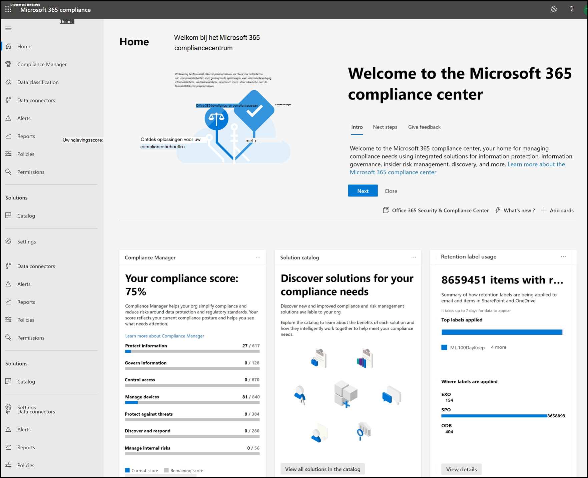
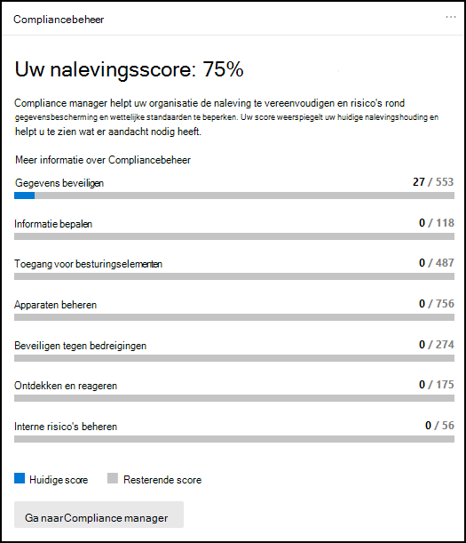
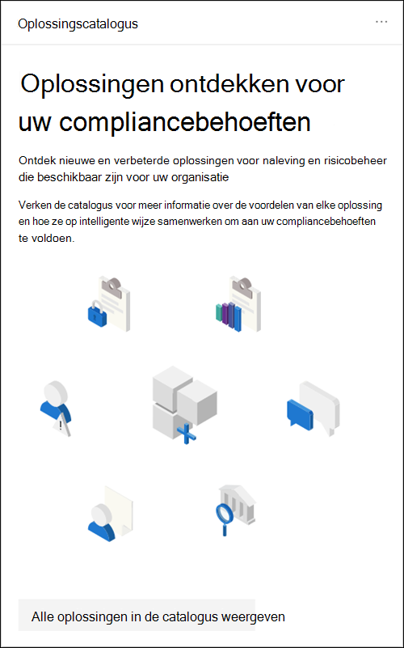
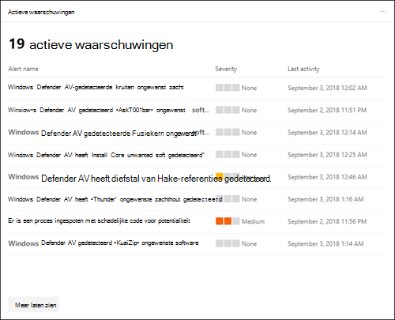
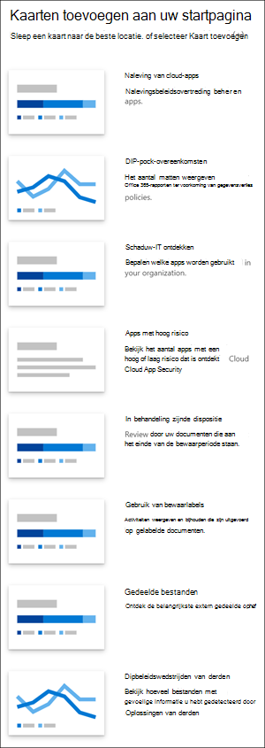
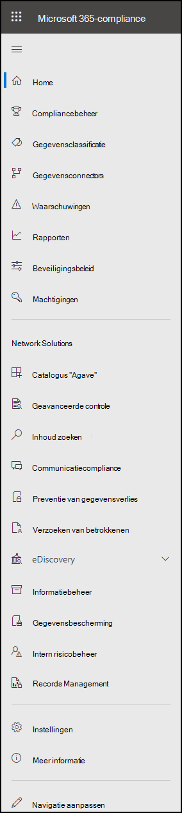
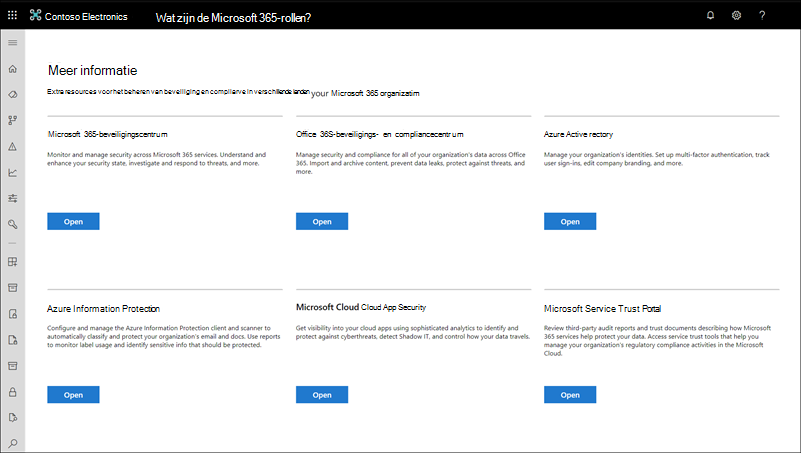

# Microsoft 365-compliancecentrumMicrosoft 365 compliance center

Als u geïnteresseerd bent in de compliance-houding van uw organisatie, vindt u het Microsoft 365 [compliancecentrum.](https://compliance.microsoft.com)If you're interested in your organization's compliance posture, you're going to love the [Microsoft 365 compliance center](https://compliance.microsoft.com). Het Microsoft 365 compliancecentrum biedt eenvoudige toegang tot de gegevens en hulpprogramma's die u nodig hebt om te voldoen aan de nalevingsbehoeften van uw organisatie.The Microsoft 365 compliance center provides easy access to the data and tools you need to manage to your organization's compliance needs.

Lees dit artikel om kennis te maken met het Microsoft 365 compliancecentrum, hoe u dit kunt [krijgen,](#frequently-asked-questions)veelgestelde vragen en uw [volgende stappen.](#next-steps)Read this article to get acquainted with the Microsoft 365 compliance center, [how to get it](#how-do-i-get-the-compliance-center), [frequently asked questions](#frequently-asked-questions), and your [next steps](#next-steps).

## Welkom bij Microsoft 365 nalevingWelcome to Microsoft 365 compliance

Wanneer u voor het eerst naar Microsoft 365 compliancecentrum gaat, wordt u begroet met het volgende welkomstbericht:When you go to your Microsoft 365 compliance center for the first time, you're greeted with the following welcome message:

De welkomstbanner geeft u enkele aanwijzers over hoe u aan de slag kunt gaan, met de volgende stappen, en een uitnodiging voor u om ons feedback te geven.The welcome banner gives you some pointers on how to get started, with next steps, and an invitation for you to give us feedback.

## Sectie KaartCard section

Wanneer u het Microsoft 365 compliancecentrum voor het eerst bezoekt, ziet u in de kaartsectie op de startpagina in één oogopslag hoe uw organisatie het doet met de naleving van gegevens, welke oplossingen beschikbaar zijn voor uw organisatie en een overzicht van alle actieve waarschuwingen.When you first visit the Microsoft 365 compliance center, the card section on the home page shows you at a glance how your organization is doing with data compliance, what solutions are available for your organization, and a summary of any active alerts.

Hier kunt u het volgende doen:From here, you can:

- Bekijk de **Microsoft Compliance Manager-kaart,** die u naar de [compliancebeheeroplossing](compliance-manager.md) leidt.Review the **Microsoft Compliance Manager** card, which leads you to the [Compliance Manager](compliance-manager.md) solution. Compliancebeheer helpt u bij het vereenvoudigen van de manier waarop u compliance beheert.Compliance Manager helps simplify the way you manage compliance. Het berekent een op risico gebaseerde score die uw voortgang meet bij het voltooien van aanbevolen acties om de risico's rond gegevensbescherming en wettelijke standaarden te beperken.It calculates a risk-based score measuring your progress toward completing recommended actions that help reduce risks around data protection and regulatory standards. Het biedt ook werkstroommogelijkheden en ingebouwde besturingstoewijzing om u te helpen bij het efficiënt uitvoeren van verbeteracties.It also provides workflow capabilities and built-in control mapping to help you efficiently carry out improvement actions.

    

- Bekijk de nieuwe **cataloguskaart voor** oplossingen, die koppelingen bevat naar verzamelingen geïntegreerde oplossingen die u kunt gebruiken om end-to-end compliancescenario's te beheren. Review the new **Solution catalog** card, which links to collections of [integrated solutions](microsoft-365-solution-catalog.md) you can use to help you manage end-to-end compliance scenarios. De mogelijkheden en hulpmiddelen van een oplossing kunnen bestaan uit een combinatie van beleidsregels, waarschuwingen, rapporten en meer.A solution's capabilities and tools might include a combination of policies, alerts, reports, and more.

    

- Bekijk de **kaart Actieve waarschuwingen,** met  een overzicht van de meest actieve waarschuwingen en bevat een koppeling waarin u meer gedetailleerde informatie kunt bekijken, zoals Ernst, Status, Categorie en meer.Review the **Active alerts** card, which includes a summary of the most [active alerts](alert-policies.md) and includes a link where you can view more detailed information, such as Severity, Status, Category, and more.

    

U kunt ook  de functie Kaarten toevoegen gebruiken om extra kaarten toe te voegen, zoals een kaart met de naleving van de cloud-app van uw organisatie en een andere met gegevens over gebruikers met gedeelde bestanden, met koppelingen naar [Cloud App Security of](/cloud-app-security/) andere hulpprogramma's waar u gegevens kunt verkennen.You can also use the **Add cards** feature to add additional cards, such as one showing your organization's cloud app compliance, and another showing data about users with shared files, with links to [Cloud App Security](/cloud-app-security/) or other tools where you can explore data.

## Eenvoudige navigatie naar meer compliancefuncties en -mogelijkhedenEasy navigation to more compliance features and capabilities

Naast koppelingen in kaarten op de startpagina ziet u aan de linkerkant van het scherm een navigatiedeelvenster waarmee u eenvoudig toegang hebt tot uw [waarschuwingen,](../security/office-365-security/alerts.md) [rapporten,](reports-in-security-and-compliance.md) [beleidsregels,](alert-policies.md)complianceoplossingen en meer.In addition to links in cards on the home page, you'll see a navigation pane on the left side of the screen that gives you easy access to your [alerts](../security/office-365-security/alerts.md), [reports](reports-in-security-and-compliance.md), [policies](alert-policies.md), compliance solutions, and more. Als u opties voor een aangepast navigatiedeelvenster wilt toevoegen of verwijderen, gebruikt u **het** navigatiebesturingselement Aanpassen in het navigatiedeelvenster.To add or remove options for a customized navigation pane, use the **Customize navigation** control on the navigation pane. Hiermee opent u **de instellingen van het navigatiedeelvenster** aanpassen, zodat u kunt configureren welke items in het navigatiedeelvenster worden weergegeven.This opens the **Customize your navigation pane** settings so you can configure which items appear in the navigation pane.

|  |  |
|---------|---------|
|  | Selecteer **Start** om terug te keren naar de hoofdpagina Microsoft 365 compliancecentrum.Select **Home** to return to the Microsoft 365 compliance center main page.   Ga **naar Compliance manager** om uw compliancescore te controleren en compliance [voor](compliance-manager.md) uw organisatie te beheren.Visit **Compliance Manager** to check your compliance score and start [managing compliance](compliance-manager.md) for your organization.    Selecteer de **sectie Gegevensclassificatie** om toegang te krijgen tot [trainbare classificaties](classifier-learn-about.md), entiteitsdefinities van het type Gevoelige [informatie](sensitive-information-type-entity-definitions.md), inhouds- en activiteitsverkenners. Select the **Data classification** section to access [trainable classifiers](classifier-learn-about.md), [Sensitive information type entity definitions](sensitive-information-type-entity-definitions.md), content and [activity](data-classification-activity-explorer.md) explorers.    Selecteer **Gegevensconnectors om** [verbindingslijnen te configureren](archiving-third-party-data.md) voor het importeren en archiveren van gegevens in Microsoft 365 abonnement.Select **Data connectors** to [configure connectors](archiving-third-party-data.md) to import and archive data in your Microsoft 365 subscription.    Ga naar **Waarschuwingen om** waarschuwingen weer te geven en op [te lossen](alert-policies.md)Go to **Alerts** to view and resolve [alerts](alert-policies.md)   Ga **naar Rapporten** om gegevens weer te geven over het gebruik en bewaren van etiketten, DLP-beleid komt overeen met en  [overteert,](view-the-dlp-reports.md)gedeelde bestanden, apps van derden die [worden](/cloud-app-security/discovered-apps)gebruikt en meer. Visit **Reports** to view data about [label usage and retention](sensitivity-labels.md), [DLP policy matches and overrides](view-the-dlp-reports.md), [shared files](/cloud-app-security/file-filters), [third-party apps in use](/cloud-app-security/discovered-apps), and more.    Ga naar **Beleidsregels** om beleid in te stellen voor het beheren van gegevens, het beheren van apparaten en het ontvangen van [waarschuwingen.](../security/office-365-security/alerts.md)Go to **Policies** to set up policies to govern data, manage devices, and receive [alerts](../security/office-365-security/alerts.md). U hebt ook toegang tot uw [DLP-](dlp-learn-about-dlp.md) en [bewaarbeleid.](retention.md)You can also access your [DLP](dlp-learn-about-dlp.md) and [retention](retention.md) policies.   Selecteer **Machtigingen om** te beheren wie in uw organisatie toegang heeft tot het Microsoft 365 compliancecentrum om inhoud weer te geven en taken te voltooien.Select **Permissions** to manage who in your organization has access to the Microsoft 365 compliance center to view content and complete tasks.    Gebruik de koppelingen in de **sectie Oplossingen** om toegang te krijgen tot de complianceoplossingen van uw organisatie.Use the links in the **Solutions** section to access your organization's compliance solutions. Dit zijn onder andere:These include:    [CatalogusCatalog](microsoft-365-solution-catalog.md)   Ontdek, leer over en gebruik de intelligente oplossingen voor naleving en risicobeheer die beschikbaar zijn voor uw organisatie.Discover, learn about, and start using the intelligent compliance and risk management solutions available to your organization.    [ControleAudit](search-the-audit-log-in-security-and-compliance.md)   Gebruik het auditlogboek om veelvoorkomende ondersteunings- en complianceproblemen te onderzoeken.Use the Audit log to investigate common support and compliance issues.    [Inhoud zoekenContent search](search-for-content.md)   Gebruik Inhoud zoeken om snel e-mail te vinden in Exchange postvakken, documenten op SharePoint-sites en OneDrive-locaties, en chatgesprekken in Microsoft Teams en Skype voor Bedrijven.Use Content search to quickly find email in Exchange mailboxes, documents in SharePoint sites and OneDrive locations, and instant messaging conversations in Microsoft Teams and Skype for Business.    [CommunicatiecomplianceCommunication compliance](communication-compliance.md)   Minimaliseer communicatierisico's door automatisch ongepaste berichten vast te leggen, mogelijke beleidsovertredingen te onderzoeken en stappen te ondernemen om te corrigeren.Minimize communication risks by automatically capturing inappropriate messages, investigating possible policy violations, and taking steps to remediate.    [Meer informatie over preventie van gegevensverliesLearn about data loss prevention](dlp-learn-about-dlp.md)   Detecteer gevoelige inhoud terwijl deze wordt gebruikt en gedeeld in uw organisatie, in de cloud en op apparaten, en helpt onbedoeld gegevensverlies te voorkomen.Detect sensitive content as it's used and shared throughout your organization, in the cloud and on devices, and helps prevent accidental data loss.    [Verzoeken van betrokkenenData subject requests](/compliance/regulatory/gdpr-manage-gdpr-data-subject-requests-with-the-dsr-case-tool)   De persoonlijke gegevens van een gebruiker zoeken en exporteren om u te helpen reageren op verzoeken van gegevensonderwerpen voor de Algemene verordening gegevensbescherming (AVG).Find and export a user's personal data to help you respond to data subject requests for the General Data Protection Regulation (GDPR).    [eDiscoveryeDiscovery](overview-ediscovery-20.md)   Vouw deze sectie uit om de kern en Advanced eDiscovery te gebruiken voor het bewaren, verzamelen, controleren, analyseren en exporteren van inhoud die reageert op interne en externe onderzoeken van uw organisatie.Expand this section to use the core and Advanced eDiscovery for preserving, collecting, reviewing, analyzing, and exporting content that's responsive to your organization's internal and external investigations.    [InformatiebeheerInformation governance](manage-information-governance.md)   Beheer de levenscyclus van uw inhoud met behulp van functies om bedrijfskritische gegevens te importeren, op te slaan en te classificeren, zodat u kunt behouden wat u nodig hebt en kunt verwijderen wat u niet doet.Manage your content lifecycle using features to import, store, and classify business-critical data so you can keep what you need and delete what you don't.    [GegevensbeveiligingInformation protection](information-protection.md)   Ontdek, classificeer en bescherm gevoelige en bedrijfskritische inhoud gedurende de levenscyclus in uw organisatie.Discover, classify, and protect sensitive and business-critical content throughout its lifecycle across your organization.    [Intern risicobeheerInsider risk management](insider-risk-management.md)   Detecteer risicovolle activiteiten in uw organisatie om u te helpen snel insiderrisico's en bedreigingen te identificeren, te onderzoeken en actie te ondernemen.Detect risky activity across your organization to help you quickly identify, investigate, and take action on insider risks and threats.    [Records ManagementRecords management](records-management.md)   Automatiseer en vereenvoudig de bewaarplanning voor wettelijke, juridische en bedrijfskritische records in uw organisatie.Automate and simplify the retention schedule for regulatory, legal and business-critical records in your organization.

## Hoe kom ik aan het compliancecentrum?How do I get the compliance center?

- Als u het nieuwe Microsoft 365 compliancecentrum nog niet hebt, hebt u het binnenkort.If you don't have the new Microsoft 365 compliance center already, you'll have it soon. Het Microsoft 365 compliancecentrum is nu algemeen beschikbaar voor Microsoft 365 SKU-klanten.The Microsoft 365 compliance center is generally available now to Microsoft 365 SKU customers.

- Als u het Microsoft 365 compliancecentrum wilt bezoeken, gaat u als globale beheerder, compliancebeheerder of compliancegegevensbeheerder naar en meld [https://compliance.microsoft.com](https://compliance.microsoft.com) u aan.To visit the Microsoft 365 compliance center, as a global administrator, compliance administrator, or compliance data administrator go to [https://compliance.microsoft.com](https://compliance.microsoft.com) and sign in.

## Veelgestelde vragenFrequently asked questions

**Waarom ga ik naar het Beveiligingscentrum & compliancecentrum om bepaalde taken uit te voeren, zoals het definiëren van bepaalde beleidsregels?****Why am I taken to the Security & Compliance Center to complete some tasks, such as defining certain policies?**

We zijn nog steeds bezig met het Microsoft 365 compliancecentrum en we voegen de komende maanden meer functionaliteit en oplossingen toe.We're still developing the Microsoft 365 compliance center, and we add more functionality and solutions over the coming months. In de tussentijd zijn er een paar taken die moeten worden voltooid in het Beveiligings- & Compliancecentrum ( [https://protection.office.com](https://protection.office.com) ).In the meantime, there are a few tasks that must be completed in the Security & Compliance Center ([https://protection.office.com](https://protection.office.com)). In dat geval wordt u automatisch doorgestuurd naar de locatie waar u de taak kunt uitvoeren, zoals het maken of bewerken van een toezichtbeleid.In those cases, you'll be directed automatically to the location where you can complete the task at hand, such as creating or editing a supervision policy.

**Waarom zie ik het nieuwe Microsoft 365 compliancecentrum nog niet?****Why don't I see the new Microsoft 365 compliance center yet?**

Zorg er eerst voor dat u de juiste licenties en machtigingen hebt.First, make sure that you have the appropriate licenses and permissions. Meld u vervolgens aan bij [https://compliance.microsoft.com](https://compliance.microsoft.com) .Then, sign in at [https://compliance.microsoft.com](https://compliance.microsoft.com). Als u het nieuwe compliancecentrum nog niet ziet, hebt u het binnenkort.If you don't see the new compliance center yet, you'll have it soon.

**Sommige van mijn compliancefuncties zijn niet beschikbaar in het Microsoft 365 compliancecentrum. Wat moet ik doen?****Some of my compliance features aren't available in the Microsoft 365 compliance center. What do I do?**

We voegen nog steeds functionaliteit toe aan het Microsoft 365 compliancecentrum.We're still adding functionality to the Microsoft 365 compliance center. Als u iets niet kunt vinden, zoals zoeken in een auditlogboek, gebruikt u het Beveiligings- & Compliancecentrum ( [https://protection.office.com](https://protection.office.com) ).If you can't find something, such as audit log search, use the Security & Compliance Center ([https://protection.office.com](https://protection.office.com)). Uw configuraties worden automatisch opgeslagen in het bestaande beveiligings- & compliancecentrum en in het nieuwe Microsoft 365 compliancecentrum.Your configurations are saved in both the existing Security & Compliance Center and in the new Microsoft 365 compliance center automatically.

Als u daar naartoe wilt gaan, kiest u in het Microsoft 365 compliancecentrum in het navigatiedeelvenster aan de linkerkant van het scherm de optie Meer resources **en** kiest u vervolgens onder **Office 365 Beveiligings- & Compliancecentrum** de optie **Openen.**To go there, in the Microsoft 365 compliance center, in the navigation pane on the left side of the screen, choose **More resources**, and then, under **Office 365 Security & Compliance Center**, choose **Open**.

## Volgende stappenNext steps

- **Ga naar Microsoft Compliance Manager om** uw compliancescore te bekijken en te beginnen met het beheren van compliance voor uw organisatie.**Visit Microsoft Compliance Manager** to see your compliance score and start managing compliance for your organization. Zie Compliance Manager voor [meer informatie.](compliance-manager.md)To learn more, see [Compliance Manager](compliance-manager.md).

- **Configureer beleid voor** insiderrisicobeheer om interne risico's te minimaliseren en u in staat te stellen risicovolle activiteiten in uw organisatie te detecteren, te onderzoeken en actie te ondernemen.**Configure insider risk management policies** to help minimize internal risks and enable you to detect, investigate, and take action for risky activities in your organization. Zie [Insider-risicobeheer](insider-risk-management.md).See [Insider risk management](insider-risk-management.md).

- **Bekijk het preventiebeleid voor gegevensverlies van** uw organisatie en wijzig indien nodig de vereiste wijzigingen.**Review your organization's data loss prevention policies** and make required changes as necessary. Zie Meer informatie over preventie van gegevensverlies voor [meer informatie.](dlp-learn-about-dlp.md)To learn more about, see [Learn about data loss prevention](dlp-learn-about-dlp.md).

- **Maak kennis met en stel een Microsoft Cloud App Security.****Get acquainted with and set up Microsoft Cloud App Security**. Zie [Snelstart: Aan de slag met Microsoft Cloud App Security.](/cloud-app-security/getting-started-with-cloud-app-security)See [Quickstart: Get started with Microsoft Cloud App Security](/cloud-app-security/getting-started-with-cloud-app-security).

- **Meer informatie over en het maken van compliancebeleid** voor communicatie om snel schendingen van bedrijfscode-of-conductbeleid te identificeren en te corrigeren.**Learn about and create communication compliance policies** to quickly identify and remediate corporate code-of-conduct policy violations. Zie [Naleving van communicatie in Microsoft 365.](communication-compliance.md)See [Communication compliance in Microsoft 365](communication-compliance.md).

- **Ga vaak naar Microsoft 365 compliancecentrum** en controleer eventuele waarschuwingen of mogelijke risico's die zich voordoen.**Visit your Microsoft 365 compliance center often**, and make sure to review any alerts or potential risks that arise. Ga naar [https://compliance.microsoft.com](https://compliance.microsoft.com) en meld u aan.Go to [https://compliance.microsoft.com](https://compliance.microsoft.com) and sign in.