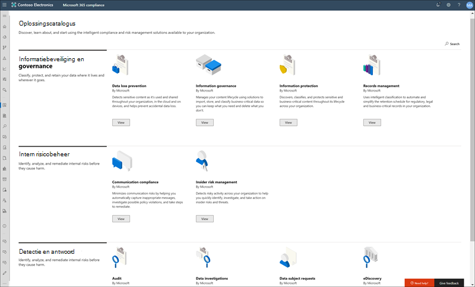
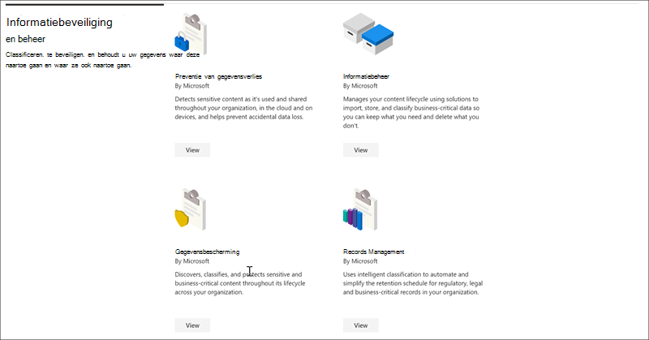
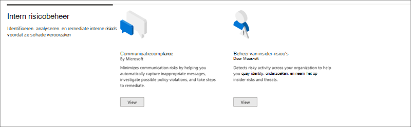
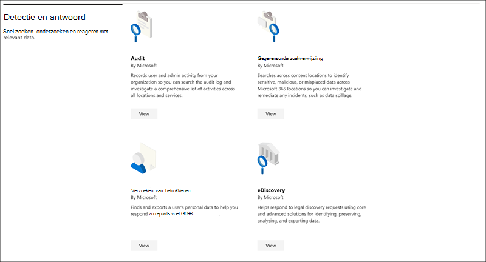

# Microsoft 365-oplossingencatalogusMicrosoft 365 solution catalog

Zoekt u een manier om snel aan de slag te gaan met compliancetaken in Microsoft 365?Are you looking for a way to quickly get started with compliance tasks in Microsoft 365? Bekijk de [Microsoft 365-oplossingscatalogus](https://compliance.microsoft.com/solutioncatalog) om compliance- en risicobeheeroplossingen te ontdekken, te leren en snel aan de slag te gaan.Check out the [Microsoft 365 solution catalog](https://compliance.microsoft.com/solutioncatalog) to discover, learn, and quickly get started with compliance and risk management solutions.

Complianceoplossingen in Microsoft 365 zijn verzamelingen geïntegreerde mogelijkheden die u kunt gebruiken om end-to-end compliancescenario's te beheren.Compliance solutions in Microsoft 365 are collections of integrated capabilities you can use to help you manage end-to-end compliance scenarios. De mogelijkheden en hulpmiddelen van een oplossing kunnen bestaan uit een combinatie van beleidsregels, waarschuwingen, rapporten en meer.A solution's capabilities and tools might include a combination of policies, alerts, reports, and more.

Lees dit artikel om kennis te maken met de nieuwe oplossingscatalogus in het Microsoft 365 [compliancecentrum,](#how-do-i-get-this)hoe u dit kunt [krijgen,](#frequently-asked-questions)veelgestelde vragen en de [volgende stappen.](#next-steps)Read this article to get acquainted with the new solution catalog in the Microsoft 365 compliance center, [how to get it](#how-do-i-get-this), [frequently asked questions](#frequently-asked-questions), and your [next steps](#next-steps).

## CatalogusorganisatieCatalog organization

De oplossingscatalogus is ingedeeld in secties met informatiekaarten voor elke complianceoplossing die beschikbaar is in uw Microsoft 365 abonnement.The solution catalog is organized into sections that contain information cards for each compliance solution available in your Microsoft 365 subscription. Elke sectie bevat kaarten voor oplossingen die zijn gegroepeerd op nalevingsgebied.Each section contains cards for solutions grouped by compliance area.

Wanneer u **Weergeven voor** een oplossingskaart selecteert, ziet u gedetailleerde informatie over de compliance-oplossing en hoe u aan de slag kunt gaan.When you select **View** for a solution card, you'll see detailed information about the compliance solution and how to get started. Deze informatie bevat een overzicht, vereisten voor vooraf configureren, leerbronnen, besturingselementen waarmee u de kaart kunt vastmaken aan het navigatiedeelvenster en een optie om de oplossing te delen als een koppeling, e-mail of Microsoft Teams bericht.This information includes an overview, pre-configuration requirements, learning resources, controls that allow you to pin the card to the navigation pane, and an option to share the solution as a link, email, or Microsoft Teams message.

## Sectie Informatiebeveiliging & beheerInformation protection & governance section

In **de sectie Informatiebeveiliging & governance** ziet u in één oogopslag hoe u Microsoft 365 complianceoplossingen kunt gebruiken om gegevens in uw organisatie te beveiligen en te bepalen.The **Information protection & governance** section shows you at a glance how you can use Microsoft 365 compliance solutions to protect and govern data in your organization.

Hier ziet u kaarten voor de volgende oplossingen:From here, you'll see cards for the following solutions:

- [Preventie van gegevensverlies:](dlp-learn-about-dlp.md)hiermee detecteert u gevoelige inhoud terwijl deze wordt gebruikt en gedeeld in uw hele organisatie, in de cloud en op apparaten, en voorkomt u onbedoeld gegevensverlies.[Data loss prevention](dlp-learn-about-dlp.md): Detects sensitive content as it's used and shared throughout your organization, in the cloud and on devices, and helps prevent accidental data loss.
- [Informatiebeheer:](manage-information-governance.md)beheert de levenscyclus van uw inhoud met oplossingen voor het importeren, opslaan en classificeren van bedrijfskritische gegevens, zodat u kunt behouden wat u nodig hebt en kunt verwijderen wat u niet doet.[Information governance](manage-information-governance.md): Manages your content lifecycle using solutions to import, store, and classify business-critical data so you can keep what you need and delete what you don't.
- [Informatiebeveiliging:](information-protection.md)detecteert, classificeert en beschermt gevoelige en bedrijfskritische inhoud gedurende de levenscyclus in uw organisatie.[Information protection](information-protection.md): Discovers, classifies, and protects sensitive and business-critical content throughout its lifecycle across your organization.
- [Recordbeheer:](records-management.md)maakt gebruik van intelligente classificatie om het bewaarschema voor wettelijke, juridische en bedrijfskritische records in uw organisatie te automatiseren en te vereenvoudigen.[Records management](records-management.md): Uses intelligent classification to automate and simplify the retention schedule for regulatory, legal, and business-critical records in your organization.

## Sectie Insider-risicobeheerInsider risk management section

In **de sectie Insider-risicobeheer** op de startpagina ziet u in één oogopslag hoe uw organisatie interne risico's kan identificeren, analyseren en ondernemen voordat deze schade veroorzaken.The **Insider risk management** section on the home page shows you at a glance how your organization can identify, analyze, and take action on internal risks before they cause harm.

Hier ziet u kaarten voor de volgende oplossingen:From here, you'll see cards for the following solutions:

- [Communicatie compliance:](communication-compliance.md)minimaliseert communicatierisico's door u te helpen bij het automatisch vastleggen van ongepaste berichten, het onderzoeken van mogelijke beleidsovertredingen en het minimaliseren van schade.[Communication compliance](communication-compliance.md): Minimizes communication risks by helping you automatically capture inappropriate messages, investigate possible policy violations, and take steps to minimize harm.
- [Insider-risicobeheer:](insider-risk-management.md)detecteer risicovolle activiteiten in uw organisatie om u te helpen snel insiderrisico's en -bedreigingen te identificeren, te onderzoeken en actie te ondernemen.[Insider risk management](insider-risk-management.md): Detect risky activity across your organization to help you quickly identify, investigate, and take action on insider risks and threats.

## Detectie & antwoordsectieDiscovery & response section

In **de sectie & op** de startpagina ziet u in één oogopslag hoe uw organisatie snel complianceproblemen met relevante gegevens kan vinden, onderzoeken en beantwoorden.The **Discovery & response** section on the home page shows you at a glance how your organization can quickly find, investigate, and respond to compliance issues with relevant data.

Hier ziet u kaarten voor de volgende oplossingen:From here, you'll see cards for the following solutions:

- [Audit:](search-the-audit-log-in-security-and-compliance.md)Records gebruikers- en beheerdersactiviteiten van uw organisatie, zodat u in het auditlogboek kunt zoeken en een uitgebreide lijst met activiteiten op alle locaties en services kunt onderzoeken.[Audit](search-the-audit-log-in-security-and-compliance.md): Records user and admin activity from your organization so you can search the audit log and investigate a comprehensive list of activities across all locations and services.
- [Verzoeken om gegevensonderwerpen:](/compliance/regulatory/gdpr-manage-gdpr-data-subject-requests-with-the-dsr-case-tool)hiermee worden de persoonlijke gegevens van een gebruiker gevonden en exporteert om u te helpen reageren op verzoeken van gegevensonderwerpen voor AVG.[Data subject requests](/compliance/regulatory/gdpr-manage-gdpr-data-subject-requests-with-the-dsr-case-tool): Finds and exports a user's personal data to help you respond to data subject requests for GDPR.
- [eDiscoveryeDiscovery](manage-legal-investigations.md)
    - [Core eDiscovery:](./get-started-core-ediscovery.md)zoekt op verschillende inhoudslocaties om gegevens te identificeren, te behouden en te exporteren in antwoord op juridische detectieaanvragen en eDiscovery-zaken.[Core eDiscovery](./get-started-core-ediscovery.md): Searches across content locations to identify, preserve, and export data in response to legal discovery requests and eDiscovery cases.
    - [Advanced eDiscovery:](overview-ediscovery-20.md)bouwt voort op eDiscovery-mogelijkheden door intelligente analyses en machine learning aan te bieden om gegevens die relevant zijn voor detectieaanvragen verder te analyseren.[Advanced eDiscovery](overview-ediscovery-20.md): Builds on eDiscovery capabilities by providing intelligent analytics and  machine learning to help you further analyze data that's relevant to discovery requests.

## Hoe kom ik hier aan?How do I get this?

Als u de catalogus met Microsoft 365 wilt bezoeken, gaat u naar en meld u aan als globale [https://compliance.microsoft.com](https://compliance.microsoft.com) beheerder, compliancebeheerder of compliancegegevensbeheerder.To visit the Microsoft 365 solution catalog, go to [https://compliance.microsoft.com](https://compliance.microsoft.com) and sign in as a global administrator, compliance administrator, or compliance data administrator. Selecteer **Catalogus** in het navigatiedeelvenster aan de linkerkant van het scherm om de startpagina van de catalogus te openen.Select **Catalog** in the navigation pane on the left side of the screen to open the catalog home page.

## Veelgestelde vragenFrequently asked questions

**Waarom zie ik de catalogus met Microsoft 365 oplossing niet?****Why don't I see the Microsoft 365 solution catalog?**

Zorg er eerst voor dat u de juiste licenties en machtigingen hebt.First, make sure that you have the appropriate licenses and permissions. Meld u vervolgens aan bij [https://compliance.microsoft.com](https://compliance.microsoft.com) als globale beheerder, compliancebeheerder of compliancegegevensbeheerder.Then, sign in at [https://compliance.microsoft.com](https://compliance.microsoft.com) as a global administrator, compliance administrator, or compliance data administrator.

**Sommige compliancefuncties die op de pagina met de oplossingscatalogus worden vermeld, zijn niet beschikbaar in het Microsoft 365 compliancecentrum. Wat moet ik doen?****Some of the compliance features listed on the solution catalog page aren't available in the Microsoft 365 compliance center. What do I do?**

We zijn altijd bezig om nieuwe functionaliteit toe te voegen aan het Microsoft 365 compliancecentrum en de oplossingscatalogus.We're always working to add new functionality to the Microsoft 365 compliance center and the solution catalog. Als u geen specifieke oplossing kunt vinden in het navigatiegebied, is deze toegankelijk wanneer de oplossing beschikbaar is in uw abonnement.If you can't find a specific solution in the navigation area, it will be accessible when the solution is available in your subscription.

Als u op zoek bent naar een bestaande complianceoplossing en deze nog niet beschikbaar is in het Microsoft 365-compliancecentrum, hebt u altijd toegang tot oplossingen in het bestaande Beveiligings compliancecentrum door naar &amp; [https://protection.office.com](https://protection.office.com) .If you are looking for an existing compliance solution and it's not available in the Microsoft 365 compliance center yet, you can always access solutions in the existing Security &amp; Compliance Center by going to [https://protection.office.com](https://protection.office.com). U kunt ook klikken  op het tabblad Meer resources in de linkernavigatie van het Microsoft 365 compliancecentrum en de kaart Office 365 beveiligings- en compliancecentrum selecteren.Alternatively, you can click on the **More resources** tab in the left navigation of the Microsoft 365 compliance center and select the Office 365 security and compliance center card.  

## Volgende stappenNext steps

- **Ga naar Microsoft Compliance Manager,** waarmee u inzicht hebt in de nalevingstoestand van uw organisatie met belangrijke standaarden en voorschriften.**Visit Microsoft Compliance Manager**, which helps you understand your organization's state of compliance with key standards and regulations. Het biedt aanbevolen acties die u kunt uitvoeren om uw algehele nalevingsstatus te versterken en biedt werkstroommogelijkheden om u te helpen deze acties efficiënt uit te voeren.It provides recommended actions you can take to strengthen your overall compliance posture, and provides workflow capabilities to help you efficiently carry out those actions. Zie Compliance Manager voor [meer informatie.](compliance-manager.md)To learn more, see [Compliance Manager](compliance-manager.md).

- **Configureer beleid voor** insiderrisicobeheer om interne risico's te minimaliseren en u in staat te stellen risicovolle activiteiten in uw organisatie te detecteren, te onderzoeken en actie te ondernemen.**Configure insider risk management policies** to help minimize internal risks and enable you to detect, investigate, and take action for risky activities in your organization. Zie [Insider-risicobeheer](insider-risk-management.md).See [Insider risk management](insider-risk-management.md).

- **Meer informatie over en het maken van compliancebeleid** voor communicatie om snel schendingen van bedrijfscode-of-conductbeleid te identificeren en te corrigeren.**Learn about and create Communication compliance policies** to quickly identify and remediate corporate code-of-conduct policy violations. Zie [Naleving van communicatie](communication-compliance.md).See [Communication compliance](communication-compliance.md).

- **Microsoft Information Protection**, meer informatie over hoe Microsoft 365 u gevoelige informatie kunt ontdekken, classificeren en beveiligen, waar deze ook woont of reist.**Microsoft Information Protection**, learn how Microsoft 365 solutions help you discover, classify, and protect sensitive information wherever it lives or travels.
    - **Maak kennis met en stel een Microsoft Cloud App Security.****Get acquainted with and set up Microsoft Cloud App Security**. Zie [Snelstart: Aan de slag met Microsoft Cloud App Security.](/cloud-app-security/getting-started-with-cloud-app-security)See [Quickstart: Get started with Microsoft Cloud App Security](/cloud-app-security/getting-started-with-cloud-app-security).
    - **Aan de slag met classificaties.****Get started with classifiers**. Het classificeren van inhoud en het labelen van inhoud zodat deze op de juiste manier kan worden beveiligd en verwerkt, is de beginplaats voor de informatiebeveiligingsdiscipline.Classifying content and then labeling it so it can be protected and handled properly is the starting place for the information protection discipline. Zie [Meer informatie over trainable classifiers (preview)](classifier-learn-about.md).See [Learn about trainable classifiers (preview)](classifier-learn-about.md).

- **Ga vaak naar Microsoft 365-catalogus** met oplossingen en zorg ervoor dat u nieuwe oplossingen bekijkt om u te helpen met uw nalevingsbehoeften.**Visit your Microsoft 365 solution catalog often**, and make sure to review new solutions to help you with your compliance needs. Meld u aan [https://compliance.microsoft.com](https://compliance.microsoft.com) bij en selecteer vervolgens **Catalogus** in het linkernavigatiedeelvenster.Sign in at [https://compliance.microsoft.com](https://compliance.microsoft.com) and then select **Catalog** in the left navigation pane.