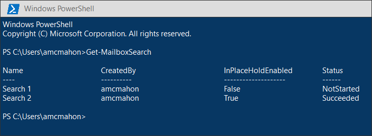
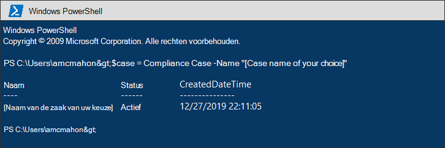
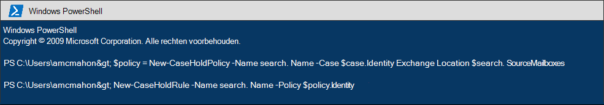
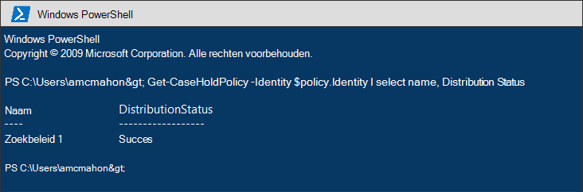
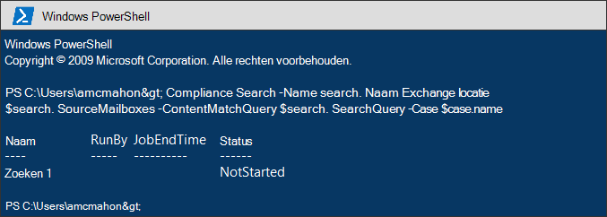
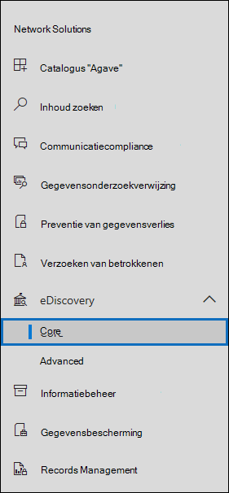
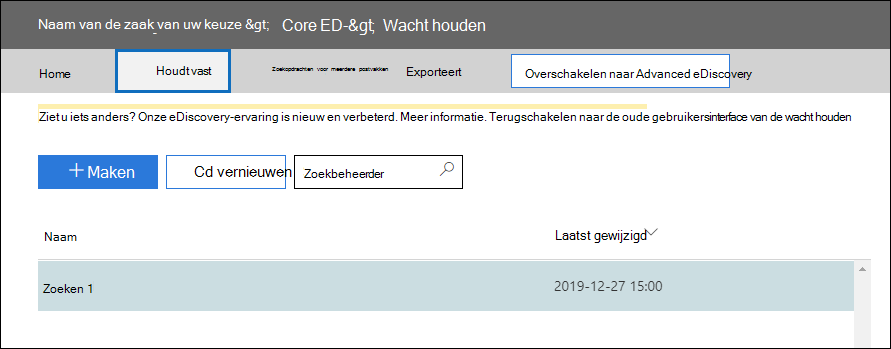
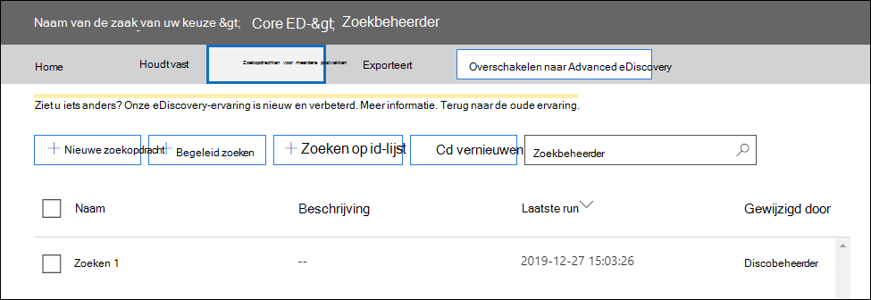

# <a name="migrate-legacy-ediscovery-searches-and-holds-to-the-microsoft-365-compliance-center"></a>Oudere eDiscovery-zoekopdrachten migreren naar het Microsoft 365 compliancecentrum

Het Microsoft 365-compliancecentrum biedt een verbeterde ervaring voor eDiscovery-gebruik, waaronder: hogere betrouwbaarheid, betere prestaties en veel functies die zijn afgestemd op eDiscovery-werkstromen, waaronder zaken om uw inhoud per zaak te ordenen, revisiesets voor het bekijken van inhoud en analyses, om gegevens te verwijderen voor controle, zoals near-duplicate groepering, e-mailthreading, themaanalyse en voorspellende codering.

Om klanten te helpen profiteren van de nieuwe en verbeterde functionaliteit, bevat dit artikel basishulp voor het migreren van In-Place eDiscovery-zoekopdrachten en -bezit van het Exchange-beheercentrum naar het Microsoft 365 compliancecentrum.

> [!NOTE]
> Omdat er veel verschillende scenario's zijn, bevat dit artikel algemene richtlijnen voor het overstappen van zoekopdrachten en houdt het vast aan een kern-eDiscovery-zaak in het Microsoft 365 compliancecentrum. Het gebruik van eDiscovery-zaken is niet altijd vereist, maar ze voegen een extra beveiligingslaag toe door u machtigingen toe te wijzen om te bepalen wie toegang heeft tot de eDiscovery-zaken in uw organisatie.

## <a name="before-you-begin"></a>Voordat u begint

- U moet lid zijn van de rollengroep eDiscovery Manager in het beveiligings- & compliancecentrum om de PowerShell-opdrachten uit te voeren die in dit artikel worden beschreven. U moet ook lid zijn van de rollengroep Discovery Management in het Exchange beheercentrum.

- Dit artikel bevat richtlijnen voor het maken van een eDiscovery-wacht. Het holdbeleid wordt toegepast op postvakken via een asynchron proces. Wanneer u een eDiscovery-wachtplaats maakt, moet u zowel een CaseHoldPolicy als CaseHoldRule maken, anders wordt de wacht niet gemaakt en worden inhoudslocaties niet in de wacht geplaatst.

## <a name="step-1-connect-to-exchange-online-powershell-and-security--compliance-center-powershell"></a>Stap 1: Verbinding maken Exchange Online PowerShell en & Compliance Center PowerShell

De eerste stap is om verbinding te maken met Exchange Online PowerShell en & Compliance Center PowerShell. U kunt het volgende script kopiëren, plakken in een PowerShell-venster en vervolgens uitvoeren. U wordt gevraagd om referenties voor de organisatie met wie u verbinding wilt maken. 

```powershell
$UserCredential = Get-Credential
$sccSession = New-PSSession -ConfigurationName Microsoft.Exchange -ConnectionUri https://ps.compliance.protection.outlook.com/powershell-liveid -Credential $UserCredential -Authentication Basic -AllowRedirection
Import-PSSession $sccSession -DisableNameChecking
$exoSession = New-PSSession -ConfigurationName Microsoft.Exchange -ConnectionUri https://ps.outlook.com/powershell-liveid/ -Credential $UserCredential -Authentication Basic -AllowRedirection
Import-PSSession $exoSession -AllowClobber -DisableNameChecking
```

U moet de opdrachten uitvoeren in de volgende stappen in deze PowerShell-sessie.

## <a name="step-2-get-a-list-of-in-place-ediscovery-searches-by-using-get-mailboxsearch"></a>Stap 2: Een lijst met In-Place eDiscovery-zoekopdrachten met behulp van Get-MailboxSearch

Nadat u zich hebt geverifieerd, kunt u een lijst met In-Place eDiscovery-zoekopdrachten krijgen door de **cmdlet Get-MailboxSearch** uit te lopen. Kopieer en plak de volgende opdracht in PowerShell en voer deze uit. Er wordt een lijst met zoekopdrachten weergegeven met hun namen en de status van alle In-Place in.

```powershell
Get-MailboxSearch
```

De uitvoer van de cmdlet lijkt op het volgende:



## <a name="step-3-get-information-about-the-in-place-ediscovery-searches-and-in-place-holds-you-want-to-migrate"></a>Stap 3: Informatie over de In-Place eDiscovery-zoekopdrachten en -In-Place houdt die u wilt migreren

Opnieuw gebruikt u de **cmdlet Get-MailboxSearch,** maar deze keer om de eigenschappen van de zoekopdracht te krijgen. U kunt deze eigenschappen opslaan in een variabele voor later gebruik. In het volgende voorbeeld worden de resultaten van de **cmdlet Get-MailboxSearch** opgeslagen in een variabele en worden vervolgens de eigenschappen van de zoekopdracht weergegeven.

```powershell
$search = Get-MailboxSearch -Identity "Search 1"
```

```powershell
$search | FL
```

De uitvoer van deze twee opdrachten is vergelijkbaar met de volgende:


> [!NOTE]
> De duur van de In-Place in dit voorbeeld is onbepaalde tijd *(ItemHoldPeriod: Onbeperkt).* Dit is typisch voor scenario's voor eDiscovery en juridisch onderzoek. Als de duur van de bewaring een andere waarde heeft dan voor onbepaalde tijd, is de reden waarschijnlijk dat de bewaring wordt gebruikt om inhoud te behouden in een bewaarscenario. In plaats van de eDiscovery-cmdlets in Security & Compliance Center PowerShell te gebruiken voor bewaarscenario's, raden we u aan om [New-RetentionCompliancePolicy](/powershell/module/exchange/new-retentioncompliancepolicy) en [New-RetentionComplianceRule](/powershell/module/exchange/new-retentioncompliancerule) te gebruiken om inhoud te behouden. Het resultaat van het gebruik van deze cmdlets is vergelijkbaar met het gebruik van **New-CaseHoldPolicy** en **New-CaseHoldRule,** maar u kunt een bewaarperiode en een bewaaractie opgeven, zoals het verwijderen van inhoud nadat de bewaarperiode is verlopen. Als u de bewaar cmdlets gebruikt, hoeft u de bewaarperioden niet te koppelen aan een eDiscovery-zaak.

## <a name="step-4-create-a-case-in-the-microsoft-365-compliance-center"></a>Stap 4: Een zaak maken in het Microsoft 365 compliancecentrum

Als u een eDiscovery-greep wilt maken, moet u een eDiscovery-zaak maken om de wacht te koppelen aan. In het volgende voorbeeld wordt een eDiscovery-zaak gemaakt met een naam van uw keuze. We slaan de eigenschappen van de nieuwe zaak op in een variabele voor later gebruik. U kunt deze eigenschappen bekijken door de opdracht `$case | FL` uit te voeren nadat u de zaak hebt gemaakt.

```powershell
$case = New-ComplianceCase -Name "[Case name of your choice]"
```


## <a name="step-5-create-the-ediscovery-hold"></a>Stap 5: De eDiscovery-hold maken

Nadat de zaak is gemaakt, kunt u de wacht houden maken en deze koppelen aan de zaak die u in de vorige stap hebt gemaakt. Het is belangrijk om te onthouden dat u zowel een case hold-beleid als een case hold-regel moet maken. Als de regel voor het in de wacht houden van een zaak niet is gemaakt nadat u het beleid voor het houden van een zaak hebt gemaakt, wordt de eDiscovery-wachtplaats niet gemaakt en wordt inhoud niet in de wacht gezet.

Voer de volgende opdrachten uit om de eDiscovery-wacht die u wilt migreren opnieuw te maken. In deze voorbeelden worden de eigenschappen gebruikt In-Place Van stap 3 houden die u wilt migreren. Met de eerste opdracht wordt een nieuw beleid voor het vasthouden van een zaak gemaakt en worden de eigenschappen op een variabele op slaat. Met de tweede opdracht wordt de bijbehorende regel voor de case hold gemaakt.

```powershell
$policy = New-CaseHoldPolicy -Name $search.Name -Case $case.Identity -ExchangeLocation $search.SourceMailboxes
```

```powershell
New-CaseHoldRule -Name $search.Name -Policy $policy.Identity
```



## <a name="step-6-verify-the-ediscovery-hold"></a>Stap 6: De eDiscovery-wacht houden controleren

Als u wilt controleren of er geen problemen zijn bij het maken van de wachtpositie, is het goed om te controleren of de distributiestatus van de wachtpositie is geslaagd. Distributie betekent dat de hold is toegepast op alle inhoudslocaties die zijn opgegeven in de *parameter ExchangeLocation* in de vorige stap. Hiervoor kunt u de **cmdlet Get-CaseHoldPolicy** uitvoeren. Omdat de eigenschappen die zijn *opgeslagen* in de $policy-variabele die u in de vorige stap hebt gemaakt, niet automatisch worden bijgewerkt in de variabele, moet u de cmdlet opnieuw gebruiken om te controleren of de verdeling is gelukt. Het kan 5 minuten tot 24 uur duren voordat het beleid voor het vasthouden van een zaak is gedistribueerd.

Voer de volgende opdracht uit om te controleren of de eDiscovery-hold is gedistribueerd.

```powershell
Get-CaseHoldPolicy -Identity $policy.Identity | Select name, DistributionStatus
```

De waarde van **Succes** voor de eigenschap *Distributiestatus* geeft aan dat de hold is geplaatst op de inhoudslocaties. Als de verdeling nog niet is voltooid, wordt een waarde van **In** behandeling weergegeven.



## <a name="step-7-create-the-search"></a>Stap 7: De zoekopdracht maken

De laatste stap is het opnieuw maken van de zoekopdracht die u hebt geïdentificeerd in stap 3 en deze te koppelen aan de zaak. Nadat u de zoekopdracht hebt gemaakt, kunt u deze uitvoeren met de **cmdlet Start-ComplianceSearch** of op een later tijdstip uitvoeren.

```powershell
New-ComplianceSearch -Name $search.Name -ExchangeLocation $search.SourceMailboxes -ContentMatchQuery $search.SearchQuery -Case $case.name
```



## <a name="step-8-verify-the-case-hold-and-search-in-the-microsoft-365-compliance-center"></a>Stap 8: De zaak controleren, vasthouden en zoeken in het Microsoft 365 compliancecentrum

Als u wilt controleren of alles correct is ingesteld, gaat u naar het Microsoft 365 compliancecentrum bij en klikt u op [https://compliance.microsoft.com](https://compliance.microsoft.com) **eDiscovery > Core.**



De zaak die u in stap 3 hebt gemaakt, wordt weergegeven op de **pagina Core eDiscovery.** Open de zaak en let vervolgens op de wacht die u hebt gemaakt in stap 4 in die wordt weergegeven op **het tabblad Houdt.** U kunt op de wachtpositie klikken om details weer te geven, waaronder het aantal postvakken waar de wachtpositie op is toegepast en de distributiestatus.



De zoekopdracht die u in stap 7 hebt gemaakt, wordt weergegeven op het tabblad Zoekopdrachten van de eDiscovery-zaak. 



Als u een In-Place eDiscovery-zoekopdracht migreert, maar deze niet koppelt aan een eDiscovery-zaak, wordt deze weergegeven op de pagina Inhoud zoeken in het Microsoft 365 compliancecentrum.

## <a name="more-information"></a>Meer informatie

- Zie voor meer informatie In-Place eDiscovery & In het Exchange beheercentrum:
  
  - [In-place eDiscovery](/exchange/security-and-compliance/in-place-ediscovery/in-place-ediscovery)

  - [In-Place Hold and Litigation Hold](/exchange/security-and-compliance/in-place-and-litigation-holds)

- Zie voor meer informatie over de PowerShell-cmdlets die in het artikel worden gebruikt:

  - [Get-MailboxSearch](/powershell/module/exchange/get-mailboxsearch)
  
  - [New-ComplianceCase](/powershell/module/exchange/new-compliancecase)

  - [New-CaseHoldPolicy](/powershell/module/exchange/new-caseholdpolicy)
  
  - [New-CaseHoldRule](/powershell/module/exchange/new-caseholdrule)

  - [Get-CaseHoldPolicy](/powershell/module/exchange/get-caseholdpolicy)
  
  - [New-ComplianceSearch](/powershell/module/exchange/new-compliancesearch)

  - [Start-ComplianceSearch](/powershell/module/exchange/start-compliancesearch)

- Zie Overzicht van het Microsoft 365 compliancecentrum voor meer informatie over [Microsoft 365 compliancecentrum.](microsoft-365-compliance-center.md)