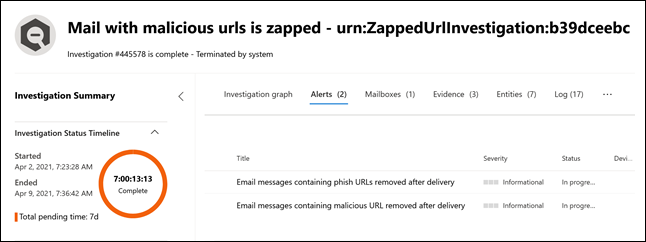
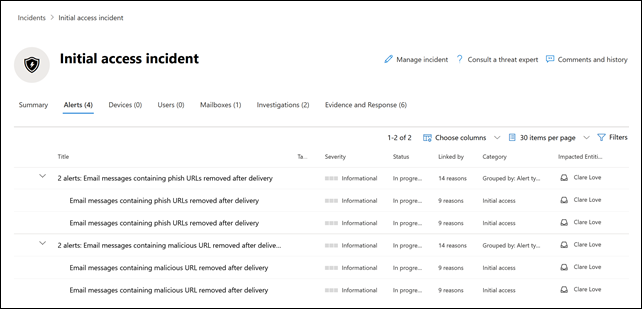

# Nieuwe waarschuwingsbeleidsregels in Microsoft Defender voor Office 365

Microsoft Defender voor Office 365 introduceert nieuwe en verbeterde waarschuwingsbeleidsregels met betrekking tot detectie na de bezorging. Hieronder vallen verbeteringen van de AIR-playbooks (Automated Investigation & Response) die hieraan zijn gekoppeld. Daarnaast wijzigen we de urgentieclassificatie van zes standaardwaarschuwingenbeleidsregels om de waarschuwingen die door dit beleid worden gegenereerd beter af te stemmen op de invloed ervan op uw organisatie.

## Detectie na bezorging

We introduceren vier nieuwe standaardwaarschuwingsbeleidsregels met betrekking tot detectie na de bezorging, nadat berichten door Microsoft Defender voor Office 365 Zero-Hour Auto Purge (ZAP) uit een Postvak IN zijn verwijderd. Deze vier nieuwe waarschuwingsbeleidsregels vervangen twee bestaande standaardwaarschuwingsbeleidsregels voor ZAP-scenario's en bieden organisaties uitgebreide informatie over de onderliggende detectie en gerelateerde indicatoren. Met deze waarschuwingen (en de AIR-playbooks die worden geactiveerd vanuit deze waarschuwingen) worden de bedreigingen van de e-mailberichten en entiteiten nauwkeurig vastgelegd, bijvoorbeeld als de URL naar een schadelijk bestand wijst of als het bestand een schadelijke URL bevat.

In de volgende tabel staat het nieuwe waarschuwingsbeleid en het bestaande waarschuwingsbeleid dat wordt verwijderd. Zie de sectie [Wat dit voor gevolgen heeft voor uw organisatie](#how-this-will-affect-your-organization) voor meer informatie over de implementatie.

| Nieuw of bestaand waarschuwingsbeleid | Naam waarschuwingsbeleid | ID waarschuwingsbeleid|
|:-----------------------------|:----------------|:--------------|
| Nieuw| **E-mailberichten met schadelijke URL verwijderd na bezorging**   | 0179B3F7-3FDA-40C3-8F24-278563978DBB |
| Nieuw| **E-mailberichten met schadelijk bestand verwijderd na bezorging**  | 8E6BA277-EF39-404E-AAF1-294F6D9A2B88 |
| Nieuw| **E-mailberichten van een campagne zijn bezorgd en later verwijderd** | ef850570-5624-42b2-ff0a-08d8d899d578 |
| Nieuw|**Schadelijke e-mailberichten zijn bezorgd en later verwijderd**                | a1f563cc-fb1f-466b-1fb5-08d8d71a3050 |
| Bestaand (wordt verwijderd)| **E-mailberichten met schadelijke phishing-URL verwijderd na bezorging**| EA8169FA-0678-4751-8854-AEBEA7ADECEB |
| Bestaand (wordt verwijderd)| **E-mailberichten met malware verwijderd na bezorging**| 0179B3F7-3FDA-40C3-8F24-278563978DBB |
||||

## Verbeteringen van de ernst van waarschuwingen

In de volgende tabel ziet u de standaardwaarschuwingsbeleidsregels waarvan de urgentieclassificaties worden gewijzigd. We wijzigen de urgentieclassificatie voor deze waarschuwingsbeleidsregels om beter in overeenstemming te zijn met het potentiële risico en de gevolgen voor uw organisatie, en om uw beveiligingsteams te helpen prioriteit te geven aan de waarschuwingen die door dit beleid worden gegenereerd.

| Waarschuwing| ID waarschuwingsbeleid| Oude urgentie| Nieuwe urgentie  |
|:----------|:---------------|:------------|:--------------|
| **Doorstuuractiviteit verdachte e-mail**| BFD48F06-0865-41A6-85FF-ADB746423EBF | Gemiddeld| Hoog|
| **E-mail die door de gebruiker is gerapporteerd als malware of phishing** | B26A5770-0C38-434A-9380-3A3C2C27BBB3 | Informatief | Laag|
| **Ongebruikelijke toename van het aantal e-mails dat als phishing wordt gerapporteerd** | A00D8C62-9320-4EEA-A7E5-966B9AC09558 | Hoog| Gemiddeld |
| **Resultaat van indiening door beheerder voltooid** | AE9B83DD-6039-4EA9-B675-6B0AC3BF4A41 | Laag| Informatief |
| **Doorstuur/omleidingsregel maken** | D59A8FD4-1272-41EE-9408-86F7BCF72479 | Laag| Informatief |
| e **Ontdekken-zoekopdracht is gestart of geëxporteerd**| 6FDC5710-3998-47F0-AFBB-57CEFD7378AE | Gemiddeld| Informatief |
|||||

## Wanneer worden deze wijzigingen doorgevoerd

In de volgende tabel ziet u wanneer de nieuwe waarschuwingsbeleidsregels zullen beginnen met het activeren van waarschuwingen na de bezorging. De tabel geeft ook aan wanneer de twee bestaande waarschuwingsbeleidsregels worden verwijderd.

| Waarschuwingsbeleid| Datum |
|:------------|:-----|
| **E-mailberichten met schadelijke URL verwijderd na bezorging** (nieuw) | Waarschuwingen worden geactiveerd vanaf 11 april 2021|
| **E-mailberichten met schadelijk bestand verwijderd na bezorging** (nieuw) | Waarschuwingen worden geactiveerd vanaf 11 april 2021 |
| **E-mailberichten van een campagne zijn bezorgd en later verwijderd** (nieuw) | Waarschuwingen worden geactiveerd vanaf 30 april 2021|
| **Schadelijke e-mailberichten zijn bezorgd en later verwijderd** (nieuw) | Waarschuwingen worden geactiveerd vanaf 30 april 2021|
| **E-mailberichten met schadelijke phishing-URL verwijderd na bezorging** (bestaand, wordt verwijderd)| Het waarschuwingsbeleid wordt op 30 april 2021 verwijderd. Zie de sectie [Wat u moet doen om u voor te bereiden op deze wijzigingen](#what-you-need-to-do-to-prepare-for-these-changes).|
| **E-mailberichten met schadelijke malware verwijderd na bezorging** (bestaand, wordt verwijderd) | Het waarschuwingsbeleid wordt op 30 april 2021 verwijderd. Zie de sectie [Wat u moet doen om u voor te bereiden op deze wijzigingen](#what-you-need-to-do-to-prepare-for-these-changes). |
|||

De wijzigingen van de urgentie van de waarschuwing worden voor alle organisaties op 30 april 2021 geïmplementeerd.

## Wat dit voor gevolgen heeft voor uw organisatie

De nieuwe waarschuwingen beginnen op de bovenstaande datums met het activeren van AIR-onderzoeken binnen uw organisatie. Als u de gevolgen wilt beperken voor beveiligingsorganisaties die de twee waarschuwingen hebben geactiveerd die worden verwijderd, ziet u tussen 5 april 2021 en 30 april 2021 waarschuwingen die zijn geactiveerd door het bestaande waarschuwingsbeleid *en* waarschuwingen die zijn geactiveerd door het nieuwe waarschuwingsbeleid. Dit is om beveiligingsteams de tijd te geven om de vereiste wijzigingen te verwerken. Om beveiligingsteams te helpen bij het verhoogde waarschuwingsvolume tijdens deze korte duur, worden zowel de bestaande waarschuwingen als de nieuwe waarschuwingen gerelateerd aan hetzelfde AIR-onderzoek en aan hetzelfde incident. Dit omvat met name het volgende gedrag voor waarschuwingen, AIR-onderzoeken en incidenten:

- **Waarschuwingen**: u ziet automatisch de volgende waarschuwingsparen in de bestaande en nieuwe waarschuwingen:

  - **E-mailberichten met phish-URL's verwijderd na bezorging** EN **E-mailberichten met schadelijke URL verwijderd na bezorging**

  - **E-mailberichten met malware verwijderd na bezorging** EN **E-mailberichten met schadelijk bestand verwijderd na bezorging**

  

   Zie de sectie [Wat u moet doen om u voor te bereiden op deze wijzigingen](#what-you-need-to-do-to-prepare-for-these-changes) voor meer informatie over het beheren van deze waarschuwingsparen.

- **AIR-onderzoeken**: Waarschuwingen worden gerelateerd aan één AIR-onderzoek, met een van de waarschuwingen die zijn geclassificeerd als "triggering" en de andere als "herhaald".

  

- **Incidenten**: Beide waarschuwingen zijn gerelateerd aan hetzelfde incident

  

## Wat u moet doen om u voor te bereiden op deze wijzigingen

Hoe uw organisatie deze waarschuwingen gebruikt, bepaalt wat u moet doen om u voor te bereiden. Als u de waarschuwingen hebt geoperationaliseerd en deze gebruikt of ontvangt via een API, een waarschuwingsmelding per e-mail, of in het Office 365-beveiligings- en compliancecentrum (`https://protection.office.com/viewalerts`) of het Microsoft-beveiligingscentrum (`https://security.microsoft.com/viewalerts`), moet u uw werkstromen wijzigen.

**Als u deze waarschuwingen nog niet hebt geoperationaliseerd, kunt u een van de volgende dingen doen:**

- Schakel de volgende waarschuwingsbeleidsregels uit (die worden verwijderd) om het aantal waarschuwingen in uw organisatie te beperken:

  - **E-mailberichten met schadelijke phishing-URL verwijderd na bezorging**

  - **E-mailberichten met malware verwijderd na bezorging**

- Geen actie uitvoeren. We schakelen de bestaande waarschuwingsbeleidsregels op 30 april 2021 uit.

**Als u deze waarschuwingen hebt geoperationaliseerd:**

- Gebruik de nieuwe waarschuwingen als onderdeel van uw werkstromen, ter voorbereiding op het verwijderen van het bestaande waarschuwingsbeleid op 30 april 2021. Als uw ticketingsysteem gebruikmaakt van aangepaste logica, een beveiligingspostvak waarin u meldingen per e-mail ontvangt of een SIEM-oplossing die afhankelijk is van de naam van de waarschuwing of de correlatie-id (Alert Policy Id), moet u de logica aanpassen om de wijziging mogelijk te maken.

  > [!NOTE]
  > De informatie in de waarschuwingen, onderzoeken en incidenten is niet gewijzigd. Deze informatie is zelfs uitgebreid met aanvullende informatie over de bedreigingen die ermee zijn verbonden.

- Nadat u de wijzigingen hebt aangebracht, kunt u het bestaande waarschuwingsbeleid uitschakelen om het aantal waarschuwingen in uw organisatie te beperken:

  - **E-mailberichten met schadelijke phishing-URL verwijderd na bezorging**

  - **E-mailberichten met malware verwijderd na bezorging**

  U kunt deze waarschuwingsbeleidsregels ook ingeschakeld laten totdat we ze op 30 april 2021 verwijderen.
