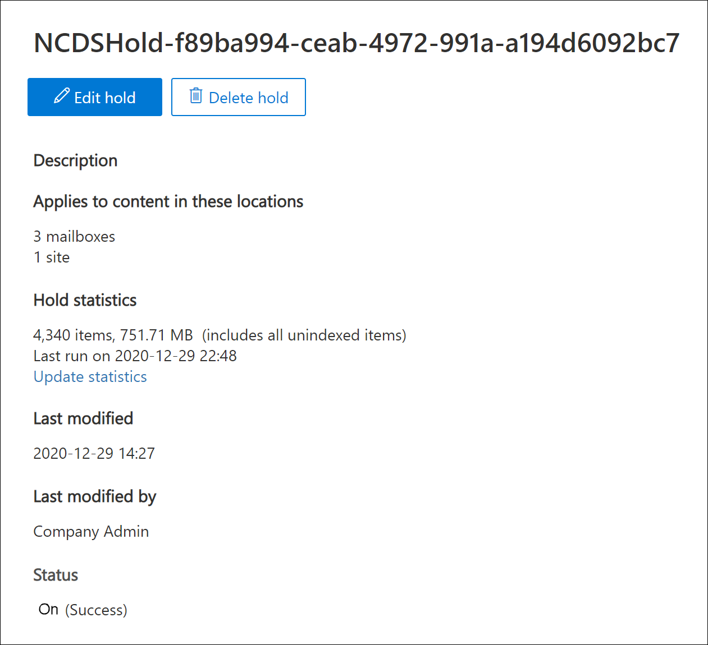

# Niet-bewaardergegevensbronnen toevoegen aan een Advanced eDiscovery zaak

In Advanced eDiscovery gevallen voldoet het niet altijd aan uw behoeften om een Microsoft 365 gegevensbron te koppelen aan een bewaarder in de zaak. Maar mogelijk moet u die gegevens nog steeds koppelen aan een zaak, zodat u deze kunt doorzoeken, toevoegen aan een revisieset en deze kunt analyseren en controleren. De functie in Advanced eDiscovery wordt  niet-bewaardergegevensbronnen genoemd en u kunt gegevens toevoegen aan een zaak zonder dat u deze aan een bewaarder moet koppelen. De functie past ook dezelfde Advanced eDiscovery toe op niet-bewaardergegevens die beschikbaar zijn voor gegevens die zijn gekoppeld aan bewaarder. Twee van de handigste dingen die u kunt toepassen op niet-bewaardergegevens, is het in de wacht zetten en verwerken met [geavanceerde indexering.](indexing-custodian-data.md)

## Een niet-bewaardergegevensbron toevoegen

Volg deze stappen om niet-bewaardergegevensbronnen toe te voegen en te beheren in een Advanced eDiscovery geval.

1. Klik op **Advanced eDiscovery** startpagina op de zaak aan wie u de gegevens wilt toevoegen.

2. Klik op **het tabblad Gegevensbronnen** en klik vervolgens op **Gegevensbron toevoegen**  >  **Gegevenslocaties toevoegen.**

3. Kies op **de flyoutpagina Nieuwe niet-bewaargegevenslocaties** de gegevensbronnen die u aan de zaak wilt toevoegen. U kunt meerdere postvakken en sites toevoegen door de secties SharePoint **of** **Exchange** uit te breiden en vervolgens op Bewerken **te klikken.**

   

   - **SharePoint** - Klik op **Bewerken om** sites toe te voegen. Selecteer een site in de lijst of u kunt zoeken naar een site door de URL van de site in de zoekbalk te typen. Selecteer de sites die u wilt toevoegen als niet-bewaarder-gegevensbronnen en klik op **Toevoegen.**

   - **Exchange-** Klik op **Bewerken om** postvakken toe te voegen. Typ een naam of alias (minimaal drie tekens) in het zoekvak voor postvakken of distributiegroepen. Selecteer de postvakken die u wilt toevoegen als niet-bewaardergegevensbronnen en klik op **Toevoegen.**

   > [!NOTE]
   > U kunt de **secties SharePoint** en **Exchange** gebruiken om sites en postvakken toe te voegen die zijn gekoppeld aan een team of Yammer groep als niet-bewaardergegevensbronnen. U moet afzonderlijk het postvak en de site toevoegen die zijn gekoppeld aan een team of Yammer groep.

4. Nadat u niet-bewaardergegevensbronnen hebt toegevoegd, kunt u deze locaties al dan niet in de wacht zetten. Schakel het selectievakje **In-** of uitschakelen naast de gegevensbron in of uit om het in de wacht te zetten.

5. Klik **onder** aan de flyout pagina **Nieuwe niet-bewaargegevenslocaties** op Toevoegen om de gegevensbronnen aan de zaak toe te voegen.

   Elke niet-bewaardergegevensbron die u hebt toegevoegd, wordt weergegeven op de **pagina Gegevensbronnen.** Niet-bewaardergegevensbronnen worden geïdentificeerd door **de** gegevenslocatiewaarde in de kolom **Brontype.**

   

Nadat u niet-bewaardergegevensbronnen aan de zaak hebt toevoegen, wordt een taak met de  naam Niet-bewaardergegevens opnieuw *indexeren* gemaakt en weergegeven op het tabblad Taken van de zaak. Nadat de taak is gemaakt, wordt het proces voor geavanceerde indexering gestart en worden de gegevensbronnen opnieuw geïndexeerd.

## De bewaarneming voor niet-bewaardergegevensbronnen beheren

Nadat u een niet-bewaardergegevensbron in de wacht hebt gezet, wordt automatisch een bewaarbeleid gemaakt dat de niet-bewaardergegevensbronnen voor de zaak bevat. Wanneer u andere niet-bewaargegevensbronnen in de wacht zet, worden deze toegevoegd aan dit bewaarbeleid.

1. Open de Advanced eDiscovery en selecteer het **tabblad** Wacht houden.

2. Klik **op NCDSHold- \<GUID\>**, waarbij de GUID-waarde uniek is voor de zaak.

   Op de flyoutpagina worden informatie en statistieken weergegeven over de niet-bewaardergegevensbronnen die in de wacht staan.

   

3. Klik **op Wacht houden bewerken** om de niet-bewaardergegevensbronnen weer te geven die in de wacht zijn geplaatst en de volgende beheertaken uit te voeren:

   - Op de **pagina** Locaties kunt u een niet-bewarende gegevensbron vrijgeven door deze uit de wacht te verwijderen. Als u een gegevensbron los laat, wordt de niet-bewaardergegevensbron niet uit de zaak verwijderd. Hiermee wordt alleen de wacht die in de gegevensbron is geplaatst, verwijderd.

   - Op de **pagina Query** kunt u de bewaarfunctie bewerken om een op query gebaseerde bewaarfunctie te maken die wordt toegepast op alle tha niet-bewaardergegevensbronnen in de zaak.
