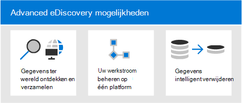
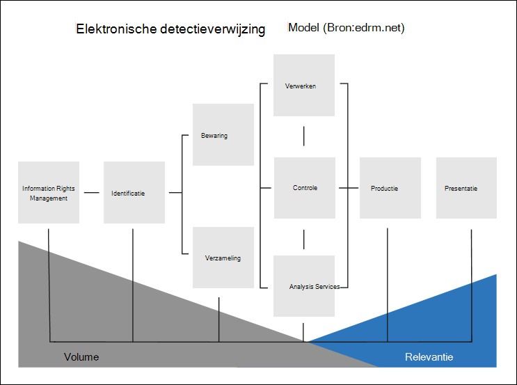
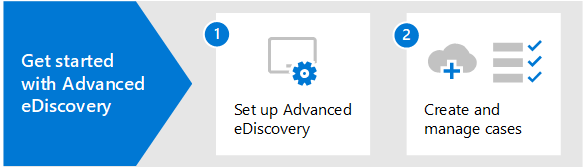

# Overzicht van Microsoft 365 Advanced eDiscovery

De Advanced eDiscovery oplossing in Microsoft 365 is gebaseerd op de bestaande microsoft eDiscovery- en analysemogelijkheden. Advanced eDiscovery biedt een end-to-endwerkstroom voor het bewaren, verzamelen, analyseren, controleren en exporteren van inhoud die reageert op interne en externe onderzoeken van uw organisatie. Daarnaast kunnen juridische teams de volledige werkstroom voor meldingen over juridische in- en uit te houden beheren om te communiceren met bewaarders die betrokken zijn bij een zaak.

## Advanced eDiscovery mogelijkheden

Advanced eDiscovery kan uw organisatie helpen om te reageren op juridische zaken of interne onderzoeken door gegevens te ontdekken waar deze zich in de staat van de organisatie kan vinden. U kunt eDiscovery-werkstromen naadloos beheren door personen van belang en hun gegevensbronnen te identificeren, houdt naadloos toe te passen om gegevens te bewaren en vervolgens het juridische communicatieproces te beheren. Door gegevens uit de bron te verzamelen, kunt u zoeken op het live-Microsoft 365 om snel te vinden wat u nodig hebt. Intelligente, machine learning-mogelijkheden, zoals diepe indexering, e-mailthreading en bijna dubbele detectie, helpen u ook grote hoeveelheden gegevens te beperken tot een relevante gegevensset.

In de volgende secties wordt beschreven hoe deze Advanced eDiscovery uw organisatie kunnen helpen.

### Gegevens ter wereld ontdekken en verzamelen

Organisaties die afhankelijk zijn van meerdere eDiscovery-oplossingen van derden, moeten vanouds grote hoeveelheden gegevens uit Microsoft 365 kopiëren om dubbele gegevens te verwerken en te hosten. Deze noodzaak vergroot de tijd om relevante gegevens te vinden en de risico's, kosten en complexiteit van het beheren van meerdere oplossingen.

Advanced eDiscovery in Microsoft 365 kunt u gegevens bij de bron ontdekken en binnen de Microsoft 365 beveiligings- en compliancegrens blijven.  Door gegevens op locatie te verzamelen vanuit het livesysteem, vermindert Advanced eDiscovery de frictie van teruggaan naar de bron en vermindert u onnodig werk van het zoeken naar ontbrekende inhoud, wat vaak gebeurt wanneer logboeken achterlopen in traditionele eDiscovery-oplossingen.

Native zoek- en verzamelingsmogelijkheden voor gegevens in Teams, Yammer, SharePoint Online, OneDrive voor Bedrijven en Exchange Online worden de gegevensdetectie verder verbeterd. U kunt bijvoorbeeld Advanced eDiscovery:

- Reconstrueert Teams gesprekken (in plaats van afzonderlijke berichten uit gesprekken te retourneren).

- Verzamelt cloudinhoud die met gebruikers wordt gedeeld door gebruik te maken van koppelingen of moderne bijlagen in e-mailberichten en Teams chats.

- Heeft ingebouwde ondersteuning voor honderden niet-Microsoft 365 bestandstypen.

- Verzamelt gegevens uit bronnen van derden (zoals Bloomberg, Facebook, Slack en Zoomvergaderingen) die worden geïmporteerd en gearchiveerd in Microsoft 365 door [gegevensconnectoren.](archiving-third-party-data.md)

### EDiscovery-werkstroom beheren op één platform

Advanced eDiscovery kunt u helpen het aantal eDiscovery-oplossingen te verminderen waar u op moet vertrouwen. Het biedt een gestroomlijnde, end-to-end-werkstroom, die allemaal binnen de Microsoft 365. Advanced eDiscovery helpt de frictie bij het identificeren en verzamelen van potentiële bronnen van relevante informatie te verminderen door unieke en gedeelde gegevensbronnen automatisch toe te kennen aan de persoon van belang (ook wel een bewaarder *genoemd)* en door rapportage en analyse te verstrekken over mogelijk relevante gegevens voordat deze worden verzameld voor analyse en controle.

Daarnaast kunnen Microsoft Graph API's u helpen bij het automatiseren van de eDiscovery-werkstroom en het uitbreiden Advanced eDiscovery voor aangepaste oplossingen.

### Gegevens intelligent verwijderen

Intelligente, machine learning-mogelijkheden in Advanced eDiscovery helpen u de hoeveelheid te controleren gegevens te verminderen. Met deze intelligente mogelijkheden kunt u grote hoeveelheden gegevens beperken en verwijderen naar een relevante set. Met een ingebouwde revisiesetquery kunt u bijvoorbeeld alleen filteren op unieke inhoud door in de buurt van duplicaten te identificeren. Deze mogelijkheid kan de hoeveelheid te controleren gegevens aanzienlijk verminderen.

Extra mogelijkheden voor machine learning kunnen relevante gegevens verder verfijnen en identificeren met behulp van slimme tags en technologie ondersteunde revisiehulpmiddelen, zoals de relevantiemodules.

## Advanced eDiscovery uitlijning met het referentiemodel voor elektronische detectie

De ingebouwde werkstroom van Advanced eDiscovery in Microsoft 365 wordt uitgelijnd met het eDiscovery-proces dat wordt beschreven door het EDRM (Electronic Discovery Reference Model).

(Afbeeldingsbron met dank aan edrm.net. De bronafbeelding is beschikbaar gesteld onder Creative Commons Attribution 3.0 Unported License.)

Op een hoog niveau biedt u als Advanced eDiscovery ondersteuning voor de EDRM-werkstroom:

- **Identificatie.** Nadat u potentiële personen hebt vastgesteld die van belang zijn voor een onderzoek, kunt u deze toevoegen als bewaarders (ook wel gegevensbeheerders *genoemd,* omdat ze mogelijk beschikken over informatie die relevant is voor het onderzoek) aan een Advanced eDiscovery zaak. Nadat gebruikers zijn toegevoegd als bewaarders, is het eenvoudig om bewaarderdocumenten te bewaren, te verzamelen en te controleren.

- **Bewaring.** Als u gegevens wilt bewaren en beveiligen die relevant zijn voor een onderzoek, kunt Advanced eDiscovery in een zaak de gegevensbronnen die aan de bewaarders zijn gekoppeld, juridisch in de wacht houden. U kunt ook niet-bewaargegevens in de wacht zetten. Advanced eDiscovery heeft ook een ingebouwde communicatiewerkstroom, zodat u meldingen over juridische bewaarstatus kunt verzenden naar beheerders en hun bevestigingen kunt bijhouden.

- **Verzameling.** Nadat u de gegevensbronnen hebt geïdentificeerd (en bewaard) die relevant zijn voor het onderzoek, kunt u het ingebouwde zoekprogramma gebruiken in Advanced eDiscovery om livegegevens te zoeken en te verzamelen uit de bewaardergegevensbronnen (en, indien van toepassing, niet-bewaardergegevensbronnen) die relevant kunnen zijn voor het geval.

- **Verwerking.** Nadat u alle gegevens hebt verzameld die relevant zijn voor de zaak, wordt deze door de volgende stap verwerkt voor verder onderzoek en analyse. In Advanced eDiscovery worden de in-place gegevens die u hebt geïdentificeerd in de verzamelingsfase gekopieerd naar een Azure Storage-locatie (een revisieset *genoemd),* waardoor u een statische weergave van de casegegevens krijgt. 

- **Controleren.** Nadat gegevens zijn toegevoegd aan een revisieset, kunt u specifieke documenten bekijken en extra query's uitvoeren om de gegevens te beperken tot wat het meest relevant is voor de zaak. U kunt ook aantekeningen maken en specifieke documenten taggen.

- **Analyse.** Advanced eDiscovery biedt een geïntegreerd analysehulpmiddel waarmee u gegevens verder kunt verwijderen uit de beoordelingsset die u hebt vastgesteld, niet relevant is voor het onderzoek. Naast het verminderen van de hoeveelheid relevante gegevens, kunt u met Advance eDiscovery ook kosten voor juridische controle besparen door inhoud te organiseren zodat het revisieproces eenvoudiger en efficiënter wordt.

- **Productie** en **presentatie.** Wanneer u klaar bent, kunt u documenten exporteren uit een revisieset voor juridische controle. U kunt documenten exporteren in de eigen indeling of in een door EDRM opgegeven indeling, zodat ze kunnen worden geïmporteerd in revisietoepassingen van derden.

## Abonnementen en licenties

Licenties voor Advanced eDiscovery vereist het juiste organisatieabonnement en licenties per gebruiker.

- **Organisatieabonnement:** Als u toegang Advanced eDiscovery in het Microsoft 365 compliancecentrum, moet uw organisatie een van de volgende opties hebben:

  - Microsoft 365 E5 of Office 365 E5-abonnement
  
  - Microsoft 365 E3-abonnement met de invoegtoepassing E5-compliance

  - Microsoft 365 E3 abonnement met E5 eDiscovery- en Audit-invoegvoegvoeging

  - Microsoft 365 Education A5- of Office 365 Education A5-abonnement

   Als u geen bestaand Microsoft 365 E5-abonnement hebt en Advanced eDiscovery wilt proberen, kunt u [Microsoft 365](/office365/admin/try-or-buy-microsoft-365) toevoegen aan uw bestaande abonnement [of](https://www.microsoft.com/microsoft-365/enterprise) u registreren voor een proefabonnement op Microsoft 365 E5.

- **Licenties per gebruiker:** Als u een gebruiker wilt toevoegen als voogd in een advance eDiscovery-zaak, moet aan die gebruiker een van de volgende licenties worden toegewezen, afhankelijk van uw organisatieabonnement:

  - Microsoft 365: Gebruikers moeten een Microsoft 365 E5-licentie, een E5 Compliance-invoeglicentie of een E5 eDiscovery- en Audit-invoeglicentie krijgen. Microsoft 365 Education gebruikers moeten een A5-licentie krijgen toegewezen.

  - Office 365: Gebruikers moeten een E5- of Office 365-licentie Office 365 Education A5 krijgen toegewezen.

   Zie Licenties toewijzen aan gebruikers voor informatie over het toewijzen van [licenties.](/microsoft-365/admin/manage/assign-licenses-to-users)

> [!NOTE]
> Gebruikers hoeven alleen een E5- of A5-licentie (of de juiste invoeglicentie) toe te voegen als bewaarder aan een Advanced eDiscovery zaak. IT-beheerders, eDiscovery-managers, advocaten, paralegals of onderzoeker die Advanced eDiscovery gebruiken om zaken te beheren en casegegevens te controleren, hebben geen E5-, A5- of invoeglicentie nodig.

## Aan de slag met Advanced eDiscovery

Er zijn twee snelle en eenvoudige stappen om aan de slag te gaan met Advanced eDiscovery.

|Stappen  |Beschrijving  |
|:---------|:---------|
|[Advanced eDiscovery instellen](get-started-with-advanced-ediscovery.md)| Nadat u de abonnements- en licentievereisten hebt geverifieerd, kunt u machtigingen toewijzen en instellingen voor de hele organisatie configureren om aan de slag te gaan met Advanced eDiscovery.|
|[Zaken maken en beheren](create-and-manage-advanced-ediscoveryv2-case.md) | Maak zaken om de werkstroom Advanced eDiscovery voor alle juridische en andere soorten onderzoeken in uw organisatie te beheren.|
|||

## Advanced eDiscovery architectuur

Hier ziet u een Advanced eDiscovery-architectuurdiagram met de end-to-endwerkstroom in een enkele geoomgeving en in een multi-geo-omgeving en de end-to-end-gegevensstroom die is uitgelijnd met [de EDRM.](#advanced-ediscovery-alignment-with-the-electronic-discovery-reference-model)

[Weergeven als een afbeelding](../media/solutions-architecture-center/m365-advanced-ediscovery-architecture.png)

[Downloaden als PDF-bestand](https://download.microsoft.com/download/d/1/c/d1ce536d-9bcf-4d31-b75b-fcf0dc560665/m365-advanced-ediscovery-architecture.pdf)

[Downloaden als een Visio bestand](https://download.microsoft.com/download/d/1/c/d1ce536d-9bcf-4d31-b75b-fcf0dc560665/m365-advanced-ediscovery-architecture.vsdx)
