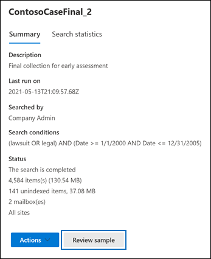

# Voorbeeld van eDiscovery-zoekresultaten bekijkenPreview eDiscovery search results

Nadat u een inhoudszoekactie of een zoekopdracht die is gekoppeld aan een kern-eDiscovery-zaak hebt uitgevoerd, kunt u een voorbeeld bekijken van de resultaten die door de zoekopdracht worden geretourneerd.After you run a Content search or a search associated with a Core eDiscovery case, you can preview a sample of the results returned by the search. Door voorbeelden te bekijken van items die door de zoekquery worden geretourneerd, kunt u bepalen of de zoekopdracht de resultaten retourneert waar u op hoopte, of dat u de zoekquery moet wijzigen en de zoekopdracht opnieuw moet uitvoeren.Previewing items returned by the search query can help you determine if the search is returning the results you hope for or if you need to change the search query and rerun the search.

Een voorbeeld bekijken van de resultaten die door een zoekopdracht worden geretourneerd:To preview a sample of results returned by a search:

1. Ga in het Microsoft 365-compliancecentrum naar de pagina Inhoud zoeken of een belangrijke eDiscovery-zaak.In the Microsoft 365 compliance center, go to the Content search page or a Core eDiscovery case.

2. Selecteer de zoekfunctie om de flyoutpagina weer te geven.Select search to display the flyout page.

3. Klik onderaan de flyoutpagina op **Voorbeeld controleren**.On the bottom of the flyout page, click **Review sample**.

   

   Er wordt een pagina weergegeven met daarin een voorbeeld van de zoekresultaten.A page is displayed containing a sample of the search results.

4. Selecteer een item om de inhoud ervan weer te geven in het leesvenster.Select an item to view its contents in the reading pane.

   

   In de vorige schermopname ziet u dat trefwoorden uit de zoekquery zijn gemarkeerd wanneer u een voorbeeld van items bekijkt.In the previous screenshot, notice that keywords from the search query are highlighted when you preview items.

## Hoe de voorbeelden van zoekresultaten worden geselecteerdHow the search result samples are selected

Er kunnen maximaal 1000 willekeurig geselecteerde items als voorbeeld worden weergegeven.A maximum of 1,000 randomly selected items are available to preview. Items die beschikbaar zijn om als voorbeeld te worden weergegeven, moeten niet alleen willekeurig worden geselecteerd, maar moeten ook voldoen aan de volgende criteria:In addition to being randomly selected, items available for preview must also meet the following criteria:

- Er kan maximaal 100 items uit één inhoudslocatie (een postvak of een site) als voorbeeld worden bekeken.A maximum of 100 items from a single content location (a mailbox or a site) can be previewed. Dit betekent dat er mogelijk minder dan 1000 items beschikbaar zijn om als voorbeeld te worden bekeken.This means that it's possible that less than 1,000 items might be available for preview. Als u bijvoorbeeld in vier postvakken zoekt en u 1500 geschatte items als gevolg hebt, zijn er slechts 400 beschikbaar om als voorbeeld te worden bekeken, omdat er slechts 100 items uit elk postvak als voorbeeld kunnen worden bekeken.For example, if you search four mailboxes and the search returns 1,500 estimated items, only 400 will be available for preview because only 100 items from each mailbox can be previewed.

- Voor postvakitems zijn alleen e-mailberichten beschikbaar om als voorbeeld te worden bekeken.For mailbox items, only email messages are available to preview. Van items zoals taken, agenda-items en contactpersonen kan geen voorbeeld worden weergegeven.Items like tasks, calendar items, and contacts can't be previewed.

- Voor site-items zijn alleen documenten beschikbaar om als voorbeeld worden bekeken.For site items, only documents are available to preview. Er kan geen voorbeeld worden weergegeven van items zoals mappen, lijsten of lijstbijlagen.Items like folders, lists, or list attachments can't be previewed.

## Ondersteunde bestandstypen bij het bekijken van zoekresultatenFile types supported when previewing search results

U kunt ondersteunde bestandstypen vooraf bekijken in het voorbeeldvenster.You can preview supported file types in the preview pane. Als een bestandstype niet wordt ondersteund, moet u een kopie van het bestand downloaden naar uw lokale computer (door te klikken op **Oorspronkelijk item downloaden**).If a file type isn't supported, you have to download a copy of the file to your local computer (by clicking **Download original item**). Voor .aspx-webpagina's wordt de URL voor de pagina opgenomen, hoewel u mogelijk geen machtigingen hebt voor toegang tot de pagina.For .aspx Web pages, the URL for the page is included though you may not have permissions to access the page. Houd er ook rekening mee dat niet-geïndexeerde items niet beschikbaar zijn om als voorbeeld te bekijken.Unindexed items aren't available for previewing.

De volgende bestandstypen worden ondersteund en kunnen vooraf worden bekeken in het deelvenster met zoekresultaten.The following file types are supported and can be previewed in the search results pane.
  
- .txt, .html, .mhtml.txt, .html, .mhtml

- .eml.eml

- .doc, .docx, .docm.doc, .docx, .docm

- .pptm, .pptx.pptm, .pptx

- .pdf.pdf

De volgende bestandscontainertypen worden ook ondersteund.Also, the following file container types are supported. U kunt de lijst met bestanden in de container bekijken in het voorbeeldvenster.You can view the list of files in the container in the preview pane.
  
- .zip.zip

- .gzip.gzip