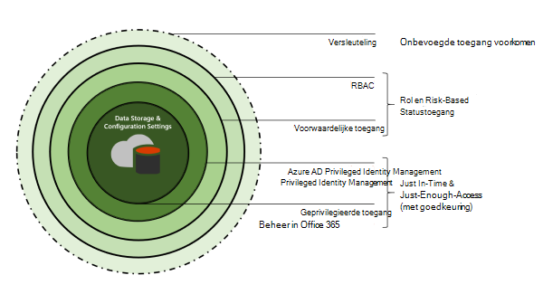
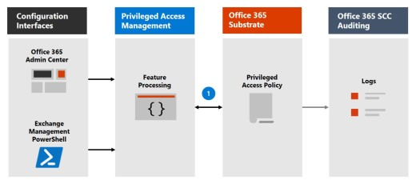
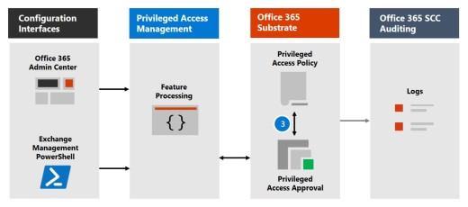

# Meer informatie over Privileged Access ManagementLearn about privileged access management

Met bevoorrecht toegangsbeheer kunt u gedetailleerde toegangsbeheer over bevoorrechte beheertaken in Office 365.Privileged access management allows granular access control over privileged admin tasks in Office 365. Het kan uw organisatie helpen beschermen tegen inbreuken die gebruikmaken van bestaande bevoorrechte beheerdersaccounts met permanente toegang tot gevoelige gegevens of toegang tot kritieke configuratie-instellingen.It can help protect your organization from breaches that use existing privileged admin accounts with standing access to sensitive data or access to critical configuration settings. Voor bevoorrecht toegangsbeheer moeten gebruikers just-in-time toegang aanvragen om verhoogde en geprivilegieerde taken te voltooien via een zeer bereik en tijdgebonden goedkeuringswerkstroom.Privileged access management requires users to request just-in-time access to complete elevated and privileged tasks through a highly scoped and time-bounded approval workflow. Deze configuratie biedt gebruikers net voldoende toegang om de taak bij de hand uit te voeren, zonder dat ze risico lopen op blootstelling van gevoelige gegevens of kritieke configuratie-instellingen.This configuration gives users just-enough-access to perform the task at hand, without risking exposure of sensitive data or critical configuration settings. Door het inschakelen van bevoorrecht toegangsbeheer in Microsoft 365 kan uw organisatie werken met nul staande bevoegdheden en een verdedigingslaag bieden tegen permanente beveiligingslekken voor beheerderstoegang.Enabling privileged access management in Microsoft 365 allows your organization to operate with zero standing privileges and provide a layer of defense against standing administrative access vulnerabilities.

Zie deze video over Customer Lockbox en privileged access management voor een kort overzicht van de geïntegreerde werkstroom Customer Lockbox en [privileged access management.](https://go.microsoft.com/fwlink/?linkid=2066800)For a quick overview of the integrated Customer Lockbox and privileged access management workflow, see this [Customer Lockbox and privileged access management video](https://go.microsoft.com/fwlink/?linkid=2066800).

## Lagen van beveiligingLayers of protection

Bevoorrecht toegangsbeheer vormt een aanvulling op andere gegevens- en toegangsfunctiebeveiligingen binnen de Microsoft 365 beveiligingsarchitectuur.Privileged access management complements other data and access feature protections within the Microsoft 365 security architecture. Het gebruik van bevoorrecht toegangsbeheer als onderdeel van een geïntegreerde en gelaagde beveiligingsbenadering biedt een beveiligingsmodel dat de bescherming van gevoelige informatie en Microsoft 365 configuratie-instellingen maximaliseert.Including privileged access management as part of an integrated and layered approach to security provides a security model that maximizes protection of sensitive information and Microsoft 365 configuration settings. Zoals wordt weergegeven in het diagram, wordt het bevoorrechte toegangsbeheer gebaseerd op de bescherming die wordt geboden met native versleuteling van Microsoft 365-gegevens en het beveiligingsmodel voor toegangscontrole op basis van rollen van Microsoft 365 services.As shown in the diagram, privileged access management builds on the protection provided with native encryption of Microsoft 365 data and the role-based access control security model of Microsoft 365 services. Wanneer deze twee [functies](/azure/active-directory/active-directory-privileged-identity-management-configure)worden gebruikt Privileged Identity Management Azure AD-Privileged Identity Management, bieden deze twee functies toegangsbeheer met just-in-time toegang tot verschillende bereiken.When used with [Azure AD Privileged Identity Management](/azure/active-directory/active-directory-privileged-identity-management-configure), these two features provide access control with just-in-time access at different scopes.

Bevoorrecht toegangsbeheer is  gedefinieerd en is een bereik op taakniveau, terwijl Azure AD Privileged Identity Management beveiliging op rollenniveau met de mogelijkheid om meerdere taken uit te voeren. Privileged access management is defined and scoped at the **task** level, while Azure AD Privileged Identity Management applies protection at the **role** level with the ability to execute multiple tasks. Azure AD Privileged Identity Management in de eerste plaats het beheren van toegangen voor AD-rollen en -rollengroepen, terwijl het beheer van geprivilegieerde toegang in Microsoft 365 alleen op taakniveau van toepassing is.Azure AD Privileged Identity Management primarily allows managing accesses for AD roles and role groups, while privileged access management in Microsoft 365 applies only at the task level.

- **Bevoorrecht toegangsbeheer inschakelen terwijl u Azure AD-Privileged Identity Management:** Het toevoegen van bevoorrecht toegangsbeheer biedt een andere gedetailleerde laag beveiligings- en auditmogelijkheden voor bevoorrechte toegang tot Microsoft 365 gegevens.**Enabling privileged access management while already using Azure AD Privileged Identity Management:** Adding privileged access management provides another granular layer of protection and audit capabilities for privileged access to Microsoft 365 data.

- **Azure AD-Privileged Identity Management inschakelen terwijl u al bevoorrecht toegangsbeheer gebruikt in Office 365:**  Als u Azure AD-Privileged Identity Management voor bevoorrecht toegangsbeheer toevoegt, kan de bevoorrechte toegang worden uitgebreid tot gegevens buiten Microsoft 365 die hoofdzakelijk worden gedefinieerd door gebruikersrollen of identiteiten.**Enabling Azure AD Privileged Identity Management while already using privileged access management in Office 365:**  Adding Azure AD Privileged Identity Management to privileged access management can extend privileged access to data outside of Microsoft 365 that's primarily defined by user roles or identity.  

## Architectuur en processtroom met bevoorrecht toegangsbeheerPrivileged access management architecture and process flow

Elk van de volgende processtromen beschrijft de architectuur van bevoorrechte toegang en de interactie met de substraat Microsoft 365 substraat, auditing en de Exchange management runspace.Each of the following process flows outline the architecture of privileged access and how it interacts with the Microsoft 365 substrate, auditing, and the Exchange Management runspace.

### Stap 1: Een beleid voor geprivilegieerde toegang configurerenStep 1: Configure a privileged access policy

Wanneer u een beleid voor geprivilegieerde toegang configureert met het Microsoft 365-beheercentrum [of](https://admin.microsoft.com) het Exchange Management PowerShell, definieert u het beleid en de bevoorrechte toegangsfunctieprocessen en de beleidskenmerken in de Microsoft 365 substraat.When you configure a privileged access policy with the [Microsoft 365 admin center](https://admin.microsoft.com) or the Exchange Management PowerShell, you define the policy and the privileged access feature processes and the policy attributes in the Microsoft 365 substrate. De activiteiten worden geregistreerd in het Beveiligings &amp; compliancecentrum.The activities are logged in the Security &amp; Compliance Center. Het beleid is nu ingeschakeld en klaar om binnenkomende aanvragen voor goedkeuringen te verwerken.The policy is now enabled and ready to handle incoming requests for approvals.

### Stap 2: Access-aanvraagStep 2: Access request

In het [Microsoft 365 beheercentrum](https://admin.microsoft.com) of met Exchange Management PowerShell kunnen gebruikers toegang aanvragen tot verhoogde of bevoorrechte taken.In the [Microsoft 365 admin center](https://admin.microsoft.com) or with the Exchange Management PowerShell, users can request access to elevated or privileged tasks. Met de functie voor bevoorrechte toegang wordt de aanvraag naar het substraat Microsoft 365 voor verwerking met het geconfigureerde toegangsbeleid voor bevoegdheden en worden de activiteiten in de logboeken van het Beveiligings &amp; compliancecentrum opgeslagen.The privileged access feature sends the request to the Microsoft 365 substrate for processing against the configured privilege access policy and records the Activity in the Security &amp; Compliance Center logs.

### Stap 3: Goedkeuring van AccessStep 3: Access approval

Er wordt een goedkeuringsaanvraag gegenereerd en de melding van de aanvraag in behandeling wordt per e-mail verzonden naar goedkeurders.An approval request is generated and the pending request notification is emailed to approvers. Als dit is goedgekeurd, wordt de aanvraag voor geprivilegieerde toegang verwerkt als een goedkeuring en is de taak gereed om te worden voltooid.If approved, the privileged access request is processed as an approval and the task is ready to be completed. Als de taak wordt geweigerd, wordt de taak geblokkeerd en wordt er geen toegang verleend aan de indiener van de aanvraag.If denied, the task is blocked and no access is granted to the requestor. De aanmelder wordt via een e-mailbericht op de hoogte gesteld van de goedkeuring of weigering van de aanvraag.The requestor is notified of the request approval or denial via email message.

### Stap 4: Access-verwerkingStep 4: Access processing

Voor een goedgekeurde aanvraag wordt de taak verwerkt door de Exchange Runspace Management.For an approved request, the task is processed by the Exchange Management runspace. De goedkeuring wordt gecontroleerd op basis van het beleid voor bevoorrechte toegang en wordt verwerkt door Microsoft 365 substraat.The approval is checked against the privileged access policy and processed by the Microsoft 365 substrate. Alle activiteiten voor de taak worden geregistreerd in het Beveiligings &amp; compliancecentrum.All activity for the task is logged in the Security &amp; Compliance Center.

## Veelgestelde vragenFrequently asked questions

### Welke SKU's kunnen geprivilegieerde toegang gebruiken in Office 365?What SKUs can use privileged access in Office 365?

Privileged access management is beschikbaar voor klanten voor een breed scala aan Microsoft 365 en Office 365 en invoegtoepassingen.Privileged access management is available for customers for a wide selection of Microsoft 365 and Office 365 subscriptions and add-ons. Zie [Aan de slag met bevoorrecht toegangsbeheer](privileged-access-management-configuration.md) voor meer informatie.See [Get started with privileged access management](privileged-access-management-configuration.md) for details.

### Wanneer worden bevoorrechte toegangsrechten Office 365 werkbelastingen buiten Exchange?When will privileged access support Office 365 workloads beyond Exchange?

Bevoorrecht toegangsbeheer is binnenkort beschikbaar in andere Office 365 werkbelastingen.Privileged access management will be available in other Office 365 workloads soon. Ga naar [Microsoft 365 routekaart voor](https://www.microsoft.com/microsoft-365/roadmap) meer informatie.Visit the [Microsoft 365 Roadmap](https://www.microsoft.com/microsoft-365/roadmap) for more details.

### Mijn organisatie heeft meer dan 30 beleidsregels voor geprivilegieerde toegang nodig, wordt deze limiet dan verhoogd?My organization needs more than 30 privileged access policies, will this limit be increased?

Ja, het verhogen van de huidige limiet van 30 beleidsregels voor bevoorrechte toegang per organisatie staat op de routekaart voor functies.Yes, raising the current limit of 30 privileged access policies per organization is on the feature roadmap.

### Moet ik een globale beheerder zijn om geprivilegieerde toegang te beheren in Office 365?Do I need to be a Global Admin to manage privileged access in Office 365?

Nee, u hebt de rol Exchange rollenbeheer die is toegewezen aan accounts die geprivilegieerde toegang beheren in Office 365.No, you need the Exchange Role Management role assigned to accounts that manage privileged access in Office 365. Als u de rol Rollenbeheer niet wilt configureren als een op zichzelf staand accountmachtiging, bevat de rol Globale beheerder deze rol standaard en kan u bevoorrechte toegang beheren.If you don't want to configure the Role Management role as a stand-alone account permission, the Global Administrator role includes this role by default and can manage privileged access. Gebruikers die deel uit maken van een groep goedkeurders hoeven geen globale beheerder te zijn of de rol Rollenbeheer te hebben toegewezen om aanvragen met PowerShell te controleren en goed te keuren.Users included in an approvers' group don't need to be a Global Admin or have the Role Management role assigned to review and approve requests with PowerShell.

### Hoe is privileged access management gerelateerd aan Customer Lockbox?How is privileged access management related to Customer Lockbox?

[Customer Lockbox](/office365/admin/manage/customer-lockbox-requests) biedt een niveau van toegangsbeheer voor organisaties wanneer Microsoft toegang heeft tot gegevens.[Customer Lockbox](/office365/admin/manage/customer-lockbox-requests) allows a level of access control for organizations when Microsoft accesses data. Bevoorrecht toegangsbeheer biedt gedetailleerde toegangsbeheer binnen een organisatie voor alle Microsoft 365 bevoorrechte taken.Privileged access management allows granular access control within an organization for all Microsoft 365 privileged tasks.

## Klaar om aan de slag te gaan?Ready to get started?

Start [met het configureren van uw organisatie voor bevoorrecht toegangsbeheer.](privileged-access-management-configuration.md)Start [configuring your organization for privileged access management](privileged-access-management-configuration.md).

## Meer informatieLearn more

[Interactieve handleiding: beheerderstaken bewaken en beheren met bevoorrecht toegangsbeheerInteractive guide: Monitor and control administrator tasks with privileged access management](https://content.cloudguides.com/guides/Privileged%20Access%20Management)
