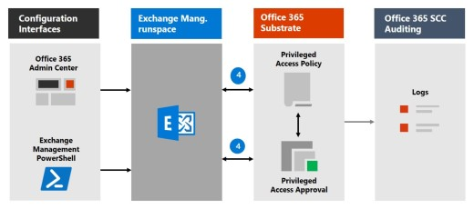

# Meer informatie over Privileged Access Management

Met bevoorrecht toegangsbeheer kunt u gedetailleerde toegangsbeheer over bevoorrechte beheertaken in Office 365. Het kan uw organisatie helpen beschermen tegen inbreuken die gebruikmaken van bestaande bevoorrechte beheerdersaccounts met permanente toegang tot gevoelige gegevens of toegang tot kritieke configuratie-instellingen. Voor bevoorrecht toegangsbeheer moeten gebruikers just-in-time toegang aanvragen om verhoogde en geprivilegieerde taken te voltooien via een zeer bereik en tijdgebonden goedkeuringswerkstroom. Deze configuratie biedt gebruikers net voldoende toegang om de taak bij de hand uit te voeren, zonder dat ze risico lopen op blootstelling van gevoelige gegevens of kritieke configuratie-instellingen. Door het inschakelen van bevoorrecht toegangsbeheer in Microsoft 365 kan uw organisatie werken met nul staande bevoegdheden en een verdedigingslaag bieden tegen permanente beveiligingslekken voor beheerderstoegang.

Zie deze video over Customer Lockbox en privileged access management voor een kort overzicht van de geïntegreerde werkstroom Customer Lockbox en [privileged access management.](https://go.microsoft.com/fwlink/?linkid=2066800)

## Lagen van beveiliging

Bevoorrecht toegangsbeheer vormt een aanvulling op andere gegevens- en toegangsfunctiebeveiligingen binnen de Microsoft 365 beveiligingsarchitectuur. Het gebruik van bevoorrecht toegangsbeheer als onderdeel van een geïntegreerde en gelaagde beveiligingsbenadering biedt een beveiligingsmodel dat de bescherming van gevoelige informatie en Microsoft 365 configuratie-instellingen maximaliseert. Zoals wordt weergegeven in het diagram, wordt het bevoorrechte toegangsbeheer gebaseerd op de bescherming die wordt geboden met native versleuteling van Microsoft 365-gegevens en het beveiligingsmodel voor toegangscontrole op basis van rollen van Microsoft 365 services. Wanneer deze twee [functies](/azure/active-directory/active-directory-privileged-identity-management-configure)worden gebruikt Privileged Identity Management Azure AD-Privileged Identity Management, bieden deze twee functies toegangsbeheer met just-in-time toegang tot verschillende bereiken.

Bevoorrecht toegangsbeheer is  gedefinieerd en is een bereik op taakniveau, terwijl Azure AD Privileged Identity Management beveiliging op rollenniveau met de mogelijkheid om meerdere taken uit te voeren.  Azure AD Privileged Identity Management in de eerste plaats het beheren van toegangen voor AD-rollen en -rollengroepen, terwijl het beheer van geprivilegieerde toegang in Microsoft 365 alleen op taakniveau van toepassing is.

- **Bevoorrecht toegangsbeheer inschakelen terwijl u Azure AD-Privileged Identity Management:** Het toevoegen van bevoorrecht toegangsbeheer biedt een andere gedetailleerde laag beveiligings- en auditmogelijkheden voor bevoorrechte toegang tot Microsoft 365 gegevens.

- **Azure AD-Privileged Identity Management inschakelen terwijl u al bevoorrecht toegangsbeheer gebruikt in Office 365:**  Als u Azure AD-Privileged Identity Management voor bevoorrecht toegangsbeheer toevoegt, kan de bevoorrechte toegang worden uitgebreid tot gegevens buiten Microsoft 365 die hoofdzakelijk worden gedefinieerd door gebruikersrollen of identiteiten.  

## Architectuur en processtroom met bevoorrecht toegangsbeheer

Elk van de volgende processtromen beschrijft de architectuur van bevoorrechte toegang en de interactie met de substraat Microsoft 365 substraat, auditing en de Exchange management runspace.

### Stap 1: Een beleid voor geprivilegieerde toegang configureren

Wanneer u een beleid voor geprivilegieerde toegang configureert met het Microsoft 365-beheercentrum [of](https://admin.microsoft.com) het Exchange Management PowerShell, definieert u het beleid en de bevoorrechte toegangsfunctieprocessen en de beleidskenmerken in de Microsoft 365 substraat. De activiteiten worden geregistreerd in het Beveiligings &amp; compliancecentrum. Het beleid is nu ingeschakeld en klaar om binnenkomende aanvragen voor goedkeuringen te verwerken.

### Stap 2: Access-aanvraag

In het [Microsoft 365 beheercentrum](https://admin.microsoft.com) of met Exchange Management PowerShell kunnen gebruikers toegang aanvragen tot verhoogde of bevoorrechte taken. Met de functie voor bevoorrechte toegang wordt de aanvraag naar het substraat Microsoft 365 voor verwerking met het geconfigureerde toegangsbeleid voor bevoegdheden en worden de activiteiten in de logboeken van het Beveiligings &amp; compliancecentrum opgeslagen.

### Stap 3: Goedkeuring van Access

Er wordt een goedkeuringsaanvraag gegenereerd en de melding van de aanvraag in behandeling wordt per e-mail verzonden naar goedkeurders. Als dit is goedgekeurd, wordt de aanvraag voor geprivilegieerde toegang verwerkt als een goedkeuring en is de taak gereed om te worden voltooid. Als de taak wordt geweigerd, wordt de taak geblokkeerd en wordt er geen toegang verleend aan de indiener van de aanvraag. De aanmelder wordt via een e-mailbericht op de hoogte gesteld van de goedkeuring of weigering van de aanvraag.

### Stap 4: Access-verwerking

Voor een goedgekeurde aanvraag wordt de taak verwerkt door de Exchange Runspace Management. De goedkeuring wordt gecontroleerd op basis van het beleid voor bevoorrechte toegang en wordt verwerkt door Microsoft 365 substraat. Alle activiteiten voor de taak worden geregistreerd in het Beveiligings &amp; compliancecentrum.

## Veelgestelde vragen

### Welke SKU's kunnen geprivilegieerde toegang gebruiken in Office 365?

Privileged access management is beschikbaar voor klanten voor een breed scala aan Microsoft 365 en Office 365 en invoegtoepassingen. Zie [Aan de slag met bevoorrecht toegangsbeheer](privileged-access-management-configuration.md) voor meer informatie.

### Wanneer worden bevoorrechte toegangsrechten Office 365 werkbelastingen buiten Exchange?

Bevoorrecht toegangsbeheer is binnenkort beschikbaar in andere Office 365 werkbelastingen. Ga naar [Microsoft 365 routekaart voor](https://www.microsoft.com/microsoft-365/roadmap) meer informatie.

### Mijn organisatie heeft meer dan 30 beleidsregels voor geprivilegieerde toegang nodig, wordt deze limiet dan verhoogd?

Ja, het verhogen van de huidige limiet van 30 beleidsregels voor bevoorrechte toegang per organisatie staat op de routekaart voor functies.

### Moet ik een globale beheerder zijn om geprivilegieerde toegang te beheren in Office 365?

Nee, u hebt de rol Exchange rollenbeheer die is toegewezen aan accounts die geprivilegieerde toegang beheren in Office 365. Als u de rol Rollenbeheer niet wilt configureren als een op zichzelf staand accountmachtiging, bevat de rol Globale beheerder deze rol standaard en kan u bevoorrechte toegang beheren. Gebruikers die deel uit maken van een groep goedkeurders hoeven geen globale beheerder te zijn of de rol Rollenbeheer te hebben toegewezen om aanvragen met PowerShell te controleren en goed te keuren.

### Hoe is privileged access management gerelateerd aan Customer Lockbox?

[Customer Lockbox](/office365/admin/manage/customer-lockbox-requests) biedt een niveau van toegangsbeheer voor organisaties wanneer Microsoft toegang heeft tot gegevens. Bevoorrecht toegangsbeheer biedt gedetailleerde toegangsbeheer binnen een organisatie voor alle Microsoft 365 bevoorrechte taken.

## Klaar om aan de slag te gaan?

Start [met het configureren van uw organisatie voor bevoorrecht toegangsbeheer.](privileged-access-management-configuration.md)

## Meer informatie

[Interactieve handleiding: beheerderstaken bewaken en beheren met bevoorrecht toegangsbeheer](https://content.cloudguides.com/guides/Privileged%20Access%20Management)
