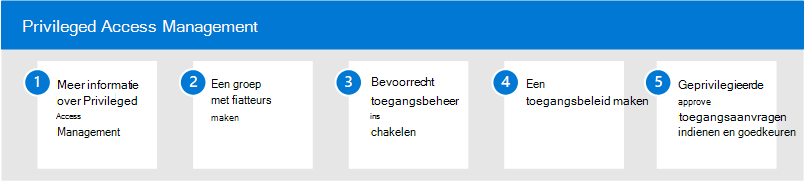

# Bevoorrecht toegangsbeheer in Microsoft 365

Permanente toegang van sommige gebruikers tot gevoelige informatie of kritieke netwerkconfiguratie-instellingen in Microsoft Exchange Online is een potentieel pad voor gecompromitteerde accounts of interne bedreigingsactiviteiten. Bevoorrecht toegangsbeheer helpt uw organisatie te beschermen tegen inbreuken en helpt bij het voldoen aan compliance-best practices door permanente toegang tot gevoelige gegevens of toegang tot kritieke configuratie-instellingen te beperken. In plaats van beheerders die constant toegang hebben, worden just-in-time toegangsregels geïmplementeerd voor taken die verhoogde machtigingen nodig hebben. Als u bevoorrecht toegangsbeheer inschakelen voor Exchange Online in Microsoft 365, kan uw organisatie werken met nul staande bevoegdheden en een verdedigingslaag bieden tegen permanente beveiligingslekken voor beheerderstoegang.

## Bevoorrecht toegangsbeheer configureren voor Microsoft 365

Gebruik de volgende stappen om het beheer van geprivilegieerde toegang voor uw organisatie te configureren:

1. Meer informatie [over bevoorrecht toegangsbeheer](privileged-access-management-overview.md) in Microsoft 365
2. De groep [van een goedkeurder maken](privileged-access-management-configuration.md#step-1-create-an-approvers-group)
3. [Bevoorrecht toegangsbeheer inschakelen](privileged-access-management-configuration.md#step-2-enable-privileged-access)
4. Een [toegangsbeleid maken](privileged-access-management-configuration.md#step-3-create-an-access-policy)
5. [Geprivilegieerde toegangsaanvragen indienen/goedkeuren](privileged-access-management-configuration.md#step-4-submitapprove-privileged-access-requests)

## Meer informatie over bevoorrecht toegangsbeheer

- [Veelgestelde vragen over bevoorrecht toegangsbeheer](privileged-access-management-overview.md#frequently-asked-questions)