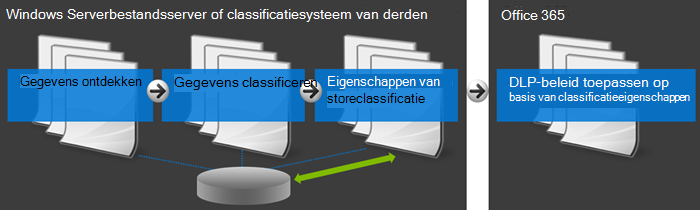
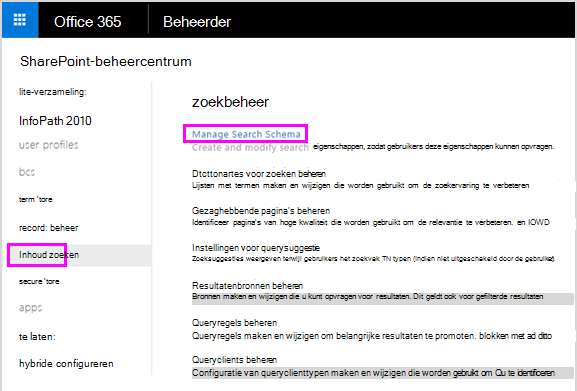
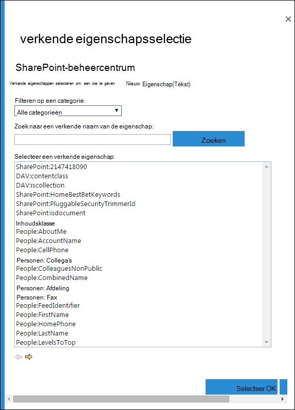
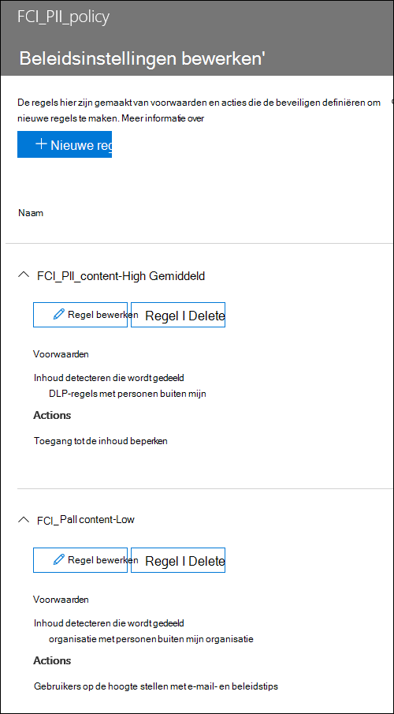

# <a name="create-a-dlp-policy-to-protect-documents-with-fci-or-other-properties"></a>Een DLP-beleid maken om documenten te beveiligen met FCI of andere eigenschappen

Microsoft 365 DLP-beleid (Data Loss Prevention) kan classificatieeigenschappen of itemeigenschappen gebruiken om gevoelige items te identificeren. U kunt bijvoorbeeld het volgende gebruiken:

- Windows Eigenschappen van de infrastructuur voor serverbestandsclassificatie (FCI)
- SharePoint documenteigenschappen
- systeemdocumenteigenschappen van derden



Uw organisatie kan bijvoorbeeld Windows Server FCI gebruiken om items te identificeren met persoonlijke gegevens, zoals  socialezekerheidsnummers, en vervolgens het document te classificeren door de eigenschap Persoonsgegevens in te stellen op **Hoog,** **Gemiddeld,** Laag **,** Openbaar of Niet **PII** op basis van het type en het aantal exemplaren van persoonlijke gegevens in het document.

In Microsoft 365 kunt u een DLP-beleid maken waarin documenten worden geïdentificeerd die  zijn ingesteld op specifieke waarden, zoals Hoog en **Gemiddeld,** en vervolgens actie ondernemen, zoals het blokkeren van de toegang tot die bestanden. Hetzelfde beleid kan een andere regel hebben die een andere actie onderneemt als de eigenschap is ingesteld op **Laag,** zoals het verzenden van een e-mailmelding. Op deze manier wordt DLP geïntegreerd met Windows Server FCI en kunnen Office documenten die zijn geüpload of gedeeld naar Microsoft 365 van Windows Server-bestandsservers, worden beschermd.

Een DLP-beleid zoekt alleen naar een specifieke eigenschapsnaam/-waardepaar. Elke document eigenschap kan worden gebruikt, zolang de eigenschap een bijbehorende beheerde eigenschap heeft voor SharePoint zoeken. In een SharePoint siteverzameling kan bijvoorbeeld een inhoudstype met de naam **Trip Report** worden gebruikt met een verplicht veld met de naam **Klant.** Wanneer een persoon een reisrapport maakt, moet hij of zij de naam van de klant invoeren. Deze eigenschapsnaam/waardepaar kan ook worden gebruikt in een DLP-beleid, bijvoorbeeld als u een  regel wilt die de toegang tot het document voor gasten blokkeert wanneer het veld **Klant Contoso bevat.**

Als u uw DLP-beleid wilt toepassen op inhoud met specifieke Microsoft 365 etiketten, moet u de stappen hier niet volgen. In plaats daarvan leert u hoe [u een bewaarlabel gebruikt als voorwaarde in een DLP-beleid.](data-loss-prevention-policies.md#using-a-retention-label-as-a-condition-in-a-dlp-policy)

## <a name="before-you-create-the-dlp-policy"></a>Voordat u het DLP-beleid maakt

Voordat u een FCI-eigenschap Windows server in een DLP-beleid kunt gebruiken, moet u een beheerde eigenschap maken in het SharePoint beheercentrum. Dit is waarom.

In SharePoint Online en OneDrive voor Bedrijven wordt de zoekindex opgebouwd door de inhoud op uw sites te crawlen. De verkender haalt inhoud en metagegevens op uit de documenten in de vorm van verkende eigenschappen. Met het zoekschema kan de verkender bepalen welke inhoud en metagegevens moeten worden opgehaald. Voorbeelden van metagegevens zijn de auteur en de titel van een document. Als u echter de inhoud en metagegevens uit de documenten in de zoekindex wilt krijgen, moeten de verkende eigenschappen zijn toegesneden op beheerde eigenschappen. Alleen beheerde eigenschappen worden in de index bewaard. Een verkende eigenschap met betrekking tot auteur is bijvoorbeeld toegesneden op een beheerde eigenschap die betrekking heeft op auteur.

> [!NOTE]
> Zorg ervoor dat u een beheerde eigenschapsnaam gebruikt en niet een verkende eigenschapsnaam bij het maken van DLP-regels met behulp van de `ContentPropertyContainsWords` voorwaarde.

Dit is belangrijk omdat DLP de zoekcrawler gebruikt om gevoelige informatie op uw sites te identificeren en te classificeren en deze gevoelige informatie vervolgens op te slaan in een veilig deel van de zoekindex. Wanneer u een document uploadt naar Office 365, SharePoint automatisch verkende eigenschappen gemaakt op basis van de documenteigenschappen. Maar als u een FCI of een andere eigenschap wilt gebruiken in een DLP-beleid, moet die verkende eigenschap worden toegeschreven aan een beheerde eigenschap, zodat inhoud met die eigenschap in de index wordt bewaard.

Zie Het zoekschema beheren in SharePoint Online voor meer [informatie over zoek- en beheerde eigenschappen.](/sharepoint/manage-search-schema)

### <a name="step-1-upload-a-document-with-the-needed-property-to-office-365"></a>Stap 1: Upload een document met de benodigde eigenschap Office 365

U moet eerst een document uploaden met de eigenschap waarnaar u wilt verwijzen in uw DLP-beleid. Microsoft 365 detecteert de eigenschap en maakt er automatisch een verkende eigenschap van. In de volgende stap maakt u een beheerde eigenschap en vervolgens de beheerde eigenschap toe aan deze verkende eigenschap.

### <a name="step-2-create-a-managed-property"></a>Stap 2: Een beheerde eigenschap maken

1. Meld u aan bij het Microsoft 365-beheercentrum.

2. Kies in de  linkernavigatie de optie \> **Beheercentra SharePoint.** U bent nu in het SharePoint beheercentrum.

3. Kies in de linkernavigatie de **optie Zoeken** op de pagina Zoekbeheer \> Beheren van  \> **zoekschema.**

   

4. Op de **pagina Beheerde eigenschappen** \> **nieuwe beheerde eigenschap**.

   

5. Voer een naam en beschrijving in voor de eigenschap. Deze naam wordt weergegeven in uw DLP-beleid.

6. Kies **voor Type** de optie **Tekst**.

7. Selecteer **onder Hoofdkenmerken** de optie **Queryable** en **Retrievable.**

8. Onder **Toewijzingen aan verkende eigenschappen Voeg** een toewijzing \> **toe.**

9. Zoek  in het dialoogvenster Verkende eigenschappenselectie de verkende eigenschap die overeenkomt met de eigenschap Windows Server FCI of een andere eigenschap die u in uw DLP-beleid OK wilt \> \> **gebruiken.**

   

10. Onder aan de pagina \> **OK.**

## <a name="create-a-dlp-policy-that-uses-an-fci-property-or-other-property"></a>Een DLP-beleid maken dat gebruikmaakt van een FCI-eigenschap of een andere eigenschap

In dit voorbeeld gebruikt een organisatie FCI op de Windows serverbestandsservers. specifiek gebruiken ze de eigenschap FCI-classificatie met de naam Persoonlijke **identificeerbare** gegevens met mogelijke waarden van **Hoog,** **Gemiddeld,** **Laag**, **Openbaar** en **Niet PII**. Nu willen ze hun bestaande FCI-classificatie gebruiken in hun DLP-beleid in Office 365.

Eerst volgen ze de bovenstaande stappen om een beheerde eigenschap te maken in SharePoint Online, die wordt toegeschreven aan de verkende eigenschap die automatisch is gemaakt vanuit de FCI-eigenschap.

Vervolgens maken ze een DLP-beleid met twee regels die beide de voorwaarde Documenteigenschappen gebruiken **die een van deze waarden bevatten:**

- **FCI PII-inhoud - Hoog, Gemiddeld** De eerste regel beperkt de toegang tot het document als de eigenschap  Persoonlijke **identificeerbare** gegevens van de FCI gelijk is aan **Hoog** of Gemiddeld en het document wordt gedeeld met personen buiten de organisatie.

- **FCI PII-inhoud - Laag** De tweede regel stuurt een melding naar de eigenaar van het document als de eigenschap Persoonlijke **identificeerbare** gegevens van FCI gelijk is aan **Laag** en het document wordt gedeeld met personen buiten de organisatie.

### <a name="create-the-dlp-policy-by-using-powershell"></a>Het DLP-beleid maken met PowerShell

De voorwaarde **Documenteigenschappen bevatten een van** deze waarden is tijdelijk niet beschikbaar in de gebruikersinterface van het Beveiligings compliancecentrum, maar u kunt deze voorwaarde wel gebruiken &amp; met PowerShell. U kunt de cmdlets gebruiken om te werken met een DLP-beleid en de cmdlets met de parameter gebruiken om de voorwaarde toe te voegen Documenteigenschappen bevatten een `New\Set\Get-DlpCompliancePolicy` `New\Set\Get-DlpComplianceRule` van deze `ContentPropertyContainsWords` **waarden.**

Zie Cmdlets voor beveiligings compliancecentrum voor meer informatie over deze [ &amp; cmdlets.](/powershell/exchange/exchange-online-powershell)

1. [Verbinding maken naar het Beveiligings &amp; compliancecentrum met behulp van externe PowerShell](/powershell/exchange/connect-to-scc-powershell)

2. Maak het beleid met  `New-DlpCompliancePolicy` behulp van .

Met deze PowerShell wordt een DLP-beleid gemaakt dat van toepassing is op alle locaties.

   ```powershell
   New-DlpCompliancePolicy -Name FCI_PII_policy -ExchangeLocation All -SharePointLocation All -OneDriveLocation All -Mode Enable
   ```

3. Maak de twee regels die hierboven worden beschreven met behulp van , waarbij één regel is voor de lage waarde, en een andere `New-DlpComplianceRule` regel is voor de waarden **Hoog** en Gemiddeld.  

   Hier is een PowerShell-voorbeeld dat deze twee regels maakt. De eigenschappennaam/waardeparen zijn tussen aanhalingstekens en een eigenschapsnaam kan meerdere waarden opgeven die zijn gescheiden door komma's zonder spaties, zoals  `"<Property1>:<Value1>,<Value2>","<Property2>:<Value3>,<Value4>"....`

   ```powershell
   New-DlpComplianceRule -Name FCI_PII_content-High,Moderate -Policy FCI_PII_policy -AccessScope NotInOrganization -BlockAccess $true -ContentPropertyContainsWords "Personally Identifiable Information:High,Moderate" -Disabled $falseNew-DlpComplianceRule -Name FCI_PII_content-Low -Policy FCI_PII_policy -AccessScope NotInOrganization -BlockAccess $false -ContentPropertyContainsWords "Personally Identifiable Information:Low" -Disabled $false -NotifyUser Owner
   ```

   Windows Server FCI bevat veel ingebouwde eigenschappen, waaronder **Persoonsgegevens** die in dit voorbeeld worden gebruikt. De mogelijke waarden voor elke eigenschap kunnen voor elke organisatie verschillen. De **waarden Hoog,** **Gemiddeld** en **Laag** die hier worden gebruikt, zijn slechts een voorbeeld. Voor uw organisatie kunt u de eigenschappen Windows Server FCI-classificatie weergeven met de mogelijke waarden in het bestand Server Resource Manager op de Windows Server-bestandsserver. Zie Een [classificatie-eigenschap maken voor meer informatie.](/previous-versions/windows/it-pro/windows-server-2008-R2-and-2008/dd759215(v=ws.11))

Wanneer u klaar bent, moet uw beleid twee nieuwe regels bevatten waarin beide de **eigenschappen van het document een van deze waarden bevatten.** Deze voorwaarde wordt niet weergegeven in de gebruikersinterface, maar de andere voorwaarden, acties en instellingen worden weergegeven.

Eén regel blokkeert de toegang tot inhoud waarbij de eigenschap **Persoonsgegevens** gelijk is aan **Hoog** of **Gemiddeld.** Een tweede regel stuurt een melding over inhoud waarbij de eigenschap **Persoonsgegevens** gelijk is aan **Laag**.



## <a name="after-you-create-the-dlp-policy"></a>Nadat u het DLP-beleid hebt

Als u de stappen in de vorige secties doet, wordt een DLP-beleid gemaakt dat snel inhoud met die eigenschap detecteert, maar alleen als deze inhoud onlangs is geüpload (zodat de inhoud is geïndexeerd) of als deze inhoud oud is, maar alleen bewerkt is (zodat de inhoud opnieuw wordt geïndexeerd).

Als u inhoud met die eigenschap overal wilt detecteren, kunt u handmatig vragen of uw bibliotheek, site of siteverzameling opnieuw moet worden geïndexeerd, zodat het DLP-beleid op de hoogte is van alle inhoud met die eigenschap. In SharePoint Online wordt inhoud automatisch verkend op basis van een gedefinieerd verkenningsschema. De crawler haalt inhoud op die is gewijzigd sinds de laatste verkenning en werkt de index bij. Als u uw DLP-beleid nodig hebt om inhoud te beveiligen vóór de volgende geplande verkenning, kunt u deze stappen ondernemen.

> [!CAUTION]
> Als u een site opnieuw indexeert, kan dit leiden tot een enorme belasting van het zoeksysteem. Pas opnieuw indexeren als uw scenario dit absoluut vereist.

Zie Handmatig aanvragen voor het crawlen en opnieuw indexeren van een [site, bibliotheek of lijst](/sharepoint/crawl-site-content)voor meer informatie.

### <a name="reindex-a-site-optional"></a>Een site opnieuw indexeren (optioneel)

1. Kies op de site **Instellingen** (tandwielpictogram in de rechterbovenhoek) \> **Site Instellingen.**

2. Kies **onder Zoeken** de optie **Zoek- en offlinebeschikbaarheid** \> **Site opnieuw indexeren.**

## <a name="more-information"></a>Meer informatie

- [Meer informatie over preventie van gegevensverlies](dlp-learn-about-dlp.md)

- [Een DLP-beleid maken vanuit een sjabloon](create-a-dlp-policy-from-a-template.md)

- [Meldingen verzenden en beleidstips voor DLP-beleid tonen](use-notifications-and-policy-tips.md)

- [Wat zijn de DLP-beleidssjablonen?](what-the-dlp-policy-templates-include.md)

- [Definities van entiteiten van het type Gevoelige informatie](sensitive-information-type-entity-definitions.md)