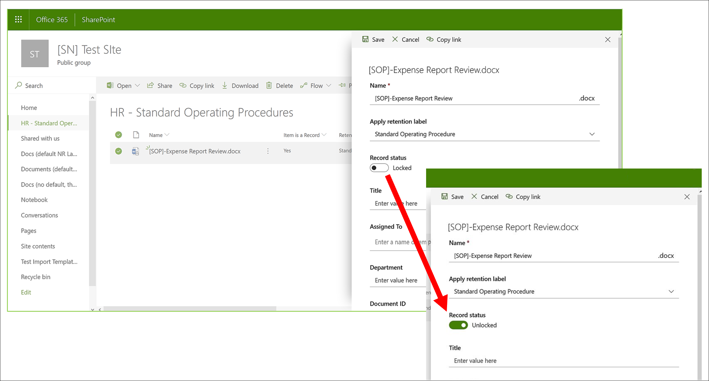

# Versiebeheer van records gebruiken om records bij te werken die zijn opgeslagen in SharePoint of OneDrive

>*[Richtlijnen voor Microsoft 365-licenties voor beveiliging en compliance](/office365/servicedescriptions/microsoft-365-service-descriptions/microsoft-365-tenantlevel-services-licensing-guidance/microsoft-365-security-compliance-licensing-guidance).*

>[!NOTE] 
> Aangezien wettelijke records niet kunnen worden bewerkt, is versiebeheer van records niet beschikbaar voor wettelijke records.

De mogelijkheid om een document als een [record](records-management.md#records) te markeren en acties te beperken die op de record kunnen worden uitgevoerd, is een essentieel doel voor elke oplossing voor recordbeheer. Er kan echter ook samenwerking nodig zijn voor mensen om volgende versies te kunnen maken.

U kunt bijvoorbeeld een verkoopcontract als een record markeren, maar moet het contract vervolgens bijwerken met nieuwe voorwaarden en de nieuwste versie markeren als een nieuwe record terwijl u nog steeds de vorige recordversie behoudt. Voor dit soort scenario's bieden SharePoint en OneDrive ondersteuning voor *versiebeheer van records*. OneNote-notitieblokmappen bieden geen ondersteuning voor versiebeheer van records.

Als u versiebeheer van records wilt gebruiken, moet u eerst [het document labelen en dit als een record markeren](declare-records.md). Op dit punt wordt een documenteigenschap genaamd *Recordstatus* naast het retentielabel weergegeven en is de initiële recordstatus **Vergrendeld**. 

U kunt nu het volgende doen:

  - **Afzonderlijke versies van het document voortdurend bewerken en bewaren als records door de eigenschap Recordstatus te ontgrendelen en te vergrendelen.** Alleen wanneer de eigenschap **Recordstatus** is ingesteld op **Vergrendeld**, wordt er een nieuwe versie van de record bewaard. Deze schakeling tussen vergrendeld en ontgrendeld verkleint het risico dat onnodige versies en exemplaren van het document worden bewaard.

  - **De records automatisch laten opslaan in een in-place recordopslagplaats in de siteverzameling.** Elke siteverzameling in SharePoint en OneDrive bewaart de inhoud in de opslagbibliotheek. Recordversies worden opgeslagen in de map Records in deze bibliotheek.

  - **Een actueel document onderhouden dat alle versies bevat.** In elk SharePoint- en OneDrive-document is standaard een versiegeschiedenis beschikbaar in het itemmenu. In deze versiegeschiedenis kunt u gemakkelijk zien welke versies records zijn en kunt u deze documenten bekijken.

> [!TIP]
> Wanneer u versiebeheer van records gebruikt met een retentielabel dat een verwijderactie heeft, kunt u overwegen de retentie-instelling **Start de retentieperiode op basis van:** te configureren als **Wanneer items waren gelabeld**. Met deze labelinstelling wordt het begin van de retentieperiode opnieuw ingesteld voor elke nieuwe recordversie, wat verzekert dat oudere versies worden verwijderd vóór nieuwere versies.

Versiebeheer van records is automatisch beschikbaar voor elk document met een retentielabel dat het item als een record markeert. Wanneer een gebruiker de documenteigenschappen bekijkt via het detailvenster, kan deze de **Recordstatus** wijzigen van **Vergrendeld** naar **Ontgrendeld**. Met deze actie wordt een record gemaakt in de map Records in de opslagbibliotheek, waar deze voor de rest van de retentieperiode blijft staan. 

Terwijl het document is ontgrendeld, kan elke gebruiker met standaard bewerkingsmachtigingen het bestand bewerken. Gebruikers kunnen het bestand echter niet verwijderen, omdat het nog steeds een record is. Wanneer het bewerken is voltooid, kan een gebruiker de **Recordstatus** vervolgens wijzigen van **Ontgrendeld** naar **Vergrendeld**, waardoor verdere bewerkingen worden voorkomen in deze status.
  

## Een record vergrendelen en ontgrendelen

Nadat een retentielabel dat inhoud als een record markeert op een document is toegepast, kan elke gebruiker met bijdragemachtigingen of een beperkter machtigingsniveau een record ontgrendelen of een ontgrendelde record vergrendelen.
  

Wanneer een gebruiker een record ontgrendelt, vinden de volgende acties plaats:

1. Als de huidige siteverzameling geen opslagbibliotheek heeft, wordt er een gemaakt.

2. Als de opslagbibliotheek geen map Records heeft, wordt er een gemaakt.

3. Met de actie **Kopiëren naar** wordt de recentste versie van het document naar de map Records gekopieerd. Met de actie **Kopiëren naar** wordt alleen de recentste versie gekopieerd, en geen eerdere versies. Dit gekopieerde document wordt nu beschouwd als een recordversie van het document, en de bestandsnaam heeft de indeling \[Titel GUID Versie\#\]

4. De kopie die in de map Records is gemaakt, wordt toegevoegd aan de versiegeschiedenis van het oorspronkelijke document, en deze versie toont het woord **Record** in het opmerkingenveld.

5. Het oorspronkelijke document is een nieuwe versie die wel kan worden bewerkt, maar niet kan worden verwijderd. De documentbibliotheekkolom **Item is een record** toont nog steeds de waarde **Ja** omdat het document nog steeds een record is, hoewel het nu kan worden bewerkt.

Wanneer een gebruiker een record vergrendelt, kan het oorspronkelijke document weer niet worden bewerkt. Het is echter de actie van het ontgrendelen van een record die een versie kopieert naar de map Records in de opslagbibliotheek.

## Recordversies

Telkens wanneer een gebruiker een record ontgrendelt, wordt de recentste versie gekopieerd naar de opslagbibliotheek. Die versie bevat de waarde **Record** in het veld **Opmerkingen** van de versiegeschiedenis.
  

Als u de versiegeschiedenis wilt bekijken, selecteert u een document in de documentbibliotheek en klikt u op **Versiegeschiedenis** in het itemmenu.

## Waar records worden opgeslagen

Records worden opgeslagen in de map Records in de opslagbibliotheek op de site op het hoogste niveau in de siteverzameling. Kies **Site-inhoud** \> **Opslagbibliotheek** in het linkernavigatievenster op de site op het hoogste niveau.
  

  

Zie [Hoe retentie werkt voor SharePoint en OneDrive](retention-policies-sharepoint.md#how-retention-works-for-sharepoint-and-onedrive) voor meer informatie over hoe de opslagbibliotheek werkt.

## Het auditlogboek doorzoeken op gebeurtenissen voor versiebeheer van records

De acties van het vergrendelen en ontgrendelen van records worden geregistreerd in het auditlogboek. Vanuit **Activiteiten van bestanden en pagina's** selecteert u **Recordstatus gewijzigd in vergrendeld** en **Recordstatus gewijzigd in ontgrendeld**.

Zie [Het auditlogboek doorzoeken in het beveiligings- en compliancecentrum](search-the-audit-log-in-security-and-compliance.md#file-and-page-activities) voor meer informatie over het zoeken naar deze gebeurtenissen.

## Volgende stappen

Zie [Veelvoorkomende scenario's voor recordbeheer](get-started-with-records-management.md#common-scenarios-for-records-management) voor andere scenario's die worden ondersteund door recordbeheer.