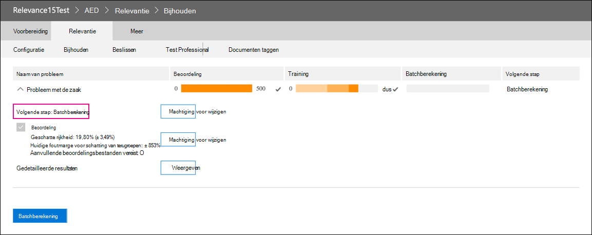

# De uittreding van de module Relevantie in Advanced eDiscoveryRetirement of the Relevance module in Advanced eDiscovery

Op 10 maart 2021 trekken we de module Relevantie in Advanced eDiscovery.On March 10, 2021, we are retiring the Relevance module in Advanced eDiscovery. Deze uittreding betekent dat organisaties geen toegang meer hebben tot de module Relevantie (door te gaan naar Revisieset Relevantie beheren in een Advanced eDiscovery geval) of toegang hebben tot bestaande  >   relevantiemodellen.This retirement means that organizations will no longer have access to the Relevance module (by going to **Manage review set** > **Relevance** in an Advanced eDiscovery case) or be able to access any existing Relevance models. De huidige relevantiemodule die wordt uitgetrokken, wordt vervangen door een nieuwe oplossing voor voorspellende codering in Q2 CY 2021.The current Relevance module that is being retired will be replaced with a new predictive coding solution in Q2 CY 2021. Met deze nieuwe functionaliteit kunnen organisaties hun eigen voorspellende coderingsmodellen bouwen in een eenvoudigere en intuïtievere werkstroom.This new functionality will let organizations build their own predictive coding models in an easier and more intuitive workflow.

Ter voorbereiding op deze aanstaande uittreding raden we organisaties aan die de uitvoer van hun model vóór de pensioendatum gebruiken, te exporteren door een batchberekening uit te voeren voor alle bestaande modellen.To prepare for this upcoming retirement, we recommend that organizations who use the Relevance module export their model’s output before the retirement date by running a Batch calculation for all existing models. Alle relevantiescores van uw model worden permanent opgeslagen in de bijbehorende revisieset en toegankelijk wanneer documenten worden geëxporteerd.All Relevance scores from your model will be permanently stored in the corresponding review set and accessible when documents are exported. Relevantiescores blijven ook behouden als metagegevens in het laadbestand.Relevance scores are also retained as metadata in the load file. U kunt ook nog steeds inhoud filteren in de revisieset op basis van relevantiescore en toegang hebben tot alle metagegevens die worden geproduceerd door uw relevantiemodellen.Also, you will still be able to filter content in the review set based on relevance score and have access to all metadata produced by your Relevance models.

## Voltooide onvoltooide modellenComplete unfinished models

Voor onvoltooide relevantiemodellen kunt u de beoordeling, training en batchberekening voltooien, zodat u het model kunt toepassen op de documenten in een revisieset.For any unfinished Relevance models, please complete assessment, training, and Batch calculation so that you can apply the model to the documents in a review set. Als u de batchberekening voltooit, blijven de gegevens behouden na de pensioendatum van de module Relevantie.Completing the Batch calculation will preserve the information after the retirement date of the Relevance module.

Hier volgen de stappen voor het voltooien van onvoltooide modellen:Here are the steps to complete any unfinished models:

1. Train uw model totdat het is gestabiliseerd en klaar is voor batchberekening.Train your model until it is stabilized and ready for Batch calculation. Zie [Training voor labelen en relevantie.](tagging-and-relevance-training-in-advanced-ediscovery.md)See [Tagging and Relevance training](tagging-and-relevance-training-in-advanced-ediscovery.md).

   In de volgende schermafbeelding ziet u een module die klaar is voor een batchberekening.The following screenshot shows a module that is ready for a Batch calculation. De evaluatie en training zijn voltooid en de volgende stap is het uitvoeren van batchberekening.Notice that the Assessment and Training is complete, and the next step is to run Batch calculation.

   

2. Voer de batchberekening uit.Run the Batch calculation. Zie [Batchberekening uitvoeren.](track-relevance-analysis-in-advanced-ediscovery.md#performing-batch-calculation)See [Performing Batch calculation](track-relevance-analysis-in-advanced-ediscovery.md#performing-batch-calculation).

3. Controleer of batchberekening is gelukt.Verify that Batch calculation was successful. Zie [Batchberekeningsresultaten](track-relevance-analysis-in-advanced-ediscovery.md#batch-calculation-results).See [Batch calculation results](track-relevance-analysis-in-advanced-ediscovery.md#batch-calculation-results).

Neem contact op met Microsoft Support voor hulp bij het voltooien van onvoltooide relevantiemodellen.For help with completing unfinished Relevance models, contact Microsoft Support.
