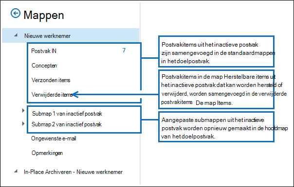
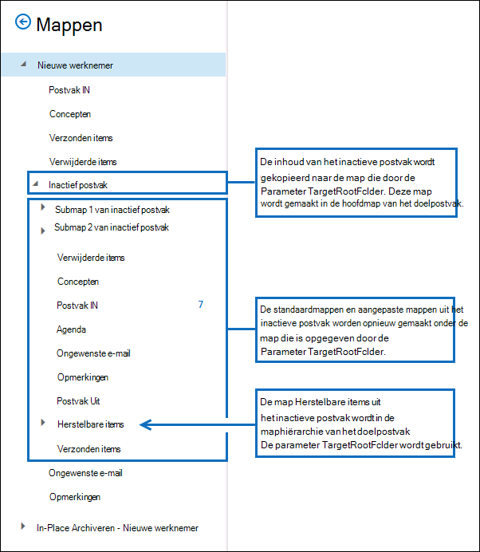

# <a name="restore-an-inactive-mailbox"></a><span data-ttu-id="33f4a-103">Een inactief postvak terugzetten</span><span class="sxs-lookup"><span data-stu-id="33f4a-103">Restore an inactive mailbox</span></span>

<span data-ttu-id="33f4a-104">Een inactief postvak (een type postvak dat wordt verwijderd) wordt gebruikt om de e-mail van een voormalige werknemer te behouden nadat hij of zij uw organisatie heeft verlaat.</span><span class="sxs-lookup"><span data-stu-id="33f4a-104">An inactive mailbox (which is a type of soft-deleted mailbox) is used to retain a former employee's email after he or she leaves your organization.</span></span> <span data-ttu-id="33f4a-105">Als een andere werknemer de taakverantwoordelijkheden van de overleden werknemer op zich neemt of als die werknemer terugkeert naar uw organisatie, zijn er twee manieren waarop u de inhoud van het inactieve postvak beschikbaar kunt maken voor een gebruiker:</span><span class="sxs-lookup"><span data-stu-id="33f4a-105">If another employee takes on the job responsibilities of the departed employee or if that employee returns to your organization, there are two ways that you can make the contents of the inactive mailbox available to a user:</span></span>

- <span data-ttu-id="33f4a-106">**Een inactief postvak herstellen** Als een andere werknemer de taakverantwoordelijkheden van de overleden werknemer op zich neemt of als een andere gebruiker toegang nodig heeft tot de inhoud van het inactieve postvak, kunt u de inhoud van het inactieve postvak herstellen (of samenvoegen) naar een bestaand postvak.</span><span class="sxs-lookup"><span data-stu-id="33f4a-106">**Restore an inactive mailbox** If another employee takes on the job responsibilities of the departed employee, or if another user needs access to the contents of the inactive mailbox, you can restore (or merge) the contents of the inactive mailbox to an existing mailbox.</span></span> <span data-ttu-id="33f4a-107">U kunt het archief ook herstellen vanuit een inactief postvak.</span><span class="sxs-lookup"><span data-stu-id="33f4a-107">You can also restore the archive from an inactive mailbox.</span></span> <span data-ttu-id="33f4a-108">Nadat het is hersteld, blijft het inactieve postvak behouden en blijft het behouden als een inactief postvak.</span><span class="sxs-lookup"><span data-stu-id="33f4a-108">After it's restored, the inactive mailbox is preserved and is retained as an inactive mailbox.</span></span> <span data-ttu-id="33f4a-109">In dit onderwerp worden de procedures beschreven voor het herstellen van een inactief postvak.</span><span class="sxs-lookup"><span data-stu-id="33f4a-109">This topic describes the procedures for restoring an inactive mailbox.</span></span>

- <span data-ttu-id="33f4a-110">**Een inactief postvak herstellen** Als de overleden werknemer terugkeert naar uw organisatie of als een nieuwe werknemer wordt aangenomen om de taaktaken van de overleden werknemer op zich te nemen, kunt u de inhoud van het inactieve postvak herstellen.</span><span class="sxs-lookup"><span data-stu-id="33f4a-110">**Recover an inactive mailbox** If the departed employee returns to your organization, or if a new employee is hired to take on the job responsibilities of the departed employee, you can recover the contents of the inactive mailbox.</span></span> <span data-ttu-id="33f4a-111">Met deze methode wordt het inactieve postvak ge converteerd naar een nieuw postvak dat de inhoud van het inactieve postvak bevat.</span><span class="sxs-lookup"><span data-stu-id="33f4a-111">This method converts the inactive mailbox to a new mailbox that contains the contents of the inactive mailbox.</span></span> <span data-ttu-id="33f4a-112">Nadat het is hersteld, bestaat het inactieve postvak niet meer.</span><span class="sxs-lookup"><span data-stu-id="33f4a-112">After it's recovered, the inactive mailbox no longer exists.</span></span> <span data-ttu-id="33f4a-113">Zie Een inactief postvak herstellen in Office 365 voor [de stapsgewijse procedures.](recover-an-inactive-mailbox.md)</span><span class="sxs-lookup"><span data-stu-id="33f4a-113">For the step-by-step procedures, see [Recover an inactive mailbox in Office 365](recover-an-inactive-mailbox.md).</span></span>

<span data-ttu-id="33f4a-114">Zie de [sectie Meer informatie](#more-information) in dit artikel voor meer informatie over de verschillen tussen het herstellen en herstellen van een inactief postvak.</span><span class="sxs-lookup"><span data-stu-id="33f4a-114">See the [More information](#more-information) section in this article for more details about the differences between restoring and recovering an inactive mailbox.</span></span>

> [!NOTE]
> <span data-ttu-id="33f4a-115">U kunt een inactief postvak dat is geconfigureerd met een automatisch uitbreidend archief, niet herstellen of herstellen.</span><span class="sxs-lookup"><span data-stu-id="33f4a-115">You can't recover or restore an inactive mailbox that's configured with an auto-expanding archive.</span></span> <span data-ttu-id="33f4a-116">Als u gegevens wilt herstellen uit een inactief postvak met een automatisch uitbreidend archief, gebruikt u inhoud zoeken om de gegevens uit het postvak te exporteren en vervolgens te importeren in een ander postvak.</span><span class="sxs-lookup"><span data-stu-id="33f4a-116">If you need to recover data from an inactive mailbox with an auto-expanding archive, use content search to export the data from the mailbox and then import to another mailbox.</span></span> <span data-ttu-id="33f4a-117">Zie de volgende onderwerpen voor instructies:</span><span class="sxs-lookup"><span data-stu-id="33f4a-117">For instructions, see following topics:</span></span>
>
> - [<span data-ttu-id="33f4a-118">Inhoud zoeken</span><span class="sxs-lookup"><span data-stu-id="33f4a-118">Content search</span></span>](content-search.md)
> - [<span data-ttu-id="33f4a-119">Zoekresultaten voor inhoud exporteren</span><span class="sxs-lookup"><span data-stu-id="33f4a-119">Export content search results</span></span>](export-search-results.md)

## <a name="requirements-to-restore-an-inactive-mailbox"></a><span data-ttu-id="33f4a-120">Vereisten voor het herstellen van een inactief postvak</span><span class="sxs-lookup"><span data-stu-id="33f4a-120">Requirements to restore an inactive mailbox</span></span>

- <span data-ttu-id="33f4a-121">U moet powershell Exchange Online gebruiken om een inactief postvak te herstellen.</span><span class="sxs-lookup"><span data-stu-id="33f4a-121">You have to use Exchange Online PowerShell to restore an inactive mailbox.</span></span> <span data-ttu-id="33f4a-122">U kunt het beheercentrum Exchange (EAC) niet gebruiken.</span><span class="sxs-lookup"><span data-stu-id="33f4a-122">You can't use the Exchange admin center (EAC).</span></span> <span data-ttu-id="33f4a-123">Zie voor stapsgewijs instructies de [Verbinding maken powershell Exchange Online gebruiken.](/powershell/exchange/connect-to-exchange-online-powershell)</span><span class="sxs-lookup"><span data-stu-id="33f4a-123">For step-by-step instructions, see [Connect to Exchange Online PowerShell](/powershell/exchange/connect-to-exchange-online-powershell).</span></span>

- <span data-ttu-id="33f4a-124">Voer de volgende opdracht uit in Exchange Online PowerShell om identiteitsgegevens op te halen voor de inactieve postvakken in uw organisatie.</span><span class="sxs-lookup"><span data-stu-id="33f4a-124">Run the following command in Exchange Online PowerShell to get identity information for the inactive mailboxes in your organization.</span></span>

  ```powershell
  Get-Mailbox -InactiveMailboxOnly | Format-List Name,DistinguishedName,ExchangeGuid,PrimarySmtpAddress
  ```

  <span data-ttu-id="33f4a-125">Gebruik de gegevens die door deze opdracht worden geretourneerd om een specifiek inactief postvak te herstellen.</span><span class="sxs-lookup"><span data-stu-id="33f4a-125">Use the information returned by this command to restore a specific inactive mailbox.</span></span>

- <span data-ttu-id="33f4a-126">Zie Inactieve postvakken in Office 365 voor meer informatie over inactieve [postvakken.](inactive-mailboxes-in-office-365.md)</span><span class="sxs-lookup"><span data-stu-id="33f4a-126">For more information about inactive mailboxes, see [Inactive mailboxes in Office 365](inactive-mailboxes-in-office-365.md).</span></span>

## <a name="restore-inactive-mailboxes"></a><span data-ttu-id="33f4a-127">Inactieve postvakken herstellen</span><span class="sxs-lookup"><span data-stu-id="33f4a-127">Restore inactive mailboxes</span></span>

<span data-ttu-id="33f4a-128">Gebruik de **cmdlet New-MailboxRestoreRequest** met de parameters  _SourceMailbox_ en  _TargetMailbox_ om de inhoud van een inactief postvak terug te zetten in een bestaand postvak.</span><span class="sxs-lookup"><span data-stu-id="33f4a-128">Use the **New-MailboxRestoreRequest** cmdlet with the  _SourceMailbox_ and  _TargetMailbox_ parameters to restore the contents of an inactive mailbox to an existing mailbox.</span></span> <span data-ttu-id="33f4a-129">Zie [New-MailboxRestoreRequest](/powershell/module/exchange/new-mailboxrestorerequest)voor meer informatie over het gebruik van deze cmdlet.</span><span class="sxs-lookup"><span data-stu-id="33f4a-129">For more information about using this cmdlet, see [New-MailboxRestoreRequest](/powershell/module/exchange/new-mailboxrestorerequest).</span></span>

1. <span data-ttu-id="33f4a-130">Maak een variabele die de eigenschappen van het inactieve postvak bevat.</span><span class="sxs-lookup"><span data-stu-id="33f4a-130">Create a variable that contains the properties of the inactive mailbox.</span></span>

   ```powershell
   $InactiveMailbox = Get-Mailbox -InactiveMailboxOnly -Identity <identity of inactive mailbox>
   ```

   > [!IMPORTANT]
   > <span data-ttu-id="33f4a-131">Gebruik in de vorige opdracht de waarde van de eigenschap **DistinguishedName** of **ExchangeGUID** om het inactieve postvak te identificeren.</span><span class="sxs-lookup"><span data-stu-id="33f4a-131">In the previous command, use the value of the **DistinguishedName** or **ExchangeGUID** property to identify the inactive mailbox.</span></span> <span data-ttu-id="33f4a-132">Deze eigenschappen zijn uniek voor elk postvak in uw organisatie, terwijl het mogelijk is dat een actief en inactief postvak hetzelfde primaire SMTP-adres heeft.</span><span class="sxs-lookup"><span data-stu-id="33f4a-132">These properties are unique for each mailbox in your organization, whereas it's possible that an active and an inactive mailbox might have the same primary SMTP address.</span></span>

2. <span data-ttu-id="33f4a-133">Herstel de inhoud van het inactieve postvak in een bestaand postvak.</span><span class="sxs-lookup"><span data-stu-id="33f4a-133">Restore the contents of the inactive mailbox to an existing mailbox.</span></span> <span data-ttu-id="33f4a-134">De inhoud van het inactieve postvak (bronpostvak) wordt samengevoegd in de bijbehorende mappen in het bestaande postvak (doelpostvak).</span><span class="sxs-lookup"><span data-stu-id="33f4a-134">The contents of the inactive mailbox (source mailbox) will be merged into the corresponding folders in the existing mailbox (target mailbox).</span></span>

   ```powershell
   New-MailboxRestoreRequest -SourceMailbox $InactiveMailbox.DistinguishedName -TargetMailbox newemployee@contoso.com -AllowLegacyDNMismatch
   ```

   <span data-ttu-id="33f4a-135">U kunt ook een map op het hoogste niveau opgeven in het doelpostvak waarin u de inhoud van het inactieve postvak wilt herstellen.</span><span class="sxs-lookup"><span data-stu-id="33f4a-135">Alternatively, you can specify a top-level folder in the target mailbox in which to restore the contents from the inactive mailbox.</span></span> <span data-ttu-id="33f4a-136">Als de opgegeven doelmap of doelmapstructuur nog niet bestaat in het doelpostvak, wordt deze gemaakt tijdens het herstelproces.</span><span class="sxs-lookup"><span data-stu-id="33f4a-136">If the specified target folder or target folder structure doesn't already exist in the target mailbox, it is created during the restore process.</span></span>

   <span data-ttu-id="33f4a-137">In dit voorbeeld worden postvakitems en submappen gekopieerd van een inactief postvak naar een map met de naam 'Inactief postvak' in de mapstructuur op het hoogste niveau van het doelpostvak.</span><span class="sxs-lookup"><span data-stu-id="33f4a-137">This example copies mailbox items and subfolders from an inactive mailbox to a folder named "Inactive Mailbox" in the top-level folder structure of the target mailbox.</span></span>

   ```powershell
   New-MailboxRestoreRequest -SourceMailbox $InactiveMailbox.DistinguishedName -TargetMailbox newemployee@contoso.com -TargetRootFolder "Inactive Mailbox" -AllowLegacyDNMismatch
   ```

## <a name="restore-the-archive-from-an-inactive-mailbox"></a><span data-ttu-id="33f4a-138">Het archief herstellen vanuit een inactief postvak</span><span class="sxs-lookup"><span data-stu-id="33f4a-138">Restore the archive from an inactive mailbox</span></span>

<span data-ttu-id="33f4a-139">Als een inactief postvak een archiefpostvak heeft, kunt u het ook terugzetten naar het archiefpostvak van een bestaand postvak.</span><span class="sxs-lookup"><span data-stu-id="33f4a-139">If an inactive mailbox has an archive mailbox, you can also restore it to the archive mailbox of an existing mailbox.</span></span> <span data-ttu-id="33f4a-140">Als u het archief wilt herstellen vanuit een inactief postvak, moet u de switches _SourceIsArchive_ en _TargetIsArchive_ toevoegen aan de opdracht die wordt gebruikt om een inactief postvak te herstellen.</span><span class="sxs-lookup"><span data-stu-id="33f4a-140">To restore the archive from an inactive mailbox, you have to add the _SourceIsArchive_ and _TargetIsArchive_ switches to the command used to restore an inactive mailbox.</span></span>

1. <span data-ttu-id="33f4a-141">Maak een variabele die de eigenschappen van het inactieve postvak bevat.</span><span class="sxs-lookup"><span data-stu-id="33f4a-141">Create a variable that contains the properties of the inactive mailbox.</span></span>

   ```powershell
   $InactiveMailbox = Get-Mailbox -InactiveMailboxOnly -Identity <identity of inactive mailbox>
   ```

   > [!NOTE]
   > <span data-ttu-id="33f4a-142">Gebruik in de vorige opdracht de waarde van de eigenschap **DistinguishedName** of **ExchangeGUID** om het inactieve postvak te identificeren.</span><span class="sxs-lookup"><span data-stu-id="33f4a-142">In the previous command, use the value of the **DistinguishedName** or **ExchangeGUID** property to identify the inactive mailbox.</span></span> <span data-ttu-id="33f4a-143">Deze eigenschappen zijn uniek voor elk postvak in uw organisatie, terwijl het mogelijk is dat een actief en inactief postvak hetzelfde primaire SMTP-adres heeft.</span><span class="sxs-lookup"><span data-stu-id="33f4a-143">These properties are unique for each mailbox in your organization, whereas it's possible that an active and an inactive mailbox might have the same primary SMTP address.</span></span>

2. <span data-ttu-id="33f4a-144">Herstel de inhoud van het archief vanuit het inactieve postvak (bronarchief) naar het archief van een bestaand postvak (doelarchief).</span><span class="sxs-lookup"><span data-stu-id="33f4a-144">Restore the contents of the archive from the inactive mailbox (source archive) to the archive of an existing mailbox (target archive).</span></span> <span data-ttu-id="33f4a-145">In dit voorbeeld wordt de inhoud uit het bronarchief gekopieerd naar een map met de naam 'Inactief postvakarchief' in het archief van het doelpostvak.</span><span class="sxs-lookup"><span data-stu-id="33f4a-145">In this example, the contents from the source archive are copied to a folder named "Inactive Mailbox Archive" in the archive of the target mailbox.</span></span>

   ```powershell
   New-MailboxRestoreRequest -SourceMailbox $InactiveMailbox.DistinguishedName -SourceIsArchive -TargetMailbox newemployee@contoso.com -TargetIsArchive -TargetRootFolder "Inactive Mailbox Archive" -AllowLegacyDNMismatch
   ```

## <a name="more-information"></a><span data-ttu-id="33f4a-146">Meer informatie</span><span class="sxs-lookup"><span data-stu-id="33f4a-146">More information</span></span>

- <span data-ttu-id="33f4a-147">**Wat is het belangrijkste verschil tussen het herstellen en herstellen van een inactief postvak?**</span><span class="sxs-lookup"><span data-stu-id="33f4a-147">**What's the main difference between recovering and restoring an inactive mailbox?**</span></span> <span data-ttu-id="33f4a-148">Wanneer u een inactief postvak herstelt, wordt het postvak in feite geconverteerd naar een nieuw postvak, blijven de inhoud en mapstructuur van het inactieve postvak behouden en is het postvak gekoppeld aan een nieuw gebruikersaccount.</span><span class="sxs-lookup"><span data-stu-id="33f4a-148">When you recover an inactive mailbox, the mailbox is basically converted to a new mailbox, the contents and folder structure of the inactive mailbox are retained, and the mailbox is linked to a new user account.</span></span> <span data-ttu-id="33f4a-149">Nadat het is hersteld, bestaat het inactieve postvak niet meer en zijn wijzigingen in de inhoud in het nieuwe postvak van invloed op de inhoud die oorspronkelijk in de wacht stond in het inactieve postvak.</span><span class="sxs-lookup"><span data-stu-id="33f4a-149">After it's recovered, the inactive mailbox no longer exists, and any changes made to the content in the new mailbox will affect the content that was originally on hold in the inactive mailbox.</span></span> <span data-ttu-id="33f4a-150">Wanneer u een inactief postvak herstelt, wordt de inhoud echter alleen gekopieerd naar een ander postvak.</span><span class="sxs-lookup"><span data-stu-id="33f4a-150">Conversely, when you restore an inactive mailbox, the contents are merely copied to another mailbox.</span></span> <span data-ttu-id="33f4a-151">Het inactieve postvak blijft behouden en blijft een inactief postvak.</span><span class="sxs-lookup"><span data-stu-id="33f4a-151">The inactive mailbox is preserved and remains an inactive mailbox.</span></span> <span data-ttu-id="33f4a-152">Wijzigingen in de inhoud in het doelpostvak hebben geen invloed op de oorspronkelijke inhoud in het inactieve postvak.</span><span class="sxs-lookup"><span data-stu-id="33f4a-152">Any changes made to the content in the target mailbox won't affect the original content held in the inactive mailbox.</span></span> <span data-ttu-id="33f4a-153">Het inactieve postvak kan nog steeds worden doorzocht met behulp van het hulpprogramma Inhoud [zoeken,](content-search.md)de inhoud ervan kan worden hersteld naar een ander postvak of op een later tijdstip worden hersteld of verwijderd.</span><span class="sxs-lookup"><span data-stu-id="33f4a-153">The inactive mailbox can still be searched by using the [Content Search tool](content-search.md), its contents can be restored to another mailbox, or it can be recovered or deleted at a later date.</span></span>

- <span data-ttu-id="33f4a-154">**Hoe vindt u inactieve postvakken?**</span><span class="sxs-lookup"><span data-stu-id="33f4a-154">**How do you find inactive mailboxes?**</span></span> <span data-ttu-id="33f4a-155">Als u een lijst met de inactieve postvakken in uw organisatie wilt weergeven en informatie wilt weergeven die nuttig is voor het herstellen van een inactief postvak, kunt u deze opdracht uitvoeren.</span><span class="sxs-lookup"><span data-stu-id="33f4a-155">To get a list of the inactive mailboxes in your organization and display information that is useful for restoring an inactive mailbox, you can run this command.</span></span>

  ```powershell
  Get-Mailbox -InactiveMailboxOnly | Format-List Name,PrimarySMTPAddress,DistinguishedName,ExchangeGUID,LegacyExchangeDN,ArchiveStatus
  ```

- <span data-ttu-id="33f4a-156">**Gebruik een bewaarbeleid voor juridische Microsoft 365 om inactieve postvakinhoud te behouden.**</span><span class="sxs-lookup"><span data-stu-id="33f4a-156">**Use a Litigation Hold or Microsoft 365 retention policy to retain inactive mailbox content.**</span></span> <span data-ttu-id="33f4a-157">Als u de status van een inactief postvak wilt behouden nadat het [](create-a-litigation-hold.md) is hersteld, kunt u het doelpostvak in de bewaring van rechtszaken plaatsen of een Microsoft 365-bewaarbeleid toepassen voordat u het [inactieve](retention.md) postvak herstelt.</span><span class="sxs-lookup"><span data-stu-id="33f4a-157">If you want to retain the state of an inactive mailbox after it's restored, you can place the target mailbox on [Litigation Hold](create-a-litigation-hold.md) or apply an [Microsoft 365 retention policy](retention.md) before you restore the inactive mailbox.</span></span> <span data-ttu-id="33f4a-158">Hiermee voorkomt u dat items definitief worden verwijderd uit het inactieve postvak nadat ze zijn hersteld in het doelpostvak.</span><span class="sxs-lookup"><span data-stu-id="33f4a-158">This will prevent the permanent deletion of any items from the inactive mailbox after they're restored to the target mailbox.</span></span>

- <span data-ttu-id="33f4a-159">**Bewaar bewaring in het doelpostvak inschakelen voordat u een inactief postvak herstelt.**</span><span class="sxs-lookup"><span data-stu-id="33f4a-159">**Enable retention hold on the target mailbox before you restore an inactive mailbox.**</span></span> <span data-ttu-id="33f4a-160">Omdat postvakitems uit een inactief postvak oud kunnen zijn, kunt u overwegen bewaring in te stellen voor het doelpostvak voordat u een inactief postvak herstelt.</span><span class="sxs-lookup"><span data-stu-id="33f4a-160">Because mailbox items from an inactive mailbox could be old, you might consider enabling retention hold on the target mailbox before you restore an inactive mailbox.</span></span> <span data-ttu-id="33f4a-161">Wanneer u een postvak in bewaring houdt, wordt het bewaarbeleid dat aan het postvak is toegewezen, pas verwerkt nadat de bewaarperiode is verwijderd of totdat de bewaarperiode is verlopen.</span><span class="sxs-lookup"><span data-stu-id="33f4a-161">When you put a mailbox on retention hold, the retention policy that's assigned to it won't be processed until the retention hold is removed or until the retention hold period expires.</span></span> <span data-ttu-id="33f4a-162">Hierdoor heeft de eigenaar van het doelpostvak de tijd om oude berichten uit het inactieve postvak te beheren.</span><span class="sxs-lookup"><span data-stu-id="33f4a-162">This gives the owner of the target mailbox time to manage old messages from the inactive mailbox.</span></span> <span data-ttu-id="33f4a-163">Anders kan het bewaarbeleid oude items verwijderen (of items verplaatsen naar het archiefpostvak, als dit is ingeschakeld) die zijn verlopen op basis van de bewaarinstellingen die zijn geconfigureerd voor het doelpostvak.</span><span class="sxs-lookup"><span data-stu-id="33f4a-163">Otherwise, the retention policy might delete old items (or move items to the archive mailbox, if it's enabled) that have expired based on the retention settings configured for the target mailbox.</span></span> <span data-ttu-id="33f4a-164">Zie Een postvak in bewaring in bewaring [plaatsen in](/exchange/security-and-compliance/messaging-records-management/mailbox-retention-hold)Exchange Online.</span><span class="sxs-lookup"><span data-stu-id="33f4a-164">For more information, see [Place a mailbox on retention hold in Exchange Online](/exchange/security-and-compliance/messaging-records-management/mailbox-retention-hold).</span></span>

- <span data-ttu-id="33f4a-165">**Wat doet de switch AllowLegacyDNMismatch?**</span><span class="sxs-lookup"><span data-stu-id="33f4a-165">**What does the AllowLegacyDNMismatch switch do?**</span></span> <span data-ttu-id="33f4a-166">In de vorige voorbeelden om een inactief postvak te herstellen, wordt de **schakelknop AllowLegacyDNMismatch** gebruikt om het inactieve postvak te herstellen naar een ander doelpostvak.</span><span class="sxs-lookup"><span data-stu-id="33f4a-166">In the previous examples to restore an inactive mailbox, the **AllowLegacyDNMismatch** switch is used to allow restoring the inactive mailbox to a different target mailbox.</span></span> <span data-ttu-id="33f4a-167">In een normaal herstelscenario is het doel om inhoud te herstellen waarbij de bron- en doelpostvakken hetzelfde postvak zijn.</span><span class="sxs-lookup"><span data-stu-id="33f4a-167">In a typical restore scenario, the goal is to restore content where the source and target mailboxes are the same mailbox.</span></span> <span data-ttu-id="33f4a-168">De cmdlet **New-MailboxRestoreRequest** controleert dus standaard of de waarde van de eigenschap **LegacyExchangeDN** op de bron- en doelpostvakken hetzelfde is.</span><span class="sxs-lookup"><span data-stu-id="33f4a-168">So by default, the **New-MailboxRestoreRequest** cmdlet checks to make sure that the value of the **LegacyExchangeDN** property on the source and target mailboxes is the same.</span></span> <span data-ttu-id="33f4a-169">Hiermee voorkomt u dat u per ongeluk een bronpostvak in het verkeerde doelpostvak herstelt.</span><span class="sxs-lookup"><span data-stu-id="33f4a-169">This helps prevents you from accidentally restoring a source mailbox into the wrong target mailbox.</span></span> <span data-ttu-id="33f4a-170">Als u een inactief postvak probeert te herstellen zonder de **switch AllowLegacyDNMismatch** te gebruiken, kan de opdracht mislukken als de bron- en doelpostvakken verschillende waarden hebben voor de **eigenschap LegacyExchangeDN.**</span><span class="sxs-lookup"><span data-stu-id="33f4a-170">If you try to restore an inactive mailbox without using the **AllowLegacyDNMismatch** switch, the command might fail if the source and target mailboxes have different values for the **LegacyExchangeDN** property.</span></span>

- <span data-ttu-id="33f4a-171">**U kunt andere parameters gebruiken met de New-MailboxRestoreRequest cmdlet om verschillende herstelscenario's voor inactieve postvakken te implementeren.**</span><span class="sxs-lookup"><span data-stu-id="33f4a-171">**You can use other parameters with the New-MailboxRestoreRequest cmdlet to implement different restore scenarios for inactive mailboxes.**</span></span> <span data-ttu-id="33f4a-172">U kunt deze opdracht bijvoorbeeld uitvoeren om het archief vanuit het inactieve postvak terug te zetten in het primaire postvak van het doelpostvak.</span><span class="sxs-lookup"><span data-stu-id="33f4a-172">For example, you can run this command to restore the archive from the inactive mailbox into the primary mailbox of the target mailbox.</span></span>

  ```powershell
  New-MailboxRestoreRequest -SourceMailbox <inactive mailbox> -SourceIsArchive -TargetMailbox <target mailbox> -TargetRootFolder "Inactive Mailbox Archive" -AllowLegacyDNMismatch
  ```

  <span data-ttu-id="33f4a-173">U kunt het inactieve primaire postvak ook herstellen in het archief van het doelpostvak door deze opdracht uit te voeren.</span><span class="sxs-lookup"><span data-stu-id="33f4a-173">You can also restore the inactive primary mailbox into the archive of the target mailbox by running this command.</span></span>

  ```powershell
  New-MailboxRestoreRequest -SourceMailbox <inactive mailbox> -TargetMailbox <target mailbox> -TargetIsArchive -TargetRootFolder "Inactive Mailbox" -AllowLegacyDNMismatch
  ```

- <span data-ttu-id="33f4a-174">**Wat doet de parameter TargetRootFolder?**</span><span class="sxs-lookup"><span data-stu-id="33f4a-174">**What does the TargetRootFolder parameter do?**</span></span> <span data-ttu-id="33f4a-175">Zoals eerder uitgelegd, kunt u de parameter **TargetRootFolder** gebruiken om een map op te geven boven aan de mapstructuur (ook wel de hoofdmap genoemd) in het doelpostvak waarin u de inhoud van het inactieve postvak wilt herstellen.</span><span class="sxs-lookup"><span data-stu-id="33f4a-175">As previously explained, you can use the **TargetRootFolder** parameter to specify a folder in the top of the folder structure (also called the root) in the target mailbox in which to restore the contents of the inactive mailbox.</span></span> <span data-ttu-id="33f4a-176">Als u deze parameter niet gebruikt, worden postvakitems uit het inactieve postvak samengevoegd in de bijbehorende standaardmappen van het doelpostvak en worden aangepaste mappen opnieuw gemaakt in de hoofdmap van het doelpostvak.</span><span class="sxs-lookup"><span data-stu-id="33f4a-176">If you don't use this parameter, mailbox items from the inactive mailbox are merged into the corresponding default folders of the target mailbox, and custom folders are re-created in the root of the target mailbox.</span></span> <span data-ttu-id="33f4a-177">In de volgende illustraties worden deze verschillen belicht tussen het niet gebruiken en gebruiken van de parameter **TargetRootFolder.**</span><span class="sxs-lookup"><span data-stu-id="33f4a-177">The following illustrations highlight these differences between not using and using the **TargetRootFolder** parameter.</span></span>

  <span data-ttu-id="33f4a-178">**Maphiërarchie in het doelpostvak wanneer de parameter TargetRootFolder niet wordt gebruikt**</span><span class="sxs-lookup"><span data-stu-id="33f4a-178">**Folder hierarchy in the target mailbox when the TargetRootFolder parameter isn't used**</span></span>

  

  <span data-ttu-id="33f4a-180">**Maphiërarchie in het doelpostvak wanneer de parameter TargetRootFolder wordt gebruikt**</span><span class="sxs-lookup"><span data-stu-id="33f4a-180">**Folder hierarchy in the target mailbox when the TargetRootFolder parameter is used**</span></span>

  