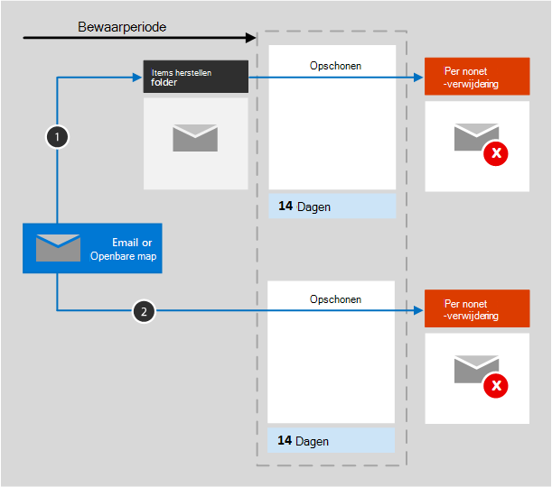

# Meer informatie over retentie voor ExchangeLearn about retention for Exchange

De informatie in dit artikel is een aanvulling op [Meer informatie over retentie](retention.md), omdat deze informatie specifiek is voor Exchange.The information in this article supplements [Learn about retention](retention.md) because it has information that's specific to Exchange.  Zie voor andere workloads:For other workloads, see:

- [Meer informatie over retentie voor SharePoint en OneDriveLearn about retention for SharePoint and OneDrive](retention-policies-sharepoint.md)
- [Meer informatie over retentie voor Microsoft TeamsLearn about retention for Microsoft Teams](retention-policies-teams.md)
- [Meer informatie over retentie voor YammerLearn about retention for Yammer](retention-policies-yammer.md)

## Wat is inbegrepen voor retentie en verwijdering?What's included for retention and deletion

De volgende Exchange-items kunnen worden behouden of verwijderd door het gebruiken van bewaarbeleid en retentielabels: e-mailberichten (inclusief concepten) met eventuele bijlagen, notities en taken als ze een einddatum hebben.The following Exchange items can be retained and deleted by using retention policies and retention labels: Mail messages (includes drafts) with any attachments, tasks when they have an end date, and notes. 

Agenda-items die een einddatum hebben, worden ondersteund voor bewaarbeleidsregels, maar niet voor retentielabels.Calendar items that have an end date are supported for retention policies but aren't supported for retention labels.

Contacten, en taken en agenda-items die geen einddatum hebben worden niet ondersteund.Contacts, and any tasks and calendar items that don't have an end date are not supported.

Andere items die zijn opgeslagen in een mailbox, zoals Skype- en Teams-berichten, vallen niet binnen het bewaarbeleid of -labels voor Exchange.Other items stored in a mailbox, such as Skype and Teams messages, aren't included in retention policies or labels for Exchange. Voor deze items gelden aparte bewaarbeleidsregels.These items have their own retention policies.

## Hoe retentie werkt voor ExchangeHow retention works for Exchange

Zowel postvakken als openbare mappen gebruiken de [map Herstelbare items](/exchange/security-and-compliance/recoverable-items-folder/recoverable-items-folder) voor het behouden van items.Both a mailbox and a public folder use the [Recoverable Items folder](/exchange/security-and-compliance/recoverable-items-folder/recoverable-items-folder) to retain items. Alleen mensen met eDiscovery-machtigingen kunnen items in de map Herstelbare items van een andere gebruiker bekijken.Only people who have been assigned eDiscovery permissions can view items in another user's Recoverable Items folder.
  
Als iemand een bericht verwijdert in een andere map dan de map Verwijderde items, wordt het bericht standaard verplaatst naar de map Verwijderde items.When a person deletes a message in a folder other than the Deleted Items folder, by default, the message moves to the Deleted Items folder. Als iemand een bericht verwijdert in de map Verwijderde items, wordt het bericht standaard verplaatst naar de map Herstelbare items.When a person deletes an item in the Deleted Items folder, the message is moved to the Recoverable Items folder. Een gebruiker kan in iedere map echter een item voorlopig verwijderen (Shift+Delete) waardoor de map Verwijderde items wordt overgeslagen en het item direct naar de map Herstelbare items wordt verplaatst.However, a user can soft delete an item (Shift+Delete) in any folder, which bypasses the Deleted Items folder and moves the item directly to the Recoverable Items folder.
  
Als u bewaarinstellingen toepast op Exchange-gegevens, worden de items in de map Herstelbare items regelmatig door een timeropdracht geanalyseerd.When you apply retention settings to Exchange data, a timer job periodically evaluates items in the Recoverable Items folder. Als een item niet overeenkomt met de regels van ten minste één bewaarbeleidsregel of retentielabel, wordt het item permanent verwijderd (definitief verwijderd) uit de map Herstelbare items.If an item doesn't match the rules of at least one retention policy or retention label, the item is permanently deleted (also called hard deleted) from the Recoverable Items folder.

Het uitvoeren van een timeropdracht kan tot zeven dagen duren en de Exchange-locatie moet ten minste 10 MB bevatten.The timer job can take up to seven days to run and the Exchange location must contain at least 10 MB.
  
Als een gebruiker probeert de eigenschappen van een postvakitem – zoals het onderwerp, de hoofdtekst, de bijlagen, de afzenders, de geadresseerden, de verzenddatum of de ontvangstdatum te wijzigen, wordt er een kopie van het origineel opgeslagen in de map Herstelbare items voordat de wijziging wordt vastgelegd.When a user attempts to change properties of a mailbox item—such as the subject, body, attachments, senders and recipients, or date sent or received for a message—a copy of the original item is saved to the Recoverable Items folder before the change is committed. Deze actie wordt uitgevoerd bij elke volgende wijziging.This action happens for each subsequent change. Aan het einde van de retentieperiode worden kopieën in de map Herstelbare items permanent verwijderd.At the end of the retention period, copies in the Recoverable Items folder are permanently deleted.

Nadat bewaarinstellingen zijn toegepast op Exchange-inhoud, is de route die de inhoud aflegt afhankelijk van de bewaarinstellingen: bewaren en verwijderen, alleen bewaren of alleen verwijderen.After retention settings are applied to Exchange content, the paths the content takes depend on whether the retention settings are to retain and delete, to retain only, or delete only.

Als de geselecteerde bewaarinstelling bewaren en verwijderen is:When the retention settings are to retain and delete:

1. **Als het item is gewijzigd of permanent is verwijderd** door de gebruiker (met SHIFT+DELETE of verwijderd uit de map Verwijderde items) tijdens de retentieperiode: het item wordt verplaatst (of na wijzigen gekopieerd) naar de map Herstelbare items.**If the item is modified or permanently deleted** by the user (either SHIFT+DELETE or deleted from Deleted Items) during the retention period: The item is moved (or copied, in the case of edit) to the Recoverable Items folder. Daar analyseert en identificeert een timeropdracht regelmatig de items waarvan de retentieperiode is verstreken. Deze items worden permanent verwijderd binnen 14 dagen na het einde van de retentieperiode.There, a timer job runs periodically and identifies items whose retention period has expired, and these items are permanently deleted within 14 days of the end of the retention period. Houd er rekening mee dat de instelling standaard 14 dagen is, maar dat deze kan worden verlengd tot 30 dagen.Note that 14 days is the default setting, but it can be configured up to 30 days.

2. **Als het item niet is gewijzigd of verwijderd** tijdens de retentieperiode: Hetzelfde proces wordt regelmatig toegepast op alle mappen in het postvak waarbij items worden geïndentificeerd waarvan de retentieperiode is verlopen. Deze items worden permanent verwijderd binnen 14 dagen na het einde van de retentieperiode.**If the item is not modified or deleted** during the retention period: The same process runs periodically on all folders in the mailbox and identifies items whose retention period has expired, and these items are permanently deleted within 14 days of the end of the retention period. Houd er rekening mee dat de instelling standaard 14 dagen is, maar dat deze kan worden verlengd tot 30 dagen.Note that 14 days is the default setting, but it can be configured up to 30 days. 

Als de bewaarinstellingen alleen bewaren of alleen verwijderen zijn, is de route die de inhoud aflegt een variatie van bewaren en verwijderen:When the retention settings are retain-only, or delete-only, the contents paths are variations of retain and delete:

### Inhoudsroutes voor retentie-instellingen voor alleen bewarenContent paths for retain-only retention settings

1. **Als het item is gewijzigd of verwijderd** tijdens de retentieperiode: Er wordt een kopie van het originele item gemaakt in de map Herstelbare items die wordt bewaard tot het einde van de retentieperiode. Daarna wordt het item in de map Herstelbare items binnen 14 dagen na het verlopen ervan definitief verwijderd.**If the item is modified or deleted** during the retention period: A copy of the original item is created in the Recoverable Items folder and retained until the end of the retention period, when the copy in the Recoverable Items folder is permanently deleted within 14 days after the item expires. 

2. **Als het item niet wordt gewijzigd of verwijderd** tijdens de bewaarperiode: Er gebeurt voor en na de bewaarperiode niets. Het document blijft op de oorspronkelijke locatie staan.**If the item is not modified or deleted** during the retention period: Nothing happens before and after the retention period; the item remains in its original location.

### Inhoudsroutes voor retentie-instellingen voor alleen verwijderenContent paths for delete-only retention settings

1. **Als het item niet is verwijderd** tijdens de geconfigureerde periode: aan het einde van de in het bewaarbeleid geconfigureerde periode wordt het item verplaatst naar de map Herstelbare items.**If the item is not deleted** during the configured period: At the end of the configured period in the retention policy, the item is moved to the Recoverable Items folder. 

2. **Als het item is verwijderd** tijdens de geconfigureerde periode: het item wordt onmiddellijk verplaatst naar de map Herstelbare items.**If the item is deleted** during the configured period: The item is immediately moved to the Recoverable Items folder. Als een gebruiker het item daar verwijdert of de map Herstelbare items leegmaakt, is het item definitief verwijderd.If a user deletes the item from there or empties the Recoverable Items folder, the item is permanently deleted. In alle andere gevallen wordt het item definitief verwijderd nadat het 14 dagen is bewaard in de map Herstelbare items.Otherwise, the item is permanently deleted after being in the Recoverable Items folder for 14 days. 

## Wanneer een gebruiker de organisatie verlaatWhen a user leaves the organization 

Wanneer een gebruiker uw organisatie verlaat en het postvak van de gebruiker is opgenomen in een bewaarbeleid, wordt het postvak een inactief postvak wanneer het Microsoft 365-account van de gebruiker wordt verwijderd.If a user leaves your organization and the user's mailbox is included in a retention policy, the mailbox becomes an inactive mailbox when the user's Microsoft 365 account is deleted. Een bewaarbeleid dat van toepassing was op een postvak voordat het inactief werd, blijft van toepassing op het inactieve postvak en de inhoud blijft beschikbaar voor een eDiscovery-zoekopdracht.The contents of an inactive mailbox are still subject to any retention policy that was placed on the mailbox before it was made inactive, and the contents are available to an eDiscovery search. Zie voor meer informatie [Inactive postvakken in Exchange Online](inactive-mailboxes-in-office-365.md).For more information, see [Inactive mailboxes in Exchange Online](inactive-mailboxes-in-office-365.md).

## Configuratie-richtlijnenConfiguration guidance

Zie [Aan de slag met bewaarbeleid en retentielabels](get-started-with-retention.md) als het configureren van retentie in Microsoft 365 nieuw voor u is.If you're new to configuring retention in Microsoft 365, see [Get started with retention policies and retention labels](get-started-with-retention.md).

Zie de volgende instructies als u een bewaarbeleid of retentielabel wilt configureren voor Exchange:If you're ready to configure a retention policy or retention label for Exchange, see the following instructions:
- [Bewaarbeleid maken en configurerenCreate and configure retention policies](create-retention-policies.md)
- [Retentielabels maken en deze toepassen in appsCreate retention labels and apply them in apps](create-apply-retention-labels.md)
- [Een retentielabel automatisch toepassen op inhoudApply a retention label to content automatically](apply-retention-labels-automatically.md)