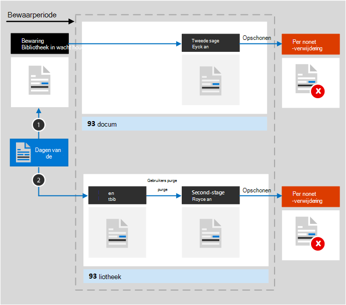

# Meer informatie over retentie voor SharePoint en OneDrive

>*[Richtlijnen voor Microsoft 365-licenties voor beveiliging en naleving](/office365/servicedescriptions/microsoft-365-service-descriptions/microsoft-365-tenantlevel-services-licensing-guidance/microsoft-365-security-compliance-licensing-guidance).*

De informatie in dit artikel vult [Meer informatie over retentie](retention.md) aan omdat deze informatie specifiek voor SharePoint en OneDrive is.

Zie voor andere werkbelastingen:

- [Meer informatie over retentie voor Microsoft Teams](retention-policies-teams.md)
- [Meer informatie over retentie voor Yammer](retention-policies-yammer.md)
- [Meer informatie over retentie voor Exchange](retention-policies-exchange.md)

## Wat is inbegrepen voor retentie en verwijdering

Alle bestanden die zijn opgeslagen in SharePoint- of OneDrive-sites, kunnen worden bewaard door een bewaarbeleid of retentielabel toe te passen. 

De volgende bestanden kunnen worden verwijderd:

- Wanneer u een bewaarbeleid gebruikt: alle bestanden in documentbibliotheken die automatisch gemaakte SharePoint-documentbibliotheken bevatten, zoals **siteactiva**.
    
- Wanneer u bewaarlabels gebruikt: alle bestanden in alle documentbibliotheken en alle bestanden op het hoofdniveau die niet in een map staan.
    
> [!TIP]
> Wanneer u een [query met een beleid voor automatisch toepassen voor een bewaarlabel](apply-retention-labels-automatically.md#auto-apply-labels-to-content-with-keywords-or-searchable-properties) gebruikt, kunt u specifieke documentbibliotheken uitsluiten met behulp van de volgende invoer: `NOT(DocumentLink:"<URL to document library>")`

Lijstitems worden niet ondersteund door bewaarbeleid, maar worden ondersteund door bewaarlabels, met uitzondering van items in systeemlijsten. Dit zijn verborgen lijsten die door SharePoint worden gebruikt voor het beheren van het systeem en bevatten de catalogus met basispagina's, de oplossingscatalogus en gegevensbronnen. Wanneer u een bewaarlabel op een ondersteund lijstitem met een documentbijlage toepast:
- Voor een standaardbewaarlabel (het item wordt niet als record gedeclareerd):
    - De bijlage bij het document neemt niet automatisch de bewaarinstellingen van het label over, maar kan onafhankelijk worden gelabeld.
- Voor een bewaarlabel dat het item als record declareert: 
    - De bijlage bij het document neemt automatisch de bewaarinstellingen over van het label als het document nog geen label heeft.

Instellingen voor bewaarbeleid en bewaarlabels zijn niet van toepassing op het ordenen van structuren die bibliotheken, lijsten en mappen bevatten.

Voor bewaarbeleid en beleid voor automatisch toepassen van labels: SharePoint-sites moeten worden geïndexeerd om de bewaarinstellingen te kunnen toepassen. Als items in SharePoint-documentbibliotheken echter zo zijn geconfigureerd dat ze niet in zoekresultaten worden weergegeven, worden bestanden met deze configuratie niet uitgesloten van de bewaarinstellingen.

## Hoe retentie werkt voor SharePoint en OneDrive

Als u inhoud wilt opslaan die moet worden bewaard, maken SharePoint en OneDrive een opslagbibliotheek als deze niet bestaat. U kunt deze bibliotheek bekijken op de pagina **Site-inhoud** op de site op het hoogste niveau van de siteverzameling. De meeste gebruikers kunnen de opslagbibliotheek niet weergeven, omdat deze alleen zichtbaar is voor beheerders van de siteverzameling.

Items in SharePoint met een standaardbewaarlabel (het item wordt niet als record gedeclareerd) hebben de opslagbibliotheek niet nodig omdat deze items op de oorspronkelijke locatie blijven staan. SharePoint voorkomt dat gebruikers items verwijderen wanneer het toegepaste bewaarlabel is geconfigureerd om de inhoud te behouden. Met versiebeheer van SharePoint blijven oudere versies behouden wanneer items worden bewerkt. In andere scenario's wordt de opslagbibliotheek echter gebruikt wanneer items moeten worden bewaard:
- Items in OneDrive met standaardlabels voor bewaren
- Items in SharePoint of OneDrive die bewaarlabels hebben die ze als een record declareren, en het item wordt ontgrendeld om te bewerken
- Items die zijn onderworpen aan bewaarbeleid

Als u deze inhoud wilt behouden wanneer een gebruiker probeert deze te wijzigen of te verwijderen, wordt er een controle uitgevoerd of de inhoud is gewijzigd sinds de instellingen voor bewaren zijn toegepast. Als dit de eerste wijziging is sinds de retentie-instellingen werden toegepast, wordt de inhoud naar de opslagbibliotheek gekopieerd. Vervolgens kan de persoon de oorspronkelijke inhoud wijzigen of verwijderen. Alle inhoud in een siteverzameling kan worden gekopieerd naar de opslagbibliotheek, onafhankelijk van de retentie-instellingen.
  
Vervolgens schoont een timeropdracht de opslagbibliotheek periodiek op. Voor inhoud die langer dan 30 dagen in de opslagbibliotheek staat, vergelijkt deze taak de inhoud met alle query's die worden gebruikt door de retentie-instellingen voor die inhoud. Inhoud die ouder is dan de geconfigureerde bewaarperiode, wordt vervolgens verwijderd uit de opslagbibliotheek en de oorspronkelijke locatie als deze nog steeds bestaat. Deze timertaak wordt elke zeven dagen uitgevoerd. Dit betekent dat inhoud samen met de minimale 30 dagen tot 37 dagen in de opslagbibliotheek kan staan voordat deze wordt verwijderd.

Terwijl bestanden in de opslagbibliotheek worden bewaard, kunnen beheerders de SharePoint-site of het OneDrive-account van de inhoud niet verwijderen.

Dit gedrag voor het kopiëren van bestanden naar de opslagbibliotheek geldt voor inhoud die aanwezig is wanneer de bewaarinstellingen worden toegepast. Voor bewaarbeleid wordt bovendien alle nieuwe inhoud die is gemaakt of toegevoegd aan de site nadat deze in het beleid is opgenomen, bewaard in de opslagbibliotheek. Nieuwe inhoud wordt echter niet gekopieerd naar de opslagbibliotheek wanneer deze voor het eerst wordt bewerkt, alleen wanneer deze wordt verwijderd. Als u alle versies van een bestand wilt behouden, moet u [versiebeheer](#how-retention-works-with-document-versions) inschakelen.
  
Gebruikers zien een foutbericht als ze een bibliotheek, lijst, map of site proberen te verwijderen waarvoor retentie geldt. Ze kunnen een map verwijderen als ze eerst bestanden in de map verplaatsen of verwijderen waarvoor retentie geldt.

> [!NOTE]
> Omdat de opslagbibliotheek alleen wordt gemaakt wanneer deze nodig is, en niet wanneer u een bewaarbeleid of bewaarlabel toepast, moet u eerst een item bewerken of verwijderen dat moet worden bewaard om de werking hiervan te zien. Blader vervolgens naar de opslagbibliotheek om de bewaarde kopie te bekijken.
  
Nadat instellingen voor bewaren zijn toegewezen aan inhoud in een OneDrive-account of op een SharePoint-site, zijn de paden die voor de inhoud worden gebruikt ervan afhankelijk of de retentie-instellingen zijn bedoeld om te bewaren en verwijderen, of alleen te bewaren of alleen te verwijderen.

Wanneer de retentie-instellingen voor bewaren en verwijderen zijn:

  
1. **Als de inhoud wordt gewijzigd of verwijderd** tijdens de bewaarperiode, wordt een kopie van de oorspronkelijke inhoud zoals deze bestond toen de retentie-instellingen werden toegewezen, gemaakt in de opslagbibliotheek. Daar identificeert de timertaak items waarvan de bewaarperiode is verlopen. Deze items worden verplaatst naar de Prullenbak voor het tweede stadium, waar ze na 93 dagen definitief worden verwijderd. De Prullenbak voor het tweede stadium is niet zichtbaar voor eindgebruikers (alleen de Prullenbak voor het eerste stadium is zichtbaar), maar beheerders van siteverzamelingen kunnen daar inhoud bekijken en herstellen.

    > [!NOTE]
    > Om onbedoeld gegevensverlies te voorkomen, verwijderen we inhoud niet meer definitief uit de opslagbibliotheek. In plaats daarvan verwijderen we de inhoud alleen definitief uit de Prullenbak, zodat alle inhoud uit de opslagbibliotheek nu via de Prullenbak voor het tweede stadium gaat.
    
2. **Als de inhoud niet wordt gewijzigd of verwijderd** tijdens de bewaarperiode, verplaatst de timertaak deze inhoud naar de Prullenbak voor het eerste stadium aan het einde van de bewaarperiode. Als een gebruiker de inhoud daar verwijdert of deze Prullenbak leegt (ook wel opschonen genoemd), wordt het document verplaatst naar de Prullenbak voor het tweede stadium. Een bewaarperiode van 93 dagen omvat de Prullenbakken voor het eerste en het tweede stadium. Aan het einde van 93 dagen wordt het document definitief verwijderd waar het zich ook bevindt, in de Prullenbak voor het eerste stadium of de Prullenbak voor het tweede stadium. De Prullenbak is niet geïndexeerd en dus niet beschikbaar voor zoeken. Daardoor kan een eDiscovery-zoekopdracht geen Prullenbak-inhoud vinden waarop bewaring moet worden toegepast.

Wanneer de retentie-instellingen alleen bewaren of alleen verwijderen zijn, zijn de inhoudspaden variaties van behouden en verwijderen:

### Inhoudspaden voor retentie-instellingen voor alleen bewaren

1. **Als de inhoud wordt gewijzigd of verwijderd** tijdens de bewaarperiode: Er wordt een kopie van het oorspronkelijke document gemaakt in de opslagbibliotheek en bewaard tot het einde van de bewaarperiode, wanneer de kopie in de opslagbibliotheek wordt verplaatst naar de Prullenbak voor het tweede stadium en na 93 dagen definitief wordt verwijderd.

2. **Als de inhoud niet wordt gewijzigd of verwijderd** tijdens de bewaarperioded: er gebeurt niets voor en na de bewaarperiode; het document blijft op de oorspronkelijke locatie staan.

### Inhoudspaden voor retentie-instellingen voor alleen verwijderen

1. **Als de inhoud wordt verwijderd** tijdens de geconfigureerde periode: Het document wordt verplaatst naar de Prullenbak voor het eerste stadium. Als een gebruiker het document daar verwijdert of deze Prullenbak leegt, wordt het document verplaatst naar de Prullenbak voor het tweede stadium. Een bewaarperiode van 93 dagen omvat de beide Prullenbakken voor het eerste en het tweede stadium. Aan het einde van 93 dagen wordt het document definitief verwijderd waar het zich ook bevindt, in de Prullenbak voor het eerste stadium of de Prullenbak voor het tweede stadium. Als de inhoud tijdens de geconfigureerde periode wordt gewijzigd, volgt deze na de geconfigureerde periode hetzelfde verwijderingspad.

2. **Als de inhoud niet wordt verwijderd** tijdens de geconfigureerde periode: aan het einde van de geconfigureerde periode in het bewaarbeleid wordt het document verplaatst naar de Prullenbak voor het eerste stadium. Als een gebruiker het document daar verwijdert of deze Prullenbak leegt (ook wel opschonen genoemd), wordt het document verplaatst naar de Prullenbak voor het tweede stadium. Een bewaarperiode van 93 dagen omvat de beide Prullenbakken voor het eerste en het tweede stadium. Aan het einde van 93 dagen wordt het document definitief verwijderd waar het zich ook bevindt, in de Prullenbak voor het eerste stadium of de Prullenbak voor het tweede stadium. De Prullenbak is niet geïndexeerd en dus niet beschikbaar voor zoeken. Daardoor kan een eDiscovery-zoekopdracht geen Prullenbak-inhoud vinden waarop bewaring moet worden toegepast.

## Hoe bewaren werkt voor OneNote-inhoud

Wanneer u een bewaarbeleid op een locatie met OneNote-inhoud toepast, zijn de verschillende OneNote-secties op de achtergrond afzonderlijke bestanden. Dit betekent dat elke sectie afzonderlijk wordt bewaard en verwijderd volgens de instellingen voor bewaren die u opgeeft.

## Hoe retentie werkt met documentversies

Versiebeheer is een functie van alle documentlijsten en bibliotheken in SharePoint en OneDrive. Standaard behoudt versiebeheer minimaal 500 hoofdversies, hoewel u deze limiet kunt verhogen. Zie [Versiebeheer voor een lijst of bibliotheek inschakelen en configureren](https://support.office.com/article/1555d642-23ee-446a-990a-bcab618c7a37) en [Hoe versiebeheer werkt in lijsten en bibliotheken](https://support.microsoft.com/office/how-versioning-works-in-lists-and-libraries-0f6cd105-974f-44a4-aadb-43ac5bdfd247) voor meer informatie.
  
Wanneer voor een document met versies bewaarinstellingen zijn ingesteld om die inhoud te behouden, zijn versies die naar de opslagbibliotheek worden gekopieerd, een afzonderlijk item. Als de instellingen voor bewaren zijn geconfigureerd om te verwijderen aan het einde van de bewaarperiode:

- Als de bewaarperiode is gebaseerd op het moment waarop de inhoud is gemaakt, heeft elke versie dezelfde vervaldatum als het oorspronkelijke document. Het oorspronkelijke document en de versies ervan verlopen allemaal tegelijk.

- Als de bewaarperiode is gebaseerd op het tijdstip waarop de inhoud voor het laatst is gewijzigd, heeft elke versie een eigen vervaldatum op basis van het tijdstip waarop het oorspronkelijke document is gewijzigd om die versie te maken. Het oorspronkelijke document en de versies ervan verlopen onafhankelijk van elkaar.

> [!NOTE]
> De behouden versies van deze SharePoint- en OneDrive-documenten kunnen niet worden doorzocht met eDiscovery-hulpprogramma's.

Wanneer de bewaaractie bestaat uit het verwijderen van het document, worden alle versies die niet in de opslagbibliotheek staan, op hetzelfde moment verwijderd op basis van de huidige versie.

Voor items die zijn onderworpen aan een bewaarbeleid (of eDiscovery-bewaring), worden de versielimieten voor de documentbibliotheek genegeerd totdat de bewaarperiode van het document is bereikt (of de eDiscovery-bewaring wordt vrijgegeven). In dit scenario worden oude versies niet automatisch verwijderd en kunnen gebruikers geen versies verwijderen.

Dit is niet het geval voor bewaarlabels wanneer er geen bewaarbeleid (of eDiscovery-bewaring) voor de inhoud geldt. In plaats daarvan worden de versielimieten gehonoreerd zodat oudere versies automatisch worden verwijderd ten behoeve van nieuwe versies, maar gebruikers kunnen nog steeds geen versies verwijderen.

## Wanneer een gebruiker de organisatie verlaat

**SharePoint**:

Wanneer een gebruiker uw organisatie verlaat, heeft dit geen gevolgen voor de inhoud die door die gebruiker is gemaakt, omdat SharePoint wordt beschouwd als een samenwerkingsomgeving, in tegenstelling tot het postvak van een gebruiker of een OneDrive-account.

**OneDrive**:

Als een gebruiker uw organisatie verlaat, blijven bestanden die zijn onderworpen aan een bewaarbeleid of een bewaarlabel hebben, behouden gedurende de duur van het beleid of label. Gedurende deze periode blijft alle toegang voor delen werken. Wanneer de bewaarperiode is verstreken, wordt inhoud verplaatst naar de Prullenbak van de siteverzameling en is deze voor niemand toegankelijk, met uitzondering van de beheerder. Als een document met een bewaarlabel is gemarkeerd als een record, wordt het document pas verwijderd als de bewaarperiode is afgelopen, waarna de inhoud definitief wordt verwijderd.

## Configuratie-richtlijnen

Zie [Aan de slag met bewaarbeleid en retentielabels](get-started-with-retention.md) als het configureren van retentie in Microsoft 365 nieuw voor u is.

Zie de volgende instructies als u een bewaarbeleid of retentielabel wilt configureren voor Exchange:
- [Bewaarbeleid maken en configureren](create-retention-policies.md)
- [Retentielabels maken en deze toepassen in apps](create-apply-retention-labels.md)
- [Een retentielabel automatisch toepassen op inhoud](apply-retention-labels-automatically.md)