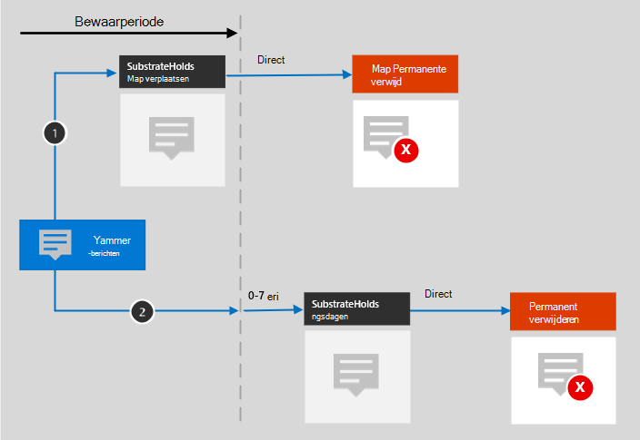

# Meer informatie over retentie voor Yammer

>*[Richtlijnen voor Microsoft 365-licenties voor beveiliging en compliance](/office365/servicedescriptions/microsoft-365-service-descriptions/microsoft-365-tenantlevel-services-licensing-guidance/microsoft-365-security-compliance-licensing-guidance).*

> [!NOTE]
> Deze functie is beschikbaar als preview en kan worden gewijzigd.

De informatie in dit artikel is een aanvulling op [Meer informatie over retentie](retention.md), omdat deze informatie specifiek is voor Yammer.

Zie voor andere workloads:

- [Meer informatie over retentie voor SharePoint en OneDrive](retention-policies-sharepoint.md)
- [Meer informatie over retentie voor Microsoft Teams](retention-policies-teams.md)
- [Meer informatie over retentie voor Exchange](retention-policies-exchange.md)

## Wat is inbegrepen voor retentie en verwijdering

De volgende Yammer-items kunnen worden bewaard en verwijderd via bewaarbeleid voor Yammer: communityberichten en gebruikersberichten.

Reacties van anderen in de vorm van emoticons worden niet opgenomen in deze berichten.

## Hoe retentie werkt voor Yammer

Gebruik deze sectie als u wilt weten hoe aan uw nalevingsvereisten wordt voldaan door back-endopslag en -processen. Dit moet worden gecontroleerd met behulp van eDiscovery-hulpprogramma's in plaats van aan de hand van berichten die momenteel zichtbaar zijn in de Yammer-app.

U kunt een bewaarbeleid gebruiken om gegevens uit communityberichten en gebruikersberichten in Yammer te behouden en deze berichten te verwijderen. Achter de schermen worden Exchange-postvakken gebruikt om gegevens op te slaan die uit deze berichten zijn gekopieerd. Gegevens uit Yammer-gebruikersberichten worden opgeslagen in een verborgen map in het postvak van elke gebruiker die in het gebruikersbericht is opgenomen. Een soortgelijke verborgen map in een groepspostvak wordt gebruikt voor communityberichten.

Kopieën van communityberichten kunnen ook worden opgeslagen in de verborgen map van postvakken van gebruikers wanneer ze gebruikers @vermelden of de gebruiker op de hoogte stellen van een antwoord. Hoewel deze berichten oorspronkelijk een communitybericht zijn, bevat een bewaarbeleid voor Yammer-gebruikersberichten vaak kopieën van communityberichten.

Deze verborgen mappen zijn niet ontworpen om rechtstreeks toegankelijk te zijn voor gebruikers of beheerders, maar slaan in plaats daarvan gegevens op die beheerders met eDiscovery-hulpprogramma's kunnen zoeken.

> [!IMPORTANT]
> Omdat kopieën van communityberichten ook kunnen worden opgeslagen in postvakken van gebruikers, kan een bewaarbeleid met een verwijderactie voor Yammer-gebruikersberichten ertoe leiden dat het oorspronkelijke communitybericht niet meer zichtbaar is voor gebruikers in de Yammer-app.
> 
> Een kopie van het oorspronkelijke bericht is echter nog steeds beschikbaar in de verborgen map van het postvak van de communitygroep en toegankelijk met eDiscovery-zoekopdrachten voor nalevingsdoeleinden.

Yammer-berichten worden niet beïnvloed door bewaarbeleid dat is geconfigureerd voor Exchange-postvakken. Hoewel Yammer-berichten zijn opgeslagen in Exchange, worden deze Yammer-gegevens alleen opgenomen door een bewaarbeleid dat is geconfigureerd voor de **Yammer-communityberichten** en **Yammer-gebruikersberichten** en locaties.

> [!NOTE]
> Als een gebruiker is opgenomen in een actief bewaarbeleid waarin Yammer-gegevens worden bewaard en u een postvak verwijdert van een gebruiker die in dit beleid is opgenomen, wordt het postvak omgezet naar een [inactief postvak](inactive-mailboxes-in-office-365.md) om de gegevens in Teams te behouden. Als u deze Yammer-gegevens voor de gebruiker niet wilt bewaren, moet u het gebruikersaccount uitsluiten van het bewaarbeleid voordat u het postvak van de gebruiker verwijdert.

Nadat een bewaarbeleid voor chatberichten en kanaalberichten is geconfigureerd, controleert een timer voor de Exchange-service regelmatig items in de verborgen map waarin deze Yammer-berichten zijn opgeslagen. Het kan zeven dagen duren voordat de taak is uitgevoerd. Wanneer de retentieperiode voor deze items is verstreken, worden ze verplaatst naar de map SubstrateHolds. Dit is een verborgen map in het postvak van elke gebruiker of groep waarin 'soft-verwijderde' items worden opgeslagen voordat ze definitief worden verwijderd.

> [!NOTE]
> Vanwege het [eerste bewaarprincipe](retention.md#the-principles-of-retention-or-what-takes-precedence) wordt een permanente verwijdering altijd opgeschort als hetzelfde item moet worden bewaard vanwege een ander bewaarbeleid of als het om juridische of onderzoeksredenen onder een eDiscovery-bewaring valt.

Nadat een bewaarbeleid voor Yammer-berichten is geconfigureerd, zijn de paden die de inhoud aflegt afhankelijk van of het bewaarbeleid bestaat uit het behouden en vervolgens verwijderen of alleen uit het behouden of verwijderen ervan.

Wanneer het bewaarbeleid bepaalt dat inhoud moet worden behouden en vervolgens moet worden verwijderd:

Voor de twee paden in het diagram:

1. **Als een Yammer-bericht wordt bewerkt of verwijderd** door de gebruiker tijdens de retentieperiode, wordt het oorspronkelijke bericht onmiddellijk gekopieerd (indien bewerkt) of verplaatst (indien verwijderd) naar de map SubstrateHolds. Het bericht wordt daar opgeslagen totdat de bewaarperiode is verstreken, waarna het bericht onmiddellijk definitief wordt verwijderd.

2. **Als een Yammer-bericht niet wordt verwijderd**, wordt het bericht (evenals huidige berichten na bewerking) naar de map SubstrateHolds verplaatst wanneer de retentieperiode is verstreken. Deze actie duurt maximaal zeven dagen vanaf de vervaldatum. Wanneer het bericht zich in de map MessageFolds staat, wordt het onmiddellijk definitief verwijderd. 

> [!NOTE]
> Berichten in de map Verantwoordelijken zijn doorzoekbaar in eDiscovery-hulpprogramma's. Berichten blijven doorzoekbaar met eDiscovery-hulpprogramma's totdat ze permanent worden verwijderd (in de map SubstrateHolds).

Als het bewaarbeleid is ingesteld op alleen bewaren of alleen verwijderen, is de route die de inhoud aflegt een variatie van bewaren en verwijderen.

### Inhoudsroutes voor retentiebeleid voor alleen bewaren

1. **Als een Yammer-bericht wordt bewerkt of verwijderd**: het oorspronkelijke bericht wordt onmiddellijk verplaatst naar de map SubstrateHolds. Het bericht wordt onmiddellijk permanent verwijderd uit de map SubstrateHolds.

2. **Als het Yammer-bericht niet wordt gewijzigd of verwijderd** tijdens de retentieperiode, en in geval van huidige berichten na bewerking tijdens de retentieperiode: er gebeurt niets voor en na de retentieperiode; het bericht blijft op de oorspronkelijke locatie staan.

### Inhoudsroutes voor retentiebeleid voor alleen verwijderen

1. **Als een Yammer-bericht niet wordt verwijderd** tijdens de retentieperiode: het bericht wordt aan het einde van de retentieperiode naar de map SubstrateHolds verplaatst. Deze actie duurt maximaal zeven dagen vanaf de vervaldatum. Het bericht wordt onmiddellijk permanent verwijderd uit de map SubstrateHolds.

2. **Als het Yammer-bericht tijdens de periode door de gebruiker** verwijderd, wordt het item onmiddellijk verplaatst naar de map SubstrateHolds, waar het onmiddellijk definitief wordt verwijderd.

## Berichtenn en externe gebruikers

Standaard is een bewaarbeleid voor gebruikersberichten van Yammer van toepassing op alle gebruikers in uw organisatie, maar niet op externe gebruikers. U kunt een bewaarbeleid toepassen op externe gebruikers als u de optie **Bewerken** gebruikt voor opgenomen gebruikers en hun account opgeeft.

Op dit moment worden gastgebruikers van Azure B2B niet ondersteund.

## Wanneer een gebruiker de organisatie verlaat 

Als een gebruiker uw organisatie verlaat en zijn of haar Microsoft 365-account wordt verwijderd, worden hun Yammer-gebruikersberichten die moeten worden bewaard, opgeslagen in een inactief postvak. Deze berichten blijven onderworpen aan het bewaarbeleid dat op de gebruiker van toepassing was voordat het postvak inactief werd en de inhoud blijft beschikbaar voor een eDiscovery-zoekopdracht. Zie voor meer informatie [Inactive postvakken in Exchange Online](inactive-mailboxes-in-office-365.md). 

Raadpleeg de [equivalente sectie](retention-policies-sharepoint.md#when-a-user-leaves-the-organization) voor SharePoint en OneDrive als de gebruiker bestanden in Yammer heeft opgeslagen.

## Beperkingen

Bewaarbeleid van Yammer is momenteel preview en we werken voortdurend aan het optimaliseren van functionaliteit voor bewaarbeleid. Houd in de tussentijd rekening met de volgende beperking wanneer u bewaarbeleid gebruikt voor communityberichten en gebruikersberichten in Yammer:

- Wanneer u **Bewerken** selecteert voor de locatie **Yammer-gebruikersberichten**, ziet u mogelijk gasten en niet-postvakgebruikers. Bewaarbeleid is niet ontworpen voor deze gebruikers, selecteer ze daarom ook niet.

## Configuratierichtlijnen

Zie [Aan de slag met bewaarbeleid en retentielabels](get-started-with-retention.md) als het configureren van retentie in Microsoft 365 nieuw voor u is.

Zie [Bewaarbeleid maken en configureren](create-retention-policies.md) als u een bewaarbeleid voor Yammer wilt configureren.