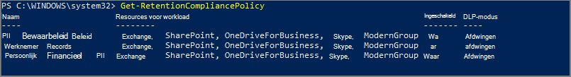
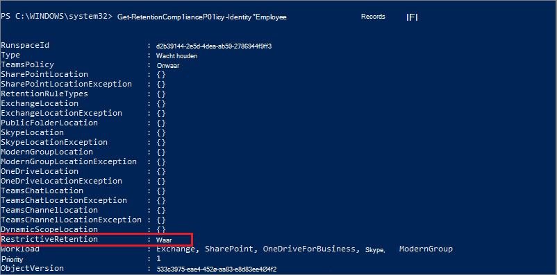

# <a name="use-preservation-lock-to-restrict-changes-to-retention-policies-and-retention-label-policies"></a><span data-ttu-id="22527-103">Behoudvergrendeling gebruiken om wijzigingen in bewaarbeleid en bewaarlabelbeleid te beperken</span><span class="sxs-lookup"><span data-stu-id="22527-103">Use Preservation Lock to restrict changes to retention policies and retention label policies</span></span>

><span data-ttu-id="22527-104">*[Richtlijnen voor Microsoft 365-licenties voor beveiliging en compliance](/office365/servicedescriptions/microsoft-365-service-descriptions/microsoft-365-tenantlevel-services-licensing-guidance/microsoft-365-security-compliance-licensing-guidance).*</span><span class="sxs-lookup"><span data-stu-id="22527-104">*[Microsoft 365 licensing guidance for security & compliance](/office365/servicedescriptions/microsoft-365-service-descriptions/microsoft-365-tenantlevel-services-licensing-guidance/microsoft-365-security-compliance-licensing-guidance).*</span></span>

<span data-ttu-id="22527-105">Met behoudvergrendeling wordt een bewaarbeleid of bewaarlabelbeleid vergrendeld, zodat niemand—ook een globale beheerder, het beleid kan uitschakelen, het beleid kan verwijderen of minder beperkend kan maken.</span><span class="sxs-lookup"><span data-stu-id="22527-105">Preservation Lock locks a retention policy or retention label policy so that no one—including a global admin—can turn off the policy, delete the policy, or make it less restrictive.</span></span> <span data-ttu-id="22527-106">Deze configuratie kan nodig zijn voor wettelijke vereisten en kan helpen beveiliging tegen malafide beheerders.</span><span class="sxs-lookup"><span data-stu-id="22527-106">This configuration might be needed for regulatory requirements and can help safeguard against rogue administrators.</span></span>

<span data-ttu-id="22527-107">Wanneer een bewaarbeleid is vergrendeld:</span><span class="sxs-lookup"><span data-stu-id="22527-107">When a retention policy is locked:</span></span>

- <span data-ttu-id="22527-108">Niemand kan het beleid uitschakelen of verwijderen</span><span class="sxs-lookup"><span data-stu-id="22527-108">No one can disable the policy or delete it</span></span>
- <span data-ttu-id="22527-109">Locaties kunnen worden toegevoegd, maar niet worden verwijderd</span><span class="sxs-lookup"><span data-stu-id="22527-109">Locations can be added but not removed</span></span>
- <span data-ttu-id="22527-110">U kunt de retentieperiode verlengen, maar niet verlagen</span><span class="sxs-lookup"><span data-stu-id="22527-110">You can extend the retention period but not decrease it</span></span>

<span data-ttu-id="22527-111">Wanneer een retentielabelbeleid is vergrendeld:</span><span class="sxs-lookup"><span data-stu-id="22527-111">When a retention label policy is locked:</span></span>

- <span data-ttu-id="22527-112">Niemand kan het beleid uitschakelen of verwijderen</span><span class="sxs-lookup"><span data-stu-id="22527-112">No one can disable the policy or delete it</span></span>
- <span data-ttu-id="22527-113">Locaties kunnen worden toegevoegd, maar niet worden verwijderd</span><span class="sxs-lookup"><span data-stu-id="22527-113">Locations can be added but not removed</span></span>
- <span data-ttu-id="22527-114">Labels kunnen worden toegevoegd, maar niet worden verwijderd</span><span class="sxs-lookup"><span data-stu-id="22527-114">Labels can be added but not removed</span></span>

<span data-ttu-id="22527-115">Samengevat: een vergrendeld beleid kan worden verhoogd of uitgebreid, maar kan niet worden beperkt of uitgeschakeld.</span><span class="sxs-lookup"><span data-stu-id="22527-115">In summary, a locked policy can be increased or extended, but it can't be reduced or turned off.</span></span>

> [!IMPORTANT]
> <span data-ttu-id="22527-116">Voordat u een bewaarbeleid of bewaarlabelbeleid vergrendelt, is het van essentieel belang dat u de gevolgen begrijpt en controleert of dit vereist is voor uw organisatie.</span><span class="sxs-lookup"><span data-stu-id="22527-116">Before you lock a retention policy or retention label policy, it's critical that you understand the impact and confirm whether it's required for your organization.</span></span> <span data-ttu-id="22527-117">Het kan bijvoorbeeld nodig zijn om te voldoen aan wettelijke vereisten.</span><span class="sxs-lookup"><span data-stu-id="22527-117">For example, it might be needed to meet regulatory requirements.</span></span> <span data-ttu-id="22527-118">Beheerders kunnen dit beleid niet uitschakelen of verwijderen nadat de behoudvergrendeling is toegepast.</span><span class="sxs-lookup"><span data-stu-id="22527-118">Administrators won't be able to disable or delete these policies after the preservation lock is applied.</span></span>

<span data-ttu-id="22527-119">Behoudvergrendeling configureren nadat u een [bewaarbeleid](create-retention-policies.md)hebt gemaakt of een bewaarlabelbeleid dat u [publiceert](create-apply-retention-labels.md) of [automatisch toepast](apply-retention-labels-automatically.md).</span><span class="sxs-lookup"><span data-stu-id="22527-119">Configure Preservation Lock after you've created a [retention policy](create-retention-policies.md), or a retention label policy that you [publish](create-apply-retention-labels.md) or [auto-apply](apply-retention-labels-automatically.md).</span></span> 

> [!NOTE]
> <span data-ttu-id="22527-120">Als u een labelbeleid vergrendelt, voorkomt u niet dat een beheerder de retentieperiode verkort van een label dat is opgenomen in het vergrendelde beleid.</span><span class="sxs-lookup"><span data-stu-id="22527-120">Locking a label policy doesn't prevent an administrator from reducing the retention period in a label that is included in the locked policy.</span></span> <span data-ttu-id="22527-121">Aan deze vereiste, met andere beperkingen, kan worden voldaan wanneer u een label configureert om items te markeren als een [regelgevend record](records-management.md#records).</span><span class="sxs-lookup"><span data-stu-id="22527-121">That requirement, with other restrictions, can be met when you configure a label to mark items as a [regulatory record](records-management.md#records).</span></span>

## <a name="how-to-lock-a-retention-policy-or-retention-label-policy"></a><span data-ttu-id="22527-122">Een bewaarbeleid of bewaarlabelbeleid vergrendelen</span><span class="sxs-lookup"><span data-stu-id="22527-122">How to lock a retention policy or retention label policy</span></span>

<span data-ttu-id="22527-123">U moet PowerShell gebruiken als u Behoudvergrendeling nodig hebt.</span><span class="sxs-lookup"><span data-stu-id="22527-123">You must use PowerShell if you need to use Preservation Lock.</span></span> <span data-ttu-id="22527-124">Omdat beheerders een beleid voor bewaren niet kunnen uitschakelen of verwijderen nadat deze vergrendeling is toegepast, is het inschakelen van deze functie niet beschikbaar in de gebruikersinterface om te beveiligen tegen onbedoelde configuratie.</span><span class="sxs-lookup"><span data-stu-id="22527-124">Because administrators can't disable or delete a policy for retention after this lock is applied, enabling this feature is not available in the UI to safeguard against accidental configuration.</span></span>

<span data-ttu-id="22527-125">Alle beleid voor retentie en met elke configuratie bieden ondersteuning voor Behoudvergrendeling.</span><span class="sxs-lookup"><span data-stu-id="22527-125">All policies for retention and with any configuration support Preservation Lock.</span></span>

1. <span data-ttu-id="22527-126">[Verbinding maken met Beveiligings- en compliancecentrum van Powershell](/powershell/exchange/connect-to-scc-powershell).</span><span class="sxs-lookup"><span data-stu-id="22527-126">[Connect to Security & Compliance Center PowerShell](/powershell/exchange/connect-to-scc-powershell).</span></span>

2. <span data-ttu-id="22527-127">Zoek de naam van het beleid dat u wilt vergrendelen door [Get-RetentionCompliancePolicy](/powershell/module/exchange/get-retentioncompliancepolicy) uit te voeren.</span><span class="sxs-lookup"><span data-stu-id="22527-127">Find the name of the policy that you want to lock by running [Get-RetentionCompliancePolicy](/powershell/module/exchange/get-retentioncompliancepolicy).</span></span> <span data-ttu-id="22527-128">Bijvoorbeeld:</span><span class="sxs-lookup"><span data-stu-id="22527-128">For example:</span></span>
    
   

3. <span data-ttu-id="22527-130">Als u een Behoudvergrendeling op het beleid wilt instellen, moet u de [Set-RetentionCompliancePolicy](/powershell/module/exchange/set-retentioncompliancepolicy) cmdlet uitvoeren met de naam van het beleid en de parameter *RestrictiveRetention* ingesteld op waar:</span><span class="sxs-lookup"><span data-stu-id="22527-130">To place a Preservation Lock on your policy, run the [Set-RetentionCompliancePolicy](/powershell/module/exchange/set-retentioncompliancepolicy) cmdlet with the name of the policy, and the *RestrictiveRetention* parameter set to true:</span></span>
    
    ```powershell
    Set-RetentionCompliancePolicy -Identity "<Name of Policy>" –RestrictiveRetention $true
    ```
    
    <span data-ttu-id="22527-131">Bijvoorbeeld:</span><span class="sxs-lookup"><span data-stu-id="22527-131">For example:</span></span>
    
    
    
     <span data-ttu-id="22527-133">Lees en bevestig, wanneer u daarom wordt gevraagd, de beperkingen die gelden bij deze configuratie door **Y** in te voeren:</span><span class="sxs-lookup"><span data-stu-id="22527-133">When prompted, read and acknowledge the restrictions that come with this configuration by entering **Y**:</span></span>
    
   

<span data-ttu-id="22527-135">Er is nu een Behoudvergrendeling op het beleid geplaatst.</span><span class="sxs-lookup"><span data-stu-id="22527-135">A Preservation Lock is now placed on the policy.</span></span> <span data-ttu-id="22527-136">Voer ter bevestiging de `Get-RetentionCompliancePolicy` opnieuw uit, maar geef de beleidsnaam op en geef de beleidsparameters weer:</span><span class="sxs-lookup"><span data-stu-id="22527-136">To confirm, run `Get-RetentionCompliancePolicy` again, but specify the policy name and display the policy parameters:</span></span>

```powershell
Get-RetentionCompliancePolicy -Identity "<Name of Policy>" |Fl
```

<span data-ttu-id="22527-137">**RestrictiveRetention** moet nu ingesteld zijn op **Waar**.</span><span class="sxs-lookup"><span data-stu-id="22527-137">You should see **RestrictiveRetention** is set to **True**.</span></span> <span data-ttu-id="22527-138">Bijvoorbeeld:</span><span class="sxs-lookup"><span data-stu-id="22527-138">For example:</span></span>



## <a name="see-also"></a><span data-ttu-id="22527-140">Zie ook</span><span class="sxs-lookup"><span data-stu-id="22527-140">See also</span></span>

[<span data-ttu-id="22527-141">Bronnen om je te helpen te voldoen aan wettelijke vereisten voor informatiebeheer en recordbeheer</span><span class="sxs-lookup"><span data-stu-id="22527-141">Resources to help you meet regulatory requirements for information governance and records management</span></span>](retention-regulatory-requirements.md)