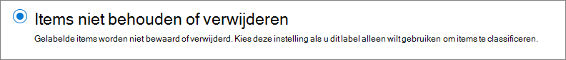
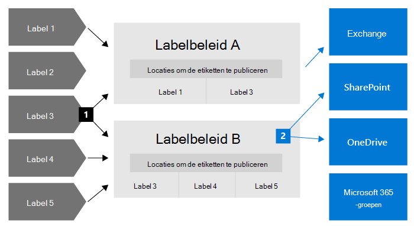
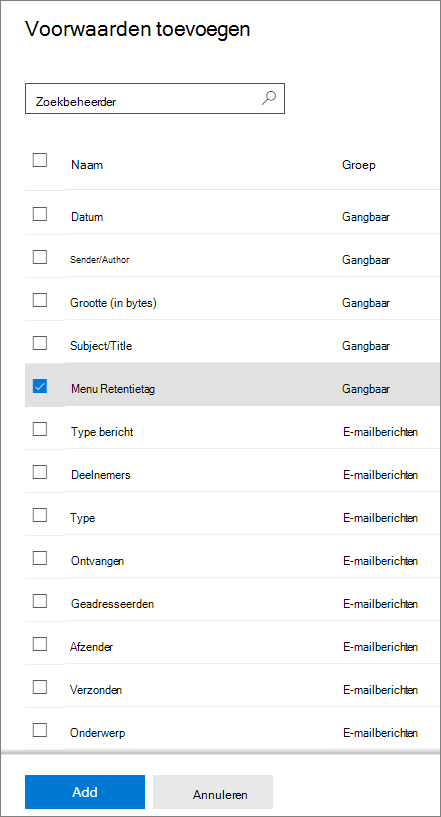
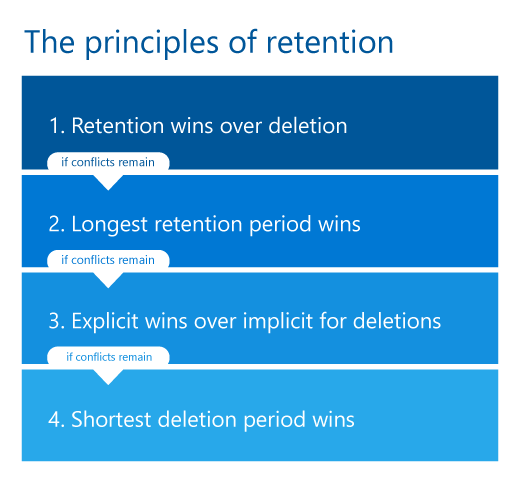

# Meer informatie over bewaarbeleid en retentielabels

>*[Richtlijnen voor Microsoft 365-licenties voor beveiliging en compliance](/office365/servicedescriptions/microsoft-365-service-descriptions/microsoft-365-tenantlevel-services-licensing-guidance/microsoft-365-security-compliance-licensing-guidance).*

> [!NOTE]
> Als u berichten ziet over bewaarbeleid in Teams of vragen hebt over retentielabels in uw apps, neemt u contact op met uw IT-afdeling voor informatie over hoe deze voor u zijn geconfigureerd. In de tussentijd kunnen de volgende artikelen nuttig zijn:
> -  [Teams-berichten over het bewaarbeleid](https://support.microsoft.com/office/teams-messages-about-retention-policies-c151fa2f-1558-4cf9-8e51-854e925b483b)
> - [Bewaarlabels toepassen op bestanden in SharePoint of OneDrive](https://support.microsoft.com/office/apply-retention-labels-to-files-in-sharepoint-or-onedrive-11a6835b-ec9f-40db-8aca-6f5ef18132df)
>
> De informatie op deze pagina is voor IT-beheerders die een bewaarbeleid en retentielabels kunnen maken om nalevingsredenen.

Voor de meeste organisaties neemt het volume en de complexiteit van de gegevens dagelijks toe (e-mail, documenten, chatberichten en meer). Het effectief beheren van of toezien op deze gegevens is belangrijk omdat u het volgende moet doen:

- **Proactief voldoen aan branchevoorschriften en intern beleid** die vereisen dat u inhoud een bepaalde periode bewaart. De Sarbanes-Oxley Act kan bijvoorbeeld vereisen dat u bepaalde soorten inhoud zeven jaar behoudt.

- **Uw risico verminderen in geval van juridische procedures of een beveiligingsrisico** door oude inhoud die u niet meer nodig hebt definitief te verwijderen.

- **Uw organisatie helpen om kennis effectief te delen en flexibeler te zijn** door ervoor te zorgen dat uw gebruikers alleen met actuele en relevante inhoud werken.

Retentie-instellingen die u configureert, kunnen u helpen deze doelen te bereiken. Voor het beheren van inhoud zijn doorgaans twee acties vereist:

| Actie| Doel |
|:-----|:-----|
|Inhoud behouden | Permanente verwijdering voorkomen en beschikbaar blijven voor eDiscovery |
|Inhoud verwijderen | Inhoud definitief verwijderen uit uw organisatie|

Met deze twee bewaaracties kunt u retentie-instellingen configureren voor de volgende resultaten:

- Alleen behouden: inhoud altijd of voor een bepaalde periode bewaren.
- Alleen verwijderen: inhoud na een opgegeven periode definitief verwijderen.
- Behouden en vervolgens verwijderen: inhoud gedurende een opgegeven periode bewaren en deze vervolgens definitief verwijderen.

Deze retentie-instellingen werken met inhoud die u de extra overhead bespaart voor het maken en configureren van extra opslag wanneer u inhoud vanwege nalevingsredenen wilt behouden. Bovendien hoeft u geen aangepaste processen te implementeren om deze gegevens te kopiëren en synchroniseren.

Gebruik de volgende secties voor meer informatie over hoe bewaarbeleid en retentielabels werken, wanneer ze moeten worden gebruikt en hoe ze elkaar aanvullen. Raadpleeg [Aan de slag met bewaarbeleid en retentielabels](get-started-with-retention.md) als u klaar bent om aan de slag te gaan en retentie-instellingen wilt implementeren voor een aantal veelvoorkomende scenario's.

## Hoe bewaarinstellingen werken met aanwezige inhoud

Wanneer aan inhoud retentie-instellingen zijn toegewezen, blijft die inhoud op de oorspronkelijke locatie staan. Personen kunnen verder werken aan hun documenten of e-mail alsof er niets is gewijzigd. Maar als ze inhoud bewerken of verwijderen die in het bewaarbeleid is opgenomen, wordt automatisch een kopie van de inhoud bewaard.
  
- Voor SharePoint- en OneDrive-sites: de kopie blijft behouden in de **opslagbibliotheek**.

- Voor Exchange-postvakken: de kopie blijft behouden in de map **Herstelbare items**. 

- Voor Teams- en Yammer-berichten: de kopie blijft behouden in een verborgen map met de naam **SubstrateHolds** als een submap in de map **Herstelbare items** in Exchange.

> [!NOTE]
> De opslagbibliotheek gebruikt opslagruimte die niet is vrijgesteld van de opslagquota van een site. Mogelijk moet u uw opslag verhogen wanneer u retentie-instellingen gebruikt voor SharePoint- en Microsoft 365-groepen.
> 
Deze beveiligde locaties en de inhoud die wordt bewaard, zijn voor de meeste personen niet zichtbaar. In de meeste gevallen hoeven mensen zelfs niet te weten dat hun inhoud onderworpen is aan instellingen voor bewaren.

Zie de volgende artikelen voor meer informatie over de manier waarop instellingen voor bewaarbeleid werken voor verschillende werkbelastingen:

- [Meer informatie over retentie voor SharePoint en OneDrive](retention-policies-sharepoint.md)
- [Meer informatie over retentie voor Microsoft Teams](retention-policies-teams.md)
- [Meer informatie over retentie voor Yammer](retention-policies-yammer.md)
- [Meer informatie over retentie voor Exchange](retention-policies-exchange.md)

## Bewaarbeleid en retentielabels

Als u uw instellingen voor bewaren aan inhoud wilt toewijzen, gebruikt u **bewaarbeleid** en **retentielabels met bewaarbeleid**. U kunt één van deze methoden gebruiken of de methoden combineren.

Gebruik een bewaarbeleid om dezelfde bewaarinstellingen toe te wijzen voor inhoud op site- of postvakniveau, en gebruik een retentielabel om bewaarinstellingen toe te wijzen op itemniveau (map, document, e-mail).

Als bijvoorbeeld alle documenten in een SharePoint-site vijf jaar bewaard moeten blijven, is het efficiënter om dit te doen met een bewaarbeleid dan hetzelfde retentielabel toe te passen op alle documenten op die site. Maar als sommige documenten in die site echter vijf jaar bewaard zouden moeten blijven en andere documenten tien jaar, is dit niet mogelijk met een bewaarbeleid. Wanneer u instellingen voor bewaren op itemniveau moet opgeven, gebruikt u retentielabels. 

In tegenstelling tot bewaarbeleid gaan bewaarinstellingen van retentielabels met de inhoud mee als deze wordt verplaatst naar een andere locatie in uw Microsoft 365-tenant. Daarnaast hebben retentielabels de volgende mogelijkheden die niet worden ondersteund door bewaarbeleid: 
 
- Opties om de bewaarperiode te starten vanaf het moment waarop de inhoud is gelabeld of op basis van een gebeurtenis, naast de leeftijd van de inhoud of de laatste wijzigingsdatum.

- Gebruik [trainbare classificaties](classifier-learn-about.md) om inhoud te identificeren waaraan een label moet worden toegewezen.

- Pas een standaardlabel toe op SharePoint-documenten.

- Ondersteun [controles voor verwijdering](./disposition.md)  om de inhoud te controleren voordat deze definitief wordt verwijderd.

- Markeer de inhoud als een [record](records-management.md#records) als onderdeel van de labelinstellingen en beschik altijd over een [bewijs van verwijdering](disposition.md#disposition-of-records)  wanneer inhoud wordt verwijderd aan het einde van de bewaarperiode.

### Bewaarbeleid

Bewaarbeleid kan worden toegepast op de volgende locaties:
- Exchange-e-mail
- SharePoint-site
- OneDrive-accounts
- Microsoft 365 Groepen
- Skype voor Bedrijven
- Openbare Exchange-mappen
- Teams-kanaalberichten
- Teams-chats
- Berichten in de Yammer-community
- Yammer-gebruikersberichten

U kunt heel efficiënt één beleid toepassen op meerdere locaties of op specifieke locaties of gebruikers.

Voor het begin van de bewaarperiode kunt u kiezen voor wanneer de inhoud is gemaakt of, alleen ondersteund voor bestanden en SharePoint-, OneDrive- en Microsoft 365-groepslocaties, wanneer de inhoud voor het laatst is gewijzigd.

Items nemen de bewaarinstellingen over van de container die is opgegeven in het bewaarbeleid. Als de items vervolgens buiten die container worden verplaatst wanneer het beleid is geconfigureerd voor het behouden van inhoud, blijft een kopie van dat item bewaard op de beveiligde locatie van de werkbelasting. De instellingen voor het bewaren gaan echter niet met de inhoud mee naar de nieuwe locatie. Gebruik, indien vereist, retentielabels in plaats van bewaarbeleid.

### Retentielabels

Gebruik retentielabels voor verschillende soorten inhoud waarvoor verschillende bewaarinstellingen zijn vereist. Bijvoorbeeld:
  
- Belastingformulieren die een minimale periode moeten worden bewaard. 
    
- Persmateriaal dat permanent moet worden verwijderd wanneer een bepaalde leeftijd wordt bereikt. 
    
- Concurrentieonderzoek dat een bepaalde periode moet worden bewaard en vervolgens definitief moet worden verwijderd. 
    
- Werkvisums die als record moeten worden gemarkeerd, zodat ze niet kunnen worden bewerkt of verwijderd. 
    
In al deze gevallen kunt u met retentielabels bewaarinstellingen toepassen voor beheer op itemniveau (document of e-mail).
  
Met retentielabels kunt u het volgende doen:
  
- **Stel personen in uw organisatie in staat om handmatig een retentielabels toe te passen** op inhoud in Outlook en de webversie van Outlook, OneDrive, SharePoint en Microsoft 365-groepen. Gebruikers weten vaak het beste met welk type inhoud ze bezig zijn, zodat ze deze kunnen classificeren en de juiste bewaarinstellingen erop kunnen toepassen. 
    
- **Pas automatisch retentielabels toe op inhoud** als deze overeenkomt met bepaalde voorwaarden, bijvoorbeeld wanneer de inhoud het volgende bevat: 
    - Specifieke typen gevoelige informatie.
    - Specifieke trefwoorden die overeenkomen met een query die u maakt.
    - Patroonovereenkomsten voor een trainbare classificatie.

- **Start de bewaarperiode vanaf het moment waarop de inhoud is gelabeld** voor documenten in SharePoint-sites en OneDrive-accounts, en voor e-mailitems (met uitzondering van agenda-items). Als u een retentielabel met deze configuratie op een agenda-item toepast, begint de bewaarperiode zodra het label wordt verzonden.

- **Start de bewaarperiode wanneer een gebeurtenis plaatsvindt**, zoals werknemers die de organisatie verlaten of wanneer contracten verlopen.

- **Pas een standaard retentielabel toe op een documentbibliotheek, map of documentenset** in SharePoint, zodat alle documenten die op die locatie zijn opgeslagen, het standaard retentielabel overnemen.

Bovendien ondersteunen retentielabels [recordbeheer](records-management.md) voor e-mail en documenten in Microsoft 365-apps en -services. U kunt een retentielabel gebruiken om items als record te markeren. Wanneer dit gebeurt en de inhoud in Microsoft 365 blijft staan, pas het label verdere beperkingen toe op de inhoud die mogelijk om regelgevingsredenen nodig is. Zie [Beperkingen vergelijken voor welke acties zijn toegestaan of geblokkeerd](records-management.md#compare-restrictions-for-what-actions-are-allowed-or-blocked) voor meer informatie.

Retentielabels blijven, in tegenstelling tot [gevoeligheidslabels](sensitivity-labels.md), niet behouden als de inhoud buiten Microsoft 365 wordt verplaatst.

Er is geen limiet voor het aantal retentielabels dat wordt ondersteund voor een tenant. Er worden echter maximaal 10.000 beleidsregels ondersteund voor een tenant en hieronder vallen zowel het bewaarbeleid als de beleidsregels die de labels toepassen (beleidsregels voor retentielabels en bewaarbeleid voor automatisch toepassen).

#### Inhoud classificeren zonder acties toe te passen

Hoewel het belangrijkste doel van retentielabels het bewaren of verwijderen van inhoud betreft, kunt u ook retentielabels gebruiken zonder dat u iets bewaart of andere acties moet uitvoeren. In dit geval kunt u een retentielabel gebruiken als tekstlabel, zonder acties af te dwingen.
  
U kunt bijvoorbeeld een retentielabel met de naam 'Later bekijken' maken en toepassen zonder acties, en dat label later gebruiken om die inhoud te vinden.
  

#### Een retentielabel gebruiken als voorwaarde in een DLP-beleid

U kunt voor documenten in SharePoint een retentielabel opgeven als voorwaarde in een beleid voor preventie van gegevensverlies (DLP). Configureer bijvoorbeeld een DLP-beleid om te voorkomen dat documenten buiten de organisatie worden gedeeld als op deze documenten een bepaald retentielabel is toegepast.

Raadpleeg [Een retentielabel gebruiken als voorwaarde in een DLP-beleid](data-loss-prevention-policies.md#using-a-retention-label-as-a-condition-in-a-dlp-policy) voor meer informatie.

#### Retentielabels en beleidsregels die deze labels toepassen

Wanneer u retentielabels publiceert, worden deze opgenomen in **beleid voor retentielabels** waardoor beheerders en gebruikers deze kunnen toepassen op inhoud. In het volgende diagram ziet u:

1. Eén retentielabel kan worden opgenomen in meerdere beleidsregels voor retentielabels.

2. Met beleid voor retentielabels kunt u de locaties opgeven waar de retentielabels moeten worden gepubliceerd. Deze locatie kan worden opgenomen in meerdere beleidsregels voor retentielabels.

U kunt ook een of meer **beleidsregels voor bewaarlabels automatisch toepassen**, elk met één retentielabel. Met dit beleid wordt automatisch een retentielabel toegepast wanneer wordt voldaan aan de voorwaarden die u in het beleid opgeeft.

#### Retentielabelbeleid en -locaties

Verschillende typen retentielabels kunnen naar verschillende locaties worden gepubliceerd, afhankelijk van wat het retentielabel doet.
  
| Als het retentielabel is ... | Kan het labelbeleid worden toegepast op ... |
|:-----|:-----|
|Gepubliceerd voor beheerders en eindgebruikers    |Exchange, SharePoint, OneDrive, Microsoft 365-groepen    |
|Automatisch toegepast op basis van typen gevoelige informatie of trainbare classificaties    |Exchange (alleen alle postvakken), SharePoint, OneDrive    |
|Automatisch toegepast op basis van een query    |Exchange, SharePoint, OneDrive, Microsoft 365-groepen    |
   
In Exchange worden retentielabels die u automatisch toepast alleen toegepast op berichten die daarna worden verzonden (data-in-transit), niet op alle items die momenteel in het postvak zijn opgenomen (data-at-rest). Bovendien gelden automatisch toegepaste retentielabels voor typen gevoelige informatie en trainbare classificaties voor alle postvakken: u kunt niet specifieke postvakken selecteren.
  
Openbare Exchange-mappen en berichten in Skype, Teams en Yammer bieden geen ondersteuning voor retentielabels. Gebruik bewaarbeleid als u inhoud van deze locaties wilt behouden en verwijderen.

#### Slechts één retentielabel per keer

Op een e-mail of document kan slechts één retentielabel tegelijk worden toegepast. Een bewaarlabel kan [handmatig](create-apply-retention-labels.md#manually-apply-retention-labels) worden toegepast door een eindgebruiker of beheerder, of automatisch met behulp van een van de volgende methoden:

- [Beleid voor het automatisch toepassen van labels](apply-retention-labels-automatically.md)
- [Documentbegripmodel in SharePoint Syntex](../contentunderstanding/apply-a-retention-label-to-a-model.md)
- [Standaardlabel voor SharePoint](create-apply-retention-labels.md#applying-a-default-retention-label-to-all-content-in-a-sharepoint-library-folder-or-document-set) of [Outlook](create-apply-retention-labels.md#applying-a-default-retention-label-to-an-outlook-folder)
- [Outlook-regels](create-apply-retention-labels.md#automatically-applying-a-retention-label-to-email-by-using-rules)

Voor standaardretentielabels (items worden niet als een [record of wettelijk verplichte record](records-management.md#records) gemarkeerd):

- Beheerders en eindgebruikers kunnen een bestaand retentielabel dat op inhoud is toegepast, handmatig wijzigen of verwijderen. 

- Wanneer er al een retentielabel op de inhoud is toegepast, wordt het bestaande label niet automatisch verwijderd of vervangen door een ander retentielabel. Er is één mogelijke uitzondering: het bestaande label is toegepast als een standaardlabel.
    
    Meer informatie over het gedrag van labels wanneer ze worden toegepast met een standaardlabel:
    - Standaardlabel voor SharePoint: [Labelgedrag wanneer u een standaardlabel voor SharePoint gebruikt](create-apply-retention-labels.md#label-behavior-when-you-use-a-default-label-for-sharepoint)
    - Standaardlabel voor Outlook: [Een standaard retentielabel toepassen op een Outlook-map](create-apply-retention-labels.md#applying-a-default-retention-label-to-an-outlook-folder)

- Als er meerdere beleidsregels voor automatisch toepassen zijn waarop een bewaarlabel kan worden toegepast en inhoud aan de voorwaarden van meerdere beleidsregels voldoet, wordt het bewaarlabel voor het oudste beleid voor automatisch toepassen (op basis van de aanmaakdatum) toegepast.

Wanneer retentielabels items als een record of een wettelijk verplichte record markeren, worden deze labels nooit automatisch gewijzigd. Alleen beheerders van de container kunnen handmatig retentielabels wijzigen of verwijderen die items als een record markeren. Dit geldt echter niet voor wettelijk verplichte records. Zie [Beperkingen vergelijken voor welke acties zijn toegestaan of geblokkeerd](records-management.md#compare-restrictions-for-what-actions-are-allowed-or-blocked) voor meer informatie.

#### Retentielabels controleren

Gebruik in het Microsoft 365-compliancecentrum **Gegevensclassificatie** > **Overzicht** om te controleren hoe uw retentielabels in uw tenant worden gebruikt en om te bepalen waar de gelabelde items zich bevinden. Raadpleeg [Uw gegevens kennen - Overzicht van gegevensclassificatie](data-classification-overview.md) voor meer informatie, inclusief belangrijke vereisten.

Vervolgens kunt u inzoomen op details met [Inhoudsverkenner](data-classification-content-explorer.md) en [Verkenner](data-classification-activity-explorer.md).

> [!TIP]
>U kunt overwegen andere inzichten in de classificatie van gegevens te gebruiken, zoals trainbare classificaties en typen gevoelige informatie, om inhoud te identificeren die u mogelijk moet behouden of verwijderen, of die u moet beheren als records.

Het Office 365-beveiligings- en compliancecentrum heeft de vergelijkbare overzichtsgegevens voor retentielabels uit **Informatiebeheer** > **Dashboard**, en meer gedetailleerde informatie uit **Informationbeheer** > **Verkenner voor labelactiviteit**. Zie de volgende documentatie voor meer informatie over het bewaken van retentielabels in dit oudere beheercentrum:
- [De gegevensbeheerrapporten weergeven](view-the-data-governance-reports.md)
- [Aan de slag met gegevensclassificatie](data-classification-overview.md).
- [Labelactiviteit voor documenten weergeven](view-label-activity-for-documents.md)

#### Inhoud zoeken gebruiken om alle inhoud met een specifiek retentielabel te zoeken

Nadat retentielabels op inhoud zijn toegepast (door gebruikers of automatisch toegepast), kunt u inhoud zoeken om alle items te vinden waarop een specifiek retentielabel is toegepast.

Als u een inhoudszoekactie maakt, moet u de voorwaarde **Retentielabel** kiezen en de volledige labelnaam of een deel van de labelnaam invoeren en een jokerteken gebruiken. Zie [Trefwoordquery's en zoekvoorwaarden voor Inhoud zoeken](keyword-queries-and-search-conditions.md) voor meer informatie.
  

## Mogelijkheden voor bewaarbeleid en retentielabels vergelijken

Gebruik de volgende tabel om te bepalen of een bewaarbeleid of retentielabel moet worden gebruikt op basis van mogelijkheden.

|Mogelijkheid|Bewaarbeleid |Retentielabel|
|:-----|:-----|:-----|:-----|
|Bewaarinstellingen die kunnen worden bewaard en vervolgens verwijderd, alleen kunnen worden behouden of alleen kunnen worden verwijderd |Ja |Ja |
|Ondersteunde werkbelastingen:  - Exchange  - SharePoint  - OneDrive  - Microsoft 365-groepen  - Skype voor Bedrijven  - Teams - Yammer|  Ja   Ja   Ja   Ja   Ja   Ja   Ja |   Ja, behalve openbare mappen   Ja   Ja   Ja   Nee   Nee   Nee |
|Bewaarbeleid automatisch toegepast | Ja | Ja |
|Bewaarbeleid toegepast op basis van voorwaarden   - typen gevoelige informatie, KQL-query's en trefwoorden, trainbare classificaties| Nee | Ja |
|Bewaarbeleid handmatig toegepast | Nee | Ja |
|UI-aanwezigheid voor eindgebruikers | Nee | Ja |
|Blijft bestaan als de inhoud wordt verplaatst | Nee | Ja, binnen uw Microsoft 365-tenant |
|Item declareren als record| Nee | Ja |
|De bewaarperiode na het toepassen van een label of op basis van een gebeurtenis | Nee | Ja |
|Verwijderingsbeoordeling | Nee| Ja |
|Bewijs van verwijdering voor maximaal zeven jaar | Nee |Ja, wanneer u een verwijderingsbeoordeling gebruikt of als het item is gemarkeerd als een record|
|Activiteiten van auditbeheerders| Ja | Ja|
|Items identificeren die moeten worden bewaard:   - Inhoud zoeken   - Pagina Gegevensclassificatie, Inhoudsverkenner, Activiteitenverkenner |   Nee   Nee |   Ja   Ja|

Houd er rekening mee dat u zowel bewaarbeleid als retentielabels kunt gebruiken als aanvullende bewaarmethoden. Bijvoorbeeld:

1. U maakt en configureert een bewaarbeleid dat inhoud vijf jaar nadat deze voor het laatst is gewijzigd automatisch verwijdert en past het beleid toe op alle OneDrive-accounts.

2. U maakt en configureert een retentielabel dat inhoud voorgoed bewaart en voegt dit toe aan een labelbeleid dat u naar alle OneDrive-accounts publiceert. U legt gebruikers uit hoe ze dit label handmatig kunnen toepassen op specifieke documenten die van automatisch verwijderen moeten worden uitgesloten als ze na vijf jaar niet worden gewijzigd.

Zie de volgende sectie voor meer informatie over hoe bewaarbeleid en retentielabels samenwerken en hoe u het gecombineerde resultaat kunt bepalen. In het volgende gedeelte worden de principes voor retentie en prioriteit uitgelegd.

## De principes voor bewaren: wat heeft voorrang?

In tegenstelling tot retentielabels kunt u meer dan één bewaarbeleid toepassen op dezelfde inhoud. Elk bewaarbeleid kan leiden tot een bewaaractie en een verwijderingsactie. Daarnaast kan ook een retentielabels bepalen welke acties voor het item kunnen worden uitgevoerd.

Wat heeft in dit scenario, wanneer voor items meerdere bewaarinstellingen kunnen gelden die ook nog eens een conflict met elkaar kunnen veroorzaken, prioriteit om het resultaat te bepalen?

Het resultaat is niet welk bewaarbeleid of welk retentielabel wint, maar hoe lang een item wordt bewaard (indien van toepassing) en wanneer een item wordt verwijderd (indien van toepassing). Deze twee acties worden onafhankelijk van elkaar berekend op basis van alle instellingen voor bewaren die op een item zijn toegepast.

Een item kan bijvoorbeeld zijn onderworpen aan een bewaarbeleid dat is geconfigureerd om alleen te verwijderen en een ander bewaarbeleid dat is geconfigureerd voor het behouden en vervolgens verwijderen. Hierdoor heeft dit item slechts één behoudactie, maar twee verwijderingsacties. De acties voor bewaren en verwijderen kunnen met elkaar in strijd zijn en de twee verwijderingsacties kunnen een conflicterende datum hebben. Om het resultaat te bepalen, moet u de principes voor bewaren toepassen.

Op een hoog niveau kunt u er zeker van zijn dat bewaren altijd voorrang heeft op verwijderen en dat de langste bewaarperiode ‘wint’. Deze twee eenvoudige regels bepalen altijd hoe lang een item wordt bewaard.

Er zijn nog een paar factoren die bepalen wanneer een item wordt verwijderd, waaronder de actie Verwijderen op basis van een retentielabel: deze heeft altijd voorrang op de actie Verwijderen uit een bewaarbeleid.

Gebruik de volgende stroom om inzicht te krijgen in de resultaten van het bewaren en verwijderen van één item. Elk niveau fungeert als een gelijkspel voor conflicten, van boven naar beneden. Als het resultaat bijvoorbeeld wordt bepaald door het eerste niveau omdat er geen verdere conflicten zijn, is het niet nodig om verder te gaan naar het volgende niveau.

> [!IMPORTANT]
> Als u retentielabels gebruikt: voordat u deze stroom gebruikt om het resultaat van meerdere bewaarinstellingen voor hetzelfde item te bepalen, moet u weten [welk retentielabel is toegepast](#only-one-retention-label-at-a-time).

  
Uitleg van de vier verschillende niveaus:
  
1. **Bewaren heeft een hogere prioriteit dan verwijderen.** Inhoud wordt niet definitief verwijderd wanneer er ook bewaarinstellingen gelden om deze te behouden.  
    
    Voorbeeld: Voor een e-mailbericht is een bewaarbeleid van toepassing voor Exchange dat is geconfigureerd om items na drie jaar te verwijderen. Ook is er een retentielabel toegepast dat is geconfigureerd om items vijf jaar te bewaren.
    
    Het e-mailbericht blijft vijf jaar bewaard omdat deze bewaaractie voorrang heeft op het verwijderen. Het e-mailbericht wordt na vijf jaar verwijderd vanwege de uitgestelde verwijderingsactie.

2. **De langste bewaarperiode won.** Als voor inhoud meerdere bewaarinstellingen gelden die inhoud gedurende verschillende perioden behouden, blijft de inhoud behouden tot het einde van de langste bewaarperiode.
    
    Voorbeeld: Voor documenten op de SharePoint-site Marketing gelden twee bewaarbeleidsregels. Het eerste bewaarbeleid is zo geconfigureerd dat alle SharePoint-sites items vijf jaar bewaren. Het tweede bewaarbeleid is zo geconfigureerd dat specifieke SharePoint-sites items tien jaar bewaren.
    
    Documenten in deze SharePoint-site voor marketing worden tien jaar bewaard omdat dit de langste bewaarperiode is.

3. **Expliciet heeft prioriteit boven impliciet voor verwijderingen.** Nu conflicten voor bewaring zijn opgelost, zijn alleen conflicten voor verwijdering over: 
    
    1. Een retentielabel (hoe dat ook werd toegepast) garandeert expliciete bewaring in vergelijking met bewaarbeleid, omdat de bewaarinstellingen worden toegepast op een afzonderlijk item in plaats van impliciet vanuit een container. Dit betekent dat een verwijderingsactie op basis van een retentielabel altijd voorrang heeft op een verwijderingsactie op basis van een bewaarbeleid.
        
        Voorbeeld: Voor een document gelden twee bewaarbeleidsregels met een actie voor verwijderen van respectievelijk vijf jaar en tien jaar. Ook is er een retentielabel met een verwijderingsactie van zeven jaar.
        
        Het document wordt na zeven jaar verwijderd omdat de actie voor het verwijderen van het retentielabel prioriteit heeft.
    
    2. Als u alleen bewaarbeleid hebt: als een bewaarbeleid voor een locatie beperkt is tot het gebruik van een opnameconfiguratie (zoals specifieke gebruikers voor Exchange-e-mail) heeft dit bewaarbeleid voorrang op ongericht bewaarbeleid voor dezelfde locatie.
        
        Bij een ongericht bewaarbeleid is er een locatie geselecteerd zonder specifieke exemplaren op te geven. Een voorbeeld van ongericht bewaarbeleid is **Exchange-e-mail** en de standaardinstelling **Alle geadresseerden**. Of **SharePoint-sites** en de standaardinstelling van **Alle sites**. Wanneer bewaarbeleid gericht is, gelden er gelijke prioriteiten op dit niveau.
        
        Voorbeeld 1: Voor een e-mailbericht gelden twee bewaarbeleidsregels. Het eerste bewaarbeleid is ongericht en verwijdert items na tien jaar. Het tweede bewaarbeleid is gericht op specifieke postvakken en verwijdert items na vijf jaar.
        
        Het e-mailbericht wordt na vijf jaar verwijderd omdat de verwijderingsactie uit het bewaarbeleid met bereik voorrang heeft op het ongerichte bewaarbeleid.
        
        Voorbeeld 2: Voor een document in het OneDrive-account van een gebruiker gelden twee bewaarbeleidsregels. Het eerste bewaarbeleid omvat het OneDrive-account van deze gebruiker en verwijdert inhoud na tien jaar. Het tweede bewaarbeleid omvat het OneDrive-account van deze gebruiker en verwijdert inhoud na zeven jaar.
        
        Wanneer dit document wordt verwijderd, kan op dit niveau niet worden bepaald omdat beide bewaarbeleidsregels zijn gericht.

4. **De kortste verwijderingsperiode krijgt prioriteit.** Van toepassing om te bepalen wanneer items worden verwijderd uit bewaarbeleid en het resultaat niet kan worden opgelost vanaf het vorige niveau: Inhoud wordt verwijderd aan het einde van de kortste bewaarperiode.
    
    Voorbeeld: Voor een document in het OneDrive-account van een gebruiker gelden twee bewaarbeleidsregels. Het eerste bewaarbeleid omvat het OneDrive-account van deze gebruiker en verwijdert inhoud na tien jaar. Het tweede bewaarbeleid omvat het OneDrive-account van deze gebruiker en verwijdert inhoud na zeven jaar.
    
    Dit document wordt na zeven jaar verwijderd omdat dit de kortste bewaarperiode is van deze twee bewaarbeleidsregels.

Items die onder eDiscovery-bewaring vallen, vallen ook onder het eerste principe van bewaren; ze kunnen niet worden verwijderd met een bewaarbeleid of retentielabel. Wanneer dit bewaringsbeleid wordt vrijgegeven, blijven de bewaarprincipes op deze regels van toepassing. Ze kunnen dan bijvoorbeeld worden onderworpen aan een volgende bewaarperiode of een uitgestelde verwijderactie.

Andere complexe voorbeelden die acties voor behoud en verwijderen combineren:

1. Op een item zijn de volgende instellingen voor bewaren toegepast:
    
    - Een bewaarbeleid voor alleen verwijderen na vijf jaar
    - Een bewaarbeleid dat het item drie jaar bewaart en vervolgens verwijdert
    - Een bewaarlabel dat het item zeven jaar bewaart
    
    **Resultaat**: Het item wordt gedurende zeven jaar bewaard, omdat bewaarbeleid voorrang heeft op verwijdering en zeven jaar de langste bewaarperiode is. Aan het einde van deze bewaarperiode wordt het item verwijderd vanwege de actie voor het verwijderen uit het bewaarbeleid dat werd uitgesteld terwijl het item werd bewaard.
    
    Hoewel de twee bewaarbeleidsregels verschillende datums hebben voor de verwijderingsacties, kan het item op zijn vroegst worden verwijderd aan het einde van de langste bewaarperiode, die langer is dan beide verwijderingsdatums. In dit voorbeeld is er geen conflict voor het oplossen van de verwijderingsdatums, zodat alle conflicten worden opgelost op het tweede niveau.

2.  Op een item zijn de volgende instellingen voor bewaren toegepast:
    
    - Een ongericht bewaarbeleid dat items na tien jaar verwijdert
    - Een gericht bewaarbeleid dat het item vijf jaar bewaart en vervolgens verwijdert
    - Een retentielabel dat het item drie jaar bewaart en vervolgens verwijdert
    
    **Resultaat**: Het item wordt vijf jaar bewaard omdat dit de langste bewaarperiode is. Aan het einde van de bewaarperiode wordt het item verwijderd vanwege de actie voor het verwijderen uit het retentielabel dat werd uitgesteld terwijl het item werd bewaard. Verwijderen op basis van retentielabels heeft voorrang op het verwijderen op basis van alle bewaarbeleidsregels. In dit voorbeeld worden alle conflicten opgelost door het derde niveau.

## Behoudvergrendeling gebruiken om wijzigingen in beleidsregels te beperken

Sommige organisaties moeten mogelijk voldoen aan de regels die zijn gedefinieerd door overheidsinstanties zoals verordening 17a-4 van de Securities and Exchange Commission (SEC), die vereist dat een bewaarbeleid niet kan worden uitgeschakeld of minder beperkend kan worden gemaakt nadat het is ingesteld. 

Behoudvergrendeling waarborgt dat uw organisatie aan dergelijke wettelijke verplichtingen kan voldoen omdat de functie een bewaarbeleid of retentielabelbeleid vergrendelt, zodat niemand het beleid kan uitschakelen, het beleid kan verwijderen of minder beperkend kan maken –ook een globale beheerder niet.
  
U kunt Behoudvergrendeling toepassen nadat het bewaarbeleid of retentielabelbeleid is gemaakt. Zie [Behoudvergrendeling gebruiken om wijzigingen in retentiebeleid en retentielabelbeleid te beperken](retention-preservation-lock.md) voor meer informatie.

## Een bewaarbeleid opheffen

Als u uw bewaarbeleid niet vergrendelt, kunt u uw beleid op elk moment verwijderen, waardoor de eerder toegepaste bewaarinstellingen worden uitgeschakeld. U kunt het beleid ook behouden, maar een SharePoint-site of een OneDrive-account verwijderen of de locatiestatus wijzigen en uitschakelen.
 
Wanneer u een van deze acties uitvoert, blijft inhoud van SharePoint of OneDrive die op grond van het beleid moet worden bewaard nog 30 dagen bewaard om onbedoeld gegevensverlies te voorkomen. Tijdens deze respijtperiode van 30 dagen blijven verwijderde bestanden behouden (bestanden worden nog steeds toegevoegd aan de behoudbibliotheek), maar de timer die de bewaringsbibliotheek regelmatig opschoont, wordt voor deze bestanden opgeschort, zodat u ze indien nodig kunt terugzetten.

Zie [Hoe retentie werkt voor SharePoint en OneDrive](retention-policies-sharepoint.md#how-retention-works-for-sharepoint-and-onedrive) voor meer informatie over de opslagbibliotheek.

Vanwege het gedrag tijdens de respijtperiode wordt het beleid gedurende deze periode weer hervat zonder permanent gegevensverlies als u het beleid opnieuw inschakelt of de locatiestatus binnen 30 dagen wijzigt.

## Configuratie van bewaren voor controle

Beheerdersacties voor bewaarbeleid en retentielabels worden opgeslagen in het auditlogboek wanneer [controle is ingeschakeld](turn-audit-log-search-on-or-off.md). Er wordt bijvoorbeeld een controlegebeurtenis gemaakt wanneer een bewaarbeleid of retentielabel wordt gemaakt, geconfigureerd of verwijderd. Zie [Activiteiten met bewaarbeleid en retentielabels](search-the-audit-log-in-security-and-compliance.md#retention-policy-and-retention-label-activities) voor een volledig overzicht.

## PowerShell-cmdlets voor bewaarbeleid en retentielabels

Maak eerst [verbinding met de PowerShell van het Office 365-beveiligings- en compliancecentrum](/powershell/exchange/connect-to-scc-powershell) om de cmdlets voor bewaren te gebruiken. Gebruik vervolgens een van de volgende cmdlets:

- [Get-ComplianceTag](/powershell/module/exchange/get-compliancetag)

- [New-ComplianceTag](/powershell/module/exchange/new-compliancetag)

- [Remove-ComplianceTag](/powershell/module/exchange/remove-compliancetag)

- [Set-ComplianceTag](/powershell/module/exchange/set-compliancetag)

- [Enable-ComplianceTagStorage](/powershell/module/exchange/enable-compliancetagstorage)

- [Get-ComplianceTagStorage](/powershell/module/exchange/get-compliancetagstorage)

- [Get-RecordReviewNotificationTemplateConfig](/powershell/module/exchange/get-recordreviewnotificationtemplateconfig)

- [Get-RetentionCompliancePolicy](/powershell/module/exchange/get-retentioncompliancepolicy)

- [New-RetentionCompliancePolicy](/powershell/module/exchange/new-retentioncompliancepolicy)

- [Remove-RetentionCompliancePolicy](/powershell/module/exchange/remove-retentioncompliancepolicy)

- [Set-RecordReviewNotificationTemplateConfig](/powershell/module/exchange/set-recordreviewnotificationtemplateconfig )

- [Set-RetentionCompliancePolicy](/powershell/module/exchange/set-retentioncompliancepolicy)

- [Get-RetentionComplianceRule](/powershell/module/exchange/get-retentioncompliancerule)

- [New-RetentionComplianceRule](/powershell/module/exchange/new-retentioncompliancerule)

- [Remove-RetentionComplianceRule](/powershell/module/exchange/remove-retentioncompliancerule)

- [Set-RetentionComplianceRule](/powershell/module/exchange/set-retentioncompliancerule)

## Wanneer gebruik ik bewaarbeleid en retentielabels of eDiscovery-bewaringen?

Hoewel bewaarinstellingen en [bewaartermijnen die u met een eDiscovery-zaak maakt](create-ediscovery-holds.md) beide kunnen voorkomen dat gegevens permanent worden verwijderd, zijn ze ontworpen voor verschillende scenario's. Gebruik de volgende richtlijnen om de verschillen te begrijpen en te bepalen welke u wilt gebruiken:

- Bewaarinstellingen die u opgeeft in bewaarbeleid en retentielabels zijn ontworpen voor een langetermijnstrategie voor informatiebeheer, waarin gegevens voor nalevingsvereisten worden bewaard of verwijderd. De omvang is meestal uitgebreid, waarbij de nadruk ligt op de locatie en inhoud in plaats van op individuele gebruikers. U kunt de begin- en eindtijd van de bewaarperiode configureren en inhoud automatisch verwijderen zonder aanvullende tussenkomst van de beheerder.

- Bewaartermijnen voor eDiscovery (Core eDiscovery- of Advanced eDiscovery-zaken) zijn ontworpen voor een beperkte duur om gegevens te bewaren voor een juridisch onderzoek. Het bereik is specifiek met de focus op inhoud die eigendom is van geïdentificeerde gebruikers. De begin- en eindtijd van de bewaarperiode kunnen niet worden geconfigureerd, maar zijn afhankelijk van acties van afzonderlijke beheerders, zonder optie voor het automatisch verwijderen van inhoud wanneer de bewaartermijn wordt vrijgegeven.

Overzicht om bewaarbeleid te vergelijken met bewaartermijnen:

|Overweging|Retentie |eDiscovery-bewaring|
|:-----|:-----|:-----|:-----|
|Zakelijke behoefte: |Naleving |Juridisch |
|Tijdsduur: |Lange termijn |Korte termijn |
|Focus: |Breed, op basis van inhoud |Specifiek, op basis van de gebruiker |
|Configureerbare begin- en einddatum: |Ja |Nee |
|Inhoud verwijderen: |Ja (optioneel) |Nee |
|Administratieve overhead: |Laag |Hoog |

Als voor inhoud zowel bewaarinstellingen als een eDiscovery-bewaring geldt, heeft het behouden van inhoud voor de eDiscovery-bewaring altijd voorrang. Op deze manier worden de [principes voor bewaren](#the-principles-of-retention-or-what-takes-precedence) uitgebreid naar eDiscovery-bewaring, omdat hiermee gegevens worden bewaard totdat een beheerder de bewaring handmatig vrijgeeft. Gebruik ondanks deze prioriteit echter geen eDiscovery-bewaringen voor informatiebeheer op de lange termijn. Als u zich zorgen maakt over het automatisch verwijderen van gegevens, kunt u instellingen voor bewaren configureren om items voorgoed te bewaren of [verwijderingsbeoordeling](disposition.md#disposition-reviews) gebruiken in combinatie met retentielabels.

Zie de volgende bronnen als u oudere eDiscovery-hulpprogramma's gebruikt om gegevens te behouden:

- Exchange: 
    - [In-place bewaring en het bewaren van postvakgegevens vanwege juridische procedure](/exchange/security-and-compliance/in-place-and-litigation-holds)
    - [Bepalen welk type bewaring geldt voor een Exchange Online-postvak](./identify-a-hold-on-an-exchange-online-mailbox.md)

- SharePoint en OneDrive: 
    - [Inhoud toevoegen aan een zaak en bronnen in bewaring plaatsen in het eDiscovery-centrum](/SharePoint/governance/add-content-to-a-case-and-place-sources-on-hold-in-the-ediscovery-center)

- [Buitengebruikstelling van verouderde eDiscovery-hulpprogramma's](legacy-ediscovery-retirement.md)

## Bewaarbeleid en retentielabels gebruiken in plaats van oudere functies

Als u inhoud in Microsoft 365 proactief wilt behouden of verwijderen voor informatiebeheer, raden we u aan bewaarbeleid en retentielabels te gebruiken in plaats van de volgende oudere functies.

Als u deze oudere functies momenteel gebruikt, blijven ze naast bewaarbeleid en retentielabels werken. We raden u echter aan in plaats daarvan bewaarbeleid en retentielabels te gebruiken. Deze bieden u één mechanisme voor het centraal beheren van zowel het bewaren als het verwijderen van inhoud in Microsoft 365.

**Oudere functies van Exchange Online:**

- [Retentielabels en bewaarbeleidsregels](/exchange/security-and-compliance/messaging-records-management/retention-tags-and-policies), ook wel bekend als [Messaging Records Management (MRM)](/exchange/security-and-compliance/messaging-records-management/messaging-records-management) (alleen verwijderen)

**Oudere functies van SharePoint en OneDrive:**

- [Documentverwijderingsbeleid](https://support.office.com/article/Create-a-document-deletion-policy-in-SharePoint-Server-2016-4fe26e19-4849-4eb9-a044-840ab47458ff) (alleen verwijderen)
    
- [Beheer van records ter plaatse configureren](https://support.office.com/article/7707a878-780c-4be6-9cb0-9718ecde050a) (alleen bewaren) 
    
- [Beleid gebruiken voor het afsluiten en verwijderen van sites](https://support.microsoft.com/nl-NL/office/use-policies-for-site-closure-and-deletion-a8280d82-27fd-48c5-9adf-8a5431208ba5) (alleen verwijderen)
    
- [Informatiebeheerbeleid](intro-to-info-mgmt-policies.md) (alleen verwijderen)
     
Als u SharePoint-sites hebt geconfigureerd voor beleidsregels voor inhoudstype of informatiebeheerbeleid om inhoud voor een lijst of bibliotheek te behouden, worden deze beleidsregels genegeerd terwijl een bewaarbeleid van kracht is. 

## Gerelateerde informatie

- [Limieten voor SharePoint Online](/office365/servicedescriptions/sharepoint-online-service-description/sharepoint-online-limits)
- [Beperkingen en specificaties voor Microsoft Teams](/microsoftteams/limits-specifications-teams) 
- [Bronnen om u te helpen te voldoen aan wettelijke vereisten voor informatiebeheer en recordbeheer](retention-regulatory-requirements.md)

## Configuratierichtlijnen

Zie [Aan de slag met bewaarbeleid en retentielabels](get-started-with-retention.md). Dit artikel bevat informatie over abonnementen, machtigingen en koppelingen naar end-to-end configuratierichtlijnen voor bewaarscenario's.