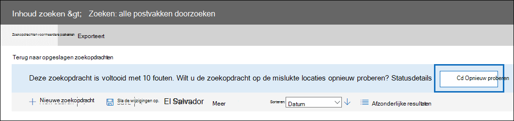

# <a name="retry-a-content-search-to-resolve-a-content-location-error"></a>Een inhoudszoekactie opnieuw proberen om een inhoudslocatiefout op te lossen

Wanneer u Inhoud zoeken in het beveiligings- en compliancecentrum gebruikt om een groot aantal postvakken te doorzoeken, kunt u zoekfouten krijgen die vergelijkbaar zijn met de fout:

```text
Error


The search on the following locations failed:

User1@contoso.com: Problem in processing the request. Please try again later. If you keep getting this error, contact your admin. (CS008-009)

User2@contoso.com: Application error occurred. Please try again later. (CS012-002)
```

Deze fouten (met foutcodes van CS001-002, CS003-002, CS008-009, CS012-002 en andere fouten van het formulier CS0XX-0XX) geven aan dat Inhoud zoeken niet naar specifieke inhoudslocaties kan zoeken; in dit voorbeeld zijn twee postvakken niet doorzocht. Deze fouten worden weergegeven op de flyoutpagina met statusdetails van de inhoudszoekactie.

## <a name="cause-of-content-location-errors"></a>Oorzaak van fouten in inhoudslocatie

Wanneer u een groot aantal postvakken zoekt, wordt de zoekopdracht verdeeld over duizenden servers in een Microsoft-datacenter. Op een bepaald moment kunnen specifieke servers opnieuw worden opgestart of worden overgeslagen naar redundante exemplaren. In een van deze gevallen wordt een time-out uitgevoerd van het verzoek van de inhoudszoekfunctie om gegevens op te halen. In het vorige voorbeeld zijn de fouten voor de postvakken die zijn mislukt, het resultaat van de zoektijd.

## <a name="resolving-content-location-errors"></a>Fouten met inhoudslocatie oplossen

Het opnieuw starten van de zoekopdracht resulteert vaak in soortgelijke fouten op verschillende servers. In plaats van de zoekopdracht  opnieuw te starten, klikt u op de knop Opnieuw proberen die boven aan de pagina met zoekresultaten wordt weergegeven.



Dit resulteert in het opnieuw zoeken naar alleen de postvakken die zijn mislukt. Wanneer u de zoekopdracht opnieuw uitwerkt, blijven de andere resultaten die zijn geretourneerd, behouden.

## <a name="tips-to-avoid-content-location-errors"></a>Tips om fouten met inhoudslocatie te voorkomen

Hier vindt u enkele extra oorzaken van fouten in inhoudslocatie en enkele tips om deze te voorkomen bij het zoeken naar grote aantallen postvakken.

- Het postvak dat wordt doorzocht, is mogelijk bezet vanwege gebruikersactiviteit. In dit geval beperkt de zoekservice zich mogelijk om te voorkomen dat het postvak niet beschikbaar wordt. Als u dit wilt voorkomen, kunt u zoekopdrachten uitvoeren tijdens niet-zakelijke uren.

- De zoekquery haalt mogelijk te veel inhoud op uit het postvak. Probeer indien mogelijk het bereik van de zoekopdracht te beperken met behulp van trefwoorden, datumbereiken en zoekvoorwaarden.

- Te veel trefwoorden of trefwoordzinnen wanneer u een zoekquery maakt met behulp van [de lijst met trefwoorden.](view-keyword-statistics-for-content-search.md#get-keyword-statistics-for-content-searches) Wanneer u een zoekquery uitvoert waarin de lijst met trefwoorden wordt gebruikt, wordt met de service in feite een afzonderlijke zoekopdracht uitgevoerd voor elke rij in de lijst met trefwoorden, zodat statistieken kunnen worden gegenereerd. Als u de lijst met trefwoorden gebruikt in zoekquery's, minimaliseert u het aantal rijen in de lijst met trefwoorden of verdeelt u het aantal trefwoorden in kleinere lijsten en maakt u een andere zoekopdracht voor elke lijst met trefwoorden.

  > [!NOTE]
  > Als u problemen wilt beperken die worden veroorzaakt door grote trefwoordlijsten, bent u nu beperkt tot maximaal 20 rijen in de trefwoordlijst van een zoekquery.

- Er worden te veel zoekopdrachten tegelijk uitgevoerd in hetzelfde postvak. Probeer indien mogelijk één zoekopdracht tegelijk uit te voeren op elk postvak.

- Te veel postvakken zoeken in één zoekopdracht. De kans op fouten in inhoudslocatie neemt toe bij het zoeken naar een groot aantal postvakken. Probeer indien mogelijk meerdere zoekopdrachten uit te voeren, zodat elke zoekopdracht een subset met postvakken in uw organisatie bevat.

- Vereist onderhoud wordt uitgevoerd in het postvak. Hoewel deze oorzaak waarschijnlijk zelden voorkomt, wacht u even na ontvangst van de inhoudslocatiefout en doet u de zoekopdracht opnieuw.
