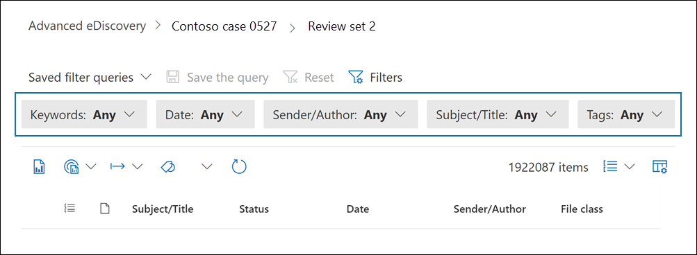
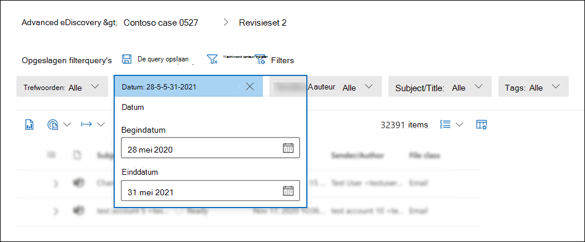
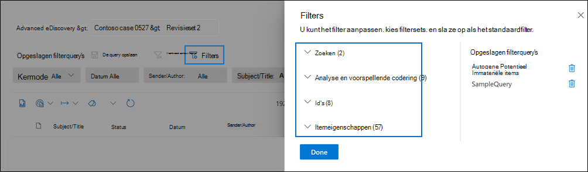
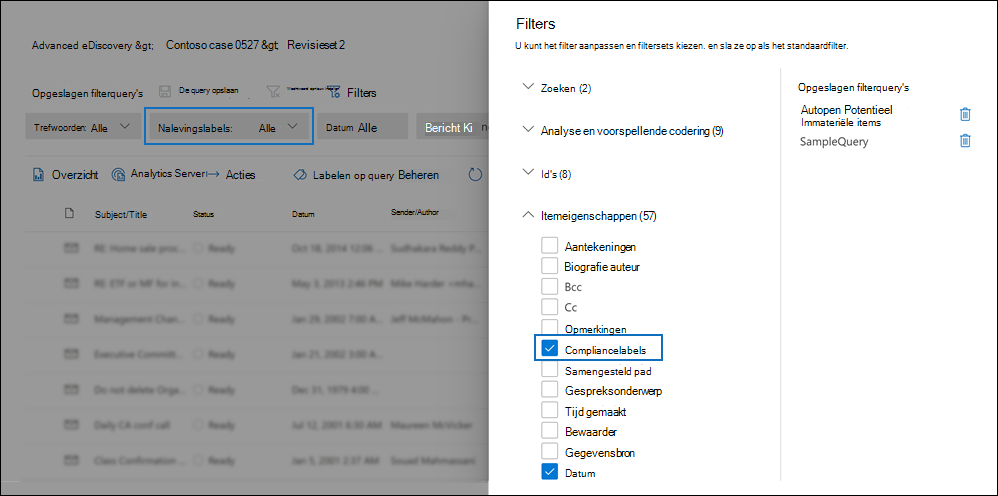
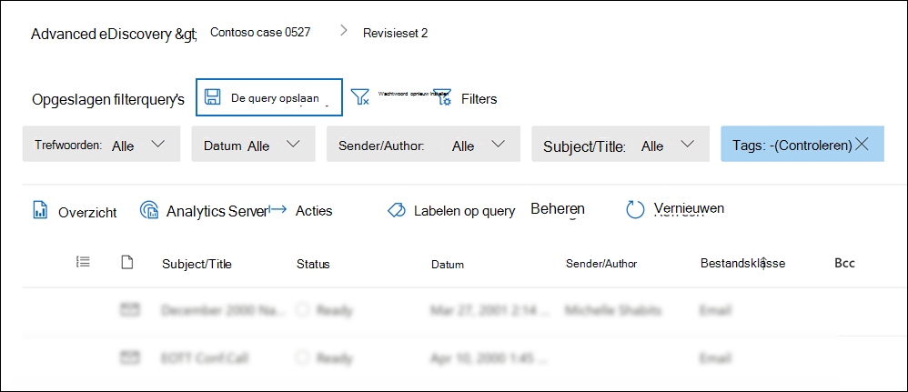
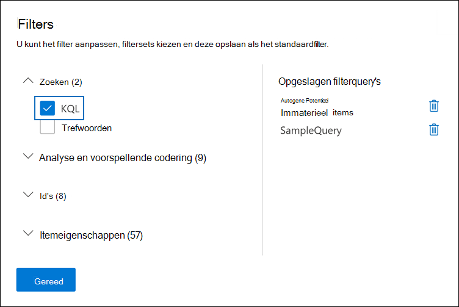

# Query- en filterinhoud in een controlesetQuery and filter content in a review set

In de meeste gevallen is het handig om dieper in te gaan op de inhoud in een revisieset en deze te organiseren om een efficiëntere controle te vergemakkelijken.In most cases, it will be useful to dig deeper into the content in a review set and organize it to facilitate a more efficient review. Als u filters en query's in een revisieset gebruikt, kunt u zich concentreren op een subset met documenten die voldoen aan de criteria van uw revisie.Using filters and queries in a review set helps you focus on a subset of documents that meet the criteria of your review.

## StandaardfiltersDefault filters

In een revisieset zijn er vijf standaardfilters die vooraf zijn geladen in de revisieset:In a review set, there are five default filters that are pre-loaded in the review set:

- TrefwoordenKeywords
- DatumDate
- Afzender/auteurSender/Author
- Onderwerp/titelSubject/Title
- TagsTags

Klik op elk filter om het uit te vouwen en een waarde toe te wijzen.Click each filter to expand it and assign a value. Klik buiten het filter om het filter automatisch toe te passen op de revisieset.Click outside the filter to automatically apply the filter to the review set. In de volgende schermafbeelding ziet u het datumfilter dat is geconfigureerd om documenten weer te geven binnen een datumbereik.The following screenshot shows the Date filter configured to show documents within a date range.

## Filters toevoegen of verwijderenAdd or remove filters

Als u filters wilt toevoegen of verwijderen die worden weergegeven voor de revisieset, selecteert u **Filters** om het filtervenster te openen, dat wordt weergegeven op een flyoutpagina.To add or remove filters that are displayed for the review set, select **Filters** to open the filter panel, which is displayed on a flyout page. 

De beschikbare filters zijn ingedeeld in vier secties:The available filters are organized in four sections:

- **Zoeken:** filters die verschillende zoekmogelijkheden bieden.**Search**: Filters that provide different search capabilities.

- **Analyse & voorspellende** codering: filters voor eigenschappen die worden gegenereerd  en toegevoegd aan documenten wanneer u de documentanalyse & of voorspellende coderingsmodellen gebruikt.**Analytics & predictive coding**: Filters for properties generated and added to documents when you run the **Document & email analytic** job or use predictive coding models.

- **Id's:** filtert voor alle id-eigenschappen van documenten.**IDs**: Filters for all ID properties of documents.

- **Itemeigenschappen:** Filters voor documenteigenschappen.**Item properties**: Filters for document properties. 

Vouw elke sectie uit en selecteer of deselecteer filters om ze toe te voegen of te verwijderen in de filterset.Expand each section and select or deselect filters to add or remove them in the filter set. Wanneer u een filter toevoegt, wordt dit weergegeven in de filterset.When you add a filter, it's displayed in the filter set. 

> [!NOTE]
> Wanneer u een sectie uitv vouwt in het filtervenster, ziet u dat de standaardfiltertypen zijn geselecteerd.When you expand a section in the filter panel, you'll notice that the default filter types are selected. U kunt deze geselecteerd houden of deselecteren en verwijderen uit de filterset.You can keep these selected or deselect them and removed them from the filter set. 

## FiltertypenFilter types

Elk doorzoekbaar veld in een revisieset heeft een bijbehorend filter dat u kunt gebruiken voor filteritems op basis van een specifiek veld.Every searchable field in a review set has a corresponding filter that you can use for filter items based on a specific field.

Er zijn meerdere typen filters:There are multiple types of filters:

- **Vrije tekst:** Er wordt een freetekstfilter toegepast op tekstvelden zoals 'Onderwerp'.**Freetext**: A freetext filter is applied to text fields such as "Subject". U kunt meerdere zoektermen op een lijst zetten door ze te scheiden met een komma.You can list multiple search terms by separating them with a comma.

- **Datum:** er wordt een datumfilter gebruikt voor datumvelden zoals 'Laatst gewijzigde datum'.**Date**: A date filter is used for date fields such as "Last modified date".

- **Zoekopties:** Een zoekoptiesfilter bevat een lijst met mogelijke waarden (elke waarde wordt weergegeven met een selectievakje dat u kunt selecteren) voor bepaalde velden in de revisie.**Search options**: A search options filter provides a list of possible values (each value is displayed with a checkbox that you can select) for particular fields in the review. Dit filter wordt gebruikt voor velden, zoals 'Afzender', waarbij er een beperkt aantal mogelijke waarden in de revisieset staat.This filter is used for fields, such as "Sender", where there is a finite number of possible values in the review set.

- **Trefwoord:** een trefwoordvoorwaarde is een specifiek exemplaar van een voorwaarde voor vrije tekst die u kunt gebruiken om te zoeken naar termen.**Keyword**: A keyword condition is a specific instance of freetext condition that you can use to search for terms. U kunt ook KQL-achtige querytaal gebruiken in dit type filter.You can also use KQL-like query language in this type of filter. Zie de secties Querytaal en Geavanceerde opbouwfunctie voor query's in dit onderwerp voor meer informatie.For more information, see the Query language and Advanced query builder sections in this topic.

## Filterrelaties opnemen en uitsluitenInclude and exclude filter relationships

U hebt de optie om de op te nemen en uit te sluiten relatie voor een bepaald filter.You have the option to change the include and exclude relationship for a particular filter. In het filter Label kunt u bijvoorbeeld items uitsluiten die met een bepaalde tag zijn gemarkeerd door Gelijk aan **geen** van in het vervolgkeuzefilter te selecteren.For example, in the Tag filter, you can exclude items that are tagged with a particular tag by selecting **Equals none of** in the dropdown filter. 

## Filters opslaan als query'sSave filters as queries

Nadat u tevreden bent over uw filters, kunt u de filtercombinatie opslaan als een filterquery.After you are satisfied with your filters, you can save the filter combination as a filter query. Hiermee kunt u het filter toepassen in de toekomstige revisiesessies.This lets you apply the filter in the future review sessions.

Als u een filter wilt opslaan, **selecteert u De query opslaan** en een naam geven.To save a filter, select **Save the query** and name it. U of andere revisoren kunnen eerder opgeslagen filterquery's uitvoeren door de vervolgkeuzekeuze van opgeslagen filterquery's te selecteren en een filterquery te selecteren die u wilt toepassen om de setdocumenten te controleren. You or other reviewers can run previously saved filter queries by selecting the **Saved filter queries** dropdown and selecting a filter query to apply to review set documents. 

Als u een filterquery wilt verwijderen, opent u het filtervenster en selecteert u het prullenbakpictogram naast de query.To delete a filter query, open the filter panel and select the trashcan icon next to the query.

## QuerytaalQuery language

Naast het gebruik van filters kunt u ook een KQL-achtige querytaal gebruiken in het filter Trefwoorden om de zoekquery voor revisiesets te maken.In addition to using filters, you can also use a KQL-like query language in the Keywords filter to build your review set search query. De querytaal voor revisiesetquery's ondersteunt standaard Booleaanse operatoren, zoals **EN**, **OF**, **NIET**, en **NEAR**.The query language for review set queries supports standard Boolean operators, such as **AND**, **OR**, **NOT**, and **NEAR**. Het ondersteunt ook een jokerteken met één teken (?) en een jokerteken met meerdere tekens (\*).It also supports a single-character wildcard (?) and a multi-character wildcard (\*).

## Geavanceerde opbouwfunctie voor query'sAdvanced query builder

U kunt ook geavanceerdere query's maken om documenten te zoeken in een revisieset.You can also build more advanced queries to search for documents in a review set.

1. Open het filtervenster, selecteer **Filters** en vouw de **sectie** Zoeken uit.Open the filter panel, select **Filters**, and expand the **Search** section.

  

2. Selecteer het **KQL-filter** en klik **op Opbouwfunctie voor query's openen.**Select the **KQL** filter and click **Open query builder**.

   In dit deelvenster kunt u complexe KQL-query's maken met behulp van de opbouwfunctie voor query's.In this panel, you can create complex KQL queries by using the query builder. U kunt voorwaarden toevoegen of voorwaardengroepen toevoegen die zijn opgebouwd uit meerdere voorwaarden die logisch zijn verbonden door **EN-** of **OF-relaties.**You can add conditions or add condition groups that are made up of multiple conditions that are logically connected by **AND** or **OR** relationships.

   
