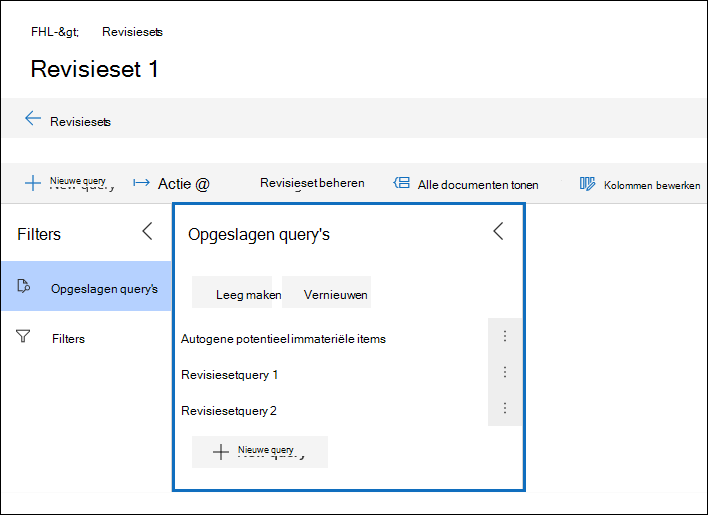
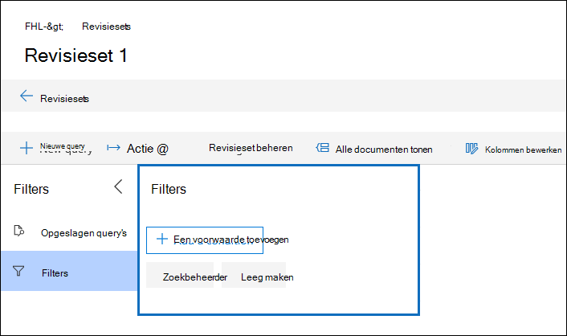

# Een query uitvoeren op de gegevens in een controleset

In de meeste gevallen is het handig om dieper in de gegevens in een revisieset te kunnen graven en deze gegevens te organiseren om een efficiëntere controle te vergemakkelijken. Als u query's in een revisieset gebruikt, kunt u zich concentreren op een subset met documenten die voldoen aan de criteria van uw beoordeling.

## Een query maken en uitvoeren in een revisieset

Als u een query wilt maken en uitvoeren op de documenten in een revisieset, **selecteert** u Nieuwe query in de revisieset. Nadat u de naam van de query hebt gegeven en de voorwaarden hebt bepaald, **selecteert** u Opslaan om de query op te slaan en uit te voeren. Als u een query wilt uitvoeren die eerder is opgeslagen, selecteert u een opgeslagen query.

## Een revisiesetquery maken

U kunt een query maken met behulp van een combinatie van trefwoorden, eigenschappen en voorwaarden in de voorwaarde Trefwoorden. U kunt voorwaarden ook groepen als een blok (een zogenaamde *voorwaardegroep)* om een complexere query te maken. Zie Metagegevensvelden in documenten in Advanced eDiscovery voor een lijst en beschrijving van metagegevenseigenschappen die [u kunt zoeken.](document-metadata-fields-in-Advanced-eDiscovery.md)

### Voorwaarden

Elk doorzoekbaar veld in een revisieset heeft een bijbehorende voorwaarde die u kunt gebruiken om de query te maken.

Er zijn meerdere typen voorwaarden:

- Vrije tekst: Een voorwaarde voor vrije tekst wordt gebruikt voor tekstvelden zoals onderwerp. U kunt meerdere zoektermen op een lijst zetten door ze te scheiden met een komma.

- Datum: Er wordt een datumvoorwaarde gebruikt voor datumvelden, zoals laatst gewijzigde datum.

- Zoekopties: Een voorwaarde voor zoekopties biedt een lijst met mogelijke waarden voor het specifieke veld in de revisieset. Dit wordt gebruikt voor velden, zoals afzender, waarbij er een eindig aantal mogelijke waarden in de revisieset staat.

- Trefwoord: Een trefwoordvoorwaarde is een specifiek exemplaar van een voorwaarde voor vrije tekst die u kunt gebruiken om te zoeken naar termen of om KQL-achtige querytaal te gebruiken. Zie hieronder voor meer informatie.

### Querytaal

Naast de voorwaarden kunt u een KQL-achtige querytaal in de voorwaarde Trefwoorden gebruiken om uw query te maken. De querytaal voor revisiesetquery's ondersteunt standaard Booleaanse operatoren, zoals **EN**, **OF**, **NIET**, en **NEAR**. Het ondersteunt ook een jokerteken met één teken (?) en een jokerteken met meerdere tekens (*).

## Filters

Naast query's die u kunt opslaan, kunt u filters voor revisiesets gebruiken om snel aanvullende voorwaarden toe te passen op een revisiesetquery. Met behulp van filters kunt u de resultaten van een query voor revisiesets verder verfijnen.

Filters verschillen op twee belangrijke manieren van query's:

- Filters zijn van tijdelijke aard. Ze blijven niet langer bestaan dan de bestaande sessie. Met andere woorden, u kunt een filter niet opslaan. Query's worden opgeslagen in de revisieset en worden geopend wanneer u de revisieset opent.

- Filters zijn altijd additief. Filters worden toegepast naast de huidige query voor revisiesets. Als u een andere query toepassen, worden de resultaten vervangen die door de huidige query worden geretourneerd.
