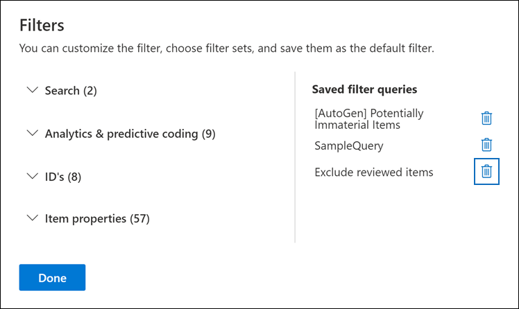

# Query- en filterinhoud in een controleset

In de meeste gevallen is het handig om dieper in te gaan op de inhoud in een revisieset en deze te organiseren om een efficiëntere controle te vergemakkelijken. Als u filters en query's in een revisieset gebruikt, kunt u zich concentreren op een subset met documenten die voldoen aan de criteria van uw revisie.

## Standaardfilters

In een revisieset zijn er vijf standaardfilters die vooraf zijn geladen in de revisieset:

- Trefwoorden
- Datum
- Afzender/auteur
- Onderwerp/titel
- Tags

Klik op elk filter om het uit te vouwen en een waarde toe te wijzen. Klik buiten het filter om het filter automatisch toe te passen op de revisieset. In de volgende schermafbeelding ziet u het datumfilter dat is geconfigureerd om documenten weer te geven binnen een datumbereik.

## Filters toevoegen of verwijderen

Als u filters wilt toevoegen of verwijderen die worden weergegeven voor de revisieset, selecteert u **Filters** om het filtervenster te openen, dat wordt weergegeven op een flyoutpagina. 

De beschikbare filters zijn ingedeeld in vier secties:

- **Zoeken:** filters die verschillende zoekmogelijkheden bieden.

- **Analyse & voorspellende** codering: filters voor eigenschappen die worden gegenereerd  en toegevoegd aan documenten wanneer u de documentanalyse & of voorspellende coderingsmodellen gebruikt.

- **Id's:** filtert voor alle id-eigenschappen van documenten.

- **Itemeigenschappen:** Filters voor documenteigenschappen. 

Vouw elke sectie uit en selecteer of deselecteer filters om ze toe te voegen of te verwijderen in de filterset. Wanneer u een filter toevoegt, wordt dit weergegeven in de filterset. 

> [!NOTE]
> Wanneer u een sectie uitv vouwt in het filtervenster, ziet u dat de standaardfiltertypen zijn geselecteerd. U kunt deze geselecteerd houden of deselecteren en verwijderen uit de filterset. 

## Filtertypen

Elk doorzoekbaar veld in een revisieset heeft een bijbehorend filter dat u kunt gebruiken voor filteritems op basis van een specifiek veld.

Er zijn meerdere typen filters:

- **Vrije tekst:** Er wordt een freetekstfilter toegepast op tekstvelden zoals 'Onderwerp'. U kunt meerdere zoektermen op een lijst zetten door ze te scheiden met een komma.

- **Datum:** er wordt een datumfilter gebruikt voor datumvelden zoals 'Laatst gewijzigde datum'.

- **Zoekopties:** Een zoekoptiesfilter bevat een lijst met mogelijke waarden (elke waarde wordt weergegeven met een selectievakje dat u kunt selecteren) voor bepaalde velden in de revisie. Dit filter wordt gebruikt voor velden, zoals 'Afzender', waarbij er een beperkt aantal mogelijke waarden in de revisieset staat.

- **Trefwoord:** een trefwoordvoorwaarde is een specifiek exemplaar van een voorwaarde voor vrije tekst die u kunt gebruiken om te zoeken naar termen. U kunt ook KQL-achtige querytaal gebruiken in dit type filter. Zie de secties Querytaal en Geavanceerde opbouwfunctie voor query's in dit onderwerp voor meer informatie.

## Filterrelaties opnemen en uitsluiten

U hebt de optie om de op te nemen en uit te sluiten relatie voor een bepaald filter. In het filter Label kunt u bijvoorbeeld items uitsluiten die met een bepaalde tag zijn gemarkeerd door Gelijk aan **geen** van in het vervolgkeuzefilter te selecteren. 

## Filters opslaan als query's

Nadat u tevreden bent over uw filters, kunt u de filtercombinatie opslaan als een filterquery. Hiermee kunt u het filter toepassen in de toekomstige revisiesessies.

Als u een filter wilt opslaan, **selecteert u De query opslaan** en een naam geven. U of andere revisoren kunnen eerder opgeslagen filterquery's uitvoeren door de vervolgkeuzekeuze van opgeslagen filterquery's te selecteren en een filterquery te selecteren die u wilt toepassen om de setdocumenten te controleren.  

Als u een filterquery wilt verwijderen, opent u het filtervenster en selecteert u het prullenbakpictogram naast de query.

## Querytaal

Naast het gebruik van filters kunt u ook een KQL-achtige querytaal gebruiken in het filter Trefwoorden om de zoekquery voor revisiesets te maken. De querytaal voor revisiesetquery's ondersteunt standaard Booleaanse operatoren, zoals **EN**, **OF**, **NIET**, en **NEAR**. Het ondersteunt ook een jokerteken met één teken (?) en een jokerteken met meerdere tekens (*).

## Geavanceerde opbouwfunctie voor query's

U kunt ook geavanceerdere query's maken om documenten te zoeken in een revisieset.

1. Open het filtervenster, selecteer **Filters** en vouw de **sectie** Zoeken uit.

  

2. Selecteer het **KQL-filter** en klik **op Opbouwfunctie voor query's openen.**

   In dit deelvenster kunt u complexe KQL-query's maken met behulp van de opbouwfunctie voor query's. U kunt voorwaarden toevoegen of voorwaardengroepen toevoegen die zijn opgebouwd uit meerdere voorwaarden die logisch zijn verbonden door **EN-** of **OF-relaties.**

   
