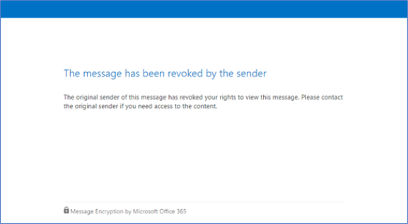

# <a name="revoke-email-encrypted-by-advanced-message-encryption"></a><span data-ttu-id="61b40-103">E-mail intrekken die is versleuteld met geavanceerde berichtversleuteling</span><span class="sxs-lookup"><span data-stu-id="61b40-103">Revoke email encrypted by Advanced Message Encryption</span></span>

<span data-ttu-id="61b40-104">E-mailte intrekken wordt aangeboden als onderdeel van Office 365 Advanced Message Encryption.</span><span class="sxs-lookup"><span data-stu-id="61b40-104">Email revocation is offered as part of Office 365 Advanced Message Encryption.</span></span> <span data-ttu-id="61b40-105">Office 365 Advanced Message Encryption is opgenomen in [Microsoft 365 Enterprise E5,](https://www.microsoft.com/microsoft-365/enterprise/home)Office 365 E5, Microsoft 365 E5 (Nonprofit Staff Pricing), Office 365 Enterprise E5 (Nonprofit Staff Pricing) en Office 365 Education A5.</span><span class="sxs-lookup"><span data-stu-id="61b40-105">Office 365 Advanced Message Encryption is included in [Microsoft 365 Enterprise E5](https://www.microsoft.com/microsoft-365/enterprise/home), Office 365 E5, Microsoft 365 E5 (Nonprofit Staff Pricing), Office 365 Enterprise E5 (Nonprofit Staff Pricing), and Office 365 Education A5.</span></span> <span data-ttu-id="61b40-106">Als uw organisatie een abonnement heeft dat geen Office 365 Advanced Message Encryption bevat, kunt u dit kopen met de Microsoft 365 E5 Compliance SKU-invoegactie voor Microsoft 365 E3, Microsoft 365 E3 (Nonprofit Staff Pricing) of de Office 365 Advanced Compliance SKU-invoegactie voor Microsoft 365 E3, Microsoft 365 E3 (Non-profitmedewerkersprijzen) of Office 365 SKU's.</span><span class="sxs-lookup"><span data-stu-id="61b40-106">If your organization has a subscription that does not include Office 365 Advanced Message Encryption, you can purchase it with the Microsoft 365 E5 Compliance SKU add-on for Microsoft 365 E3, Microsoft 365 E3 (Nonprofit Staff Pricing), or the Office 365 Advanced Compliance SKU add-on for Microsoft 365 E3, Microsoft 365 E3 (Nonprofit Staff Pricing), or Office 365 SKUs.</span></span>

<span data-ttu-id="61b40-107">Dit artikel maakt deel uit van een grotere reeks artikelen over [Office 365-berichtversleuteling.](ome.md)</span><span class="sxs-lookup"><span data-stu-id="61b40-107">This article is part of a larger series of articles about [Office 365 Message Encryption](ome.md).</span></span>

<span data-ttu-id="61b40-108">Als een bericht is versleuteld met Office 365 Advanced Message Encryption en u een Microsoft 365-beheerder bent of als u de afzender van het bericht bent, kunt u het bericht onder bepaalde voorwaarden intrekken.</span><span class="sxs-lookup"><span data-stu-id="61b40-108">If a message was encrypted using Office 365 Advanced Message Encryption, and you are a Microsoft 365 admin or you are the sender of the message, you can revoke the message under certain conditions.</span></span> <span data-ttu-id="61b40-109">Beheerders trekken berichten in met PowerShell.</span><span class="sxs-lookup"><span data-stu-id="61b40-109">Admins revoke messages using PowerShell.</span></span> <span data-ttu-id="61b40-110">Als afzender trekt u een bericht in dat u rechtstreeks vanuit Outlook op internet hebt verzonden.</span><span class="sxs-lookup"><span data-stu-id="61b40-110">As a sender, you revoke a message that you sent directly from Outlook on the web.</span></span> <span data-ttu-id="61b40-111">In dit artikel worden de omstandigheden beschreven waaronder intrekking mogelijk is en hoe u dit kunt doen.</span><span class="sxs-lookup"><span data-stu-id="61b40-111">This article describes the circumstances under which revocation is possible and how to do it.</span></span>
  
## <a name="encrypted-emails-that-you-can-revoke"></a><span data-ttu-id="61b40-112">Versleutelde e-mailberichten die u kunt intrekken</span><span class="sxs-lookup"><span data-stu-id="61b40-112">Encrypted emails that you can revoke</span></span>

<span data-ttu-id="61b40-113">Beheerders en afzenders van berichten kunnen versleutelde e-mailberichten intrekken als de geadresseerde een versleutelde e-mail met een koppeling heeft ontvangen.</span><span class="sxs-lookup"><span data-stu-id="61b40-113">Admins and message senders can revoke encrypted emails if the recipient received a link-based, branded encrypted email.</span></span> <span data-ttu-id="61b40-114">Als de geadresseerde een native inline-ervaring heeft ontvangen in een ondersteunde Outlook client, kunt u het bericht niet intrekken.</span><span class="sxs-lookup"><span data-stu-id="61b40-114">If the recipient received a native inline experience in a supported Outlook client, then you can't revoke the message.</span></span>

<span data-ttu-id="61b40-115">Of een geadresseerde een koppelingservaring of een inline-ervaring ontvangt, is afhankelijk van het identiteitstype van de geadresseerde: Office 365- en Microsoft-accountontvangers (bijvoorbeeld outlook.com-gebruikers) krijgen een inline-ervaring in ondersteunde Outlook-clients.</span><span class="sxs-lookup"><span data-stu-id="61b40-115">Whether a recipient receives a link-based experience or an inline experience depends on the recipient identity type: Office 365 and Microsoft account recipients (for example, outlook.com users) get an inline experience in supported Outlook clients.</span></span> <span data-ttu-id="61b40-116">Alle andere typen geadresseerden, zoals Gmail- en Yahoo-geadresseerden, krijgen een op koppeling gebaseerde ervaring.</span><span class="sxs-lookup"><span data-stu-id="61b40-116">All other recipient types, such as Gmail and Yahoo recipients, get a link-based experience.</span></span>

<span data-ttu-id="61b40-117">Beheerders en afzenders van berichten kunnen berichten intrekken die zijn versleuteld met behulp van versleuteling die rechtstreeks vanaf Outlook op internet wordt toegepast.</span><span class="sxs-lookup"><span data-stu-id="61b40-117">Admins and message senders can revoke messages that are encrypted using encryption applied directly from Outlook on the web.</span></span> <span data-ttu-id="61b40-118">Bijvoorbeeld berichten die zijn versleuteld met de optie Alleen versleutelen.</span><span class="sxs-lookup"><span data-stu-id="61b40-118">For example, messages encrypted with the Encrypt Only option.</span></span>

:::image type="content" source="../media/adhocencryptionrevoke.png" alt-text="Schermafbeelding met de optie Alleen versleutelen in Outlook web.":::

## <a name="recipient-experience-for-revoked-encrypted-emails"></a><span data-ttu-id="61b40-120">Gebruikerservaring voor ingetrokken versleutelde e-mailberichten</span><span class="sxs-lookup"><span data-stu-id="61b40-120">Recipient experience for revoked encrypted emails</span></span>

<span data-ttu-id="61b40-121">Wanneer een e-mailbericht is ingetrokken, ontvangt de geadresseerde een foutmelding wanneer deze toegang heeft tot de versleutelde e-mail via de Office 365-berichtversleuteling-portal: 'Het bericht is ingetrokken door de afzender'.</span><span class="sxs-lookup"><span data-stu-id="61b40-121">Once an email has been revoked, the recipient receives an error when they access the encrypted email through the Office 365 Message Encryption portal: "The message has been revoked by the sender".</span></span>



## <a name="how-to-revoke-an-encrypted-message-that-you-sent"></a><span data-ttu-id="61b40-123">Een versleuteld bericht dat u hebt verzonden intrekken</span><span class="sxs-lookup"><span data-stu-id="61b40-123">How to revoke an encrypted message that you sent</span></span>

<span data-ttu-id="61b40-124">U kunt een e-mail intrekken die u hebt verzonden naar één geadresseerde die een sociaal account gebruikt, zoals gmail.com of yahoo.com.</span><span class="sxs-lookup"><span data-stu-id="61b40-124">You can revoke a mail that you sent to a single recipient that uses a social account such as gmail.com or yahoo.com.</span></span> <span data-ttu-id="61b40-125">Met andere woorden, u kunt een e-mailbericht intrekken dat is verzonden naar één geadresseerde die de koppelingservaring heeft ontvangen.</span><span class="sxs-lookup"><span data-stu-id="61b40-125">In other words, you can revoke an email sent to a single recipient that received the link-based experience.</span></span>

<span data-ttu-id="61b40-126">U kunt geen e-mail intrekken die u hebt verzonden naar een geadresseerde die een werk- of schoolaccount gebruikt van Office 365 of Microsoft 365 of een gebruiker die een Microsoft-account gebruikt, bijvoorbeeld een outlook.com-account.</span><span class="sxs-lookup"><span data-stu-id="61b40-126">You cannot revoke a mail that you sent to a recipient that uses a work or school account from Office 365 or Microsoft 365 or a user that uses a Microsoft account, for example, an outlook.com account.</span></span> 

<span data-ttu-id="61b40-127">Als u een versleuteld bericht dat u hebt verzonden, wilt intrekken, moet u deze stappen voltooien</span><span class="sxs-lookup"><span data-stu-id="61b40-127">To revoke an encrypted message that you sent, complete these steps</span></span>

1. <span data-ttu-id="61b40-128">Blader Outlook op internet in **de** map Verzonden naar het bericht dat u wilt intrekken.</span><span class="sxs-lookup"><span data-stu-id="61b40-128">In Outlook on the web, in your **Sent** folder, browse to the message you want to revoke.</span></span>

   <span data-ttu-id="61b40-129">Als de e-mail kan worden herkeerbaar, ziet u de koppeling Externe toegang verwijderen boven aan het bericht.</span><span class="sxs-lookup"><span data-stu-id="61b40-129">If the mail is revocable, you'll see the "Remove external access" link at the top of the message.</span></span>

    :::image type="content" source="../media/infoprotect-email-encryption/adhocencryptionrevokesentmsg.png" alt-text="Schermafbeelding met versleutelde e-mail die u wilt intrekken in Outlook web.":::

2. <span data-ttu-id="61b40-131">Klik **op Externe toegang verwijderen om** het bericht in te trekken.</span><span class="sxs-lookup"><span data-stu-id="61b40-131">Click **Remove external access** to revoke the message.</span></span>

   <span data-ttu-id="61b40-132">In het bericht wordt weergegeven dat de status ervan is ingetrokken.</span><span class="sxs-lookup"><span data-stu-id="61b40-132">The message shows that its status is revoked.</span></span>

   :::image type="content" source="../media/adhocencryptionrevokedmsg.png" alt-text="Schermafbeelding met ingetrokken versleuteld bericht in Outlook web.":::

## <a name="how-to-revoke-an-encrypted-message-as-an-administrator"></a><span data-ttu-id="61b40-134">Een versleuteld bericht intrekken als beheerder</span><span class="sxs-lookup"><span data-stu-id="61b40-134">How to revoke an encrypted message as an administrator</span></span>

<span data-ttu-id="61b40-135">Microsoft 365 beheerders volgen deze algemene stappen om een in aanmerking komende versleutelde e-mail in te trekken:</span><span class="sxs-lookup"><span data-stu-id="61b40-135">Microsoft 365 administrators follow these general steps to revoke an eligible encrypted email:</span></span>

- <span data-ttu-id="61b40-136">Ontvang de bericht-id van het e-mailbericht.</span><span class="sxs-lookup"><span data-stu-id="61b40-136">Get the Message ID of the email.</span></span>
- <span data-ttu-id="61b40-137">Controleer of u het bericht kunt intrekken.</span><span class="sxs-lookup"><span data-stu-id="61b40-137">Verify that you can revoke the message.</span></span>
- <span data-ttu-id="61b40-138">De e-mail intrekken.</span><span class="sxs-lookup"><span data-stu-id="61b40-138">Revoke the mail.</span></span>

### <a name="step-1-obtain-the-message-id-of-the-email"></a><span data-ttu-id="61b40-139">Stap 1.</span><span class="sxs-lookup"><span data-stu-id="61b40-139">Step 1.</span></span> <span data-ttu-id="61b40-140">De bericht-id van het e-mailbericht verkrijgen</span><span class="sxs-lookup"><span data-stu-id="61b40-140">Obtain the Message ID of the email</span></span>

<span data-ttu-id="61b40-141">Voordat u een versleutelde e-mail kunt intrekken, verzamelt u de bericht-id van de e-mail.</span><span class="sxs-lookup"><span data-stu-id="61b40-141">Before you can revoke an encrypted mail, gather the Message ID of the mail.</span></span> <span data-ttu-id="61b40-142">De MessageId heeft meestal de notatie:</span><span class="sxs-lookup"><span data-stu-id="61b40-142">The MessageId is usually of the format:</span></span>

`<xxxxxxxxxxxxxxxxxxxxxxx@xxxxxx.xxxx.prod.outlook.com>`  

<span data-ttu-id="61b40-143">Er zijn meerdere manieren om de bericht-id te vinden van het e-mailbericht dat u wilt intrekken.</span><span class="sxs-lookup"><span data-stu-id="61b40-143">There are multiple ways to find the Message ID of the email that you want to revoke.</span></span> <span data-ttu-id="61b40-144">In deze sectie worden een aantal opties beschreven, maar u kunt elke methode gebruiken die de id bevat.</span><span class="sxs-lookup"><span data-stu-id="61b40-144">This section describes a couple of options, but you can use any method that provides the ID.</span></span>

#### <a name="to-identify-the-message-id-of-the-email-you-want-to-revoke-by-using-message-trace-in-the-security-amp-compliance-center"></a><span data-ttu-id="61b40-145">De bericht-id van de e-mail die u wilt intrekken identificeren met Behulp van Bericht traceren in het Beveiligings &amp; compliancecentrum</span><span class="sxs-lookup"><span data-stu-id="61b40-145">To identify the Message ID of the email you want to revoke by using Message Trace in the Security &amp; Compliance Center</span></span>

1. <span data-ttu-id="61b40-146">Zoek naar de e-mail per afzender of geadresseerde met [behulp van Nieuwe bericht traceren in & Compliance center](https://blogs.technet.microsoft.com/exchange/2018/05/02/new-message-trace-in-office-365-security-compliance-center/).</span><span class="sxs-lookup"><span data-stu-id="61b40-146">Search for the email by sender or recipient using [New Message Trace in Security & Compliance Center](https://blogs.technet.microsoft.com/exchange/2018/05/02/new-message-trace-in-office-365-security-compliance-center/).</span></span>

2. <span data-ttu-id="61b40-147">Wanneer u de e-mail hebt gevonden, selecteert u deze om het detailvenster **Bericht traceren weer te** geven.</span><span class="sxs-lookup"><span data-stu-id="61b40-147">Once you've located the email, select it to bring up the **Message trace details** pane.</span></span> <span data-ttu-id="61b40-148">Vouw **Meer informatie uit om** de bericht-id te zoeken.</span><span class="sxs-lookup"><span data-stu-id="61b40-148">Expand **More Information** to locate the Message ID.</span></span>

#### <a name="to-identify-the-message-id-of-the-email-you-want-to-revoke-by-using-office-message-encryption-reports-in-the-security-amp-compliance-center"></a><span data-ttu-id="61b40-149">De bericht-id identificeren van de e-mail die u wilt intrekken met behulp Office berichtenversleutelingsrapporten in het Beveiligings &amp; compliancecentrum</span><span class="sxs-lookup"><span data-stu-id="61b40-149">To identify the Message ID of the email you want to revoke by using Office Message Encryption reports in the Security &amp; Compliance Center</span></span>

1. <span data-ttu-id="61b40-150">Ga in het &amp; Beveiligings compliancecentrum naar het **rapport Berichtversleuteling.**</span><span class="sxs-lookup"><span data-stu-id="61b40-150">In the Security &amp; Compliance Center, navigate to the **Message encryption report**.</span></span> <span data-ttu-id="61b40-151">Zie E-mailbeveiligingsrapporten weergeven in het Beveiligings compliancecentrum voor meer informatie over dit [ &amp; rapport.](../security/defender-365-security/view-email-security-reports.md)</span><span class="sxs-lookup"><span data-stu-id="61b40-151">For information on this report, see [View email security reports in the Security &amp; Compliance Center](../security/defender-365-security/view-email-security-reports.md).</span></span>

2. <span data-ttu-id="61b40-152">Kies de **tabel Details weergeven** en identificeer het bericht dat u wilt intrekken.</span><span class="sxs-lookup"><span data-stu-id="61b40-152">Choose the **View details** table and identify the message that you want to revoke.</span></span>

3. <span data-ttu-id="61b40-153">Dubbelklik op het bericht om details weer te geven die de bericht-id bevatten.</span><span class="sxs-lookup"><span data-stu-id="61b40-153">Double-click the message to view details that include the Message ID.</span></span>

### <a name="step-2-verify-that-the-mail-is-revocable"></a><span data-ttu-id="61b40-154">Stap 2.</span><span class="sxs-lookup"><span data-stu-id="61b40-154">Step 2.</span></span> <span data-ttu-id="61b40-155">Controleren of de e-mail kan worden herkeerbaar</span><span class="sxs-lookup"><span data-stu-id="61b40-155">Verify that the mail is revocable</span></span>

<span data-ttu-id="61b40-156">Als u wilt controleren of u een bericht kunt intrekken, controleert u of het veld Intrekkingsstatus zichtbaar is in het rapport Versleuteling in de tabel **Details** in het Beveiligings &amp; compliancecentrum.</span><span class="sxs-lookup"><span data-stu-id="61b40-156">To verify whether you can revoke a message, check whether the Revocation Status field is visible in the Encryption report, in the **Details** table in the Security &amp; Compliance Center.</span></span>

<span data-ttu-id="61b40-157">Als u wilt controleren of u een bepaald e-mailbericht kunt intrekken met Windows PowerShell, moet u deze stappen voltooien.</span><span class="sxs-lookup"><span data-stu-id="61b40-157">To verify whether you can revoke a particular email message by using Windows PowerShell, complete these steps.</span></span>

1. <span data-ttu-id="61b40-158">Als u een werk- of schoolaccount gebruikt met globale beheerdersmachtigingen in uw organisatie, start u een Windows PowerShell en maakt u verbinding met Exchange Online.</span><span class="sxs-lookup"><span data-stu-id="61b40-158">Using a work or school account that has global administrator permissions in your organization, start a Windows PowerShell session and connect to Exchange Online.</span></span> <span data-ttu-id="61b40-159">Zie [Connect to Exchange Online PowerShell](/powershell/exchange/connect-to-exchange-online-powershell) (Verbinding maken met Exchange Online PowerShell) voor instructies.</span><span class="sxs-lookup"><span data-stu-id="61b40-159">For instructions, see [Connect to Exchange Online PowerShell](/powershell/exchange/connect-to-exchange-online-powershell).</span></span>

2. <span data-ttu-id="61b40-160">Voer de Get-OMEMessageStatus als volgt uit:</span><span class="sxs-lookup"><span data-stu-id="61b40-160">Run the Get-OMEMessageStatus cmdlet as follows:</span></span>

     ```powershell
     Get-OMEMessageStatus -MessageId "<message id>" | ft -a  Subject, IsRevocable
     ```

   <span data-ttu-id="61b40-161">Deze opdracht retourneert het onderwerp van het bericht en of het bericht kan worden herkeerbaar.</span><span class="sxs-lookup"><span data-stu-id="61b40-161">This command returns the subject of the message and whether the message is revocable.</span></span> <span data-ttu-id="61b40-162">Bijvoorbeeld:</span><span class="sxs-lookup"><span data-stu-id="61b40-162">For example,</span></span>

     ```console
     Subject        IsRevocable
     -------        -----------
     "Test message" True
     ```

### <a name="step-3-revoke-the-mail"></a><span data-ttu-id="61b40-163">Stap 3.</span><span class="sxs-lookup"><span data-stu-id="61b40-163">Step 3.</span></span> <span data-ttu-id="61b40-164">De e-mail intrekken</span><span class="sxs-lookup"><span data-stu-id="61b40-164">Revoke the mail</span></span>

<span data-ttu-id="61b40-165">Zodra u de bericht-id van de e-mail kent die u wilt intrekken en u hebt geverifieerd dat het bericht kan worden herroepen, kunt u de e-mail intrekken met behulp van het Beveiligings compliancecentrum of &amp; Windows PowerShell.</span><span class="sxs-lookup"><span data-stu-id="61b40-165">Once you know the Message ID of the email you want to revoke, and you have verified that the message is revocable, you can revoke the email using the Security &amp; Compliance Center or Windows PowerShell.</span></span>

<span data-ttu-id="61b40-166">Het bericht intrekken via het Beveiligings &amp; compliancecentrum</span><span class="sxs-lookup"><span data-stu-id="61b40-166">To revoke the message using the Security &amp; Compliance Center</span></span>

1. <span data-ttu-id="61b40-167">Maak met een werk- of schoolaccount met globale beheerdersmachtigingen in uw organisatie verbinding met het beveiligings- & Compliancecentrum.</span><span class="sxs-lookup"><span data-stu-id="61b40-167">Using a work or school account that has global administrator permissions in your organization, connect to the Security & Compliance Center.</span></span>

2. <span data-ttu-id="61b40-168">Kies in **het versleutelingsrapport** in **de tabel Details** voor het bericht de optie Bericht **intrekken.**</span><span class="sxs-lookup"><span data-stu-id="61b40-168">In the **Encryption report**, in the **Details** table for the message, choose **Revoke message**.</span></span>

<span data-ttu-id="61b40-169">Als u een e-mail wilt intrekken met Windows PowerShell, gebruikt u Set-OMEMessageRevocation cmdlet.</span><span class="sxs-lookup"><span data-stu-id="61b40-169">To revoke an email by using Windows PowerShell, use the Set-OMEMessageRevocation cmdlet.</span></span>

1. <span data-ttu-id="61b40-170">Gebruik een werk- of schoolaccount met globale beheerdersmachtigingen in uw organisatie en Verbinding maken [powershell Exchange Online gebruiken.](/powershell/exchange/connect-to-exchange-online-powershell)</span><span class="sxs-lookup"><span data-stu-id="61b40-170">Using a work or school account that has global administrator permissions in your organization, [Connect to Exchange Online PowerShell](/powershell/exchange/connect-to-exchange-online-powershell).</span></span>

2. <span data-ttu-id="61b40-171">Voer de Set-OMEMessageRevocation als volgt uit:</span><span class="sxs-lookup"><span data-stu-id="61b40-171">Run the Set-OMEMessageRevocation cmdlet as follows:</span></span>

    ```powershell
    Set-OMEMessageRevocation -Revoke $true -MessageId "<messageId>"
    ```

3. <span data-ttu-id="61b40-172">Als u wilt controleren of de e-mail is ingetrokken, Get-OMEMessageStatus de cmdlet als volgt uit:</span><span class="sxs-lookup"><span data-stu-id="61b40-172">To check whether the email was revoked, run the Get-OMEMessageStatus cmdlet as follows:</span></span>

    ```powershell
    Get-OMEMessageStatus -MessageId "<messageId>" | ft -a  Subject, Revoked
    ```

    <span data-ttu-id="61b40-173">Als intrekking is gelukt, geeft de cmdlet het volgende resultaat:</span><span class="sxs-lookup"><span data-stu-id="61b40-173">If revocation was successful, the cmdlet returns the following result:</span></span>  

     ```console
     Revoked: True
     ```

## <a name="more-information-about-office-365-advanced-message-encryption"></a><span data-ttu-id="61b40-174">Meer informatie over Office 365 Advanced Message Encryption</span><span class="sxs-lookup"><span data-stu-id="61b40-174">More information about Office 365 Advanced Message Encryption</span></span>

- [<span data-ttu-id="61b40-175">Office 365 Advanced Message Encryption</span><span class="sxs-lookup"><span data-stu-id="61b40-175">Office 365 Advanced Message Encryption</span></span>](ome-advanced-message-encryption.md)

- [<span data-ttu-id="61b40-176">Office 365 Advanced Message Encryption - e-mailverloop</span><span class="sxs-lookup"><span data-stu-id="61b40-176">Office 365 Advanced Message Encryption - email expiration</span></span>](ome-advanced-expiration.md)

- [<span data-ttu-id="61b40-177">Beschrijving van berichtbeleid en complianceservice</span><span class="sxs-lookup"><span data-stu-id="61b40-177">Message policy and compliance service description</span></span>](/office365/servicedescriptions/exchange-online-service-description/message-policy-and-compliance)