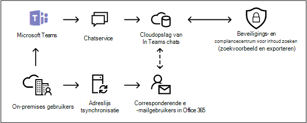

# <a name="search-for-teams-chat-data-for-on-premises-users"></a><span data-ttu-id="bc3b3-103">Chatgegevens voor Teams zoeken voor on-premises gebruikers</span><span class="sxs-lookup"><span data-stu-id="bc3b3-103">Search for Teams chat data for on-premises users</span></span>

<span data-ttu-id="bc3b3-104">Als uw organisatie een hybride implementatie van Exchange heeft (of als uw organisatie een on-premises Exchange-organisatie synchroniseert met Office 365) en Microsoft Teams heeft ingeschakeld, kunnen on-premises gebruikers de chattoepassing Teams gebruiken voor chatberichten.</span><span class="sxs-lookup"><span data-stu-id="bc3b3-104">If your organization has an Exchange hybrid deployment (or your organization synchronizes an on-premises Exchange organization with Office 365) and has enabled Microsoft Teams, on-premises users can use the Teams chat application for instant messaging.</span></span> <span data-ttu-id="bc3b3-105">Voor een gebruiker in de cloud worden de chatgegevens van Teams (ook wel *1x1- of 1xN-chats* genoemd) opgeslagen in hun primaire postvak in de cloud.</span><span class="sxs-lookup"><span data-stu-id="bc3b3-105">For a cloud-based user, Teams chat data (also called *1x1 or 1xN chats*) is saved to their primary cloud-based mailbox.</span></span> <span data-ttu-id="bc3b3-106">Wanneer een on-premises gebruiker gebruikmaakt van de chattoepassing Teams, kunnen de chatberichten niet worden opgeslagen in het primaire postvak, dat zich on-premises bevindt.</span><span class="sxs-lookup"><span data-stu-id="bc3b3-106">When an on-premises user uses the Teams chat application, their chat messages can't be stored in their primary mailbox, which is located on-premises.</span></span> <span data-ttu-id="bc3b3-107">Om deze beperking te omzeilen, heeft Microsoft een nieuwe functie uitgebracht waarin een opslaggebied in de cloud wordt gemaakt, zodat u eDiscovery-hulpprogramma's kunt gebruiken om chatgegevens van Teams te zoeken en exporteren voor on-premises gebruikers.</span><span class="sxs-lookup"><span data-stu-id="bc3b3-107">To get around this limitation, Microsoft has released a new feature where a cloud-based storage area is created so that you use eDiscovery tools to search for and export Teams chat data for on-premises users.</span></span>
  
<span data-ttu-id="bc3b3-108">Dit zijn de vereisten en beperkingen voor het inschakelen van opslag in de cloud voor on-premises gebruikers:</span><span class="sxs-lookup"><span data-stu-id="bc3b3-108">Here are the requirements and limitations for enabling cloud-based storage for on-premises users:</span></span>
  
- <span data-ttu-id="bc3b3-109">De gebruikersaccounts in uw on-premises adreslijstservice (zoals Active Directory) moeten worden gesynchroniseerd met Azure Active Directory, de adreslijstservice in Microsoft 365.</span><span class="sxs-lookup"><span data-stu-id="bc3b3-109">The user accounts in your on-premises directory service (such as Active Directory) must be synchronized with Azure Active Directory, the directory service in Microsoft 365.</span></span> <span data-ttu-id="bc3b3-110">Dit betekent dat er een e-mailgebruikersaccount wordt gemaakt in Microsoft 365 en is gekoppeld aan een gebruiker waarvan het primaire postvak zich in de on-premises organisatie bevindt.</span><span class="sxs-lookup"><span data-stu-id="bc3b3-110">This means that a mail user account is created in Microsoft 365 and is associated with a user whose primary mailbox is located in the on-premises organization.</span></span>

- <span data-ttu-id="bc3b3-111">Aan de gebruiker waarvan het primaire postvak zich in de on-premises organisatie bevindt, moet een licentie voor Microsoft Teams en minimaal een licentie voor Exchange Online Abonnement 1 worden toegewezen.</span><span class="sxs-lookup"><span data-stu-id="bc3b3-111">The user whose primary mailbox is located in the on-premises organization must be assigned a Microsoft Teams license and a minimum of an Exchange Online Plan 1 license.</span></span>

- <span data-ttu-id="bc3b3-112">Als uw organisatie geen hybride implementatie van Exchange heeft, moet u uw on-premises Exchange-schema synchroniseren met Azure Active Directory.</span><span class="sxs-lookup"><span data-stu-id="bc3b3-112">If your organization doesn't have an Exchange hybrid deployment, you must synchronize your on-premises Exchange schema to Azure Active Directory.</span></span> <span data-ttu-id="bc3b3-113">Als u dit niet doet, bestaat de kans dat u dubbele postvakken in de cloud aanmaakt in Exchange Online voor gebruikers die een postvak hebben in uw on-premises Exchange-organisatie.</span><span class="sxs-lookup"><span data-stu-id="bc3b3-113">If you don't do this, you might risk creating duplicate cloud-based mailboxes in Exchange Online for users that have a mailbox in your on-premises Exchange organization.</span></span>

- <span data-ttu-id="bc3b3-114">Alleen de chatgegevens van Teams die zijn gekoppeld aan een on-premises gebruiker, worden opgeslagen in het opslaggebied in de cloud.</span><span class="sxs-lookup"><span data-stu-id="bc3b3-114">Only the Teams chat data associated with an on-premises user is stored in the cloud-based storage area.</span></span> <span data-ttu-id="bc3b3-115">Een on-premises gebruiker heeft op geen enkele manier toegang tot dit opslaggebied.</span><span class="sxs-lookup"><span data-stu-id="bc3b3-115">An on-premises user can't access this storage area in any way.</span></span>

> [!NOTE]
> <span data-ttu-id="bc3b3-116">Gesprekken in Teams-kanalen worden altijd opgeslagen in het postvak in de cloud dat is gekoppeld aan het team. Dit betekent dat u kunt zoeken naar kanaalgesprekken.</span><span class="sxs-lookup"><span data-stu-id="bc3b3-116">Teams channel conversations are always stored in the cloud-based mailbox that's associated with the Team, which means you can search for channel conversations.</span></span> <span data-ttu-id="bc3b3-117">Zie voor meer informatie over het zoeken in kanaalgesprekken van Teams [In Microsoft Teams en Microsoft 365 Groepen](content-search-reference.md#searching-microsoft-teams-and-microsoft-365-groups).</span><span class="sxs-lookup"><span data-stu-id="bc3b3-117">For more information about searching Teams channel conversations, see [Searching Microsoft Teams and Microsoft 365 Groups](content-search-reference.md#searching-microsoft-teams-and-microsoft-365-groups).</span></span>
  
## <a name="how-it-works"></a><span data-ttu-id="bc3b3-118">Hoe het werkt</span><span class="sxs-lookup"><span data-stu-id="bc3b3-118">How it works</span></span>

<span data-ttu-id="bc3b3-119">Als een gebruiker met ondersteuning van Microsoft Teams een on-premises postvak heeft en zijn of haar gebruikersaccount/-identiteit is gesynchroniseerd met de cloud, maakt Microsoft opslag in de cloud om de chatgegevens van de on-premises gebruiker te koppelen aan de chatgegevens van 1xN Teams.</span><span class="sxs-lookup"><span data-stu-id="bc3b3-119">If a Microsoft Teams-enabled user has an on-premises mailbox and their user account/identity has been synched to the cloud, Microsoft creates cloud-based storage to associate the on-premises user's 1xN Teams chat data with.</span></span> <span data-ttu-id="bc3b3-120">Chatgegevens van teams voor on-premises gebruikers worden geïndexeerd voor zoekopdrachten.</span><span class="sxs-lookup"><span data-stu-id="bc3b3-120">Teams chat data for on-premises users is indexed for search.</span></span> <span data-ttu-id="bc3b3-121">Hiermee kunt u inhoud zoeken (en zoekopdrachten die zijn gekoppeld aan kern-eDiscovery- en geavanceerde eDiscovery-zaken) gebruiken om chatgegevens van Teams te zoeken, te bekijken en te exporteren voor on-premises gebruikers.</span><span class="sxs-lookup"><span data-stu-id="bc3b3-121">This lets you Use Content search (and searches associated with Core eDiscovery and Advanced eDiscovery cases) to search, preview, and export Teams chat data for on-premises users.</span></span> <span data-ttu-id="bc3b3-122">U kunt ook **\*ComplianceSearch**-cmdlets in het Beveiligings- en compliancecentrum PowerShell gebruiken om te zoeken naar chatgegevens van Teams voor on-premises gebruikers.</span><span class="sxs-lookup"><span data-stu-id="bc3b3-122">You can also use **\*ComplianceSearch** cmdlets in the Security & Compliance Center PowerShell to search for Teams chat data for on-premises users.</span></span>
  
<span data-ttu-id="bc3b3-123">In de volgende afbeelding ziet u de workflow van de manier waarop chatgegevens van Teams voor on-premises gebruikers beschikbaar zijn voor zoeken, bekijken en exporteren.</span><span class="sxs-lookup"><span data-stu-id="bc3b3-123">The following graphic shows the workflow of how Teams chat data for on-premises users is available to search, preview, and export.</span></span>
  

  
<span data-ttu-id="bc3b3-125">Naast deze mogelijkheid kunt u ook eDiscovery-hulpprogramma's gebruiken voor het zoeken, bekijken en exporteren van teams-inhoud in de SharePoint-cloudsite en het Exchange-postvak dat is gekoppeld aan elk Microsoft-team en 1xN Teams-chatgegevens in het Exchange Online-postvak voor gebruikers in de cloud.</span><span class="sxs-lookup"><span data-stu-id="bc3b3-125">In addition to this capability, you can also use eDiscovery tools to search, preview, and export Teams content in the cloud-based SharePoint site and Exchange mailbox associated with each Microsoft Team and 1xN Teams chat data in the Exchange Online mailbox for cloud-based users.</span></span>

### <a name="how-this-feature-is-supported-in-content-search-and-core-ediscovery-search-tools"></a><span data-ttu-id="bc3b3-126">Hoe deze functie wordt ondersteund in Inhoud zoeken en Basishulpmiddelen voor eDiscovery</span><span class="sxs-lookup"><span data-stu-id="bc3b3-126">How this feature is supported in Content search and Core eDiscovery search tools</span></span>

<span data-ttu-id="bc3b3-127">De volgende gebruikersinterface-elementen in Inhoud zoeken en in het zoekprogramma dat is gekoppeld aan Core eDiscovery-zaken in het Microsoft 365-compliancecentrum:</span><span class="sxs-lookup"><span data-stu-id="bc3b3-127">The following UI elements in Content search and in the search tool associated with Core eDiscovery cases in the Microsoft 365 compliance center:</span></span>
  
- <span data-ttu-id="bc3b3-128">Het selectievakje **App-inhoud toevoegen voor on-premises gebruikers** wordt weergegeven op de pagina **Locaties** van de wizard in de zoekfunctie voor inhoud en is standaard geselecteerd.</span><span class="sxs-lookup"><span data-stu-id="bc3b3-128">The **Add app content for on-premises users** checkbox is displayed on the **Locations** wizard page in Content search tool and selected by default.</span></span> <span data-ttu-id="bc3b3-129">Schakel dit selectievakje in als u de opslag in de cloud voor on-premises gebruikers wilt opnemen in een inhoudszoekactie.</span><span class="sxs-lookup"><span data-stu-id="bc3b3-129">Keep this checkbox selected to include the cloud-based storage for on-premises users in a content search.</span></span>

    
  
- <span data-ttu-id="bc3b3-131">U kunt zoeken naar on-premises gebruikers wanneer u specifieke gebruikers kiest om naar te zoeken.</span><span class="sxs-lookup"><span data-stu-id="bc3b3-131">You can search for on-premises users when you choose specific users to search for.</span></span>

## <a name="searching-for-teams-chat-content-for-on-premises-users"></a><span data-ttu-id="bc3b3-132">Chatgegevens voor Teams zoeken voor on-premises gebruikers</span><span class="sxs-lookup"><span data-stu-id="bc3b3-132">Searching for Teams chat content for on-premises users</span></span>

<span data-ttu-id="bc3b3-133">U kunt inhoud zoeken in het Microsoft 365-compliancecentrum als u wilt zoeken naar chatgegevens van Teams voor on-premises gebruikers.</span><span class="sxs-lookup"><span data-stu-id="bc3b3-133">Here's how to use Content search in the Microsoft 365 compliance center to search for Teams chat data for on-premises users.</span></span>
  
1. <span data-ttu-id="bc3b3-134">Ga in het Microsoft 365-compliancecentrum naar **Inhoud zoeken**.</span><span class="sxs-lookup"><span data-stu-id="bc3b3-134">In the Microsoft 365 compliance center, go to **Content search**.</span></span>

2. <span data-ttu-id="bc3b3-135">Klik op **tabblad** zoeken op **Nieuwe zoekopdracht** en benoem de nieuwe zoekopdracht.</span><span class="sxs-lookup"><span data-stu-id="bc3b3-135">On the **Searches** tab, click **New search**, and name the new search.</span></span>

3. <span data-ttu-id="bc3b3-136">Zet op de pagina **Locaties** de schakelaar op **Aan** voor Exchange-postvakken.</span><span class="sxs-lookup"><span data-stu-id="bc3b3-136">On the **Locations** page, set the toggle to **On** for Exchange mailboxes.</span></span> <span data-ttu-id="bc3b3-137">U ziet dat het selectievakje **App-inhoud voor on-premises gebruikers** wordt weergegeven en standaard is ingeschakeld.</span><span class="sxs-lookup"><span data-stu-id="bc3b3-137">Notice that the **Add app content for on-premises users** checkbox is displayed and selected by default.</span></span>

4. <span data-ttu-id="bc3b3-138">Als u Teams-inhoud voor specifieke gebruikers wilt zoeken, selecteert u **Gebruiker, groepen of teams** en kiest u specifieke gebruikers die u wilt opnemen in de zoekopdracht.</span><span class="sxs-lookup"><span data-stu-id="bc3b3-138">To search for Teams content for specific users, select **Choose user, groups, or teams** and choose specific users to include in the search.</span></span> <span data-ttu-id="bc3b3-139">Klik anders op **Volgende** om Teams-inhoud te zoeken voor alle gebruikers, inclusief on-premises gebruikers</span><span class="sxs-lookup"><span data-stu-id="bc3b3-139">Otherwise, click **Next** to search for Teams content for all users, including  on-premises users</span></span>

5. <span data-ttu-id="bc3b3-140">Typ op de pagina **Uw zoekvoorwaarden definiëren** een trefwoordquery en voeg zo nodig voorwaarden aan de zoekquery toe.</span><span class="sxs-lookup"><span data-stu-id="bc3b3-140">On the **Define your search conditions** page, create a keyword query and add conditions to the search query if necessary.</span></span> <span data-ttu-id="bc3b3-141">Als u alleen wilt zoeken naar gegevens van chats in Teams, kunt u de volgende query toevoegen in het vak **Trefwoorden**:</span><span class="sxs-lookup"><span data-stu-id="bc3b3-141">To only search for Team chats data, you can add the following query in the **Keywords** box:</span></span>

    ```text
    kind:im AND kind:microsoftteams
    ```

6. <span data-ttu-id="bc3b3-142">Zoekopdracht indienen en uitvoeren.</span><span class="sxs-lookup"><span data-stu-id="bc3b3-142">Submit and run the search.</span></span> <span data-ttu-id="bc3b3-143">U kunt een voorbeeld bekijken van alle zoekresultaten voor on-premises gebruikers, net zoals andere zoekresultaten.</span><span class="sxs-lookup"><span data-stu-id="bc3b3-143">Any search results for on-premises users can be previewed like any other search results.</span></span> <span data-ttu-id="bc3b3-144">U kunt de zoekresultaten (inclusief de chatgegevens van Teams) ook exporteren naar een PST-bestand.</span><span class="sxs-lookup"><span data-stu-id="bc3b3-144">You can also export the search results (including any Teams chat data) to a PST file.</span></span> <span data-ttu-id="bc3b3-145">Zie voor meer informatie:</span><span class="sxs-lookup"><span data-stu-id="bc3b3-145">For more information, see:</span></span>

    - [<span data-ttu-id="bc3b3-146">Een zoekactie maken</span><span class="sxs-lookup"><span data-stu-id="bc3b3-146">Create a search</span></span>](content-search.md)

    - [<span data-ttu-id="bc3b3-147">Zoekresultaten vooraf bekijken</span><span class="sxs-lookup"><span data-stu-id="bc3b3-147">Preview search results</span></span>](preview-ediscovery-search-results.md)

    - [<span data-ttu-id="bc3b3-148">Zoekresultaten exporteren</span><span class="sxs-lookup"><span data-stu-id="bc3b3-148">Export search results</span></span>](export-search-results.md)

## <a name="using-powershell-to-search-for-teams-chat-data-for-on-premises-users"></a><span data-ttu-id="bc3b3-149">PowerShell gebruiken om te zoeken naar chatgegevens van Teams voor on-premises gebruikers</span><span class="sxs-lookup"><span data-stu-id="bc3b3-149">Using PowerShell to search for Teams chat data for on-premises users</span></span>

<span data-ttu-id="bc3b3-150">U kunt de **New-ComplianceSearch**- en **Set-ComplianceSearch**-cmdlets in het Beveiligings- en compliancecentrum PowerShell gebruiken om te zoeken naar chatgegevens van Teams voor on-premises gebruikers.</span><span class="sxs-lookup"><span data-stu-id="bc3b3-150">You can use the **New-ComplianceSearch** and **Set-ComplianceSearch** cmdlets in the Security & Compliance Center PowerShell to search for Teams chat data for on-premises users.</span></span> <span data-ttu-id="bc3b3-151">Zoals eerder uitgelegd, hoeft u geen ondersteuningsaanvraag in te dienen om PowerShell te gebruiken voor het zoeken naar chatgegevens van Teams voor on-premises gebruikers.</span><span class="sxs-lookup"><span data-stu-id="bc3b3-151">As previously explained, you don't have to submit a support request to use PowerShell to search for Teams chat data for on-premises users.</span></span>
  
1. <span data-ttu-id="bc3b3-152">[Verbinding maken met Beveiligings- en compliancecentrum van Powershell](/powershell/exchange/connect-to-scc-powershell).</span><span class="sxs-lookup"><span data-stu-id="bc3b3-152">[Connect to Security & Compliance Center PowerShell](/powershell/exchange/connect-to-scc-powershell).</span></span>

2. <span data-ttu-id="bc3b3-153">Voer de volgende PowerShell-opdracht uit om een inhoudszoekopdracht te maken die zoekt naar chatgegevens van Teams voor on-premises gebruikers.</span><span class="sxs-lookup"><span data-stu-id="bc3b3-153">Run the following PowerShell command to create a content search that searches for Teams chat data for on-premises users.</span></span>

    ```powershell
    New-ComplianceSearch <name of new search> -ContentMatchQuery <search query> -ExchangeLocation <on-premises user> -IncludeUserAppContent $true -AllowNotFoundExchangeLocationsEnabled $true  
    ```

    <span data-ttu-id="bc3b3-154">De parameter *IncludeUserAppContent*  wordt gebruikt om de cloudopslag op te geven voor de gebruiker of gebruikers die zijn opgegeven met de parameter  *ExchangeLocation*  .</span><span class="sxs-lookup"><span data-stu-id="bc3b3-154">The *IncludeUserAppContent*  parameter is used to specify the cloud-based storage for the user or users who are specified by the  *ExchangeLocation*  parameter.</span></span> <span data-ttu-id="bc3b3-155">Met *AllowNotFoundExchangeLocationsEnabled*  kunt u in de cloud zoeken naar on-premises gebruikers.</span><span class="sxs-lookup"><span data-stu-id="bc3b3-155">The *AllowNotFoundExchangeLocationsEnabled*  allows you to search the cloud-based storage for on-premises users.</span></span> <span data-ttu-id="bc3b3-156">Wanneer u de waarde `$true` voor deze parameter gebruikt, wordt er niet geprobeerd om de aanwezigheid van het postvak te valideren voordat deze wordt uitgevoerd.</span><span class="sxs-lookup"><span data-stu-id="bc3b3-156">When you use the `$true` value for this parameter, the search doesn't try to validate the existence of the mailbox before it runs.</span></span> <span data-ttu-id="bc3b3-157">Dit is vereist om on-premises gebruikers te zoeken in de cloudopslag, omdat deze opslag in de cloud niet wordt verwerkt als een gewoon postvak in de cloud.</span><span class="sxs-lookup"><span data-stu-id="bc3b3-157">This is required to search the cloud-based storage for on-premises users because this cloud-based storage doesn't resolve as a regular cloud-based mailbox.</span></span>

    <span data-ttu-id="bc3b3-158">In het volgende voorbeeld wordt gezocht naar Teams-chats die het trefwoord 'redstone' bevatten in de opslag in de cloud voor Sara Davis, zij is een on-premises gebruiker in de Contoso-organisatie.</span><span class="sxs-lookup"><span data-stu-id="bc3b3-158">The following example searches for Teams chats that contain keyword "redstone" in the cloud-based storage for Sara Davis, who is an on-premises user in the Contoso organization.</span></span>
  
    ```powershell
    New-ComplianceSearch "Redstone_Search" -ContentMatchQuery "redstone AND (kind:im AND kind:microsoftteams)" -ExchangeLocation sarad@contoso.com -IncludeUserAppContent $true -AllowNotFoundExchangeLocationsEnabled $true  
    ```

   <span data-ttu-id="bc3b3-159">Nadat u een zoekopdracht hebt gemaakt, moet u de cmdlet **Start-ComplianceSearch** gebruiken om de zoekopdracht uit te voeren.</span><span class="sxs-lookup"><span data-stu-id="bc3b3-159">After you create a search, be sure to use the **Start-ComplianceSearch** cmdlet to run the search.</span></span>
  
<span data-ttu-id="bc3b3-160">Zie voor meer informatie over het gebruik van deze cmdlets:</span><span class="sxs-lookup"><span data-stu-id="bc3b3-160">For more information using these cmdlets, see:</span></span>
  
- [<span data-ttu-id="bc3b3-161">New-ComplianceSearch</span><span class="sxs-lookup"><span data-stu-id="bc3b3-161">New-ComplianceSearch</span></span>](/powershell/module/exchange/new-compliancesearch)

- [<span data-ttu-id="bc3b3-162">Set-ComplianceSearch</span><span class="sxs-lookup"><span data-stu-id="bc3b3-162">Set-ComplianceSearch</span></span>](/powershell/module/exchange/set-compliancesearch)

- [<span data-ttu-id="bc3b3-163">Start-ComplianceSearch</span><span class="sxs-lookup"><span data-stu-id="bc3b3-163">Start-ComplianceSearch</span></span>](/powershell/module/exchange/start-compliancesearch)

## <a name="known-issues"></a><span data-ttu-id="bc3b3-164">Bekende problemen</span><span class="sxs-lookup"><span data-stu-id="bc3b3-164">Known issues</span></span>

- <span data-ttu-id="bc3b3-165">Op dit moment kunt u chatgegevens in Teams zoeken, bekijken en exporteren voor on-premises gebruikers.</span><span class="sxs-lookup"><span data-stu-id="bc3b3-165">Currently, you can search, preview, and export Teams chat data for on-premises users.</span></span> <span data-ttu-id="bc3b3-166">U kunt de Teams-chatgegevens voor een on-premises gebruiker ook in een opslag plaatsen die is gekoppeld aan een basis- of geavanceerde eDiscovery-case, en een bewaarbeleid toepassen voor Teams-chats of kanaalberichten voor on-premises gebruikers.</span><span class="sxs-lookup"><span data-stu-id="bc3b3-166">You can also place the Teams chat data for an on-premises user on a hold associated with a Core or Advanced eDiscovery case, and apply a retention policy for Teams chats or channel messages for on-premises users.</span></span> <span data-ttu-id="bc3b3-167">Op dit moment kunt u echter geen bewaarbeleid toepassen voor andere opslaglocaties (zoals Exchange-postvakken en SharePoint-sites) voor on-premises gebruikers.</span><span class="sxs-lookup"><span data-stu-id="bc3b3-167">However at this time, you can't apply a retention policy for other content locations (such as Exchange mailboxes and SharePoint sites) for on-premises users.</span></span>

## <a name="frequently-asked-questions"></a><span data-ttu-id="bc3b3-168">Veelgestelde vragen</span><span class="sxs-lookup"><span data-stu-id="bc3b3-168">Frequently asked questions</span></span>

<span data-ttu-id="bc3b3-169">**Moet ik een ondersteuningsaanvraag indienen om te zoeken naar chatberichten voor on-premises gebruikers?**</span><span class="sxs-lookup"><span data-stu-id="bc3b3-169">**Do I have to submit a support request to search for chat messages for on-premises users?**</span></span>

<span data-ttu-id="bc3b3-170">Nee.</span><span class="sxs-lookup"><span data-stu-id="bc3b3-170">No.</span></span> <span data-ttu-id="bc3b3-171">Deze functie is standaard ingeschakeld voor alle organisaties.</span><span class="sxs-lookup"><span data-stu-id="bc3b3-171">This feature is enabled by default for all organizations.</span></span> <span data-ttu-id="bc3b3-172">Op een bepaald moment moest u contact opnemen met Microsoft Support, maar dat is niet meer het geval.</span><span class="sxs-lookup"><span data-stu-id="bc3b3-172">At one point, you did have to contact Microsoft Support but that is no longer the case.</span></span>
  
 <span data-ttu-id="bc3b3-173">**Kunnen eDiscovery-hulpprogramma's oudere chatgegevens van Teams voor on-premises gebruikers vinden vóór de tijd dat deze functie standaard voor alle organisaties was ingeschakeld?**</span><span class="sxs-lookup"><span data-stu-id="bc3b3-173">**Can eDiscovery tools find older Teams chat data for on-premises users before the time that this feature was enabled by default for all organizations?**</span></span>
  
<span data-ttu-id="bc3b3-174">Microsoft is op 31 januari 2018 begonnen met het opslaan van de Teams-chatgegevens voor on-premises gebruikers.</span><span class="sxs-lookup"><span data-stu-id="bc3b3-174">Microsoft started storing the Teams chat data for on-premises users on January 31, 2018.</span></span> <span data-ttu-id="bc3b3-175">Dus als de identiteit van een on-premises Teams-gebruiker is gesynchroniseerd tussen uw on-premises Active Directory en Azure Active Directory in Microsoft 365, worden de chatgegevens van Teams opgeslagen in de cloud en kunnen deze worden doorzocht met eDiscovery-hulpprogramma's.</span><span class="sxs-lookup"><span data-stu-id="bc3b3-175">So, if the identity of an on-premises Teams user has been synched between you on-premises Active Directory and Azure Active Directory in Microsoft 365 since this date, then their Teams chat data is stored in the cloud and is searchable using eDiscovery tools.</span></span>

 <span data-ttu-id="bc3b3-176">**Hebben on-premises gebruikers een licentie nodig voor het opslaan van hun chatgegevens voor Teams in de cloud?**</span><span class="sxs-lookup"><span data-stu-id="bc3b3-176">**Do on-premises users need a license to store their Teams chat data in the cloud?**</span></span>
  
<span data-ttu-id="bc3b3-177">Ja.</span><span class="sxs-lookup"><span data-stu-id="bc3b3-177">Yes.</span></span> <span data-ttu-id="bc3b3-178">Als u de chatgegevens van Teams voor een on-premises gebruiker wilt opslaan in een opslag in de cloud, moet aan de gebruiker een licentie voor Microsoft Teams en een licentie voor een Exchange Online-abonnement worden toegewezen in Office 365 (of Microsoft 365).</span><span class="sxs-lookup"><span data-stu-id="bc3b3-178">To store Teams chat data for an on-premises user in a cloud-based storage, the user must be assigned a Microsoft Teams license and an Exchange Online Plan license in Office 365 (or Microsoft 365).</span></span>

<span data-ttu-id="bc3b3-179">**Waar bevindt zich de cloudopslag voor on-premises gebruikers?**</span><span class="sxs-lookup"><span data-stu-id="bc3b3-179">**Where is the cloud-based storage for on-premises users located?**</span></span>
  
<span data-ttu-id="bc3b3-180">De chatgegevens van Teams worden voor een on-premises gebruiker opgeslagen in de voorkeursgegevenslocatie (PDL).</span><span class="sxs-lookup"><span data-stu-id="bc3b3-180">Teams chat data is stored in the Preferred Data Location (PDL) for an on-premises user.</span></span> <span data-ttu-id="bc3b3-181">De PDL-omgeving is onderscheiden in zowel de omgeving met enkele geografische als de multi-geografische omgeving.</span><span class="sxs-lookup"><span data-stu-id="bc3b3-181">The PDL is honored in both Single-Geo and Multi-Geo environments.</span></span> <span data-ttu-id="bc3b3-182">Zie [Microsoft 365 Multi-Geo](../enterprise/microsoft-365-multi-geo.md) voor meer informatie.</span><span class="sxs-lookup"><span data-stu-id="bc3b3-182">For more information, see [Microsoft 365 Multi-Geo](../enterprise/microsoft-365-multi-geo.md).</span></span>

<span data-ttu-id="bc3b3-183">**Bestaat de kans dat de chatgegevens van Teams verloren gaan als het on-premises postvak van de gebruiker naar de cloud wordt gemigreerd?**</span><span class="sxs-lookup"><span data-stu-id="bc3b3-183">**Is there a risk of losing the Teams chat data if the user's on-premises mailbox is migrated to the cloud?**</span></span>
  
<span data-ttu-id="bc3b3-184">Nee.</span><span class="sxs-lookup"><span data-stu-id="bc3b3-184">No.</span></span> <span data-ttu-id="bc3b3-185">Wanneer u het primaire postvak van een on-premises gebruiker migreert naar de cloud, worden de chatgegevens van Teams voor die gebruiker gemigreerd naar het nieuwe primaire postvak in de cloud.</span><span class="sxs-lookup"><span data-stu-id="bc3b3-185">When you migrate the primary mailbox of an on-premises user to the cloud, the Teams chat data for that user will be migrated to their new cloud-based primary mailbox.</span></span>
  
 <span data-ttu-id="bc3b3-186">**Kan ik een eDiscovery-bewarings- of bewaarbeleid toepassen op on-premises gebruikers?**</span><span class="sxs-lookup"><span data-stu-id="bc3b3-186">**Can I apply an eDiscovery hold or retention policies to on-premises users?**</span></span>
  
<span data-ttu-id="bc3b3-187">Ja.</span><span class="sxs-lookup"><span data-stu-id="bc3b3-187">Yes.</span></span> <span data-ttu-id="bc3b3-188">U kunt eDiscovery-opslag of -bewaarbeleid toepassen voor teams-chats en kanaalberichten van on-premises gebruikers.</span><span class="sxs-lookup"><span data-stu-id="bc3b3-188">You can apply eDiscovery holds or retention policies for Teams chats and channel messages of on-premises users.</span></span> <span data-ttu-id="bc3b3-189">Als u de inhoud van Teams echter wilt opslaan of behouden voor on-premises gebruikers, moet aan een on-premises gebruiker een licentie voor Exchange Online (Abonnement 2) worden toegewezen.</span><span class="sxs-lookup"><span data-stu-id="bc3b3-189">However, to preserve or retain Teams content for on-premises users, an on-premises user must be assigned an Exchange Online Plan 2 license.</span></span>
