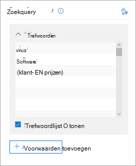

# Zoeken naar inhoud in een hoofd-eDiscovery-zaak

Nadat een core eDiscovery-zaak is gemaakt en personen die geïnteresseerd zijn in de zaak in de wacht worden geplaatst, kunt u een of meer zoekopdrachten maken en uitvoeren naar inhoud die relevant is voor de zaak. Zoekopdrachten die zijn gekoppeld aan een core eDiscovery-zaak, worden niet weergegeven op de pagina Inhoud zoeken in het Microsoft 365 compliancecentrum.  Deze zoekopdrachten worden weergegeven op de pagina **Zoekopdrachten** van het hoofd-eDiscover-geval waar de zoekopdrachten aan zijn gekoppeld. Dit betekent ook dat zoekopdrachten die aan een zaak zijn gekoppeld, alleen toegankelijk zijn voor caseleden.

Een core eDiscovery-zoekopdracht maken:
  
1. Ga naar en meld u aan met de referenties voor gebruikersaccount die zijn toegewezen aan de juiste [https://compliance.microsoft.com](https://compliance.microsoft.com) eDiscovery-machtigingen.

2. Klik in het linkernavigatiedeelvenster van Microsoft 365 compliancecentrum op Alles weergeven **en** klik vervolgens op **eDiscovery > Core.**

3. Selecteer op **de pagina Core eDiscovery** de case die u wilt maken en klik vervolgens op **Hoofd zaak openen.**

4. Klik op **de startpagina** voor de zaak op **het tabblad** Zoekopdrachten.
  
5. Klik op **de pagina** Zoeken op **Nieuwe zoekopdracht.**

6. Op de **pagina Nieuw zoeken** kunt u trefwoorden en voorwaarden toevoegen om de zoekquery te maken. 

    
  
   a. U kunt trefwoorden, berichteigenschappen, zoals verzonden en ontvangen datums of documenteigenschappen opgeven, zoals bestandsnamen of de datum waarop een document voor het laatst is gewijzigd. U kunt complexere query's gebruiken met een Booleaanse operator, zoals **EN,** **OF,** **NIET** of **NEAR.** U kunt ook zoeken naar gevoelige informatie (zoals socialezekerheidsnummers) in documenten of zoeken naar documenten die extern zijn gedeeld. Als u het vak trefwoord leeg laat, wordt alle inhoud op de opgegeven inhoudslocaties opgenomen in de zoekresultaten.

   b. U kunt op het selectievakje **Trefwoordlijst weergeven** klikken en in elke rij een trefwoord typen. Als u dit doet, worden de trefwoorden in elke rij verbonden door de **operator OF** in de zoekquery die is gemaakt. U kunt maximaal 20 trefwoorden invoeren in de lijst.

    
  
    Waarom de lijst met trefwoorden gebruiken? U kunt statistieken krijgen die laten zien hoeveel items overeenkomen met elk trefwoord. Op deze manier kunt u snel bepalen welke trefwoorden het meest (en het minst) effectief zijn. U kunt ook een trefwoordzin (tussen haakjes) in een rij gebruiken. Zie Trefwoordstatistieken weergeven voor [inhoudszoekresultaten](view-keyword-statistics-for-content-search.md)voor meer informatie over zoekstatistieken.

    Zie Een [zoekquery maken](content-search.md#building-a-search-query)voor meer informatie over het gebruik van de lijst met trefwoorden.

   c. U kunt op **Voorwaarden klikken** en voorwaarden toevoegen aan een zoekquery om een zoekopdracht te verfijnen en een meer verfijnde reeks resultaten te retourneren. Elke voorwaarde voegt een component toe aan de KQL-zoekquery die wordt gemaakt en uitgevoerd wanneer u de zoekopdracht start. Een voorwaarde is logisch verbonden met de trefwoordquery (opgegeven in het trefwoordvak) door de **operator AND.** Dit betekent dat items moeten voldoen aan zowel de trefwoordquery als aan elke voorwaarde die in de resultaten moet worden opgenomen. Dit is de manier waarop voorwaarden helpen om uw resultaten te beperken.

    Zie Trefwoordenquery's voor Inhoud zoeken voor meer informatie over het maken van een zoekquery en het gebruik van [voorwaarden.](keyword-queries-and-search-conditions.md)

7. Kies **onder Locaties: locaties in de wacht,** de inhoudslocaties die u wilt zoeken. U kunt in dezelfde zoekopdracht zoeken in postvakken, sites en openbare mappen.

    
  
    - **Alle locaties.** Selecteer deze optie om alle inhoudslocaties in uw organisatie te doorzoeken. Wanneer u deze optie selecteert, kunt u ervoor kiezen om te zoeken in alle Exchange-postvakken (inclusief de postvakken voor alle Microsoft Teams, Yammer Groepen en Office 365 Groepen), alle SharePoint- en OneDrive voor Bedrijven-sites (waaronder de sites voor alle Microsoft Teams, Yammer Groepen en Office 365 Groepen) en alle openbare mappen.
    
    - **Alle locaties in de wacht.** Selecteer deze optie om te zoeken in alle inhoudslocaties die in de eDiscovery-wachtplaats in de zaak zijn geplaatst. Als de zaak meerdere inhoudt bevat, worden de inhoudslocaties uit alle ophoudt doorzocht. Als een inhoudslocatie in een op query's gebaseerde wachtplaats is geplaatst, worden alleen de items gezocht die in de wacht staan wanneer u de inhoudszoekactie uitvoert die u in deze stap maakt. Als een gebruiker bijvoorbeeld is geplaatst op basis van query's met items die vóór een bepaalde datum zijn verzonden of gemaakt, worden alleen die items doorzocht. Dit wordt gedaan door de case hold-query en de inhoudszoekquery te verbinden door een **AND-operator.** Zie Locaties zoeken [in eDiscovery hold](create-ediscovery-holds.md#search-locations-on-ediscovery-hold)voor meer informatie.
    
    - **Specifieke locaties.** Selecteer deze optie om de postvakken en sites te selecteren die u wilt zoeken. Wanneer u deze optie selecteert en op **Wijzigen klikt,** wordt er een lijst met locaties weergegeven. U kunt ervoor kiezen om alle gebruikers, groepen, teams of sitelocaties te doorzoeken. U kunt ook zoeken in de openbare mappen in uw organisatie.
    
      
  
     Als u deze optie selecteert en een inhoudslocatie zoekt die in de wacht staat, wordt een query uit een op query gebaseerde case hold niet toegepast op de zoekquery. Met andere woorden, alle inhoud wordt doorzocht, niet alleen de inhoud die wordt bewaard door een query-gebaseerde case hold.

8. Nadat u de inhoudslocaties hebt geselecteerd die u wilt zoeken, klikt u **op Klaar** en klikt u vervolgens op **Opslaan.**

9. Klik op **de pagina** Nieuw zoeken op Opslaan **& uitvoeren** en typ vervolgens een naam voor de zoekopdracht. Zoekopdrachten die zijn gekoppeld aan een Hoofd eDiscovery-zaak, moeten namen hebben die uniek zijn binnen uw Office 365 organisatie.

10. Klik **op Opslaan** om de zoekinstellingen op te slaan en de zoekopdracht te starten.

  Nadat de zoekopdracht is voltooid, kunt u een voorbeeld van de zoekresultaten bekijken. Klik indien nodig op **Vernieuwen** op **de pagina Zoekopdrachten** om de zoekopdracht weer te geven die u in de lijst hebt gemaakt.

11. Klik op de zoekfunctie om de flyoutpagina weer te geven, die statistieken bevat over de zoekopdracht en om andere taken uit te voeren, zoals het weergeven van zoekstatistieken en het exporteren van de zoekresultaten.

## Meer informatie over het zoeken naar inhoudslocaties

- Wanneer u op **Gebruikers, groepen** of teams kiezen klikt om postvakken op te geven die u wilt zoeken, is de postvakvertaler die wordt weergegeven leeg. Dit is een ontwerp om de prestaties te verbeteren. Als u geadresseerden aan deze lijst wilt toevoegen, klikt u op **Gebruikers,** groepen of teams kiezen, typt u een naam (minimaal 3 tekens) in het zoekvak, selecteert u het selectievakje naast de naam en klikt u op **Kiezen**.

- U kunt inactieve postvakken, Microsoft Teams, Yammer Groepen, Office 365 Groepen en distributiegroepen toevoegen aan de lijst met postvakken die u wilt zoeken. Dynamische distributiegroepen worden niet ondersteund. Als u Microsoft Teams, Yammer groepen of groepen Office 365, wordt het groeps- of teampostvak doorzocht. de postvakken van de groepsleden worden niet doorzocht.

- Als u sites **wilt** toevoegen, klikt u op Sites kiezen, klikt u nogmaals op **Sites** kiezen en typt u vervolgens de URL voor elke site die u wilt zoeken. U kunt ook de URL toevoegen voor de SharePoint voor een Microsoft-team, een Yammer groep of een Office 365 Groep.
