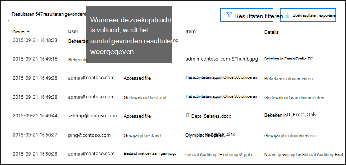
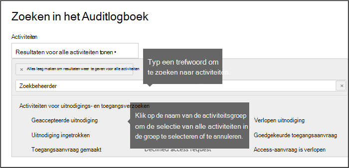
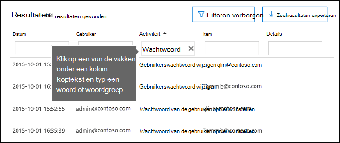
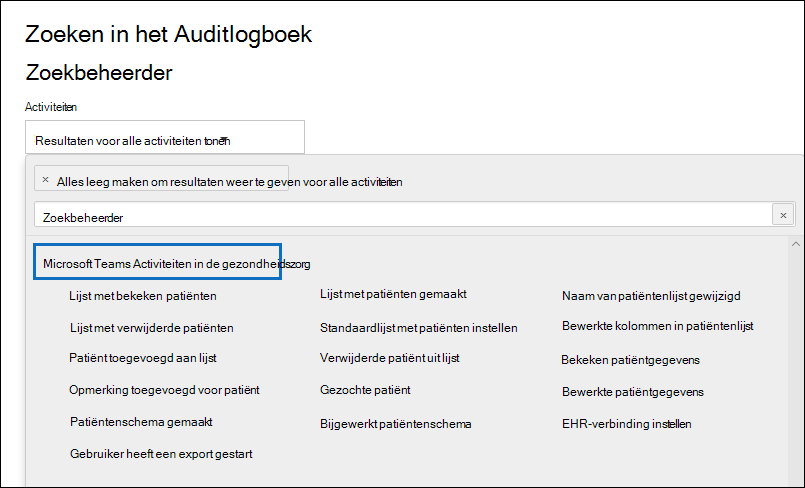
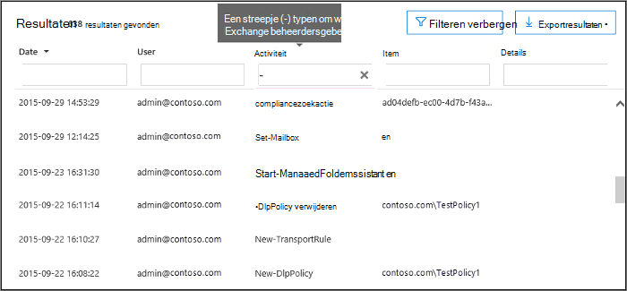

# <a name="search-the-audit-log-in-the-compliance-center"></a><span data-ttu-id="041f1-103">Zoek in het auditlogboek in het compliancecentrum</span><span class="sxs-lookup"><span data-stu-id="041f1-103">Search the audit log in the compliance center</span></span>

<span data-ttu-id="041f1-104">Wilt u weten of een gebruiker een bepaald document heeft bekeken of een item uit zijn of haar postvak heeft verwijderd?</span><span class="sxs-lookup"><span data-stu-id="041f1-104">Need to find if a user viewed a specific document or purged an item from their mailbox?</span></span> <span data-ttu-id="041f1-105">Als dit het geval is, kunt u het Microsoft 365-compliancecentrum gebruiken om in het uniforme controlelogboek te zoeken om gebruikers- en beheerdersactiviteiten in uw organisatie te bekijken.</span><span class="sxs-lookup"><span data-stu-id="041f1-105">If so, you can use the Microsoft 365 compliance center to search the unified audit log to view user and administrator activity in your organization.</span></span> <span data-ttu-id="041f1-106">Wat is het doel van een geïntegreerd auditlogboek?</span><span class="sxs-lookup"><span data-stu-id="041f1-106">Why a unified audit log?</span></span> <span data-ttu-id="041f1-107">Omdat u in Microsoft 365 kunt zoeken naar de volgende soorten [gebruikers- en beheerdersactiviteiten](#audited-activities):</span><span class="sxs-lookup"><span data-stu-id="041f1-107">Because you can search for the following types of [user and admin activity](#audited-activities) in Microsoft 365:</span></span>

- <span data-ttu-id="041f1-108">Gebruikersactiviteit in SharePoint Online en OneDrive voor Bedrijven</span><span class="sxs-lookup"><span data-stu-id="041f1-108">User activity in SharePoint Online and OneDrive for Business</span></span>

- <span data-ttu-id="041f1-109">Activiteit van gebruikers in Exchange Online (controlelogboekregistratie voor Exchange-postvakken)</span><span class="sxs-lookup"><span data-stu-id="041f1-109">User activity in Exchange Online (Exchange mailbox audit logging)</span></span>

- <span data-ttu-id="041f1-110">Beheeractiviteiten in SharePoint Online</span><span class="sxs-lookup"><span data-stu-id="041f1-110">Admin activity in SharePoint Online</span></span>

- <span data-ttu-id="041f1-111">Beheeractiviteiten in Azure Active Directory (de adreslijstservice voor Microsoft 365)</span><span class="sxs-lookup"><span data-stu-id="041f1-111">Admin activity in Azure Active Directory (the directory service for Microsoft 365)</span></span>

- <span data-ttu-id="041f1-112">Beheeractiviteiten in ExchOnline (controlelogboekregistratie voor Exchange-beheerders)</span><span class="sxs-lookup"><span data-stu-id="041f1-112">Admin activity in Exchange Online (Exchange admin audit logging)</span></span>

- <span data-ttu-id="041f1-113">eDiscovery-activiteiten in het beveiligings- en compliancecentrum</span><span class="sxs-lookup"><span data-stu-id="041f1-113">eDiscovery activities in the security and compliance center</span></span>

- <span data-ttu-id="041f1-114">Activiteiten van gebruikers en beheerders in Power BI</span><span class="sxs-lookup"><span data-stu-id="041f1-114">User and admin activity in Power BI</span></span>

- <span data-ttu-id="041f1-115">Activiteit van gebruikers en beheerders in Microsoft Teams</span><span class="sxs-lookup"><span data-stu-id="041f1-115">User and admin activity in Microsoft Teams</span></span>

- <span data-ttu-id="041f1-116">Activiteit van gebruikers en beheerders in Dynamics 365</span><span class="sxs-lookup"><span data-stu-id="041f1-116">User and admin activity in Dynamics 365</span></span>

- <span data-ttu-id="041f1-117">Activiteit van gebruikers en beheerders in Yammer</span><span class="sxs-lookup"><span data-stu-id="041f1-117">User and admin activity in Yammer</span></span>

- <span data-ttu-id="041f1-118">Activiteiten van gebruikers en beheerders in Microsoft Power Automate</span><span class="sxs-lookup"><span data-stu-id="041f1-118">User and admin activity in Microsoft Power Automate</span></span>

- <span data-ttu-id="041f1-119">Activiteit van gebruikers en beheerders in Microsoft Stream</span><span class="sxs-lookup"><span data-stu-id="041f1-119">User and admin activity in Microsoft Stream</span></span>

- <span data-ttu-id="041f1-120">Activiteiten van analisten en beheerders in Microsoft Workplace Analytics</span><span class="sxs-lookup"><span data-stu-id="041f1-120">Analyst and admin activity in Microsoft Workplace Analytics</span></span>

- <span data-ttu-id="041f1-121">Activiteiten van gebruikers en beheerders in Microsoft Power Apps</span><span class="sxs-lookup"><span data-stu-id="041f1-121">User and admin activity in Microsoft Power Apps</span></span>

- <span data-ttu-id="041f1-122">Activiteit van gebruikers en beheerders in Microsoft Forms</span><span class="sxs-lookup"><span data-stu-id="041f1-122">User and admin activity in Microsoft Forms</span></span>

- <span data-ttu-id="041f1-123">Activiteit van gebruikers en beheerders voor gevoeligheidslabels voor sites die gebruikmaken van SharePoint Online of Microsoft Teams</span><span class="sxs-lookup"><span data-stu-id="041f1-123">User and admin activity for sensitivity labels for sites that use SharePoint Online or Microsoft Teams</span></span>

- <span data-ttu-id="041f1-124">Beheerdersactiviteit in Briefing-e-mail en MyAnalytics</span><span class="sxs-lookup"><span data-stu-id="041f1-124">Admin activity in Briefing email and MyAnalytics</span></span>

## <a name="requirements-to-search-the-audit-log"></a><span data-ttu-id="041f1-125">Vereisten voor het doorzoeken van het auditlogboek</span><span class="sxs-lookup"><span data-stu-id="041f1-125">Requirements to search the audit log</span></span>

<span data-ttu-id="041f1-126">Lees de volgende items voordat u gaat zoeken in het auditlogboek.</span><span class="sxs-lookup"><span data-stu-id="041f1-126">Be sure to read the following items before you start searching the audit log.</span></span>

- <span data-ttu-id="041f1-127">Zoeken in auditlogboek is standaard ingeschakeld voor organisaties met Microsoft 365 en Office 365 Enterprise.</span><span class="sxs-lookup"><span data-stu-id="041f1-127">Audit log search is turned on by default for Microsoft 365 and Office 365 enterprise organizations.</span></span> <span data-ttu-id="041f1-128">Dit geldt ook voor organisaties met een E3/G3- of E5/G5-abonnement.</span><span class="sxs-lookup"><span data-stu-id="041f1-128">This includes organizations with E3/G3 or E5/G5 subscriptions.</span></span> <span data-ttu-id="041f1-129">Als u wilt controleren of zoeken in auditlogboek is ingeschakeld, kunt u de volgende opdracht uitvoeren in Exchange Online PowerShell:</span><span class="sxs-lookup"><span data-stu-id="041f1-129">To verify that audit log search is turned on, you can run the following command in Exchange Online PowerShell:</span></span>

  ```powershell
  Get-AdminAuditLogConfig | FL UnifiedAuditLogIngestionEnabled
  ```
  <span data-ttu-id="041f1-130">De waarde van `True` voor de eigenschap *UnifiedAuditLogIngestionEnabled* geeft aan dat zoeken in auditlogboek is ingeschakeld.</span><span class="sxs-lookup"><span data-stu-id="041f1-130">The value of `True` for the *UnifiedAuditLogIngestionEnabled* property indicates that audit log search is turned on.</span></span> <span data-ttu-id="041f1-131">Voor meer informatie, zie [Zoeken in auditlogboeken in- of uitschakelen](turn-audit-log-search-on-or-off.md).</span><span class="sxs-lookup"><span data-stu-id="041f1-131">For more information, see [Turn audit log search on or off](turn-audit-log-search-on-or-off.md).</span></span>

- <span data-ttu-id="041f1-132">Als u auditlogboeken wilt doorzoeken, moet aan u de rol Auditlogboeken alleen-weergeven of Auditlogboeken in Exchange Online zijn toegewezen.</span><span class="sxs-lookup"><span data-stu-id="041f1-132">You have to be assigned the View-Only Audit Logs or Audit Logs role in Exchange Online to search the audit log.</span></span> <span data-ttu-id="041f1-133">Deze rollen worden standaard toegewezen aan de rollengroepen Compliancebeheer en Organisatiebeheer op de pagina **Machtigingen** in het Exchange-beheercentrum.</span><span class="sxs-lookup"><span data-stu-id="041f1-133">By default, these roles are assigned to the Compliance Management and Organization Management role groups on the **Permissions** page in the Exchange admin center.</span></span> <span data-ttu-id="041f1-134">Globale beheerders in Office 365 en Microsoft 365 worden automatisch toegevoegd als leden van de rollengroep Organisatiebeheer in Exchange Online.</span><span class="sxs-lookup"><span data-stu-id="041f1-134">Note global administrators in Office 365 and Microsoft 365 are automatically added as members of the Organization Management role group in Exchange Online.</span></span> <span data-ttu-id="041f1-135">Als u de gebruiker het auditlogboek wilt laten doorzoeken met minimale rechten, kunt u in Exchange Online een aangepaste rollengroep maken, de rol Auditlogboeken alleen-weergeven of Auditlogboeken toevoegen en vervolgens de gebruiker toevoegen als lid van de nieuwe rollengroep.</span><span class="sxs-lookup"><span data-stu-id="041f1-135">To give a user the ability to search the audit log with the minimum level of privileges, you can create a custom role group in Exchange Online, add the View-Only Audit Logs or Audit Logs role, and then add the user as a member of the new role group.</span></span> <span data-ttu-id="041f1-136">Zie voor meer informatie [Rollengroepen beheren in Exchange Online](/Exchange/permissions-exo/role-groups).</span><span class="sxs-lookup"><span data-stu-id="041f1-136">For more information, see [Manage role groups in Exchange Online](/Exchange/permissions-exo/role-groups).</span></span>

  > [!IMPORTANT]
  > <span data-ttu-id="041f1-137">Als u gebruikers de rol Auditlogboeken alleen-weergeven of Auditlogboeken toewijst op de pagina **Machtigingen** in het Beveiligings- en compliancecentrum, dan kunnen ze het auditlogboek niet doorzoeken.</span><span class="sxs-lookup"><span data-stu-id="041f1-137">If you assign a user the View-Only Audit Logs or Audit Logs role on the **Permissions** page in the Security & Compliance Center, they won't be able to search the audit log.</span></span> <span data-ttu-id="041f1-138">U moet deze machtigingen toewijzen in Exchange Online.</span><span class="sxs-lookup"><span data-stu-id="041f1-138">You have to assign the permissions in Exchange Online.</span></span> <span data-ttu-id="041f1-139">Dat komt omdat de onderliggende cmdlet voor het doorzoeken van het auditlogboek een Exchange Online-cmdlet is.</span><span class="sxs-lookup"><span data-stu-id="041f1-139">This is because the underlying cmdlet used to search the audit log is an Exchange Online cmdlet.</span></span>

- <span data-ttu-id="041f1-140">Wanneer een gecontroleerde activiteit wordt uitgevoerd door een gebruiker of beheerder, wordt een auditrecord gegenereerd en opgeslagen in het auditlogboek voor uw organisatie.</span><span class="sxs-lookup"><span data-stu-id="041f1-140">When an audited activity is performed by a user or admin, an audit record is generated and stored in the audit log for your organization.</span></span> <span data-ttu-id="041f1-141">De tijdsduur dat een auditrecord wordt bewaard (en doorzoekbaar is in het auditlogboek) is afhankelijk van uw Office 365- of Microsoft 365 Enterprise-abonnement, en specifiek het type licentie dat aan specifieke gebruikers is toegewezen.</span><span class="sxs-lookup"><span data-stu-id="041f1-141">The length of time that an audit record is retained (and searchable in the audit log) depends on your Office 365 or Microsoft 365 Enterprise subscription, and specifically the type of the license that is assigned to specific users.</span></span>

  - <span data-ttu-id="041f1-142">Voor gebruikers waaraan een Office 365 E5- of Microsoft 365 E5-licentie is toegewezen (of gebruikers met een Microsoft 365 E5 Compliance- of Microsoft 365 E5 eDiscovery en Audit invoeglicentie), worden auditrecords voor Azure Active Directory-, Exchange- en SharePoint-activiteit standaard bewaard voor één jaar.</span><span class="sxs-lookup"><span data-stu-id="041f1-142">For users assigned an Office 365 E5 or Microsoft 365 E5 license (or users with a Microsoft 365 E5 Compliance or Microsoft 365 E5 eDiscovery and Audit add-on license), audit records for Azure Active Directory, Exchange, and SharePoint activity are retained for one year by default.</span></span> <span data-ttu-id="041f1-143">Organisaties kunnen ook een bewaarbeleid voor auditlogboeken opstellen om auditrecords voor activiteiten in andere services maximaal een jaar te bewaren.</span><span class="sxs-lookup"><span data-stu-id="041f1-143">Organizations can also create audit log retention policies to retain audit records for activities in other services for up to one year.</span></span> <span data-ttu-id="041f1-144">Zie voor meer informatie [Bewaarbeleid voor auditlogboeken beheren](audit-log-retention-policies.md).</span><span class="sxs-lookup"><span data-stu-id="041f1-144">For more information, see [Manage audit log retention policies](audit-log-retention-policies.md).</span></span>

    > [!NOTE]
    > <span data-ttu-id="041f1-145">Als uw organisatie heeft deelgenomen aan het private preview-programma voor het één jaar bewaren van auditrecords, wordt de bewaartermijn voor auditrecords die zijn gegenereerd vóór de implementatiedatum voor algemene beschikbaarheid niet opnieuw ingesteld.</span><span class="sxs-lookup"><span data-stu-id="041f1-145">If your organization participated in the private preview program for the one-year retention of audit records, the retention duration for audit records that were generated before the general availability rollout date will not be reset.</span></span>

  - <span data-ttu-id="041f1-146">Voor gebruikers waaraan een andere (niet-E5) Office 365- of Microsoft 365-licentie is toegewezen, worden auditrecords 90 dagen bewaard.</span><span class="sxs-lookup"><span data-stu-id="041f1-146">For users assigned any other (non-E5) Office 365 or Microsoft 365 license, audit records are retained for 90 days.</span></span> <span data-ttu-id="041f1-147">Zie [de servicebeschrijving van het beveiligings- en compliancecentrum](/office365/servicedescriptions/office-365-platform-service-description/office-365-securitycompliance-center) voor een lijst met Office 365- en Microsoft 365-abonnementen die uniforme auditregistratie ondersteunen.</span><span class="sxs-lookup"><span data-stu-id="041f1-147">For a list of Office 365 and Microsoft 365 subscriptions that support unified audit logging, see [the security and compliance center service description](/office365/servicedescriptions/office-365-platform-service-description/office-365-securitycompliance-center).</span></span>

    > [!NOTE]
    > <span data-ttu-id="041f1-148">Zelfs wanneer postvakcontrole standaard is ingeschakeld, merkt u mogelijk dat postvakcontrolegebeurtenissen voor sommige gebruikers niet worden gevonden in auditlogboeken in het Beveiligings- en compliancecentrum of via de Office 365 Management Activity-API.</span><span class="sxs-lookup"><span data-stu-id="041f1-148">Even when mailbox auditing on by default is turned on, you might notice that mailbox audit events for some users aren't found in audit log searches in the Security & Compliance Center or via the Office 365 Management Activity API.</span></span> <span data-ttu-id="041f1-149">Zie ook [Meer informatie over controlelogboekregistratie van postvakken](enable-mailbox-auditing.md#more-information).</span><span class="sxs-lookup"><span data-stu-id="041f1-149">For more information, see [More information about mailbox audit logging](enable-mailbox-auditing.md#more-information).</span></span>

- <span data-ttu-id="041f1-150">Als u het zoeken in auditlogboeken wilt uitschakelen voor uw organisatie, kunt u de volgende opdracht uitvoeren in een externe PowerShell-sessie met uw Exchange Online-organisatie:</span><span class="sxs-lookup"><span data-stu-id="041f1-150">If you want to turn off audit log search for your organization, you can run the following command in remote PowerShell connected to your Exchange Online organization:</span></span>

  ```powershell
  Set-AdminAuditLogConfig -UnifiedAuditLogIngestionEnabled $false
  ```

    <span data-ttu-id="041f1-151">Als u het zoeken in auditlogboeken opnieuw wilt inschakelen, kunt u de volgende opdracht uitvoeren in Exchange Online PowerShell:</span><span class="sxs-lookup"><span data-stu-id="041f1-151">To turn on audit search again, you can run the following command in Exchange Online PowerShell:</span></span>

  ```powershell
  Set-AdminAuditLogConfig -UnifiedAuditLogIngestionEnabled $true
  ```

  <span data-ttu-id="041f1-152">Zie [Zoeken in auditlogboeken uitschakelen](turn-audit-log-search-on-or-off.md) voor meer informatie.</span><span class="sxs-lookup"><span data-stu-id="041f1-152">For more information, see [Turn off audit log search](turn-audit-log-search-on-or-off.md).</span></span>

- <span data-ttu-id="041f1-153">Zoals eerder is gezegd, is de onderliggende cmdlet die wordt gebruikt voor het doorzoeken van het auditlogboek een Exchange Online-cmdlet; dit is **Search-UnifiedAuditLog**.</span><span class="sxs-lookup"><span data-stu-id="041f1-153">As previously stated, the underlying cmdlet used to search the audit log is an Exchange Online cmdlet, which is **Search-UnifiedAuditLog**.</span></span> <span data-ttu-id="041f1-154">Dat betekent dat u deze cmdlet kunt gebruiken om het auditlogboek te doorzoeken in plaats van de pagina **Zoeken in auditlogboeken** in het Beveiligings- en compliancecentrum.</span><span class="sxs-lookup"><span data-stu-id="041f1-154">That means you can use this cmdlet to search the audit log instead of using the **Audit log search** page in the Security & Compliance Center.</span></span> <span data-ttu-id="041f1-155">U moet deze cmdlet uitvoeren in een externe PowerShell die is verbonden met uw Exchange Online-organisatie.</span><span class="sxs-lookup"><span data-stu-id="041f1-155">You have to run this cmdlet in remote PowerShell connected to your Exchange Online organization.</span></span> <span data-ttu-id="041f1-156">Zie [Search-UnifiedAuditLog](/powershell/module/exchange/search-unifiedauditlog) voor meer informatie.</span><span class="sxs-lookup"><span data-stu-id="041f1-156">For more information, see [Search-UnifiedAuditLog](/powershell/module/exchange/search-unifiedauditlog).</span></span>

  <span data-ttu-id="041f1-157">Voor informatie over het exporteren van de zoekresultaten die zijn geretourneerd door de **Search-UnifiedAuditLog**-cmdlet naar een CSV-bestand, zie de sectie 'Tips voor het exporteren en bekijken van het auditlogboek' in [Auditlogboekrecords exporteren, configureren en weergeven](export-view-audit-log-records.md#tips-for-exporting-and-viewing-the-audit-log).</span><span class="sxs-lookup"><span data-stu-id="041f1-157">For information about exporting the search results returned by the **Search-UnifiedAuditLog** cmdlet to a CSV file, see the "Tips for exporting and viewing the audit log" section in [Export, configure, and view audit log records](export-view-audit-log-records.md#tips-for-exporting-and-viewing-the-audit-log).</span></span>

- <span data-ttu-id="041f1-158">Als u via programmacode gegevens uit het auditlogboek wilt downloaden, raden we aan de Office 365 Management Activity-API te gebruiken in plaats van een PowerShell-script.</span><span class="sxs-lookup"><span data-stu-id="041f1-158">If you want to programmatically download data from the audit log, we recommend that you use the Office 365 Management Activity API instead of using a PowerShell script.</span></span> <span data-ttu-id="041f1-159">De Office 365 Management Activity-API is een REST-webservice waarvan u gebruik kunt maken om voor uw organisatie oplossingen te ontwikkelen voor activiteiten, beveiliging en nalevingscontrole.</span><span class="sxs-lookup"><span data-stu-id="041f1-159">The Office 365 Management Activity API is a REST web service that you can use to develop operations, security, and compliance monitoring solutions for your organization.</span></span> <span data-ttu-id="041f1-160">Zie [Office 365 Management Activity-API-referentie](/office/office-365-management-api/office-365-management-activity-api-reference) voor meer informatie.</span><span class="sxs-lookup"><span data-stu-id="041f1-160">For more information, see [Office 365 Management Activity API reference](/office/office-365-management-api/office-365-management-activity-api-reference).</span></span>

- <span data-ttu-id="041f1-p112">Het kan 30 minuten tot 24 uur duren nadat een gebeurtenis heeft plaatsgevonden voordat het bijbehorende auditlogboekrecord wordt geretourneerd in de resultaten van een zoekopdracht in het auditlogboek. De volgende tabel toont de tijd die nodig is voor de verschillende services in Office 365.</span><span class="sxs-lookup"><span data-stu-id="041f1-p112">It can take up to 30 minutes or up to 24 hours after an event occurs for the corresponding audit log record to be returned in the results of an audit log search. The following table shows the time it takes for the different services in Office 365.</span></span>

  |<span data-ttu-id="041f1-163">Microsoft 365-service of -functie</span><span class="sxs-lookup"><span data-stu-id="041f1-163">Microsoft 365 service or feature</span></span>|<span data-ttu-id="041f1-164">30 minuten</span><span class="sxs-lookup"><span data-stu-id="041f1-164">30 minutes</span></span>|<span data-ttu-id="041f1-165">24 uur</span><span class="sxs-lookup"><span data-stu-id="041f1-165">24 hours</span></span>|
  |:-----|:-----:|:-----:|
  |<span data-ttu-id="041f1-166">Defender voor Office 365 en Bedreigingsinformatie</span><span class="sxs-lookup"><span data-stu-id="041f1-166">Defender for Office 365 and Threat Intelligence</span></span>|||
  |<span data-ttu-id="041f1-168">Azure Active Directory (gebruikersaanmeldingsgebeurtenissen)</span><span class="sxs-lookup"><span data-stu-id="041f1-168">Azure Active Directory (user login events)</span></span>|||
  |<span data-ttu-id="041f1-170">Azure Active Directory (beheergebeurtenissen)</span><span class="sxs-lookup"><span data-stu-id="041f1-170">Azure Active Directory (admin events)</span></span>|||
  |<span data-ttu-id="041f1-172">Preventie van gegevensverlies</span><span class="sxs-lookup"><span data-stu-id="041f1-172">Data Loss Prevention</span></span>|||
  |<span data-ttu-id="041f1-174">Dynamics 365 CRM</span><span class="sxs-lookup"><span data-stu-id="041f1-174">Dynamics 365 CRM</span></span>|||
  |<span data-ttu-id="041f1-176">eDiscovery</span><span class="sxs-lookup"><span data-stu-id="041f1-176">eDiscovery</span></span>|||
  |<span data-ttu-id="041f1-178">Exchange Online</span><span class="sxs-lookup"><span data-stu-id="041f1-178">Exchange Online</span></span>|||
  |<span data-ttu-id="041f1-180">Microsoft Power Automate</span><span class="sxs-lookup"><span data-stu-id="041f1-180">Microsoft Power Automate</span></span>|||
  |<span data-ttu-id="041f1-182">Microsoft Project</span><span class="sxs-lookup"><span data-stu-id="041f1-182">Microsoft Project</span></span>|||
  |<span data-ttu-id="041f1-184">Microsoft Stream</span><span class="sxs-lookup"><span data-stu-id="041f1-184">Microsoft Stream</span></span>|||
  |<span data-ttu-id="041f1-186">Microsoft Teams</span><span class="sxs-lookup"><span data-stu-id="041f1-186">Microsoft Teams</span></span>|||
  |<span data-ttu-id="041f1-188">Power Apps</span><span class="sxs-lookup"><span data-stu-id="041f1-188">Power Apps</span></span>|||
  |<span data-ttu-id="041f1-190">Power BI</span><span class="sxs-lookup"><span data-stu-id="041f1-190">Power BI</span></span>|||
  |<span data-ttu-id="041f1-192">Beveiligings- en compliancecentrum</span><span class="sxs-lookup"><span data-stu-id="041f1-192">Security & Compliance Center</span></span>|||
  |<span data-ttu-id="041f1-194">Vertrouwelijkheidslabels</span><span class="sxs-lookup"><span data-stu-id="041f1-194">Sensitivity labels</span></span>|||
  |<span data-ttu-id="041f1-196">SharePoint Online en OneDrive voor Bedrijven</span><span class="sxs-lookup"><span data-stu-id="041f1-196">SharePoint Online and OneDrive for Business</span></span>|||
  |<span data-ttu-id="041f1-198">Workplace Analytics</span><span class="sxs-lookup"><span data-stu-id="041f1-198">Workplace Analytics</span></span>|||
  |<span data-ttu-id="041f1-200">Yammer</span><span class="sxs-lookup"><span data-stu-id="041f1-200">Yammer</span></span>||||
  |<span data-ttu-id="041f1-202">Microsoft Forms</span><span class="sxs-lookup"><span data-stu-id="041f1-202">Microsoft Forms</span></span>||
  ||||

- <span data-ttu-id="041f1-204">Azure Active Directory (Azure AD) is de directoryservice die wordt gebruikt voor Office 365.</span><span class="sxs-lookup"><span data-stu-id="041f1-204">Azure Active Directory (Azure AD) is the directory service for Office 365.</span></span> <span data-ttu-id="041f1-205">Het geïntegreerde auditlogboek bevat activiteiten van gebruikers, groepen, toepassingen, domeinen en adreslijsten die in het Microsoft 365-beheercentrum of in de Azure-beheerportal zijn uitgevoerd.</span><span class="sxs-lookup"><span data-stu-id="041f1-205">The unified audit log contains user, group, application, domain, and directory activities performed in the Microsoft 365 admin center or in the Azure management portal.</span></span> <span data-ttu-id="041f1-206">Zie [Azure Active Directory-auditrapportgebeurtenissen](/azure/active-directory/reports-monitoring/concept-audit-logs) voor een volledige lijst met Azure AD-gebeurtenissen.</span><span class="sxs-lookup"><span data-stu-id="041f1-206">For a complete list of Azure AD events, see [Azure Active Directory Audit Report Events](/azure/active-directory/reports-monitoring/concept-audit-logs).</span></span>

- <span data-ttu-id="041f1-207">Auditlogboekregistratie voor Power BI is niet standaard ingeschakeld.</span><span class="sxs-lookup"><span data-stu-id="041f1-207">Audit logging for Power BI isn't enabled by default.</span></span> <span data-ttu-id="041f1-208">Om naar Power BI-activiteiten te zoeken in het auditlogboek, moet u de controlefunctie in het beheerportal van Power BI inschakelen.</span><span class="sxs-lookup"><span data-stu-id="041f1-208">To search for Power BI activities in the audit log, you have to enable auditing in the Power BI admin portal.</span></span> <span data-ttu-id="041f1-209">Zie de sectie Auditlogboeken in [Power BI-beheerportal](/power-bi/service-admin-portal#audit-logs).</span><span class="sxs-lookup"><span data-stu-id="041f1-209">For instructions, see the "Audit logs" section in [Power BI admin portal](/power-bi/service-admin-portal#audit-logs).</span></span>

## <a name="search-the-audit-log"></a><span data-ttu-id="041f1-210">Zoeken in het auditlogboek</span><span class="sxs-lookup"><span data-stu-id="041f1-210">Search the audit log</span></span>

<span data-ttu-id="041f1-211">Hier is het proces voor het zoeken in het auditlogboek in Office 365.</span><span class="sxs-lookup"><span data-stu-id="041f1-211">Here's the process for searching the audit log in Office 365.</span></span>

[<span data-ttu-id="041f1-212">Stap 1: Een zoekopdracht in het auditlogboek uitvoeren</span><span class="sxs-lookup"><span data-stu-id="041f1-212">Step 1: Run an audit log search</span></span>](#step-1-run-an-audit-log-search)

[<span data-ttu-id="041f1-213">Stap 2: De zoekresultaten bekijken</span><span class="sxs-lookup"><span data-stu-id="041f1-213">Step 2: View the search results</span></span>](#step-2-view-the-search-results)

[<span data-ttu-id="041f1-214">Stap 3: De zoekresultaten filteren</span><span class="sxs-lookup"><span data-stu-id="041f1-214">Step 3: Filter the search results</span></span>](#step-3-filter-the-search-results)

[<span data-ttu-id="041f1-215">Stap 4: De zoekresultaten naar een bestand exporteren</span><span class="sxs-lookup"><span data-stu-id="041f1-215">Step 4: Export the search results to a file</span></span>](#step-4-export-the-search-results-to-a-file)

### <a name="step-1-run-an-audit-log-search"></a><span data-ttu-id="041f1-216">Stap 1: Een zoekopdracht in het auditlogboek uitvoeren</span><span class="sxs-lookup"><span data-stu-id="041f1-216">Step 1: Run an audit log search</span></span>

1. <span data-ttu-id="041f1-217">Ga naar [https://protection.office.com](https://protection.office.com).</span><span class="sxs-lookup"><span data-stu-id="041f1-217">Go to [https://protection.office.com](https://protection.office.com).</span></span>

    > [!TIP]
    > <span data-ttu-id="041f1-218">Gebruik een persoonlijke browsersessie (geen normale sessie) om het Beveiligings- en compliancecentrum te openen. Hierdoor wordt voorkomen dat de referenties waarmee u bent aangemeld, worden gebruikt.</span><span class="sxs-lookup"><span data-stu-id="041f1-218">Use a private browsing session (not a regular session) to access the Security & Compliance Center because this will prevent the credential that you are currently logged on with from being used.</span></span> <span data-ttu-id="041f1-219">Om een InPrivate-browsing-sessie in Internet Explorer of Microsoft Edge te openen, drukt u op CTRL+SHIFT+P.</span><span class="sxs-lookup"><span data-stu-id="041f1-219">To open an InPrivate Browsing session in Internet Explorer or Microsoft Edge, just press CTRL+SHIFT+P.</span></span> <span data-ttu-id="041f1-220">Druk op CTRL+SHIFT+N om een privé-browsersessie te openen in Google Chrome (ook wel een incognitovenster genoemd).</span><span class="sxs-lookup"><span data-stu-id="041f1-220">To open a private browsing session in Google Chrome (called an incognito window), press CTRL+SHIFT+N.</span></span>

2. <span data-ttu-id="041f1-221">Meld u aan met uw werk- of schoolaccount.</span><span class="sxs-lookup"><span data-stu-id="041f1-221">Sign in using your work or school account.</span></span>

3. <span data-ttu-id="041f1-222">Klik in het linkerdeelvenster van het Beveiligings- en compliancecentrum op **Zoekacties en onderzoek** en vervolgens op **Zoeken in het auditlogboek**.</span><span class="sxs-lookup"><span data-stu-id="041f1-222">In the left pane of the Security & Compliance Center, click **Search**, and then click **Audit log search**.</span></span>

    <span data-ttu-id="041f1-223">De pagina **Zoeken in het auditlogboek** wordt weergegeven.</span><span class="sxs-lookup"><span data-stu-id="041f1-223">The **Audit log search** page is displayed.</span></span>

    

    > [!NOTE]
    > <span data-ttu-id="041f1-225">U moet eerst controlelogboekregistratie inschakelen voordat u een zoekopdracht in het auditlogboek kunt uitvoeren.</span><span class="sxs-lookup"><span data-stu-id="041f1-225">You have to first turn on audit logging before you can run an audit log search.</span></span> <span data-ttu-id="041f1-226">Als de koppeling **Registreren van gebruikers- en beheerdersactiviteit starten** wordt weergegeven, klikt u erop om de controle in te schakelen.</span><span class="sxs-lookup"><span data-stu-id="041f1-226">If the **Start recording user and admin activity** link is displayed, click it to turn on auditing.</span></span> <span data-ttu-id="041f1-227">Als u deze koppeling niet ziet, is controle al ingeschakeld voor uw organisatie.</span><span class="sxs-lookup"><span data-stu-id="041f1-227">If you don't see this link, auditing has already been turned on for your organization.</span></span>

4. <span data-ttu-id="041f1-228">Configureer de volgende zoekcriteria: </span><span class="sxs-lookup"><span data-stu-id="041f1-228">Configure the following search criteria:</span></span>

   1. <span data-ttu-id="041f1-229">**Activiteiten**: klik op de vervolgkeuzelijst om activiteiten weer te geven die u kunt zoeken.</span><span class="sxs-lookup"><span data-stu-id="041f1-229">**Activities**: Click the drop-down list to display the activities that you can search for.</span></span> <span data-ttu-id="041f1-230">Activiteiten van gebruikers en beheerders staan gerangschikt in groepen met gerelateerde activiteiten.</span><span class="sxs-lookup"><span data-stu-id="041f1-230">User and admin activities are organized into groups of related activities.</span></span> <span data-ttu-id="041f1-231">U kunt specifieke activiteiten selecteren of u kunt op de naam van de activiteitengroep klikken om alle activiteiten in de groep te selecteren.</span><span class="sxs-lookup"><span data-stu-id="041f1-231">You can select specific activities or you can click the activity group name to select all activities in the group.</span></span> <span data-ttu-id="041f1-232">U kunt ook op een geselecteerde activiteit klikken om de selectie te wissen.</span><span class="sxs-lookup"><span data-stu-id="041f1-232">You can also click a selected activity to clear the selection.</span></span> <span data-ttu-id="041f1-233">Als u de zoekopdracht hebt uitgevoerd, worden alleen de vermeldingen in het auditlogboek voor de geselecteerde activiteiten weergegeven.</span><span class="sxs-lookup"><span data-stu-id="041f1-233">After you run the search, only the audit log entries for the selected activities are displayed.</span></span> <span data-ttu-id="041f1-234">Als u **Resultaten tonen voor alle activiteiten** selecteert, worden de resultaten weergegeven voor alle activiteiten die zijn uitgevoerd door de geselecteerde gebruiker of groep gebruikers.</span><span class="sxs-lookup"><span data-stu-id="041f1-234">Selecting **Show results for all activities** displays results for all activities performed by the selected user or group of users.</span></span>

      <span data-ttu-id="041f1-235">Er worden meer dan honderd activiteiten van gebruikers en beheerders in het auditlogboek vastgelegd.</span><span class="sxs-lookup"><span data-stu-id="041f1-235">Over 100 user and admin activities are logged in the audit log.</span></span> <span data-ttu-id="041f1-236">Klik op het tabblad **Gecontroleerde activiteiten** bij het onderwerp van dit artikel om de beschrijvingen van elke activiteit in elk van de verschillende services te zien.</span><span class="sxs-lookup"><span data-stu-id="041f1-236">Click the **Audited activities** tab at the topic of this article to see the descriptions of every activity in each of the different services.</span></span>

   1. <span data-ttu-id="041f1-237">**Begindatum** en **Einddatum**: standaard worden de laatste zeven dagen geselecteerd.</span><span class="sxs-lookup"><span data-stu-id="041f1-237">**Start date** and **End date**: The last seven days are selected by default.</span></span> <span data-ttu-id="041f1-238">Selecteer een bereik voor de datum en tijd om de gebeurtenissen weer te geven die in die periode hebben plaatsgevonden. </span><span class="sxs-lookup"><span data-stu-id="041f1-238">Select a date and time range to display the events that occurred within that period.</span></span> <span data-ttu-id="041f1-239">De datum en tijd worden op lokale tijd weergegeven.</span><span class="sxs-lookup"><span data-stu-id="041f1-239">The date and time are presented in local time.</span></span> <span data-ttu-id="041f1-240">Het grootste datumbereik dat u kunt opgeven is 90 dagen.</span><span class="sxs-lookup"><span data-stu-id="041f1-240">The maximum date range that you can specify is 90 days.</span></span> <span data-ttu-id="041f1-241">Er wordt een fout weergegeven als het geselecteerde datumbereik groter is dan 90 dagen.</span><span class="sxs-lookup"><span data-stu-id="041f1-241">An error is displayed if the selected date range is greater than 90 days.</span></span>

      > [!TIP]
      > <span data-ttu-id="041f1-242">Als u het maximum datumbereik van 90 dagen gebruikt, selecteert u het huidige tijdstip voor **Begindatum**.</span><span class="sxs-lookup"><span data-stu-id="041f1-242">If you're using the maximum date range of 90 days, select the current time for the **Start date**.</span></span> <span data-ttu-id="041f1-243">Anders krijgt u de foutmelding dat de begindatum eerder is dan de einddatum.</span><span class="sxs-lookup"><span data-stu-id="041f1-243">Otherwise, you'll receive an error saying that the start date is earlier than the end date.</span></span> <span data-ttu-id="041f1-244">Als u de controle de afgelopen 90 dagen hebt ingeschakeld, kan het maximum datumbereik niet beginnen vóór de datum waarop de controle is ingeschakeld.</span><span class="sxs-lookup"><span data-stu-id="041f1-244">If you've turned on auditing within the last 90 days, the maximum date range can't start before the date that auditing was turned on.</span></span>

   1. <span data-ttu-id="041f1-245">**Gebruikers**: klik in dit vak en selecteer een of meer gebruikers waarvoor u de zoekresultaten wilt weergeven.</span><span class="sxs-lookup"><span data-stu-id="041f1-245">**Users**: Click in this box and then select one or more users to display search results for.</span></span> <span data-ttu-id="041f1-246">De vermeldingen in het auditlogboek voor de geselecteerde activiteit die is uitgevoerd door de gebruikers die u in dit vak selecteert, worden in de lijst met resultaten weergegeven.</span><span class="sxs-lookup"><span data-stu-id="041f1-246">The audit log entries for the selected activity performed by the users you select in this box are displayed in the list of results.</span></span> <span data-ttu-id="041f1-247">Laat dit vak leeg als u vermeldingen wilt zien voor alle gebruikers (en serviceaccounts) in uw organisatie.</span><span class="sxs-lookup"><span data-stu-id="041f1-247">Leave this box blank to return entries for all users (and service accounts) in your organization.</span></span>

   1. <span data-ttu-id="041f1-248">**Bestand, map of site**: typ de naam (of een gedeelte ervan) van het bestand of de map om te zoeken naar activiteit met betrekking tot dat bestand of die map die het opgegeven trefwoord bevat.</span><span class="sxs-lookup"><span data-stu-id="041f1-248">**File, folder, or site**: Type some or all of a file or folder name to search for activity related to the file of folder that contains the specified keyword.</span></span> <span data-ttu-id="041f1-249">U kunt ook een URL van een bestand of map opgeven.</span><span class="sxs-lookup"><span data-stu-id="041f1-249">You can also specify a URL of a file or folder.</span></span> <span data-ttu-id="041f1-250">Als u een URL gebruikt, zorg er dan voor dat u het volledige URL-pad typt of als u een deel van de URL typt, geen speciale tekens of spaties opneemt.</span><span class="sxs-lookup"><span data-stu-id="041f1-250">If you use a URL, be sure the type the full URL path or if you type a portion of the URL, don't include any special characters or spaces.</span></span>

      <span data-ttu-id="041f1-251">Laat dit vak leeg als u vermeldingen wilt zien voor alle bestanden en mappen in uw organisatie.</span><span class="sxs-lookup"><span data-stu-id="041f1-251">Leave this box blank to return entries for all files and folders in your organization.</span></span>

      > [!TIP]
      >
      > - <span data-ttu-id="041f1-252">Als u op zoek bent naar alle activiteiten die zijn gerelateerd aan een **site**, voegt u het jokerteken (\*) toe na de URL om alle vermeldingen voor die site te retourneren; bijvoorbeeld, `"https://contoso-my.sharepoint.com/personal*"`.</span><span class="sxs-lookup"><span data-stu-id="041f1-252">If you're looking for all activities related to a **site**, add the wildcard symbol (\*) after the URL to return all entries for that site; for example, `"https://contoso-my.sharepoint.com/personal*"`.</span></span>
      >
      > - <span data-ttu-id="041f1-253">Als u op zoek bent naar alle activiteiten die zijn gerelateerd aan een **bestand**, voegt u het jokerteken (\*) toe voor de bestandsnaam om alle vermeldingen voor dat bestand te retourneren; bijvoorbeeld, `"*Customer_Profitability_Sample.csv"`.</span><span class="sxs-lookup"><span data-stu-id="041f1-253">If you're looking for all activities related to a **file**, add the wildcard symbol (\*) before the file name to return all entries for that file; for example, `"*Customer_Profitability_Sample.csv"`.</span></span>

5. <span data-ttu-id="041f1-254">Klik op **Zoeken** om de zoekopdracht met uw zoekcriteria uit te voeren. </span><span class="sxs-lookup"><span data-stu-id="041f1-254">Click **Search** to run the search using your search criteria.</span></span>

   <span data-ttu-id="041f1-255">De zoekresultaten worden geladen en worden na enkele ogenblikken onder **Resultaten** weergegeven.</span><span class="sxs-lookup"><span data-stu-id="041f1-255">The search results are loaded, and after a few moments they are displayed under **Results**.</span></span> <span data-ttu-id="041f1-256">Als de zoekopdracht is voltooid, wordt het aantal gevonden resultaten weergegeven.</span><span class="sxs-lookup"><span data-stu-id="041f1-256">When the search is finished, the number of results found is displayed.</span></span> <span data-ttu-id="041f1-257">Er worden maximaal 5000 gebeurtenissen weergegeven in het deelvenster **Resultaten** in stappen van 150 gebeurtenissen.</span><span class="sxs-lookup"><span data-stu-id="041f1-257">A maximum of 5,000 events will be displayed in the **Results** pane in increments of 150 events.</span></span> <span data-ttu-id="041f1-258">Als er meer dan 5000 gebeurtenissen voldoen aan de zoekcriteria, worden de meest recente 5000 gebeurtenissen weergegeven.</span><span class="sxs-lookup"><span data-stu-id="041f1-258">If more than 5,000 events meet the search criteria, the most recent 5,000 events are displayed.</span></span>

   

#### <a name="tips-for-searching-the-audit-log"></a><span data-ttu-id="041f1-260">Tips voor het zoeken in het auditlogboek</span><span class="sxs-lookup"><span data-stu-id="041f1-260">Tips for searching the audit log</span></span>

- <span data-ttu-id="041f1-261">U kunt specifieke activiteiten opgeven om op te zoeken door op de namen van de activiteiten te klikken.</span><span class="sxs-lookup"><span data-stu-id="041f1-261">You can select specific activities to search for by clicking the activity name.</span></span> <span data-ttu-id="041f1-262">U kunt ook op alle activiteiten in een groep zoeken (bijvoorbeeld **Activiteiten in verband met bestanden en mappen**) door op de groepsnaam te klikken.</span><span class="sxs-lookup"><span data-stu-id="041f1-262">Or you can search for all activities in a group (such as **File and folder activities**) by clicking the group name.</span></span> <span data-ttu-id="041f1-263">Als er een activiteit is geselecteerd, kunt u erop klikken als u de selectie wilt wissen.</span><span class="sxs-lookup"><span data-stu-id="041f1-263">If an activity is selected, you can click it to cancel the selection.</span></span> <span data-ttu-id="041f1-264">U kunt ook het zoekvak gebruiken om de activiteiten weer te geven die het trefwoord bevatten dat u typt.</span><span class="sxs-lookup"><span data-stu-id="041f1-264">You can also use the search box to display the activities that contain the keyword that you type.</span></span>

  

- <span data-ttu-id="041f1-266">Selecteer **Resultaten tonen voor alle activiteiten** in de lijst **Activiteiten** om vermeldingen uit het auditlogboek van de Exchange-beheerder weer te geven.</span><span class="sxs-lookup"><span data-stu-id="041f1-266">You have to select **Show results for all activities** in the **Activities** list to display events from the Exchange admin audit log.</span></span> <span data-ttu-id="041f1-267">Gebeurtenissen uit dit auditlogboek geven een cmdlet-naam weer (bijvoorbeeld **Set-Mailbox**) in de kolom **Activiteit** van de resultaten.</span><span class="sxs-lookup"><span data-stu-id="041f1-267">Events from this audit log display a cmdlet name (for example, **Set-Mailbox**) in the **Activity** column in the results.</span></span> <span data-ttu-id="041f1-268">Klik voor meer informatie op het tabblad **Gecontroleerde activiteiten** in dit onderwerp en klik vervolgens op **Exchange-beheeractiviteiten**.</span><span class="sxs-lookup"><span data-stu-id="041f1-268">For more information, click the **Audited activities** tab in this topic and then click **Exchange admin activities**.</span></span>

  <span data-ttu-id="041f1-269">Op dezelfde manier zijn er enkele controleactiviteiten waarvoor geen overeenkomstig item in de **Activiteitenlijst** staat.</span><span class="sxs-lookup"><span data-stu-id="041f1-269">Similarly, there are some auditing activities that don't have a corresponding item in the **Activities** list.</span></span> <span data-ttu-id="041f1-270">Als u de naam van de bewerking voor deze activiteiten weet, kunt u zoeken naar alle activiteiten, vervolgens de resultaten filteren door de naam van de bewerking in te typen in het vak voor de kolom **Activiteit**.</span><span class="sxs-lookup"><span data-stu-id="041f1-270">If you know the name of the operation for these activities, you can search for all activities, then filter the results by typing the name of the operation in the box for the **Activity** column.</span></span> <span data-ttu-id="041f1-271">Zie [Stap 3: de zoekresultaten filteren](#step-3-filter-the-search-results) voor meer informatie over het filteren van resultaten.</span><span class="sxs-lookup"><span data-stu-id="041f1-271">See [Step 3: Filter the search results](#step-3-filter-the-search-results) for more information about filtering the results.</span></span>

- <span data-ttu-id="041f1-272">Klik op **Wissen** om de huidige zoekcriteria te wissen.</span><span class="sxs-lookup"><span data-stu-id="041f1-272">Click **Clear** to clear the current search criteria.</span></span> <span data-ttu-id="041f1-273">Het datumbereik wordt weer terug ingesteld op de standaardwaarde van de afgelopen zeven dagen.</span><span class="sxs-lookup"><span data-stu-id="041f1-273">The date range returns to the default of the last seven days.</span></span> <span data-ttu-id="041f1-274">U kunt ook op **Alles wissen om resultaten te tonen voor alle activiteiten** klikken om alle geselecteerde activiteiten te annuleren.</span><span class="sxs-lookup"><span data-stu-id="041f1-274">You can also click **Clear all to show results for all activities** to cancel all selected activities.</span></span>

- <span data-ttu-id="041f1-275">Als er 5000 resultaten worden gevonden, kunt u aannemen dat er meer dan 5000 gebeurtenissen zijn die aan de zoekcriteria voldoen.</span><span class="sxs-lookup"><span data-stu-id="041f1-275">If 5,000 results are found, you can probably assume that there are more than 5,000 events that met the search criteria.</span></span> <span data-ttu-id="041f1-276">U kunt de zoekcriteria verfijnen en de zoekopdracht herhalen zodat er minder resultaten worden weergegeven, maar u kunt ook alle zoekresultaten exporteren via **Resultaten exporteren** \> **Alle resultaten downloaden**.</span><span class="sxs-lookup"><span data-stu-id="041f1-276">You can either refine the search criteria and rerun the search to return fewer results, or you can export all of the search results by selecting **Export results** \> **Download all results**.</span></span>

### <a name="step-2-view-the-search-results"></a><span data-ttu-id="041f1-277">Stap 2: de zoekresultaten bekijken</span><span class="sxs-lookup"><span data-stu-id="041f1-277">Step 2: View the search results</span></span>

<span data-ttu-id="041f1-278">De resultaten van een zoekopdracht in een auditlogboek worden weergegeven onder **Resultaten** op de pagina **Zoeken in het auditlogboek**.</span><span class="sxs-lookup"><span data-stu-id="041f1-278">The results of an audit log search are displayed under **Results** on the **Audit log search** page.</span></span> <span data-ttu-id="041f1-279">Zoals eerder vermeld, worden maximaal 5,000 (nieuwste) gebeurtenissen in pagina's van 150 gebeurtenissen weergegeven.</span><span class="sxs-lookup"><span data-stu-id="041f1-279">As previously stated a maximum of 5,000 (newest) events are displayed in increments of 150 events.</span></span> <span data-ttu-id="041f1-280">Om meer gebeurtenissen weer te geven, kunt u de schuifbalk in het deelvenster **Resultaten** gebruiken of u kunt op **Shift + End** drukken om de volgende 150 gebeurtenissen weer te geven.</span><span class="sxs-lookup"><span data-stu-id="041f1-280">To display more events you can use the scroll bar in the **Results** pane or you can press **Shift + End** to display the next 150 events.</span></span>

<span data-ttu-id="041f1-281">De resultaten bevatten de volgende informatie over alle gebeurtenissen die door de zoekopdracht worden geretourneerd:</span><span class="sxs-lookup"><span data-stu-id="041f1-281">The results contain the following information about each event returned by the search:</span></span>

- <span data-ttu-id="041f1-282">**Datum**: de datum en tijd (in de lokale tijd) waarop de gebeurtenis heeft plaatsgevonden.</span><span class="sxs-lookup"><span data-stu-id="041f1-282">**Date**: The date and time (in your local time) when the event occurred.</span></span>

- <span data-ttu-id="041f1-283">**IP-adres**: het IP-adres van het apparaat dat is gebruikt toen de activiteit in het logboek werd vastgelegd.</span><span class="sxs-lookup"><span data-stu-id="041f1-283">**IP address**: The IP address of the device that was used when the activity was logged.</span></span> <span data-ttu-id="041f1-284">Het IP-adres wordt weergegeven in een IPv4- of IPv6-adresindeling.</span><span class="sxs-lookup"><span data-stu-id="041f1-284">The IP address is displayed in either an IPv4 or IPv6 address format.</span></span>

   > [!NOTE]
  > <span data-ttu-id="041f1-285">Voor sommige services is de waarde die in dit veld wordt weergegeven mogelijk het IP-adres van een vertrouwde applicatie (bijvoorbeeld Office op the web-apps) die namens een gebruiker de service aanroept en niet het IP-adres van het apparaat dat is gebruikt door een persoon die de activiteit heeft uitgevoerd.</span><span class="sxs-lookup"><span data-stu-id="041f1-285">For some services, the value displayed in this field might be the IP address for a trusted application (for example, Office on the web apps) calling into the service on behalf of a user and not the IP address of the device used by person who performed the activity.</span></span> <span data-ttu-id="041f1-286">Voor beheeractiviteiten (of activiteiten die door een systeemaccount worden uitgevoerd) voor Azure Active Directory-gerelateerde gebeurtenissen wordt het IP-adres ook niet geregistreerd en is de waarde die in dit veld wordt weergegeven, `null`.</span><span class="sxs-lookup"><span data-stu-id="041f1-286">Also, for admin activity (or activity performed by a system account) for Azure Active Directory-related events, the IP address isn't logged and the value displayed in this field is `null`.</span></span>

- <span data-ttu-id="041f1-287">**Gebruiker**: de gebruiker (of serviceaccount) die de actie heeft uitgevoerd die de gebeurtenis heeft veroorzaakt.</span><span class="sxs-lookup"><span data-stu-id="041f1-287">**User**: The user (or service account) who performed the action that triggered the event.</span></span>

- <span data-ttu-id="041f1-288">**Activiteit**: de activiteit die door de gebruiker is uitgevoerd.</span><span class="sxs-lookup"><span data-stu-id="041f1-288">**Activity**: The activity performed by the user.</span></span> <span data-ttu-id="041f1-289">Deze waarde komt overeen met de activiteiten die u hebt geselecteerd in de vervolgkeuzelijst **Activiteiten**.</span><span class="sxs-lookup"><span data-stu-id="041f1-289">This value corresponds to the activities that you selected in the **Activities** drop down list.</span></span> <span data-ttu-id="041f1-290">Voor een gebeurtenis uit het auditlogboek voor Exchange-beheerders is de waarde in deze kolom een Exchange-cmdlet.</span><span class="sxs-lookup"><span data-stu-id="041f1-290">For an event from the Exchange admin audit log, the value in this column is an Exchange cmdlet.</span></span>

- <span data-ttu-id="041f1-291">**Item**: het object dat is gemaakt of gewijzigd als gevolg van de bijbehorende activiteit.</span><span class="sxs-lookup"><span data-stu-id="041f1-291">**Item**: The object that was created or modified as a result of the corresponding activity.</span></span> <span data-ttu-id="041f1-292">Bijvoorbeeld het bestand dat is bekeken of gewijzigd of het gebruikersaccount dat is bijgewerkt.</span><span class="sxs-lookup"><span data-stu-id="041f1-292">For example, the file that was viewed or modified or the user account that was updated.</span></span> <span data-ttu-id="041f1-293">Niet alle activiteiten hebben een waarde in deze kolom.</span><span class="sxs-lookup"><span data-stu-id="041f1-293">Not all activities have a value in this column.</span></span>

- <span data-ttu-id="041f1-294">**Detailgegevens**: aanvullende informatie over een activiteit.</span><span class="sxs-lookup"><span data-stu-id="041f1-294">**Detail**: Additional information about an activity.</span></span> <span data-ttu-id="041f1-295">Nogmaals, niet alle activiteiten hebben een waarde.</span><span class="sxs-lookup"><span data-stu-id="041f1-295">Again, not all activities have a value.</span></span>

> [!TIP]
> <span data-ttu-id="041f1-296">Klik op een kolomkop onder **Resultaten** om de resultaten te sorteren.</span><span class="sxs-lookup"><span data-stu-id="041f1-296">Click a column header under **Results** to sort the results.</span></span> <span data-ttu-id="041f1-297">U kunt de resultaten sorteren van A tot Z of van Z tot A. Klik op de kop **Datum** om de resultaten van oudste naar nieuwste of van nieuwste naar oudste te sorteren.</span><span class="sxs-lookup"><span data-stu-id="041f1-297">You can sort the results from A to Z or Z to A. Click the **Date** header to sort the results from oldest to newest or newest to oldest.</span></span>

#### <a name="view-the-details-for-a-specific-event"></a><span data-ttu-id="041f1-298">De details van een bepaalde gebeurtenis weergeven</span><span class="sxs-lookup"><span data-stu-id="041f1-298">View the details for a specific event</span></span>

<span data-ttu-id="041f1-299">U kunt meer details over een gebeurtenis bekijken als u op de gebeurtenisrecord klikt in de lijst met zoekresultaten.</span><span class="sxs-lookup"><span data-stu-id="041f1-299">You can view more details about an event by clicking the event record in the list of search results.</span></span> <span data-ttu-id="041f1-300">De pagina **Details** verschijnt met daarop de gedetailleerde eigenschappen uit de gebeurtenisrecord.</span><span class="sxs-lookup"><span data-stu-id="041f1-300">A **Details** page is displayed that contains the detailed properties from the event record.</span></span> <span data-ttu-id="041f1-301">De eigenschappen die worden weergegeven, zijn afhankelijk van de service waarin de gebeurtenis plaatsvindt.</span><span class="sxs-lookup"><span data-stu-id="041f1-301">The properties that are displayed depend on the service in which the event occurs.</span></span> <span data-ttu-id="041f1-302">Als u deze details wilt weergeven, klikt u op **Meer informatie**.</span><span class="sxs-lookup"><span data-stu-id="041f1-302">To display these details, click **More information**.</span></span> <span data-ttu-id="041f1-303">Zie voor beschrijvingen [Gedetailleerde eigenschappen in de auditlogboek](detailed-properties-in-the-office-365-audit-log.md).</span><span class="sxs-lookup"><span data-stu-id="041f1-303">For descriptions, see [Detailed properties in the audit log](detailed-properties-in-the-office-365-audit-log.md).</span></span>


### <a name="step-3-filter-the-search-results"></a><span data-ttu-id="041f1-305">Stap 3: de zoekresultaten filteren</span><span class="sxs-lookup"><span data-stu-id="041f1-305">Step 3: Filter the search results</span></span>

<span data-ttu-id="041f1-306">Behalve sorteren kunt u de resultaten van een zoekopdracht in het auditlogboek ook filteren.</span><span class="sxs-lookup"><span data-stu-id="041f1-306">In addition to sorting, you can also filter the results of an audit log search.</span></span> <span data-ttu-id="041f1-307">Dit is een geweldige functie waarmee u snel de resultaten kunt filteren op een specifieke gebruiker of activiteit.</span><span class="sxs-lookup"><span data-stu-id="041f1-307">This is a great feature that can help you quickly filter the results for a specific user or activity.</span></span> <span data-ttu-id="041f1-308">In eerste instantie kunt u in brede zin zoeken en vervolgens de resultaten filteren op bepaalde gebeurtenissen.</span><span class="sxs-lookup"><span data-stu-id="041f1-308">You can initially create a wide search and then quickly filter the results to see specific events.</span></span> <span data-ttu-id="041f1-309">Vervolgens kunt u de zoekcriteria verfijnen en de zoekopdracht opnieuw uitvoeren voor een meer beknopte verzameling resultaten.</span><span class="sxs-lookup"><span data-stu-id="041f1-309">Then you can narrow the search criteria and rerun the search to return a smaller, more concise set of results.</span></span>

<span data-ttu-id="041f1-310">U filtert de resultaten als volgt:</span><span class="sxs-lookup"><span data-stu-id="041f1-310">To filter the results:</span></span>

1. <span data-ttu-id="041f1-311">Voer een zoekopdracht in het auditlogboek uit.</span><span class="sxs-lookup"><span data-stu-id="041f1-311">Run an audit log search.</span></span>

2. <span data-ttu-id="041f1-312">Klik op **Resultaten filteren** wanneer de resultaten worden weergegeven.</span><span class="sxs-lookup"><span data-stu-id="041f1-312">When the results are displayed, click **Filter results**.</span></span>

   <span data-ttu-id="041f1-313">Onder elke kolomkop wordt een vak met trefwoorden weergegeven.</span><span class="sxs-lookup"><span data-stu-id="041f1-313">Keyword boxes are displayed under each column header.</span></span>

3. <span data-ttu-id="041f1-314">Klik op een van de vakken onder een kolomkop en typ een woord of zinsdeel, afhankelijk van de kolom die u filtert.</span><span class="sxs-lookup"><span data-stu-id="041f1-314">Click one of the boxes under a column header and type a word or phrase, depending on the column you're filtering on.</span></span> <span data-ttu-id="041f1-315">De resultaten worden dynamisch aangepast en de gebeurtenissen die met het filter overeenkomen, worden weergegeven.</span><span class="sxs-lookup"><span data-stu-id="041f1-315">The results will dynamically readjust to display the events that match your filter.</span></span>

   

4. <span data-ttu-id="041f1-317">Als u een filter wilt wissen, klikt u op de **X** in het filtervak of op **Filter verbergen**.</span><span class="sxs-lookup"><span data-stu-id="041f1-317">To clear a filter, click the **X** in the filter box or click **Hide filtering**.</span></span>

> [!TIP]
> <span data-ttu-id="041f1-318">Als u gebeurtenissen uit het auditlogboek voor Exchange-beheerders wilt weergeven, typt u een **-** (streepje) in het filtervak **Activiteit**.</span><span class="sxs-lookup"><span data-stu-id="041f1-318">To display events from the Exchange admin audit log, type a **-** (dash) in the **Activity** filter box.</span></span> <span data-ttu-id="041f1-319">Hierdoor worden de namen van de cmdlets weergegeven in de kolom **Activiteit** voor gebeurtenissen van Exchange-beheerders.</span><span class="sxs-lookup"><span data-stu-id="041f1-319">This will display cmdlet names, which are displayed in the **Activity** column for Exchange admin events.</span></span> <span data-ttu-id="041f1-320">U kunt vervolgens de namen van de cmdlets op alfabetische volgorde sorteren.</span><span class="sxs-lookup"><span data-stu-id="041f1-320">Then you can sort the cmdlet names in alphabetical order.</span></span>

### <a name="step-4-export-the-search-results-to-a-file"></a><span data-ttu-id="041f1-321">Stap 4: de zoekresultaten naar een bestand exporteren</span><span class="sxs-lookup"><span data-stu-id="041f1-321">Step 4: Export the search results to a file</span></span>

<span data-ttu-id="041f1-322">U kunt de resultaten van een zoekopdracht in een auditlogboek exporteren naar een door komma's gescheiden bestand (CSV) op uw lokale computer.</span><span class="sxs-lookup"><span data-stu-id="041f1-322">You can export the results of an audit log search to a comma-separated value (CSV) file on your local computer.</span></span> <span data-ttu-id="041f1-323">U kunt dit bestand in Microsoft Excel openen en functies gebruiken als zoeken, sorteren, filteren en één kolom (die meerdere eigenschappen bevat) splitsen in meerdere kolommen.</span><span class="sxs-lookup"><span data-stu-id="041f1-323">You can open this file in Microsoft Excel and use features such as search, sorting, filtering, and splitting a single column (that contains multiple properties) into multiple columns.</span></span>

1. <span data-ttu-id="041f1-324">Voer een zoekopdracht in een auditlogboek uit en pas de zoekcriteria aan tot u de gewenste resultaten hebt.</span><span class="sxs-lookup"><span data-stu-id="041f1-324">Run an audit log search, and then revise the search criteria until you have the desired results.</span></span>

2. <span data-ttu-id="041f1-325">Klik op **Resultaten exporteren** en selecteer een van de volgende opties:</span><span class="sxs-lookup"><span data-stu-id="041f1-325">Click **Export results** and select one of the following options:</span></span>

   - <span data-ttu-id="041f1-326">**Geladen resultaten opslaan**: kies deze optie als u alleen de vermeldingen wilt exporteren die op de pagina **Zoeken in auditlogboek** onder **Resultaten** worden weergegeven. </span><span class="sxs-lookup"><span data-stu-id="041f1-326">**Save loaded results**: Choose this option to export only the entries that are displayed under **Results** on the **Audit log search** page.</span></span> <span data-ttu-id="041f1-327">Het CSV-bestand dat wordt gedownload bevat dezelfde kolommen (en gegevens) die worden weergegeven op de pagina (Datum, Gebruiker, Activiteit, Item en Details).</span><span class="sxs-lookup"><span data-stu-id="041f1-327">The CSV file that is downloaded contains the same columns (and data) displayed on the page (Date, User, Activity, Item, and Details).</span></span> <span data-ttu-id="041f1-328">Er wordt een extra kolom (**Meer**) opgenomen in het CSV-bestand met meer informatie afkomstig van de vermelding in het auditlogboek.</span><span class="sxs-lookup"><span data-stu-id="041f1-328">An extra column (named **More**) is included in the CSV file that contains more information from the audit log entry.</span></span> <span data-ttu-id="041f1-329">Omdat u dezelfde resultaten exporteert die zijn geladen (en kunnen worden weergegeven) op de pagina **Zoeken in auditlogboek**, worden er maximaal 5000 vermeldingen geëxporteerd.</span><span class="sxs-lookup"><span data-stu-id="041f1-329">Because you're exporting the same results that are loaded (and viewable) on the **Audit log search** page, a maximum of 5,000 entries are exported.</span></span>

   - <span data-ttu-id="041f1-330">**Alle resultaten downloaden**: kies deze optie voor het exporteren van alle vermeldingen in het auditlogboek die voldoen aan de zoekcriteria.</span><span class="sxs-lookup"><span data-stu-id="041f1-330">**Download all results**: Choose this option to export all entries from the audit log that meet the search criteria.</span></span> <span data-ttu-id="041f1-331">Kies deze optie voor een groot aantal zoekresultaten om alle vermeldingen uit het auditlogboek te downloaden (naast de 5000 auditrecords die op de pagina **Zoeken in auditlogboek** worden weergegeven).</span><span class="sxs-lookup"><span data-stu-id="041f1-331">For a large set of search results, choose this option to download all entries from the audit log in addition to the 5,000 audit records that can be displayed on the **Audit log search** page.</span></span> <span data-ttu-id="041f1-332">Met deze optie worden alle onbewerkte gegevens uit het auditlogboek gedownload in een CSV-bestand. De gedownloade resultaten bevatten tevens aanvullende gegevens uit het auditlogboek in de kolom **AuditData**.</span><span class="sxs-lookup"><span data-stu-id="041f1-332">This option downloads the raw data from the audit log to a CSV file, and contains additional information from the audit log entry in a column named **AuditData**.</span></span> <span data-ttu-id="041f1-333">Het downloaden van het bestand kan langer duren als u deze exportoptie kiest, omdat het bestand veel groter kan zijn dan het bestand dat wordt gedownload als u de andere optie kiest.</span><span class="sxs-lookup"><span data-stu-id="041f1-333">It may take longer to download the file if you choose this export option because the file may be much larger than the one that's downloaded if you choose the other option.</span></span>

     > [!IMPORTANT]
     > <span data-ttu-id="041f1-334">U kunt maximaal 50.000 vermeldingen (als gevolg van één zoekopdracht) in een CSV-bestand downloaden.</span><span class="sxs-lookup"><span data-stu-id="041f1-334">You can download a maximum of 50,000 entries to a CSV file from a single audit log search.</span></span> <span data-ttu-id="041f1-335">Als er 50.000 resultaten in het CSV-bestand zijn gedownload, kunt u aannemen dat er meer dan 50.000 gebeurtenissen zijn die aan de zoekcriteria voldoen.</span><span class="sxs-lookup"><span data-stu-id="041f1-335">If 50,000 entries are downloaded to the CSV file, you can probably assume there are more than 50,000 events that met the search criteria.</span></span> <span data-ttu-id="041f1-336">Als u meer wilt exporteren, kunt u een datumbereik kiezen om het aantal vermeldingen in het auditlogboek te verminderen.</span><span class="sxs-lookup"><span data-stu-id="041f1-336">To export more than this limit, try using a date range to reduce the number of audit log entries.</span></span> <span data-ttu-id="041f1-337">Mogelijk moet u meerdere zoekopdrachten uitvoeren met kleinere datumbereiken als u meer dan 50.000 vermeldingen wilt exporteren.</span><span class="sxs-lookup"><span data-stu-id="041f1-337">You might have to run multiple searches with smaller date ranges to export more than 50,000 entries.</span></span>

3. <span data-ttu-id="041f1-338">Als u een exportoptie hebt geselecteerd, wordt onder aan het venster een bericht weergegeven waarin u wordt gevraagd het CSV-bestand te openen en het op te slaan in de map Downloads of een andere, speciale map.</span><span class="sxs-lookup"><span data-stu-id="041f1-338">After you select an export option, a message is displayed at the bottom of the window that prompts you to open the CSV file, save it to the Downloads folder, or save it to a specific folder.</span></span>

#### <a name="more-information-about-exporting-and-viewing-audit-log-search-results"></a><span data-ttu-id="041f1-339">Meer informatie over het exporteren en weergeven van zoekresultaten vanuit het auditlogboek</span><span class="sxs-lookup"><span data-stu-id="041f1-339">More information about exporting and viewing audit log search results</span></span>

- <span data-ttu-id="041f1-340">Als u alle zoekresultaten downloadt, bevat het CSV-bestand de kolom **AuditData**, met aanvullende informatie over elke gebeurtenis.</span><span class="sxs-lookup"><span data-stu-id="041f1-340">If you download all search results, the CSV file contains a column named **AuditData**, which contains additional information about each event.</span></span> <span data-ttu-id="041f1-341">De gegevens in deze kolom bestaan uit een JSON-object dat meerdere eigenschappen uit de auditlogboekrecord bevat.</span><span class="sxs-lookup"><span data-stu-id="041f1-341">The data in this column consists of a JSON object that contains multiple properties from the audit log record.</span></span> <span data-ttu-id="041f1-342">Elke *eigenschap:waarde*-paar in het JSON-object wordt gescheiden door een komma.</span><span class="sxs-lookup"><span data-stu-id="041f1-342">Each *property:value* pair in the JSON object is separated by a comma.</span></span> <span data-ttu-id="041f1-343">U kunt het transformatiehulpmiddel JSON in Power Query Editor in Excel gebruiken om de **AuditData**-kolom te splitsen in meerdere kolommen, zodat elke eigenschap in het JSON-object een eigen kolom heeft.</span><span class="sxs-lookup"><span data-stu-id="041f1-343">You can use the JSON transform tool in the Power Query Editor in Excel to split **AuditData** column into multiple columns so that each property in the JSON object has its own column.</span></span> <span data-ttu-id="041f1-344">Hiermee kunt u sorteren en filteren op een of meer van deze eigenschappen.</span><span class="sxs-lookup"><span data-stu-id="041f1-344">This lets you sort and filter on one or more of these properties.</span></span> <span data-ttu-id="041f1-345">Zie [Auditlogboekrecords exporteren, configureren en weergeven](export-view-audit-log-records.md) voor stapsgewijze instructies voor de Power Query Editor om het JSON-object te transformeren.</span><span class="sxs-lookup"><span data-stu-id="041f1-345">For step-by-step instructions using the Power Query Editor to transform the JSON object, see [Export, configure, and view audit log records](export-view-audit-log-records.md).</span></span>

  <span data-ttu-id="041f1-346">Na het splitsen van de kolom **AuditData** kunt u filteren op de kolom **Bewerkingen** als u de gedetailleerde eigenschappen voor een bepaald type activiteit wilt weergeven.</span><span class="sxs-lookup"><span data-stu-id="041f1-346">After you split the **AuditData** column, you can filter on the **Operations** column to display the detailed properties for a specific type of activity.</span></span>

- <span data-ttu-id="041f1-347">Met de optie **Alle resultaten downloaden** worden de onbewerkte gegevens vanuit het auditlogboek in een CSV-bestand gedownload.</span><span class="sxs-lookup"><span data-stu-id="041f1-347">The **Download all results** option downloads the raw data from the audit log to a CSV file.</span></span> <span data-ttu-id="041f1-348">Dit bestand bevat andere kolomnamen (CreationDate, UserIds, Operation, AuditData) dan het bestand dat wordt gedownload als u de optie **Geladen resultaten opslaan** selecteert.</span><span class="sxs-lookup"><span data-stu-id="041f1-348">This file contains different column names (CreationDate, UserIds, Operation, AuditData) than the file that's downloaded if you select the **Save loaded results** option.</span></span> <span data-ttu-id="041f1-349">De waarden in de twee verschillende CSV-bestanden voor dezelfde activiteit kunnen ook verschillen.</span><span class="sxs-lookup"><span data-stu-id="041f1-349">The values in the two different CSV files for the same activity may also be different.</span></span> <span data-ttu-id="041f1-350">Bijvoorbeeld: de activiteit in de kolom **Activiteit** in het CSV-bestand kan een andere waarde hebben dan de 'gebruikersvriendelijke' versie die wordt weergegeven in de kolom **Activiteit** op de pagina **Zoeken in auditlogboek**.</span><span class="sxs-lookup"><span data-stu-id="041f1-350">For example, the activity in the **Action** column in the CSV file and may have a different value than the "user-friendly" name that's displayed in the **Activity** column on the **Audit log search** page.</span></span> <span data-ttu-id="041f1-351">Bijvoorbeeld: MailboxLogin versus Gebruiker die is aangemeld bij het postvak.</span><span class="sxs-lookup"><span data-stu-id="041f1-351">For example, MailboxLogin vs. User signed in to mailbox.</span></span>

- <span data-ttu-id="041f1-352">Als u alle resultaten hebt gedownload van een zoekopdracht die bestaat uit de gebeurtenissen van verschillende services, dan bevat de kolom **AuditData** in het CSV-bestand verschillende eigenschappen, afhankelijk van de service waarmee de actie is uitgevoerd.</span><span class="sxs-lookup"><span data-stu-id="041f1-352">When you download all results from a search query that contains events from different services, the **AuditData** column in the CSV file contains different properties depending on which service the action was performed in.</span></span> <span data-ttu-id="041f1-353">Vermeldingen uit bijvoorbeeld Exchange- en Microsoft Azure AD-auditlogboeken bevatten de eigenschap **ResultStatus**. Hiermee wordt aangegeven of de actie al dan niet is geslaagd.</span><span class="sxs-lookup"><span data-stu-id="041f1-353">For example, entries from Exchange and Azure AD audit logs include a property named **ResultStatus** that indicates if the action was successful or not.</span></span> <span data-ttu-id="041f1-354">Deze eigenschap is niet opgenomen voor gebeurtenissen in SharePoint.</span><span class="sxs-lookup"><span data-stu-id="041f1-354">This property isn't included for events in SharePoint.</span></span> <span data-ttu-id="041f1-355">Op dezelfde manier hebben SharePoint-gebeurtenissen een eigenschap waarmee de site-URL wordt aangegeven voor activiteiten in verband met bestanden en mappen.</span><span class="sxs-lookup"><span data-stu-id="041f1-355">Similarly, SharePoint events have a property that identifies the site URL for file and folder-related activities.</span></span> <span data-ttu-id="041f1-356">Als u dit gedrag wilt beperken, kunt u verschillende zoekopdrachten uitvoeren om de resultaten voor activiteiten van één service te exporteren.</span><span class="sxs-lookup"><span data-stu-id="041f1-356">To mitigate this behavior, consider using different searches to export the results for activities from a single service.</span></span>

  <span data-ttu-id="041f1-357">Zie [Gedetailleerde eigenschappen in het auditlogboek](detailed-properties-in-the-office-365-audit-log.md) voor een beschrijving van veel eigenschappen die staan vermeld in de kolom **AuditData** van het CSV-bestand bij het downloaden van alle resultaten, en de service waartoe ze behoren.</span><span class="sxs-lookup"><span data-stu-id="041f1-357">For a description of many of the properties that are listed in the **AuditData** column in the CSV file when you download all results, and the service each one applies to, see [Detailed properties in the audit log](detailed-properties-in-the-office-365-audit-log.md).</span></span>

## <a name="audited-activities"></a><span data-ttu-id="041f1-358">Gecontroleerde activiteiten</span><span class="sxs-lookup"><span data-stu-id="041f1-358">Audited activities</span></span>

<span data-ttu-id="041f1-359">In de tabellen in deze sectie worden de activiteiten beschreven die in Office 365 worden gecontroleerd.</span><span class="sxs-lookup"><span data-stu-id="041f1-359">The tables in this section describe the activities that are audited in Office 365.</span></span> <span data-ttu-id="041f1-360">U kunt op deze gebeurtenissen zoeken door het auditlogboek in het beveiligings- en compliancecentrum te doorzoeken.</span><span class="sxs-lookup"><span data-stu-id="041f1-360">You can search for these events by searching the audit log in the security and compliance center.</span></span>

<span data-ttu-id="041f1-361">Deze tabellen groeperen verwante activiteiten of de activiteiten uit een specifieke service.</span><span class="sxs-lookup"><span data-stu-id="041f1-361">These tables group related activities or the activities from a specific service.</span></span> <span data-ttu-id="041f1-362">De tabellen bevatten de beschrijvende naam die wordt weergegeven in de vervolgkeuzelijst **Activiteiten** en de naam van de overeenkomstige bewerking die wordt weergegeven in de gedetailleerde informatie van een auditrecord en in het CSV-bestand wanneer u de zoekresultaten exporteert.</span><span class="sxs-lookup"><span data-stu-id="041f1-362">The tables include the friendly name that's displayed in the **Activities** drop-down list and the name of the corresponding operation that appears in the detailed information of an audit record and in the CSV file when you export the search results.</span></span> <span data-ttu-id="041f1-363">Zie [Gedetailleerde eigenschappen in het auditlogboek](detailed-properties-in-the-office-365-audit-log.md) voor beschrijvingen van de gedetailleerde informatie.</span><span class="sxs-lookup"><span data-stu-id="041f1-363">For descriptions of the detailed information, see [Detailed properties in the audit log](detailed-properties-in-the-office-365-audit-log.md).</span></span>

<span data-ttu-id="041f1-364">Klik op een van de volgende koppelingen om naar een specifieke tabel te gaan.</span><span class="sxs-lookup"><span data-stu-id="041f1-364">Click one of the following links to go to a specific table.</span></span>

:::row:::
    :::column:::
        [<span data-ttu-id="041f1-365">Activiteiten voor bestanden en pagina's</span><span class="sxs-lookup"><span data-stu-id="041f1-365">File and page activities</span></span>](#file-and-page-activities)
    :::column-end:::
    :::column:::
        [<span data-ttu-id="041f1-366">Mapactiviteiten</span><span class="sxs-lookup"><span data-stu-id="041f1-366">Folder activities</span></span>](#folder-activities)
    :::column-end:::
    :::column:::
        [<span data-ttu-id="041f1-367">Activiteiten in de SharePoint-lijst</span><span class="sxs-lookup"><span data-stu-id="041f1-367">SharePoint list activities</span></span>](#sharepoint-list-activities)
    :::column-end:::
:::row-end:::

:::row:::
    :::column:::
        [<span data-ttu-id="041f1-368">Activiteiten voor het delen en aanvragen voor toegang</span><span class="sxs-lookup"><span data-stu-id="041f1-368">Sharing and access request activities</span></span>](#sharing-and-access-request-activities)
    :::column-end:::
    :::column:::
        [<span data-ttu-id="041f1-369">Synchronisatieactiviteiten</span><span class="sxs-lookup"><span data-stu-id="041f1-369">Synchronization activities</span></span>](#synchronization-activities)
    :::column-end:::
    :::column:::
        [<span data-ttu-id="041f1-370">Activiteiten voor sitemachtigingen</span><span class="sxs-lookup"><span data-stu-id="041f1-370">Site permissions activities</span></span>](#site-permissions-activities)
    :::column-end:::
:::row-end:::

:::row:::
    :::column:::
        [<span data-ttu-id="041f1-371">Activiteiten voor sitebeheer</span><span class="sxs-lookup"><span data-stu-id="041f1-371">Site administration activities</span></span>](#site-administration-activities)
    :::column-end:::
    :::column:::
        [<span data-ttu-id="041f1-372">Activiteiten voor Exchange-postvakken</span><span class="sxs-lookup"><span data-stu-id="041f1-372">Exchange mailbox activities</span></span>](#exchange-mailbox-activities)
    :::column-end:::
    :::column:::
        [<span data-ttu-id="041f1-373">Activiteiten voor gebruikersbeheer</span><span class="sxs-lookup"><span data-stu-id="041f1-373">User administration activities</span></span>](#user-administration-activities)
    :::column-end:::
:::row-end:::

:::row:::
    :::column:::
        [<span data-ttu-id="041f1-374">Activiteiten voor groepsbeheer via Azure Active Directory</span><span class="sxs-lookup"><span data-stu-id="041f1-374">Azure AD group administration activities</span></span>](#azure-ad-group-administration-activities)
    :::column-end:::
    :::column:::
        [<span data-ttu-id="041f1-375">Activiteiten voor toepassingsbeheer</span><span class="sxs-lookup"><span data-stu-id="041f1-375">Application administration activities</span></span>](#application-administration-activities)
    :::column-end:::
    :::column:::
        [<span data-ttu-id="041f1-376">Activiteiten in verband met rolbeheer</span><span class="sxs-lookup"><span data-stu-id="041f1-376">Role administration activities</span></span>](#role-administration-activities)
    :::column-end:::
:::row-end:::

:::row:::
    :::column:::
        [<span data-ttu-id="041f1-377">Activiteiten in verband met adreslijstbeheer</span><span class="sxs-lookup"><span data-stu-id="041f1-377">Directory administration activities</span></span>](#directory-administration-activities)
    :::column-end:::
    :::column:::
        [<span data-ttu-id="041f1-378">Activiteiten in eDiscovery</span><span class="sxs-lookup"><span data-stu-id="041f1-378">eDiscovery activities</span></span>](#ediscovery-activities)
    :::column-end:::
    :::column:::
        [<span data-ttu-id="041f1-379">Geavanceerde activiteiten in eDiscovery</span><span class="sxs-lookup"><span data-stu-id="041f1-379">Advanced eDiscovery activities</span></span>](#advanced-ediscovery-activities)
    :::column-end:::
:::row-end:::

:::row:::
    :::column:::
        [<span data-ttu-id="041f1-380">Activiteiten in Power BI</span><span class="sxs-lookup"><span data-stu-id="041f1-380">Power BI activities</span></span>](#power-bi-activities)
    :::column-end:::
    :::column:::
        [<span data-ttu-id="041f1-381">Microsoft Workplace Analytics</span><span class="sxs-lookup"><span data-stu-id="041f1-381">Microsoft Workplace Analytics</span></span>](#workplace-analytics-activities)
    :::column-end:::
    :::column:::
        [<span data-ttu-id="041f1-382">Activiteiten in Microsoft Teams</span><span class="sxs-lookup"><span data-stu-id="041f1-382">Microsoft Teams activities</span></span>](#microsoft-teams-activities)
    :::column-end:::
:::row-end:::

:::row:::
    :::column:::
        [<span data-ttu-id="041f1-383">Activiteiten in Microsoft Teams Gezondheidszorg</span><span class="sxs-lookup"><span data-stu-id="041f1-383">Microsoft Teams Healthcare activities</span></span>](#microsoft-teams-healthcare-activities)
    :::column-end:::
    :::column:::
        [<span data-ttu-id="041f1-384">Activiteiten in Microsoft Teams Shifts</span><span class="sxs-lookup"><span data-stu-id="041f1-384">Microsoft Teams Shifts activities</span></span>](#microsoft-teams-shifts-activities)
    :::column-end:::
    :::column:::
        [<span data-ttu-id="041f1-385">Activiteiten in Yammer</span><span class="sxs-lookup"><span data-stu-id="041f1-385">Yammer activities</span></span>](#yammer-activities)
    :::column-end:::
:::row-end:::

:::row:::
    :::column:::
        [<span data-ttu-id="041f1-386">Activiteiten in Microsoft Power Automate</span><span class="sxs-lookup"><span data-stu-id="041f1-386">Microsoft Power Automate activities</span></span>](#microsoft-power-automate-activities)
    :::column-end:::
    :::column:::
        [<span data-ttu-id="041f1-387">Activiteiten in Microsoft Power Apps</span><span class="sxs-lookup"><span data-stu-id="041f1-387">Microsoft Power Apps activities</span></span>](#microsoft-power-apps-activities)
    :::column-end:::
    :::column:::
        [<span data-ttu-id="041f1-388">Activiteiten in Microsoft Stream</span><span class="sxs-lookup"><span data-stu-id="041f1-388">Microsoft Stream activities</span></span>](#microsoft-stream-activities)
    :::column-end:::
:::row-end:::

:::row:::
    :::column:::
        [<span data-ttu-id="041f1-389">Activiteiten in Inhoudsverkenner</span><span class="sxs-lookup"><span data-stu-id="041f1-389">Content explorer activities</span></span>](#content-explorer-activities)
    :::column-end:::
    :::column:::
        [<span data-ttu-id="041f1-390">Activiteiten in quarantaine</span><span class="sxs-lookup"><span data-stu-id="041f1-390">Quarantine activities</span></span>](#quarantine-activities)
    :::column-end:::
    :::column:::
        [<span data-ttu-id="041f1-391">Activiteiten in Microsoft Forms</span><span class="sxs-lookup"><span data-stu-id="041f1-391">Microsoft Forms activities</span></span>](#microsoft-forms-activities)
    :::column-end:::
:::row-end:::

:::row:::
    :::column:::
        [<span data-ttu-id="041f1-392">Activiteiten voor gevoeligheidslabels</span><span class="sxs-lookup"><span data-stu-id="041f1-392">Sensitivity label activities</span></span>](#sensitivity-label-activities)
    :::column-end:::
    :::column:::
        [<span data-ttu-id="041f1-393">Activiteiten met bewaarbeleid en bewaarlabels</span><span class="sxs-lookup"><span data-stu-id="041f1-393">Retention policy and retention label activities</span></span>](#retention-policy-and-retention-label-activities)
    :::column-end:::
    :::column:::
        [<span data-ttu-id="041f1-394">Activiteiten voor informatie-e-mailberichten</span><span class="sxs-lookup"><span data-stu-id="041f1-394">Briefing email activities</span></span>](#briefing-email-activities)
    :::column-end:::
:::row-end:::

:::row:::
    :::column:::
        [<span data-ttu-id="041f1-395">Activiteiten in MyAnalytics</span><span class="sxs-lookup"><span data-stu-id="041f1-395">MyAnalytics activities</span></span>](#myanalytics-activities)
    :::column-end:::
    :::column:::
        [<span data-ttu-id="041f1-396">Informatiebelemmeringen in Teams</span><span class="sxs-lookup"><span data-stu-id="041f1-396">Information barriers activities</span></span>](#information-barriers-activities)
    :::column-end:::
    :::column:::
        [<span data-ttu-id="041f1-397">Activiteiten van Exchange-beheerder</span><span class="sxs-lookup"><span data-stu-id="041f1-397">Exchange admin activities</span></span>](#exchange-admin-audit-log)
    :::column-end:::
:::row-end:::

### <a name="file-and-page-activities"></a><span data-ttu-id="041f1-398">Activiteiten van bestanden en pagina's</span><span class="sxs-lookup"><span data-stu-id="041f1-398">File and page activities</span></span>

<span data-ttu-id="041f1-399">In de volgende tabel worden de activiteiten in bestanden en pagina's in SharePoint Online en OneDrive voor Bedrijven beschreven.</span><span class="sxs-lookup"><span data-stu-id="041f1-399">The following table describes the file and page activities in SharePoint Online and OneDrive for Business.</span></span>

|<span data-ttu-id="041f1-400">Beschrijvende naam</span><span class="sxs-lookup"><span data-stu-id="041f1-400">Friendly name</span></span>|<span data-ttu-id="041f1-401">Bewerking</span><span class="sxs-lookup"><span data-stu-id="041f1-401">Operation</span></span>|<span data-ttu-id="041f1-402">Beschrijving</span><span class="sxs-lookup"><span data-stu-id="041f1-402">Description</span></span>|
|:-----|:-----|:-----|
|<span data-ttu-id="041f1-403">Bestand geopend</span><span class="sxs-lookup"><span data-stu-id="041f1-403">Accessed file</span></span>|<span data-ttu-id="041f1-404">FileAccessed</span><span class="sxs-lookup"><span data-stu-id="041f1-404">FileAccessed</span></span>|<span data-ttu-id="041f1-405">Gebruiker of systeemaccount opent een bestand.</span><span class="sxs-lookup"><span data-stu-id="041f1-405">User or system account accesses a file.</span></span>|
|<span data-ttu-id="041f1-406">(geen)</span><span class="sxs-lookup"><span data-stu-id="041f1-406">(none)</span></span>|<span data-ttu-id="041f1-407">FileAccessedExtended</span><span class="sxs-lookup"><span data-stu-id="041f1-407">FileAccessedExtended</span></span>|<span data-ttu-id="041f1-p149">Dit is gerelateerd aan de activiteit "Geopend bestand" (FileAccessed). Een FileAccessedExtended-gebeurtenis wordt geregistreerd wanneer dezelfde persoon gedurende een langere periode (tot 3 uur) voortdurend een bestand opent.</span><span class="sxs-lookup"><span data-stu-id="041f1-p149">This is related to the "Accessed file" (FileAccessed) activity. A FileAccessedExtended event is logged when the same person continually accesses a file for an extended period (up to 3 hours).</span></span> <br/><br/> <span data-ttu-id="041f1-410">Het doel van het registreren van FileAccessedExtended-gebeurtenissen is het aantal FileAccessed-gebeurtenissen te reduceren dat wordt geregistreerd wanneer een bestand voortdurend wordt geopend.</span><span class="sxs-lookup"><span data-stu-id="041f1-410">The purpose of logging FileAccessedExtended events is to reduce the number of FileAccessed events that are logged when a file is continually accessed.</span></span> <span data-ttu-id="041f1-411">Zo wordt u minder belast door meerdere FileAccessed-records voor wat in feite dezelfde gebruikersactiviteit is, en kunt u zich concentreren op de eerste (en belangrijkere) FileAccessed-gebeurtenis.</span><span class="sxs-lookup"><span data-stu-id="041f1-411">This helps reduce the noise of multiple FileAccessed records for what is essentially the same user activity, and lets you focus on the initial (and more important) FileAccessed event.</span></span>|
|<span data-ttu-id="041f1-412">Bewaarlabel voor een bestand gewijzigd</span><span class="sxs-lookup"><span data-stu-id="041f1-412">Changed retention label for a file</span></span>|<span data-ttu-id="041f1-413">ComplianceSettingChanged</span><span class="sxs-lookup"><span data-stu-id="041f1-413">ComplianceSettingChanged</span></span>|<span data-ttu-id="041f1-414">Er is een bewaarlabel toegepast op of verwijderd uit een document.</span><span class="sxs-lookup"><span data-stu-id="041f1-414">A retention label was applied to or removed from a document.</span></span> <span data-ttu-id="041f1-415">Deze gebeurtenis wordt geactiveerd wanneer een bewaarlabel handmatig of automatisch wordt toegepast op een bericht.</span><span class="sxs-lookup"><span data-stu-id="041f1-415">This event is triggered when a retention label is manually or automatically applied to a message.</span></span>|
|<span data-ttu-id="041f1-416">Recordstatus gewijzigd in vergrendeld</span><span class="sxs-lookup"><span data-stu-id="041f1-416">Changed record status to locked</span></span>|<span data-ttu-id="041f1-417">LockRecord</span><span class="sxs-lookup"><span data-stu-id="041f1-417">LockRecord</span></span>|<span data-ttu-id="041f1-418">De recordstatus van een bewaarlabel waarin een document wordt aangeduid als een record, is vergrendeld.</span><span class="sxs-lookup"><span data-stu-id="041f1-418">The record status of a retention label that classifies a document as a record was locked.</span></span> <span data-ttu-id="041f1-419">Dit betekent dat het document niet kan worden gewijzigd of verwijderd.</span><span class="sxs-lookup"><span data-stu-id="041f1-419">This means the document can't be modified or deleted.</span></span> <span data-ttu-id="041f1-420">Alleen gebruikers die ten minste de inzendermachtiging voor een site hebben toegewezen, kunnen de recordstatus van een document wijzigen.</span><span class="sxs-lookup"><span data-stu-id="041f1-420">Only users assigned at least the contributor permission for a site can change the record status of a document.</span></span>|
|<span data-ttu-id="041f1-421">Recordstatus gewijzigd in ontgrendeld</span><span class="sxs-lookup"><span data-stu-id="041f1-421">Changed record status to unlocked</span></span>|<span data-ttu-id="041f1-422">UnlockRecord</span><span class="sxs-lookup"><span data-stu-id="041f1-422">UnlockRecord</span></span>|<span data-ttu-id="041f1-423">De recordstatus van een bewaarlabel waarin een document wordt aangeduid als een record, is ontgrendeld.</span><span class="sxs-lookup"><span data-stu-id="041f1-423">The record status of a retention label that classifies a document as a record was unlocked.</span></span> <span data-ttu-id="041f1-424">Dit betekent dat het document kan worden gewijzigd of verwijderd.</span><span class="sxs-lookup"><span data-stu-id="041f1-424">This means that the document can be modified or deleted.</span></span> <span data-ttu-id="041f1-425">Alleen gebruikers die ten minste de inzendermachtiging voor een site hebben toegewezen, kunnen de recordstatus van een document wijzigen.</span><span class="sxs-lookup"><span data-stu-id="041f1-425">Only users assigned at least the contributor permission for a site can change the record status of a document.</span></span>|
|<span data-ttu-id="041f1-426">Bestand ingecheckt</span><span class="sxs-lookup"><span data-stu-id="041f1-426">Checked in file</span></span>|<span data-ttu-id="041f1-427">FileCheckedIn</span><span class="sxs-lookup"><span data-stu-id="041f1-427">FileCheckedIn</span></span>|<span data-ttu-id="041f1-428">Gebruiker checkt een document in dat vanuit een documentbibliotheek is uitgecheckt.</span><span class="sxs-lookup"><span data-stu-id="041f1-428">User checks in a document that they checked out from a document library.</span></span>|
|<span data-ttu-id="041f1-429">Bestand uitgecheckt</span><span class="sxs-lookup"><span data-stu-id="041f1-429">Checked out file</span></span>|<span data-ttu-id="041f1-430">FileCheckedOut</span><span class="sxs-lookup"><span data-stu-id="041f1-430">FileCheckedOut</span></span>|<span data-ttu-id="041f1-431">Gebruiker checkt een document uit dat zich in een documentbibliotheek bevindt.</span><span class="sxs-lookup"><span data-stu-id="041f1-431">User checks out a document located in a document library.</span></span> <span data-ttu-id="041f1-432">Gebruikers kunnen documenten die met hen zijn gedeeld uitchecken en er wijzigingen in aanbrengen.</span><span class="sxs-lookup"><span data-stu-id="041f1-432">Users can check out and make changes to documents that have been shared with them.</span></span>|
|<span data-ttu-id="041f1-433">Bestand gekopieerd</span><span class="sxs-lookup"><span data-stu-id="041f1-433">Copied file</span></span>|<span data-ttu-id="041f1-434">FileCopied</span><span class="sxs-lookup"><span data-stu-id="041f1-434">FileCopied</span></span>|<span data-ttu-id="041f1-435">Gebruiker kopieert een bestand vanaf een site.</span><span class="sxs-lookup"><span data-stu-id="041f1-435">User copies a document from a site.</span></span> <span data-ttu-id="041f1-436">Het gekopieerde bestand kan worden opgeslagen in een andere map op de site.</span><span class="sxs-lookup"><span data-stu-id="041f1-436">The copied file can be saved to another folder on the site.</span></span>|
|<span data-ttu-id="041f1-437">Bestand verwijderd</span><span class="sxs-lookup"><span data-stu-id="041f1-437">Deleted file</span></span>|<span data-ttu-id="041f1-438">FileDeleted</span><span class="sxs-lookup"><span data-stu-id="041f1-438">FileDeleted</span></span>|<span data-ttu-id="041f1-439">Gebruiker verwijdert een bestand van een site.</span><span class="sxs-lookup"><span data-stu-id="041f1-439">User deletes a document from a site.</span></span>|
|<span data-ttu-id="041f1-440">Bestand verwijderd uit de prullenbak</span><span class="sxs-lookup"><span data-stu-id="041f1-440">Deleted file from recycle bin</span></span>|<span data-ttu-id="041f1-441">FileDeletedFirstStageRecycleBin</span><span class="sxs-lookup"><span data-stu-id="041f1-441">FileDeletedFirstStageRecycleBin</span></span>|<span data-ttu-id="041f1-442">Gebruiker verwijdert een bestand uit de prullenbak van een site.</span><span class="sxs-lookup"><span data-stu-id="041f1-442">User deletes a file from the recycle bin of a site.</span></span>|
|<span data-ttu-id="041f1-443">Bestand verwijderd uit een prullenbak tweede stadium</span><span class="sxs-lookup"><span data-stu-id="041f1-443">Deleted file from second-stage recycle bin</span></span>|<span data-ttu-id="041f1-444">FileDeletedSecondStageRecycleBin</span><span class="sxs-lookup"><span data-stu-id="041f1-444">FileDeletedSecondStageRecycleBin</span></span>|<span data-ttu-id="041f1-445">Gebruiker verwijdert een bestand uit de prullenbak tweede stadium van een site.</span><span class="sxs-lookup"><span data-stu-id="041f1-445">User deletes a file from the second-stage recycle bin of a site.</span></span>|
|<span data-ttu-id="041f1-446">Verwijderd bestand gemarkeerd als record</span><span class="sxs-lookup"><span data-stu-id="041f1-446">Deleted file marked as a record</span></span>|<span data-ttu-id="041f1-447">RecordDelete</span><span class="sxs-lookup"><span data-stu-id="041f1-447">RecordDelete</span></span>|<span data-ttu-id="041f1-448">Een document of e-mailbericht dat als record is gemarkeerd, is verwijderd.</span><span class="sxs-lookup"><span data-stu-id="041f1-448">A document or email that was marked as a record was deleted.</span></span> <span data-ttu-id="041f1-449">Een item wordt beschouwd als een record wanneer een bewaarlabel waarin items als een record worden aangeduid, wordt toegepast op inhoud.</span><span class="sxs-lookup"><span data-stu-id="041f1-449">An item is considered a record when a retention label that marks items as a record is applied to content.</span></span>|
|<span data-ttu-id="041f1-450">Gedetecteerde niet-overeenkomende documentgevoeligheid</span><span class="sxs-lookup"><span data-stu-id="041f1-450">Detected document sensitivity mismatch</span></span>|<span data-ttu-id="041f1-451">DocumentSensitivityMismatchDetected</span><span class="sxs-lookup"><span data-stu-id="041f1-451">DocumentSensitivityMismatchDetected</span></span>|<span data-ttu-id="041f1-p157">Gebruiker uploadt een document naar een site die is beveiligd met een vertrouwelijkheidslabel en het document heeft een vertrouwelijkheidslabel met een hogere prioriteit dan het vertrouwelijkheidslabel dat op de site is toegepast.</span><span class="sxs-lookup"><span data-stu-id="041f1-p157">User uploads a document to a site that's protected with a sensitivity label and the document has a higher priority sensitivity label than the sensitivity label applied to the site. For example, a document labeled Confidential is uploaded to a site labeled General. </span></span><br/><br/> <span data-ttu-id="041f1-454">Deze gebeurtenis wordt niet geactiveerd als het document een gevoeligheidslabel met een lagere prioriteit heeft dan het gevoeligheidslabel dat op de site is toegepast.</span><span class="sxs-lookup"><span data-stu-id="041f1-454">This event isn't triggered if the document has a lower priority sensitivity label than the sensitivity label applied to the site.</span></span> <span data-ttu-id="041f1-455">Een document met het label Algemeen wordt bijvoorbeeld geüpload naar een site met het label Vertrouwelijk.</span><span class="sxs-lookup"><span data-stu-id="041f1-455">For example, a document labeled General is uploaded to a site labeled Confidential.</span></span> <span data-ttu-id="041f1-456">Zie voor meer informatie over prioriteit van gevoeligheidslabels [Labelprioriteit (volgorde is van belang)](sensitivity-labels.md#label-priority-order-matters).</span><span class="sxs-lookup"><span data-stu-id="041f1-456">For more information about sensitivity label priority, see [Label priority (order matters)](sensitivity-labels.md#label-priority-order-matters).</span></span>|
|<span data-ttu-id="041f1-457">Schadelijke software vastgesteld in bestand</span><span class="sxs-lookup"><span data-stu-id="041f1-457">Detected malware in file</span></span>|<span data-ttu-id="041f1-458">FileMalwareDetected</span><span class="sxs-lookup"><span data-stu-id="041f1-458">FileMalwareDetected</span></span>|<span data-ttu-id="041f1-459">Met de anti-virusen engine van SharePoint wordt malware in een bestand gedetecteerd.</span><span class="sxs-lookup"><span data-stu-id="041f1-459">SharePoint anti-virus engine detects malware in a file.</span></span>|
|<span data-ttu-id="041f1-460">Uitchecken van bestand genegeerd</span><span class="sxs-lookup"><span data-stu-id="041f1-460">Discarded file checkout</span></span>|<span data-ttu-id="041f1-461">FileCheckOutDiscarded</span><span class="sxs-lookup"><span data-stu-id="041f1-461">FileCheckOutDiscarded</span></span>|<span data-ttu-id="041f1-p159">De gebruiker doet een uitgecheckt bestand teniet (of maakt dit ongedaan). Dat betekent dat eventuele aangebrachte wijzigingen bij het uitchecken aan het bestand worden tenietgedaan en niet opgeslagen in de versie van het document in de documentbibliotheek.</span><span class="sxs-lookup"><span data-stu-id="041f1-p159">User discards (or undoes) a checked out file. That means any changes they made to the file when it was checked out are discarded, and not saved to the version of the document in the document library.</span></span>|
|<span data-ttu-id="041f1-464">Bestand gedownload</span><span class="sxs-lookup"><span data-stu-id="041f1-464">Downloaded file</span></span>|<span data-ttu-id="041f1-465">FileDownloaded</span><span class="sxs-lookup"><span data-stu-id="041f1-465">FileDownloaded</span></span>|<span data-ttu-id="041f1-466">Gebruiker downloadt een document van een site.</span><span class="sxs-lookup"><span data-stu-id="041f1-466">User downloads a document from a site.</span></span>|
|<span data-ttu-id="041f1-467">Bestand gewijzigd</span><span class="sxs-lookup"><span data-stu-id="041f1-467">Modified file</span></span>|<span data-ttu-id="041f1-468">FileModified</span><span class="sxs-lookup"><span data-stu-id="041f1-468">FileModified</span></span>|<span data-ttu-id="041f1-469">Gebruiker of systeemaccount wijzigt de inhoud of de eigenschappen van een document op een site.</span><span class="sxs-lookup"><span data-stu-id="041f1-469">User or system account modifies the content or the properties of a document on a site.</span></span>|
|<span data-ttu-id="041f1-470">(geen)</span><span class="sxs-lookup"><span data-stu-id="041f1-470">(none)</span></span>|<span data-ttu-id="041f1-471">FileModifiedExtended</span><span class="sxs-lookup"><span data-stu-id="041f1-471">FileModifiedExtended</span></span>|<span data-ttu-id="041f1-p160">Dit is gerelateerd aan de activiteit "Gewijzigd bestand" (FileModified).Een FileModifiedExtended-gebeurtenis wordt geregistreerd wanneer dezelfde persoon gedurende een langere periode (tot 3 uur) voortdurend een bestand wijzigt.</span><span class="sxs-lookup"><span data-stu-id="041f1-p160">This is related to the "Modified file" (FileModified) activity. A FileModifiedExtended event is logged when the same person continually modifies a file for an extended period (up to 3 hours).</span></span> <br/><br/> <span data-ttu-id="041f1-474">Het doel van het registreren van FileModifiedExtended-gebeurtenissen is het aantal FileModified-gebeurtenissen te reduceren dat wordt geregistreerd wanneer een bestand voortdurend wordt gewijzigd.</span><span class="sxs-lookup"><span data-stu-id="041f1-474">The purpose of logging FileModifiedExtended events is to reduce the number of FileModified events that are logged when a file is continually modified.</span></span> <span data-ttu-id="041f1-475">Zo wordt u minder belast door meerdere FileModified-records voor wat in feite dezelfde gebruikersactiviteit is, en kunt u zich concentreren op de eerste (en belangrijkere) FileModified-gebeurtenis.</span><span class="sxs-lookup"><span data-stu-id="041f1-475">This helps reduce the noise of multiple FileModified records for what is essentially the same user activity, and lets you focus on the initial (and more important) FileModified event.</span></span>|
|<span data-ttu-id="041f1-476">Bestand verplaatst</span><span class="sxs-lookup"><span data-stu-id="041f1-476">Moved file</span></span>|<span data-ttu-id="041f1-477">FileMoved</span><span class="sxs-lookup"><span data-stu-id="041f1-477">FileMoved</span></span>|<span data-ttu-id="041f1-478">Gebruiker verplaatst een document vanaf de huidige locatie op een site naar een nieuwe locatie.</span><span class="sxs-lookup"><span data-stu-id="041f1-478">User moves a document from its current location on a site to a new location.</span></span>|
|<span data-ttu-id="041f1-479">(geen)</span><span class="sxs-lookup"><span data-stu-id="041f1-479">(none)</span></span>|<span data-ttu-id="041f1-480">FilePreviewed</span><span class="sxs-lookup"><span data-stu-id="041f1-480">FilePreviewed</span></span>|<span data-ttu-id="041f1-481">Gebruiker bekijkt voorbeelden van bestanden op een SharePoint- of OneDrive voor Bedrijven-site.</span><span class="sxs-lookup"><span data-stu-id="041f1-481">User previews files on a SharePoint or OneDrive for Business site.</span></span> <span data-ttu-id="041f1-482">Deze gebeurtenissen vinden meestal plaats bij grote hoeveelheden op basis van één activiteit, zoals het weergeven van een afbeeldingengalerie.</span><span class="sxs-lookup"><span data-stu-id="041f1-482">These events typically occur in high volumes based on a single activity, such as viewing an image gallery.</span></span>|
|<span data-ttu-id="041f1-483">Uitgevoerde zoekquery</span><span class="sxs-lookup"><span data-stu-id="041f1-483">Performed search query</span></span>|<span data-ttu-id="041f1-484">SearchQueryPerformed</span><span class="sxs-lookup"><span data-stu-id="041f1-484">SearchQueryPerformed</span></span>|<span data-ttu-id="041f1-p163">Gebruiker of systeemaccount voert een zoekopdracht uit in SharePoint of OneDrive voor Bedrijven. Enkele veelvoorkomende scenario's waarin een serviceaccount een zoekopdracht uitvoert, zijn onder meer het toepassen van een eDiscovery-bewaarplicht en bewaarbeleid op sites en OneDrive-accounts, en het automatisch toepassen van bewaar- of vertrouwelijkheidslabels op site-inhoud.</span><span class="sxs-lookup"><span data-stu-id="041f1-p163">User or system account performs a search in SharePoint or OneDrive for Business. Some common scenarios where a service account performs a search query include applying an eDiscovery holds and retention policy to sites and OneDrive accounts, and auto-applying retention or sensitivity labels to site content.</span></span>|
|<span data-ttu-id="041f1-487">Alle secundaire versies van een bestand gerecycled</span><span class="sxs-lookup"><span data-stu-id="041f1-487">Recycled all minor versions of file</span></span>|<span data-ttu-id="041f1-488">FileVersionsAllMinorsRecycled</span><span class="sxs-lookup"><span data-stu-id="041f1-488">FileVersionsAllMinorsRecycled</span></span>|<span data-ttu-id="041f1-489">Gebruiker verwijdert alle secundaire versies uit de versiegeschiedenis van een bestand.</span><span class="sxs-lookup"><span data-stu-id="041f1-489">User deletes all minor versions from the version history of a file.</span></span> <span data-ttu-id="041f1-490">De verwijderde versies worden verplaatst naar de prullenbak van de site.</span><span class="sxs-lookup"><span data-stu-id="041f1-490">The deleted versions are moved to the site's recycle bin.</span></span>|
|<span data-ttu-id="041f1-491">Alle versies van bestand gerecycled</span><span class="sxs-lookup"><span data-stu-id="041f1-491">Recycled all versions of file</span></span>|<span data-ttu-id="041f1-492">FileVersionsAllRecycled</span><span class="sxs-lookup"><span data-stu-id="041f1-492">FileVersionsAllRecycled</span></span>|<span data-ttu-id="041f1-493">Gebruiker verwijdert alle versies uit de versiegeschiedenis van een bestand.</span><span class="sxs-lookup"><span data-stu-id="041f1-493">User deletes all versions from the version history of a file.</span></span> <span data-ttu-id="041f1-494">De verwijderde versies worden verplaatst naar de prullenbak van de site.</span><span class="sxs-lookup"><span data-stu-id="041f1-494">The deleted versions are moved to the site's recycle bin.</span></span>|
|<span data-ttu-id="041f1-495">Gerecyclede versie van bestand</span><span class="sxs-lookup"><span data-stu-id="041f1-495">Recycled version of file</span></span>|<span data-ttu-id="041f1-496">FileVersionRecycled</span><span class="sxs-lookup"><span data-stu-id="041f1-496">FileVersionRecycled</span></span>|<span data-ttu-id="041f1-497">Gebruiker verwijdert een versies uit de versiegeschiedenis van een bestand.</span><span class="sxs-lookup"><span data-stu-id="041f1-497">User deletes a version from the version history of a file.</span></span> <span data-ttu-id="041f1-498">De verwijderde versie wordt verplaatst naar de prullenbak van de site.</span><span class="sxs-lookup"><span data-stu-id="041f1-498">The deleted version is moved to the site's recycle bin.</span></span>|
|<span data-ttu-id="041f1-499">Naam van bestand gewijzigd</span><span class="sxs-lookup"><span data-stu-id="041f1-499">Renamed file</span></span>|<span data-ttu-id="041f1-500">FileRenamed</span><span class="sxs-lookup"><span data-stu-id="041f1-500">FileRenamed</span></span>|<span data-ttu-id="041f1-501">Gebruiker wijzigt de naam van een document op een site.</span><span class="sxs-lookup"><span data-stu-id="041f1-501">User renames a document on a site.</span></span>|
|<span data-ttu-id="041f1-502">Bestand teruggezet</span><span class="sxs-lookup"><span data-stu-id="041f1-502">Restored file</span></span>|<span data-ttu-id="041f1-503">FileRestored</span><span class="sxs-lookup"><span data-stu-id="041f1-503">FileRestored</span></span>|<span data-ttu-id="041f1-504">Gebruiker zet een document terug vanuit de Prullenbak van een site. </span><span class="sxs-lookup"><span data-stu-id="041f1-504">User restores a document from the recycle bin of a site.</span></span>|
|<span data-ttu-id="041f1-505">Bestand geüpload</span><span class="sxs-lookup"><span data-stu-id="041f1-505">Uploaded file</span></span>|<span data-ttu-id="041f1-506">FileUploaded</span><span class="sxs-lookup"><span data-stu-id="041f1-506">FileUploaded</span></span>|<span data-ttu-id="041f1-507">Gebruiker uploadt een document naar een map op een site. </span><span class="sxs-lookup"><span data-stu-id="041f1-507">User uploads a document to a folder on a site.</span></span>|
|<span data-ttu-id="041f1-508">Pagina bekeken</span><span class="sxs-lookup"><span data-stu-id="041f1-508">Viewed page</span></span>|<span data-ttu-id="041f1-509">PageViewed</span><span class="sxs-lookup"><span data-stu-id="041f1-509">PageViewed</span></span>|<span data-ttu-id="041f1-p167">Gebruiker bekijkt een pagina op een site. Het gaat hierbij niet om bestanden die zich in een documentbibliotheek bevinden en via een webbrowser zijn bekeken.</span><span class="sxs-lookup"><span data-stu-id="041f1-p167">User views a page on a site. This doesn't include using a Web browser to view files located in a document library.</span></span>|
|<span data-ttu-id="041f1-512">(geen)</span><span class="sxs-lookup"><span data-stu-id="041f1-512">(none)</span></span>|<span data-ttu-id="041f1-513">PageViewedExtended</span><span class="sxs-lookup"><span data-stu-id="041f1-513">PageViewedExtended</span></span>|<span data-ttu-id="041f1-p168">Dit is gerelateerd aan de activiteit "Bekeken pagina" (PageViewed).Een PageViewedExtended-gebeurtenis wordt geregistreerd wanneer dezelfde persoon gedurende een langere periode (tot 3 uur) voortdurend een webpagina bekijkt.</span><span class="sxs-lookup"><span data-stu-id="041f1-p168">This is related to the "Viewed page" (PageViewed) activity. A PageViewedExtended event is logged when the same person continually views a web page for an extended period (up to 3 hours).</span></span> <br/><br/> <span data-ttu-id="041f1-516">Het doel van het registreren van PageViewedExtended-gebeurtenissen is het aantal PageViewed-gebeurtenissen te reduceren dat wordt geregistreerd wanneer een pagina voortdurend wordt bekeken.</span><span class="sxs-lookup"><span data-stu-id="041f1-516">The purpose of logging PageViewedExtended events is to reduce the number of PageViewed events that are logged when a page is continually viewed.</span></span> <span data-ttu-id="041f1-517">Zo wordt u minder belast door meerdere PageViewed-records voor wat in feite dezelfde gebruikersactiviteit is, en kunt u zich concentreren op de eerste (en belangrijkere) PageViewed-gebeurtenis.</span><span class="sxs-lookup"><span data-stu-id="041f1-517">This helps reduce the noise of multiple PageViewed records for what is essentially the same user activity, and lets you focus on the initial (and more important) PageViewed event.</span></span>|
|<span data-ttu-id="041f1-518">Gesignaleerd door klant weergeven</span><span class="sxs-lookup"><span data-stu-id="041f1-518">View signaled by client</span></span>|<span data-ttu-id="041f1-519">ClientViewSignaled</span><span class="sxs-lookup"><span data-stu-id="041f1-519">ClientViewSignaled</span></span>|<span data-ttu-id="041f1-520">De client van een gebruiker (zoals een website of mobiele app) geeft aan dat de aangegeven pagina is bekeken door de gebruiker.</span><span class="sxs-lookup"><span data-stu-id="041f1-520">A user's client (such as website or mobile app) has signaled that the indicated page has been viewed by the user.</span></span> <span data-ttu-id="041f1-521">Deze activiteit wordt vaak geregistreerd na een PagePrefetched-gebeurtenis voor een pagina.</span><span class="sxs-lookup"><span data-stu-id="041f1-521">This activity is often logged following a PagePrefetched event for a page.</span></span> <br/><br/><span data-ttu-id="041f1-522">**OPMERKING**: omdat ClientViewSignaled-gebeurtenissen worden gesignaleerd door de client en niet door de server, is het mogelijk dat de gebeurtenis niet wordt geregistreerd door de server en daarom mogelijk niet in het auditlogboek verschijnt.</span><span class="sxs-lookup"><span data-stu-id="041f1-522">**NOTE**: Because ClientViewSignaled events are signaled by the client, rather than the server, it's possible the event may not be logged by the server and therefore may not appear in the audit log.</span></span> <span data-ttu-id="041f1-523">Het is ook mogelijk dat gegevens in de controlerecord niet betrouwbaar zijn.</span><span class="sxs-lookup"><span data-stu-id="041f1-523">It's also possible that information in the audit record may not be trustworthy.</span></span> <span data-ttu-id="041f1-524">Omdat de identiteit van de gebruiker echter wordt gevalideerd door het token dat wordt gebruikt om het signaal te maken, is de identiteit van de gebruiker in de bijbehorende auditrecord correct.</span><span class="sxs-lookup"><span data-stu-id="041f1-524">However, because the user's identity is validated by the token used to create the signal, the user's identity listed in the corresponding audit record is accurate.</span></span> |
|<span data-ttu-id="041f1-525">(geen)</span><span class="sxs-lookup"><span data-stu-id="041f1-525">(none)</span></span>|<span data-ttu-id="041f1-526">PagePrefetched</span><span class="sxs-lookup"><span data-stu-id="041f1-526">PagePrefetched</span></span>|<span data-ttu-id="041f1-527">De client van een gebruiker (zoals een website of mobiele app) heeft de aangegeven pagina opgevraagd om de prestaties te helpen verbeteren als de gebruiker ernaar bladert.</span><span class="sxs-lookup"><span data-stu-id="041f1-527">A user's client (such as website or mobile app) has requested the indicated page to help improve performance if the user browses to it.</span></span> <span data-ttu-id="041f1-528">Deze gebeurtenis wordt geregistreerd om aan te geven dat de pagina-inhoud is weergegeven aan de client van de gebruiker.</span><span class="sxs-lookup"><span data-stu-id="041f1-528">This event is logged to indicate that the page content has been served to the user's client.</span></span> <span data-ttu-id="041f1-529">Deze gebeurtenis is geen definitieve indicatie dat de gebruiker de pagina heeft bezocht.</span><span class="sxs-lookup"><span data-stu-id="041f1-529">This event isn't a definitive indication that the user navigated to the page.</span></span> <br/><br/> <span data-ttu-id="041f1-530">Wanneer de pagina-inhoud wordt weergegeven door de client (op verzoek van de gebruiker), moet een ClientViewSignaled-gebeurtenis worden gegenereerd.</span><span class="sxs-lookup"><span data-stu-id="041f1-530">When the page content is rendered by the client (as per the user's request) a ClientViewSignaled event should be generated.</span></span> <span data-ttu-id="041f1-531">Niet alle clients ondersteunen het aangeven van vooraf ophalen, en daarom kunnen sommige vooraf opgehaalde activiteiten in plaats daarvan worden geregistreerd als PageViewed-gebeurtenissen.</span><span class="sxs-lookup"><span data-stu-id="041f1-531">Not all clients support indicating a pre-fetch, and therefore some pre-fetched activities might instead be logged as PageViewed events.</span></span>|
||||

#### <a name="frequently-asked-questions-about-fileaccessed-and-filepreviewed-events"></a><span data-ttu-id="041f1-532">Veelgestelde vragen over FileAccessed- en FilePreviewed-gebeurtenissen</span><span class="sxs-lookup"><span data-stu-id="041f1-532">Frequently asked questions about FileAccessed and FilePreviewed events</span></span>

<span data-ttu-id="041f1-533">**Kunnen niet-gebruikersactiviteiten FilePreviewed-auditrecords activeren die een user-agent zoals 'OneDriveMpc-Transform_Thumbnail' bevatten?**</span><span class="sxs-lookup"><span data-stu-id="041f1-533">**Could any non-user activities trigger FilePreviewed audit records that contain a user agent like "OneDriveMpc-Transform_Thumbnail"?**</span></span>

<span data-ttu-id="041f1-p174">Wij zijn niet op de hoogte van scenario's waarbij niet-gebruikersacties gebeurtenissen als deze genereren. Gebruikersacties zoals het openen van een gebruikersprofielkaart (door op hun naam of e-mailadres te klikken in een bericht in de webversie van Outlook) zouden soortgelijke gebeurtenissen genereren.</span><span class="sxs-lookup"><span data-stu-id="041f1-p174">We aren't aware of scenarios where non-user actions generate events like these. User actions like opening a user profile card (by clicking their name or email address in a message in Outlook on the web) would generate similar events.</span></span>

<span data-ttu-id="041f1-536">**Worden oproepen naar de OneDriveMpc-Transform_Thumbnail altijd opzettelijk getriggerd door de gebruiker?**</span><span class="sxs-lookup"><span data-stu-id="041f1-536">**Are calls to the OneDriveMpc-Transform_Thumbnail always intentionally being triggered by the user?**</span></span>

<span data-ttu-id="041f1-p175">Nee. Maar vergelijkbare gebeurtenissen kunnen worden geregistreerd als gevolg van het vooraf ophalen van de browser.</span><span class="sxs-lookup"><span data-stu-id="041f1-p175">No. But similar events can be logged as a result of browser pre-fetch.</span></span>

<span data-ttu-id="041f1-539">**Als er een FilePreviewed-gebeurtenis wordt weergegeven die afkomstig is van een ip-adres dat door Microsoft is geregistreerd, betekent dit dan dat de preview is weergegeven op het scherm van het apparaat van de gebruiker?**</span><span class="sxs-lookup"><span data-stu-id="041f1-539">**If we see a FilePreviewed event coming from a Microsoft-registered IP address, does that mean that the preview was displayed on the screen of the user's device?**</span></span>

<span data-ttu-id="041f1-p176">Nee. De gebeurtenis is mogelijk geregistreerd als gevolg van vooraf ophalen van de browser.</span><span class="sxs-lookup"><span data-stu-id="041f1-p176">No. The event might have been logged as a result of browser pre-fetch.</span></span>

<span data-ttu-id="041f1-542">**Zijn er scenario's waarin een gebruiker die een voorbeeld van een document bekijkt, FileAccessed-gebeurtenissen genereert?**</span><span class="sxs-lookup"><span data-stu-id="041f1-542">**Are there scenarios where a user previewing a document generates FileAccessed events?**</span></span>

<span data-ttu-id="041f1-543">Zowel de gebeurtenissen FilePreviewed als de FileAccessed geven aan dat de oproep van een gebruiker leidde tot het lezen van het bestand (of het lezen van een miniatuurweergave van het bestand).</span><span class="sxs-lookup"><span data-stu-id="041f1-543">Both the FilePreviewed and FileAccessed events indicate that a user's call led to a read of the file (or a read of a thumbnail rendering of the file).</span></span> <span data-ttu-id="041f1-544">Hoewel deze gebeurtenissen bedoeld zijn overeen te komen met de bedoeling van preview versus toegang, is het onderscheid tussen gebeurtenissen geen garantie voor de bedoeling van de gebruiker.</span><span class="sxs-lookup"><span data-stu-id="041f1-544">While these events are intended to align with preview vs. access intention, the event distinction isn't a guarantee of the user's intent.</span></span>

#### <a name="the-appsharepoint-user-in-audit-records"></a><span data-ttu-id="041f1-545">De app\@SharePoint-gebruiker in auditrecords</span><span class="sxs-lookup"><span data-stu-id="041f1-545">The app\@sharepoint user in audit records</span></span>

<span data-ttu-id="041f1-546">In auditrecords voor sommige bestandsactiviteiten (en andere SharePoint-gerelateerde activiteiten), ziet u mogelijk dat de gebruiker die de activiteit heeft uitgevoerd (geïdentificeerd in de velden User en UserId) app@sharepoint is.</span><span class="sxs-lookup"><span data-stu-id="041f1-546">In audit records for some file activities (and other SharePoint-related activities), you may notice the user who performed the activity (identified in the User and UserId fields) is app@sharepoint.</span></span> <span data-ttu-id="041f1-547">Hiermee wordt aangegeven dat de 'gebruiker' die de activiteit heeft uitgevoerd een toepassing is.</span><span class="sxs-lookup"><span data-stu-id="041f1-547">This indicates that the "user" who performed the activity was an application.</span></span> <span data-ttu-id="041f1-548">In dit geval is aan de toepassing in SharePoint toestemming verleend om namens een gebruiker, beheerder of service acties voor de hele organisatie uit te voeren (zoals het doorzoeken van een SharePoint-site of OneDrive-account).</span><span class="sxs-lookup"><span data-stu-id="041f1-548">In this case, the application was granted permissions in SharePoint to perform organization-wide actions (such as search a SharePoint site or OneDrive account) on behalf of a user, admin, or service.</span></span> <span data-ttu-id="041f1-549">Dit proces voor het verlenen van machtigingen aan een toepassing wordt *SharePoint App-Only*-toegang genoemd.</span><span class="sxs-lookup"><span data-stu-id="041f1-549">This process of giving permissions to an application is called *SharePoint App-Only* access.</span></span> <span data-ttu-id="041f1-550">Hiermee wordt aangegeven dat de verificatie die aan SharePoint wordt gepresenteerd om een actie uit te voeren, is aangebracht door een toepassing in plaats van door een gebruiker.</span><span class="sxs-lookup"><span data-stu-id="041f1-550">This indicates that the authentication presented to SharePoint to perform an action was made by an application, instead of a user.</span></span> <span data-ttu-id="041f1-551">Daarom wordt de gebruiker app@sharepoint in bepaalde auditrecords geïdentificeerd.</span><span class="sxs-lookup"><span data-stu-id="041f1-551">This is why the app@sharepoint user is identified in certain audit records.</span></span> <span data-ttu-id="041f1-552">Zie voor meer informatie [Toegang verlenen met behulp van SharePoint App-Only](/sharepoint/dev/solution-guidance/security-apponly-azureacs).</span><span class="sxs-lookup"><span data-stu-id="041f1-552">For more information, see [Grant access using SharePoint App-Only](/sharepoint/dev/solution-guidance/security-apponly-azureacs).</span></span>

<span data-ttu-id="041f1-553">Zo wordt app@sharepoint vaak geïdentificeerd als de gebruiker voor de gebeurtenissen 'Uitgevoerde zoekquery' en 'Bestand geopend'.</span><span class="sxs-lookup"><span data-stu-id="041f1-553">For example, app@sharepoint is often identified as the user for "Performed search query" and "Accessed file" events.</span></span> <span data-ttu-id="041f1-554">Dat komt doordat een toepassing met SharePoint App-Only-toegang in uw organisatie zoekopdrachten uitvoert en toegang krijgt tot bestanden bij het toepassen van bewaarbeleid op sites en OneDrive-accounts.</span><span class="sxs-lookup"><span data-stu-id="041f1-554">That's because an application with SharePoint App-Only access in your organization performs search queries and accesses files when applying retention policies to sites and OneDrive accounts.</span></span>

<span data-ttu-id="041f1-555">Hier zijn een paar andere scenario's waarin app@sharepoint in een auditrecord kan worden geïdentificeerd als de gebruiker die een activiteit heeft uitgevoerd:</span><span class="sxs-lookup"><span data-stu-id="041f1-555">Here are a few other scenarios where app@sharepoint may be identified in an audit record as the user who performed an activity:</span></span>

- <span data-ttu-id="041f1-556">Microsoft 365 Groepen.</span><span class="sxs-lookup"><span data-stu-id="041f1-556">Microsoft 365 Groups.</span></span> <span data-ttu-id="041f1-557">Wanneer een gebruiker of beheerder een nieuwe groep maakt, worden er auditrecords gegenereerd voor het maken van een siteverzameling, het bijwerken van lijsten en het toevoegen van leden aan een SharePoint-groep.</span><span class="sxs-lookup"><span data-stu-id="041f1-557">When a user or admin creates a new group, audit records are generated for creating a site collection, updating lists, and adding members to a SharePoint group.</span></span> <span data-ttu-id="041f1-558">Deze taken worden uitgevoerd namens de gebruiker die de groep heeft gemaakt.</span><span class="sxs-lookup"><span data-stu-id="041f1-558">These tasks are performed an application on behalf of the user who created the group.</span></span>

- <span data-ttu-id="041f1-p181">Microsoft Teams. Net als bij Microsoft 365 Groepen worden auditrecords gegenereerd voor het maken van een siteverzameling, het bijwerken van lijsten en het toevoegen van leden aan een SharePoint-groep wanneer een team wordt gemaakt.</span><span class="sxs-lookup"><span data-stu-id="041f1-p181">Microsoft Teams. Similar to Microsoft 365 Groups, audit records are generated for creating a site collection, updating lists, and adding members to a SharePoint group when a team is created.</span></span>

- <span data-ttu-id="041f1-p182">Nalevingsfuncties. Wanneer een beheerder nalevingsfuncties implementeert, zoals bewaarbeleid, eDiscovery-bewaringen en het automatisch toepassen van vertrouwelijkheidslabels.</span><span class="sxs-lookup"><span data-stu-id="041f1-p182">Compliance features. When an admin implements compliance features, such as retention policies, eDiscovery holds, and auto-applying sensitivity labels.</span></span>

<span data-ttu-id="041f1-563">In deze en andere scenario's zult u ook opmerken dat meerdere auditrecords met app@sharepoint als de opgegeven gebruiker binnen een kort tijdsbestek zijn gemaakt, vaak binnen een paar seconden na elkaar.</span><span class="sxs-lookup"><span data-stu-id="041f1-563">In these and other scenarios, you'll also notice that multiple audit records with app@sharepoint as the specified user were created within a short time frame, often within a few seconds of each other.</span></span> <span data-ttu-id="041f1-564">Dit geeft ook aan dat ze waarschijnlijk zijn geactiveerd door dezelfde door de gebruiker gestarte taak.</span><span class="sxs-lookup"><span data-stu-id="041f1-564">This also indicates they were probably triggered by the same user-initiated task.</span></span> <span data-ttu-id="041f1-565">De velden ApplicationDisplayName en EventData in de auditrecord kunnen u ook helpen bij het identificeren van het scenario of de toepassing die de gebeurtenis heeft veroorzaakt.</span><span class="sxs-lookup"><span data-stu-id="041f1-565">Also, the ApplicationDisplayName and EventData fields in the audit record may help you identify the scenario or application that triggered the event.</span></span>

### <a name="folder-activities"></a><span data-ttu-id="041f1-566">Activiteiten in mappen</span><span class="sxs-lookup"><span data-stu-id="041f1-566">Folder activities</span></span>

<span data-ttu-id="041f1-567">In de volgende tabel worden de activiteiten in mappen in SharePoint Online en OneDrive voor Bedrijven beschreven.</span><span class="sxs-lookup"><span data-stu-id="041f1-567">The following table describes the folder activities in SharePoint Online and OneDrive for Business.</span></span> <span data-ttu-id="041f1-568">Zoals eerder uitgelegd, geven auditrecords voor sommige SharePoint-activiteiten aan dat de gebruiker app@sharepoint de activiteit heeft uitgevoerd namens de gebruiker of beheerder die de actie heeft gestart.</span><span class="sxs-lookup"><span data-stu-id="041f1-568">As previously explained, audit records for some SharePoint activities will indicate the app@sharepoint user performed the activity of behalf of the user or admin who initiated the action.</span></span> <span data-ttu-id="041f1-569">Zie [De gebruiker app\@sharePoint in auditrecords](#the-appsharepoint-user-in-audit-records) voor meer informatie.</span><span class="sxs-lookup"><span data-stu-id="041f1-569">For more information, see [The app\@sharepoint user in audit records](#the-appsharepoint-user-in-audit-records).</span></span>

|<span data-ttu-id="041f1-570">Beschrijvende naam</span><span class="sxs-lookup"><span data-stu-id="041f1-570">Friendly name</span></span>|<span data-ttu-id="041f1-571">Bewerking</span><span class="sxs-lookup"><span data-stu-id="041f1-571">Operation</span></span>|<span data-ttu-id="041f1-572">Beschrijving</span><span class="sxs-lookup"><span data-stu-id="041f1-572">Description</span></span>|
|:-----|:-----|:-----|
|<span data-ttu-id="041f1-573">Map gekopieerde</span><span class="sxs-lookup"><span data-stu-id="041f1-573">Copied folder</span></span>|<span data-ttu-id="041f1-574">FolderCopied</span><span class="sxs-lookup"><span data-stu-id="041f1-574">FolderCopied</span></span>|<span data-ttu-id="041f1-575">Gebruiker kopieert een map van een site naar een andere locatie in SharePoint of OneDrive voor Bedrijven.</span><span class="sxs-lookup"><span data-stu-id="041f1-575">User copies a folder from a site to another location in SharePoint or OneDrive for Business.</span></span>|
|<span data-ttu-id="041f1-576">Map gemaakt</span><span class="sxs-lookup"><span data-stu-id="041f1-576">Created folder</span></span>|<span data-ttu-id="041f1-577">FolderCreated</span><span class="sxs-lookup"><span data-stu-id="041f1-577">FolderCreated</span></span>|<span data-ttu-id="041f1-578">Gebruiker maakt een map op een site.</span><span class="sxs-lookup"><span data-stu-id="041f1-578">User creates a folder on a site.</span></span>|
|<span data-ttu-id="041f1-579">Map verwijderd</span><span class="sxs-lookup"><span data-stu-id="041f1-579">Deleted folder</span></span>|<span data-ttu-id="041f1-580">FolderDeleted</span><span class="sxs-lookup"><span data-stu-id="041f1-580">FolderDeleted</span></span>|<span data-ttu-id="041f1-581">Gebruiker verwijdert een map van een site. </span><span class="sxs-lookup"><span data-stu-id="041f1-581">User deletes a folder from a site.</span></span>|
|<span data-ttu-id="041f1-582">Map verwijderd uit de prullenbak</span><span class="sxs-lookup"><span data-stu-id="041f1-582">Deleted folder from recycle bin</span></span>|<span data-ttu-id="041f1-583">FolderDeletedFirstStageRecycleBin</span><span class="sxs-lookup"><span data-stu-id="041f1-583">FolderDeletedFirstStageRecycleBin</span></span>|<span data-ttu-id="041f1-584">Gebruiker verwijdert een map uit de prullenbak op een site.</span><span class="sxs-lookup"><span data-stu-id="041f1-584">User deletes a folder from the recycle bin on a site.</span></span>|
|<span data-ttu-id="041f1-585">Map verwijderd uit een prullenbak tweede stadium</span><span class="sxs-lookup"><span data-stu-id="041f1-585">Deleted folder from second-stage recycle bin</span></span>|<span data-ttu-id="041f1-586">FolderDeletedSecondStageRecycleBin</span><span class="sxs-lookup"><span data-stu-id="041f1-586">FolderDeletedSecondStageRecycleBin</span></span>|<span data-ttu-id="041f1-587">Gebruiker verwijdert een map uit de prullenbak tweede stadium op een site.</span><span class="sxs-lookup"><span data-stu-id="041f1-587">User deletes a folder from the second-stage recycle bin on a site.</span></span>|
|<span data-ttu-id="041f1-588">Map gewijzigd</span><span class="sxs-lookup"><span data-stu-id="041f1-588">Modified folder</span></span>|<span data-ttu-id="041f1-589">FolderModified</span><span class="sxs-lookup"><span data-stu-id="041f1-589">FolderModified</span></span>|<span data-ttu-id="041f1-590">Gebruiker wijzigt een map op een site.</span><span class="sxs-lookup"><span data-stu-id="041f1-590">User modifies a folder on a site.</span></span> <span data-ttu-id="041f1-591">Dit geldt ook voor de metagegevens van de map, zoals het wijzigen van labels en eigenschappen.</span><span class="sxs-lookup"><span data-stu-id="041f1-591">This includes changing the folder metadata, such as changing tags and properties.</span></span>|
|<span data-ttu-id="041f1-592">Map verplaatst</span><span class="sxs-lookup"><span data-stu-id="041f1-592">Moved folder</span></span>|<span data-ttu-id="041f1-593">FolderMoved</span><span class="sxs-lookup"><span data-stu-id="041f1-593">FolderMoved</span></span>|<span data-ttu-id="041f1-594">Gebruiker verplaatst een map naar een andere locatie op een site.</span><span class="sxs-lookup"><span data-stu-id="041f1-594">User moves a folder to a different location on a site.</span></span>|
|<span data-ttu-id="041f1-595">Naam van map gewijzigd</span><span class="sxs-lookup"><span data-stu-id="041f1-595">Renamed folder</span></span>|<span data-ttu-id="041f1-596">FolderRenamed</span><span class="sxs-lookup"><span data-stu-id="041f1-596">FolderRenamed</span></span>|<span data-ttu-id="041f1-597">Gebruiker wijzigt de naam van een map op een site.</span><span class="sxs-lookup"><span data-stu-id="041f1-597">User renames a folder on a site.</span></span>|
|<span data-ttu-id="041f1-598">Map teruggezet</span><span class="sxs-lookup"><span data-stu-id="041f1-598">Restored folder</span></span>|<span data-ttu-id="041f1-599">FolderRestored</span><span class="sxs-lookup"><span data-stu-id="041f1-599">FolderRestored</span></span>|<span data-ttu-id="041f1-600">Gebruiker zet een verwijderde map terug vanuit de prullenbak op een site.</span><span class="sxs-lookup"><span data-stu-id="041f1-600">User restores a deleted folder from the recycle bin on a site.</span></span>|
||||

### <a name="sharepoint-list-activities"></a><span data-ttu-id="041f1-601">Activiteiten in de SharePoint-lijst</span><span class="sxs-lookup"><span data-stu-id="041f1-601">SharePoint list activities</span></span>

<span data-ttu-id="041f1-602">In de volgende tabel worden de activiteiten beschreven die betrekking hebben op het moment dat gebruikers werken met lijsten en lijstitems in SharePoint Online.</span><span class="sxs-lookup"><span data-stu-id="041f1-602">The following table describes activities related to when users interact with lists and list items in SharePoint Online.</span></span> <span data-ttu-id="041f1-603">Zoals eerder uitgelegd, geven auditrecords voor sommige SharePoint-activiteiten aan dat de gebruiker app@sharepoint de activiteit heeft uitgevoerd namens de gebruiker of beheerder die de actie heeft gestart.</span><span class="sxs-lookup"><span data-stu-id="041f1-603">As previously explained, audit records for some SharePoint activities will indicate the app@sharepoint user performed the activity of behalf of the user or admin who initiated the action.</span></span> <span data-ttu-id="041f1-604">Zie [De gebruiker app\@sharePoint in auditrecords](#the-appsharepoint-user-in-audit-records) voor meer informatie.</span><span class="sxs-lookup"><span data-stu-id="041f1-604">For more information, see [The app\@sharepoint user in audit records](#the-appsharepoint-user-in-audit-records).</span></span>

|<span data-ttu-id="041f1-605">Beschrijvende naam</span><span class="sxs-lookup"><span data-stu-id="041f1-605">Friendly name</span></span>|<span data-ttu-id="041f1-606">Bewerking</span><span class="sxs-lookup"><span data-stu-id="041f1-606">Operation</span></span>|<span data-ttu-id="041f1-607">Omschrijving</span><span class="sxs-lookup"><span data-stu-id="041f1-607">Description</span></span>|
|:-----|:-----|:-----|
|<span data-ttu-id="041f1-608">Lijst gemaakt</span><span class="sxs-lookup"><span data-stu-id="041f1-608">Created list</span></span>|<span data-ttu-id="041f1-609">ListCreated</span><span class="sxs-lookup"><span data-stu-id="041f1-609">ListCreated</span></span>|<span data-ttu-id="041f1-610">Een gebruiker heeft een SharePoint-lijst gemaakt.</span><span class="sxs-lookup"><span data-stu-id="041f1-610">A user created a SharePoint list.</span></span>|
|<span data-ttu-id="041f1-611">Kolom Lijst gemaakt</span><span class="sxs-lookup"><span data-stu-id="041f1-611">Created list column</span></span>|<span data-ttu-id="041f1-612">ListColumnCreated</span><span class="sxs-lookup"><span data-stu-id="041f1-612">ListColumnCreated</span></span>|<span data-ttu-id="041f1-613">Een gebruiker heeft een SharePoint-lijstkolom gemaakt.</span><span class="sxs-lookup"><span data-stu-id="041f1-613">A user created a SharePoint list column.</span></span> <span data-ttu-id="041f1-614">Een lijstkolom is een kolom die is gekoppeld aan een of meer SharePoint-lijsten.</span><span class="sxs-lookup"><span data-stu-id="041f1-614">A list column is a column that's attached to one or more SharePoint lists.</span></span>|
|<span data-ttu-id="041f1-615">Lijstinhoudstype gemaakt</span><span class="sxs-lookup"><span data-stu-id="041f1-615">Created list content type</span></span>|<span data-ttu-id="041f1-616">ListContentTypeCreated</span><span class="sxs-lookup"><span data-stu-id="041f1-616">ListContentTypeCreated</span></span>|<span data-ttu-id="041f1-p188">Een gebruiker heeft een lijstinhoudstype aangemaakt. Een lijstinhoudstype is een inhoudstype dat is gekoppeld aan een of meer SharePoint-lijsten.</span><span class="sxs-lookup"><span data-stu-id="041f1-p188">A user created a list content type. A list content type is a content type that's attached to one or more SharePoint lists.</span></span>|
|<span data-ttu-id="041f1-619">Gemaakt lijstitem</span><span class="sxs-lookup"><span data-stu-id="041f1-619">Created list item</span></span>|<span data-ttu-id="041f1-620">ListItemCreated</span><span class="sxs-lookup"><span data-stu-id="041f1-620">ListItemCreated</span></span>|<span data-ttu-id="041f1-621">Een gebruiker heeft een item gemaakt in een bestaande SharePoint-lijst.</span><span class="sxs-lookup"><span data-stu-id="041f1-621">A user created an item in an existing SharePoint list.</span></span>|
|<span data-ttu-id="041f1-622">Sitekolom gemaakt</span><span class="sxs-lookup"><span data-stu-id="041f1-622">Created site column</span></span>|<span data-ttu-id="041f1-623">SiteColumnCreated</span><span class="sxs-lookup"><span data-stu-id="041f1-623">SiteColumnCreated</span></span>|<span data-ttu-id="041f1-624">Een gebruiker heeft een SharePoint-sitekolom gemaakt.</span><span class="sxs-lookup"><span data-stu-id="041f1-624">A user created a SharePoint site column.</span></span> <span data-ttu-id="041f1-625">Een sitekolom is een kolom die niet aan een lijst is gekoppeld.</span><span class="sxs-lookup"><span data-stu-id="041f1-625">A site column is a column that isn't attached to a list.</span></span> <span data-ttu-id="041f1-626">Een sitekolom is ook een metagegevensstructuur die kan worden gebruikt door elke lijst op een bepaald web.</span><span class="sxs-lookup"><span data-stu-id="041f1-626">A site column is also a metadata structure that can be used by any list in a given web.</span></span>|
|<span data-ttu-id="041f1-627">Site-inhoudstype gemaakt</span><span class="sxs-lookup"><span data-stu-id="041f1-627">Created site content type</span></span>|<span data-ttu-id="041f1-628">Site-inhoudstype gemaakt</span><span class="sxs-lookup"><span data-stu-id="041f1-628">Site ContentType Created</span></span>|<span data-ttu-id="041f1-629">Een gebruiker heeft een site-inhoudstype gemaakt.</span><span class="sxs-lookup"><span data-stu-id="041f1-629">A user created a site content type.</span></span> <span data-ttu-id="041f1-630">Een site-inhoudstype is een inhoudstype dat is gekoppeld aan de bovenliggende site.</span><span class="sxs-lookup"><span data-stu-id="041f1-630">A site content type is a content type that's attached to the parent site.</span></span>|
|<span data-ttu-id="041f1-631">Verwijderde lijst</span><span class="sxs-lookup"><span data-stu-id="041f1-631">Deleted list</span></span>|<span data-ttu-id="041f1-632">ListDeleted</span><span class="sxs-lookup"><span data-stu-id="041f1-632">ListDeleted</span></span>|<span data-ttu-id="041f1-633">Een gebruiker heeft een SharePoint-lijst verwijderd.</span><span class="sxs-lookup"><span data-stu-id="041f1-633">A user deleted a SharePoint list.</span></span>|
|<span data-ttu-id="041f1-634">Kolom verwijderde lijst</span><span class="sxs-lookup"><span data-stu-id="041f1-634">Deleted list column</span></span>|<span data-ttu-id="041f1-635">Lijstkolom verwijderd</span><span class="sxs-lookup"><span data-stu-id="041f1-635">List Column Deleted</span></span>|<span data-ttu-id="041f1-636">Een gebruiker heeft een SharePoint-lijstkolom verwijderd.</span><span class="sxs-lookup"><span data-stu-id="041f1-636">A user deleted a SharePoint list column.</span></span>|
|<span data-ttu-id="041f1-637">Lijstinhoudstype verwijderd</span><span class="sxs-lookup"><span data-stu-id="041f1-637">Deleted list content type</span></span>|<span data-ttu-id="041f1-638">ListContentTypeDeleted</span><span class="sxs-lookup"><span data-stu-id="041f1-638">ListContentTypeDeleted</span></span>|<span data-ttu-id="041f1-639">Een gebruiker heeft een lijstinhoudstype verwijderd.</span><span class="sxs-lookup"><span data-stu-id="041f1-639">A user deleted a list content type.</span></span>|
|<span data-ttu-id="041f1-640">Verwijderd lijstitem</span><span class="sxs-lookup"><span data-stu-id="041f1-640">Deleted list item</span></span>|<span data-ttu-id="041f1-641">Lijstitem verwijderd</span><span class="sxs-lookup"><span data-stu-id="041f1-641">List Item Deleted</span></span>|<span data-ttu-id="041f1-642">Een gebruiker heeft een SharePoint-lijstitem verwijderd.</span><span class="sxs-lookup"><span data-stu-id="041f1-642">A user deleted a SharePoint list item.</span></span>|
|<span data-ttu-id="041f1-643">Sitekolom verwijderd</span><span class="sxs-lookup"><span data-stu-id="041f1-643">Deleted site column</span></span>|<span data-ttu-id="041f1-644">SiteColumnDeleted</span><span class="sxs-lookup"><span data-stu-id="041f1-644">SiteColumnDeleted</span></span>|<span data-ttu-id="041f1-645">Een gebruiker heeft een SharePoint-sitekolom verwijderd.</span><span class="sxs-lookup"><span data-stu-id="041f1-645">A user deleted a SharePoint site column.</span></span>|
|<span data-ttu-id="041f1-646">Site-inhoudstype verwijderd</span><span class="sxs-lookup"><span data-stu-id="041f1-646">Deleted site content type</span></span>|<span data-ttu-id="041f1-647">SiteContentTypeDeleted</span><span class="sxs-lookup"><span data-stu-id="041f1-647">SiteContentTypeDeleted</span></span>|<span data-ttu-id="041f1-648">Een gebruiker heeft een site-inhoudstype verwijderd.</span><span class="sxs-lookup"><span data-stu-id="041f1-648">A user deleted a site content type.</span></span>|
|<span data-ttu-id="041f1-649">Gerecycled lijstitem</span><span class="sxs-lookup"><span data-stu-id="041f1-649">Recycled list item</span></span>|<span data-ttu-id="041f1-650">ListItemRecycled</span><span class="sxs-lookup"><span data-stu-id="041f1-650">ListItemRecycled</span></span>|<span data-ttu-id="041f1-651">Een gebruiker heeft een SharePoint-lijstitem verplaatst naar de Prullenbak.</span><span class="sxs-lookup"><span data-stu-id="041f1-651">A user moved a SharePoint list item to the Recycle Bin.</span></span>|
|<span data-ttu-id="041f1-652">Herstelde lijst</span><span class="sxs-lookup"><span data-stu-id="041f1-652">Restored list</span></span>|<span data-ttu-id="041f1-653">ListRestored</span><span class="sxs-lookup"><span data-stu-id="041f1-653">ListRestored</span></span>|<span data-ttu-id="041f1-654">Een gebruiker heeft een SharePoint-lijst teruggezet vanuit de Prullenbak.</span><span class="sxs-lookup"><span data-stu-id="041f1-654">A user restored a SharePoint list from the Recycle Bin.</span></span>|
|<span data-ttu-id="041f1-655">Hersteld lijstitem</span><span class="sxs-lookup"><span data-stu-id="041f1-655">Restored list item</span></span>|<span data-ttu-id="041f1-656">ListItemRestored</span><span class="sxs-lookup"><span data-stu-id="041f1-656">ListItemRestored</span></span>|<span data-ttu-id="041f1-657">Een gebruiker heeft een SharePoint-lijstitem teruggezet vanuit de Prullenbak.</span><span class="sxs-lookup"><span data-stu-id="041f1-657">A user restored a SharePoint list item from the Recycle Bin.</span></span>|
|<span data-ttu-id="041f1-658">Bijgewerkte lijst</span><span class="sxs-lookup"><span data-stu-id="041f1-658">Updated list</span></span>|<span data-ttu-id="041f1-659">ListUpdated</span><span class="sxs-lookup"><span data-stu-id="041f1-659">ListUpdated</span></span>|<span data-ttu-id="041f1-660">Een gebruiker heeft een SharePoint-lijst bijgewerkt door een of meer eigenschappen te wijzigen.</span><span class="sxs-lookup"><span data-stu-id="041f1-660">A user updated a SharePoint list by modifying one or more properties.</span></span>|
|<span data-ttu-id="041f1-661">Bijgewerkte lijstkolom</span><span class="sxs-lookup"><span data-stu-id="041f1-661">Updated list column</span></span>|<span data-ttu-id="041f1-662">ListColumnUpdated</span><span class="sxs-lookup"><span data-stu-id="041f1-662">ListColumnUpdated</span></span>|<span data-ttu-id="041f1-663">Een gebruiker heeft een SharePoint-lijstkolom bijgewerkt door een of meer eigenschappen te wijzigen.</span><span class="sxs-lookup"><span data-stu-id="041f1-663">A user updated a SharePoint list column by modifying one or more properties.</span></span>|
|<span data-ttu-id="041f1-664">Lijstinhoudstype bijgewerkt</span><span class="sxs-lookup"><span data-stu-id="041f1-664">Updated list content type</span></span>|<span data-ttu-id="041f1-665">ListContentTypeUpdated</span><span class="sxs-lookup"><span data-stu-id="041f1-665">ListContentTypeUpdated</span></span>|<span data-ttu-id="041f1-666">Een gebruiker heeft een lijstinhoudstype bijgewerkt door een of meer eigenschappen te wijzigen.</span><span class="sxs-lookup"><span data-stu-id="041f1-666">A user updated a list content type by modifying one or more properties.</span></span>|
|<span data-ttu-id="041f1-667">Lijstitem bijgewerkt</span><span class="sxs-lookup"><span data-stu-id="041f1-667">Updated list item</span></span>|<span data-ttu-id="041f1-668">ListItemUpdated</span><span class="sxs-lookup"><span data-stu-id="041f1-668">ListItemUpdated</span></span>|<span data-ttu-id="041f1-669">Een gebruiker heeft een SharePoint-lijstitem bijgewerkt door een of meer eigenschappen te wijzigen.</span><span class="sxs-lookup"><span data-stu-id="041f1-669">A user updated a SharePoint list item by modifying one or more properties.</span></span>|
|<span data-ttu-id="041f1-670">Sitekolom bijgewerkt</span><span class="sxs-lookup"><span data-stu-id="041f1-670">Updated site column</span></span>|<span data-ttu-id="041f1-671">SiteColumnUpdated</span><span class="sxs-lookup"><span data-stu-id="041f1-671">SiteColumnUpdated</span></span>|<span data-ttu-id="041f1-672">Een gebruiker heeft een SharePoint-sitekolom bijgewerkt door een of meer eigenschappen te wijzigen.</span><span class="sxs-lookup"><span data-stu-id="041f1-672">A user updated a SharePoint site column by modifying one or more properties.</span></span>|
|<span data-ttu-id="041f1-673">Site-inhoudstype bijgewerkt</span><span class="sxs-lookup"><span data-stu-id="041f1-673">Updated site content type</span></span>|<span data-ttu-id="041f1-674">SiteContentTypeUpdated</span><span class="sxs-lookup"><span data-stu-id="041f1-674">SiteContentTypeUpdated</span></span>|<span data-ttu-id="041f1-675">Een gebruiker heeft een site-inhoudstype bijgewerkt door een of meer eigenschappen te wijzigen.</span><span class="sxs-lookup"><span data-stu-id="041f1-675">A user updated a site content type by modifying one or more properties.</span></span>|
||||

### <a name="sharing-and-access-request-activities"></a><span data-ttu-id="041f1-676">Activiteiten in verband met delen en aanvragen voor toegang</span><span class="sxs-lookup"><span data-stu-id="041f1-676">Sharing and access request activities</span></span>

<span data-ttu-id="041f1-677">In de volgende tabel worden de activiteiten in SharePoint Online en OneDrive voor Bedrijven beschreven voor het delen van gebruikers en het aanvragen van toegang.</span><span class="sxs-lookup"><span data-stu-id="041f1-677">The following table describes the user sharing and access request activities in SharePoint Online and OneDrive for Business.</span></span> <span data-ttu-id="041f1-678">Voor gebeurtenissen in verband met delen wordt de naam van de gebruiker of groep waarmee het item werd gedeeld en of die gebruiker of groep een lid is van of gast is in uw organisatie, aangegeven in de kolom **Detail** onder **Resultaten**.</span><span class="sxs-lookup"><span data-stu-id="041f1-678">For sharing events, the **Detail** column under **Results** identifies the name of the user or group the item was shared with and whether that user or group is a member or guest in your organization.</span></span> <span data-ttu-id="041f1-679">Zie [Auditing voor delen gebruiken in het auditlogboek](use-sharing-auditing.md) voor meer informatie.</span><span class="sxs-lookup"><span data-stu-id="041f1-679">For more information, see [Use sharing auditing in the audit log](use-sharing-auditing.md).</span></span>

> [!NOTE]
> <span data-ttu-id="041f1-680">Gebruikers kunnen *leden* of *gasten* zijn, afhankelijk van de eigenschap UserType van het gebruikersobject.</span><span class="sxs-lookup"><span data-stu-id="041f1-680">Users can be either  *members*  or  *guests*  based on the UserType property of the user object.</span></span> <span data-ttu-id="041f1-681">Een lid is meestal een werknemer; een gast is meestal een medewerker van buiten de organisatie.</span><span class="sxs-lookup"><span data-stu-id="041f1-681">A member is usually an employee, and a guest is usually a collaborator outside of your organization.</span></span> <span data-ttu-id="041f1-682">Wanneer een gebruiker een uitnodiging voor delen accepteert (en niet al deel uitmaakt van de organisatie), wordt een gastaccount voor de gebruiker gemaakt in de adreslijst van de organisatie.</span><span class="sxs-lookup"><span data-stu-id="041f1-682">When a user accepts a sharing invitation (and isn't already part of your organization), a guest account is created for them in your organization's directory.</span></span> <span data-ttu-id="041f1-683">Als er een account voor de gast in de adreslijst is gemaakt, kunnen er rechtstreeks bronnen met de gebruiker worden gedeeld (zonder dat daarvoor een uitnodiging is vereist).</span><span class="sxs-lookup"><span data-stu-id="041f1-683">Once the guest user has an account in your directory, resources may be shared directly with them (without requiring an invitation).</span></span>

|<span data-ttu-id="041f1-684">Beschrijvende naam</span><span class="sxs-lookup"><span data-stu-id="041f1-684">Friendly name</span></span>|<span data-ttu-id="041f1-685">Bewerking</span><span class="sxs-lookup"><span data-stu-id="041f1-685">Operation</span></span>|<span data-ttu-id="041f1-686">Omschrijving</span><span class="sxs-lookup"><span data-stu-id="041f1-686">Description</span></span>|
|:-----|:-----|:-----|
|<span data-ttu-id="041f1-687">Machtigingsniveau aan een siteverzameling toegevoegd</span><span class="sxs-lookup"><span data-stu-id="041f1-687">Added permission level to site collection</span></span>|<span data-ttu-id="041f1-688">PermissionLevelAdded</span><span class="sxs-lookup"><span data-stu-id="041f1-688">PermissionLevelAdded</span></span>|<span data-ttu-id="041f1-689">Een machtigingsniveau is toegevoegd aan een siteverzameling.</span><span class="sxs-lookup"><span data-stu-id="041f1-689">A permission level was added to a site collection.</span></span>|
|<span data-ttu-id="041f1-690">Aanvraag voor toegang geaccepteerd</span><span class="sxs-lookup"><span data-stu-id="041f1-690">Accepted access request</span></span>|<span data-ttu-id="041f1-691">AccessRequestAccepted</span><span class="sxs-lookup"><span data-stu-id="041f1-691">AccessRequestAccepted</span></span>|<span data-ttu-id="041f1-692">Een aanvraag voor toegang tot een site, map of document is geaccepteerd en de aanvrager is toegang verleend.</span><span class="sxs-lookup"><span data-stu-id="041f1-692">An access request to a site, folder, or document was accepted and the requesting user has been granted access.</span></span>|
|<span data-ttu-id="041f1-693">Uitnodiging voor delen geaccepteerd</span><span class="sxs-lookup"><span data-stu-id="041f1-693">Accepted sharing invitation</span></span>|<span data-ttu-id="041f1-694">SharingInvitationAccepted</span><span class="sxs-lookup"><span data-stu-id="041f1-694">SharingInvitationAccepted</span></span>|<span data-ttu-id="041f1-695">Gebruiker (lid of gast) heeft een uitnodiging voor delen geaccepteerd en is toegang tot een bron verleend.</span><span class="sxs-lookup"><span data-stu-id="041f1-695">User (member or guest) accepted a sharing invitation and was granted access to a resource.</span></span> <span data-ttu-id="041f1-696">Deze gebeurtenis omvat informatie over de gebruiker die is uitgenodigd en het e-mailadres dat is gebruikt om de uitnodiging te accepteren (deze kunnen verschillend zijn).</span><span class="sxs-lookup"><span data-stu-id="041f1-696">This event includes information about the user who was invited and the email address that was used to accept the invitation (they could be different).</span></span> <span data-ttu-id="041f1-697">Deze activiteit gaat vaak gepaard met een tweede gebeurtenis, die beschrijft hoe de gebruiker toegang tot de bron is verleend, bijvoorbeeld dat de gebruiker is toegevoegd aan een groep die toegang tot de bron heeft.</span><span class="sxs-lookup"><span data-stu-id="041f1-697">This activity is often accompanied by a second event that describes how the user was granted access to the resource, for example, adding the user to a group that has access to the resource.</span></span>|
|<span data-ttu-id="041f1-698">Geblokkeerde uitnodiging voor delen</span><span class="sxs-lookup"><span data-stu-id="041f1-698">Blocked sharing invitation</span></span>|<span data-ttu-id="041f1-699">SharingInvitationBlocked</span><span class="sxs-lookup"><span data-stu-id="041f1-699">SharingInvitationBlocked</span></span>|<span data-ttu-id="041f1-p194">Een uitnodiging tot delen die is verzonden door een gebruiker in uw bedrijf is geblokkeerd door beleid voor het extern delen waarmee extern delen wordt toegestaan of geweigerd op basis van het domein van de doelgebruiker. In dit geval is de uitnodiging tot delen geblokkeerd, omdat: </span><span class="sxs-lookup"><span data-stu-id="041f1-p194">A sharing invitation sent by a user in your organization is blocked because of an external sharing policy that either allows or denies external sharing based on the domain of the target user. In this case, the sharing invitation was blocked because: </span></span><br/> <span data-ttu-id="041f1-702">Het domein van de doelgebruiker is niet opgenomen in de lijst met toegestane domeinen.</span><span class="sxs-lookup"><span data-stu-id="041f1-702">The target user's domain isn't included in the list of allowed domains.</span></span> <br/> <span data-ttu-id="041f1-703">Of</span><span class="sxs-lookup"><span data-stu-id="041f1-703">Or</span></span> <br/> <span data-ttu-id="041f1-704">Het domein van de doelgebruiker is opgenomen in de lijst met geblokkeerde domeinen.</span><span class="sxs-lookup"><span data-stu-id="041f1-704">The target user's domain is included in the list of blocked domains.</span></span> <br/> <span data-ttu-id="041f1-705">Zie [Domeinen met beperkingen delen in SharePoint Online en OneDrive voor Bedrijven](/sharepoint/restricted-domains-sharing) voor meer informatie over het toestaan of blokkeren van extern delen op basis van domeinen.</span><span class="sxs-lookup"><span data-stu-id="041f1-705">For more information about allowing or blocking external sharing based on domains, see [Restricted domains sharing in SharePoint Online and OneDrive for Business](/sharepoint/restricted-domains-sharing).</span></span>|
|<span data-ttu-id="041f1-706">Aanvraag voor toegang gemaakt</span><span class="sxs-lookup"><span data-stu-id="041f1-706">Created access request</span></span>|<span data-ttu-id="041f1-707">AccessRequestCreated</span><span class="sxs-lookup"><span data-stu-id="041f1-707">AccessRequestCreated</span></span>|<span data-ttu-id="041f1-708">Gebruiker vraagt toegang tot een site, map of document waarvoor hij geen machtigingen heeft.</span><span class="sxs-lookup"><span data-stu-id="041f1-708">User requests access to a site, folder, or document they don't have permissions to access.</span></span>|
|<span data-ttu-id="041f1-709">In hele bedrijf deelbare koppeling gemaakt</span><span class="sxs-lookup"><span data-stu-id="041f1-709">Created a company shareable link</span></span>|<span data-ttu-id="041f1-710">CompanyLinkCreated</span><span class="sxs-lookup"><span data-stu-id="041f1-710">CompanyLinkCreated</span></span>|<span data-ttu-id="041f1-711">Gebruiker heeft een in het hele bedrijf deelbare koppeling gemaakt.</span><span class="sxs-lookup"><span data-stu-id="041f1-711">User created a company-wide link to a resource.</span></span> <span data-ttu-id="041f1-712">koppelingen voor het hele bedrijf kunnen alleen worden gebruikt door leden van uw organisatie.</span><span class="sxs-lookup"><span data-stu-id="041f1-712">company-wide links can only be used by members in your organization.</span></span> <span data-ttu-id="041f1-713">Ze kunnen niet door gasten worden gebruikt.</span><span class="sxs-lookup"><span data-stu-id="041f1-713">They can't be used by guests.</span></span>|
|<span data-ttu-id="041f1-714">Anonieme koppeling gemaakt</span><span class="sxs-lookup"><span data-stu-id="041f1-714">Created an anonymous link</span></span>|<span data-ttu-id="041f1-715">AnonymousLinkCreated</span><span class="sxs-lookup"><span data-stu-id="041f1-715">AnonymousLinkCreated</span></span>|<span data-ttu-id="041f1-716">Gebruiker heeft een anonieme koppeling naar een bron gemaakt.</span><span class="sxs-lookup"><span data-stu-id="041f1-716">User created an anonymous link to a resource.</span></span> <span data-ttu-id="041f1-717">Iedereen met deze koppeling heeft toegang tot de bron zonder te hoeven worden geverifieerd.</span><span class="sxs-lookup"><span data-stu-id="041f1-717">Anyone with this link can access the resource without having to be authenticated.</span></span>|
|<span data-ttu-id="041f1-718">Beveiligde koppeling gemaakt</span><span class="sxs-lookup"><span data-stu-id="041f1-718">Created secure link</span></span>|<span data-ttu-id="041f1-719">SecureLinkCreated</span><span class="sxs-lookup"><span data-stu-id="041f1-719">SecureLinkCreated</span></span>|<span data-ttu-id="041f1-720">Er is een beveiligde koppeling voor delen naar dit item gemaakt.</span><span class="sxs-lookup"><span data-stu-id="041f1-720">A secure sharing link was created to this item.</span></span>|
|<span data-ttu-id="041f1-721">Uitnodiging voor delen gemaakt</span><span class="sxs-lookup"><span data-stu-id="041f1-721">Created sharing invitation</span></span>|<span data-ttu-id="041f1-722">SharingInvitationCreated</span><span class="sxs-lookup"><span data-stu-id="041f1-722">SharingInvitationCreated</span></span>|<span data-ttu-id="041f1-723">Gebruiker heeft een bron in SharePoint Online of OneDrive voor Bedrijven gedeeld met een gebruiker die niet voorkomt in de adreslijst van uw organisatie. </span><span class="sxs-lookup"><span data-stu-id="041f1-723">User shared a resource in SharePoint Online or OneDrive for Business with a user who isn't in your organization's directory.</span></span>|
|<span data-ttu-id="041f1-724">Beveiligde koppeling verwijderd</span><span class="sxs-lookup"><span data-stu-id="041f1-724">Deleted secure link</span></span>|<span data-ttu-id="041f1-725">SecureLinkDeleted</span><span class="sxs-lookup"><span data-stu-id="041f1-725">SecureLinkDeleted</span></span>|<span data-ttu-id="041f1-726">Een beveiligde koppeling voor delen is verwijderd.</span><span class="sxs-lookup"><span data-stu-id="041f1-726">A secure sharing link was deleted.</span></span>|
|<span data-ttu-id="041f1-727">Aanvraag voor toegang geweigerd </span><span class="sxs-lookup"><span data-stu-id="041f1-727">Denied access request</span></span>|<span data-ttu-id="041f1-728">AccessRequestDenied</span><span class="sxs-lookup"><span data-stu-id="041f1-728">AccessRequestDenied</span></span>|<span data-ttu-id="041f1-729">Aanvraag voor toegang tot een site, map of document is geweigerd.</span><span class="sxs-lookup"><span data-stu-id="041f1-729">An access request to a site, folder, or document was denied.</span></span>|
|<span data-ttu-id="041f1-730">In hele bedrijf deelbare koppeling verwijderd</span><span class="sxs-lookup"><span data-stu-id="041f1-730">Removed a company shareable link</span></span>|<span data-ttu-id="041f1-731">CompanyLinkRemoved</span><span class="sxs-lookup"><span data-stu-id="041f1-731">CompanyLinkRemoved</span></span>|<span data-ttu-id="041f1-732">Gebruiker heeft een in het hele bedrijf deelbare koppeling verwijderd.</span><span class="sxs-lookup"><span data-stu-id="041f1-732">User removed a company-wide link to a resource.</span></span> <span data-ttu-id="041f1-733">De koppeling kan niet meer worden gebruikt voor toegang tot de bron.</span><span class="sxs-lookup"><span data-stu-id="041f1-733">The link can no longer be used to access the resource.</span></span>|
|<span data-ttu-id="041f1-734">Anonieme koppeling verwijderd</span><span class="sxs-lookup"><span data-stu-id="041f1-734">Removed an anonymous link</span></span>|<span data-ttu-id="041f1-735">AnonymousLinkRemoved</span><span class="sxs-lookup"><span data-stu-id="041f1-735">AnonymousLinkRemoved</span></span>|<span data-ttu-id="041f1-736">Gebruiker heeft een anonieme koppeling naar een bron verwijderd.</span><span class="sxs-lookup"><span data-stu-id="041f1-736">User removed an anonymous link to a resource.</span></span> <span data-ttu-id="041f1-737">De koppeling kan niet meer worden gebruikt voor toegang tot de bron.</span><span class="sxs-lookup"><span data-stu-id="041f1-737">The link can no longer be used to access the resource.</span></span>|
|<span data-ttu-id="041f1-738">Gedeeld bestand, gedeelde map of gedeelde site</span><span class="sxs-lookup"><span data-stu-id="041f1-738">Shared file, folder, or site</span></span>|<span data-ttu-id="041f1-739">SharingSet</span><span class="sxs-lookup"><span data-stu-id="041f1-739">SharingSet</span></span>|<span data-ttu-id="041f1-740">Gebruiker (lid of gast) heeft een bestand, map of site in SharePoint of OneDrive voor Bedrijven gedeeld met een gebruiker in de adreslijst van de organisatie.</span><span class="sxs-lookup"><span data-stu-id="041f1-740">User (member or guest) shared a file, folder, or site in SharePoint or OneDrive for Business with a user in your organization's directory.</span></span> <span data-ttu-id="041f1-741">De waarde in de kolom **Detail** van deze activiteit geeft de naam aan van de gebruiker waarmee de bron is gedeeld en of deze gebruiker een lid of een gast is.</span><span class="sxs-lookup"><span data-stu-id="041f1-741">The value in the **Detail** column for this activity identifies the name of the user the resource was shared with and whether this user is a member or a guest.</span></span> <br/><br/> <span data-ttu-id="041f1-p200">Deze activiteit gaat vaak gepaard met een tweede gebeurtenis, die beschrijft hoe de gebruiker toegang tot de bron is verleend, bijvoorbeeld dat de gebruiker is toegevoegd aan een groep die toegang tot de bron heeft.</span><span class="sxs-lookup"><span data-stu-id="041f1-p200">This activity is often accompanied by a second event that describes how the user was granted access to the resource. For example, adding the user to a group that has access to the resource.</span></span>|
|<span data-ttu-id="041f1-744">Aanvraag voor toegang bijgewerkt</span><span class="sxs-lookup"><span data-stu-id="041f1-744">Updated access request</span></span>|<span data-ttu-id="041f1-745">AccessRequestUpdated</span><span class="sxs-lookup"><span data-stu-id="041f1-745">AccessRequestUpdated</span></span>|<span data-ttu-id="041f1-746">Een aanvraag voor toegang tot een item is bijgewerkt.</span><span class="sxs-lookup"><span data-stu-id="041f1-746">An access request to an item was updated.</span></span>|
|<span data-ttu-id="041f1-747">Anonieme koppeling bijgewerkt </span><span class="sxs-lookup"><span data-stu-id="041f1-747">Updated an anonymous link</span></span>|<span data-ttu-id="041f1-748">AnonymousLinkUpdated</span><span class="sxs-lookup"><span data-stu-id="041f1-748">AnonymousLinkUpdated</span></span>|<span data-ttu-id="041f1-749">Gebruiker heeft een anonieme koppeling naar een bron bijgewerkt.</span><span class="sxs-lookup"><span data-stu-id="041f1-749">User updated an anonymous link to a resource.</span></span> <span data-ttu-id="041f1-750">Het bijgewerkte veld wordt bij het exporteren van de zoekresultaten opgenomen in de eigenschap EventData.</span><span class="sxs-lookup"><span data-stu-id="041f1-750">The updated field is included in the EventData property when you export the search results.</span></span>|
|<span data-ttu-id="041f1-751">Uitnodiging voor delen bijgewerkt</span><span class="sxs-lookup"><span data-stu-id="041f1-751">Updated sharing invitation</span></span>|<span data-ttu-id="041f1-752">SharingInvitationUpdated</span><span class="sxs-lookup"><span data-stu-id="041f1-752">SharingInvitationUpdated</span></span>|<span data-ttu-id="041f1-753">Een externe uitnodiging voor delen is bijgewerkt.</span><span class="sxs-lookup"><span data-stu-id="041f1-753">An external sharing invitation was updated.</span></span>|
|<span data-ttu-id="041f1-754">Anonieme koppeling gebruikt</span><span class="sxs-lookup"><span data-stu-id="041f1-754">Used an anonymous link</span></span>|<span data-ttu-id="041f1-755">AnonymousLinkUsed</span><span class="sxs-lookup"><span data-stu-id="041f1-755">AnonymousLinkUsed</span></span>|<span data-ttu-id="041f1-756">Een anonieme gebruiker heeft een bron geopend door middel van een anonieme koppeling.</span><span class="sxs-lookup"><span data-stu-id="041f1-756">An anonymous user accessed a resource by using an anonymous link.</span></span> <span data-ttu-id="041f1-757">De identiteit van de gebruiker is mogelijk onbekend, maar u kunt andere gegevens verkrijgen, zoals het IP-adres van de gebruiker.</span><span class="sxs-lookup"><span data-stu-id="041f1-757">The user's identity might be unknown, but you can get other details such as the user's IP address.</span></span>|
|<span data-ttu-id="041f1-758">Delen van bestand, map of site ongedaan gemaakt</span><span class="sxs-lookup"><span data-stu-id="041f1-758">Unshared file, folder, or site</span></span>|<span data-ttu-id="041f1-759">SharingRevoked</span><span class="sxs-lookup"><span data-stu-id="041f1-759">SharingRevoked</span></span>|<span data-ttu-id="041f1-760">Gebruiker (lid of gast) heeft het delen van een bestand, map of document met een andere gebruiker, ongedaan gemaakt.</span><span class="sxs-lookup"><span data-stu-id="041f1-760">User (member or guest) unshared a file, folder, or site that was previously shared with another user.</span></span>|
|<span data-ttu-id="041f1-761">In hele bedrijf deelbare koppeling gebruikt</span><span class="sxs-lookup"><span data-stu-id="041f1-761">Used a company shareable link</span></span>|<span data-ttu-id="041f1-762">CompanyLinkUsed</span><span class="sxs-lookup"><span data-stu-id="041f1-762">CompanyLinkUsed</span></span>|<span data-ttu-id="041f1-763">Gebruiker heeft een bron geopend door middel van een in het hele bedrijf deelbare koppeling.</span><span class="sxs-lookup"><span data-stu-id="041f1-763">User accessed a resource by using a company-wide link.</span></span>|
|<span data-ttu-id="041f1-764">Beveiligde koppeling gebruikt</span><span class="sxs-lookup"><span data-stu-id="041f1-764">Used secure link</span></span>|<span data-ttu-id="041f1-765">SecureLinkUsed</span><span class="sxs-lookup"><span data-stu-id="041f1-765">SecureLinkUsed</span></span>|<span data-ttu-id="041f1-766">Een gebruiker heeft een beveiligde koppeling gebruikt.</span><span class="sxs-lookup"><span data-stu-id="041f1-766">A user used a secure link.</span></span>|
|<span data-ttu-id="041f1-767">Gebruiker toegevoegd aan beveiligde koppeling</span><span class="sxs-lookup"><span data-stu-id="041f1-767">User added to secure link</span></span>|<span data-ttu-id="041f1-768">AddedToSecureLink</span><span class="sxs-lookup"><span data-stu-id="041f1-768">AddedToSecureLink</span></span>|<span data-ttu-id="041f1-769">Een gebruiker is toegevoegd aan de lijst met entiteiten die een koppeling voor beveiligd delen kunnen gebruiken.</span><span class="sxs-lookup"><span data-stu-id="041f1-769">A user was added to the list of entities who can use a secure sharing link.</span></span>|
|<span data-ttu-id="041f1-770">Gebruiker uit beveiligde koppeling verwijderd</span><span class="sxs-lookup"><span data-stu-id="041f1-770">User removed from secure link</span></span>|<span data-ttu-id="041f1-771">RemovedFromSecureLink</span><span class="sxs-lookup"><span data-stu-id="041f1-771">RemovedFromSecureLink</span></span>|<span data-ttu-id="041f1-772">Een gebruiker is verwijderd uit de lijst met entiteiten die een koppeling voor beveiligd delen kunnen gebruiken.</span><span class="sxs-lookup"><span data-stu-id="041f1-772">A user was removed from the list of entities who can use a secure sharing link.</span></span>|
|<span data-ttu-id="041f1-773">Uitnodiging voor delen ingetrokken</span><span class="sxs-lookup"><span data-stu-id="041f1-773">Withdrew sharing invitation</span></span>|<span data-ttu-id="041f1-774">SharingInvitationRevoked</span><span class="sxs-lookup"><span data-stu-id="041f1-774">SharingInvitationRevoked</span></span>|<span data-ttu-id="041f1-775">Gebruik heeft een uitnodiging voor delen naar een bron ingetrokken. </span><span class="sxs-lookup"><span data-stu-id="041f1-775">User withdrew a sharing invitation to a resource.</span></span>|
||||

### <a name="synchronization-activities"></a><span data-ttu-id="041f1-776">Synchronisatieactiviteiten</span><span class="sxs-lookup"><span data-stu-id="041f1-776">Synchronization activities</span></span>

<span data-ttu-id="041f1-777">De volgende tabel bevat activiteiten met bestandssynchronisatie in SharePoint Online en OneDrive voor Bedrijven.</span><span class="sxs-lookup"><span data-stu-id="041f1-777">The following table lists file synchronization activities in SharePoint Online and OneDrive for Business.</span></span>

|<span data-ttu-id="041f1-778">Beschrijvende naam</span><span class="sxs-lookup"><span data-stu-id="041f1-778">Friendly name</span></span>|<span data-ttu-id="041f1-779">Bewerking</span><span class="sxs-lookup"><span data-stu-id="041f1-779">Operation</span></span>|<span data-ttu-id="041f1-780">Beschrijving</span><span class="sxs-lookup"><span data-stu-id="041f1-780">Description</span></span>|
|:-----|:-----|:-----|
|<span data-ttu-id="041f1-781">Computer toegestaan bestanden te synchroniseren</span><span class="sxs-lookup"><span data-stu-id="041f1-781">Allowed computer to sync files</span></span>|<span data-ttu-id="041f1-782">ManagedSyncClientAllowed</span><span class="sxs-lookup"><span data-stu-id="041f1-782">ManagedSyncClientAllowed</span></span>|<span data-ttu-id="041f1-783">Gebruiker heeft een synchronisatierelatie met een site tot stand gebracht.</span><span class="sxs-lookup"><span data-stu-id="041f1-783">User successfully establishes a sync relationship with a site.</span></span> <span data-ttu-id="041f1-784">De synchronisatierelatie is geslaagd omdat de computer van de gebruiker lid is van een domein dat is toegevoegd aan de lijst met domeinen (de *lijst met veilige geadresseerden*) die toegang hebben tot bibliotheken in de organisatie.</span><span class="sxs-lookup"><span data-stu-id="041f1-784">The sync relationship is successful because the user's computer is a member of a domain that's been added to the list of domains (called the *safe recipients list*) that can access document libraries in your organization.</span></span> <br/><br/> <span data-ttu-id="041f1-785">Zie voor meer informatie over deze functie [Windows PowerShell-cmdlets gebruiken om Microsoft OneDrive-synchronisatie voor domeinen die op de lijst met veilige geadresseerden staan](/powershell/module/sharepoint-online/).</span><span class="sxs-lookup"><span data-stu-id="041f1-785">For more information about this feature, see [Use Windows PowerShell cmdlets to enable OneDrive sync for domains that are on the safe recipients list](/powershell/module/sharepoint-online/).</span></span>|
|<span data-ttu-id="041f1-786">Computer geblokkeerd voor het synchroniseren van bestanden</span><span class="sxs-lookup"><span data-stu-id="041f1-786">Blocked computer from syncing files</span></span>|<span data-ttu-id="041f1-787">UnmanagedSyncClientBlocked</span><span class="sxs-lookup"><span data-stu-id="041f1-787">UnmanagedSyncClientBlocked</span></span>|<span data-ttu-id="041f1-788">Gebruiker probeert een synchronisatierelatie met een site tot stand te brengen vanaf een computer die geen lid is van het domein van de organisatie of lid van een domein dat is toegevoegd aan de lijst met domeinen (de *lijst met veilige geadresseerden*) die toegang hebben tot bibliotheken in de organisatie.</span><span class="sxs-lookup"><span data-stu-id="041f1-788">User tries to establish a sync relationship with a site from a computer that isn't a member of your organization's domain or is a member of a domain that hasn't been added to the list of domains (called the  *safe recipients list)*  that can access document libraries in your organization.</span></span> <span data-ttu-id="041f1-789">De synchronisatierelatie is niet toegestaan en de computer van de gebruiker wordt geblokkeerd zodat het synchroniseren, downloaden of uploaden van bestanden in een documentbibliotheek niet mogelijk is.</span><span class="sxs-lookup"><span data-stu-id="041f1-789">The sync relationship is not allowed, and the user's computer is blocked from syncing, downloading, or uploading files on a document library.</span></span> <br/><br/> <span data-ttu-id="041f1-790">Zie voor meer informatie [Windows PowerShell-cmdlets gebruiken om Microsoft OneDrive-synchronisatie voor domeinen die op de lijst met veilige geadresseerden staan](/powershell/module/sharepoint-online/).</span><span class="sxs-lookup"><span data-stu-id="041f1-790">For information about this feature, see [Use Windows PowerShell cmdlets to enable OneDrive sync for domains that are on the safe recipients list](/powershell/module/sharepoint-online/).</span></span>|
|<span data-ttu-id="041f1-791">Bestanden naar computer gedownload</span><span class="sxs-lookup"><span data-stu-id="041f1-791">Downloaded files to computer</span></span>|<span data-ttu-id="041f1-792">FileSyncDownloadedFull</span><span class="sxs-lookup"><span data-stu-id="041f1-792">FileSyncDownloadedFull</span></span>|<span data-ttu-id="041f1-793">Gebruiker breng een synchronisatierelatie tot stand en downloadt voor het eerst bestanden naar de computer vanuit een documentbibliotheek.</span><span class="sxs-lookup"><span data-stu-id="041f1-793">User establishes a sync relationship and successfully downloads files for the first time to their computer from a document library.</span></span>|
|<span data-ttu-id="041f1-794">Bestandswijzigingen naar computer gedownload</span><span class="sxs-lookup"><span data-stu-id="041f1-794">Downloaded file changes to computer</span></span>|<span data-ttu-id="041f1-795">FileSyncDownloadedPartial</span><span class="sxs-lookup"><span data-stu-id="041f1-795">FileSyncDownloadedPartial</span></span>|<span data-ttu-id="041f1-796">Gebruiker heeft wijzigingen aan bestanden vanaf een documentbibliotheek gedownload.</span><span class="sxs-lookup"><span data-stu-id="041f1-796">User successfully downloads any changes to files from a document library.</span></span> <span data-ttu-id="041f1-797">Deze activiteit geeft aan dat wijzigingen aan bestanden in de documentbibliotheek zijn gedownload naar de computer van de gebruiker.</span><span class="sxs-lookup"><span data-stu-id="041f1-797">This activity indicates that any changes that were made to files in the document library were downloaded to the user's computer.</span></span> <span data-ttu-id="041f1-798">Alleen wijzigingen zijn gedownload omdat de documentbibliotheek eerder door de gebruiker is gedownload (zoals aangegeven door de activiteit **Bestanden naar computer gedownload**).</span><span class="sxs-lookup"><span data-stu-id="041f1-798">Only changes were downloaded because the document library was previously downloaded by the user (as indicated by the **Downloaded files to computer** activity).</span></span>|
|<span data-ttu-id="041f1-799">Bestanden naar documentbibliotheek geüpload</span><span class="sxs-lookup"><span data-stu-id="041f1-799">Uploaded files to document library</span></span>|<span data-ttu-id="041f1-800">FileSyncUploadedFull</span><span class="sxs-lookup"><span data-stu-id="041f1-800">FileSyncUploadedFull</span></span>|<span data-ttu-id="041f1-801">Gebruiker breng een synchronisatierelatie tot stand en uploadt voor het eerst bestanden naar een documentbibliotheek vanaf de computer.</span><span class="sxs-lookup"><span data-stu-id="041f1-801">User establishes a sync relationship and successfully uploads files for the first time from their computer to a document library.</span></span>|
|<span data-ttu-id="041f1-802">Bestandswijzigingen naar documentbibliotheek geüpload</span><span class="sxs-lookup"><span data-stu-id="041f1-802">Uploaded file changes to document library</span></span>|<span data-ttu-id="041f1-803">FileSyncUploadedPartial</span><span class="sxs-lookup"><span data-stu-id="041f1-803">FileSyncUploadedPartial</span></span>|<span data-ttu-id="041f1-804">Gebruiker heeft bestandswijzigingen naar een documentbibliotheek geüpload.</span><span class="sxs-lookup"><span data-stu-id="041f1-804">User successfully uploads changes to files on a document library.</span></span> <span data-ttu-id="041f1-805">Deze gebeurtenis geeft aan dat wijzigingen in de lokale versie van een bestand in een documentbibliotheek naar de documentbibliotheek zijn geüpload.</span><span class="sxs-lookup"><span data-stu-id="041f1-805">This event indicates that any changes made to the local version of a file from a document library are successfully uploaded to the document library.</span></span> <span data-ttu-id="041f1-806">Alleen wijzigingen worden geüpload omdat deze bestanden eerder door de gebruiker zijn geüpload (zoals aangegeven door de activiteit **Bestanden naar documentbibliotheek geüpload**).</span><span class="sxs-lookup"><span data-stu-id="041f1-806">Only changes are uploaded because those files were previously uploaded by the user (as indicated by the **Uploaded files to document library** activity).</span></span>|
||||

### <a name="site-permissions-activities"></a><span data-ttu-id="041f1-807">Activiteiten voor sitemachtigingen</span><span class="sxs-lookup"><span data-stu-id="041f1-807">Site permissions activities</span></span>

<span data-ttu-id="041f1-808">De volgende tabel bevat gebeurtenissen die betrekking hebben op het toewijzen van machtigingen in SharePoint en het gebruik van groepen om toegang tot sites te verlenen (en in te trekken).</span><span class="sxs-lookup"><span data-stu-id="041f1-808">The following table lists events related to assigning permissions in SharePoint and using groups to give (and revoke) access to sites.</span></span> <span data-ttu-id="041f1-809">Zoals eerder uitgelegd, geven auditrecords voor sommige SharePoint-activiteiten aan dat de gebruiker app@sharepoint de activiteit heeft uitgevoerd namens de gebruiker of beheerder die de actie heeft gestart.</span><span class="sxs-lookup"><span data-stu-id="041f1-809">As previously explained, audit records for some SharePoint activities will indicate the app@sharepoint user performed the activity of behalf of the user or admin who initiated the action.</span></span> <span data-ttu-id="041f1-810">Zie [De gebruiker app\@sharePoint in auditrecords](#the-appsharepoint-user-in-audit-records) voor meer informatie.</span><span class="sxs-lookup"><span data-stu-id="041f1-810">For more information, see [The app\@sharepoint user in audit records](#the-appsharepoint-user-in-audit-records).</span></span>

|<span data-ttu-id="041f1-811">Beschrijvende naam</span><span class="sxs-lookup"><span data-stu-id="041f1-811">Friendly name</span></span>|<span data-ttu-id="041f1-812">Bewerking</span><span class="sxs-lookup"><span data-stu-id="041f1-812">Operation</span></span>|<span data-ttu-id="041f1-813">Omschrijving</span><span class="sxs-lookup"><span data-stu-id="041f1-813">Description</span></span>|
|:-----|:-----|:-----|
|<span data-ttu-id="041f1-814">Beheerder van siteverzameling toegevoegd</span><span class="sxs-lookup"><span data-stu-id="041f1-814">Added site collection admin</span></span>|<span data-ttu-id="041f1-815">SiteCollectionAdminAdded</span><span class="sxs-lookup"><span data-stu-id="041f1-815">SiteCollectionAdminAdded</span></span>|<span data-ttu-id="041f1-816">Beheerder of eigenaar van siteverzameling voegt een persoon toe als beheerder van de siteverzameling voor een site.</span><span class="sxs-lookup"><span data-stu-id="041f1-816">Site collection administrator or owner adds a person as a site collection administrator for a site.</span></span> <span data-ttu-id="041f1-817">Beheerders van siteverzamelingen hebben machtigingen voor volledig beheer van de siteverzameling en alle subsites.</span><span class="sxs-lookup"><span data-stu-id="041f1-817">Site collection administrators have full control permissions for the site collection and all subsites.</span></span> <span data-ttu-id="041f1-818">Deze activiteit wordt ook geregistreerd wanneer een beheerder zichzelf toegang geeft tot het OneDrive-account van een gebruiker (door het gebruikersprofiel te bewerken in het SharePoint-beheercentrum of door [het Microsoft 365-beheercentrum te gebruiken](/office365/admin/add-users/get-access-to-and-back-up-a-former-user-s-data)).</span><span class="sxs-lookup"><span data-stu-id="041f1-818">This activity is also logged when an admin gives themselves access to a user's OneDrive account (by editing the user profile in the SharePoint admin center or by [using the Microsoft 365 admin center](/office365/admin/add-users/get-access-to-and-back-up-a-former-user-s-data)).</span></span>|
|<span data-ttu-id="041f1-819">Gebruiker of groep aan SharePoint-groep toegevoegd</span><span class="sxs-lookup"><span data-stu-id="041f1-819">Added user or group to SharePoint group</span></span>|<span data-ttu-id="041f1-820">AddedToGroup</span><span class="sxs-lookup"><span data-stu-id="041f1-820">AddedToGroup</span></span>|<span data-ttu-id="041f1-821">Gebruiker heeft een lid of gast aan een SharePoint-groep toegevoegd.</span><span class="sxs-lookup"><span data-stu-id="041f1-821">User added a member or guest to a SharePoint group.</span></span> <span data-ttu-id="041f1-822">Dit kan een bewuste actie zijn of het gevolg van een andere activiteit, zoals een gebeurtenis voor delen.</span><span class="sxs-lookup"><span data-stu-id="041f1-822">This might have been an intentional action or the result of another activity, such as a sharing event.</span></span>|
|<span data-ttu-id="041f1-823">Machtigingsniveau voor overname onderbroken</span><span class="sxs-lookup"><span data-stu-id="041f1-823">Broke permission level inheritance</span></span>|<span data-ttu-id="041f1-824">PermissionLevelsInheritanceBroken</span><span class="sxs-lookup"><span data-stu-id="041f1-824">PermissionLevelsInheritanceBroken</span></span>|<span data-ttu-id="041f1-825">Een item is gewijzigd zodat dit niet meer de machtigingsniveaus van de bovenliggende site overneemt.</span><span class="sxs-lookup"><span data-stu-id="041f1-825">An item was changed so that it no longer inherits permission levels from its parent.</span></span>|
|<span data-ttu-id="041f1-826">Deelmachtiging voor overname onderbroken</span><span class="sxs-lookup"><span data-stu-id="041f1-826">Broke sharing inheritance</span></span>|<span data-ttu-id="041f1-827">SharingInheritanceBroken</span><span class="sxs-lookup"><span data-stu-id="041f1-827">SharingInheritanceBroken</span></span>|<span data-ttu-id="041f1-828">Een item is gewijzigd zodat het niet langer machtigingen voor delen overneemt van het bovenliggende item.</span><span class="sxs-lookup"><span data-stu-id="041f1-828">An item was changed so that it no longer inherits sharing permissions from its parent.</span></span>|
|<span data-ttu-id="041f1-829">Groep gemaakt</span><span class="sxs-lookup"><span data-stu-id="041f1-829">Created group</span></span>|<span data-ttu-id="041f1-830">GroupAdded</span><span class="sxs-lookup"><span data-stu-id="041f1-830">GroupAdded</span></span>|<span data-ttu-id="041f1-831">Sitebeheerder of eigenaar maakt een groep voor een site of voert een taak uit waardoor een groep wordt gemaakt.</span><span class="sxs-lookup"><span data-stu-id="041f1-831">Site administrator or owner creates a group for a site, or performs a task that results in a group being created.</span></span> <span data-ttu-id="041f1-832">Als een gebruiker bijvoorbeeld de eerste keer een koppeling maakt om een bestand te delen, wordt er een systeemgroep toegevoegd aan de OneDrive voor Bedrijven-site van de gebruiker.</span><span class="sxs-lookup"><span data-stu-id="041f1-832">For example, the first time a user creates a link to share a file, a system group is added to the user's OneDrive for Business site.</span></span> <span data-ttu-id="041f1-833">Deze gebeurtenis kan ook optreden als een gebruiker een koppeling met bewerkingsrechten voor een gedeeld bestand heeft gemaakt.</span><span class="sxs-lookup"><span data-stu-id="041f1-833">This event can also be a result of a user creating a link with edit permissions to a shared file.</span></span>|
|<span data-ttu-id="041f1-834">Groep verwijderd</span><span class="sxs-lookup"><span data-stu-id="041f1-834">Deleted group</span></span>|<span data-ttu-id="041f1-835">GroupRemoved</span><span class="sxs-lookup"><span data-stu-id="041f1-835">GroupRemoved</span></span>|<span data-ttu-id="041f1-836">Gebruiker verwijdert een groep van een site. </span><span class="sxs-lookup"><span data-stu-id="041f1-836">User deletes a group from a site.</span></span>|
|<span data-ttu-id="041f1-837">Instelling voor toegangsaanvragen gewijzigd</span><span class="sxs-lookup"><span data-stu-id="041f1-837">Modified access request setting</span></span>|<span data-ttu-id="041f1-838">WebRequestAccessModified</span><span class="sxs-lookup"><span data-stu-id="041f1-838">WebRequestAccessModified</span></span>|<span data-ttu-id="041f1-839">De instellingen voor toegangsaanvragen zijn op een site gewijzigd.</span><span class="sxs-lookup"><span data-stu-id="041f1-839">The access request settings were modified on a site.</span></span>|
|<span data-ttu-id="041f1-840">Instelling voor Leden kunnen delen gewijzigd</span><span class="sxs-lookup"><span data-stu-id="041f1-840">Modified 'Members Can Share' setting</span></span>|<span data-ttu-id="041f1-841">WebMembersCanShareModified</span><span class="sxs-lookup"><span data-stu-id="041f1-841">WebMembersCanShareModified</span></span>|<span data-ttu-id="041f1-842">De instelling voor **Leden kunnen delen** is op een site gewijzigd.</span><span class="sxs-lookup"><span data-stu-id="041f1-842">The **Members Can Share** setting was modified on a site.</span></span>|
|<span data-ttu-id="041f1-843">Machtigingsniveau van siteverzameling gewijzigd</span><span class="sxs-lookup"><span data-stu-id="041f1-843">Modified permission level on a site collection</span></span>|<span data-ttu-id="041f1-844">PermissionLevelModified</span><span class="sxs-lookup"><span data-stu-id="041f1-844">PermissionLevelModified</span></span>|<span data-ttu-id="041f1-845">Een machtigingsniveau van een siteverzameling is gewijzigd.</span><span class="sxs-lookup"><span data-stu-id="041f1-845">A permission level was changed on a site collection.</span></span>|
|<span data-ttu-id="041f1-846">Sitemachtigingen gewijzigd</span><span class="sxs-lookup"><span data-stu-id="041f1-846">Modified site permissions</span></span>|<span data-ttu-id="041f1-847">SitePermissionsModified</span><span class="sxs-lookup"><span data-stu-id="041f1-847">SitePermissionsModified</span></span>|<span data-ttu-id="041f1-848">Sitebeheerder of eigenaar (of systeemaccount) wijzigt het machtigingsniveau dat aan een groep op een site is verleend.</span><span class="sxs-lookup"><span data-stu-id="041f1-848">Site administrator or owner (or system account) changes the permission level that is assigned to a group on a site.</span></span> <span data-ttu-id="041f1-849">Deze activiteit wordt ook in het logboek geregistreerd als alle machtigingen van een groep zijn verwijderd.</span><span class="sxs-lookup"><span data-stu-id="041f1-849">This activity is also logged if all permissions are removed from a group.</span></span> <br/><br/> <span data-ttu-id="041f1-850">**OPMERKING**: deze bewerking is afgeschaft in SharePoint Online.</span><span class="sxs-lookup"><span data-stu-id="041f1-850">**NOTE**: This operation has been deprecated in SharePoint Online.</span></span> <span data-ttu-id="041f1-851">Als u verwante gebeurtenissen zoekt, kunt u zoeken naar andere activiteiten die te maken hebben met machtigingen zoals **Beheerder van siteverzameling toegevoegd**, **Gebruiker of groep toegevoegd aan SharePoint-groep**, **Gebruiker toegestaan om groepen te maken**, **Groep gemaakt** en **Groep verwijderd**.</span><span class="sxs-lookup"><span data-stu-id="041f1-851">To find related events, you can search for other permission-related activities such as **Added site collection admin**, **Added user or group to SharePoint group**, **Allowed user to create groups**, **Created group**, and **Deleted group.**</span></span>|
|<span data-ttu-id="041f1-852">Machtigingsniveau van siteverzameling verwijderd</span><span class="sxs-lookup"><span data-stu-id="041f1-852">Removed permission level from site collection</span></span>|<span data-ttu-id="041f1-853">PermissionLevelRemoved</span><span class="sxs-lookup"><span data-stu-id="041f1-853">PermissionLevelRemoved</span></span>|<span data-ttu-id="041f1-854">Een machtigingsniveau van een siteverzameling is verwijderd.</span><span class="sxs-lookup"><span data-stu-id="041f1-854">A permission level was removed from a site collection.</span></span>|
|<span data-ttu-id="041f1-855">Beheerder van siteverzameling verwijderd</span><span class="sxs-lookup"><span data-stu-id="041f1-855">Removed site collection admin</span></span>|<span data-ttu-id="041f1-856">SiteCollectionAdminRemoved</span><span class="sxs-lookup"><span data-stu-id="041f1-856">SiteCollectionAdminRemoved</span></span>|<span data-ttu-id="041f1-857">Beheerder of eigenaar van siteverzameling verwijdert een persoon als beheerder van een siteverzameling voor een site.</span><span class="sxs-lookup"><span data-stu-id="041f1-857">Site collection administrator or owner removes a person as a site collection administrator for a site.</span></span> <span data-ttu-id="041f1-858">Deze activiteit wordt ook geregistreerd wanneer een beheerder zichzelf verwijdert uit de lijst met beheerders van siteverzamelingen voor het OneDrive-account van een gebruiker (door het gebruikersprofiel te bewerken in het SharePoint-beheercentrum).</span><span class="sxs-lookup"><span data-stu-id="041f1-858">This activity is also logged when an admin removes themselves from the list of site collection administrators for a user's OneDrive account (by editing the user profile in the SharePoint admin center).</span></span>  <span data-ttu-id="041f1-859">Als u deze activiteit wilt retourneren in de zoekresultaten van het auditlogboek, moet u zoeken naar alle activiteiten.</span><span class="sxs-lookup"><span data-stu-id="041f1-859">To return this activity in the audit log search results, you have to search for all activities.</span></span>|
|<span data-ttu-id="041f1-860">Gebruiker of groep uit SharePoint-groep verwijderd</span><span class="sxs-lookup"><span data-stu-id="041f1-860">Removed user or group from SharePoint group</span></span>|<span data-ttu-id="041f1-861">RemovedFromGroup</span><span class="sxs-lookup"><span data-stu-id="041f1-861">RemovedFromGroup</span></span>|<span data-ttu-id="041f1-862">Gebruiker heeft een lid of gast uit een SharePoint-groep verwijderd.</span><span class="sxs-lookup"><span data-stu-id="041f1-862">User removed a member or guest from a SharePoint group.</span></span> <span data-ttu-id="041f1-863">Dit kan een bewuste actie zijn of het gevolg van een andere activiteit, bijvoorbeeld als een deelactiviteit ongedaan wordt gemaakt.</span><span class="sxs-lookup"><span data-stu-id="041f1-863">This might have been an intentional action or the result of another activity, such as an unsharing event.</span></span>|
|<span data-ttu-id="041f1-864">Machtigingen voor sitebeheer aangevraagd</span><span class="sxs-lookup"><span data-stu-id="041f1-864">Requested site admin permissions</span></span>|<span data-ttu-id="041f1-865">SiteAdminChangeRequest</span><span class="sxs-lookup"><span data-stu-id="041f1-865">SiteAdminChangeRequest</span></span>|<span data-ttu-id="041f1-866">Gebruiker vraagt te worden toegevoegd als beheerder van siteverzameling voor een siteverzameling.</span><span class="sxs-lookup"><span data-stu-id="041f1-866">User requests to be added as a site collection administrator for a site collection.</span></span> <span data-ttu-id="041f1-867">Beheerders van siteverzamelingen hebben machtigingen voor volledig beheer van de siteverzameling en alle subsites.</span><span class="sxs-lookup"><span data-stu-id="041f1-867">Site collection administrators have full control permissions for the site collection and all subsites.</span></span>|
|<span data-ttu-id="041f1-868">Deelmachtiging voor overname hersteld</span><span class="sxs-lookup"><span data-stu-id="041f1-868">Restored sharing inheritance</span></span>|<span data-ttu-id="041f1-869">SharingInheritanceReset</span><span class="sxs-lookup"><span data-stu-id="041f1-869">SharingInheritanceReset</span></span>|<span data-ttu-id="041f1-870">Er is een wijziging toegepast, zodat een item de deelmachtigingen van de bovenliggende site overneemt.</span><span class="sxs-lookup"><span data-stu-id="041f1-870">A change was made so that an item inherits sharing permissions from its parent.</span></span>|
|<span data-ttu-id="041f1-871">Groep bijgewerkt</span><span class="sxs-lookup"><span data-stu-id="041f1-871">Updated group</span></span>|<span data-ttu-id="041f1-872">GroupUpdated</span><span class="sxs-lookup"><span data-stu-id="041f1-872">GroupUpdated</span></span>|<span data-ttu-id="041f1-873">Sitebeheerder of eigenaar wijzigt de instellingen van een groep voor een site.</span><span class="sxs-lookup"><span data-stu-id="041f1-873">Site administrator or owner changes the settings of a group for a site.</span></span> <span data-ttu-id="041f1-874">Dit kan het volgende inhouden: het wijzigen van de groepsnaam, wie het groepslidmaatschap kan bekijken of bewerken, of hoe aanvragen voor lidmaatschappen worden afgehandeld.</span><span class="sxs-lookup"><span data-stu-id="041f1-874">This can include changing the group's name, who can view or edit the group membership, and how membership requests are handled.</span></span>|
||||

### <a name="site-administration-activities"></a><span data-ttu-id="041f1-875">Activiteiten in verband met sitebeheer</span><span class="sxs-lookup"><span data-stu-id="041f1-875">Site administration activities</span></span>

<span data-ttu-id="041f1-876">De volgende tabel bevat de gebeurtenissen die het gevolg zijn van sitebeheertaken in SharePoint Online.</span><span class="sxs-lookup"><span data-stu-id="041f1-876">The following table lists events that result from site administration tasks in SharePoint Online.</span></span> <span data-ttu-id="041f1-877">Zoals eerder uitgelegd, geven auditrecords voor sommige SharePoint-activiteiten aan dat de gebruiker app@sharepoint de activiteit heeft uitgevoerd namens de gebruiker of beheerder die de actie heeft gestart.</span><span class="sxs-lookup"><span data-stu-id="041f1-877">As previously explained, audit records for some SharePoint activities will indicate the app@sharepoint user performed the activity of behalf of the user or admin who initiated the action.</span></span> <span data-ttu-id="041f1-878">Zie [De gebruiker app\@sharePoint in auditrecords](#the-appsharepoint-user-in-audit-records) voor meer informatie.</span><span class="sxs-lookup"><span data-stu-id="041f1-878">For more information, see [The app\@sharepoint user in audit records](#the-appsharepoint-user-in-audit-records).</span></span>

|<span data-ttu-id="041f1-879">Beschrijvende naam</span><span class="sxs-lookup"><span data-stu-id="041f1-879">Friendly name</span></span>|<span data-ttu-id="041f1-880">Bewerking</span><span class="sxs-lookup"><span data-stu-id="041f1-880">Operation</span></span>|<span data-ttu-id="041f1-881">Omschrijving</span><span class="sxs-lookup"><span data-stu-id="041f1-881">Description</span></span>|
|:-----|:-----|:-----|
|<span data-ttu-id="041f1-882">Toegestane gegevenslocatie toegevoegd</span><span class="sxs-lookup"><span data-stu-id="041f1-882">Added allowed data location</span></span>|<span data-ttu-id="041f1-883">AllowedDataLocationAdded</span><span class="sxs-lookup"><span data-stu-id="041f1-883">AllowedDataLocationAdded</span></span>|<span data-ttu-id="041f1-884">Een SharePoint-beheerder of globale beheerder heeft een toegestane gegevenslocatie toegevoegd in een omgeving met meerdere geografische locaties.</span><span class="sxs-lookup"><span data-stu-id="041f1-884">A SharePoint or global administrator added an allowed data location in a multi-geo environment.</span></span>|
|<span data-ttu-id="041f1-885">Vrijgestelde gebruikersagent toegevoegd</span><span class="sxs-lookup"><span data-stu-id="041f1-885">Added exempt user agent</span></span>|<span data-ttu-id="041f1-886">ExemptUserAgentSet</span><span class="sxs-lookup"><span data-stu-id="041f1-886">ExemptUserAgentSet</span></span>|<span data-ttu-id="041f1-887">Een SharePoint-beheerder of globale beheerder voegt een gebruikersagent toe aan de lijst met vrijgestelde gebruikersagenten in het SharePoint-beheercentrum. </span><span class="sxs-lookup"><span data-stu-id="041f1-887">A SharePoint or global administrator added a user agent to the list of exempt user agents in the SharePoint admin center.</span></span>|
|<span data-ttu-id="041f1-888">Beheerder van geografische locatie toegevoegd</span><span class="sxs-lookup"><span data-stu-id="041f1-888">Added geo location admin</span></span>|<span data-ttu-id="041f1-889">GeoAdminAdded</span><span class="sxs-lookup"><span data-stu-id="041f1-889">GeoAdminAdded</span></span>|<span data-ttu-id="041f1-890">Een SharePoint-beheerder of globale beheerder heeft een gebruiker toegevoegd als geobeheerder van een locatie.</span><span class="sxs-lookup"><span data-stu-id="041f1-890">A SharePoint or global administrator added a user as a geo admin of a location.</span></span>|
|<span data-ttu-id="041f1-891">Gebruiker toegestaan groepen te maken</span><span class="sxs-lookup"><span data-stu-id="041f1-891">Allowed user to create groups</span></span>|<span data-ttu-id="041f1-892">AllowGroupCreationSet</span><span class="sxs-lookup"><span data-stu-id="041f1-892">AllowGroupCreationSet</span></span>|<span data-ttu-id="041f1-893">Sitebeheerder of eigenaar voegt een machtigingsniveau toe aan een site waardoor een gebruiker aan wie de machtiging wordt verleend, een groep voor die site kan maken. </span><span class="sxs-lookup"><span data-stu-id="041f1-893">Site administrator or owner adds a permission level to a site that allows a user assigned that permission to create a group for that site.</span></span>|
|<span data-ttu-id="041f1-894">Geografische verplaatsing van geannuleerde site</span><span class="sxs-lookup"><span data-stu-id="041f1-894">Canceled site geo move</span></span>|<span data-ttu-id="041f1-895">SiteGeoMoveCancelled</span><span class="sxs-lookup"><span data-stu-id="041f1-895">SiteGeoMoveCancelled</span></span>|<span data-ttu-id="041f1-896">Een SharePoint-beheerder of globale beheerder annuleert de geografische verplaatsing van een SharePoint- of OneDrive-site.</span><span class="sxs-lookup"><span data-stu-id="041f1-896">A SharePoint or global administrator successfully cancels a SharePoint or OneDrive site geo move.</span></span> <span data-ttu-id="041f1-897">Met de functie Multi-Geo kan een organisatie meerdere geografische gebieden van het Microsoft-datacenter omspannen. Dit worden geografische gebieden genoemd.</span><span class="sxs-lookup"><span data-stu-id="041f1-897">The Multi-Geo capability lets an organization span multiple Microsoft datacenter geographies, which are called geos.</span></span> <span data-ttu-id="041f1-898">Zie voor meer informatie [mogelijkheden voor Multi-Geo in OneDrive en SharePoint Online](../enterprise/multi-geo-capabilities-in-onedrive-and-sharepoint-online-in-microsoft-365.md).</span><span class="sxs-lookup"><span data-stu-id="041f1-898">For more information, see [Multi-Geo Capabilities in OneDrive and SharePoint Online](../enterprise/multi-geo-capabilities-in-onedrive-and-sharepoint-online-in-microsoft-365.md).</span></span>|
|<span data-ttu-id="041f1-899">Beleid voor delen gewijzigd</span><span class="sxs-lookup"><span data-stu-id="041f1-899">Changed a sharing policy</span></span>|<span data-ttu-id="041f1-900">SharingPolicyChanged</span><span class="sxs-lookup"><span data-stu-id="041f1-900">SharingPolicyChanged</span></span>|<span data-ttu-id="041f1-901">Een SharePoint-beheerder of globale beheerder heeft een SharePoint-beleid voor delen gewijzigd met behulp van de Microsoft 365-beheerportal, SharePoint-beheerportal of SharePoint Online Management Shell.</span><span class="sxs-lookup"><span data-stu-id="041f1-901">A SharePoint or global administrator changed a SharePoint sharing policy by using the Microsoft 365 admin portal, SharePoint admin portal, or SharePoint Online Management Shell.</span></span> <span data-ttu-id="041f1-902">Elke wijziging aan de instellingen in de beleidsregel voor delen in de organisatie wordt in het logboek geregistreerd.</span><span class="sxs-lookup"><span data-stu-id="041f1-902">Any change to the settings in the sharing policy in your organization will be logged.</span></span> <span data-ttu-id="041f1-903">Het gewijzigde beleid wordt aangegeven in het veld **ModifiedProperties** in de gedetailleerde eigenschappen van de gebeurtenisrecord.</span><span class="sxs-lookup"><span data-stu-id="041f1-903">The policy that was changed is identified in the **ModifiedProperties** field in the detailed properties of the event record.</span></span>|
|<span data-ttu-id="041f1-904">Toegangsbeleid voor apparaten is gewijzigd</span><span class="sxs-lookup"><span data-stu-id="041f1-904">Changed device access policy</span></span>|<span data-ttu-id="041f1-905">DeviceAccessPolicyChanged</span><span class="sxs-lookup"><span data-stu-id="041f1-905">DeviceAccessPolicyChanged</span></span>|<span data-ttu-id="041f1-906">Een SharePoint-beheerder of globale beheerder heeft het beleid voor niet-beheerde apparaten van uw bedrijf gewijzigd.</span><span class="sxs-lookup"><span data-stu-id="041f1-906">A SharePoint or global administrator changed the unmanaged devices policy for your organization.</span></span> <span data-ttu-id="041f1-907">Dit beleid bepaalt de toegang tot SharePoint, OneDrive en Microsoft 365 van apparaten die geen deel van uw bedrijf uitmaken.</span><span class="sxs-lookup"><span data-stu-id="041f1-907">This policy controls access to SharePoint, OneDrive, and Microsoft 365 from devices that aren't joined to your organization.</span></span> <span data-ttu-id="041f1-908">Het configureren van dit beleid vereist een Enterprise Mobility + Security-abonnement.</span><span class="sxs-lookup"><span data-stu-id="041f1-908">Configuring this policy requires an Enterprise Mobility + Security subscription.</span></span> <span data-ttu-id="041f1-909">Zie voor meer informatie [Control access from unmanaged devices (Toegangsbeheer op niet-beheerde apparaten)](/sharepoint/control-access-from-unmanaged-devices).</span><span class="sxs-lookup"><span data-stu-id="041f1-909">For more information, see [Control access from unmanaged devices](/sharepoint/control-access-from-unmanaged-devices).</span></span>|
|<span data-ttu-id="041f1-910">Vrijgestelde gebruikersagenten gewijzigd</span><span class="sxs-lookup"><span data-stu-id="041f1-910">Changed exempt user agents</span></span>|<span data-ttu-id="041f1-911">CustomizeExemptUsers</span><span class="sxs-lookup"><span data-stu-id="041f1-911">CustomizeExemptUsers</span></span>|<span data-ttu-id="041f1-912">Een SharePoint- of globale beheerder heeft de lijst met vrijgestelde gebruikersagenten aangepast in het SharePoint-beheercentrum.</span><span class="sxs-lookup"><span data-stu-id="041f1-912">A SharePoint or global administrator customized the list of exempt user agents in the SharePoint admin center.</span></span> <span data-ttu-id="041f1-913">U kunt opgeven welke gebruikersagenten moeten worden vrijgesteld van het ontvangen van een hele webpagina die moet worden geïndexeerd.</span><span class="sxs-lookup"><span data-stu-id="041f1-913">You can specify which user agents to exempt from receiving an entire web page to index.</span></span> <span data-ttu-id="041f1-914">Dit betekent dat als een door u vrijgestelde gebruikersagent een InfoPath-formulier krijgt, het formulier wordt geretourneerd als een XML-bestand in plaats van een hele webpagina.</span><span class="sxs-lookup"><span data-stu-id="041f1-914">This means when a user agent you've specified as exempt encounters an InfoPath form, the form will be returned as an XML file, instead of an entire web page.</span></span> <span data-ttu-id="041f1-915">Hierdoor kunnen de InfoPath-formulieren sneller worden geïndexeerd.</span><span class="sxs-lookup"><span data-stu-id="041f1-915">This makes indexing InfoPath forms faster.</span></span>|
|<span data-ttu-id="041f1-916">Toegangsbeleid voor netwerk gewijzigd</span><span class="sxs-lookup"><span data-stu-id="041f1-916">Changed network access policy</span></span>|<span data-ttu-id="041f1-917">NetworkAccessPolicyChanged</span><span class="sxs-lookup"><span data-stu-id="041f1-917">NetworkAccessPolicyChanged</span></span>|<span data-ttu-id="041f1-918">Een SharePoint-beheerder of globale beheerder heeft het beleid op basis van locatie gewijzigd (ook wel een vertrouwde netwerkgrens genoemd) in het SharePoint-beheercentrum of met behulp van SharePoint Online PowerShell.</span><span class="sxs-lookup"><span data-stu-id="041f1-918">A SharePoint or global administrator changed the location-based access policy (also called a trusted network boundary) in the SharePoint admin center or by using SharePoint Online PowerShell.</span></span> <span data-ttu-id="041f1-919">Dit type beleid beheert wie toegang heeft tot SharePoint- en OneDrive-bronnen in uw bedrijf op basis van geautoriseerde IP-adresbereiken die u opgeeft.</span><span class="sxs-lookup"><span data-stu-id="041f1-919">This type of policy controls who can access SharePoint and OneDrive resources in your organization based on authorized IP address ranges that you specify.</span></span> <span data-ttu-id="041f1-920">Zie [Toegang tot SharePoint Online en OneDrive-gegevens regelen op basis van netwerklocaties](/sharepoint/control-access-based-on-network-location) voor meer informatie.</span><span class="sxs-lookup"><span data-stu-id="041f1-920">For more information, see [Control access to SharePoint Online and OneDrive data based on network location](/sharepoint/control-access-based-on-network-location).</span></span>|
|<span data-ttu-id="041f1-921">Geografische verplaatsing van site voltooid</span><span class="sxs-lookup"><span data-stu-id="041f1-921">Completed site geo move</span></span>|<span data-ttu-id="041f1-922">SiteGeoMoveCompleted</span><span class="sxs-lookup"><span data-stu-id="041f1-922">SiteGeoMoveCompleted</span></span>|<span data-ttu-id="041f1-923">Een geografische verplaatsing van een site die was gepland door een globale beheerder in uw bedrijf is voltooid.</span><span class="sxs-lookup"><span data-stu-id="041f1-923">A site geo move that was scheduled by a global administrator in your organization was successfully completed.</span></span> <span data-ttu-id="041f1-924">Met de functie Multi-Geo kan een organisatie meerdere geografische gebieden van het Microsoft-datacenter omspannen. Dit worden geografische gebieden genoemd.</span><span class="sxs-lookup"><span data-stu-id="041f1-924">The Multi-Geo capability lets an organization span multiple Microsoft datacenter geographies, which are called geos.</span></span> <span data-ttu-id="041f1-925">Zie voor meer informatie [Multi-Geo-mogelijkheden in OneDrive en SharePoint Online in Office 365](../enterprise/multi-geo-capabilities-in-onedrive-and-sharepoint-online-in-microsoft-365.md).</span><span class="sxs-lookup"><span data-stu-id="041f1-925">For more information, see [Multi-Geo Capabilities in OneDrive and SharePoint Online in Office 365](../enterprise/multi-geo-capabilities-in-onedrive-and-sharepoint-online-in-microsoft-365.md).</span></span>|
|<span data-ttu-id="041f1-926">Verzonden-naar-verbinding gemaakt</span><span class="sxs-lookup"><span data-stu-id="041f1-926">Created Sent To connection</span></span>|<span data-ttu-id="041f1-927">SendToConnectionAdded</span><span class="sxs-lookup"><span data-stu-id="041f1-927">SendToConnectionAdded</span></span>|<span data-ttu-id="041f1-928">Een SharePoint-beheerder of globale beheerder maakt een nieuwe Verzenden-naar-verbinding op de pagina Recordbeheer in het SharePoint-beheercentrum.</span><span class="sxs-lookup"><span data-stu-id="041f1-928">A SharePoint or global administrator creates a new Send To connection on the Records management page in the SharePoint admin center.</span></span> <span data-ttu-id="041f1-929">Een Verzenden-naar-verbinding geeft de instellingen op voor een documentopslag of recordcentrum.</span><span class="sxs-lookup"><span data-stu-id="041f1-929">A Send To connection specifies settings for a document repository or a records center.</span></span> <span data-ttu-id="041f1-930">Als u een Verzonden-naar-verbinding maakt, kan Inhoudsbeheer documenten naar een specifieke locatie verzenden. </span><span class="sxs-lookup"><span data-stu-id="041f1-930">When you create a Send To connection, a Content Organizer can submit documents to the specified location.</span></span>|
|<span data-ttu-id="041f1-931">Siteverzameling gemaakt</span><span class="sxs-lookup"><span data-stu-id="041f1-931">Created site collection</span></span>|<span data-ttu-id="041f1-932">SiteCollectionCreated</span><span class="sxs-lookup"><span data-stu-id="041f1-932">SiteCollectionCreated</span></span>|<span data-ttu-id="041f1-933">Een SharePoint-beheerder of globale beheerder maakt een siteverzameling in uw SharePoint Online-organisatie of een gebruiker maakt een OneDrive voor Bedrijven-site.</span><span class="sxs-lookup"><span data-stu-id="041f1-933">A SharePoint or global administrator creates a site collection in your SharePoint Online organization or a user provisions their OneDrive for Business site.</span></span>|
|<span data-ttu-id="041f1-934">Verwijderde zwevende hubsite</span><span class="sxs-lookup"><span data-stu-id="041f1-934">Deleted orphaned hub site</span></span>|<span data-ttu-id="041f1-935">HubSiteOrphanHubDeleted</span><span class="sxs-lookup"><span data-stu-id="041f1-935">HubSiteOrphanHubDeleted</span></span>|<span data-ttu-id="041f1-936">Een SharePoint-beheerder of globale beheerder heeft een zwevende hubsite verwijderd. Dit is een hubsite waaraan geen sites zijn gekoppeld.</span><span class="sxs-lookup"><span data-stu-id="041f1-936">A SharePoint or global administrator deleted an orphan hub site, which is a hub site that doesn't have any sites associated with it.</span></span> <span data-ttu-id="041f1-937">Een zwevende hub wordt waarschijnlijk veroorzaakt door het verwijderen van de oorspronkelijke hubsite.</span><span class="sxs-lookup"><span data-stu-id="041f1-937">An orphaned hub is likely caused by the deletion of the original hub site.</span></span>|
|<span data-ttu-id="041f1-938">Verzonden-naar-verbinding verwijderd</span><span class="sxs-lookup"><span data-stu-id="041f1-938">Deleted Sent To connection</span></span>|<span data-ttu-id="041f1-939">SendToConnectionRemoved</span><span class="sxs-lookup"><span data-stu-id="041f1-939">SendToConnectionRemoved</span></span>|<span data-ttu-id="041f1-940">Een SharePoint-beheerder of globale beheerder verwijdert een nieuwe Verzenden-naar-verbinding op de pagina Recordbeheer in het SharePoint-beheercentrum.</span><span class="sxs-lookup"><span data-stu-id="041f1-940">A SharePoint or global administrator deletes a Send To connection on the Records management page in the SharePoint admin center.</span></span>|
|<span data-ttu-id="041f1-941">Site verwijderd</span><span class="sxs-lookup"><span data-stu-id="041f1-941">Deleted site</span></span>|<span data-ttu-id="041f1-942">SiteDeleted</span><span class="sxs-lookup"><span data-stu-id="041f1-942">SiteDeleted</span></span>|<span data-ttu-id="041f1-943">Sitebeheerder verwijdert een site.</span><span class="sxs-lookup"><span data-stu-id="041f1-943">Site administrator deletes a site.</span></span>|
|<span data-ttu-id="041f1-944">Voorbeeldweergave van documenten ingeschakeld</span><span class="sxs-lookup"><span data-stu-id="041f1-944">Enabled document preview</span></span>|<span data-ttu-id="041f1-945">PreviewModeEnabledSet</span><span class="sxs-lookup"><span data-stu-id="041f1-945">PreviewModeEnabledSet</span></span>|<span data-ttu-id="041f1-946">Sitebeheerder schakelt voorbeeldweergave van documenten voor een site in.</span><span class="sxs-lookup"><span data-stu-id="041f1-946">Site administrator enables document preview for a site.</span></span>|
|<span data-ttu-id="041f1-947">Oude werkstroom ingeschakeld</span><span class="sxs-lookup"><span data-stu-id="041f1-947">Enabled legacy workflow</span></span>|<span data-ttu-id="041f1-948">LegacyWorkflowEnabledSet</span><span class="sxs-lookup"><span data-stu-id="041f1-948">LegacyWorkflowEnabledSet</span></span>|<span data-ttu-id="041f1-949">Sitebeheerder of eigenaar voegt het inhoudstype SharePoint 2013-werkstroomtaak aan de site toe.</span><span class="sxs-lookup"><span data-stu-id="041f1-949">Site administrator or owner adds the SharePoint 2013 Workflow Task content type to the site.</span></span> <span data-ttu-id="041f1-950">Hoofdbeheerders kunnen in het SharePoint-beheercentrum ook werkstromen voor de hele organisatie inschakelen.</span><span class="sxs-lookup"><span data-stu-id="041f1-950">Global administrators can also enable work flows for the entire organization in the SharePoint admin center.</span></span>|
|<span data-ttu-id="041f1-951">Office op aanvraag ingeschakeld</span><span class="sxs-lookup"><span data-stu-id="041f1-951">Enabled Office on Demand</span></span>|<span data-ttu-id="041f1-952">OfficeOnDemandSet</span><span class="sxs-lookup"><span data-stu-id="041f1-952">OfficeOnDemandSet</span></span>|<span data-ttu-id="041f1-953">Sitebeheerder schakelt Office op aanvraag in, waardoor gebruikers de nieuwste versie van Office-bureaubladtoepassingen kunnen openen.</span><span class="sxs-lookup"><span data-stu-id="041f1-953">Site administrator enables Office on Demand, which lets users access the latest version of Office desktop applications.</span></span> <span data-ttu-id="041f1-954">Office op aanvraag wordt ingeschakeld in het SharePoint-beheercentrum. Hiervoor is een Microsoft 365-abonnement vereist dat volledige, geïnstalleerde Office-toepassingen bevat.</span><span class="sxs-lookup"><span data-stu-id="041f1-954">Office on Demand is enabled in the SharePoint admin center and requires a Microsoft 365 subscription that includes full, installed Office applications.</span></span>|
|<span data-ttu-id="041f1-955">Resultatenbron voor zoekopdrachten naar personen ingeschakeld</span><span class="sxs-lookup"><span data-stu-id="041f1-955">Enabled result source for People Searches</span></span>|<span data-ttu-id="041f1-956">PeopleResultsScopeSet</span><span class="sxs-lookup"><span data-stu-id="041f1-956">PeopleResultsScopeSet</span></span>|<span data-ttu-id="041f1-957">Sitebeheerder maakt de resultatenbron voor zoekopdrachten naar personen voor een site.</span><span class="sxs-lookup"><span data-stu-id="041f1-957">Site administrator creates the result source for People Searches for a site.</span></span>|
|<span data-ttu-id="041f1-958">RSS-feeds ingeschakeld</span><span class="sxs-lookup"><span data-stu-id="041f1-958">Enabled RSS feeds</span></span>|<span data-ttu-id="041f1-959">NewsFeedEnabledSet</span><span class="sxs-lookup"><span data-stu-id="041f1-959">NewsFeedEnabledSet</span></span>|<span data-ttu-id="041f1-960">Sitebeheerder of eigenaar schakelt RSS-feeds voor een site in.</span><span class="sxs-lookup"><span data-stu-id="041f1-960">Site administrator or owner enables RSS feeds for a site.</span></span> <span data-ttu-id="041f1-961">Hoofdbeheerders kunnen in het SharePoint-beheercentrum RSS-feeds voor de hele organisatie inschakelen.</span><span class="sxs-lookup"><span data-stu-id="041f1-961">Global administrators can enable RSS feeds for the entire organization in the SharePoint admin center.</span></span>|
|<span data-ttu-id="041f1-962">Site toegevoegd aan hubsite</span><span class="sxs-lookup"><span data-stu-id="041f1-962">Joined site to hub site</span></span>|<span data-ttu-id="041f1-963">HubSiteJoined</span><span class="sxs-lookup"><span data-stu-id="041f1-963">HubSiteJoined</span></span>|<span data-ttu-id="041f1-964">Een site-eigenaar koppelt zijn of haar site aan een hubsite.</span><span class="sxs-lookup"><span data-stu-id="041f1-964">A site owner associates their site with a hub site.</span></span>|
|<span data-ttu-id="041f1-965">Hubsite geregistreerd</span><span class="sxs-lookup"><span data-stu-id="041f1-965">Registered hub site</span></span>|<span data-ttu-id="041f1-966">HubSiteRegistered</span><span class="sxs-lookup"><span data-stu-id="041f1-966">HubSiteRegistered</span></span>|<span data-ttu-id="041f1-967">Een SharePoint-beheerder of globale beheerder maakt een hubsite.</span><span class="sxs-lookup"><span data-stu-id="041f1-967">A SharePoint or global administrator creates a hub site.</span></span> <span data-ttu-id="041f1-968">Het resultaat is dat de site wordt geregistreerd als hubsite.</span><span class="sxs-lookup"><span data-stu-id="041f1-968">The results are that the site is registered to be a hub site.</span></span>|
|<span data-ttu-id="041f1-969">Toegestane gegevenslocatie verwijderd</span><span class="sxs-lookup"><span data-stu-id="041f1-969">Removed allowed data location</span></span>|<span data-ttu-id="041f1-970">AllowedDataLocationDeleted</span><span class="sxs-lookup"><span data-stu-id="041f1-970">AllowedDataLocationDeleted</span></span>|<span data-ttu-id="041f1-971">Een SharePoint-beheerder of globale beheerder heeft een toegestane gegevenslocatie in een omgeving met meerdere geografische locaties verwijderd.</span><span class="sxs-lookup"><span data-stu-id="041f1-971">A SharePoint or global administrator removed an allowed data location in a multi-geo environment.</span></span>|
|<span data-ttu-id="041f1-972">Beheerder van geografische locatie verwijderd</span><span class="sxs-lookup"><span data-stu-id="041f1-972">Removed geo location admin</span></span>|<span data-ttu-id="041f1-973">GeoAdminDeleted</span><span class="sxs-lookup"><span data-stu-id="041f1-973">GeoAdminDeleted</span></span>|<span data-ttu-id="041f1-974">Een SharePoint-beheerder of globale beheerder heeft een gebruiker verwijderd als geobeheerder van een locatie.</span><span class="sxs-lookup"><span data-stu-id="041f1-974">A SharePoint or global administrator removed a user as a geo admin of a location.</span></span>|
|<span data-ttu-id="041f1-975">Naam van site gewijzigd</span><span class="sxs-lookup"><span data-stu-id="041f1-975">Renamed site</span></span>|<span data-ttu-id="041f1-976">SiteRenamed</span><span class="sxs-lookup"><span data-stu-id="041f1-976">SiteRenamed</span></span>|<span data-ttu-id="041f1-977">Sitebeheerder of eigenaar wijzigt de naam van een site</span><span class="sxs-lookup"><span data-stu-id="041f1-977">Site administrator or owner renames a site</span></span>|
|<span data-ttu-id="041f1-978">Geplande geografische verplaatsing van site</span><span class="sxs-lookup"><span data-stu-id="041f1-978">Scheduled site geo move</span></span>|<span data-ttu-id="041f1-979">SiteGeoMoveScheduled</span><span class="sxs-lookup"><span data-stu-id="041f1-979">SiteGeoMoveScheduled</span></span>|<span data-ttu-id="041f1-980">Een SharePoint-beheerder of globale beheerder plant met succes de geografische verplaatsing van een SharePoint- of OneDrive-site.</span><span class="sxs-lookup"><span data-stu-id="041f1-980">A SharePoint or global administrator successfully schedules a SharePoint or OneDrive site geo move.</span></span> <span data-ttu-id="041f1-981">Met de functie Multi-Geo kan een organisatie meerdere geografische gebieden van het Microsoft-datacenter omspannen. Dit worden geografische gebieden genoemd.</span><span class="sxs-lookup"><span data-stu-id="041f1-981">The Multi-Geo capability lets an organization span multiple Microsoft datacenter geographies, which are called geos.</span></span> <span data-ttu-id="041f1-982">Zie voor meer informatie [Multi-Geo-mogelijkheden in OneDrive en SharePoint Online in Office 365](../enterprise/multi-geo-capabilities-in-onedrive-and-sharepoint-online-in-microsoft-365.md).</span><span class="sxs-lookup"><span data-stu-id="041f1-982">For more information, see [Multi-Geo Capabilities in OneDrive and SharePoint Online in Office 365](../enterprise/multi-geo-capabilities-in-onedrive-and-sharepoint-online-in-microsoft-365.md).</span></span>|
|<span data-ttu-id="041f1-983">Hostsite ingesteld</span><span class="sxs-lookup"><span data-stu-id="041f1-983">Set host site</span></span>|<span data-ttu-id="041f1-984">HostSiteSet</span><span class="sxs-lookup"><span data-stu-id="041f1-984">HostSiteSet</span></span>|<span data-ttu-id="041f1-985">Een SharePoint-beheerder of globale beheerder wijzigt de aangewezen site voor het hosten van persoonlijke of OneDrive voor Bedrijven-sites. </span><span class="sxs-lookup"><span data-stu-id="041f1-985">A SharePoint or global administrator changes the designated site to host personal or OneDrive for Business sites.</span></span>|
|<span data-ttu-id="041f1-986">Opslagquota voor geografische locatie ingesteld</span><span class="sxs-lookup"><span data-stu-id="041f1-986">Set storage quota for geo location</span></span>|<span data-ttu-id="041f1-987">GeoQuotaAllocated</span><span class="sxs-lookup"><span data-stu-id="041f1-987">GeoQuotaAllocated</span></span>|<span data-ttu-id="041f1-988">Een SharePoint-beheerder of globale beheerder heeft het opslagquotum geconfigureerd voor een geografische locatie in een omgeving met meerdere geografische locaties.</span><span class="sxs-lookup"><span data-stu-id="041f1-988">A SharePoint or global administrator configured the storage quota for a geo location in a multi-geo environment.</span></span>|
|<span data-ttu-id="041f1-989">Niet-aaneengeplaatste site vanaf hubsite</span><span class="sxs-lookup"><span data-stu-id="041f1-989">Unjoined site from hub site</span></span>|<span data-ttu-id="041f1-990">HubSiteUnjoined</span><span class="sxs-lookup"><span data-stu-id="041f1-990">HubSiteUnjoined</span></span>|<span data-ttu-id="041f1-991">Een site-eigenaar ontkoppelt zijn of haar site van een hubsite.</span><span class="sxs-lookup"><span data-stu-id="041f1-991">A site owner disassociates their site from a hub site.</span></span>|
|<span data-ttu-id="041f1-992">Hubsite-registratie ongedaan gemaakt</span><span class="sxs-lookup"><span data-stu-id="041f1-992">Unregistered hub site</span></span>|<span data-ttu-id="041f1-993">HubSiteUnregistered</span><span class="sxs-lookup"><span data-stu-id="041f1-993">HubSiteUnregistered</span></span>|<span data-ttu-id="041f1-994">Een SharePoint-beheerder of globale beheerder heeft de registratie van een site ongedaan gemaakt als hubsite.</span><span class="sxs-lookup"><span data-stu-id="041f1-994">A SharePoint or global administrator unregisters a site as a hub site.</span></span> <span data-ttu-id="041f1-995">Wanneer de registratie van een hubsite wordt ongedaan gemaakt, werkt deze niet meer als hubsite.</span><span class="sxs-lookup"><span data-stu-id="041f1-995">When a hub site is unregistered, it no longer functions as a hub site.</span></span>|
||||

### <a name="exchange-mailbox-activities"></a><span data-ttu-id="041f1-996">Activiteiten in verband met Exchange-postvakken</span><span class="sxs-lookup"><span data-stu-id="041f1-996">Exchange mailbox activities</span></span>

<span data-ttu-id="041f1-997">De volgende tabel bevat de activiteiten die kunnen worden geregistreerd door auditlogregistratie voor postvakken.</span><span class="sxs-lookup"><span data-stu-id="041f1-997">The following table lists the activities that can be logged by mailbox audit logging.</span></span> <span data-ttu-id="041f1-998">Postvakactiviteiten die zijn uitgevoerd door de eigenaar van het postvak, een gedelegeerde gebruiker of een beheerder, worden automatisch tot 90 dagen in het auditlogboek geregistreerd.</span><span class="sxs-lookup"><span data-stu-id="041f1-998">Mailbox activities performed by the mailbox owner, a delegated user, or an administrator are automatically logged in the audit log for up to 90 days.</span></span> <span data-ttu-id="041f1-999">Het is mogelijk voor een beheerder om controlelogboekregistratie van postvakken uit te schakelen voor alle gebruikers in uw organisatie.</span><span class="sxs-lookup"><span data-stu-id="041f1-999">It's possible for an admin to turn off mailbox audit logging for all users in your organization.</span></span> <span data-ttu-id="041f1-1000">In dit geval worden er geen postvakacties voor een gebruiker geregistreerd.</span><span class="sxs-lookup"><span data-stu-id="041f1-1000">In this case, no mailbox actions for any user are logged.</span></span> <span data-ttu-id="041f1-1001">Zie [Postvakcontrole beheren](enable-mailbox-auditing.md) voor meer informatie.</span><span class="sxs-lookup"><span data-stu-id="041f1-1001">For more information, see [Manage mailbox auditing](enable-mailbox-auditing.md).</span></span>

 <span data-ttu-id="041f1-1002">U kunt ook zoeken naar postvakactiviteiten met behulp van het cmdlet [Search-MailboxAuditLog](/powershell/module/exchange/search-mailboxauditlog) in Exchange Online PowerShell.</span><span class="sxs-lookup"><span data-stu-id="041f1-1002">You can also search for mailbox activities by using the [Search-MailboxAuditLog](/powershell/module/exchange/search-mailboxauditlog) cmdlet in Exchange Online PowerShell.</span></span>

|<span data-ttu-id="041f1-1003">Beschrijvende naam</span><span class="sxs-lookup"><span data-stu-id="041f1-1003">Friendly name</span></span>|<span data-ttu-id="041f1-1004">Bewerking</span><span class="sxs-lookup"><span data-stu-id="041f1-1004">Operation</span></span>|<span data-ttu-id="041f1-1005">Omschrijving</span><span class="sxs-lookup"><span data-stu-id="041f1-1005">Description</span></span>|
|:-----|:-----|:-----|
|<span data-ttu-id="041f1-1006">Toegang tot postvakitems</span><span class="sxs-lookup"><span data-stu-id="041f1-1006">Accessed mailbox items</span></span>|<span data-ttu-id="041f1-1007">MailItemsAccessed</span><span class="sxs-lookup"><span data-stu-id="041f1-1007">MailItemsAccessed</span></span>|<span data-ttu-id="041f1-1008">Berichten zijn gelezen of toegankelijk in het postvak.</span><span class="sxs-lookup"><span data-stu-id="041f1-1008">Messages were read or accessed in mailbox.</span></span> <span data-ttu-id="041f1-1009">Controlerecords voor deze activiteit worden op twee manieren geactiveerd: wanneer een e-mailclient (zoals Outlook) een afhankelijke bewerking uitvoert op berichten of wanneer e-mailprotocollen (zoals Exchange ActiveSync of IMAP) items in een e-mailmap synchroniseren.</span><span class="sxs-lookup"><span data-stu-id="041f1-1009">Audit records for this activity are triggered in one of two ways: when a mail client (such as Outlook) performs a bind operation on messages or when mail protocols (such as Exchange ActiveSync or IMAP) sync items in a mail folder.</span></span> <span data-ttu-id="041f1-1010">Deze activiteit wordt alleen geregistreerd voor gebruikers met een licentie voor Office 365 of Microsoft 365 E5.</span><span class="sxs-lookup"><span data-stu-id="041f1-1010">This activity is only logged for users with an Office 365 or Microsoft 365 E5 license.</span></span> <span data-ttu-id="041f1-1011">Het analyseren van controlerecords voor deze activiteit is handig bij het onderzoeken van een gehackt e-mailaccount.</span><span class="sxs-lookup"><span data-stu-id="041f1-1011">Analyzing audit records for this activity is useful when investigating compromised email account.</span></span> <span data-ttu-id="041f1-1012">Zie voor meer informatie de sectie 'Toegang tot belangrijke gebeurtenissen voor onderzoeken' in [Geavanceerde audit](advanced-audit.md#access-to-crucial-events-for-investigations).</span><span class="sxs-lookup"><span data-stu-id="041f1-1012">For more information, see the "Access to crucial events for investigations" section in [Advanced Audit](advanced-audit.md#access-to-crucial-events-for-investigations).</span></span> |
|<span data-ttu-id="041f1-1013">Postvakmachtigingen voor gedelegeerde toegevoegd</span><span class="sxs-lookup"><span data-stu-id="041f1-1013">Added delegate mailbox permissions</span></span>|<span data-ttu-id="041f1-1014">Add-MailboxPermission</span><span class="sxs-lookup"><span data-stu-id="041f1-1014">Add-MailboxPermission</span></span>|<span data-ttu-id="041f1-1015">De beheerder heeft de postvakmachtiging FullAccess aan een gebruiker toegewezen (ook wel gedelegeerde genoemd) voor toegang tot het postvak van een andere persoon.</span><span class="sxs-lookup"><span data-stu-id="041f1-1015">An administrator assigned the FullAccess mailbox permission to a user (known as a delegate) to another person's mailbox.</span></span> <span data-ttu-id="041f1-1016">Met de machtiging FullAccess kan de gedelegeerde het postvak van een andere persoon openen en de inhoud ervan lezen en beheren.</span><span class="sxs-lookup"><span data-stu-id="041f1-1016">The FullAccess permission allows the delegate to open the other person's mailbox, and read and manage the contents of the mailbox.</span></span>|
|<span data-ttu-id="041f1-1017">Gebruiker met gemachtigdentoegang tot agendamap toegevoegd of verwijderd</span><span class="sxs-lookup"><span data-stu-id="041f1-1017">Added or removed user with delegate access to calendar folder</span></span>|<span data-ttu-id="041f1-1018">UpdateCalendarDelegation</span><span class="sxs-lookup"><span data-stu-id="041f1-1018">UpdateCalendarDelegation</span></span>|<span data-ttu-id="041f1-1019">Een gebruiker is toegevoegd of verwijderd als gedelegeerde aan de agenda van het postvak van een andere gebruiker.</span><span class="sxs-lookup"><span data-stu-id="041f1-1019">A user was added or removed as a delegate to the calendar of another user's mailbox.</span></span> <span data-ttu-id="041f1-1020">Agendadelegering geeft iemand anders in dezelfde organisatie machtigingen voor het beheren van de agenda van de eigenaar van het postvak.</span><span class="sxs-lookup"><span data-stu-id="041f1-1020">Calendar delegation gives someone else in the same organization permissions to manage the mailbox owner's calendar.</span></span>|
|<span data-ttu-id="041f1-1021">Machtigingen voor map toegevoegd</span><span class="sxs-lookup"><span data-stu-id="041f1-1021">Added permissions to folder</span></span>|<span data-ttu-id="041f1-1022">AddFolderPermissions(AddFolderPermissions)</span><span class="sxs-lookup"><span data-stu-id="041f1-1022">AddFolderPermissions</span></span>|<span data-ttu-id="041f1-p236">Een mapmachtiging werd toegevoegd. Mapmachtigingen bepalen welke gebruikers in uw organisatie toegang hebben tot mappen in een mailbox en tot de berichten in die mappen.</span><span class="sxs-lookup"><span data-stu-id="041f1-p236">A folder permission was added. Folder permissions control which users in your organization can access folders in a mailbox and the messages located in those folders.</span></span>|
|<span data-ttu-id="041f1-1025">Berichten naar een andere map gekopieerd</span><span class="sxs-lookup"><span data-stu-id="041f1-1025">Copied messages to another folder</span></span>|<span data-ttu-id="041f1-1026">Kopiëren</span><span class="sxs-lookup"><span data-stu-id="041f1-1026">Copy</span></span>|<span data-ttu-id="041f1-1027">Er is een bericht naar een andere map gekopieerd.</span><span class="sxs-lookup"><span data-stu-id="041f1-1027">A message was copied to another folder.</span></span>|
|<span data-ttu-id="041f1-1028">Gemaakt postvakitem</span><span class="sxs-lookup"><span data-stu-id="041f1-1028">Created mailbox item</span></span>|<span data-ttu-id="041f1-1029">Maken</span><span class="sxs-lookup"><span data-stu-id="041f1-1029">Create</span></span>|<span data-ttu-id="041f1-1030">Er is een item gemaakt in de map Agenda, Contactpersonen, Notities of Taken van het postvak.</span><span class="sxs-lookup"><span data-stu-id="041f1-1030">An item is created in the Calendar, Contacts, Notes, or Tasks folder in the mailbox.</span></span> <span data-ttu-id="041f1-1031">Er wordt bijvoorbeeld een nieuw vergaderverzoek gemaakt.</span><span class="sxs-lookup"><span data-stu-id="041f1-1031">For example, a new meeting request is created.</span></span> <span data-ttu-id="041f1-1032">Het maken, verzenden of ontvangen van een bericht wordt niet gecontroleerd.</span><span class="sxs-lookup"><span data-stu-id="041f1-1032">Creating, sending, or receiving a message isn't audited.</span></span> <span data-ttu-id="041f1-1033">Ook het maken van een postvak wordt niet gecontroleerd.</span><span class="sxs-lookup"><span data-stu-id="041f1-1033">Also, creating a mailbox folder is not audited.</span></span>|
|<span data-ttu-id="041f1-1034">Nieuwe regel voor Postvak IN gemaakt in Outlook Web App</span><span class="sxs-lookup"><span data-stu-id="041f1-1034">Created new inbox rule in Outlook web app</span></span>|<span data-ttu-id="041f1-1035">New-InboxRule</span><span class="sxs-lookup"><span data-stu-id="041f1-1035">New-InboxRule</span></span>|<span data-ttu-id="041f1-1036">Een eigenaar van een postvak of een andere gebruiker met toegang tot het postvak heeft een regel voor Postvak IN gemaakt in de Outlook Web App.</span><span class="sxs-lookup"><span data-stu-id="041f1-1036">A mailbox owner or other user with access to the mailbox created an inbox rule in the Outlook web app.</span></span>|
|<span data-ttu-id="041f1-1037">Berichten verwijderd uit de map Verwijderde items</span><span class="sxs-lookup"><span data-stu-id="041f1-1037">Deleted messages from Deleted Items folder</span></span>|<span data-ttu-id="041f1-1038">SoftDelete</span><span class="sxs-lookup"><span data-stu-id="041f1-1038">SoftDelete</span></span>|<span data-ttu-id="041f1-1039">Een bericht is definitief verwijderd of verwijderd uit de map Verwijderde items.</span><span class="sxs-lookup"><span data-stu-id="041f1-1039">A message was permanently deleted or deleted from the Deleted Items folder.</span></span> <span data-ttu-id="041f1-1040">Deze items worden verplaatst naar de map Herstelbare items.</span><span class="sxs-lookup"><span data-stu-id="041f1-1040">These items are moved to the Recoverable Items folder.</span></span> <span data-ttu-id="041f1-1041">Berichten worden ook verplaatst naar de map Herstelbare items als een gebruiker de map selecteert en op **Shift+Delete** drukt.</span><span class="sxs-lookup"><span data-stu-id="041f1-1041">Messages are also moved to the Recoverable Items folder when a user selects it and presses **Shift+Delete**.</span></span>|
|<span data-ttu-id="041f1-1042">Gelabeld bericht als record</span><span class="sxs-lookup"><span data-stu-id="041f1-1042">Labeled message as a record</span></span>|<span data-ttu-id="041f1-1043">ApplyRecordLabel</span><span class="sxs-lookup"><span data-stu-id="041f1-1043">ApplyRecordLabel</span></span>|<span data-ttu-id="041f1-p239">Een bericht werd geclassificeerd als vertrouwelijk. Dit gebeurt wanneer een bewaarlabel dat inhoud classificeert als een record, handmatig of automatisch wordt toegepast op een bericht.</span><span class="sxs-lookup"><span data-stu-id="041f1-p239">A message was classified as a record. This occurs when a retention label that classifies content as a record is manually or automatically applied to a message.</span></span>|
|<span data-ttu-id="041f1-1046">Berichten naar een andere map verplaatst</span><span class="sxs-lookup"><span data-stu-id="041f1-1046">Moved messages to another folder</span></span>|<span data-ttu-id="041f1-1047">Move</span><span class="sxs-lookup"><span data-stu-id="041f1-1047">Move</span></span>|<span data-ttu-id="041f1-1048">Een bericht is naar een andere map verplaatst.</span><span class="sxs-lookup"><span data-stu-id="041f1-1048">A message was moved to another folder.</span></span>|
|<span data-ttu-id="041f1-1049">Berichten verplaatst naar map Verwijderde Items</span><span class="sxs-lookup"><span data-stu-id="041f1-1049">Moved messages to Deleted Items folder</span></span>|<span data-ttu-id="041f1-1050">MoveToDeletedItems</span><span class="sxs-lookup"><span data-stu-id="041f1-1050">MoveToDeletedItems</span></span>|<span data-ttu-id="041f1-1051">Een bericht is verwijderd en verplaatst naar de map Verwijderde items.</span><span class="sxs-lookup"><span data-stu-id="041f1-1051">A message was deleted and moved to the Deleted Items folder.</span></span>|
|<span data-ttu-id="041f1-1052">Mapmachtiging gewijzigd</span><span class="sxs-lookup"><span data-stu-id="041f1-1052">Modified folder permission</span></span>|<span data-ttu-id="041f1-1053">UpdateFolderPermissions</span><span class="sxs-lookup"><span data-stu-id="041f1-1053">UpdateFolderPermissions</span></span>|<span data-ttu-id="041f1-p240">Een mapmachtiging is gewijzigd. Met mapmachtigingen bepaalt u welke gebruikers in uw organisatie toegang hebben tot postvakmappen en de berichten die erin staan.</span><span class="sxs-lookup"><span data-stu-id="041f1-p240">A folder permission was changed. Folder permissions control which users in your organization can access mailbox folders and the messages in the folder.</span></span>|
|<span data-ttu-id="041f1-1056">Gewijzigde regel voor Postvak IN vanuit Outlook Web App</span><span class="sxs-lookup"><span data-stu-id="041f1-1056">Modified inbox rule from Outlook web app</span></span>|<span data-ttu-id="041f1-1057">Set-InboxRule</span><span class="sxs-lookup"><span data-stu-id="041f1-1057">Set-InboxRule</span></span>|<span data-ttu-id="041f1-1058">Een eigenaar van een postvak of een andere gebruiker met toegang tot het postvak heeft een regel voor Postvak IN gemaakt in de Outlook Web App.</span><span class="sxs-lookup"><span data-stu-id="041f1-1058">A mailbox owner or other user with access to the mailbox modified an inbox rule using the Outlook web app.</span></span>|
|<span data-ttu-id="041f1-1059">Bericht is definitief uit het postvak verwijderd</span><span class="sxs-lookup"><span data-stu-id="041f1-1059">Purged messages from the mailbox</span></span>|<span data-ttu-id="041f1-1060">HardDelete</span><span class="sxs-lookup"><span data-stu-id="041f1-1060">HardDelete</span></span>|<span data-ttu-id="041f1-1061">Een bericht is verwijderd uit de map Herstelbare items (definitief verwijderd uit het postvak)</span><span class="sxs-lookup"><span data-stu-id="041f1-1061">A message was purged from the Recoverable Items folder (permanently deleted from the mailbox).</span></span>|
|<span data-ttu-id="041f1-1062">Postvakmachtigingen voor gedelegeerde verwijderd</span><span class="sxs-lookup"><span data-stu-id="041f1-1062">Removed delegate mailbox permissions</span></span>|<span data-ttu-id="041f1-1063">Remove-MailboxPermission</span><span class="sxs-lookup"><span data-stu-id="041f1-1063">Remove-MailboxPermission</span></span>|<span data-ttu-id="041f1-1064">Een beheerder heeft de machtiging FullAccess (die was toegewezen aan een gedelegeerde) verwijderd uit het postvak van een persoon.</span><span class="sxs-lookup"><span data-stu-id="041f1-1064">An administrator removed the FullAccess permission (that was assigned to a delegate) from a person's mailbox.</span></span> <span data-ttu-id="041f1-1065">Nadat de machtiging FullAccess is verwijderd, kan de gedelegeerde het postvak van de andere persoon niet meer openen. De gedelegeerde heeft dan geen toegang meer tot de inhoud ervan.</span><span class="sxs-lookup"><span data-stu-id="041f1-1065">After the FullAccess permission is removed, the delegate can't open the other person's mailbox or access any content in it.</span></span>|
|<span data-ttu-id="041f1-1066">Machtigingen uit map verwijderd</span><span class="sxs-lookup"><span data-stu-id="041f1-1066">Removed permissions from folder</span></span>|<span data-ttu-id="041f1-1067">RemoveFolderPermissions</span><span class="sxs-lookup"><span data-stu-id="041f1-1067">RemoveFolderPermissions</span></span>|<span data-ttu-id="041f1-p242">Een mapmachtiging werd verwijderd. Mapmachtigingen bepalen welke gebruikers in uw organisatie toegang hebben tot mappen in een mailbox en tot de berichten in die mappen.</span><span class="sxs-lookup"><span data-stu-id="041f1-p242">A folder permission was removed. Folder permissions control which users in your organization can access folders in a mailbox and the messages located in those folders.</span></span>|
|<span data-ttu-id="041f1-1070">Verzonden bericht</span><span class="sxs-lookup"><span data-stu-id="041f1-1070">Sent message</span></span>|<span data-ttu-id="041f1-1071">Verzenden</span><span class="sxs-lookup"><span data-stu-id="041f1-1071">Send</span></span>|<span data-ttu-id="041f1-1072">Er is een bericht verzonden, beantwoord of doorgestuurd.</span><span class="sxs-lookup"><span data-stu-id="041f1-1072">A message was sent, replied to or forwarded.</span></span> <span data-ttu-id="041f1-1073">Deze activiteit wordt alleen geregistreerd voor gebruikers met een licentie voor Office 365 of Microsoft 365 E5.</span><span class="sxs-lookup"><span data-stu-id="041f1-1073">This activity is only logged for users with an Office 365 or Microsoft 365 E5 license.</span></span> <span data-ttu-id="041f1-1074">Zie voor meer informatie de sectie 'Toegang tot belangrijke gebeurtenissen voor onderzoeken' in [Geavanceerde audit](advanced-audit.md#access-to-crucial-events-for-investigations).</span><span class="sxs-lookup"><span data-stu-id="041f1-1074">For more information, see the "Access to crucial events for investigations" section in [Advanced Audit](advanced-audit.md#access-to-crucial-events-for-investigations).</span></span>|
|<span data-ttu-id="041f1-1075">Bericht verzonden met machtiging Verzenden als </span><span class="sxs-lookup"><span data-stu-id="041f1-1075">Sent message using Send As permissions</span></span>|<span data-ttu-id="041f1-1076">SendAs</span><span class="sxs-lookup"><span data-stu-id="041f1-1076">SendAs</span></span>|<span data-ttu-id="041f1-1077">Een bericht is verzonden met de machtiging Verzenden als.</span><span class="sxs-lookup"><span data-stu-id="041f1-1077">A message was sent using the SendAs permission.</span></span> <span data-ttu-id="041f1-1078">Dit betekent dat een andere gebruiker het bericht heeft verzonden zodat het lijkt alsof het afkomstig is van de eigenaar van het postvak.</span><span class="sxs-lookup"><span data-stu-id="041f1-1078">This means that another user sent the message as though it came from the mailbox owner.</span></span>|
|<span data-ttu-id="041f1-1079">Bericht verzonden met machtiging Verzenden namens</span><span class="sxs-lookup"><span data-stu-id="041f1-1079">Sent message using Send On Behalf permissions</span></span>|<span data-ttu-id="041f1-1080">SendOnBehalf</span><span class="sxs-lookup"><span data-stu-id="041f1-1080">SendOnBehalf</span></span>|<span data-ttu-id="041f1-1081">Een bericht is verzonden met de machtiging Verzenden namens.</span><span class="sxs-lookup"><span data-stu-id="041f1-1081">A message was sent using the SendOnBehalf permission.</span></span> <span data-ttu-id="041f1-1082">Dit betekent dat een andere gebruiker het bericht heeft verzonden namens de eigenaar van het postvak.</span><span class="sxs-lookup"><span data-stu-id="041f1-1082">This means that another user sent the message on behalf of the mailbox owner.</span></span> <span data-ttu-id="041f1-1083">Het bericht maakt de geadresseerde duidelijk namens wie het bericht is verzonden en wie het bericht feitelijk heeft verzonden.</span><span class="sxs-lookup"><span data-stu-id="041f1-1083">The message indicates to the recipient whom the message was sent on behalf of and who actually sent the message.</span></span>|
|<span data-ttu-id="041f1-1084">Bijgewerkte regels voor Postvak IN van Outlook-client</span><span class="sxs-lookup"><span data-stu-id="041f1-1084">Updated inbox rules from Outlook client</span></span>|<span data-ttu-id="041f1-1085">UpdateInboxRules</span><span class="sxs-lookup"><span data-stu-id="041f1-1085">UpdateInboxRules</span></span>|<span data-ttu-id="041f1-1086">Een eigenaar van een postvak of een andere gebruiker met toegang tot het postvak heeft een regel voor Postvak IN gewijzigd in de Outlook-client.</span><span class="sxs-lookup"><span data-stu-id="041f1-1086">A mailbox owner or other user with access to the mailbox modified an inbox rule in the Outlook client.</span></span>|
|<span data-ttu-id="041f1-1087">Bericht bijgewerkt</span><span class="sxs-lookup"><span data-stu-id="041f1-1087">Updated message</span></span>|<span data-ttu-id="041f1-1088">Update</span><span class="sxs-lookup"><span data-stu-id="041f1-1088">Update</span></span>|<span data-ttu-id="041f1-1089">Een bericht (of de eigenschappen ervan) is (zijn) gewijzigd.</span><span class="sxs-lookup"><span data-stu-id="041f1-1089">A message or its properties was changed.</span></span>|
|<span data-ttu-id="041f1-1090">Gebruiker is aangemeld bij postvak</span><span class="sxs-lookup"><span data-stu-id="041f1-1090">User signed in to mailbox</span></span>|<span data-ttu-id="041f1-1091">MailboxLogin</span><span class="sxs-lookup"><span data-stu-id="041f1-1091">MailboxLogin</span></span>|<span data-ttu-id="041f1-1092">De gebruiker heeft zich aangemeld bij zijn of haar postvak.</span><span class="sxs-lookup"><span data-stu-id="041f1-1092">The user signed in to their mailbox.</span></span>|
|<span data-ttu-id="041f1-1093">Bericht labelen als record</span><span class="sxs-lookup"><span data-stu-id="041f1-1093">Label message as a record</span></span>||<span data-ttu-id="041f1-1094">Een gebruiker heeft een bewaarlabel toegepast op een e-mailbericht. Dit label is geconfigureerd om het item als een record te markeren.</span><span class="sxs-lookup"><span data-stu-id="041f1-1094">A user applied a retention label to an email message and that label is configured to mark the item as a record.</span></span> |
||||

### <a name="user-administration-activities"></a><span data-ttu-id="041f1-1095">Activiteiten in verband met gebruikersbeheer</span><span class="sxs-lookup"><span data-stu-id="041f1-1095">User administration activities</span></span>

<span data-ttu-id="041f1-1096">De volgende tabel bevat activiteiten in verband met gebruikersbeheer die worden geregistreerd als een beheerder een gebruikersaccount toevoegt of wijzigt via het Microsoft 365-beheercentrum of de Azure-beheerportal.</span><span class="sxs-lookup"><span data-stu-id="041f1-1096">The following table lists user administration activities that are logged when an admin adds or changes a user account by using the Microsoft 365 admin center or the Azure management portal.</span></span>

> [!NOTE]
> <span data-ttu-id="041f1-1097">De namen van de bewerking die worden vermeld in de kolom **Bewerking** in de volgende tabel, bevatten een punt ( `.` ).</span><span class="sxs-lookup"><span data-stu-id="041f1-1097">The operation names listed in the the **Operation** column in the following table contain a period ( `.` ).</span></span> <span data-ttu-id="041f1-1098">U moet de periode opnemen in de naam van de bewerking als u de bewerking opgeeft in een PowerShell-opdracht bij het zoeken in het auditlogboek, het maken van controle bewaarbeleid, het maken van waarschuwingsbeleid of het maken van activiteitswaarschuwingen.</span><span class="sxs-lookup"><span data-stu-id="041f1-1098">You must include the period in the operation name if you specify the operation in a PowerShell command when searching the audit log, creating audit retention policies, creating alert policies, or creating activity alerts.</span></span> <span data-ttu-id="041f1-1099">Zorg er ook voor dat u dubbele aanhalingstekens (`" "`) gebruikt om de naam van de bewerking te bevatten.</span><span class="sxs-lookup"><span data-stu-id="041f1-1099">Also be sure to use double quotation marks (`" "`) to contain the operation name.</span></span>

|<span data-ttu-id="041f1-1100">Activiteit</span><span class="sxs-lookup"><span data-stu-id="041f1-1100">Activity</span></span>|<span data-ttu-id="041f1-1101">Bewerking</span><span class="sxs-lookup"><span data-stu-id="041f1-1101">Operation</span></span>|<span data-ttu-id="041f1-1102">Beschrijving</span><span class="sxs-lookup"><span data-stu-id="041f1-1102">Description</span></span>|
|:-----|:-----|:-----|
|<span data-ttu-id="041f1-1103">Gebruiker toegevoegd</span><span class="sxs-lookup"><span data-stu-id="041f1-1103">Added user</span></span>|<span data-ttu-id="041f1-1104">Gebruiker toevoegen.</span><span class="sxs-lookup"><span data-stu-id="041f1-1104">Add user.</span></span>|<span data-ttu-id="041f1-1105">Er is een gebruikersaccount gemaakt.</span><span class="sxs-lookup"><span data-stu-id="041f1-1105">A user account was created.</span></span>|
|<span data-ttu-id="041f1-1106">Gebruikerslicentie gewijzigd</span><span class="sxs-lookup"><span data-stu-id="041f1-1106">Changed user license</span></span>|<span data-ttu-id="041f1-1107">Gebruikerslicentie wijzigen.</span><span class="sxs-lookup"><span data-stu-id="041f1-1107">Change user license.</span></span>|<span data-ttu-id="041f1-1108">De aan een gebruiker verleende licentie is gewijzigd.</span><span class="sxs-lookup"><span data-stu-id="041f1-1108">The license assigned to a user what changed.</span></span> <span data-ttu-id="041f1-1109">Als u wilt weten welke licenties zijn gewijzigd, raadpleegt u de betreffende activiteit **Gebruiker bijgewerkt**.</span><span class="sxs-lookup"><span data-stu-id="041f1-1109">To see what licenses were changes, see the corresponding **Updated user** activity.</span></span>|
|<span data-ttu-id="041f1-1110">Gebruikerswachtwoord gewijzigd</span><span class="sxs-lookup"><span data-stu-id="041f1-1110">Changed user password</span></span>|<span data-ttu-id="041f1-1111">Gebruikerswachtwoord wijzigen.</span><span class="sxs-lookup"><span data-stu-id="041f1-1111">Change user password.</span></span>|<span data-ttu-id="041f1-1112">Een gebruiker wijzigt zijn of haar wachtwoord.</span><span class="sxs-lookup"><span data-stu-id="041f1-1112">A user changes their password.</span></span> <span data-ttu-id="041f1-1113">Selfservice voor wachtwoord opnieuw instellen moet zijn ingeschakeld (voor alle of geselecteerde gebruikers) in uw organisatie, zodat gebruikers hun wachtwoord opnieuw kunnen instellen.</span><span class="sxs-lookup"><span data-stu-id="041f1-1113">Self-service password reset has to be enabled (for all or selected users) in your organization to allow users to reset their password.</span></span> <span data-ttu-id="041f1-1114">U kunt ook activiteit voor het zelf opnieuw instellen van wachtwoorden bijhouden in Azure Active Directory.</span><span class="sxs-lookup"><span data-stu-id="041f1-1114">You can also track self-service password reset activity in Azure Active Directory.</span></span> <span data-ttu-id="041f1-1115">Zie [Rapportageopties voor Microsoft Azure AD-wachtwoordbeheer](/azure/active-directory/authentication/howto-sspr-reporting) voor meer informatie.</span><span class="sxs-lookup"><span data-stu-id="041f1-1115">For more information, see [Reporting options for Azure AD password management](/azure/active-directory/authentication/howto-sspr-reporting).</span></span>
|<span data-ttu-id="041f1-1116">Gebruiker verwijderd</span><span class="sxs-lookup"><span data-stu-id="041f1-1116">Deleted user</span></span>|<span data-ttu-id="041f1-1117">Gebruiker verwijderen.</span><span class="sxs-lookup"><span data-stu-id="041f1-1117">Delete user.</span></span>|<span data-ttu-id="041f1-1118">Er is een gebruikersaccount verwijderd.</span><span class="sxs-lookup"><span data-stu-id="041f1-1118">A user account was deleted.</span></span>|
|<span data-ttu-id="041f1-1119">Wachtwoord van de gebruiker opnieuw instellen</span><span class="sxs-lookup"><span data-stu-id="041f1-1119">Reset user password</span></span>|<span data-ttu-id="041f1-1120">Wachtwoord van de gebruiker opnieuw instellen.</span><span class="sxs-lookup"><span data-stu-id="041f1-1120">Reset user password.</span></span>|<span data-ttu-id="041f1-1121">Beheerder heeft het wachtwoord voor een gebruiker opnieuw ingesteld.</span><span class="sxs-lookup"><span data-stu-id="041f1-1121">Administrator resets the password for a user.</span></span>|
|<span data-ttu-id="041f1-1122">Eigenschap ingesteld waardoor een gebruiker wordt gedwongen het wachtwoord te wijzigen</span><span class="sxs-lookup"><span data-stu-id="041f1-1122">Set property that forces user to change password</span></span>|<span data-ttu-id="041f1-1123">Gebruikerswachtwoord wijzigen afdwingen instellen.</span><span class="sxs-lookup"><span data-stu-id="041f1-1123">Set force change user password.</span></span>|<span data-ttu-id="041f1-1124">Beheerder heeft de eigenschap ingesteld waardoor een gebruiker wordt gedwongen het wachtwoord te wijzigen zodra de gebruiker zich de volgende keer bij Office 365 aanmeldt.</span><span class="sxs-lookup"><span data-stu-id="041f1-1124">Administrator set the property that forces a user to change their password the next time the user signs in to Office 365.</span></span>|
|<span data-ttu-id="041f1-1125">Licentie-eigenschappen instellen</span><span class="sxs-lookup"><span data-stu-id="041f1-1125">Set license properties</span></span>|<span data-ttu-id="041f1-1126">Licentie-eigenschappen instellen.</span><span class="sxs-lookup"><span data-stu-id="041f1-1126">Set license properties.</span></span>|<span data-ttu-id="041f1-1127">Beheerder wijzigt de eigenschappen van een aan een gebruiker verleende licentie.</span><span class="sxs-lookup"><span data-stu-id="041f1-1127">Administrator modifies the properties of a licensed assigned to a user.</span></span>|
|<span data-ttu-id="041f1-1128">Gebruiker bijgewerkt</span><span class="sxs-lookup"><span data-stu-id="041f1-1128">Updated user</span></span>|<span data-ttu-id="041f1-1129">Gebruiker bijwerken.</span><span class="sxs-lookup"><span data-stu-id="041f1-1129">Update user.</span></span>|<span data-ttu-id="041f1-1130">Een beheerder wijzigt een of meer eigenschappen van een gebruikersaccount.</span><span class="sxs-lookup"><span data-stu-id="041f1-1130">Administrator changes one or more properties of a user account.</span></span> <span data-ttu-id="041f1-1131">Zie de sectie Update user attributes (Gebruikerskenmerken bijwerken) in [Azure Active Directory Audit Report Events](/azure/active-directory/reports-monitoring/concept-audit-logs) (Gebeurtenissen in het Azure Active Directory-auditrapport) voor een lijst met de gebruikerseigenschappen die kunnen worden bijgewerkt.</span><span class="sxs-lookup"><span data-stu-id="041f1-1131">For a list of the user properties that can be updated, see the "Update user attributes" section in [Azure Active Directory Audit Report Events](/azure/active-directory/reports-monitoring/concept-audit-logs).</span></span>|
||||

### <a name="azure-ad-group-administration-activities"></a><span data-ttu-id="041f1-1132">Activiteiten in verband met groepsbeheer via Microsoft Azure AD</span><span class="sxs-lookup"><span data-stu-id="041f1-1132">Azure AD group administration activities</span></span>

<span data-ttu-id="041f1-1133">De volgende tabel bevat activiteiten in verband met groepsbeheer die worden geregistreerd als een beheerder of gebruiker een Microsoft 365-groep maakt of wijzigt of als een beheerder een beveiligingsgroep maakt via het Microsoft 365-beheercentrum of de Azure-beheerportal.</span><span class="sxs-lookup"><span data-stu-id="041f1-1133">The following table lists group administration activities that are logged when an admin or a user creates or changes a Microsoft 365 group or when an admin creates a security group by using the Microsoft 365 admin center or the Azure management portal.</span></span> <span data-ttu-id="041f1-1134">Zie voor meer informatie over groepen in Office 365 [Groepen weergeven, maken en verwijderen in het Microsoft 365-beheercentrum](../admin/create-groups/create-groups.md).</span><span class="sxs-lookup"><span data-stu-id="041f1-1134">For more information about groups in Office 365, see [View, create, and delete Groups in the Microsoft 365 admin center](../admin/create-groups/create-groups.md).</span></span>

> [!NOTE]
> <span data-ttu-id="041f1-1135">De namen van de bewerking die worden vermeld in de kolom **Bewerking** in de volgende tabel, bevatten een punt ( `.` ).</span><span class="sxs-lookup"><span data-stu-id="041f1-1135">The operation names listed in the the **Operation** column in the following table contain a period ( `.` ).</span></span> <span data-ttu-id="041f1-1136">U moet de periode opnemen in de naam van de bewerking als u de bewerking opgeeft in een PowerShell-opdracht bij het zoeken in het auditlogboek, het maken van controle bewaarbeleid, het maken van waarschuwingsbeleid of het maken van activiteitswaarschuwingen.</span><span class="sxs-lookup"><span data-stu-id="041f1-1136">You must include the period in the operation name if you specify the operation in a PowerShell command when searching the audit log, creating audit retention policies, creating alert policies, or creating activity alerts.</span></span> <span data-ttu-id="041f1-1137">Zorg er ook voor dat u dubbele aanhalingstekens (`" "`) gebruikt om de naam van de bewerking te bevatten.</span><span class="sxs-lookup"><span data-stu-id="041f1-1137">Also be sure to use double quotation marks (`" "`) to contain the operation name.</span></span>

|<span data-ttu-id="041f1-1138">Beschrijvende naam</span><span class="sxs-lookup"><span data-stu-id="041f1-1138">Friendly name</span></span>|<span data-ttu-id="041f1-1139">Bewerking</span><span class="sxs-lookup"><span data-stu-id="041f1-1139">Operation</span></span>|<span data-ttu-id="041f1-1140">Beschrijving</span><span class="sxs-lookup"><span data-stu-id="041f1-1140">Description</span></span>|
|:-----|:-----|:-----|
|<span data-ttu-id="041f1-1141">Groep toegevoegd</span><span class="sxs-lookup"><span data-stu-id="041f1-1141">Added group</span></span>|<span data-ttu-id="041f1-1142">Groep toevoegen.</span><span class="sxs-lookup"><span data-stu-id="041f1-1142">Add group.</span></span>|<span data-ttu-id="041f1-1143">Er is een groep gemaakt.</span><span class="sxs-lookup"><span data-stu-id="041f1-1143">A group was created.</span></span>|
|<span data-ttu-id="041f1-1144">Lid aan groep toegevoegd</span><span class="sxs-lookup"><span data-stu-id="041f1-1144">Added member to group</span></span>|<span data-ttu-id="041f1-1145">Lid aan groep toevoegen.</span><span class="sxs-lookup"><span data-stu-id="041f1-1145">Add member to group.</span></span>|<span data-ttu-id="041f1-1146">Er is een lid aan een groep toegevoegd.</span><span class="sxs-lookup"><span data-stu-id="041f1-1146">A member was added to a group.</span></span>|
|<span data-ttu-id="041f1-1147">Groep verwijderd</span><span class="sxs-lookup"><span data-stu-id="041f1-1147">Deleted group</span></span>|<span data-ttu-id="041f1-1148">Groep verwijderen.</span><span class="sxs-lookup"><span data-stu-id="041f1-1148">Delete group.</span></span>|<span data-ttu-id="041f1-1149">Er is een groep verwijderd.</span><span class="sxs-lookup"><span data-stu-id="041f1-1149">A group was deleted.</span></span>|
|<span data-ttu-id="041f1-1150">Lid uit groep verwijderd</span><span class="sxs-lookup"><span data-stu-id="041f1-1150">Removed member from group</span></span>|<span data-ttu-id="041f1-1151">Lid uit groep verwijderen.</span><span class="sxs-lookup"><span data-stu-id="041f1-1151">Remove member from group.</span></span>|<span data-ttu-id="041f1-1152">Er is een lid uit een groep verwijderd.</span><span class="sxs-lookup"><span data-stu-id="041f1-1152">A member was removed from a group.</span></span>|
|<span data-ttu-id="041f1-1153">Groep bijgewerkt</span><span class="sxs-lookup"><span data-stu-id="041f1-1153">Updated group</span></span>|<span data-ttu-id="041f1-1154">Groep bijwerken.</span><span class="sxs-lookup"><span data-stu-id="041f1-1154">Update group.</span></span>|<span data-ttu-id="041f1-1155">Er is een eigenschap van de groep gewijzigd.</span><span class="sxs-lookup"><span data-stu-id="041f1-1155">A property of a group was changed.</span></span>|
||||

### <a name="application-administration-activities"></a><span data-ttu-id="041f1-1156">Activiteiten in verband met toepassingsbeheer</span><span class="sxs-lookup"><span data-stu-id="041f1-1156">Application administration activities</span></span>

<span data-ttu-id="041f1-1157">De volgende tabel bevat beheeractiviteiten van toepassingen die worden geregistreerd als een beheerder een toepassing toevoegt of wijzigt die in Azure Active Directory is geregistreerd.</span><span class="sxs-lookup"><span data-stu-id="041f1-1157">The following table lists application admin activities that are logged when an admin adds or changes an application that's registered in Azure AD.</span></span> <span data-ttu-id="041f1-1158">Alle toepassingen die van Azure Active Directory afhankelijk zijn voor verificatie moeten in de directory worden geregistreerd.</span><span class="sxs-lookup"><span data-stu-id="041f1-1158">Any application that relies on Azure AD for authentication must be registered in the directory.</span></span>

> [!NOTE]
> <span data-ttu-id="041f1-1159">De namen van de bewerking die worden vermeld in de kolom **Bewerking** in de volgende tabel, bevatten een punt ( `.` ).</span><span class="sxs-lookup"><span data-stu-id="041f1-1159">The operation names listed in the the **Operation** column in the following table contain a period ( `.` ).</span></span> <span data-ttu-id="041f1-1160">U moet de periode opnemen in de naam van de bewerking als u de bewerking opgeeft in een PowerShell-opdracht bij het zoeken in het auditlogboek, het maken van controle bewaarbeleid, het maken van waarschuwingsbeleid of het maken van activiteitswaarschuwingen.</span><span class="sxs-lookup"><span data-stu-id="041f1-1160">You must include the period in the operation name if you specify the operation in a PowerShell command when searching the audit log, creating audit retention policies, creating alert policies, or creating activity alerts.</span></span> <span data-ttu-id="041f1-1161">Zorg er ook voor dat u dubbele aanhalingstekens (`" "`) gebruikt om de naam van de bewerking te bevatten.</span><span class="sxs-lookup"><span data-stu-id="041f1-1161">Also be sure to use double quotation marks (`" "`) to contain the operation name.</span></span>

|<span data-ttu-id="041f1-1162">Beschrijvende naam</span><span class="sxs-lookup"><span data-stu-id="041f1-1162">Friendly name</span></span>|<span data-ttu-id="041f1-1163">Bewerking</span><span class="sxs-lookup"><span data-stu-id="041f1-1163">Operation</span></span>|<span data-ttu-id="041f1-1164">Beschrijving</span><span class="sxs-lookup"><span data-stu-id="041f1-1164">Description</span></span>|
|:-----|:-----|:-----|
|<span data-ttu-id="041f1-1165">Overdrachtsvermelding toegevoegd</span><span class="sxs-lookup"><span data-stu-id="041f1-1165">Added delegation entry</span></span>|<span data-ttu-id="041f1-1166">Overdrachtsvermelding toevoegen.</span><span class="sxs-lookup"><span data-stu-id="041f1-1166">Add delegation entry.</span></span>|<span data-ttu-id="041f1-1167">Een machtiging voor verificatie is gemaakt voor/verleend aan een toepassing in Azure Active Directory. </span><span class="sxs-lookup"><span data-stu-id="041f1-1167">An authentication permission was created/granted to an application in Azure AD.</span></span>|
|<span data-ttu-id="041f1-1168">Service-principal toegevoegd</span><span class="sxs-lookup"><span data-stu-id="041f1-1168">Added service principal</span></span>|<span data-ttu-id="041f1-1169">Service-principal toevoegen.</span><span class="sxs-lookup"><span data-stu-id="041f1-1169">Add service principal.</span></span>|<span data-ttu-id="041f1-1170">Er is een toepassing geregistreerd in Azure Active Directory.</span><span class="sxs-lookup"><span data-stu-id="041f1-1170">An application was registered in Azure AD.</span></span> <span data-ttu-id="041f1-1171">Een toepassing wordt in de directory voorgesteld door een service-principal.</span><span class="sxs-lookup"><span data-stu-id="041f1-1171">An application is represented by a service principal in the directory.</span></span>|
|<span data-ttu-id="041f1-1172">Referenties voor een service-principal toegevoegd </span><span class="sxs-lookup"><span data-stu-id="041f1-1172">Added credentials to a service principal</span></span>|<span data-ttu-id="041f1-1173">Referenties voor een service-principal toevoegen.</span><span class="sxs-lookup"><span data-stu-id="041f1-1173">Add service principal credentials.</span></span>|<span data-ttu-id="041f1-1174">Er zijn referenties toegevoegd voor een service-principal in Azure Active Directory.</span><span class="sxs-lookup"><span data-stu-id="041f1-1174">Credentials were added to a service principal in Azure AD.</span></span> <span data-ttu-id="041f1-1175">Een service-principal stelt een toepassing in de directory voor.</span><span class="sxs-lookup"><span data-stu-id="041f1-1175">A service principle represents an application in the directory.</span></span>|
|<span data-ttu-id="041f1-1176">Overdrachtsvermelding verwijderd</span><span class="sxs-lookup"><span data-stu-id="041f1-1176">Removed delegation entry</span></span>|<span data-ttu-id="041f1-1177">Overdrachtsvermelding verwijderen.</span><span class="sxs-lookup"><span data-stu-id="041f1-1177">Remove delegation entry.</span></span>|<span data-ttu-id="041f1-1178">Een machtiging voor verificatie is verwijderd uit een toepassing in Azure Active Directory. </span><span class="sxs-lookup"><span data-stu-id="041f1-1178">An authentication permission was removed from an application in Azure AD.</span></span>|
|<span data-ttu-id="041f1-1179">Service-principal uit de directory verwijderd</span><span class="sxs-lookup"><span data-stu-id="041f1-1179">Removed a service principal from the directory</span></span>|<span data-ttu-id="041f1-1180">Service-principal verwijderen.</span><span class="sxs-lookup"><span data-stu-id="041f1-1180">Remove service principal.</span></span>|<span data-ttu-id="041f1-1181">Er is een toepassing uit Azure Active Directory verwijderd of de registratie ervan is ongedaan gemaakt.</span><span class="sxs-lookup"><span data-stu-id="041f1-1181">An application was deleted/unregistered from Azure AD.</span></span> <span data-ttu-id="041f1-1182">Een toepassing wordt in de directory voorgesteld door een service-principal.</span><span class="sxs-lookup"><span data-stu-id="041f1-1182">An application is represented by a service principal in the directory.</span></span>|
|<span data-ttu-id="041f1-1183">Referenties uit een service-principal verwijderd </span><span class="sxs-lookup"><span data-stu-id="041f1-1183">Removed credentials from a service principal</span></span>|<span data-ttu-id="041f1-1184">Referenties uit een service-principal verwijderen.</span><span class="sxs-lookup"><span data-stu-id="041f1-1184">Remove service principal credentials.</span></span>|<span data-ttu-id="041f1-1185">Er zijn referenties verwijderd uit een service-principal in Azure Active Directory.</span><span class="sxs-lookup"><span data-stu-id="041f1-1185">Credentials were removed from a service principal in Azure AD.</span></span> <span data-ttu-id="041f1-1186">Een service-principal stelt een toepassing in de directory voor.</span><span class="sxs-lookup"><span data-stu-id="041f1-1186">A service principle represents an application in the directory.</span></span>|
|<span data-ttu-id="041f1-1187">Overdrachtsvermelding instellen</span><span class="sxs-lookup"><span data-stu-id="041f1-1187">Set delegation entry</span></span>|<span data-ttu-id="041f1-1188">Overdrachtsvermelding instellen.</span><span class="sxs-lookup"><span data-stu-id="041f1-1188">Set delegation entry.</span></span>|<span data-ttu-id="041f1-1189">Een machtiging voor verificatie is bijgewerkt voor een toepassing in Azure Active Directory. </span><span class="sxs-lookup"><span data-stu-id="041f1-1189">An authentication permission was updated for an application in Azure AD.</span></span>|
||||

### <a name="role-administration-activities"></a><span data-ttu-id="041f1-1190">Activiteiten in verband met rolbeheer</span><span class="sxs-lookup"><span data-stu-id="041f1-1190">Role administration activities</span></span>

<span data-ttu-id="041f1-1191">De volgende tabel bevat activiteiten van rolbeheer in Azure Active Directory die worden geregistreerd als een beheerder beheerrollen beheert in het Microsoft 365-beheercentrum of in de Azure-beheerportal.</span><span class="sxs-lookup"><span data-stu-id="041f1-1191">The following table lists Azure AD role administration activities that are logged when an admin manages admin roles in the Microsoft 365 admin center or in the Azure management portal.</span></span>

> [!NOTE]
> <span data-ttu-id="041f1-1192">De namen van de bewerking die worden vermeld in de kolom **Bewerking** in de volgende tabel, bevatten een punt ( `.` ).</span><span class="sxs-lookup"><span data-stu-id="041f1-1192">The operation names listed in the the **Operation** column in the following table contain a period ( `.` ).</span></span> <span data-ttu-id="041f1-1193">U moet de periode opnemen in de naam van de bewerking als u de bewerking opgeeft in een PowerShell-opdracht bij het zoeken in het auditlogboek, het maken van controle bewaarbeleid, het maken van waarschuwingsbeleid of het maken van activiteitswaarschuwingen.</span><span class="sxs-lookup"><span data-stu-id="041f1-1193">You must include the period in the operation name if you specify the operation in a PowerShell command when searching the audit log, creating audit retention policies, creating alert policies, or creating activity alerts.</span></span> <span data-ttu-id="041f1-1194">Zorg er ook voor dat u dubbele aanhalingstekens (`" "`) gebruikt om de naam van de bewerking te bevatten.</span><span class="sxs-lookup"><span data-stu-id="041f1-1194">Also be sure to use double quotation marks (`" "`) to contain the operation name.</span></span>

|<span data-ttu-id="041f1-1195">Beschrijvende naam</span><span class="sxs-lookup"><span data-stu-id="041f1-1195">Friendly name</span></span>|<span data-ttu-id="041f1-1196">Bewerking</span><span class="sxs-lookup"><span data-stu-id="041f1-1196">Operation</span></span>|<span data-ttu-id="041f1-1197">Beschrijving</span><span class="sxs-lookup"><span data-stu-id="041f1-1197">Description</span></span>|
|:-----|:-----|:-----|
|<span data-ttu-id="041f1-1198">Lid aan rol toevoegen</span><span class="sxs-lookup"><span data-stu-id="041f1-1198">Add member to Role</span></span>|<span data-ttu-id="041f1-1199">Lid aan rol toevoegen.</span><span class="sxs-lookup"><span data-stu-id="041f1-1199">Add member to role.</span></span>|<span data-ttu-id="041f1-1200">Er is een gebruiker toegevoegd aan een beheerrol in Microsoft 365. </span><span class="sxs-lookup"><span data-stu-id="041f1-1200">Added a user to an admin role in Microsoft 365.</span></span>|
|<span data-ttu-id="041f1-1201">Gebruiker uit directoryrol verwijderd </span><span class="sxs-lookup"><span data-stu-id="041f1-1201">Removed a user from a directory role</span></span>|<span data-ttu-id="041f1-1202">Lid uit rol verwijderen.</span><span class="sxs-lookup"><span data-stu-id="041f1-1202">Remove member from role.</span></span>|<span data-ttu-id="041f1-1203">Er is een gebruiker verwijderd uit de beheerrol in Microsoft 365.</span><span class="sxs-lookup"><span data-stu-id="041f1-1203">Removed a user to from an admin role in Microsoft 365.</span></span>|
|<span data-ttu-id="041f1-1204">Contactgegevens van bedrijf ingesteld</span><span class="sxs-lookup"><span data-stu-id="041f1-1204">Set company contact information</span></span>|<span data-ttu-id="041f1-1205">Contactgegevens van bedrijf ingesteld.</span><span class="sxs-lookup"><span data-stu-id="041f1-1205">Set company contact information.</span></span>|<span data-ttu-id="041f1-1206">De contactvoorkeuren op bedrijfsniveau zijn bijgewerkt voor uw organisatie.</span><span class="sxs-lookup"><span data-stu-id="041f1-1206">Updated the company-level contact preferences for your organization.</span></span> <span data-ttu-id="041f1-1207">Dit omvat e-mailadressen voor abonnementsgerelateerde e-mailberichten verzonden door Microsoft 365 en technische meldingen over services.</span><span class="sxs-lookup"><span data-stu-id="041f1-1207">This includes email addresses for subscription-related email sent by Microsoft 365, and technical notifications about services.</span></span>|
||||

### <a name="directory-administration-activities"></a><span data-ttu-id="041f1-1208">Activiteiten in verband met adreslijstbeheer</span><span class="sxs-lookup"><span data-stu-id="041f1-1208">Directory administration activities</span></span>

<span data-ttu-id="041f1-1209">De volgende tabel geeft een overzicht van de Azure AD-directory en domeingerelateerde activiteiten die worden geregistreerd wanneer een beheerder zijn organisatie beheert in het Microsoft 365-beheercentrum of in de Azure-beheerportal.</span><span class="sxs-lookup"><span data-stu-id="041f1-1209">The following table lists Azure AD directory and domain-related activities that are logged when an administrator manages their organization in the Microsoft 365 admin center or in the Azure management portal.</span></span>

> [!NOTE]
> <span data-ttu-id="041f1-1210">De namen van de bewerking die worden vermeld in de kolom **Bewerking** in de volgende tabel, bevatten een punt ( `.` ).</span><span class="sxs-lookup"><span data-stu-id="041f1-1210">The operation names listed in the the **Operation** column in the following table contain a period ( `.` ).</span></span> <span data-ttu-id="041f1-1211">U moet de periode opnemen in de naam van de bewerking als u de bewerking opgeeft in een PowerShell-opdracht bij het zoeken in het auditlogboek, het maken van controle bewaarbeleid, het maken van waarschuwingsbeleid of het maken van activiteitswaarschuwingen.</span><span class="sxs-lookup"><span data-stu-id="041f1-1211">You must include the period in the operation name if you specify the operation in a PowerShell command when searching the audit log, creating audit retention policies, creating alert policies, or creating activity alerts.</span></span> <span data-ttu-id="041f1-1212">Zorg er ook voor dat u dubbele aanhalingstekens (`" "`) gebruikt om de naam van de bewerking te bevatten.</span><span class="sxs-lookup"><span data-stu-id="041f1-1212">Also be sure to use double quotation marks (`" "`) to contain the operation name.</span></span>

|<span data-ttu-id="041f1-1213">Beschrijvende naam</span><span class="sxs-lookup"><span data-stu-id="041f1-1213">Friendly name</span></span>|<span data-ttu-id="041f1-1214">Bewerking</span><span class="sxs-lookup"><span data-stu-id="041f1-1214">Operation</span></span>|<span data-ttu-id="041f1-1215">Beschrijving</span><span class="sxs-lookup"><span data-stu-id="041f1-1215">Description</span></span>|
|:-----|:-----|:-----|
|<span data-ttu-id="041f1-1216">Domein aan bedrijf toegevoegd</span><span class="sxs-lookup"><span data-stu-id="041f1-1216">Added domain to company</span></span>|<span data-ttu-id="041f1-1217">Domein aan bedrijf toevoegen.</span><span class="sxs-lookup"><span data-stu-id="041f1-1217">Add domain to company.</span></span>|<span data-ttu-id="041f1-1218">Er is een domein toegevoegd aan uw organisatie.</span><span class="sxs-lookup"><span data-stu-id="041f1-1218">Added a domain to your organization.</span></span>|
|<span data-ttu-id="041f1-1219">Er is een partner aan de directory toegevoegd</span><span class="sxs-lookup"><span data-stu-id="041f1-1219">Added a partner to the directory</span></span>|<span data-ttu-id="041f1-1220">Partner aan de directory toevoegen.</span><span class="sxs-lookup"><span data-stu-id="041f1-1220">Add partner to company.</span></span>|<span data-ttu-id="041f1-1221">Er is een partner (gedelegeerde beheerder) aan de uw organisatie toegevoegd.</span><span class="sxs-lookup"><span data-stu-id="041f1-1221">Added a partner (delegated administrator) to your organization.</span></span>|
|<span data-ttu-id="041f1-1222">Domein uit bedrijf verwijderd</span><span class="sxs-lookup"><span data-stu-id="041f1-1222">Removed domain from company</span></span>|<span data-ttu-id="041f1-1223">Domein uit bedrijf verwijderen.</span><span class="sxs-lookup"><span data-stu-id="041f1-1223">Remove domain from company.</span></span>|<span data-ttu-id="041f1-1224">Er is een domein verwijderd uit uw organisatie.</span><span class="sxs-lookup"><span data-stu-id="041f1-1224">Removed a domain from your organization.</span></span>|
|<span data-ttu-id="041f1-1225">Er is een parner uit de directory verwijderd</span><span class="sxs-lookup"><span data-stu-id="041f1-1225">Removed a partner from the directory</span></span>|<span data-ttu-id="041f1-1226">Partner uit bedrijf verwijderen.</span><span class="sxs-lookup"><span data-stu-id="041f1-1226">Remove partner from company.</span></span>|<span data-ttu-id="041f1-1227">Er is een partner (gedelegeerde beheerder) uit uw organisatie verwijderd.</span><span class="sxs-lookup"><span data-stu-id="041f1-1227">Removed a partner (delegated administrator) from your organization.</span></span>|
|<span data-ttu-id="041f1-1228">Bedrijfsgegevens instellen</span><span class="sxs-lookup"><span data-stu-id="041f1-1228">Set company information</span></span>|<span data-ttu-id="041f1-1229">Bedrijfsgegevens instellen.</span><span class="sxs-lookup"><span data-stu-id="041f1-1229">Set company information.</span></span>|<span data-ttu-id="041f1-p261">De bedrijfsgegevens voor uw organisatie werden bijgewerkt. Dit omvat e-mailadressen voor abonnementsgerelateerde e-mailberichten verzonden door Microsoft 365 en technische meldingen over Microsoft 365-services.</span><span class="sxs-lookup"><span data-stu-id="041f1-p261">Updated the company information for your organization. This includes email addresses for subscription-related email sent by Microsoft 365, and technical notifications about Microsoft 365 services.</span></span>|
|<span data-ttu-id="041f1-1232">Domeinverificatie instellen</span><span class="sxs-lookup"><span data-stu-id="041f1-1232">Set domain authentication</span></span>|<span data-ttu-id="041f1-1233">Domeinverificatie instellen.</span><span class="sxs-lookup"><span data-stu-id="041f1-1233">Set domain authentication.</span></span>|<span data-ttu-id="041f1-1234">De instelling voor de domeinverificatie voor uw organisatie is gewijzigd.</span><span class="sxs-lookup"><span data-stu-id="041f1-1234">Changed the domain authentication setting for your organization.</span></span>|
|<span data-ttu-id="041f1-1235">Federatie-instellingen voor een domein zijn bijgewerkt</span><span class="sxs-lookup"><span data-stu-id="041f1-1235">Updated the federation settings for a domain</span></span>|<span data-ttu-id="041f1-1236">Federatie-instellingen voor een domein instellen.</span><span class="sxs-lookup"><span data-stu-id="041f1-1236">Set federation settings on domain.</span></span>|<span data-ttu-id="041f1-1237">De instellingen voor de federatie (extern delen) voor uw organisatie zijn gewijzigd.</span><span class="sxs-lookup"><span data-stu-id="041f1-1237">Changed the federation (external sharing) settings for your organization.</span></span>|
|<span data-ttu-id="041f1-1238">Wachtwoordbeleid instellen</span><span class="sxs-lookup"><span data-stu-id="041f1-1238">Set password policy</span></span>|<span data-ttu-id="041f1-1239">Wachtwoordbeleid instellen.</span><span class="sxs-lookup"><span data-stu-id="041f1-1239">Set password policy.</span></span>|<span data-ttu-id="041f1-1240">De beperkingen voor de lengte en tekens voor gebruikerswachtwoorden in uw organisatie zijn gewijzigd.</span><span class="sxs-lookup"><span data-stu-id="041f1-1240">Changed the length and character constraints for user passwords in your organization.</span></span>|
|<span data-ttu-id="041f1-1241">Microsoft Azure AD-synchronisatie ingeschakeld</span><span class="sxs-lookup"><span data-stu-id="041f1-1241">Turned on Azure AD sync</span></span>|<span data-ttu-id="041f1-1242">DirSyncEnabled-vlag instellen.</span><span class="sxs-lookup"><span data-stu-id="041f1-1242">Set DirSyncEnabled flag.</span></span>|<span data-ttu-id="041f1-1243">De eigenschap waarmee een directory voor Azure AD Sync wordt ingeschakeld, is ingesteld.</span><span class="sxs-lookup"><span data-stu-id="041f1-1243">Set the property that enables a directory for Azure AD Sync.</span></span>|
|<span data-ttu-id="041f1-1244">Domein bijgewerkt</span><span class="sxs-lookup"><span data-stu-id="041f1-1244">Updated domain</span></span>|<span data-ttu-id="041f1-1245">Domein bijwerken.</span><span class="sxs-lookup"><span data-stu-id="041f1-1245">Update domain.</span></span>|<span data-ttu-id="041f1-1246">De instellingen voor een domein in uw organisatie zijn bijgewerkt.</span><span class="sxs-lookup"><span data-stu-id="041f1-1246">Updated the settings of a domain in your organization.</span></span>|
|<span data-ttu-id="041f1-1247">Domein geverifieerd</span><span class="sxs-lookup"><span data-stu-id="041f1-1247">Verified domain</span></span>|<span data-ttu-id="041f1-1248">Domein verifiëren.</span><span class="sxs-lookup"><span data-stu-id="041f1-1248">Verify domain.</span></span>|<span data-ttu-id="041f1-1249">Er is geverifieerd dat de organisatie de eigenaar is van het domein.</span><span class="sxs-lookup"><span data-stu-id="041f1-1249">Verified that your organization is the owner of a domain.</span></span>|
|<span data-ttu-id="041f1-1250">Door e-mail geverifieerd domein geverifieerd</span><span class="sxs-lookup"><span data-stu-id="041f1-1250">Verified email verified domain</span></span>|<span data-ttu-id="041f1-1251">Door e-mail geverifieerd domein verifiëren.</span><span class="sxs-lookup"><span data-stu-id="041f1-1251">Verify email verified domain.</span></span>|<span data-ttu-id="041f1-1252">E-mailverificatie is gebruikt om te verifiëren dat de organisatie de eigenaar van een domein is.</span><span class="sxs-lookup"><span data-stu-id="041f1-1252">Used email verification to verify that your organization is the owner of a domain.</span></span>|
||||

### <a name="ediscovery-activities"></a><span data-ttu-id="041f1-1253">eDiscovery-activiteiten</span><span class="sxs-lookup"><span data-stu-id="041f1-1253">eDiscovery activities</span></span>

<span data-ttu-id="041f1-p262">Activiteiten in verband met Inhoud zoeken en eDiscovery die worden uitgevoerd in het beveiligings- en compliancecentrum of door de bijbehorende PowerShell-cmdlets uit te voeren, worden geregistreerd in het auditlogboek. Dit omvat de volgende activiteiten:</span><span class="sxs-lookup"><span data-stu-id="041f1-p262">Content Search and eDiscovery-related activities that are performed in the security and compliance center or by running the corresponding PowerShell cmdlets are logged in the audit log. This includes the following activities:</span></span>

- <span data-ttu-id="041f1-1256">Het maken en beheren van eDiscovery-aanvragen</span><span class="sxs-lookup"><span data-stu-id="041f1-1256">Creating and managing eDiscovery cases</span></span>

- <span data-ttu-id="041f1-1257">Het maken, starten en bewerken van zoekopdrachten in inhoud</span><span class="sxs-lookup"><span data-stu-id="041f1-1257">Creating, starting, and editing Content Searches</span></span>

- <span data-ttu-id="041f1-1258">Het uitvoeren van acties met betrekking tot Inhoud zoeken, zoals het exporteren, verwijderen en voorbeelden weergeven van zoekresultaten.</span><span class="sxs-lookup"><span data-stu-id="041f1-1258">Performing Content Search actions, such as previewing, exporting, and deleting search results</span></span>

- <span data-ttu-id="041f1-1259">Het configureren van filteren van machtigingen voor Inhoud zoeken</span><span class="sxs-lookup"><span data-stu-id="041f1-1259">Configuring permissions filtering for Content Search</span></span>

- <span data-ttu-id="041f1-1260">Het beheren van de beheerrol voor eDiscovery</span><span class="sxs-lookup"><span data-stu-id="041f1-1260">Managing the eDiscovery Administrator role</span></span>

<span data-ttu-id="041f1-1261">Zie [eDiscovery-activiteiten zoeken in het auditlogboek](search-for-ediscovery-activities-in-the-audit-log.md) voor een lijst met eDiscovery-activiteiten die worden geregistreerd en een beschrijving ervan.</span><span class="sxs-lookup"><span data-stu-id="041f1-1261">For a list and detailed description of the eDiscovery activities that are logged, see [Search for eDiscovery activities in the audit log](search-for-ediscovery-activities-in-the-audit-log.md).</span></span>

> [!NOTE]
> <span data-ttu-id="041f1-1262">Het duurt maximaal 30 minuten voordat gebeurtenissen die het gevolg zijn van de activiteiten die worden weergegeven onder **eDiscovery-activiteiten** en **Geavanceerde eDiscovery-activiteiten** in de vervolgkeuzelijst **Activiteiten** worden weergegeven in de lijst met zoekresultaten.</span><span class="sxs-lookup"><span data-stu-id="041f1-1262">It takes up to 30 minutes for events that result from the activities listed under **eDiscovery activities** and **Advanced eDiscovery activities** in the **Activities** drop-down list to be displayed in the search results.</span></span> <span data-ttu-id="041f1-1263">Omgekeerd geldt dat het maximaal 24 uur duurt voor de bijbehorende gebeurtenissen uit eDiscovery-cmdlet-activiteiten worden weergegeven in de lijst met zoekresultaten.</span><span class="sxs-lookup"><span data-stu-id="041f1-1263">Conversely, it takes up to 24 hours for the corresponding events from eDiscovery cmdlet activities to appear in the search results.</span></span>

### <a name="advanced-ediscovery-activities"></a><span data-ttu-id="041f1-1264">Geavanceerde eDiscovery-activiteiten</span><span class="sxs-lookup"><span data-stu-id="041f1-1264">Advanced eDiscovery activities</span></span>

<span data-ttu-id="041f1-1265">U kunt ook in het auditlogboek zoeken naar activiteiten in Geavanceerde eDiscovery.</span><span class="sxs-lookup"><span data-stu-id="041f1-1265">You can also search the audit log for activities in Advanced eDiscovery.</span></span> <span data-ttu-id="041f1-1266">Zie het gedeelte 'Geavanceerde eDiscovery-activiteiten' in [Zoeken naar eDiscovery-activiteiten in het auditlogboek](search-for-ediscovery-activities-in-the-audit-log.md#advanced-ediscovery-activities) voor een beschrijving van deze activiteiten.</span><span class="sxs-lookup"><span data-stu-id="041f1-1266">For a description of these activities, see the "Advanced eDiscovery activities" section in [Search for eDiscovery activities in the audit log](search-for-ediscovery-activities-in-the-audit-log.md#advanced-ediscovery-activities).</span></span>

### <a name="power-bi-activities"></a><span data-ttu-id="041f1-1267">Power BI-activiteiten</span><span class="sxs-lookup"><span data-stu-id="041f1-1267">Power BI activities</span></span>

<span data-ttu-id="041f1-1268">U kunt in het auditlogboek zoeken op activiteiten in Power BI.</span><span class="sxs-lookup"><span data-stu-id="041f1-1268">You can search the audit log for activities in Power BI.</span></span> <span data-ttu-id="041f1-1269">Zie de sectie 'Activiteiten gecontroleerd door Power BI' in [Auditing toepassen in uw organisatie](/power-bi/service-admin-auditing#activities-audited-by-power-bi).</span><span class="sxs-lookup"><span data-stu-id="041f1-1269">For information about Power BI activities, see the "Activities audited by Power BI" section in [Using auditing within your organization](/power-bi/service-admin-auditing#activities-audited-by-power-bi).</span></span>

<span data-ttu-id="041f1-1270">Auditlogboekregistratie voor Power BI is niet standaard ingeschakeld.</span><span class="sxs-lookup"><span data-stu-id="041f1-1270">Audit logging for Power BI isn't enabled by default.</span></span> <span data-ttu-id="041f1-1271">Om naar Power BI-activiteiten te zoeken in het auditlogboek, moet u de controlefunctie in het beheerportal van Power BI inschakelen.</span><span class="sxs-lookup"><span data-stu-id="041f1-1271">To search for Power BI activities in the audit log, you have to enable auditing in the Power BI admin portal.</span></span> <span data-ttu-id="041f1-1272">Zie de sectie Auditlogboeken in [Power BI-beheerportal](/power-bi/service-admin-portal#audit-logs).</span><span class="sxs-lookup"><span data-stu-id="041f1-1272">For instructions, see the "Audit logs" section in [Power BI admin portal](/power-bi/service-admin-portal#audit-logs).</span></span>

### <a name="workplace-analytics-activities"></a><span data-ttu-id="041f1-1273">Workplace Analytics-activiteiten</span><span class="sxs-lookup"><span data-stu-id="041f1-1273">Workplace Analytics activities</span></span>

<span data-ttu-id="041f1-1274">Workplace Analytics biedt inzicht in de manier waarop groepen in uw organisatie samenwerken.</span><span class="sxs-lookup"><span data-stu-id="041f1-1274">Workplace Analytics provides insight into how groups collaborate across your organization.</span></span> <span data-ttu-id="041f1-1275">De volgende tabel bevat activiteiten die zijn uitgevoerd door gebruikers aan welke de beheerdersrol of de analistenrol in Workplace Analytics zijn toegewezen.</span><span class="sxs-lookup"><span data-stu-id="041f1-1275">The following table lists activities performed by users that are assigned the Administrator role or the Analyst roles in Workplace Analytics.</span></span> <span data-ttu-id="041f1-1276">Gebruikers met de analistenrol hebben volledige toegang tot alle servicefuncties en gebruiken het product voor analyse.</span><span class="sxs-lookup"><span data-stu-id="041f1-1276">Users assigned the Analyst role have full access to all service features and use the product to do analysis.</span></span> <span data-ttu-id="041f1-1277">Gebruikers met de beheerdersrol kunnen privacyinstellingen en systeeminstellingen configureren en organisatiegegevens voorbereiden, uploaden en controleren in Workplace Analytics.</span><span class="sxs-lookup"><span data-stu-id="041f1-1277">Users assigned the Administrator role can configure privacy settings and system defaults, and can prepare, upload, and verify organizational data in Workplace Analytics.</span></span> <span data-ttu-id="041f1-1278">Zie voor meer informatie [Workplace Analytics](/workplace-analytics/index-orig).</span><span class="sxs-lookup"><span data-stu-id="041f1-1278">For more information, see [Workplace Analytics](/workplace-analytics/index-orig).</span></span>

|<span data-ttu-id="041f1-1279">Beschrijvende naam</span><span class="sxs-lookup"><span data-stu-id="041f1-1279">Friendly name</span></span>|<span data-ttu-id="041f1-1280">Bewerking</span><span class="sxs-lookup"><span data-stu-id="041f1-1280">Operation</span></span>|<span data-ttu-id="041f1-1281">Omschrijving</span><span class="sxs-lookup"><span data-stu-id="041f1-1281">Description</span></span>|
|:-----|:-----|:-----|
|<span data-ttu-id="041f1-1282">OData-koppeling toegankelijk</span><span class="sxs-lookup"><span data-stu-id="041f1-1282">Accessed OData link</span></span>|<span data-ttu-id="041f1-1283">AccessedOdataLink</span><span class="sxs-lookup"><span data-stu-id="041f1-1283">AccessedOdataLink</span></span>|<span data-ttu-id="041f1-1284">Analyst heeft de OData-koppeling voor een query gebruikt.</span><span class="sxs-lookup"><span data-stu-id="041f1-1284">Analyst accessed the OData link for a query.</span></span>|
|<span data-ttu-id="041f1-1285">Geannuleerde query</span><span class="sxs-lookup"><span data-stu-id="041f1-1285">Canceled query</span></span>|<span data-ttu-id="041f1-1286">CanceledQuery</span><span class="sxs-lookup"><span data-stu-id="041f1-1286">CanceledQuery</span></span>|<span data-ttu-id="041f1-1287">De analist heeft een lopende query geannuleerd.</span><span class="sxs-lookup"><span data-stu-id="041f1-1287">Analyst canceled a running query.</span></span>|
|<span data-ttu-id="041f1-1288">Uitsluiting van vergadering gemaakt</span><span class="sxs-lookup"><span data-stu-id="041f1-1288">Created meeting exclusion</span></span>|<span data-ttu-id="041f1-1289">MeetingExclusionCreated</span><span class="sxs-lookup"><span data-stu-id="041f1-1289">MeetingExclusionCreated</span></span>|<span data-ttu-id="041f1-1290">Analyst heeft een uitsluitingsregel voor vergadering gemaakt.</span><span class="sxs-lookup"><span data-stu-id="041f1-1290">Analyst created a meeting exclusion rule.</span></span>|
|<span data-ttu-id="041f1-1291">Resultaat verwijderd</span><span class="sxs-lookup"><span data-stu-id="041f1-1291">Deleted result</span></span>|<span data-ttu-id="041f1-1292">DeletedResult</span><span class="sxs-lookup"><span data-stu-id="041f1-1292">DeletedResult</span></span>|<span data-ttu-id="041f1-1293">De analist heeft een queryresultaat verwijderd.</span><span class="sxs-lookup"><span data-stu-id="041f1-1293">Analyst deleted a query result.</span></span>|
|<span data-ttu-id="041f1-1294">Gedownload rapport</span><span class="sxs-lookup"><span data-stu-id="041f1-1294">Downloaded report</span></span>|<span data-ttu-id="041f1-1295">DownloadedReport</span><span class="sxs-lookup"><span data-stu-id="041f1-1295">DownloadedReport</span></span>|<span data-ttu-id="041f1-1296">Analyst heeft een queryresultaatbestand gedownload.</span><span class="sxs-lookup"><span data-stu-id="041f1-1296">Analyst downloaded a query result file.</span></span>|
|<span data-ttu-id="041f1-1297">Uitgevoerde query</span><span class="sxs-lookup"><span data-stu-id="041f1-1297">Executed query</span></span>|<span data-ttu-id="041f1-1298">ExecutedQuery</span><span class="sxs-lookup"><span data-stu-id="041f1-1298">ExecutedQuery</span></span>|<span data-ttu-id="041f1-1299">De analist heeft een query uitgevoerd.</span><span class="sxs-lookup"><span data-stu-id="041f1-1299">Analyst ran a query.</span></span>|
|<span data-ttu-id="041f1-1300">Bijgewerkte instelling voor gegevenstoegang</span><span class="sxs-lookup"><span data-stu-id="041f1-1300">Updated data access setting</span></span>|<span data-ttu-id="041f1-1301">UpdatedDataAccessSetting</span><span class="sxs-lookup"><span data-stu-id="041f1-1301">UpdatedDataAccessSetting</span></span>|<span data-ttu-id="041f1-1302">Beheerder heeft de instellingen voor gegevenstoegang bijgewerkt.</span><span class="sxs-lookup"><span data-stu-id="041f1-1302">Admin updated data access settings.</span></span>|
|<span data-ttu-id="041f1-1303">Bijgewerkte privacy-instelling</span><span class="sxs-lookup"><span data-stu-id="041f1-1303">Updated privacy setting</span></span>|<span data-ttu-id="041f1-1304">UpdatedPrivacySetting</span><span class="sxs-lookup"><span data-stu-id="041f1-1304">UpdatedPrivacySetting</span></span>|<span data-ttu-id="041f1-1305">Beheerder heeft de privacy-instellingen bijgewerkt, bijvoorbeeld de minimale groepsgrootte.</span><span class="sxs-lookup"><span data-stu-id="041f1-1305">Admin updated privacy settings; for example,  minimum group size.</span></span>|
|<span data-ttu-id="041f1-1306">Organisatiegegevens geüpload</span><span class="sxs-lookup"><span data-stu-id="041f1-1306">Uploaded organization data</span></span>|<span data-ttu-id="041f1-1307">UploadedOrgData</span><span class="sxs-lookup"><span data-stu-id="041f1-1307">UploadedOrgData</span></span>|<span data-ttu-id="041f1-1308">De beheerder heeft een organisatiegegevensbestand geüpload.</span><span class="sxs-lookup"><span data-stu-id="041f1-1308">Admin uploaded organizational data file.</span></span>|
|<span data-ttu-id="041f1-1309">Verkennen bekeken</span><span class="sxs-lookup"><span data-stu-id="041f1-1309">Viewed Explore</span></span>|<span data-ttu-id="041f1-1310">ViewedExplore</span><span class="sxs-lookup"><span data-stu-id="041f1-1310">ViewedExplore</span></span>|<span data-ttu-id="041f1-1311">Analisten bekeek visualisaties op een of meer tabbladen op de pagina Verkennen.</span><span class="sxs-lookup"><span data-stu-id="041f1-1311">Analyst viewed visualizations in one or more Explore page tabs.</span></span>|
||||

### <a name="microsoft-teams-activities"></a><span data-ttu-id="041f1-1312">Activiteiten van Microsoft Teams</span><span class="sxs-lookup"><span data-stu-id="041f1-1312">Microsoft Teams activities</span></span>

<span data-ttu-id="041f1-1313">U kunt in het auditlogboek zoeken naar activiteiten van gebruikers en beheerders in Microsoft Teams.</span><span class="sxs-lookup"><span data-stu-id="041f1-1313">You can search the audit log for user and admin activities in Microsoft Teams.</span></span> <span data-ttu-id="041f1-1314">Teams is een werkruimte met chatfunctie in Office 365.</span><span class="sxs-lookup"><span data-stu-id="041f1-1314">Teams is a chat-centered workspace in Office 365.</span></span> <span data-ttu-id="041f1-1315">Het brengt de gesprekken, vergaderingen, bestanden en notities van een team samen op één centrale locatie.</span><span class="sxs-lookup"><span data-stu-id="041f1-1315">It brings a team's conversations, meetings, files, and notes together into a single place.</span></span> <span data-ttu-id="041f1-1316">Zie [Gebeurtenissen zoeken in het auditlogboek in Microsoft Teams](/microsoftteams/audit-log-events#teams-activities) voor beschrijvingen van de Teams-activiteiten die worden gecontroleerd.</span><span class="sxs-lookup"><span data-stu-id="041f1-1316">For descriptions of the Teams activities that are audited, see [Search the audit log for events in Microsoft Teams](/microsoftteams/audit-log-events#teams-activities).</span></span>

### <a name="microsoft-teams-healthcare-activities"></a><span data-ttu-id="041f1-1317">Activiteiten in Microsoft Teams Gezondheidszorg</span><span class="sxs-lookup"><span data-stu-id="041f1-1317">Microsoft Teams Healthcare activities</span></span>

<span data-ttu-id="041f1-1318">Als in uw organisatie de toepassing [Patiënten](/MicrosoftTeams/expand-teams-across-your-org/healthcare/patients-app-overview) in Microsoft Teams wordt gebruikt, kunt u in het auditlogboek zoeken naar activiteiten met betrekking tot het gebruik van de Patiënten-app.</span><span class="sxs-lookup"><span data-stu-id="041f1-1318">If your organization is using the [Patients application](/MicrosoftTeams/expand-teams-across-your-org/healthcare/patients-app-overview) in Microsoft Teams, you can search the audit log for activities related to the using the Patients app.</span></span> <span data-ttu-id="041f1-1319">Als uw omgeving is geconfigureerd voor de ondersteuning van de app Patiënten, is er een extra activiteitengroep voor deze activiteiten beschikbaar in de keuzelijst **Activiteiten**.</span><span class="sxs-lookup"><span data-stu-id="041f1-1319">If your environment is configured to support Patients app, an additional activity group for these activities is available in the **Activities** picker list.</span></span>



<span data-ttu-id="041f1-1321">Zie [Auditlogboeken voor de Patiënten-app](/MicrosoftTeams/expand-teams-across-your-org/healthcare/patients-audit) voor een beschrijving van de activiteiten van de Patiënten-app.</span><span class="sxs-lookup"><span data-stu-id="041f1-1321">For a description of the Patients app activities, see [Audit logs for Patients app](/MicrosoftTeams/expand-teams-across-your-org/healthcare/patients-audit).</span></span>

### <a name="microsoft-teams-shifts-activities"></a><span data-ttu-id="041f1-1322">Activiteiten in Microsoft Teams Shifts</span><span class="sxs-lookup"><span data-stu-id="041f1-1322">Microsoft Teams Shifts activities</span></span>

<span data-ttu-id="041f1-1323">Als in uw organisatie de Shifts-app in Microsoft Teams wordt gebruikt, kunt u in het auditlogboek zoeken naar activiteiten met betrekking tot het gebruik van de Shifts-app.</span><span class="sxs-lookup"><span data-stu-id="041f1-1323">If your organization is using the Shifts app in Microsoft Teams, you can search the audit log for activities related to the using the Shifts app.</span></span> <span data-ttu-id="041f1-1324">Als uw omgeving is geconfigureerd voor de ondersteuning van de Shifts-app, is er een extra activiteitengroep voor deze activiteiten beschikbaar in de keuzelijst **Activiteiten**.</span><span class="sxs-lookup"><span data-stu-id="041f1-1324">If your environment is configured to support Shifts apps, an additional activity group for these activities is available in the **Activities** picker list.</span></span>

<span data-ttu-id="041f1-1325">Zie [Gebeurtenissen zoeken in het auditlogboek in Microsoft Teams](/microsoftteams/audit-log-events#shifts-in-teams-activities) voor een beschrijving van de activiteiten van de Shifts-app.</span><span class="sxs-lookup"><span data-stu-id="041f1-1325">For a description of Shifts app activities, see [Search the audit log for events in Microsoft Teams](/microsoftteams/audit-log-events#shifts-in-teams-activities).</span></span>

### <a name="yammer-activities"></a><span data-ttu-id="041f1-1326">Yammer-activiteiten</span><span class="sxs-lookup"><span data-stu-id="041f1-1326">Yammer activities</span></span>

<span data-ttu-id="041f1-1327">In de volgende tabel worden de activiteiten van gebruikers en beheerders in Yammer vermeld die in het auditlogboek zijn vastgelegd.</span><span class="sxs-lookup"><span data-stu-id="041f1-1327">The following table lists the user and admin activities in Yammer that are logged in the audit log.</span></span> <span data-ttu-id="041f1-1328">Als u activiteiten in verband met Yammer wilt terughalen uit het auditlogboek, moet u **Resultaten voor alle activiteiten weergeven** selecteren in de lijst **Activiteiten**.</span><span class="sxs-lookup"><span data-stu-id="041f1-1328">To return Yammer-related activities from the audit log, you have to select **Show results for all activities** in the **Activities** list.</span></span> <span data-ttu-id="041f1-1329">Gebruik de datumbereikvakken en de lijst **Gebruikers** om de zoekresultaten te beperken.</span><span class="sxs-lookup"><span data-stu-id="041f1-1329">Use the date range boxes and the **Users** list to narrow the search results.</span></span>

|<span data-ttu-id="041f1-1330">Beschrijvende naam</span><span class="sxs-lookup"><span data-stu-id="041f1-1330">Friendly name</span></span>|<span data-ttu-id="041f1-1331">Bewerking</span><span class="sxs-lookup"><span data-stu-id="041f1-1331">Operation</span></span>|<span data-ttu-id="041f1-1332">Beschrijving</span><span class="sxs-lookup"><span data-stu-id="041f1-1332">Description</span></span>|
|:-----|:-----|:-----|
|<span data-ttu-id="041f1-1333">Bewaarbeleid voor gegevens gewijzigd</span><span class="sxs-lookup"><span data-stu-id="041f1-1333">Changed data retention policy</span></span>|<span data-ttu-id="041f1-1334">SoftDeleteSettingsUpdated</span><span class="sxs-lookup"><span data-stu-id="041f1-1334">SoftDeleteSettingsUpdated</span></span>|<span data-ttu-id="041f1-p272">Gecontroleerde beheerder wijzigt de instelling voor het bewaarbeleid van netwerkgegevens in Definitieve verwijdering of Voorlopig verwijderen. Alleen gecontroleerde beheerders kunnen deze bewerking uitvoeren.</span><span class="sxs-lookup"><span data-stu-id="041f1-p272">Verified admin updates the setting for the network data retention policy to either Hard Delete or Soft Delete. Only verified admins can perform this operation.</span></span>|
|<span data-ttu-id="041f1-1337">Netwerkconfiguratie gewijzigd</span><span class="sxs-lookup"><span data-stu-id="041f1-1337">Changed network configuration</span></span>|<span data-ttu-id="041f1-1338">NetworkConfigurationUpdated</span><span class="sxs-lookup"><span data-stu-id="041f1-1338">NetworkConfigurationUpdated</span></span>|<span data-ttu-id="041f1-1339">Netwerkbeheerder of gecontroleerde beheerder wijzigt de configuratie van het Yammer-netwerk.</span><span class="sxs-lookup"><span data-stu-id="041f1-1339">Network or verified admin changes the Yammer network's configuration.</span></span> <span data-ttu-id="041f1-1340">Hiertoe behoort ook het instellen van het interval voor het exporteren van gegevens en het inschakelen van chatten.</span><span class="sxs-lookup"><span data-stu-id="041f1-1340">This includes setting the interval for exporting data and enabling chat.</span></span>|
|<span data-ttu-id="041f1-1341">Netwerkprofielinstellingen gewijzigd</span><span class="sxs-lookup"><span data-stu-id="041f1-1341">Changed network profile settings</span></span>|<span data-ttu-id="041f1-1342">ProcessProfileFields</span><span class="sxs-lookup"><span data-stu-id="041f1-1342">ProcessProfileFields</span></span>|<span data-ttu-id="041f1-1343">Netwerkbeheerder of gecontroleerde beheerder wijzigt de informatie die wordt weergegeven voor de lidprofielen van netwerkgebruikers. </span><span class="sxs-lookup"><span data-stu-id="041f1-1343">Network or verified admin changes the information that appears on member profiles for network users network.</span></span>|
|<span data-ttu-id="041f1-1344">Modus voor persoonlijke inhoud gewijzigd</span><span class="sxs-lookup"><span data-stu-id="041f1-1344">Changed private content mode</span></span>|<span data-ttu-id="041f1-1345">SupervisorAdminToggled</span><span class="sxs-lookup"><span data-stu-id="041f1-1345">SupervisorAdminToggled</span></span>|<span data-ttu-id="041f1-1346">Gecontroleerde beheerder schakelt de *Modus voor persoonlijke inhoud* in of uit.</span><span class="sxs-lookup"><span data-stu-id="041f1-1346">Verified admin turns  *Private Content Mode*  on or off.</span></span> <span data-ttu-id="041f1-1347">In deze modus kan een beheerder berichten in privégroepen en privéberichten tussen gebruikers (of groepen gebruikers) bekijken.</span><span class="sxs-lookup"><span data-stu-id="041f1-1347">This mode lets an admin view the posts in private groups and view private messages between individual users (or groups of users).</span></span> <span data-ttu-id="041f1-1348">Alleen gecontroleerde beheerders kunnen deze bewerking uitvoeren.</span><span class="sxs-lookup"><span data-stu-id="041f1-1348">Only verified admins only can perform this operation.</span></span>|
|<span data-ttu-id="041f1-1349">Configuratie van beveiliging gewijzigd</span><span class="sxs-lookup"><span data-stu-id="041f1-1349">Changed security configuration</span></span>|<span data-ttu-id="041f1-1350">NetworkSecurityConfigurationUpdated</span><span class="sxs-lookup"><span data-stu-id="041f1-1350">NetworkSecurityConfigurationUpdated</span></span>|<span data-ttu-id="041f1-1351">Gecontroleerde beheerder wijzigt de configuratie van de beveiliging van het Yammer-netwerk.</span><span class="sxs-lookup"><span data-stu-id="041f1-1351">Verified admin updates the Yammer network's security configuration.</span></span> <span data-ttu-id="041f1-1352">Hiertoe behoort ook het instellen van verloopbeleid voor het wachtwoord en beperkingen voor IP-adressen.</span><span class="sxs-lookup"><span data-stu-id="041f1-1352">This includes setting password expiration policies and restrictions on IP addresses.</span></span> <span data-ttu-id="041f1-1353">Alleen gecontroleerde beheerders kunnen deze bewerking uitvoeren.</span><span class="sxs-lookup"><span data-stu-id="041f1-1353">Only verified admins can perform this operation.</span></span>|
|<span data-ttu-id="041f1-1354">Bestand gemaakt</span><span class="sxs-lookup"><span data-stu-id="041f1-1354">Created file</span></span>|<span data-ttu-id="041f1-1355">FileCreated</span><span class="sxs-lookup"><span data-stu-id="041f1-1355">FileCreated</span></span>|<span data-ttu-id="041f1-1356">Gebruiker uploadt een bestand.</span><span class="sxs-lookup"><span data-stu-id="041f1-1356">User uploads a file.</span></span>|
|<span data-ttu-id="041f1-1357">Groep gemaakt</span><span class="sxs-lookup"><span data-stu-id="041f1-1357">Created group</span></span>|<span data-ttu-id="041f1-1358">GroupCreation</span><span class="sxs-lookup"><span data-stu-id="041f1-1358">GroupCreation</span></span>|<span data-ttu-id="041f1-1359">Gebruiker maakt een groep.</span><span class="sxs-lookup"><span data-stu-id="041f1-1359">User creates a group.</span></span>|
|<span data-ttu-id="041f1-1360">Groep verwijderd</span><span class="sxs-lookup"><span data-stu-id="041f1-1360">Deleted group</span></span>|<span data-ttu-id="041f1-1361">GroupDeletion</span><span class="sxs-lookup"><span data-stu-id="041f1-1361">GroupDeletion</span></span>|<span data-ttu-id="041f1-1362">Er is een groep verwijderd uit Yammer.</span><span class="sxs-lookup"><span data-stu-id="041f1-1362">A group is deleted from Yammer.</span></span>|
|<span data-ttu-id="041f1-1363">Bericht verwijderd</span><span class="sxs-lookup"><span data-stu-id="041f1-1363">Deleted message</span></span>|<span data-ttu-id="041f1-1364">MessageDeleted</span><span class="sxs-lookup"><span data-stu-id="041f1-1364">MessageDeleted</span></span>|<span data-ttu-id="041f1-1365">Gebruiker verwijdert een bericht.</span><span class="sxs-lookup"><span data-stu-id="041f1-1365">User deletes a message.</span></span>|
|<span data-ttu-id="041f1-1366">Bestand gedownload</span><span class="sxs-lookup"><span data-stu-id="041f1-1366">Downloaded file</span></span>|<span data-ttu-id="041f1-1367">FileDownloaded</span><span class="sxs-lookup"><span data-stu-id="041f1-1367">FileDownloaded</span></span>|<span data-ttu-id="041f1-1368">Gebruiker downloadt een bestand.</span><span class="sxs-lookup"><span data-stu-id="041f1-1368">User downloads a file.</span></span>|
|<span data-ttu-id="041f1-1369">Gegevens geëxporteerd</span><span class="sxs-lookup"><span data-stu-id="041f1-1369">Exported data</span></span>|<span data-ttu-id="041f1-1370">DataExport</span><span class="sxs-lookup"><span data-stu-id="041f1-1370">DataExport</span></span>|<span data-ttu-id="041f1-1371">Gecontroleerde beheerder exporteert gegevens van het Yammer-netwerk.</span><span class="sxs-lookup"><span data-stu-id="041f1-1371">Verified admin exports Yammer network data.</span></span> <span data-ttu-id="041f1-1372">Alleen gecontroleerde beheerders kunnen deze bewerking uitvoeren.</span><span class="sxs-lookup"><span data-stu-id="041f1-1372">Only verified admins can perform this operation.</span></span>|
|<span data-ttu-id="041f1-1373">Bestand gedeeld</span><span class="sxs-lookup"><span data-stu-id="041f1-1373">Shared file</span></span>|<span data-ttu-id="041f1-1374">FileShared</span><span class="sxs-lookup"><span data-stu-id="041f1-1374">FileShared</span></span>|<span data-ttu-id="041f1-1375">Gebruiker deelt een bestand met een andere gebruiker.</span><span class="sxs-lookup"><span data-stu-id="041f1-1375">User shares a file with another user.</span></span>|
|<span data-ttu-id="041f1-1376">Netwerkgebruiker geblokkeerd</span><span class="sxs-lookup"><span data-stu-id="041f1-1376">Suspended network user</span></span>|<span data-ttu-id="041f1-1377">NetworkUserSuspended</span><span class="sxs-lookup"><span data-stu-id="041f1-1377">NetworkUserSuspended</span></span>|<span data-ttu-id="041f1-1378">Netwerkbeheerder of gecontroleerd beheerder blokkeert (deactiveert) een gebruiker in Yammer.</span><span class="sxs-lookup"><span data-stu-id="041f1-1378">Network or verified admin suspends (deactivates) a user from Yammer.</span></span>|
|<span data-ttu-id="041f1-1379">Gebruiker geblokkeerd</span><span class="sxs-lookup"><span data-stu-id="041f1-1379">Suspended user</span></span>|<span data-ttu-id="041f1-1380">UserSuspension</span><span class="sxs-lookup"><span data-stu-id="041f1-1380">UserSuspension</span></span>|<span data-ttu-id="041f1-1381">Gebruikersaccount is geblokkeerd (gedeactiveerd).</span><span class="sxs-lookup"><span data-stu-id="041f1-1381">User account is suspended (deactivated).</span></span>|
|<span data-ttu-id="041f1-1382">Beschrijving van bestand gewijzigd</span><span class="sxs-lookup"><span data-stu-id="041f1-1382">Updated file description</span></span>|<span data-ttu-id="041f1-1383">FileUpdateDescription</span><span class="sxs-lookup"><span data-stu-id="041f1-1383">FileUpdateDescription</span></span>|<span data-ttu-id="041f1-1384">Gebruiker wijzigt de beschrijving van een bestand.</span><span class="sxs-lookup"><span data-stu-id="041f1-1384">User changes the description of a file.</span></span>|
|<span data-ttu-id="041f1-1385">Bestandsnaam bijgewerkt</span><span class="sxs-lookup"><span data-stu-id="041f1-1385">Updated file name</span></span>|<span data-ttu-id="041f1-1386">FileUpdateName</span><span class="sxs-lookup"><span data-stu-id="041f1-1386">FileUpdateName</span></span>|<span data-ttu-id="041f1-1387">Gebruiker wijzigt de naam van een bestand.</span><span class="sxs-lookup"><span data-stu-id="041f1-1387">User changes the name of a file.</span></span>|
|<span data-ttu-id="041f1-1388">Bestand bekeken</span><span class="sxs-lookup"><span data-stu-id="041f1-1388">Viewed file</span></span>|<span data-ttu-id="041f1-1389">FileVisited</span><span class="sxs-lookup"><span data-stu-id="041f1-1389">FileVisited</span></span>|<span data-ttu-id="041f1-1390">Gebruiker bekijkt een bestand.</span><span class="sxs-lookup"><span data-stu-id="041f1-1390">User views a file.</span></span>|
||||

### <a name="microsoft-power-automate-activities"></a><span data-ttu-id="041f1-1391">Activiteiten in Microsoft Power Automate</span><span class="sxs-lookup"><span data-stu-id="041f1-1391">Microsoft Power Automate activities</span></span>

<span data-ttu-id="041f1-1392">U kunt in het auditlogboek zoeken naar activiteiten in Power Automatite (voorheen Microsoft Flow).</span><span class="sxs-lookup"><span data-stu-id="041f1-1392">You can search the audit log for activities in Power Automate (formerly called Microsoft Flow).</span></span> <span data-ttu-id="041f1-1393">Deze activiteiten omvatten het maken, bewerken en verwijderen van stromen en het wijzigen van stroommachtigingen.</span><span class="sxs-lookup"><span data-stu-id="041f1-1393">These activities include creating, editing, and deleting flows, and changing flow permissions.</span></span> <span data-ttu-id="041f1-1394">Voor informatie over het controleren van Power Automate-activiteiten, zie de blog  [Controlegebeurtenissen van Microsoft Flow die nu beschikbaar zijn in het Beveiligings- en compliancecentrum](https://flow.microsoft.com/blog/security-and-compliance-center).</span><span class="sxs-lookup"><span data-stu-id="041f1-1394">For information about auditing for Power Automate activities, see the blog  [Microsoft Flow audit events now available in Security & Compliance Center](https://flow.microsoft.com/blog/security-and-compliance-center).</span></span>

### <a name="microsoft-power-apps-activities"></a><span data-ttu-id="041f1-1395">Activiteiten in Microsoft Power Apps</span><span class="sxs-lookup"><span data-stu-id="041f1-1395">Microsoft Power Apps activities</span></span>

<span data-ttu-id="041f1-1396">U kunt in het auditlogboek zoeken naar app-gerelateerde activiteiten in Power Apps.</span><span class="sxs-lookup"><span data-stu-id="041f1-1396">You can search the audit log for app-related activities in Power Apps.</span></span> <span data-ttu-id="041f1-1397">Deze activiteiten omvatten het maken, starten en publiceren van een app.</span><span class="sxs-lookup"><span data-stu-id="041f1-1397">These activities include creating, launching, and publishing an app.</span></span> <span data-ttu-id="041f1-1398">Het toewijzen van machtigingen aan apps wordt ook gecontroleerd.</span><span class="sxs-lookup"><span data-stu-id="041f1-1398">Assigning permissions to apps is also audited.</span></span> <span data-ttu-id="041f1-1399">Zie voor een beschrijving van alle activiteiten in Power Apps [Activiteitenregistratie voor Power Apps](/power-platform/admin/logging-powerapps#what-events-are-audited).</span><span class="sxs-lookup"><span data-stu-id="041f1-1399">For a description of all Power Apps activities, see [Activity logging for Power Apps](/power-platform/admin/logging-powerapps#what-events-are-audited).</span></span>

### <a name="microsoft-stream-activities"></a><span data-ttu-id="041f1-1400">Activiteiten in Microsoft Stream</span><span class="sxs-lookup"><span data-stu-id="041f1-1400">Microsoft Stream activities</span></span>

<span data-ttu-id="041f1-1401">U kunt in het auditlogboek zoeken op activiteiten in Microsoft Stream.</span><span class="sxs-lookup"><span data-stu-id="041f1-1401">You can search the audit log for activities in Microsoft Stream.</span></span> <span data-ttu-id="041f1-1402">Voorbeelden van deze activiteiten zijn videoactiviteiten uitgevoerd door gebruikers, groepsactiviteiten via een kanaal en beheeractiviteiten, zoals het beheren van gebruikers, het beheren van organisatie-instellingen en het exporteren van rapporten.</span><span class="sxs-lookup"><span data-stu-id="041f1-1402">These activities include video activities performed by users, group channel activities, and admin activities such as managing users, managing organization settings, and exporting reports.</span></span> <span data-ttu-id="041f1-1403">Zie de sectie 'Acties geregistreerd in Stream' in [Auditlogboeken in Microsoft Stream](/stream/audit-logs#actions-logged-in-stream) voor een beschrijving van deze activiteiten.</span><span class="sxs-lookup"><span data-stu-id="041f1-1403">For a description of these activities, see the "Actions logged in Stream" section in [Audit Logs in Microsoft Stream](/stream/audit-logs#actions-logged-in-stream).</span></span>

### <a name="content-explorer-activities"></a><span data-ttu-id="041f1-1404">Activiteiten in inhoudsverkenner</span><span class="sxs-lookup"><span data-stu-id="041f1-1404">Content explorer activities</span></span>

<span data-ttu-id="041f1-1405">De volgende tabel geeft een overzicht van de activiteiten in de inhoudsverkenner die zijn vastgelegd in het auditlogboek.</span><span class="sxs-lookup"><span data-stu-id="041f1-1405">The following table lists the activities in content explorer that are logged in the audit log.</span></span> <span data-ttu-id="041f1-1406">Inhoudsverkenner, dat wordt weergegeven in het hulpprogramma Gegevensclassificaties in het Microsoft 365-compliancecentrum.</span><span class="sxs-lookup"><span data-stu-id="041f1-1406">Content explorer, which is accessed on the Data classifications tool in the Microsoft 365 compliance center.</span></span> <span data-ttu-id="041f1-1407">Zie voor meer informatie [Gegevensclassificatie inhoudsverkenner gebruiken](data-classification-content-explorer.md).</span><span class="sxs-lookup"><span data-stu-id="041f1-1407">For more information, see [Using data classification content explorer](data-classification-content-explorer.md).</span></span>

|<span data-ttu-id="041f1-1408">Beschrijvende naam</span><span class="sxs-lookup"><span data-stu-id="041f1-1408">Friendly name</span></span>|<span data-ttu-id="041f1-1409">Bewerking</span><span class="sxs-lookup"><span data-stu-id="041f1-1409">Operation</span></span>|<span data-ttu-id="041f1-1410">Omschrijving</span><span class="sxs-lookup"><span data-stu-id="041f1-1410">Description</span></span>|
|:-----|:-----|:-----|
|<span data-ttu-id="041f1-1411">Bestand geopend</span><span class="sxs-lookup"><span data-stu-id="041f1-1411">Accessed item</span></span>|<span data-ttu-id="041f1-1412">LabelContentExplorerAccessedItem</span><span class="sxs-lookup"><span data-stu-id="041f1-1412">LabelContentExplorerAccessedItem</span></span>|<span data-ttu-id="041f1-1413">Een beheerder (of een gebruiker die lid is van de rollengroep Inhoudsviewer voor Inhoudsverkenner) gebruikt inhoudsverkenner om een e-mailbericht of SharePoint/OneDrive-document te bekijken.</span><span class="sxs-lookup"><span data-stu-id="041f1-1413">An admin (or a user who's a member of the Content Explorer Content Viewer role group) uses content explorer to view an email message or SharePoint/OneDrive document.</span></span>|
||||

### <a name="quarantine-activities"></a><span data-ttu-id="041f1-1414">Activiteiten in quarantaine</span><span class="sxs-lookup"><span data-stu-id="041f1-1414">Quarantine activities</span></span>

<span data-ttu-id="041f1-1415">De volgende tabel bevat de quarantaineactiviteiten die u kunt zoeken in het auditlogboek.</span><span class="sxs-lookup"><span data-stu-id="041f1-1415">The following table lists the quarantine activities that you can search for in the audit log.</span></span> <span data-ttu-id="041f1-1416">Zie voor meer informatie over quarantaine [Berichten in quarantaine plaatsen in Office 365](../security/office-365-security/quarantine-email-messages.md).</span><span class="sxs-lookup"><span data-stu-id="041f1-1416">For more information about quarantine, see [Quarantine email messages in Office 365](../security/office-365-security/quarantine-email-messages.md).</span></span>

|<span data-ttu-id="041f1-1417">Beschrijvende naam</span><span class="sxs-lookup"><span data-stu-id="041f1-1417">Friendly name</span></span>|<span data-ttu-id="041f1-1418">Bewerking</span><span class="sxs-lookup"><span data-stu-id="041f1-1418">Operation</span></span>|<span data-ttu-id="041f1-1419">Omschrijving</span><span class="sxs-lookup"><span data-stu-id="041f1-1419">Description</span></span>|
|:-----|:-----|:-----|
|<span data-ttu-id="041f1-1420">Bericht over verwijderde quarantaine</span><span class="sxs-lookup"><span data-stu-id="041f1-1420">Deleted quarantine message</span></span>|<span data-ttu-id="041f1-1421">QuarantineDelete</span><span class="sxs-lookup"><span data-stu-id="041f1-1421">QuarantineDelete</span></span>|<span data-ttu-id="041f1-1422">Een gebruiker heeft een e-mailbericht verwijderd dat schadelijk zou zijn.</span><span class="sxs-lookup"><span data-stu-id="041f1-1422">A user deleted an email message that was deemed to be harmful.</span></span>|
|<span data-ttu-id="041f1-1423">Bericht over geëxporteerde quarantaine</span><span class="sxs-lookup"><span data-stu-id="041f1-1423">Exported quarantine message</span></span>|<span data-ttu-id="041f1-1424">QuarantineExport</span><span class="sxs-lookup"><span data-stu-id="041f1-1424">QuarantineExport</span></span>|<span data-ttu-id="041f1-1425">Een gebruiker heeft een e-mailbericht geëxporteerd dat schadelijk zou zijn.</span><span class="sxs-lookup"><span data-stu-id="041f1-1425">A user exported an email message that was deemed to be harmful.</span></span>|
|<span data-ttu-id="041f1-1426">Bericht over voorbeeld van quarantaine</span><span class="sxs-lookup"><span data-stu-id="041f1-1426">Previewed quarantine message</span></span>|<span data-ttu-id="041f1-1427">QuarantinePreview</span><span class="sxs-lookup"><span data-stu-id="041f1-1427">QuarantinePreview</span></span>|<span data-ttu-id="041f1-1428">Een gebruiker heeft een e-mailbericht bekeken dat schadelijk zou zijn.</span><span class="sxs-lookup"><span data-stu-id="041f1-1428">A user previewed an email message that was deemed to be harmful.</span></span>|
|<span data-ttu-id="041f1-1429">Bericht dat uit quarantaine is gehaald</span><span class="sxs-lookup"><span data-stu-id="041f1-1429">Released quarantine message</span></span>|<span data-ttu-id="041f1-1430">QuarantineRelease</span><span class="sxs-lookup"><span data-stu-id="041f1-1430">QuarantineRelease</span></span>|<span data-ttu-id="041f1-1431">Een gebruiker heeft een e-mailbericht uit quarantaine gehaald dat schadelijk zou zijn.</span><span class="sxs-lookup"><span data-stu-id="041f1-1431">A user released an email message from quarantine that was deemed to be harmful.</span></span>|
|<span data-ttu-id="041f1-1432">Koptekst van bekeken quarantainebericht</span><span class="sxs-lookup"><span data-stu-id="041f1-1432">Viewed quarantine message's header</span></span>|<span data-ttu-id="041f1-1433">QuarantineViewHeader</span><span class="sxs-lookup"><span data-stu-id="041f1-1433">QuarantineViewHeader</span></span>|<span data-ttu-id="041f1-1434">Een gebruiker heeft de koptekst bekeken van een e-mailbericht dat schadelijk zou zijn.</span><span class="sxs-lookup"><span data-stu-id="041f1-1434">A user viewed the header an email message that was deemed to be harmful.</span></span>|
||||

### <a name="microsoft-forms-activities"></a><span data-ttu-id="041f1-1435">Activiteiten in Microsoft Forms</span><span class="sxs-lookup"><span data-stu-id="041f1-1435">Microsoft Forms activities</span></span>

<span data-ttu-id="041f1-1436">In de volgende tabel worden de activiteiten van gebruikers en beheerders in Microsoft Forms vermeld die in het auditlogboek zijn vastgelegd.</span><span class="sxs-lookup"><span data-stu-id="041f1-1436">The following table lists the user and admin activities in Microsoft Forms that are logged in the audit log.</span></span> <span data-ttu-id="041f1-1437">Microsoft Forms is een hulpmiddel voor formulieren/toets/enquête waarmee gegevens worden verzameld voor analyse.</span><span class="sxs-lookup"><span data-stu-id="041f1-1437">Microsoft Forms is a forms/quiz/survey tool used to collect data for analysis.</span></span> 

<span data-ttu-id="041f1-1438">Zoals hieronder wordt vermeld in de beschrijvingen, bevatten sommige bewerkingen aanvullende activiteitsparameters.</span><span class="sxs-lookup"><span data-stu-id="041f1-1438">Where noted below in the descriptions, some operations contain additional activity parameters.</span></span>

> [!NOTE]
> <span data-ttu-id="041f1-1439">Als een Formulieractiviteit wordt uitgevoerd door een medeauteur of anonieme gebruiker, wordt deze iets anders geregistreerd.</span><span class="sxs-lookup"><span data-stu-id="041f1-1439">If a Forms activity is performed by a co-author or an anonymous responder, it will be logged slightly differently.</span></span> <span data-ttu-id="041f1-1440">Zie voor meer informatie de sectie [Formulieractiviteiten die zijn uitgevoerd door co-auteurs en anonieme gebruikers](#forms-activities-performed-by-coauthors-and-anonymous-responders).</span><span class="sxs-lookup"><span data-stu-id="041f1-1440">For more information, see the [Forms activities performed by co-authors and anonymous responders](#forms-activities-performed-by-coauthors-and-anonymous-responders) section.</span></span>

|<span data-ttu-id="041f1-1441">Beschrijvende naam</span><span class="sxs-lookup"><span data-stu-id="041f1-1441">Friendly name</span></span>|<span data-ttu-id="041f1-1442">Bewerking</span><span class="sxs-lookup"><span data-stu-id="041f1-1442">Operation</span></span>|<span data-ttu-id="041f1-1443">Omschrijving</span><span class="sxs-lookup"><span data-stu-id="041f1-1443">Description</span></span>|
|:-----|:-----|:-----|
|<span data-ttu-id="041f1-1444">Opmerking gemaakt</span><span class="sxs-lookup"><span data-stu-id="041f1-1444">Created comment</span></span>|<span data-ttu-id="041f1-1445">CreateComment</span><span class="sxs-lookup"><span data-stu-id="041f1-1445">CreateComment</span></span>|<span data-ttu-id="041f1-1446">De eigenaar van het formulier voegt een opmerking of score toe aan een toets.</span><span class="sxs-lookup"><span data-stu-id="041f1-1446">Form owner adds comment or score to a quiz.</span></span>|
|<span data-ttu-id="041f1-1447">Formulier gemaakt</span><span class="sxs-lookup"><span data-stu-id="041f1-1447">Created form</span></span>|<span data-ttu-id="041f1-1448">CreateForm</span><span class="sxs-lookup"><span data-stu-id="041f1-1448">CreateForm</span></span>|<span data-ttu-id="041f1-1449">De eigenaar van het formulier maakt een nieuw formulier.</span><span class="sxs-lookup"><span data-stu-id="041f1-1449">Form owner creates a new form.</span></span>|
|<span data-ttu-id="041f1-1450">Formulier bewerkt</span><span class="sxs-lookup"><span data-stu-id="041f1-1450">Edited form</span></span>|<span data-ttu-id="041f1-1451">EditForm</span><span class="sxs-lookup"><span data-stu-id="041f1-1451">EditForm</span></span>|<span data-ttu-id="041f1-1452">De eigenaar van het formulier bewerkt een formulier, zoals een vraag maken, verwijderen of bewerken.</span><span class="sxs-lookup"><span data-stu-id="041f1-1452">Form owner edits a form such, as creating, removing, or editing a question.</span></span> <span data-ttu-id="041f1-1453">De eigenschap *EditOperation:string* geeft de naam van de bewerking aan.</span><span class="sxs-lookup"><span data-stu-id="041f1-1453">The property *EditOperation:string* indicates the edit operation name.</span></span> <span data-ttu-id="041f1-1454">Mogelijke waarden zijn:</span><span class="sxs-lookup"><span data-stu-id="041f1-1454">The possible operations are:</span></span><br/><span data-ttu-id="041f1-1455">- CreateQuestion</span><span class="sxs-lookup"><span data-stu-id="041f1-1455">- CreateQuestion</span></span><br/><span data-ttu-id="041f1-1456">- CreateQuestionChoice</span><span class="sxs-lookup"><span data-stu-id="041f1-1456">- CreateQuestionChoice</span></span> <br/><span data-ttu-id="041f1-1457">- DeleteQuestion</span><span class="sxs-lookup"><span data-stu-id="041f1-1457">- DeleteQuestion</span></span> <br/><span data-ttu-id="041f1-1458">- DeleteQuestionChoice</span><span class="sxs-lookup"><span data-stu-id="041f1-1458">- DeleteQuestionChoice</span></span> <br/><span data-ttu-id="041f1-1459">- DeleteFormImage</span><span class="sxs-lookup"><span data-stu-id="041f1-1459">- DeleteFormImage</span></span> <br/><span data-ttu-id="041f1-1460">- DeleteQuestionImage</span><span class="sxs-lookup"><span data-stu-id="041f1-1460">- DeleteQuestionImage</span></span> <br/><span data-ttu-id="041f1-1461">- UpdateQuestion</span><span class="sxs-lookup"><span data-stu-id="041f1-1461">- UpdateQuestion</span></span> <br/><span data-ttu-id="041f1-1462">- UpdateQuestionChoice</span><span class="sxs-lookup"><span data-stu-id="041f1-1462">- UpdateQuestionChoice</span></span> <br/><span data-ttu-id="041f1-1463">- UploadFormImage/Bing/Onedrive</span><span class="sxs-lookup"><span data-stu-id="041f1-1463">- UploadFormImage/Bing/Onedrive</span></span> <br/><span data-ttu-id="041f1-1464">- UploadQuestionImage</span><span class="sxs-lookup"><span data-stu-id="041f1-1464">- UploadQuestionImage</span></span> <br/><span data-ttu-id="041f1-1465">- ChangeTheme</span><span class="sxs-lookup"><span data-stu-id="041f1-1465">- ChangeTheme</span></span> <br><br><span data-ttu-id="041f1-1466">FormImage bevat elke plaats in Formulieren waar gebruikers een afbeelding kunnen uploaden, bijvoorbeeld in een query of als achtergrondthema.</span><span class="sxs-lookup"><span data-stu-id="041f1-1466">FormImage includes any place within Forms that user can upload an image, such as in a query or as a background theme.</span></span>|
|<span data-ttu-id="041f1-1467">Verplaatst formulier</span><span class="sxs-lookup"><span data-stu-id="041f1-1467">Moved form</span></span>|<span data-ttu-id="041f1-1468">MoveForm</span><span class="sxs-lookup"><span data-stu-id="041f1-1468">MoveForm</span></span>|<span data-ttu-id="041f1-1469">De eigenaar van het formulier verplaatst een formulier.</span><span class="sxs-lookup"><span data-stu-id="041f1-1469">Form owner moves a form.</span></span> <br><br><span data-ttu-id="041f1-1470">Eigenschap DestinationUserId:string geeft de gebruikers-id aan van de persoon die het formulier heeft verplaatst.</span><span class="sxs-lookup"><span data-stu-id="041f1-1470">Property DestinationUserId:string indicates the user ID of the person who moved the form.</span></span> <span data-ttu-id="041f1-1471">Eigenschap NewFormId:string is de nieuwe id voor het zojuist gekopieerde formulier.</span><span class="sxs-lookup"><span data-stu-id="041f1-1471">Property NewFormId:string is the new ID for the newly copied form.</span></span>|
|<span data-ttu-id="041f1-1472">Verwijderd formulier</span><span class="sxs-lookup"><span data-stu-id="041f1-1472">Deleted form</span></span>|<span data-ttu-id="041f1-1473">DeleteForm</span><span class="sxs-lookup"><span data-stu-id="041f1-1473">DeleteForm</span></span>|<span data-ttu-id="041f1-p286">De formuliereigenaar verwijdert een formulier. Dit geldt ook voor SoftDelete (verwijderoptie en formulier verplaatst naar Prullenbak) en HardDelete (Prullenbak wordt geleegd).</span><span class="sxs-lookup"><span data-stu-id="041f1-p286">Form owner deletes a form. This includes SoftDelete (delete option used and form moved to recycle bin) and HardDelete (Recycle bin is emptied).</span></span>|
|<span data-ttu-id="041f1-1476">Bekeken formulier (ontwerptijd)</span><span class="sxs-lookup"><span data-stu-id="041f1-1476">Viewed form (design time)</span></span>|<span data-ttu-id="041f1-1477">ViewForm</span><span class="sxs-lookup"><span data-stu-id="041f1-1477">ViewForm</span></span>|<span data-ttu-id="041f1-1478">Formuliereigenaar opent een bestaand formulier om te bewerken.</span><span class="sxs-lookup"><span data-stu-id="041f1-1478">Form owner opens an existing form for editing.</span></span>|
|<span data-ttu-id="041f1-1479">Voorbeeld van formulier bekeken</span><span class="sxs-lookup"><span data-stu-id="041f1-1479">Previewed form</span></span>|<span data-ttu-id="041f1-1480">PreviewForm</span><span class="sxs-lookup"><span data-stu-id="041f1-1480">PreviewForm</span></span>|<span data-ttu-id="041f1-1481">De eigenaar van het formulier bekijkt een voorbeeld van een formulier met de functie Voorbeeld.</span><span class="sxs-lookup"><span data-stu-id="041f1-1481">Form owner previews a form using the Preview function.</span></span>|
|<span data-ttu-id="041f1-1482">Geëxporteerd formulier</span><span class="sxs-lookup"><span data-stu-id="041f1-1482">Exported form</span></span>|<span data-ttu-id="041f1-1483">ExportForm</span><span class="sxs-lookup"><span data-stu-id="041f1-1483">ExportForm</span></span>|<span data-ttu-id="041f1-1484">Formuliereigenaar exporteert resultaten naar Excel.</span><span class="sxs-lookup"><span data-stu-id="041f1-1484">Form owner exports results to Excel.</span></span> <br><br><span data-ttu-id="041f1-1485">Eigenschap ExporterenOpmaak:string geeft aan of het Excel-bestand een Download of Online is.</span><span class="sxs-lookup"><span data-stu-id="041f1-1485">Property ExportFormat:string indicates if the Excel file is Download or Online.</span></span>|
|<span data-ttu-id="041f1-1486">Toegestaan formulier delen voor kopie</span><span class="sxs-lookup"><span data-stu-id="041f1-1486">Allowed share form for copy</span></span>|<span data-ttu-id="041f1-1487">AllowShareFormForCopy</span><span class="sxs-lookup"><span data-stu-id="041f1-1487">AllowShareFormForCopy</span></span>|<span data-ttu-id="041f1-1488">De eigenaar van het formulier maakt een sjabloonkoppeling om het formulier met andere gebruikers te delen.</span><span class="sxs-lookup"><span data-stu-id="041f1-1488">Form owner creates a template link to share the form with other users.</span></span> <span data-ttu-id="041f1-1489">Deze gebeurtenis wordt geregistreerd wanneer de eigenaar van het formulier klikt om de sjabloon-URL te genereren.</span><span class="sxs-lookup"><span data-stu-id="041f1-1489">This event is logged when the form owner clicks to generate template URL.</span></span>|
|<span data-ttu-id="041f1-1490">Formulier delen voor kopie niet toegestaan</span><span class="sxs-lookup"><span data-stu-id="041f1-1490">Disallowed share form for copy</span></span>|<span data-ttu-id="041f1-1491">DisallowShareFormForCopy</span><span class="sxs-lookup"><span data-stu-id="041f1-1491">DisallowShareFormForCopy</span></span>|<span data-ttu-id="041f1-1492">Formuliereigenaar verwijdert sjabloonkoppeling.</span><span class="sxs-lookup"><span data-stu-id="041f1-1492">Form owner deletes template link.</span></span>|
|<span data-ttu-id="041f1-1493">Formulier co-auteur toegevoegd</span><span class="sxs-lookup"><span data-stu-id="041f1-1493">Added form coauthor</span></span>|<span data-ttu-id="041f1-1494">AddFormCoauthor</span><span class="sxs-lookup"><span data-stu-id="041f1-1494">AddFormCoauthor</span></span>|<span data-ttu-id="041f1-1495">Een gebruiker gebruikt een koppeling voor samenwerking om antwoorden te ontwerpen/weer te geven.</span><span class="sxs-lookup"><span data-stu-id="041f1-1495">A user uses a collaboration link to help design for/view responses.</span></span> <span data-ttu-id="041f1-1496">Deze gebeurtenis wordt geregistreerd wanneer een gebruiker een samenwerkings-URL gebruikt (niet wanneer de samenwerkings-URL voor het eerst wordt gegenereerd).</span><span class="sxs-lookup"><span data-stu-id="041f1-1496">This event is logged when a user uses a collab URL (not when collab URL is first generated).</span></span>|
|<span data-ttu-id="041f1-1497">Formulier co-auteur verwijderd</span><span class="sxs-lookup"><span data-stu-id="041f1-1497">Removed form coauthor</span></span>|<span data-ttu-id="041f1-1498">RemoveFormCoauthor</span><span class="sxs-lookup"><span data-stu-id="041f1-1498">RemoveFormCoauthor</span></span>|<span data-ttu-id="041f1-1499">Formuliereigenaar verwijdert een samenwerkingskoppeling.</span><span class="sxs-lookup"><span data-stu-id="041f1-1499">Form owner deletes a collaboration link.</span></span>|
|<span data-ttu-id="041f1-1500">Pagina Bekeken antwoord</span><span class="sxs-lookup"><span data-stu-id="041f1-1500">Viewed response page</span></span>|<span data-ttu-id="041f1-1501">ViewRuntimeForm</span><span class="sxs-lookup"><span data-stu-id="041f1-1501">ViewRuntimeForm</span></span>|<span data-ttu-id="041f1-1502">Gebruiker heeft een antwoordpagina geopend om weer te geven.</span><span class="sxs-lookup"><span data-stu-id="041f1-1502">User has opened a response page to view.</span></span> <span data-ttu-id="041f1-1503">Deze gebeurtenis wordt geregistreerd, ongeacht of de gebruiker een antwoord indient.</span><span class="sxs-lookup"><span data-stu-id="041f1-1503">This event is logged regardless of whether the user submits a response or not.</span></span>|
|<span data-ttu-id="041f1-1504">Antwoord gemaakt</span><span class="sxs-lookup"><span data-stu-id="041f1-1504">Created response</span></span>|<span data-ttu-id="041f1-1505">CreateResponse</span><span class="sxs-lookup"><span data-stu-id="041f1-1505">CreateResponse</span></span>|<span data-ttu-id="041f1-1506">Net als het ontvangen van een nieuw antwoord.</span><span class="sxs-lookup"><span data-stu-id="041f1-1506">Similar to receiving a new response.</span></span>  <span data-ttu-id="041f1-1507">Een gebruiker heeft een antwoord op een formulier ingediend.</span><span class="sxs-lookup"><span data-stu-id="041f1-1507">A user has submitted a response to a form.</span></span> <br><br><span data-ttu-id="041f1-1508">Eigenschap ResponseId:string en eigenschap ResponderId:string geeft aan welk resultaat wordt bekeken.</span><span class="sxs-lookup"><span data-stu-id="041f1-1508">Property ResponseId:string and Property ResponderId:string indicates which result is being viewed.</span></span> <br><br><span data-ttu-id="041f1-1509">Voor een anonieme responder is de eigenschap ResponderId null.</span><span class="sxs-lookup"><span data-stu-id="041f1-1509">For an anonymous responder, the ResponderId property will be null.</span></span>|
|<span data-ttu-id="041f1-1510">Bijgewerkt antwoord</span><span class="sxs-lookup"><span data-stu-id="041f1-1510">Updated response</span></span>|<span data-ttu-id="041f1-1511">UpdateResponse</span><span class="sxs-lookup"><span data-stu-id="041f1-1511">UpdateResponse</span></span>|<span data-ttu-id="041f1-1512">De eigenaar van het formulier heeft een opmerking of score voor een toets bijgewerkt.</span><span class="sxs-lookup"><span data-stu-id="041f1-1512">Form owner has updated a comment or score on a quiz.</span></span> <br><br><span data-ttu-id="041f1-1513">Eigenschap ResponseId:string en eigenschap ResponderId:string geeft aan welk resultaat wordt bekeken.</span><span class="sxs-lookup"><span data-stu-id="041f1-1513">Property ResponseId:string and Property ResponderId:string indicates which result is being viewed.</span></span> <br><br><span data-ttu-id="041f1-1514">Voor een anonieme responder is de eigenschap ResponderId null.</span><span class="sxs-lookup"><span data-stu-id="041f1-1514">For an anonymous responder, the ResponderId property will be null.</span></span>|
|<span data-ttu-id="041f1-1515">Alle antwoorden verwijderd</span><span class="sxs-lookup"><span data-stu-id="041f1-1515">Deleted all responses</span></span>|<span data-ttu-id="041f1-1516">DeleteAllResponses</span><span class="sxs-lookup"><span data-stu-id="041f1-1516">DeleteAllResponses</span></span>|<span data-ttu-id="041f1-1517">Formuliereigenaar verwijdert alle antwoordgegevens.</span><span class="sxs-lookup"><span data-stu-id="041f1-1517">Form owner deletes all response data.</span></span>|
|<span data-ttu-id="041f1-1518">Verwijderd antwoord</span><span class="sxs-lookup"><span data-stu-id="041f1-1518">Deleted Response</span></span>|<span data-ttu-id="041f1-1519">DeleteResponse</span><span class="sxs-lookup"><span data-stu-id="041f1-1519">DeleteResponse</span></span>|<span data-ttu-id="041f1-1520">Formuliereigenaar verwijdert één antwoord.</span><span class="sxs-lookup"><span data-stu-id="041f1-1520">Form owner deletes one response.</span></span> <br><br><span data-ttu-id="041f1-1521">Eigenschap ResponseId:string geeft het antwoord aan dat wordt verwijderd.</span><span class="sxs-lookup"><span data-stu-id="041f1-1521">Property ResponseId:string indicates the response being deleted.</span></span>|
|<span data-ttu-id="041f1-1522">Bekeken antwoorden</span><span class="sxs-lookup"><span data-stu-id="041f1-1522">Viewed responses</span></span>|<span data-ttu-id="041f1-1523">ViewResponses</span><span class="sxs-lookup"><span data-stu-id="041f1-1523">ViewResponses</span></span>|<span data-ttu-id="041f1-1524">De eigenaar van het formulier bekijkt de samengevoegde lijst met antwoorden.</span><span class="sxs-lookup"><span data-stu-id="041f1-1524">Form owner views the aggregated list of responses.</span></span> <br><br><span data-ttu-id="041f1-1525">Eigenschap ViewType:string geeft aan of de eigenaar van het formulier Details of Aggregaat bekijkt</span><span class="sxs-lookup"><span data-stu-id="041f1-1525">Property ViewType:string indicates whether form owner is viewing Detail or Aggregate</span></span>|
|<span data-ttu-id="041f1-1526">Bekeken antwoord</span><span class="sxs-lookup"><span data-stu-id="041f1-1526">Viewed response</span></span>|<span data-ttu-id="041f1-1527">ViewResponse</span><span class="sxs-lookup"><span data-stu-id="041f1-1527">ViewResponse</span></span>|<span data-ttu-id="041f1-1528">De eigenaar van het formulier bekijkt een bepaald antwoord.</span><span class="sxs-lookup"><span data-stu-id="041f1-1528">Form owner views a particular response.</span></span> <br><br><span data-ttu-id="041f1-1529">Eigenschap ResponseId:string en eigenschap ResponderId:string geeft aan welk resultaat wordt bekeken.</span><span class="sxs-lookup"><span data-stu-id="041f1-1529">Property ResponseId:string and Property ResponderId:string indicates which result is being viewed.</span></span> <br><br><span data-ttu-id="041f1-1530">Voor een anonieme responder is de eigenschap ResponderId null.</span><span class="sxs-lookup"><span data-stu-id="041f1-1530">For an anonymous responder, the ResponderId property will be null.</span></span>|
|<span data-ttu-id="041f1-1531">Koppeling gemaakt overzicht</span><span class="sxs-lookup"><span data-stu-id="041f1-1531">Created summary link</span></span>|<span data-ttu-id="041f1-1532">GetSummaryLink</span><span class="sxs-lookup"><span data-stu-id="041f1-1532">GetSummaryLink</span></span>|<span data-ttu-id="041f1-1533">De eigenaar van het formulier maakt een koppeling naar samenvattingsresultaten om resultaten te delen.</span><span class="sxs-lookup"><span data-stu-id="041f1-1533">Form owner creates summary results link to share results.</span></span>|
|<span data-ttu-id="041f1-1534">Koppeling verwijderde samenvatting</span><span class="sxs-lookup"><span data-stu-id="041f1-1534">Deleted summary link</span></span>|<span data-ttu-id="041f1-1535">DeleteSummaryLink</span><span class="sxs-lookup"><span data-stu-id="041f1-1535">DeleteSummaryLink</span></span>|<span data-ttu-id="041f1-1536">De eigenaar van het formulier verwijdert de koppeling met samenvattingsresultaten.</span><span class="sxs-lookup"><span data-stu-id="041f1-1536">Form owner deletes summary results link.</span></span>|
|<span data-ttu-id="041f1-1537">Bijgewerkt formulier phishing-status</span><span class="sxs-lookup"><span data-stu-id="041f1-1537">Updated form phishing status</span></span>|<span data-ttu-id="041f1-1538">UpdatePhishingStatus</span><span class="sxs-lookup"><span data-stu-id="041f1-1538">UpdatePhishingStatus</span></span>|<span data-ttu-id="041f1-1539">Deze gebeurtenis wordt geregistreerd wanneer de gedetailleerde waarde voor de interne beveiligingsstatus is gewijzigd, ongeacht of dit de uiteindelijke beveiligingsstatus heeft gewijzigd (het formulier is nu bijvoorbeeld Gesloten of Geopend).</span><span class="sxs-lookup"><span data-stu-id="041f1-1539">This event is logged whenever the detailed value for the internal security status was changed, regardless of whether this changed the final security state (for example, form is now Closed or Opened).</span></span> <span data-ttu-id="041f1-1540">Dit betekent dat er mogelijk dubbele gebeurtenissen worden aangemaakt zonder dat de uiteindelijke beveiligingstoestand wordt gewijzigd.</span><span class="sxs-lookup"><span data-stu-id="041f1-1540">This means you may see duplicate events without a final security state change.</span></span> <span data-ttu-id="041f1-1541">De mogelijke statuswaarden voor deze gebeurtenis zijn:</span><span class="sxs-lookup"><span data-stu-id="041f1-1541">The possible status values for this event are:</span></span><br/><span data-ttu-id="041f1-1542">- Take Down</span><span class="sxs-lookup"><span data-stu-id="041f1-1542">- Take Down</span></span> <br/><span data-ttu-id="041f1-1543">- Take Down by Admin</span><span class="sxs-lookup"><span data-stu-id="041f1-1543">- Take Down by Admin</span></span> <br/><span data-ttu-id="041f1-1544">- Admin Unblocked</span><span class="sxs-lookup"><span data-stu-id="041f1-1544">- Admin Unblocked</span></span> <br/><span data-ttu-id="041f1-1545">- Auto Blocked</span><span class="sxs-lookup"><span data-stu-id="041f1-1545">- Auto Blocked</span></span> <br/><span data-ttu-id="041f1-1546">- Auto Unblocked</span><span class="sxs-lookup"><span data-stu-id="041f1-1546">- Auto Unblocked</span></span> <br/><span data-ttu-id="041f1-1547">- Customer Reported</span><span class="sxs-lookup"><span data-stu-id="041f1-1547">- Customer Reported</span></span> <br/><span data-ttu-id="041f1-1548">- Reset Customer Reported</span><span class="sxs-lookup"><span data-stu-id="041f1-1548">- Reset Customer Reported</span></span>|
|<span data-ttu-id="041f1-1549">Bijgewerkte gebruiker phishing-status</span><span class="sxs-lookup"><span data-stu-id="041f1-1549">Updated user phishing status</span></span>|<span data-ttu-id="041f1-1550">UpdateUserPhishingStatus</span><span class="sxs-lookup"><span data-stu-id="041f1-1550">UpdateUserPhishingStatus</span></span>|<span data-ttu-id="041f1-1551">Deze gebeurtenis wordt geregistreerd wanneer de waarde voor de beveiligingsstatus van de gebruiker is gewijzigd.</span><span class="sxs-lookup"><span data-stu-id="041f1-1551">This event is logged whenever the value for the user security status was changed.</span></span> <span data-ttu-id="041f1-1552">De waarde van de gebruikersstatus in de auditrecord is **Bevestigd als Phisher** toen de gebruiker een phishingformulier maakte dat is ingenomen door het veiligheidsteam van Microsoft Online.</span><span class="sxs-lookup"><span data-stu-id="041f1-1552">The value of the user status in the audit record is **Confirmed as Phisher** when the user created a phishing form that was taken down by the Microsoft Online safety team.</span></span> <span data-ttu-id="041f1-1553">Als een beheerder de blokkering van de gebruiker opheft, wordt de waarde van de status van de gebruiker ingesteld op **Opnieuw instellen als normale gebruiker**.</span><span class="sxs-lookup"><span data-stu-id="041f1-1553">If an admin unblocks the user, the value of the user's status is set to **Reset as Normal User**.</span></span>|
|<span data-ttu-id="041f1-1554">Uitnodiging Verzonden Pro-formulieren</span><span class="sxs-lookup"><span data-stu-id="041f1-1554">Sent Forms Pro invitation</span></span>|<span data-ttu-id="041f1-1555">ProInvitation</span><span class="sxs-lookup"><span data-stu-id="041f1-1555">ProInvitation</span></span>|<span data-ttu-id="041f1-1556">Gebruiker klikt om een proefversie van Pro te activeren.</span><span class="sxs-lookup"><span data-stu-id="041f1-1556">User clicks to activate a Pro trial.</span></span>|
|<span data-ttu-id="041f1-1557">Bijgewerkte formulierinstelling</span><span class="sxs-lookup"><span data-stu-id="041f1-1557">Updated form setting</span></span>|<span data-ttu-id="041f1-1558">UpdateFormSetting</span><span class="sxs-lookup"><span data-stu-id="041f1-1558">UpdateFormSetting</span></span>|<span data-ttu-id="041f1-1559">De eigenaar van het formulier werkt een formulierinstelling bij.</span><span class="sxs-lookup"><span data-stu-id="041f1-1559">Form owner updates a form setting.</span></span> <br><br><span data-ttu-id="041f1-1560">Eigenschap FormSettingName:string geeft de naam en nieuwe waarde van de instelling aan.</span><span class="sxs-lookup"><span data-stu-id="041f1-1560">Property FormSettingName:string indicates the setting's name and new value.</span></span>|
|<span data-ttu-id="041f1-1561">Gebruikersinstelling bijgewerkt</span><span class="sxs-lookup"><span data-stu-id="041f1-1561">Updated user setting</span></span>|<span data-ttu-id="041f1-1562">UpdateUserSetting</span><span class="sxs-lookup"><span data-stu-id="041f1-1562">UpdateUserSetting</span></span>|<span data-ttu-id="041f1-1563">De eigenaar van het formulier werkt een gebruikersinstelling bij.</span><span class="sxs-lookup"><span data-stu-id="041f1-1563">Form owner updates a user setting.</span></span> <br><br><span data-ttu-id="041f1-1564">Eigenschap UserSettingName:string geeft de naam en nieuwe waarde van de instelling aan.</span><span class="sxs-lookup"><span data-stu-id="041f1-1564">Property UserSettingName:string indicates the setting's name and new value</span></span>|
|<span data-ttu-id="041f1-1565">Weergegeven formulieren</span><span class="sxs-lookup"><span data-stu-id="041f1-1565">Listed forms</span></span>|<span data-ttu-id="041f1-1566">ListForms</span><span class="sxs-lookup"><span data-stu-id="041f1-1566">ListForms</span></span>|<span data-ttu-id="041f1-1567">De eigenaar van het formulier bekijkt een lijst met formulieren.</span><span class="sxs-lookup"><span data-stu-id="041f1-1567">Form owner is viewing a list of forms.</span></span> <br><br><span data-ttu-id="041f1-1568">Eigenschap ViewType:string geeft aan in welke weergave de eigenaar van het formulier kijkt: Alle formulieren, Gedeeld met mij of Groepsformulieren</span><span class="sxs-lookup"><span data-stu-id="041f1-1568">Property ViewType:string indicates which view the form owner is looking at: All Forms, Shared with Me, or Group Forms</span></span>|
|<span data-ttu-id="041f1-1569">Verzonden antwoord</span><span class="sxs-lookup"><span data-stu-id="041f1-1569">Submitted response</span></span>|<span data-ttu-id="041f1-1570">SubmitResponse</span><span class="sxs-lookup"><span data-stu-id="041f1-1570">SubmitResponse</span></span>|<span data-ttu-id="041f1-1571">Een gebruiker heeft een antwoord op een formulier ingediend.</span><span class="sxs-lookup"><span data-stu-id="041f1-1571">A user submits a response to a form.</span></span> <br><br><span data-ttu-id="041f1-1572">Met Eigenschap IsInternalForm:boolean wordt aangegeven of de persoon binnen dezelfde organisatie valt als de eigenaar van het formulier.</span><span class="sxs-lookup"><span data-stu-id="041f1-1572">Property IsInternalForm:boolean indicates if the responder is within the same organization as the form owner.</span></span>|
||||

#### <a name="forms-activities-performed-by-coauthors-and-anonymous-responders"></a><span data-ttu-id="041f1-1573">Formulieractiviteiten die zijn uitgevoerd door medeauteurs en anonieme beantwoorders</span><span class="sxs-lookup"><span data-stu-id="041f1-1573">Forms activities performed by coauthors and anonymous responders</span></span>

<span data-ttu-id="041f1-1574">Formulieren ondersteunen samenwerking bij het ontwerpen en analyseren van antwoorden.</span><span class="sxs-lookup"><span data-stu-id="041f1-1574">Forms supports collaboration when forms are designed and when analyzing responses.</span></span> <span data-ttu-id="041f1-1575">Een samenwerker voor een formulier wordt een *medeauteur* genoemd.</span><span class="sxs-lookup"><span data-stu-id="041f1-1575">A form collaborator is known as a *coauthor*.</span></span> <span data-ttu-id="041f1-1576">Medeauteurs kunnen alles doen wat een eigenaar van een formulier kan doen, behalve een formulier verwijderen of verplaatsen.</span><span class="sxs-lookup"><span data-stu-id="041f1-1576">Coauthors can do everything a form owner can do, except delete or move a form.</span></span> <span data-ttu-id="041f1-1577">Met formulieren kunt u ook een formulier maken waarop anoniem kan worden gereageerd.</span><span class="sxs-lookup"><span data-stu-id="041f1-1577">Forms also allows you to create a form that can be responded to anonymously.</span></span> <span data-ttu-id="041f1-1578">Dit betekent dat de beantwoorder niet hoeft te zijn aangemeld bij uw organisatie om te reageren op een formulier.</span><span class="sxs-lookup"><span data-stu-id="041f1-1578">This means the responder doesn't have to be signed into your organization to respond to a form.</span></span>

<span data-ttu-id="041f1-1579">In de volgende tabel worden de controleactiviteiten en informatie in de auditrecord beschreven voor activiteiten die zijn uitgevoerd door coauteurs en anonieme beantwoorders.</span><span class="sxs-lookup"><span data-stu-id="041f1-1579">The following table describes the auditing activities and information in the audit record for activities performed by coauthors and anonymous responders.</span></span>

|<span data-ttu-id="041f1-1580">Activiteitstype</span><span class="sxs-lookup"><span data-stu-id="041f1-1580">Activity type</span></span>|<span data-ttu-id="041f1-1581">Interne of externe gebruiker</span><span class="sxs-lookup"><span data-stu-id="041f1-1581">Internal or external user</span></span>|<span data-ttu-id="041f1-1582">Gebruikers-id die wordt geregistreerd</span><span class="sxs-lookup"><span data-stu-id="041f1-1582">User ID that's logged</span></span>|<span data-ttu-id="041f1-1583">Organisatie waarbij is aangemeld</span><span class="sxs-lookup"><span data-stu-id="041f1-1583">Organization logged in to</span></span>|<span data-ttu-id="041f1-1584">Gebruikerstype Formulieren</span><span class="sxs-lookup"><span data-stu-id="041f1-1584">Forms user type</span></span>|
|:-----|:-----|:-----|:-----|:-----|
|<span data-ttu-id="041f1-1585">Medeauteursactiviteiten</span><span class="sxs-lookup"><span data-stu-id="041f1-1585">Coauthoring activities</span></span>|<span data-ttu-id="041f1-1586">Intern</span><span class="sxs-lookup"><span data-stu-id="041f1-1586">Internal</span></span>|<span data-ttu-id="041f1-1587">UPN</span><span class="sxs-lookup"><span data-stu-id="041f1-1587">UPN</span></span>|<span data-ttu-id="041f1-1588">De organisatie van de eigenaar van het formulier</span><span class="sxs-lookup"><span data-stu-id="041f1-1588">Form owner's org</span></span>|<span data-ttu-id="041f1-1589">Medeauteur</span><span class="sxs-lookup"><span data-stu-id="041f1-1589">Coauthor</span></span>|
|<span data-ttu-id="041f1-1590">Medeauteursactiviteiten</span><span class="sxs-lookup"><span data-stu-id="041f1-1590">Coauthoring activities</span></span>|<span data-ttu-id="041f1-1591">Extern</span><span class="sxs-lookup"><span data-stu-id="041f1-1591">External</span></span>|<span data-ttu-id="041f1-1592">UPN</span><span class="sxs-lookup"><span data-stu-id="041f1-1592">UPN</span></span><br>|<span data-ttu-id="041f1-1593">Organisatie van de medeauteur</span><span class="sxs-lookup"><span data-stu-id="041f1-1593">Coauthor's org</span></span><br>|<span data-ttu-id="041f1-1594">Medeauteur</span><span class="sxs-lookup"><span data-stu-id="041f1-1594">Coauthor</span></span>|
|<span data-ttu-id="041f1-1595">Medeauteursactiviteiten</span><span class="sxs-lookup"><span data-stu-id="041f1-1595">Coauthoring activities</span></span>|<span data-ttu-id="041f1-1596">Extern</span><span class="sxs-lookup"><span data-stu-id="041f1-1596">External</span></span>|`urn:forms:coauthor#a0b1c2d3@forms.office.com`<br><span data-ttu-id="041f1-1597">(Het tweede deel van de id is een hash, die voor verschillende gebruikers verschillend is)</span><span class="sxs-lookup"><span data-stu-id="041f1-1597">(The second part of the ID is a hash, which will differ for different users)</span></span>|<span data-ttu-id="041f1-1598">De organisatie van de eigenaar van het formulier</span><span class="sxs-lookup"><span data-stu-id="041f1-1598">Form owner's org</span></span><br>|<span data-ttu-id="041f1-1599">Medeauteur</span><span class="sxs-lookup"><span data-stu-id="041f1-1599">Coauthor</span></span>|
|<span data-ttu-id="041f1-1600">Antwoordactiviteiten</span><span class="sxs-lookup"><span data-stu-id="041f1-1600">Response activities</span></span>|<span data-ttu-id="041f1-1601">Extern</span><span class="sxs-lookup"><span data-stu-id="041f1-1601">External</span></span>|<span data-ttu-id="041f1-1602">UPN</span><span class="sxs-lookup"><span data-stu-id="041f1-1602">UPN</span></span><br>|<span data-ttu-id="041f1-1603">Organisatie van beantwoorder</span><span class="sxs-lookup"><span data-stu-id="041f1-1603">Responder's org</span></span><br>|<span data-ttu-id="041f1-1604">Beantwoorder</span><span class="sxs-lookup"><span data-stu-id="041f1-1604">Responder</span></span>|
|<span data-ttu-id="041f1-1605">Antwoordactiviteiten</span><span class="sxs-lookup"><span data-stu-id="041f1-1605">Response activities</span></span>|<span data-ttu-id="041f1-1606">Extern</span><span class="sxs-lookup"><span data-stu-id="041f1-1606">External</span></span>|`urn:forms:external#a0b1c2d3@forms.office.com`<br><span data-ttu-id="041f1-1607">(Het tweede deel van de gebruikers-id is een hash, die verschilt per gebruiker)</span><span class="sxs-lookup"><span data-stu-id="041f1-1607">(The second part of the User ID is a hash, which will differ for different users)</span></span>|<span data-ttu-id="041f1-1608">De organisatie van de eigenaar van het formulier</span><span class="sxs-lookup"><span data-stu-id="041f1-1608">Form owner's org</span></span>|<span data-ttu-id="041f1-1609">Beantwoorder</span><span class="sxs-lookup"><span data-stu-id="041f1-1609">Responder</span></span>|
|<span data-ttu-id="041f1-1610">Antwoordactiviteiten</span><span class="sxs-lookup"><span data-stu-id="041f1-1610">Response activities</span></span>|<span data-ttu-id="041f1-1611">Anoniem</span><span class="sxs-lookup"><span data-stu-id="041f1-1611">Anonymous</span></span>|`urn:forms:anonymous#a0b1c2d3@forms.office.com`<br><span data-ttu-id="041f1-1612">(Het tweede deel van de gebruikers-id is een hash, die verschilt per gebruiker)</span><span class="sxs-lookup"><span data-stu-id="041f1-1612">(The second part of the User ID is a hash, which will differ for different users)</span></span>|<span data-ttu-id="041f1-1613">De organisatie van de eigenaar van het formulier</span><span class="sxs-lookup"><span data-stu-id="041f1-1613">Form owner's org</span></span>|<span data-ttu-id="041f1-1614">Beantwoorder</span><span class="sxs-lookup"><span data-stu-id="041f1-1614">Responder</span></span>|
||||

### <a name="sensitivity-label-activities"></a><span data-ttu-id="041f1-1615">Activiteiten voor gevoeligheidslabels</span><span class="sxs-lookup"><span data-stu-id="041f1-1615">Sensitivity label activities</span></span>

<span data-ttu-id="041f1-1616">De volgende tabel bevat gebeurtenissen die het gevolg zijn van labelactiviteiten voor SharePoint Online- en Teams-sites.</span><span class="sxs-lookup"><span data-stu-id="041f1-1616">The following table lists events that result from labeling activities for SharePoint Online and Teams sites.</span></span>

|<span data-ttu-id="041f1-1617">Beschrijvende naam</span><span class="sxs-lookup"><span data-stu-id="041f1-1617">Friendly name</span></span>|<span data-ttu-id="041f1-1618">Bewerking</span><span class="sxs-lookup"><span data-stu-id="041f1-1618">Operation</span></span>|<span data-ttu-id="041f1-1619">Omschrijving</span><span class="sxs-lookup"><span data-stu-id="041f1-1619">Description</span></span>|
|:-----|:-----|:-----|
|<span data-ttu-id="041f1-1620">Toegepaste gevoeligheidslabel op site</span><span class="sxs-lookup"><span data-stu-id="041f1-1620">Applied sensitivity label to site</span></span>|<span data-ttu-id="041f1-1621">SensitivityLabelApplied</span><span class="sxs-lookup"><span data-stu-id="041f1-1621">SensitivityLabelApplied</span></span>|<span data-ttu-id="041f1-1622">Er is een gevoeligheidslabel toegepast op een SharePoint- of Teams-site.</span><span class="sxs-lookup"><span data-stu-id="041f1-1622">A sensitivity label was applied to a SharePoint or Teams site.</span></span>|
|<span data-ttu-id="041f1-1623">Gevoeligheidslabel verwijderd van site</span><span class="sxs-lookup"><span data-stu-id="041f1-1623">Removed sensitivity label from site</span></span>|<span data-ttu-id="041f1-1624">SensitivityLabelRemoved</span><span class="sxs-lookup"><span data-stu-id="041f1-1624">SensitivityLabelRemoved</span></span>|<span data-ttu-id="041f1-1625">Een gevoeligheidslabel is verwijderd van een SharePoint- of Teams-site.</span><span class="sxs-lookup"><span data-stu-id="041f1-1625">A sensitivity label was removed from a SharePoint or Teams site.</span></span>|
|<span data-ttu-id="041f1-1626">Toegepaste gevoeligheidslabel op bestand</span><span class="sxs-lookup"><span data-stu-id="041f1-1626">Applied sensitivity label to file</span></span>|<span data-ttu-id="041f1-1627">FileSensitivityLabelApplied</span><span class="sxs-lookup"><span data-stu-id="041f1-1627">FileSensitivityLabelApplied</span></span>|<span data-ttu-id="041f1-1628">Een gevoeligheidslabel is toegepast op een document met behulp van Office op het web of een beleid voor automatisch labelen.</span><span class="sxs-lookup"><span data-stu-id="041f1-1628">A sensitivity label was applied to a document by using Office on the web or an auto-labeling policy.</span></span>|
|<span data-ttu-id="041f1-1629">Gewijzigde gevoeligheidslabel toegepast op bestand</span><span class="sxs-lookup"><span data-stu-id="041f1-1629">Changed sensitivity label applied to file</span></span>|<span data-ttu-id="041f1-1630">FileSensitivityLabelChanged</span><span class="sxs-lookup"><span data-stu-id="041f1-1630">FileSensitivityLabelChanged</span></span>|<span data-ttu-id="041f1-1631">Een ander gevoeligheidslabel is toegepast op een document met behulp van Office op het web of een beleid voor automatisch labelen.</span><span class="sxs-lookup"><span data-stu-id="041f1-1631">A different sensitivity label was applied to a document by using Office on the web or an auto-labeling policy.</span></span>|
|<span data-ttu-id="041f1-1632">Gevoeligheidslabel verwijderd van bestand</span><span class="sxs-lookup"><span data-stu-id="041f1-1632">Removed sensitivity label from file</span></span>|<span data-ttu-id="041f1-1633">FileSensitivityLabelRemoved</span><span class="sxs-lookup"><span data-stu-id="041f1-1633">FileSensitivityLabelRemoved</span></span>|<span data-ttu-id="041f1-1634">Een gevoeligheidslabel is verwijderd uit een document met behulp van de web-app van Office, een beleid voor automatisch labelen of met behulp van de cmdlet [Unlock-SPOSensitivityLabelEncrypteFile](/powershell/module/sharepoint-online/unlock-sposensitivitylabelencryptedFile).</span><span class="sxs-lookup"><span data-stu-id="041f1-1634">A sensitivity label was removed from a document by using Office on the web, an auto-labeling policy, or by using the [Unlock-SPOSensitivityLabelEncryptedFile](/powershell/module/sharepoint-online/unlock-sposensitivitylabelencryptedFile) cmdlet.</span></span>|
||||

### <a name="retention-policy-and-retention-label-activities"></a><span data-ttu-id="041f1-1635">Activiteiten met bewaarbeleid en bewaarlabels</span><span class="sxs-lookup"><span data-stu-id="041f1-1635">Retention policy and retention label activities</span></span>

|<span data-ttu-id="041f1-1636">Beschrijvende naam</span><span class="sxs-lookup"><span data-stu-id="041f1-1636">Friendly name</span></span>|<span data-ttu-id="041f1-1637">Bewerking</span><span class="sxs-lookup"><span data-stu-id="041f1-1637">Operation</span></span>|<span data-ttu-id="041f1-1638">Omschrijving</span><span class="sxs-lookup"><span data-stu-id="041f1-1638">Description</span></span>|
|:-----|:-----|:-----|
| <span data-ttu-id="041f1-1639">Geconfigureerde instellingen voor een bewaarbeleid</span><span class="sxs-lookup"><span data-stu-id="041f1-1639">Configured settings for a retention policy</span></span> |<span data-ttu-id="041f1-1640">NewRetentionComplianceRule</span><span class="sxs-lookup"><span data-stu-id="041f1-1640">NewRetentionComplianceRule</span></span> |<span data-ttu-id="041f1-1641">De beheerder heeft de instellingen voor bewaren geconfigureerd voor een nieuw bewaarbeleid.</span><span class="sxs-lookup"><span data-stu-id="041f1-1641">Administrator configured the retention settings for a new retention policy.</span></span> <span data-ttu-id="041f1-1642">Bewaarinstellingen omvatten de periode waarin items worden bewaard en wat er met items gebeurt wanneer de bewaarperiode is verstreken (zoals items verwijderen, items bewaren of bewaren en vervolgens verwijderen).</span><span class="sxs-lookup"><span data-stu-id="041f1-1642">Retention settings include how long items are retained, and what happens to items when the retention period expires (such as deleting items, retaining items, or retaining and then deleting them).</span></span> <span data-ttu-id="041f1-1643">Deze activiteit komt ook overeen met het uitvoeren van de cmdlet [New-RetentionComplianceRule](/powershell/module/exchange/new-retentioncompliancerule).</span><span class="sxs-lookup"><span data-stu-id="041f1-1643">This activity also corresponds to running the [New-RetentionComplianceRule](/powershell/module/exchange/new-retentioncompliancerule) cmdlet.</span></span>|
| <span data-ttu-id="041f1-1644">Bewaarlabel gemaakt</span><span class="sxs-lookup"><span data-stu-id="041f1-1644">Created retention label</span></span> |<span data-ttu-id="041f1-1645">NewComplianceTag</span><span class="sxs-lookup"><span data-stu-id="041f1-1645">NewComplianceTag</span></span> |<span data-ttu-id="041f1-1646">Beheerder heeft een nieuw bewaarlabel gemaakt.</span><span class="sxs-lookup"><span data-stu-id="041f1-1646">Administrator created a new retention label.</span></span>|
| <span data-ttu-id="041f1-1647">Bewaarbeleid gemaakt</span><span class="sxs-lookup"><span data-stu-id="041f1-1647">Created retention policy</span></span> |<span data-ttu-id="041f1-1648">NewRetentionCompliancePolicy</span><span class="sxs-lookup"><span data-stu-id="041f1-1648">NewRetentionCompliancePolicy</span></span>|<span data-ttu-id="041f1-1649">Beheerder heeft een nieuw bewaarbeleid gemaakt.</span><span class="sxs-lookup"><span data-stu-id="041f1-1649">Administrator created a new retention policy.</span></span>|
| <span data-ttu-id="041f1-1650">Instellingen uit een bewaarbeleid verwijderd</span><span class="sxs-lookup"><span data-stu-id="041f1-1650">Deleted settings from a retention policy</span></span>| <span data-ttu-id="041f1-1651">RemoveRetentionComplianceRule</span><span class="sxs-lookup"><span data-stu-id="041f1-1651">RemoveRetentionComplianceRule</span></span><br/>| <span data-ttu-id="041f1-1652">Beheerder heeft de configuratie-instellingen van een bewaarbeleid verwijderd.</span><span class="sxs-lookup"><span data-stu-id="041f1-1652">Administrator deleted the configuration settings of a retention policy.</span></span> <span data-ttu-id="041f1-1653">Deze activiteit wordt waarschijnlijk geregistreerd wanneer een beheerder een bewaarbeleid verwijdert of de cmdlet [Remove-RetentionComplianceRule](/powershell/module/exchange/Remove-RetentionComplianceRule) uitvoert.</span><span class="sxs-lookup"><span data-stu-id="041f1-1653">Most likely, this activity is logged when an administrator deletes a retention policy or runs the [Remove-RetentionComplianceRule](/powershell/module/exchange/Remove-RetentionComplianceRule) cmdlet.</span></span>|
| <span data-ttu-id="041f1-1654">Label bewaarbeleid verwijderd</span><span class="sxs-lookup"><span data-stu-id="041f1-1654">Deleted retention label</span></span> |<span data-ttu-id="041f1-1655">RemoveComplianceTag</span><span class="sxs-lookup"><span data-stu-id="041f1-1655">RemoveComplianceTag</span></span> | <span data-ttu-id="041f1-1656">Beheerder heeft een bewaarlabel verwijderd.</span><span class="sxs-lookup"><span data-stu-id="041f1-1656">Administrator deleted a retention label.</span></span>|
| <span data-ttu-id="041f1-1657">Bewaarbeleid verwijderd</span><span class="sxs-lookup"><span data-stu-id="041f1-1657">Deleted retention policy</span></span> |<span data-ttu-id="041f1-1658">RemoveRetentionCompliancePolicy</span><span class="sxs-lookup"><span data-stu-id="041f1-1658">RemoveRetentionCompliancePolicy</span></span><br/> |<span data-ttu-id="041f1-1659">Beheerder heeft een bewaarbeleid verwijderd.</span><span class="sxs-lookup"><span data-stu-id="041f1-1659">Administrator deleted a retention policy.</span></span> |
| <span data-ttu-id="041f1-1660">Optie voor het bewaren van labels voor bewaarbeleid ingeschakeld</span><span class="sxs-lookup"><span data-stu-id="041f1-1660">Enabled regulatory record option for retention labels</span></span><br/> |<span data-ttu-id="041f1-1661">SetRestrictiveRetentionUI</span><span class="sxs-lookup"><span data-stu-id="041f1-1661">SetRestrictiveRetentionUI</span></span> |<span data-ttu-id="041f1-1662">De beheerder heeft de cmdlet [Set-RegulatoryComplianceUI](/powershell/module/exchange/set-regulatorycomplianceui) uitgevoerd, zodat een beheerder vervolgens de UI-configuratieoptie voor een bewaarlabel kan selecteren om inhoud als een record van regelgeving te markeren.</span><span class="sxs-lookup"><span data-stu-id="041f1-1662">Administrator ran the [Set-RegulatoryComplianceUI](/powershell/module/exchange/set-regulatorycomplianceui) cmdlet so that an administrator can then select the UI configuration option for a retention label to mark content as a regulatory record.</span></span>|
| <span data-ttu-id="041f1-1663">Bijgewerkte instellingen voor een bewaarbeleid</span><span class="sxs-lookup"><span data-stu-id="041f1-1663">Updated settings for a retention policy</span></span> | <span data-ttu-id="041f1-1664">SetRetentionComplianceRule</span><span class="sxs-lookup"><span data-stu-id="041f1-1664">SetRetentionComplianceRule</span></span> | <span data-ttu-id="041f1-1665">De beheerder heeft de instellingen voor het bewaren van een bestaand bewaarbeleid gewijzigd.</span><span class="sxs-lookup"><span data-stu-id="041f1-1665">Administrator changed the retention settings for an existing retention policy.</span></span> <span data-ttu-id="041f1-1666">Bewaarinstellingen omvatten de periode waarin items worden bewaard en wat er met items gebeurt wanneer de bewaarperiode is verstreken (zoals items verwijderen, items bewaren of bewaren en vervolgens verwijderen).</span><span class="sxs-lookup"><span data-stu-id="041f1-1666">Retention settings include how long items are retained, and what happens to items when the retention period expires (such as deleting items, retaining items, or retaining and then deleting them).</span></span> <span data-ttu-id="041f1-1667">Deze activiteit komt ook overeen met het uitvoeren van de cmdlet [Set-RetentionComplianceRule](/powershell/module/exchange/set-retentioncompliancerule).</span><span class="sxs-lookup"><span data-stu-id="041f1-1667">This activity also corresponds to running the [Set-RetentionComplianceRule](/powershell/module/exchange/set-retentioncompliancerule) cmdlet.</span></span> |
| <span data-ttu-id="041f1-1668">Bewaarlabel bijgewerkt</span><span class="sxs-lookup"><span data-stu-id="041f1-1668">Updated retention label</span></span> |<span data-ttu-id="041f1-1669">SetComplianceTag</span><span class="sxs-lookup"><span data-stu-id="041f1-1669">SetComplianceTag</span></span>  | <span data-ttu-id="041f1-1670">Beheerder heeft een bestaand bewaarlabel bijgewerkt.</span><span class="sxs-lookup"><span data-stu-id="041f1-1670">Administrator updated an existing retention label.</span></span>|
| <span data-ttu-id="041f1-1671">Bewaarbeleid bijgewerkt</span><span class="sxs-lookup"><span data-stu-id="041f1-1671">Updated retention policy</span></span> |<span data-ttu-id="041f1-1672">SetRetentionCompliancePolicy</span><span class="sxs-lookup"><span data-stu-id="041f1-1672">SetRetentionCompliancePolicy</span></span> |<span data-ttu-id="041f1-p297">Beheerder werkt een bestaand bewaarbeleid bij. Updates die deze gebeurtenis activeren, zijn onder andere het toevoegen of uitsluiten van inhoudslocaties waar het bewaarbeleid op wordt toegepast.</span><span class="sxs-lookup"><span data-stu-id="041f1-p297">Administrator updated an existing a retention policy. Updates that trigger this event include adding or excluding content locations that the retention policy is applied to.</span></span>|
||||

### <a name="briefing-email-activities"></a><span data-ttu-id="041f1-1675">Briefing-e-mailactiviteiten</span><span class="sxs-lookup"><span data-stu-id="041f1-1675">Briefing email activities</span></span>

<span data-ttu-id="041f1-p298">De volgende tabel geeft een overzicht van de activiteiten in Briefing-e-mail die zijn vastgelegd in het Office 365-controlelogboek. Voor meer informatie over Briefing-e-mail, zie:</span><span class="sxs-lookup"><span data-stu-id="041f1-p298">The following table lists the activities in Briefing email that are logged in the Office 365 audit log. For more information about Briefing email, see:</span></span>

- [<span data-ttu-id="041f1-1678">Overzicht van Briefing-e-mail</span><span class="sxs-lookup"><span data-stu-id="041f1-1678">Overview of Briefing email</span></span>](/Briefing/be-overview)

- [<span data-ttu-id="041f1-1679">Briefing-e-mail configureren</span><span class="sxs-lookup"><span data-stu-id="041f1-1679">Configure Briefing email</span></span>](/Briefing/be-admin)

|<span data-ttu-id="041f1-1680">**Beschrijvende naam**</span><span class="sxs-lookup"><span data-stu-id="041f1-1680">**Friendly name**</span></span>|<span data-ttu-id="041f1-1681">**Bewerking**</span><span class="sxs-lookup"><span data-stu-id="041f1-1681">**Operation**</span></span>|<span data-ttu-id="041f1-1682">**Beschrijving**</span><span class="sxs-lookup"><span data-stu-id="041f1-1682">**Description**</span></span>|
|:-----|:-----|:-----|
|<span data-ttu-id="041f1-1683">Bijgewerkte privacyinstellingen van organisatie</span><span class="sxs-lookup"><span data-stu-id="041f1-1683">Updated organization privacy settings</span></span>|<span data-ttu-id="041f1-1684">UpdatedOrganizationBriefingSettings</span><span class="sxs-lookup"><span data-stu-id="041f1-1684">UpdatedOrganizationBriefingSettings</span></span>|<span data-ttu-id="041f1-1685">Beheerder werkt de privacyinstellingen van de organisatie bij voor briefing-e-mail.</span><span class="sxs-lookup"><span data-stu-id="041f1-1685">Admin updates the organization privacy settings for Briefing email.</span></span> |
|<span data-ttu-id="041f1-1686">Bijgewerkte privacyinstellingen voor gebruikers</span><span class="sxs-lookup"><span data-stu-id="041f1-1686">Updated user privacy settings</span></span>|<span data-ttu-id="041f1-1687">UpdatedUserBriefingSettings</span><span class="sxs-lookup"><span data-stu-id="041f1-1687">UpdatedUserBriefingSettings</span></span>|<span data-ttu-id="041f1-1688">Beheerder werkt de privacyinstellingen van de gebruiker voor briefing-e-mail bij.</span><span class="sxs-lookup"><span data-stu-id="041f1-1688">Admin updates the user privacy settings for Briefing email.</span></span>
||||

### <a name="myanalytics-activities"></a><span data-ttu-id="041f1-1689">Activiteiten in MyAnalytics</span><span class="sxs-lookup"><span data-stu-id="041f1-1689">MyAnalytics activities</span></span>

<span data-ttu-id="041f1-1690">De volgende tabel geeft een overzicht van de activiteiten in MyAnalytics die zijn vastgelegd in het Office 365-controlelogboek.</span><span class="sxs-lookup"><span data-stu-id="041f1-1690">The following table lists the activities in MyAnalytics that are logged in the Office 365 audit log.</span></span> <span data-ttu-id="041f1-1691">Zie voor meer informatie over MyAnalytics, [MyAnalytics voor beheerders](/workplace-analytics/myanalytics/overview/mya-for-admins).</span><span class="sxs-lookup"><span data-stu-id="041f1-1691">For more information about MyAnalytics, see [MyAnalytics for admins](/workplace-analytics/myanalytics/overview/mya-for-admins).</span></span>

|<span data-ttu-id="041f1-1692">**Beschrijvende naam**</span><span class="sxs-lookup"><span data-stu-id="041f1-1692">**Friendly name**</span></span>|<span data-ttu-id="041f1-1693">**Bewerking**</span><span class="sxs-lookup"><span data-stu-id="041f1-1693">**Operation**</span></span>|<span data-ttu-id="041f1-1694">**Beschrijving**</span><span class="sxs-lookup"><span data-stu-id="041f1-1694">**Description**</span></span>|
|:-----|:-----|:-----|
|<span data-ttu-id="041f1-1695">Bijgewerkte instellingen van MyAnalytics van de organisatie</span><span class="sxs-lookup"><span data-stu-id="041f1-1695">Updated organization MyAnalytics settings</span></span>|<span data-ttu-id="041f1-1696">UpdatedOrganizationMyAnalyticsSettings</span><span class="sxs-lookup"><span data-stu-id="041f1-1696">UpdatedOrganizationMyAnalyticsSettings</span></span>|<span data-ttu-id="041f1-1697">Beheerder werkt instellingen op organisatieniveau bij voor MyAnalytics.</span><span class="sxs-lookup"><span data-stu-id="041f1-1697">Admin updates organization-level settings for MyAnalytics.</span></span> |
|<span data-ttu-id="041f1-1698">Bijgewerkte instellingen van de gebruiker voor MyAnalytics</span><span class="sxs-lookup"><span data-stu-id="041f1-1698">Updated user MyAnalytics settings</span></span>|<span data-ttu-id="041f1-1699">UpdatedUserMyAnalyticsSettings</span><span class="sxs-lookup"><span data-stu-id="041f1-1699">UpdatedUserMyAnalyticsSettings</span></span>|<span data-ttu-id="041f1-1700">Beheerder werkt gebruikersinstellingen voor MyAnalytics bij.</span><span class="sxs-lookup"><span data-stu-id="041f1-1700">Admin updates user settings for MyAnalytics.</span></span>|
||||

### <a name="information-barriers-activities"></a><span data-ttu-id="041f1-1701">Activiteiten in informatiebelemmeringen</span><span class="sxs-lookup"><span data-stu-id="041f1-1701">Information barriers activities</span></span>

<span data-ttu-id="041f1-1702">De volgende tabel geeft een overzicht van de activiteiten in informatiebelemmeringen die zijn vastgelegd in het Office 365-controlelogboek.</span><span class="sxs-lookup"><span data-stu-id="041f1-1702">The following table lists the activities in information barriers that are logged in the Office 365 audit log.</span></span> <span data-ttu-id="041f1-1703">Zie voor meer informatie over informatiebelemmeringen [Meer informatie over informatiebelemmeringen in Microsoft 365](information-barriers.md).</span><span class="sxs-lookup"><span data-stu-id="041f1-1703">For more information about information barriers, see [Learn about information barriers in Microsoft 365](information-barriers.md).</span></span>

|<span data-ttu-id="041f1-1704">**Beschrijvende naam**</span><span class="sxs-lookup"><span data-stu-id="041f1-1704">**Friendly name**</span></span>|<span data-ttu-id="041f1-1705">**Bewerking**</span><span class="sxs-lookup"><span data-stu-id="041f1-1705">**Operation**</span></span>|<span data-ttu-id="041f1-1706">**Beschrijving**</span><span class="sxs-lookup"><span data-stu-id="041f1-1706">**Description**</span></span>|
|:----------------|:------------|:--------------|
| <span data-ttu-id="041f1-1707">Segmenten aan een site toegevoegd</span><span class="sxs-lookup"><span data-stu-id="041f1-1707">Added segments to a site</span></span> | <span data-ttu-id="041f1-1708">Segmentengeadd</span><span class="sxs-lookup"><span data-stu-id="041f1-1708">SegmentsAdded</span></span> | <span data-ttu-id="041f1-1709">Een SharePoint-beheerder, globale beheerder of site-eigenaar heeft segmenten van een of meer informatiesegmenten aan een site toegevoegd.</span><span class="sxs-lookup"><span data-stu-id="041f1-1709">A SharePoint, global administrator, or site owner added one or more information barriers segments to a site.</span></span> |
| <span data-ttu-id="041f1-1710">Segmenten van een site gewijzigd</span><span class="sxs-lookup"><span data-stu-id="041f1-1710">Changed segments of a site</span></span> | <span data-ttu-id="041f1-1711">SegmentsChanged</span><span class="sxs-lookup"><span data-stu-id="041f1-1711">SegmentsChanged</span></span> | <span data-ttu-id="041f1-1712">Een SharePoint- of globale beheerder heeft een of meer segmenten met informatiebelemmeringen voor een site gewijzigd.</span><span class="sxs-lookup"><span data-stu-id="041f1-1712">A SharePoint or global administrator changed one or more information barriers segments for a site.</span></span> |
| <span data-ttu-id="041f1-1713">Segmenten van een site verwijderd</span><span class="sxs-lookup"><span data-stu-id="041f1-1713">Removed segments from a site</span></span> | <span data-ttu-id="041f1-1714">Segmentenremoved</span><span class="sxs-lookup"><span data-stu-id="041f1-1714">SegmentsRemoved</span></span> | <span data-ttu-id="041f1-1715">Een SharePoint- of globale beheerder heeft een of meer segmenten met informatiebelemmeringen van een site verwijderd.</span><span class="sxs-lookup"><span data-stu-id="041f1-1715">A SharePoint or global administrator removed one or more information barriers segments from a site.</span></span> |
||||

### <a name="exchange-admin-audit-log"></a><span data-ttu-id="041f1-1716">Auditlogboek voor Exchange-beheerders</span><span class="sxs-lookup"><span data-stu-id="041f1-1716">Exchange admin audit log</span></span>

<span data-ttu-id="041f1-1717">Controlelogboekregistratie voor Exchange-beheerders (die standaard is ingeschakeld in Office 365) registreert een gebeurtenis in het auditlogboek wanneer een beheerder (of een gebruiker aan wie beheerdersmachtigingen zijn toegewezen) een wijziging aanbrengt in uw Exchange Online-organisatie.</span><span class="sxs-lookup"><span data-stu-id="041f1-1717">Exchange administrator audit logging (which is enabled by default in Office 365) logs an event in the audit log when an administrator (or a user who has been assigned administrative permissions) makes a change in your Exchange Online organization.</span></span> <span data-ttu-id="041f1-1718">Wijzigingen die zijn aangebracht via het Exchange-beheercentrum of door een cmdlet uit te voeren in Exchange Online PowerShell, worden geregistreerd in het auditlogboek voor Exchange-beheerders.</span><span class="sxs-lookup"><span data-stu-id="041f1-1718">Changes made by using the Exchange admin center or by running a cmdlet in Exchange Online PowerShell are logged in the Exchange admin audit log.</span></span> <span data-ttu-id="041f1-1719">Cmdlets die beginnen met de werkwoorden **Get-**, **Search-** of **Test-** worden niet geregistreerd in het auditlogboek.</span><span class="sxs-lookup"><span data-stu-id="041f1-1719">Cmdlets that begin with the verbs **Get-**, **Search-**, or **Test-** are not logged in the audit log.</span></span> <span data-ttu-id="041f1-1720">Zie voor meer informatie over auditlogregistratie voor beheerders in Exchange [Controlelogboekregistratie voor beheerders](/exchange/administrator-audit-logging-exchange-2013-help).</span><span class="sxs-lookup"><span data-stu-id="041f1-1720">For more detailed information about admin audit logging in Exchange, see [Administrator audit logging](/exchange/administrator-audit-logging-exchange-2013-help).</span></span>

> [!IMPORTANT]
> <span data-ttu-id="041f1-1721">Sommige Exchange Online-cmdlets die niet zijn geregistreerd in het auditlogboek voor Exchange-beheerders (of in het auditlogboek).</span><span class="sxs-lookup"><span data-stu-id="041f1-1721">Some Exchange Online cmdlets that aren't logged in the Exchange admin audit log (or in the audit log).</span></span> <span data-ttu-id="041f1-1722">Veel van deze cmdlets zijn gerelateerd aan het onderhouden van de Exchange Online-service en worden uitgevoerd door personeel of serviceaccounts van het Microsoft-datacenter.</span><span class="sxs-lookup"><span data-stu-id="041f1-1722">Many of these cmdlets are related to maintaining the Exchange Online service and are run by Microsoft datacenter personnel or service accounts.</span></span> <span data-ttu-id="041f1-1723">Deze cmdlets worden niet geregistreerd, omdat ze zouden leiden tot een groot aantal 'lange' controlegebeurtenissen.</span><span class="sxs-lookup"><span data-stu-id="041f1-1723">These cmdlets aren't logged because they would result in a large number of "noisy" auditing events.</span></span> <span data-ttu-id="041f1-1724">Als er een Exchange Online-cmdlet is die niet wordt gecontroleerd, kunt u een suggestie indienen op het [Security & Compliance User Voice-forum](https://office365.uservoice.com/forums/289138-office-365-security-compliance) en vragen of deze kan worden ingeschakeld voor controle.</span><span class="sxs-lookup"><span data-stu-id="041f1-1724">If there's an Exchange Online cmdlet that isn't being audited, please submit a suggestion to the [Security & Compliance User Voice forum](https://office365.uservoice.com/forums/289138-office-365-security-compliance) and request that it is enabled for auditing.</span></span> <span data-ttu-id="041f1-1725">U kunt ook een aanvraag voor een ontwerpwijziging (DCR) indienen bij Microsoft-ondersteuning.</span><span class="sxs-lookup"><span data-stu-id="041f1-1725">You can also submit a design change request (DCR) to Microsoft Support.</span></span>

<span data-ttu-id="041f1-1726">Hier zijn enkele tips voor het zoeken naar activiteiten van Exchange-beheerders bij het zoeken in het auditlogboek:</span><span class="sxs-lookup"><span data-stu-id="041f1-1726">Here are some tips for searching for Exchange admin activities when searching the audit log:</span></span>

- <span data-ttu-id="041f1-1727">Als u vermeldingen wilt retourneren uit het auditlogboek voor Exchange-beheerders, moet u **Resultaten tonen voor alle activiteiten** in de lijst **Activiteiten** selecteren.</span><span class="sxs-lookup"><span data-stu-id="041f1-1727">To return entries from the Exchange admin audit log, you have to select **Show results for all activities** in the **Activities** list.</span></span> <span data-ttu-id="041f1-1728">Gebruik de datumbereikvakken en de lijst **Gebruikers** om de zoekresultaten te beperken voor cmdlets die worden uitgevoerd door een specifieke Exchange-beheerder binnen een bepaald datumbereik.</span><span class="sxs-lookup"><span data-stu-id="041f1-1728">Use the date range boxes and the **Users** list to narrow the search results for cmdlets run by a specific Exchange administrator within a specific date range.</span></span>

- <span data-ttu-id="041f1-1729">Als u gebeurtenissen uit het auditlogboek van de Exchange-beheerder wilt weergeven, filtert u de zoekresultaten en typt u een **-** (streepje) in het filtervak **Activiteit**.</span><span class="sxs-lookup"><span data-stu-id="041f1-1729">To display events from the Exchange admin audit log, filter the search results and type a **-** (dash) in the **Activity** filter box.</span></span> <span data-ttu-id="041f1-1730">Hierdoor worden de namen van de cmdlets weergegeven in de kolom **Activiteit** voor gebeurtenissen van Exchange-beheerders.</span><span class="sxs-lookup"><span data-stu-id="041f1-1730">This displays cmdlet names, which are displayed in the **Activity** column for Exchange admin events.</span></span> <span data-ttu-id="041f1-1731">U kunt vervolgens de namen van de cmdlets op alfabetische volgorde sorteren.</span><span class="sxs-lookup"><span data-stu-id="041f1-1731">Then you can sort the cmdlet names in alphabetical order.</span></span>

  

- <span data-ttu-id="041f1-1733">Als u informatie wilt hebben over welke cmdlet is uitgevoerd, welke parameters en parameterwaarden zijn gebruikt en welke objecten zijn beïnvloed, dan kunt u de zoekresultaten exporteren en de optie **Alle resultaten downloaden** selecteren.</span><span class="sxs-lookup"><span data-stu-id="041f1-1733">To get information about what cmdlet was run, which parameters and parameter values were used, and what objects were affected, you can export the search results by selecting the **Download all results** option.</span></span> <span data-ttu-id="041f1-1734">Zie voor meer informatie [Auditlogboekrecords exporteren, configureren en weergeven](export-view-audit-log-records.md).</span><span class="sxs-lookup"><span data-stu-id="041f1-1734">For more information, see [Export, configure, and view audit log records](export-view-audit-log-records.md).</span></span>

- <span data-ttu-id="041f1-1735">U kunt ook de opdracht `Search-UnifiedAuditLog -RecordType ExchangeAdmin` in Exchange Online PowerShell gebruiken om alleen controlerecords uit het auditlogboek van de Exchange-beheerder te retourneren.</span><span class="sxs-lookup"><span data-stu-id="041f1-1735">You can also use the `Search-UnifiedAuditLog -RecordType ExchangeAdmin` command in Exchange Online PowerShell to return only audit records from the Exchange admin audit log.</span></span> <span data-ttu-id="041f1-1736">Nadat een Exchange-cmdlet is uitgevoerd, kan het tot 30 minuten duren voordat de bijbehorende auditlogboekinvoer in de zoekresultaten wordt geretourneerd.</span><span class="sxs-lookup"><span data-stu-id="041f1-1736">It may take up to 30 minutes after an Exchange cmdlet is run for the corresponding audit log entry to be returned in the search results.</span></span> <span data-ttu-id="041f1-1737">Zie [Search-UnifiedAuditLog](/powershell/module/exchange/search-unifiedauditlog) voor meer informatie.</span><span class="sxs-lookup"><span data-stu-id="041f1-1737">For more information, see [Search-UnifiedAuditLog](/powershell/module/exchange/search-unifiedauditlog).</span></span> <span data-ttu-id="041f1-1738">Voor informatie over het exporteren van de zoekresultaten die zijn geretourneerd door de **Search-UnifiedAuditLog**-cmdlet naar een CSV-bestand, zie de sectie 'Tips voor het exporteren en bekijken van het auditlogboek' in [Auditlogboekrecords exporteren, configureren en weergeven](export-view-audit-log-records.md#tips-for-exporting-and-viewing-the-audit-log).</span><span class="sxs-lookup"><span data-stu-id="041f1-1738">For information about exporting the search results returned by the **Search-UnifiedAuditLog** cmdlet to a CSV file, see the "Tips for exporting and viewing the audit log" section in [Export, configure, and view audit log records](export-view-audit-log-records.md#tips-for-exporting-and-viewing-the-audit-log).</span></span>

- <span data-ttu-id="041f1-1739">U kunt gebeurtenissen in het auditlogboek van Exchange-beheerders ook bekijken via het Exchange-beheercentrum of door de **Search-AdminAuditLog-** in Exchange Online PowerShell uit te voeren.</span><span class="sxs-lookup"><span data-stu-id="041f1-1739">You can also view events in the Exchange admin audit log by using the Exchange admin center or running the **Search-AdminAuditLog** in Exchange Online PowerShell.</span></span> <span data-ttu-id="041f1-1740">Dit is een goede manier om specifiek te zoeken naar activiteiten die zijn uitgevoerd door beheerders van Exchange Online.</span><span class="sxs-lookup"><span data-stu-id="041f1-1740">This is a good way to specifically search for activity performed by Exchange Online administrators.</span></span> <span data-ttu-id="041f1-1741">Zie voor instructies:</span><span class="sxs-lookup"><span data-stu-id="041f1-1741">For instructions, see:</span></span>

  - [<span data-ttu-id="041f1-1742">Het auditlogboek voor beheerders bekijken</span><span class="sxs-lookup"><span data-stu-id="041f1-1742">View the administrator audit log</span></span>](/exchange/security-and-compliance/exchange-auditing-reports/view-administrator-audit-log)

  - [<span data-ttu-id="041f1-1743">Search-AdminAuditLog</span><span class="sxs-lookup"><span data-stu-id="041f1-1743">Search-AdminAuditLog</span></span>](/powershell/module/exchange/search-adminauditlog)

   <span data-ttu-id="041f1-1744">Houd er rekening mee dat dezelfde activiteiten van Exchange-beheerders worden geregistreerd in het auditlogboek voor Exchange-beheerders en in het auditlogboek.</span><span class="sxs-lookup"><span data-stu-id="041f1-1744">Keep in mind that the same Exchange admin activities are logged in both the Exchange admin audit log and audit log.</span></span>

## <a name="frequently-asked-questions"></a><span data-ttu-id="041f1-1745">Veelgestelde vragen</span><span class="sxs-lookup"><span data-stu-id="041f1-1745">Frequently asked questions</span></span>

<span data-ttu-id="041f1-1746">**Wat zijn de verschillende Microsoft 365-services die momenteel worden gecontroleerd?**</span><span class="sxs-lookup"><span data-stu-id="041f1-1746">**What are different Microsoft 365 services that are currently audited?**</span></span>

<span data-ttu-id="041f1-1747">De meest gebruikte services, zoals Exchange Online, SharePoint Online, OneDrive voor Bedrijven, Azure Active Directory, Microsoft Teams, Dynamics 365, Defender voor Office 365 en Power BI, worden gecontroleerd.</span><span class="sxs-lookup"><span data-stu-id="041f1-1747">The most used services like Exchange Online, SharePoint Online, OneDrive for Business, Azure Active Directory, Microsoft Teams, Dynamics 365, Defender for Office 365, and Power BI are audited.</span></span> <span data-ttu-id="041f1-1748">Zie het [begin van dit artikel](search-the-audit-log-in-security-and-compliance.md) voor een lijst met services die worden gecontroleerd.</span><span class="sxs-lookup"><span data-stu-id="041f1-1748">See the [beginning of this article](search-the-audit-log-in-security-and-compliance.md) for a list of services that are audited.</span></span>

<span data-ttu-id="041f1-1749">**Welke activiteiten worden gecontroleerd door de controleservice in Office 365?**</span><span class="sxs-lookup"><span data-stu-id="041f1-1749">**What activities are audited by auditing service in Office 365?**</span></span>

<span data-ttu-id="041f1-1750">Zie de [Gecontroleerde activiteiten](#audited-activities) in dit artikel voor een lijst en een beschrijving van de activiteiten die worden gecontroleerd.</span><span class="sxs-lookup"><span data-stu-id="041f1-1750">See the [Audited activities](#audited-activities) section in this article for a list and description of the activities that are audited.</span></span>

<span data-ttu-id="041f1-1751">**Hoe lang duurt het voordat een controlerecord beschikbaar is nadat een gebeurtenis is opgetreden?**</span><span class="sxs-lookup"><span data-stu-id="041f1-1751">**How long does it take for an auditing record to be available after an event has occurred?**</span></span>

<span data-ttu-id="041f1-1752">De meeste controlegegevens zijn binnen 30 minuten beschikbaar, maar het kan tot 24 uur duren voordat de bijbehorende auditlogboekinvoer in de zoekresultaten wordt weergegeven.</span><span class="sxs-lookup"><span data-stu-id="041f1-1752">Most auditing data is available within 30 minutes but it may take up to 24 hours after an event occurs for the corresponding audit log entry to be displayed in the search results.</span></span> <span data-ttu-id="041f1-1753">Zie de tabel in de sectie [Vereisten voor het doorzoeken van het auditlogboek](#requirements-to-search-the-audit-log) van dit artikel waarin wordt beschreven hoe lang het duurt voordat gebeurtenissen in de verschillende services beschikbaar zijn.</span><span class="sxs-lookup"><span data-stu-id="041f1-1753">See the table in the [Requirements to search the audit log](#requirements-to-search-the-audit-log) section of this article that shows the time it takes for events in the different services to be available.</span></span>

<span data-ttu-id="041f1-1754">**Hoe lang worden de controlerecords bewaard?**</span><span class="sxs-lookup"><span data-stu-id="041f1-1754">**How long are the audit records retained for?**</span></span>

<span data-ttu-id="041f1-1755">Zoals eerder uitgelegd, worden controlerecords voor activiteiten die zijn uitgevoerd door gebruikers met een Office 365 E5- of Microsoft E5-licentie (of gebruikers met een invoeglicentie voor Microsoft 365 E5) voor één jaar bewaard.</span><span class="sxs-lookup"><span data-stu-id="041f1-1755">As previously explained, audit records for activities performed by users assigned an Office 365 E5 or Microsoft E5 license (or users with a Microsoft 365 E5 add-on license) are retained for one year.</span></span> <span data-ttu-id="041f1-1756">Voor alle andere abonnementen die geïntegreerde controlelogregistratie ondersteunen, worden controlerecords 90 dagen bewaard.</span><span class="sxs-lookup"><span data-stu-id="041f1-1756">For all other subscriptions that support unified audit logging, audit records are retained for 90 days.</span></span>

<span data-ttu-id="041f1-1757">**Heb ik via een programma toegang tot de controlegegevens?**</span><span class="sxs-lookup"><span data-stu-id="041f1-1757">**Can I access the auditing data programmatically?**</span></span>

<span data-ttu-id="041f1-1758">Ja.</span><span class="sxs-lookup"><span data-stu-id="041f1-1758">Yes.</span></span> <span data-ttu-id="041f1-1759">De Office 365 Management Activity-API wordt gebruikt om de auditlogboeken via een programma op te halen.</span><span class="sxs-lookup"><span data-stu-id="041f1-1759">The Office 365 Management Activity API is used to fetch the audit logs programmatically.</span></span>  <span data-ttu-id="041f1-1760">Zie voor meer informatie [Aan de slag met Beheer-API's van Office 365](/office/office-365-management-api/get-started-with-office-365-management-apis).</span><span class="sxs-lookup"><span data-stu-id="041f1-1760">To get started, see [Get started with Office 365 Management APIs](/office/office-365-management-api/get-started-with-office-365-management-apis).</span></span>

<span data-ttu-id="041f1-1761">**Zijn er andere manieren om controlelogboeken te vinden, anders dan met behulp van het beveiligings- en compliancecentrum of de Office 365 Management Activity-API?**</span><span class="sxs-lookup"><span data-stu-id="041f1-1761">**Are there other ways to get auditing logs other than using the security and compliance center or the Office 365 Management Activity API?**</span></span>

<span data-ttu-id="041f1-p312">Nee. Dit zijn de enige twee manieren om gegevens op te halen uit de controleservice.</span><span class="sxs-lookup"><span data-stu-id="041f1-p312">No. These are the only two ways to get data from the auditing service.</span></span>

<span data-ttu-id="041f1-1764">**Moet ik de controle individueel inschakelen voor elke service waar ik auditlogboeken voor wil vastleggen?**</span><span class="sxs-lookup"><span data-stu-id="041f1-1764">**Do I need to individually enable auditing in each service that I want to capture audit logs for?**</span></span>

<span data-ttu-id="041f1-1765">In de meeste services is controle standaard ingeschakeld nadat u in eerste instantie de controle voor uw organisatie hebt ingeschakeld (zoals wordt beschreven in de sectie [Vereisten voor het doorzoeken van het auditlogboek](#requirements-to-search-the-audit-log) in dit artikel).</span><span class="sxs-lookup"><span data-stu-id="041f1-1765">In most services, auditing is enabled by default after you initially turn on auditing for your organization (as described in the [Requirements to search the audit log](#requirements-to-search-the-audit-log) section in this article).</span></span>

<span data-ttu-id="041f1-1766">**Biedt de controleservice ondersteuning voor ontdubbelen van records?**</span><span class="sxs-lookup"><span data-stu-id="041f1-1766">**Does the auditing service support de-duplication of records?**</span></span>

<span data-ttu-id="041f1-p313">Nee. De auditservicepijplijn is in realtime en kan daarom geen ondersteuning bieden voor duplicatie.</span><span class="sxs-lookup"><span data-stu-id="041f1-p313">No. The auditing service pipeline is near real time, and therefore can't support de-duplication.</span></span>

<span data-ttu-id="041f1-1769">**Wordt de gegevensstroom in verschillende regio's gecontroleerd?**</span><span class="sxs-lookup"><span data-stu-id="041f1-1769">**Does auditing data flow across geographies?**</span></span>

<span data-ttu-id="041f1-1770">Nee.</span><span class="sxs-lookup"><span data-stu-id="041f1-1770">No.</span></span> <span data-ttu-id="041f1-1771">Er zijn momenteel controleimplementaties voor pijplijnen in de regio's NA (Noord-Amerika), EMEA (Europa, het Midden-Oosten en Afrika) en APAC (Azië en Stille Oceaan).</span><span class="sxs-lookup"><span data-stu-id="041f1-1771">We currently have auditing pipeline deployments in the NA (North America), EMEA (Europe, Middle East, and Africa) and APAC (Asia Pacific) regions.</span></span> <span data-ttu-id="041f1-1772">Het is echter mogelijk dat de gegevens alleen tijdens problemen met de livesite over deze gebieden worden verdeeld voor taakverdeling.</span><span class="sxs-lookup"><span data-stu-id="041f1-1772">However, we may flow the data across these regions for load-balancing and only during live-site issues.</span></span> <span data-ttu-id="041f1-1773">Wanneer we deze activiteiten uitvoeren, worden de gegevens die worden verzonden versleuteld.</span><span class="sxs-lookup"><span data-stu-id="041f1-1773">When we do perform these activities, the data in transit is encrypted.</span></span>

<span data-ttu-id="041f1-1774">**Zijn controlegegevens versleuteld?**</span><span class="sxs-lookup"><span data-stu-id="041f1-1774">**Is auditing data encrypted?**</span></span>

<span data-ttu-id="041f1-1775">Controlegegevens worden opgeslagen in Exchange-postvakken (in opgeslagen gegevens) in dezelfde regio waar de geïntegreerde controlepijplijn is geïmplementeerd.</span><span class="sxs-lookup"><span data-stu-id="041f1-1775">Auditing data is stored in Exchange mailboxes (data at rest) in the same region where the unified auditing pipeline is deployed.</span></span> <span data-ttu-id="041f1-1776">Postvakgegevens die worden opgeslagen, worden niet versleuteld door Exchange.</span><span class="sxs-lookup"><span data-stu-id="041f1-1776">Mailbox data at rest is not encrypted by Exchange.</span></span> <span data-ttu-id="041f1-1777">Met versleuteling op serviceniveau worden echter alle postvakgegevens versleuteld, omdat Exchange-servers in Microsoft-datacenters zijn versleuteld via BitLocker.</span><span class="sxs-lookup"><span data-stu-id="041f1-1777">However, service-level encryption encrypts all mailbox data because Exchange servers in Microsoft datacenters are encrypted via BitLocker.</span></span> <span data-ttu-id="041f1-1778">Zie voor meer informatie [Office 365-versleuteling voor Skype voor Bedrijven, OneDrive voor Bedrijven, SharePoint Online en Exchange Online](/compliance/assurance/assurance-encryption-for-microsoft-365-services).</span><span class="sxs-lookup"><span data-stu-id="041f1-1778">For more information, see [Office 365 Encryption for Skype for Business, OneDrive for Business, SharePoint Online, and Exchange Online](/compliance/assurance/assurance-encryption-for-microsoft-365-services).</span></span>

<span data-ttu-id="041f1-1779">E-mailgegevens die onderweg zijn, worden altijd versleuteld.</span><span class="sxs-lookup"><span data-stu-id="041f1-1779">Mail data in transit is always encrypted.</span></span>