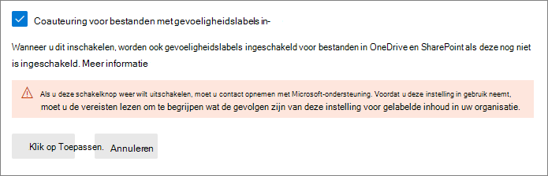
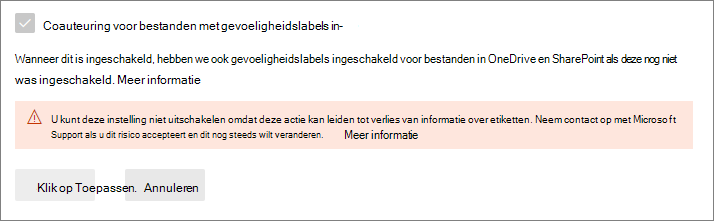

# <a name="enable-co-authoring-for-files-encrypted-with-sensitivity-labels"></a>Cocreatie inschakelen voor bestanden die zijn versleuteld met gevoeligheidslabels

>*[Richtlijnen voor Microsoft 365-licenties voor beveiliging en compliance](/office365/servicedescriptions/microsoft-365-service-descriptions/microsoft-365-tenantlevel-services-licensing-guidance/microsoft-365-security-compliance-licensing-guidance).*

> [!NOTE]
> Deze functie is beschikbaar als preview en kan worden gewijzigd. 
>
> Schakel deze functie in op een test-tenant in plaats van op een productie-tenant:
> - Met deze functie worden metagegevens gelabeld. Momenteel ondersteunen niet alle apps op alle platforms deze wijziging
> - U kunt deze functie niet zelf uitschakelen nadat deze is ingeschakeld

Schakel de instelling in om [cocreatie](https://support.office.com/article/ee1509b4-1f6e-401e-b04a-782d26f564a4) te ondersteunen voor Office-bureaublad-apps, zodat meerdere gebruikers deze documenten tegelijkertijd kunnen bewerken wanneer documenten worden gelabeld en versleuteld met [gevoeligheidslabels](sensitivity-labels.md).

Als deze instelling niet voor uw tenant is ingeschakeld, moeten gebruikers een versleuteld document uitchecken dat is opgeslagen in SharePoint of OneDrive wanneer ze Office-bureaublad-apps gebruiken. Hierdoor kunnen ze niet in realtime samenwerken. Of ze moeten de webversie van Office gebruiken wanneer [gevoeligheidslabels zijn ingeschakeld voor Office-bestanden in SharePoint en OneDrive](sensitivity-labels-sharepoint-onedrive-files.md).

Door deze functionaliteit in te schakelen, wordt [automatisch opslaan](https://support.office.com/article/what-is-autosave-6d6bd723-ebfd-4e40-b5f6-ae6e8088f7a5) ondersteund voor deze gelabelde en versleutelde bestanden.

Lees de releaseaankondiging in het blogbericht [Introductie van cocreatie van versleutelde documenten in Microsoft Information Protection en updates voor labelen](https://techcommunity.microsoft.com/t5/microsoft-security-and/announcing-co-authoring-on-microsoft-information-protection/ba-p/2164162).

## <a name="metadata-changes-for-sensitivity-labels"></a>Wijzigingen in metagegevens voor gevoeligheidslabels

> [!IMPORTANT]
> Nadat u de instelling voor cocreatie hebt ingeschakeld, wordt labelinformatie voor niet-versleutelde bestanden niet meer opgeslagen in aangepaste eigenschappen.
> 
> Schakel deze instelling niet in als u apps, services, scripts of hulpprogramma's gebruikt waarmee metagegevens naar de oude locatie worden gelezen of geschreven.

Voordat u de instelling voor ondersteuning van cocreatie voor Office-bureaublad-apps inschakelt, is het belangrijk om te weten dat deze actie wijzigingen toepast in de metagegevens van labels die worden opgeslagen in en gelezen vanuit Office-bestanden.

De metagegevens van de labels bevatten informatie die uw tenant en het toegepaste gevoeligheidslabel identificeert. De wijziging door deze instelling betreft de indeling van metagegevens en de locatie van Word-, Excel- en PowerPoint-bestanden. U hoeft geen actie te ondernemen voor versleutelde bestanden of e-mails. De wijziging van de metagegevens voor versleutelde bestanden is compatibel met eerdere versies en er zijn geen wijzigingen voor e-mailberichten. U moet echter wel rekening houden met de wijzigingen in metagegevens voor versleutelde bestanden die automatisch kunnen worden bijgewerkt, maar die niet compatibel zijn met eerdere versies.

Deze wijziging heeft gevolgen voor zowel bestanden met een nieuw label als voor bestanden die al een label hebben. Wanneer u apps en services gebruikt die ondersteuning bieden voor instellingen voor cocreatie:
- Voor bestanden die net zijn gelabeld, worden alleen de nieuwe indeling en locatie gebruikt voor de metagegevens van het label.
- Als een bestand dat al een label heeft metagegevens bevat met een oude indeling en locatie, wordt dat bestand naar de nieuwe indeling en locatie gekopieerd als het opnieuw wordt geopend.

Meer informatie over deze wijziging in metagegevens vindt u in de volgende bronnen:

- Blogbericht: [Wijzigingen in de opslag van metagegevens van Microsoft Information Protection](https://techcommunity.microsoft.com/t5/microsoft-security-and/upcoming-changes-to-microsoft-information-protection-metadata/ba-p/1904418)

- Open Specifications: [2.6.3 LabelInfo versus Custom Document Properties](/openspecs/office_file_formats/ms-offcrypto/13939de6-c833-44ab-b213-e0088bf02341)

Schakel deze instelling als gevolg van deze wijzigingen niet in als u in uw organisatie apps, services, scripts of hulpprogramma's gebruikt waarmee metagegevens voor labels naar de oude locatie worden gelezen of geschreven. Doet u dit wel, zijn dit enkele van de gevolgen:

- Een document met een label wordt zonder label weergegeven aan gebruikers

- In een document wordt een verouderd label weergegeven aan gebruikers

- Cocreatie en Automatisch opslaan werken niet voor een gelabeld en versleuteld document als een andere gebruiker het heeft geopend in een Office-bureaublad-app die geen ondersteuning biedt voor de nieuwe metagegevens voor labeling

- Een Exchange Online-regel voor de e-mailstroom die [labels identificeert als aangepaste eigenschappen in Office-bijlagen](/azure/information-protection/configure-exo-rules#example-2-rule-that-applies-the-encrypt-only-option-to-emails-when-they-have-attachments-that-are-labeled-confidential--partners-and-these-emails-are-sent-outside-the-organization) versleutelt de e-mail en bijlage niet of versleutelt deze onjuist

Raadpleeg de volgende sectie voor een lijst met apps en services die deze instelling en de wijzigingen in de metagegevens voor labels ondersteunen.

## <a name="prerequisites"></a>Vereisten

Zorg dat u de volgende vereisten begrijpt voordat u deze functie inschakelt.

- U moet een test-tenant gebruiken voor deze preview.

- U moet een globale beheerder zijn om deze functie te kunnen inschakelen.

- Gevoeligheidslabels moeten zijn [ingeschakeld voor Office-bestanden in SharePoint en OneDrive](sensitivity-labels-sharepoint-onedrive-files.md) voor de tenant. Als deze functie nog niet is ingeschakeld, wordt deze automatisch ingeschakeld wanneer u de instelling selecteert om cocreatie in te schakelen voor bestanden met gevoeligheidslabels.

- Microsoft 365 Apps voor ondernemingen:
    - **Windows**: Preview: [Huidig kanaal (Preview)](https://office.com/insider)
    - **macOS**: Preview: [Huidig kanaal (Preview)](https://office.com/insider)
    - **iOS**: nog niet ondersteund
    - **Android**: nog niet ondersteund

- Alle apps, services en operationele hulpprogramma's in uw tenant moeten de nieuwe functies voor [metagegevens voor labels](#metadata-changes-for-sensitivity-labels) ondersteunen. Controleer de vereiste minimale versies als u een van de volgende versies gebruikt:
    
    - **Geïntegreerde Azure Information Protection-labelclient en -scanner:**
        - Een openbare preview-versie (installatienaam: AzInfoProtection_2.10.46_CoAuthoring_PublicPreview.exe) die u kunt installeren via het [Microsoft Downloadcentrum](https://www.microsoft.com/en-us/download/details.aspx?id=53018)
    
    - **OneDrive-synchronisatie-app voor Windows of macOS:**
        - Minimaal versie 19.002.0121.0008
    
    - **Preventie van gegevensverlies van eindpunten (Eindpunt-DLP):**
        - Windows 10 1809 met KB 4601383
        - Windows 10 1903 en 1909 met KB 4601380
        - Windows 10 2004 met KB 4601382
    
    - **Apps en services die gebruikmaken van de Microsoft Information Protection-SDK:** 
        - Minimaal versie 1.7 

Microsoft 365-services ondersteunen automatisch de nieuwe metagegevens voor labels wanneer u deze functie in schakelt. Bijvoorbeeld:

- [Beleid voor automatisch labelen](apply-sensitivity-label-automatically.md#how-to-configure-auto-labeling-policies-for-sharepoint-onedrive-and-exchange)
- [DLP-beleid dat gevoeligheidslabels als voorwaarden gebruikt](dlp-sensitivity-label-as-condition.md)
- [Microsoft Cloud App Security geconfigureerd voor het toepassen van gevoeligheidslabels](/cloud-app-security/best-practices#discover-classify-label-and-protect-regulated-and-sensitive-data-stored-in-the-cloud)

## <a name="limitations"></a>Beperkingen

Voordat u de tenantinstelling voor cocreatie inschakelt voor bestanden die met gevoeligheidslabels zijn versleuteld, moet u de volgende beperkingen van deze functie begrijpen.

- Vanwege de [wijzigingen in metagegevens voor labels](#metadata-changes-for-sensitivity-labels) moeten alle apps, services en operationele hulpmiddelen in uw tenant de nieuwe metagegevens voor labeling ondersteunen voor een consistente en betrouwbare labelervaring.
    
    Specifiek voor Excel: metagegevens voor een gevoeligheidslabel dat geen versleuteling gebruikt, kunnen worden verwijderd uit een bestand als iemand dat bestand bewerkt en opslaat met een versie van Excel die geen ondersteuning biedt voor de wijzigingen in metagegevens voor gevoeligheidslabels.

- Cocreatie en Automatisch opslaan worden niet ondersteund en werken niet voor gelabelde en versleutelde Office-documenten die een van de volgende [configuraties voor versleuteling](encryption-sensitivity-labels.md#configure-encryption-settings) gebruiken:
    - **Gebruikers machtigingen laten toewijzen wanneer ze het label toepassen** en het selectievakje **Vraag in Word, PowerPoint en Excel gebruikers om machtigingen op te geven** is geselecteerd. Deze configuratie wordt soms 'door de gebruiker gedefinieerde machtigingen' genoemd.
    - **Gebruikerstoegang tot inhoud verloopt** wordt ingesteld op een andere waarde dan **Nooit**.
    - **Dubbele sleutelcodering** is geselecteerd.
    
    Labels met deze versleutelingsconfiguraties worden weergegeven in Office-apps. Wanneer gebruikers deze labels echter selecteren en niemand anders het document bewerkt, krijgen ze een waarschuwing dat Cocreatie en Automatisch opslaan niet beschikbaar zijn. Als iemand anders het document bewerkt, zien gebruikers een bericht dat de labels niet kunnen worden toegepast.

- Als u de geïntegreerde labelclient van Azure Information Protection gebruikt: raadpleeg de documentatie voor deze labelclient voor [meer vereisten of beperkingen](/azure/information-protection/known-issues#known-issues-for-co-authoring-public-preview).

## <a name="known-issues-for-this-preview"></a>Bekende problemen in deze preview

Deze preview-versie van cocreatie voor bestanden die zijn versleuteld met gevoeligheidslabels heeft de volgende bekende problemen:

- Gebruikers kunnen in Office geen labels toepassen in de webversie van Office voor Word-, Excel- en PowerPoint-bestanden die groter zijn dan 300 MB. Voor deze bestanden kunt u de Office-bureaublad-apps gebruiken om een label toe te passen, maar u moet de enige persoon zijn die het bestand heeft geopend.

- Wanneer u een [DLP-beleid gebruikt dat gevoeligheidslabels als voorwaarden gebruikt](dlp-sensitivity-label-as-condition.md), worden niet-versleutelde bijlagen voor e-mailberichten niet ondersteund.

- Sommige documenten zijn niet compatibel met gevoeligheidslabels vanwege functies zoals [wachtwoordbeveiliging](https://support.microsoft.com/office/require-a-password-to-open-or-modify-a-workbook-10579f0e-b2d9-4c05-b9f8-4109a6bce643), [gedeelde werkmappen](https://support.microsoft.com/office/about-the-shared-workbook-feature-49b833c0-873b-48d8-8bf2-c1c59a628534) of inhoud met ActiveX-besturingselementen. Andere redenen worden beschreven in [Problemen met coauteur in Office oplossen](https://support.microsoft.com/office/troubleshoot-co-authoring-in-office-bd481512-3f3a-4b6d-b7eb-ebf9d3626ae7). Voor deze documenten ziet u een bericht **UPLOADEN IS MISLUKT** en moet u de optie **Wijzigingen negeren** selecteren. Label de documenten die met dit foutbericht zijn geïdentificeerd pas als dit probleem is opgelost.

- Office-apps voor iOS en Android worden niet ondersteund.

## <a name="how-to-enable-co-authoring-for-files-with-sensitivity-labels"></a>Cocreatie inschakelen voor bestanden met gevoeligheidslabels

> [!CAUTION]
> Het inschakelen is een eenzijdige actie. Test de functie in de preview-versie alleen in een niet-productieomgeving en pas nadat u de wijzigingen in de metagegevens en de vereisten, beperkingen en eventuele bekende problemen die op deze pagina worden beschreven, hebt gelezen en begrepen.

Tijdens de preview moet u een specifieke URL gebruiken om toegang te krijgen tot deze instelling in het Microsoft 365-compliancecentrum.

1. Meld u aan bij het Microsoft 365-compliancecentrum als globale beheerder voor uw test-tenant via de volgende koppeling:
    
    ```http
    https://compliance.microsoft.com/co-authoring_for_files_with_sensitivity_labels
    ```
    Via deze koppeling verwijst u rechtstreeks naar de tenantinstelling **Cocreatie voor bestanden met gevoeligheidslabels**.

    > [!IMPORTANT]
    > Controleer voordat u verder gaat of u bent aangemeld bij een test-tenant die geen invloed heeft op uw gebruikers: 
    >
    > Selecteer de cirkel met de initialen van uw account rechtsboven in het compliancecentrum en controleer of bij de naam van de tenant de beoogde test-tenant wordt weergegeven.
    
2. Lees de beschrijving, de vereisten, wat u kunt verwachten en de waarschuwing dat u deze instelling niet kunt uitschakelen nadat u deze hebt ingeschakeld. Selecteer daarna **Cocreatie inschakelen voor bestanden met gevoeligheidslabels** en **Toepassen**:
    
    

3. Wacht 24 uur totdat deze instelling is gerepliceerd in uw omgeving voordat u deze nieuwe functie voor cocreatie test.

## <a name="contact-support-if-you-need-to-disable-this-feature"></a>Neem contact op met ondersteuning als u deze functie wilt uitschakelen

> [!IMPORTANT]
> Als u deze functie toch moet uitschakelen, moet u er rekening mee houden dat labelgegevens verloren kunnen gaan.

Nadat u cocreatie voor bestanden met gevoeligheidslabels voor uw tenant hebt ingeschakeld, kunt u deze instelling niet zelf uitschakelen. Daarom is het zo belangrijk dat u de vereisten, gevolgen en beperkingen controleert en begrijpt voordat u deze instelling inschakelt. Het is ook raadzaam om deze functie te testen met een test-tenant in plaats van een productie-tenant.



Zoals u ziet in de schermafbeelding wanneer deze instelling is ingeschakeld, kunt u contact opnemen met [Microsoft Ondersteuning](../business-video/get-help-support.md) en vragen deze instelling uit te schakelen. Het kan enkele dagen duren voordat deze aanvraag wordt behandeld en u moet bewijzen dat u een globale beheerder van uw tenant bent. Houd rekening met de gebruikelijke kosten voor ondersteuning. 

Als een ondersteuningstechnicus deze instelling uit uitschakelt voor uw tenant:

- Apps en services die ondersteuning bieden voor de nieuwe metagegevens voor labelen keren ze nu terug naar de oorspronkelijke metagegevensindeling en locatie wanneer labels worden gelezen of opgeslagen.

- De nieuwe indeling van metagegevens en de locatie voor Office-documenten die werden gebruikt toen de instelling werd ingeschakeld, worden niet gekopieerd naar de oorspronkelijke indeling en locatie. Hierdoor gaan deze labelgegevens voor niet-versleutelde Word-, Excel- en PowerPoint-bestanden verloren.

- Cocreatie en Automatisch opslaan werken niet langer in uw tenant voor gelabelde en versleutelde documenten.

- Gevoeligheidslabels blijven ingeschakeld voor Office-bestanden in OneDrive en SharePoint.