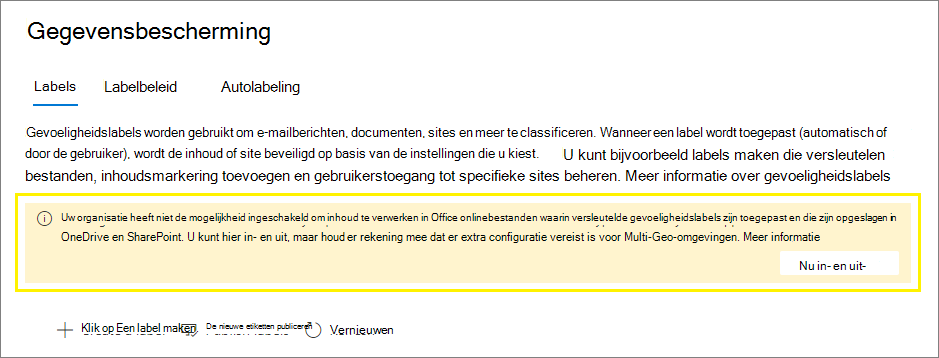

# <a name="enable-sensitivity-labels-for-office-files-in-sharepoint-and-onedrive"></a>Vertrouwelijkheidslabels inschakelen voor Office-bestanden in SharePoint en OneDrive

>*[Richtlijnen voor Microsoft 365-licenties voor beveiliging en compliance](/office365/servicedescriptions/microsoft-365-service-descriptions/microsoft-365-tenantlevel-services-licensing-guidance/microsoft-365-security-compliance-licensing-guidance).*

Schakel ingebouwde labeling in voor [ondersteunde Office](sensitivity-labels-office-apps.md#office-file-types-supported) bestanden in SharePoint en OneDrive zodat gebruikers uw gevoeligheidslabels [kunnen](sensitivity-labels.md) toepassen in webversie van Office. Wanneer deze functie is ingeschakeld,  zien gebruikers de knop Gevoeligheid op het lint, zodat ze etiketten kunnen toepassen en eventuele toegepaste labelnaam op de statusbalk kunnen zien.

Als u deze functie inschakelen, kunnen SharePoint en OneDrive ook de inhoud van Office bestanden verwerken die zijn versleuteld met een gevoeligheidslabel. Het label kan worden toegepast in webversie van Office of in Office bureaublad-apps en worden geüpload of opgeslagen in SharePoint en OneDrive. Totdat u deze functie inschakelen, kunnen deze services geen versleutelde bestanden verwerken, wat betekent dat coauthoring, eDiscovery, Preventie van gegevensverlies, zoeken en andere samenwerkingsfuncties niet werken voor deze bestanden.

Nadat u gevoeligheidslabels hebt ingeschakeld voor Office-bestanden in SharePoint en OneDrive, voor nieuwe en gewijzigde bestanden met een gevoeligheidslabel waarmee versleuteling wordt toegepast met een cloudsleutel (en geen dubbele sleutelversleuteling wordt [gebruikt):](double-key-encryption.md)

- Voor Word, Excel en PowerPoint, herkennen SharePoint en OneDrive het label en kunnen ze nu de inhoud van het versleutelde bestand verwerken.

- Wanneer gebruikers deze bestanden downloaden of openen vanuit SharePoint of OneDrive, worden het gevoeligheidslabel en eventuele versleutelingsinstellingen van het label afgedwongen en blijven ze bij het bestand, waar het ook wordt opgeslagen. Zorg ervoor dat u gebruikers richtlijnen geeft om alleen etiketten te gebruiken om documenten te beveiligen. Zie [IRM-opties (Information Rights Management) en gevoeligheidslabels voor meer informatie.](sensitivity-labels-office-apps.md#information-rights-management-irm-options-and-sensitivity-labels)

- Wanneer gebruikers gelabelde en versleutelde bestanden uploaden naar SharePoint of OneDrive, moeten ze ten minste weergaverechten hebben voor die bestanden. Ze kunnen de bestanden bijvoorbeeld buiten de SharePoint. Als ze dit minimumgebruik niet juist hebben, is het uploaden geslaagd, maar herkent de service het label niet en kan de bestandsinhoud niet worden verwerkt.

- Gebruik webversie van Office (Word, Excel, PowerPoint) om bestanden Office te openen en te bewerken met gevoeligheidslabels die versleuteling toepassen. De machtigingen die aan de versleuteling zijn toegewezen, worden afgedwongen. U kunt ook [automatische labeling gebruiken voor](apply-sensitivity-label-automatically.md) deze documenten.

- Externe gebruikers hebben toegang tot documenten met een versleutelingslabel met gastaccounts. Zie Ondersteuning voor externe gebruikers en [gelabelde inhoud](sensitivity-labels-office-apps.md#support-for-external-users-and-labeled-content)voor meer informatie.

- Office 365 eDiscovery ondersteunt zoeken in volledige tekst naar deze bestanden en DLP-beleid (Data Loss Prevention) ondersteunt inhoud in deze bestanden.

> [!NOTE]
> Als versleuteling is toegepast met een on-premises sleutel (een topologie voor sleutelbeheer die vaak wordt aangeduid als 'houd uw eigen sleutel' of HYOK) of met behulp van [Dubbele](double-key-encryption.md)sleutelversleuteling, verandert het servicegedrag voor het verwerken van de bestandsinhoud niet. Voor deze bestanden werken coauthoring, eDiscovery, Preventie van gegevensverlies, zoeken en andere samenwerkingsfuncties dus niet.
>
> Het SharePoint en OneDrive wordt ook niet gewijzigd voor bestaande bestanden op deze locaties die zijn gelabeld met versleuteling met één Azure-sleutel. Als u deze bestanden wilt laten profiteren van de nieuwe mogelijkheden nadat u gevoeligheidslabels hebt ingeschakeld voor Office-bestanden in SharePoint en OneDrive, moeten de bestanden opnieuw worden gedownload en geüpload of bewerkt.

Nadat u gevoeligheidslabels hebt ingeschakeld voor Office-bestanden in SharePoint en [](search-the-audit-log-in-security-and-compliance.md#sensitivity-label-activities) OneDrive, zijn er drie nieuwe auditgebeurtenissen beschikbaar voor het controleren van gevoeligheidslabels die worden toegepast op documenten in SharePoint en OneDrive:

- **Toegepaste gevoeligheidslabel op bestand**
- **Gewijzigde gevoeligheidslabel toegepast op bestand**
- **Gevoeligheidslabel verwijderd van bestand**

Bekijk de volgende video (geen audio) om de nieuwe mogelijkheden in actie te zien:

> [!VIDEO https://www.microsoft.com/videoplayer/embed//RE4ornZ]

U hebt altijd de keuze om gevoeligheidslabels voor Office bestanden in SharePoint en OneDrive[(opt-out)](#how-to-disable-sensitivity-labels-for-sharepoint-and-onedrive-opt-out)op elk moment uit te schakelen.

Als u momenteel documenten in SharePoint beschermt met behulp van SharePoint Information Rights Management (IRM), controleert u de sectie [SharePoint Information Rights Management (IRM)](#sharepoint-information-rights-management-irm-and-sensitivity-labels) en gevoeligheidslabels op deze pagina.

## <a name="requirements"></a>Vereisten

Deze nieuwe mogelijkheden werken alleen met [gevoeligheidslabels.](sensitivity-labels.md) Als u momenteel Azure Information Protection-labels hebt, moet u deze eerst migreren naar gevoeligheidslabels, zodat u deze functies kunt inschakelen voor nieuwe bestanden die u uploadt. Zie [Azure Information Protection-labels migreren naar geïntegreerde vertrouwelijkheidslabels](/azure/information-protection/configure-policy-migrate-labels) voor instructies.

Gebruik de OneDrive-synchronisatie app versie 19.002.0121.0008 of hoger op Windows en versie 19.002.0107.0008 of hoger op Mac. Beide versies zijn uitgebracht op 28 januari 2019 en worden momenteel voor alle ringen uitgebracht. Zie de opmerkingen over de [OneDrive release voor meer informatie.](https://support.office.com/article/845dcf18-f921-435e-bf28-4e24b95e5fc0) Nadat u gevoeligheidslabels hebt ingeschakeld voor Office bestanden in SharePoint en OneDrive, worden gebruikers die een oudere versie van de synchronisatie-app uitvoeren, gevraagd deze bij te werken.

## <a name="limitations"></a>Beperkingen

- SharePoint en OneDrive kunnen bepaalde bestanden die zijn gelabeld en versleuteld vanuit Office-bureaublad-apps, niet verwerken wanneer deze bestanden PowerQuery-gegevens bevatten, gegevens die zijn opgeslagen door aangepaste invoegtoepassing of aangepaste XML-onderdelen, zoals Eigenschappen voor voorpagina's, inhoudstypeschema's, aangepast documentinformatiepaneel en Aangepaste XSN. Deze beperking geldt ook voor bestanden waarop een [document-id](https://support.microsoft.com/office/enable-and-configure-unique-document-ids-ea7fee86-bd6f-4cc8-9365-8086e794c984) is toegevoegd wanneer ze worden geüpload.

    Voor deze bestanden kunt u een label zonder versleuteling toepassen, zodat ze later in webversie van Office kunnen worden geopend, of gebruikers instrueren de bestanden te openen in hun bureaublad-apps. Bestanden die alleen zijn gelabeld en versleuteld in webversie van Office worden niet beïnvloed.

- SharePoint en OneDrive worden niet automatisch gevoeligheidslabels toegepast op bestaande bestanden die u al hebt versleuteld met Azure Information Protection-labels. Als u de functies wilt laten werken nadat u gevoeligheidslabels hebt ingeschakeld voor Office bestanden in SharePoint en OneDrive, kunt u de volgende taken uitvoeren:

    1. Zorg ervoor dat u [de Azure Information Protection-labels](/azure/information-protection/configure-policy-migrate-labels) hebt gemigreerd naar gevoeligheidslabels en deze hebt gepubliceerd [vanaf](create-sensitivity-labels.md#publish-sensitivity-labels-by-creating-a-label-policy) de Microsoft 365-compliancecentrum.
    2. Download de gelabelde bestanden en upload ze vervolgens naar de oorspronkelijke locatie in SharePoint of OneDrive.

- SharePoint en OneDrive kunnen versleutelde bestanden niet verwerken wanneer het label waarop de versleuteling is toegepast, een van de volgende configuraties voor [versleuteling heeft:](encryption-sensitivity-labels.md#configure-encryption-settings)
  - **Gebruikers machtigingen laten toewijzen wanneer ze het label toepassen** en het selectievakje **Vraag in Word, PowerPoint en Excel gebruikers om machtigingen op te geven** is geselecteerd. Deze instelling wordt soms 'door de gebruiker gedefinieerde machtigingen' genoemd.
  - **Gebruikerstoegang tot inhoud verloopt** wordt ingesteld op een andere waarde dan **Nooit**.
  - **Dubbele sleutelcodering** is geselecteerd.

    Voor etiketten met een van deze versleutelingsconfiguraties worden de etiketten niet weergegeven voor gebruikers in webversie van Office. Bovendien kunnen de nieuwe mogelijkheden niet worden gebruikt met documenten met een label die al deze versleutelingsinstellingen hebben. Deze documenten worden bijvoorbeeld niet geretourneerd in zoekresultaten, zelfs niet als ze worden bijgewerkt.

- Als u een document uploadt naar SharePoint en het label van het bestand geen  versleuteling gebruikt, kan het even duren voordat de labelnaam wordt weergegeven in de kolom Gevoeligheid in de documentbibliotheek. Factor in deze vertraging als u scripts of automatisering gebruikt die afhankelijk zijn van de labelnaam in deze kolom.

- Als een document is gelabeld terwijl het is uitgecheckt [in SharePoint,](https://support.microsoft.com/office/check-out-check-in-or-discard-changes-to-files-in-a-library-7e2c12a9-a874-4393-9511-1378a700f6de)wordt de labelnaam pas weergegeven in de kolom Gevoeligheid in de documentbibliotheek als het document is ingecheckt en vervolgens wordt geopend in SharePoint. 

- Als een gelabeld en versleuteld document wordt gedownload van SharePoint of OneDrive door een app of service die een servicenaam gebruikt en vervolgens opnieuw wordt geüpload met een label dat verschillende versleutelingsinstellingen van toepassing is, mislukt het uploaden. Een voorbeeldscenario is Microsoft Cloud App Security een gevoeligheidslabel voor  een bestand wijzigt van Vertrouwelijk in **Zeer** vertrouwelijk, of van Vertrouwelijk **naar** **Algemeen.**
    
    Het uploaden mislukt niet als de app of service eerst de [cmdlet Unlock-SPOSensitivityLabelEncryptedFile](/powershell/module/sharepoint-online/unlock-sposensitivitylabelencryptedFile) voert, zoals wordt uitgelegd in de sectie Versleuteling verwijderen voor een gelabeld [document.](#remove-encryption-for-a-labeled-document) Of voordat u het uploadt, wordt het oorspronkelijke bestand verwijderd of wordt de bestandsnaam gewijzigd.

- Gebruikers kunnen vertragingen ervaren bij het openen van versleutelde documenten in het volgende scenario Opslaan als: Met een bureaubladversie van Office kiest een gebruiker Opslaan als voor een document met een gevoeligheidslabel waarin versleuteling wordt toegepast. De gebruiker selecteert SharePoint of OneDrive voor de locatie en probeert dat document vervolgens onmiddellijk te openen in webversie van Office. Als de service de versleuteling nog steeds verwerkt, ziet de gebruiker een bericht dat het document moet worden geopend in de bureaublad-app. Als ze het binnen een paar minuten opnieuw proberen, wordt het document geopend in webversie van Office.

- Voor versleutelde documenten wordt afdrukken niet ondersteund.

- Voor een versleuteld document dat bewerkingsmachtigingen verleent aan een gebruiker, kan kopiëren niet worden geblokkeerd in de webversies van de Office apps.

- Standaard bieden Office bureaublad-apps en mobiele apps geen ondersteuning voor co-authoring voor bestanden die zijn gelabeld met versleuteling. Deze apps blijven gelabelde en versleutelde bestanden openen in de exclusieve bewerkingsmodus.

    > [!NOTE]
    > Coauteuring wordt nu ondersteund in de preview-versie. Zie Coauteuring inschakelen voor bestanden die zijn versleuteld met [gevoeligheidslabels](sensitivity-labels-coauthoring.md)voor meer informatie.

- Als een beheerder de instellingen wijzigt voor een gepubliceerd label dat al is toegepast op bestanden die zijn gedownload naar de synchronisatieclient van gebruikers, kunnen gebruikers mogelijk geen wijzigingen in het bestand opslaan in hun OneDrive Synchronisatiemap. Dit scenario is van toepassing op bestanden die zijn gelabeld met versleuteling, en ook wanneer de labelwijziging afkomstig is van een label dat geen versleuteling heeft toegepast op een label dat wel versleuteling gebruikt. Gebruikers zien een rode cirkel met een fout met een wit [kruispictogram](https://support.office.com/article/what-do-the-onedrive-icons-mean-11143026-8000-44f8-aaa9-67c985aa49b3)en ze worden gevraagd om nieuwe wijzigingen op te slaan als een afzonderlijke kopie. In plaats daarvan kunnen ze het bestand sluiten en opnieuw openen of webversie van Office.

- Gebruikers kunnen problemen met opslaan ervaren nadat ze offline of in een slaapmodus zijn gegaan wanneer ze in plaats van webversie van Office de bureaublad- en mobiele apps voor Word, Excel of PowerPoint. Wanneer deze gebruikers hun Office-app hervatten en wijzigingen proberen op te slaan, zien ze een foutbericht voor uploaden met een optie om een kopie op te slaan in plaats van het oorspronkelijke bestand op te slaan.

- Documenten die op de volgende manieren zijn versleuteld, kunnen niet worden geopend in webversie van Office:
  - Versleuteling die een on-premises sleutel gebruikt ("houd uw eigen sleutel vast" of HYOK)
  - Versleuteling die is toegepast met [dubbele sleutelversleuteling](double-key-encryption.md)
  - Versleuteling die onafhankelijk van een label is toegepast, bijvoorbeeld door rechtstreeks een rights management-beveiligingssjabloon toe te passen.

- Labels die zijn geconfigureerd [voor andere talen,](create-sensitivity-labels.md#additional-label-settings-with-security--compliance-center-powershell) worden niet ondersteund en geven alleen de oorspronkelijke taal weer.

- Schermopnamen kunnen niet worden voorkomen voor versleutelde documenten. Zie Kan Rights Management schermopnamen voorkomen voor [meer informatie?](/azure/information-protection/faqs-rms#can-rights-management-prevent-screen-captures)

- Als u een label verwijdert dat is toegepast op een document in SharePoint of OneDrive, in plaats van het label te verwijderen uit het toepasselijke labelbeleid, wordt het document bij het downloaden niet gelabeld of versleuteld. In vergelijking: als het document met het label buiten de SharePoint of OneDrive wordt opgeslagen, blijft het document versleuteld als het label wordt verwijderd. Hoewel u tijdens een testfase labels kunt verwijderen, is het zeer zeldzaam om een label in een productieomgeving te verwijderen.

## <a name="how-to-enable-sensitivity-labels-for-sharepoint-and-onedrive-opt-in"></a>Gevoeligheidslabels inschakelen voor SharePoint en OneDrive (opt-in)

U kunt de nieuwe mogelijkheden inschakelen met behulp van de Microsoft 365-compliancecentrum of met PowerShell. Net als bij alle configuratiewijzigingen op tenantniveau voor SharePoint en OneDrive, duurt het ongeveer 15 minuten voordat de wijziging van kracht wordt.

### <a name="use-the-compliance-center-to-enable-support-for-sensitivity-labels"></a>Het compliancecentrum gebruiken om ondersteuning voor gevoeligheidslabels in te stellen

Deze optie is de eenvoudigste manier om gevoeligheidslabels in te SharePoint en OneDrive, maar u moet zich aanmelden als globale beheerder voor uw tenant.

1. Meld u aan bij [de Microsoft 365-compliancecentrum](https://compliance.microsoft.com/) globale beheerder en ga naar **Solutions**  >  **Information Protection**

    Als u deze optie niet meteen ziet, selecteert u eerst **Alles weergeven**.

2. Als u een bericht ziet waarin u de mogelijkheid ziet om inhoud te verwerken in Office onlinebestanden, selecteert u **Nu in- en uit:**

    

    De opdracht wordt onmiddellijk uitgevoerd en wanneer de pagina de volgende keer wordt vernieuwd, ziet u het bericht of de knop niet meer.

> [!NOTE]
> Als u meerdere Microsoft 365 hebt, moet u PowerShell gebruiken om deze mogelijkheden in te stellen voor al uw geografische locaties. Zie de volgende sectie voor meer informatie.

### <a name="use-powershell-to-enable-support-for-sensitivity-labels"></a>PowerShell gebruiken om ondersteuning voor gevoeligheidslabels in te stellen

Als alternatief voor het gebruik van het compliancecentrum kunt u ondersteuning voor gevoeligheidslabels inschakelen met de cmdlet [Set-SPOTenant](/powershell/module/sharepoint-online/set-spotenant) van SharePoint Online PowerShell.

Als u meerdere Microsoft 365 hebt, moet u PowerShell gebruiken om deze ondersteuning in te stellen voor al uw geografische locaties.

#### <a name="prepare-the-sharepoint-online-management-shell"></a>De online SharePoint Online Management Shell voorbereiden

Voordat u de PowerShell-opdracht uit te voeren om gevoeligheidslabels in te stellen voor Office-bestanden in SharePoint en OneDrive, controleert u of u SharePoint Online Management Shell versie 16.0.19418.12000 of hoger gebruikt. Als u al de nieuwste versie hebt, kunt u naar de [volgende procedure](#run-the-powershell-command-to-enable-support-for-sensitivity-labels) gaan om de PowerShell-opdracht uit te voeren.

1. Als u een vorige versie van de SharePoint Online Management Shell hebt geïnstalleerd vanuit de PowerShell-galerie, kunt u de module bijwerken door de volgende cmdlet uit te werken.

    ```PowerShell
    Update-Module -Name Microsoft.Online.SharePoint.PowerShell
    ```

2. Als u een eerdere versie van de SharePoint Online Management Shell hebt geïnstalleerd vanuit het  Microsoft Downloadcentrum, kunt u ook naar Programma's toevoegen of verwijderen gaan en de SharePoint Online Management Shell verwijderen.

3. Ga in een webbrowser naar de pagina Downloadcentrum en download de nieuwste [SharePoint Online Management Shell.](https://go.microsoft.com/fwlink/p/?LinkId=255251)

4. Selecteer uw taal en klik vervolgens op **Downloaden.**

5. Kies tussen het x64- en x86-.msi bestand. Download het x64-bestand als u de 64-bits versie van Windows of het x86-bestand gebruikt als u de 32-bits versie gebruikt. Als u het niet weet, zie [Welke versie van Windows besturingssysteem gebruik ik?](https://support.microsoft.com/help/13443/windows-which-operating-system)

6. Nadat u het bestand hebt gedownload, voer u het bestand uit en volgt u de stappen in de wizard Setup.

#### <a name="run-the-powershell-command-to-enable-support-for-sensitivity-labels"></a>De powershell-opdracht uitvoeren om ondersteuning voor gevoeligheidslabels in te stellen

Als u de nieuwe mogelijkheden wilt inschakelen, gebruikt u de cmdlet [Set-SPOTenant](/powershell/module/sharepoint-online/set-spotenant) met de *parameter EnableAIPIntegration:*

1. Als u een werk- of schoolaccount gebruikt met globale beheerders- of SharePoint beheerdersbevoegdheden in Microsoft 365, maakt u verbinding met SharePoint. Zie Aan de slag [met SharePoint Online Management Shell voor meer informatie.](/powershell/sharepoint/sharepoint-online/connect-sharepoint-online)

    > [!NOTE]
    > Als u Microsoft 365 Multi-Geo hebt, gebruikt u de parameter -Url met [Verbinding maken-SPOService](/powershell/module/sharepoint-online/connect-sposervice)en geeft u de url van de SharePoint Online Administration Center-site op voor een van uw geografische locaties.

2. Voer de volgende opdracht uit en druk **op Y** om dit te bevestigen:

    ```PowerShell
    Set-SPOTenant -EnableAIPIntegration $true
    ```
3. Voor Microsoft 365 Multi-Geo: Herhaal stap 1 en 2 voor elk van de resterende geografische locaties.

## <a name="publishing-and-changing-sensitivity-labels"></a>Gevoeligheidslabels publiceren en wijzigen

Wanneer u gevoeligheidslabels gebruikt met SharePoint en OneDrive, moet u replicatietijd toestaan wanneer u nieuwe gevoeligheidslabels publiceert of bestaande gevoeligheidslabels bij werk. Dit is vooral belangrijk voor nieuwe etiketten die versleuteling toepassen.

Bijvoorbeeld: U maakt en publiceert een nieuw gevoeligheidslabel waarmee versleuteling wordt toegepast en het wordt heel snel weergegeven in de bureaublad-app van een gebruiker. De gebruiker past dit label toe op een document en uploadt het vervolgens naar SharePoint of OneDrive. Als de labelreplicatie nog niet is voltooid voor de service, worden de nieuwe mogelijkheden niet toegepast op dat document tijdens het uploaden. Hierdoor wordt het document niet geretourneerd in zoekopdrachten of eDiscovery en kan het document niet worden geopend in webversie van Office.

De volgende wijzigingen worden binnen een uur gerepliceerd: Nieuwe en verwijderde gevoeligheidslabels en beleidsinstellingen voor gevoeligheidslabels waarin wordt vermeld welke labels in het beleid staan.

De volgende wijzigingen worden binnen 24 uur gerepliceerd: Wijzigingen in gevoeligheidslabelinstellingen voor bestaande etiketten.

Omdat de replicatievertraging slechts één uur is voor nieuwe gevoeligheidslabels, is het onwaarschijnlijk dat het scenario in het voorbeeld wordt uitgevoerd. Maar als vrijwaring raden we aan om eerst nieuwe etiketten te publiceren voor slechts een paar testgebruikers, een uur te wachten en vervolgens het gedrag van etiketten op SharePoint en OneDrive. Als laatste stap maakt u het label beschikbaar voor meer gebruikers door meer gebruikers toe te voegen aan het bestaande labelbeleid of het label toe te voegen aan een bestaand labelbeleid voor uw standaardgebruikers. Op het moment dat uw standaardgebruikers het label zien, is het al gesynchroniseerd met SharePoint en OneDrive.

## <a name="sharepoint-information-rights-management-irm-and-sensitivity-labels"></a>SharePoint IRM (Information Rights Management) en gevoeligheidslabels

[SharePoint Information Rights Management (IRM)](set-up-irm-in-sp-admin-center.md) is een oudere technologie om bestanden op lijst- en bibliotheekniveau te beveiligen door versleuteling en beperkingen toe te passen wanneer bestanden worden gedownload. Deze oudere beveiligingstechnologie is ontworpen om te voorkomen dat onbevoegde gebruikers het bestand openen terwijl het buiten de SharePoint.

Ter vergelijking: gevoeligheidslabels bieden naast versleuteling ook de beveiligingsinstellingen van visuele markeringen (kopteksten, voetteksten, watermerken). De versleutelingsinstellingen [](/azure/information-protection/configure-usage-rights) ondersteunen het volledige bereik van gebruiksrechten om te beperken wat gebruikers met de inhoud kunnen doen en dezelfde gevoeligheidslabels worden ondersteund voor [veel scenario's.](get-started-with-sensitivity-labels.md#common-scenarios-for-sensitivity-labels) Als u dezelfde beveiligingsmethode gebruikt met consistente instellingen voor werkbelastingen en apps, resulteert dit in een consistente beveiligingsstrategie.

U kunt echter beide beveiligingsoplossingen samen gebruiken en het gedrag is als volgt:

- Als u een bestand uploadt met een gevoeligheidslabel dat versleuteling van toepassing is, kunnen SharePoint de inhoud van deze bestanden niet verwerken, zodat coauthoring, eDiscovery, DLP en zoeken niet worden ondersteund voor deze bestanden.

- Als u een bestand labelt met webversie van Office, worden versleutelingsinstellingen van het label afgedwongen. Voor deze bestanden worden coauthoring, eDiscovery, DLP en zoeken ondersteund.

- Als u een bestand downloadt dat is gelabeld met webversie van Office, blijft het label behouden en worden versleutelingsinstellingen van het label afgedwongen in plaats van de instellingen voor IRM-beperkingen.

- Als u een bestand Office pdf-bestand dat niet is versleuteld met een gevoeligheidslabel, worden IRM-instellingen toegepast.

- Als u een van de extra IRM-bibliotheekinstellingen hebt ingeschakeld, waaronder voorkomen dat gebruikers documenten uploaden die geen ondersteuning bieden voor IRM, worden deze instellingen afgedwongen.

Met dit gedrag kunt u er zeker van zijn dat alle Office en PDF-bestanden zijn beveiligd tegen onbevoegde toegang als ze worden gedownload, zelfs als ze niet zijn gelabeld. Gelabelde bestanden die worden geüpload, profiteren echter niet van de nieuwe mogelijkheden.


## <a name="search-for-documents-by-sensitivity-label"></a>Documenten zoeken op gevoeligheidslabel

Gebruik de beheerde eigenschap **InformationProtectionLabelId** om alle documenten te zoeken in SharePoint of OneDrive met een specifiek gevoeligheidslabel. Gebruik de volgende syntaxis: `InformationProtectionLabelId:<GUID>`

Als u bijvoorbeeld wilt zoeken naar alle documenten die zijn gelabeld als 'Vertrouwelijk', en dat label een GUID heeft van '8faca7b8-8d20-48a3-8ea2-0f96310a848e', typt u in het zoekvak:

```
InformationProtectionLabelId:8faca7b8-8d20-48a3-8ea2-0f96310a848e
```

Zoeken vindt geen gelabelde documenten in een gecomprimeerd bestand, zoals een .zip bestand.

Gebruik de [cmdlet Get-Label](/powershell/module/exchange/get-label) om de GUID's voor uw gevoeligheidslabels op te halen:

1. Maak eerst [verbinding met Office 365 Security & Compliance Center PowerShell](/powershell/exchange/office-365-scc/connect-to-scc-powershell/connect-to-scc-powershell).

    Meld u bijvoorbeeld in een PowerShell-sessie die u uitvoert als beheerder aan met een globalebeheerdersaccount.

2. Voer vervolgens de volgende opdracht uit:

    ```powershell
    Get-Label |ft Name, Guid
    ```

Zie Het zoekschema beheren in SharePoint voor meer informatie over het gebruik [van beheerde eigenschappen.](/sharepoint/manage-search-schema)

## <a name="remove-encryption-for-a-labeled-document"></a>Versleuteling voor een document met label verwijderen

Er kunnen zeldzame gevallen zijn dat een beheerder SharePoint versleuteling moet verwijderen uit een document dat is opgeslagen in SharePoint. Elke gebruiker met het [rights management-gebruiksrecht](/azure/information-protection/configure-usage-rights#usage-rights-and-descriptions) van Exporteren of Volledig beheer dat aan hen is toegewezen voor dat document, kan versleuteling verwijderen die is toegepast door de Azure Rights Management-service van Azure Information Protection. Gebruikers met een van deze gebruiksrechten kunnen bijvoorbeeld een label vervangen dat versleuteling door een label zonder versleuteling van toepassing is. Een [supergebruiker](/azure/information-protection/configure-super-users) kan het bestand ook downloaden en een lokale kopie opslaan zonder de versleuteling.

Als alternatief kan een globale beheerder [of SharePoint-beheerder](/sharepoint/sharepoint-admin-role) de [cmdlet Unlock-SPOSensitivityLabelEncryptedFile](/powershell/module/sharepoint-online/unlock-sposensitivitylabelencryptedFile) uitvoeren, waardoor zowel het gevoeligheidslabel als de versleuteling worden verwijderd. Deze cmdlet wordt uitgevoerd, zelfs als de beheerder geen toegangsmachtigingen voor de site of het bestand heeft of als de Azure Rights Management service niet beschikbaar is.

Bijvoorbeeld:

```powershell
Unlock-SPOSensitivityLabelEncryptedFile -FileUrl "https://contoso.com/sites/Marketing/Shared Documents/Doc1.docx" -JustificationText "Need to decrypt this file"
```

Vereisten:

- SharePoint Online Management Shell versie 16.0.20616.12000 of hoger.

- De versleuteling is toegepast door een [gevoeligheidslabel](encryption-sensitivity-labels.md#assign-permissions-now) met door beheerders gedefinieerde versleutelingsinstellingen (de labelinstellingen Machtigingen nu toewijzen). [Dubbele sleutelversleuteling](encryption-sensitivity-labels.md#double-key-encryption) wordt niet ondersteund voor deze cmdlet.

De uitvullingstekst wordt toegevoegd aan de [auditgebeurtenis](search-the-audit-log-in-security-and-compliance.md#sensitivity-label-activities) van **Het** gevoeligheidslabel Verwijderd uit een bestand en de ontsleutelingsactie wordt ook opgenomen in de logboekregistratie voor beveiligingsgebruik [voor Azure Information Protection.](/azure/information-protection/log-analyze-usage)

## <a name="how-to-disable-sensitivity-labels-for-sharepoint-and-onedrive-opt-out"></a>Gevoeligheidslabels uitschakelen voor SharePoint en OneDrive (opt-out)

Als u deze nieuwe mogelijkheden uit schakelt, blijven bestanden die u hebt geüpload nadat u gevoeligheidslabels voor SharePoint en OneDrive hebt ingeschakeld, beveiligd door het label omdat de labelinstellingen nog steeds worden afgedwongen. Wanneer u gevoeligheidslabels op nieuwe bestanden toe te passen nadat u deze nieuwe mogelijkheden hebt uitgeschakeld, werken full-text search, eDiscovery en coauthoring niet meer.

Als u deze nieuwe mogelijkheden wilt uitschakelen, moet u PowerShell gebruiken. Met de SharePoint Online Management Shell en de cmdlet [Set-SPOTenant](/powershell/module/sharepoint-online/set-spotenant) geeft u dezelfde *Parameter EnableAIPIntegration* op als beschreven in de sectie [PowerShell](#use-powershell-to-enable-support-for-sensitivity-labels) gebruiken om ondersteuning voor gevoeligheidslabels in te stellen. Maar stel deze keer de parameterwaarde in op onwaar en druk **op Y** om het volgende te bevestigen:

```PowerShell
Set-SPOTenant -EnableAIPIntegration $false
```

Als u meerdere Microsoft 365 hebt, moet u deze opdracht uitvoeren voor elk van uw geografische locaties.

## <a name="next-steps"></a>Volgende stappen

Nadat u gevoeligheidslabels hebt ingeschakeld voor Office bestanden in SharePoint en OneDrive, kunt u overwegen deze bestanden automatisch te labelen met behulp van beleidsregels voor automatisch labelen. Zie Een gevoeligheidslabel automatisch toepassen op inhoud voor [meer informatie.](apply-sensitivity-label-automatically.md)

Wilt u uw gelabelde en versleutelde documenten delen met personen buiten uw organisatie?  Zie [Versleutelde documenten delen met externe gebruikers](sensitivity-labels-office-apps.md#sharing-encrypted-documents-with-external-users).
