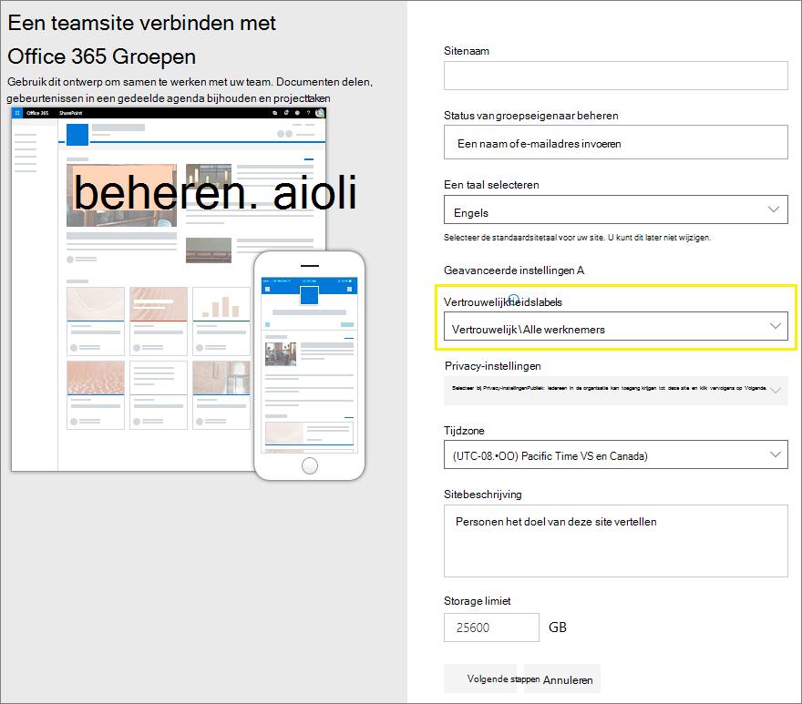
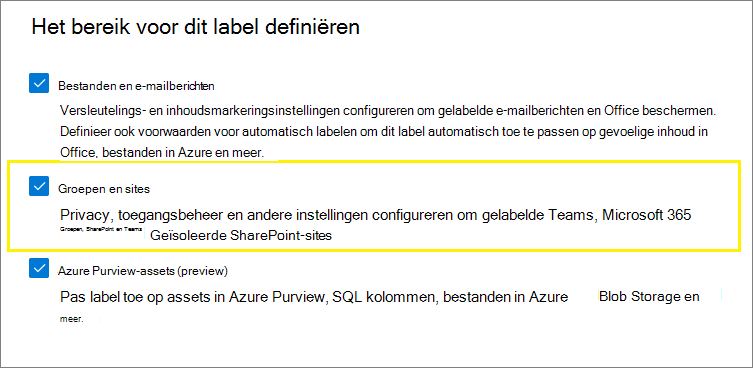
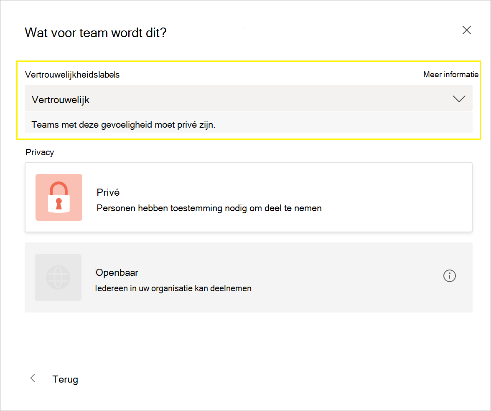
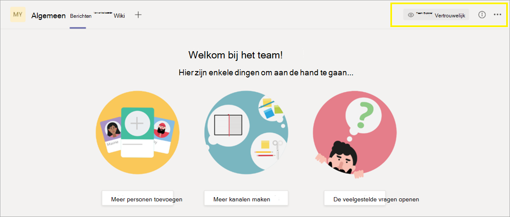
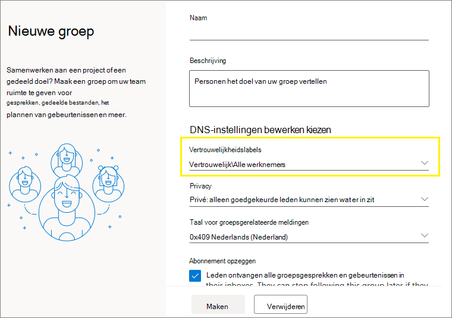
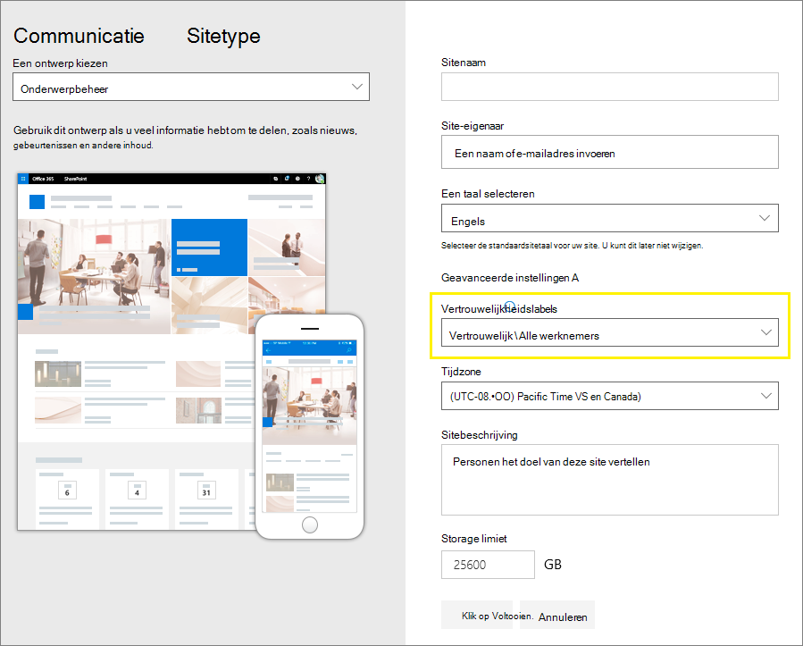
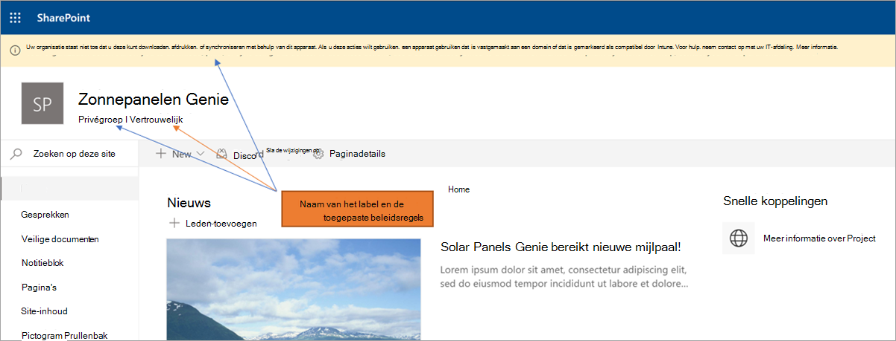

# <a name="use-sensitivity-labels-to-protect-content-in-microsoft-teams-microsoft-365-groups-and-sharepoint-sites"></a>Vertrouwelijkheidslabels gebruiken om inhoud te beveiligen in Microsoft Teams, Microsoft 365 Groepen en SharePoint-sites

>*[Richtlijnen voor Microsoft 365-licenties voor beveiliging en compliance](/office365/servicedescriptions/microsoft-365-service-descriptions/microsoft-365-tenantlevel-services-licensing-guidance/microsoft-365-security-compliance-licensing-guidance).*

Naast het gebruik van [vertrouwelijkheidslabels](sensitivity-labels.md) om documenten en e-mailberichten te classificeren en beveiligen, kunt u vertrouwelijkheidslabels ook gebruiken om inhoud in de volgende containers te beveiligen: Microsoft Teams-sites, Microsoft 365 Groepen ([voorheen Office 365 Groepen](https://techcommunity.microsoft.com/t5/microsoft-365-blog/office-365-groups-will-become-microsoft-365-groups/ba-p/1303601)) en SharePoint-sites. Voor deze classificatie en beveiliging op containerniveau gebruikt u de volgende labelinstellingen:

- Privacy (openbaar of privé) van teams-sites en Microsoft 365-groepen 
- Externe gebruikerstoegang
- Extern delen vanaf SharePoint-sites
- Toegang vanaf niet-beheerde apparaten

> [!IMPORTANT]
> De instelling **Toegang vanaf niet-beheerde apparaten** werkt samen met de SharePoint-functie om [toegang te beheren vanaf niet-beheerde apparaten](/sharepoint/control-access-from-unmanaged-devices). U moet deze afhankelijke SharePoint-functie configureren om een vertrouwelijkheidslabel te gebruiken waarin deze instelling is geconfigureerd. Aanvullende informatie kunt u vinden in de instructies die volgen.

Wanneer u dit vertrouwelijkheidslabel toepast op een ondersteunde container past het label automatisch de classificatie en geconfigureerde beveiligingsinstellingen toe op de site of groep.

Inhoud in deze containers neemt echter de labels niet over voor de classificatie of instellingen voor bestanden en e-mailberichten, zoals visuele markeringen en versleuteling. Om ervoor te zorgen dat gebruikers hun documenten op SharePoint- of teamsites kunnen labelen, moet u [vertrouwelijkheidslabels inschakelen voor Office-bestanden in SharePoint en OneDrive](sensitivity-labels-sharepoint-onedrive-files.md).

> [!NOTE]
> Vertrouwelijkheidslabels voor containers worden niet ondersteund met Office 365 CDN's (Content Delivery Networks).

## <a name="using-sensitivity-labels-for-microsoft-teams-microsoft-365-groups-and-sharepoint-sites"></a>Vertrouwelijkheidslabels gebruiken voor Microsoft Teams, Microsoft 365 Groepen en SharePoint-sites

Voordat u vertrouwelijkheidslabels inschakelt voor containers en vertrouwelijkheidheidslabels configureert voor de nieuwe instellingen konden gebruikers vertrouwelijkheidslabels in hun apps zien en toepassen. Vanuit Word bijvoorbeeld:


Nadat u vertrouwelijkheidslabels inschakelt en configureert voor containers kunnen gebruikers bovendien vertrouwelijkheidslabels zien en toepassen op Microsoft-teamsites, Microsoft 365 Groepen en SharePoint-sites. Bijvoorbeeld wanneer u een nieuwe teamsite maakt in SharePoint:



## <a name="how-to-enable-sensitivity-labels-for-containers-and-synchronize-labels"></a>Vertrouwelijkheidslabels voor containers inschakelen en labels synchroniseren

1. Volg de instructies in de Azure AD-documentatie om ondersteuning van vertrouwelijkheidslabels in te schakelen, omdat deze functie gebruikmaakt van Azure AD-functionaliteit: [Vertrouwelijkheidslabels toewijzen aan Microsoft 365 Groepen in Azure Active Directory](/azure/active-directory/users-groups-roles/groups-assign-sensitivity-labels).

2. U moet nu uw vertrouwelijkheidslabels synchroniseren met Azure AD. Maak als eerste [verbinding met PowerShell van het beveiligings- en compliancecentrum](/powershell/exchange/office-365-scc/connect-to-scc-powershell/connect-to-scc-powershell).

   Meld u bijvoorbeeld in een PowerShell-sessie die u uitvoert als beheerder aan met een globalebeheerdersaccount.

3. Voer dan de volgende opdracht uit om ervoor te zorgen dat uw vertrouwelijkheidslabels met Microsoft 365 Groepen kunnen worden gebruikt:

    ```powershell
    Execute-AzureAdLabelSync
    ```

## <a name="how-to-configure-groups-and-site-settings"></a>Groep- en site-instellingen configureren

Als u vertrouwelijkheidslabels inschakelt voor containers, betekent dat dat u nu beveiligingsinstellingen kunt configureren voor groepen en sites in de wizard vertrouwelijkheidslabels. Totdat u deze ondersteuning inschakelt, zijn de instellingen wel zichtbaar in de wizard, maar kunt u ze niet configureren.

1. Volg de algemene instructies om [een vertrouwelijkheidslabel te maken of te bewerken](create-sensitivity-labels.md#create-and-configure-sensitivity-labels) en zorg ervoor dat u **Groepen en sites** selecteert voor het bereik van het label: 
    
    
    
    Wanneer alleen dit bereik is geselecteerd voor het label, wordt het label niet weergegeven in Office-apps die vertrouwelijkheidslabels ondersteunen en kan het niet worden toegepast op bestanden en e-mailberichten. Deze scheiding van labels kan zowel voor gebruikers als beheerders handig zijn, maar het kan ook de implementatie van uw labels complexer maken.
    
    U moet bijvoorbeeld zorgvuldig uw [labelvolgorde](sensitivity-labels.md#label-priority-order-matters) controleren, omdat SharePoint detecteert wanneer een document met label wordt geüpload naar een site met een label. In dit scenario wordt automatisch een auditgebeurtenis en e-mail gegenereerd wanneer het document een vertrouwelijkheidslabel met hogere prioriteit heeft dan het label van de site. Zie het gedeelte [Activiteiten van vertrouwelijkheidslabels controleren](#auditing-sensitivity-label-activities) voor meer informatie. 

2. Selecteer vervolgens op de pagina **Beveiligingsinstellingen definiëren voor groepen en sites** een of beide beschikbare opties:
    
    - **Instellingen voor privacy en externegebruikerstoegang** om de instellingen **Privacy** en **Externegebruikerstoegang** te configureren. 
    - **Apparaattoegang en instellingen voor extern delen** om de instelling **Extern delen beheren vanuit SharePoint-sites met label** en **Toegang vanaf onbeheerde apparaten** te configureren.

3. Als u **Instellingen voor privacy en externegebruikerstoegang** hebt geselecteerd, kunt u nu de volgende instellingen configureren:
    
    - **Privacy**: houd de standaardinstelling **Openbaar** als u iedereen in uw organisatie toegang wilt verlenen tot de teamsite of groep waarop dit label is toegepast.
        
        Selecteer **Persoonlijk** als u de toegang wilt beperken tot alleen goedgekeurde leden van uw organisatie.
        
        Selecteer **Geen** als u inhoud in de container wilt beveiligen met behulp van het vertrouwelijkheidslabel, maar gebruikers zelf de privacyinstelling wilt laten configureren.
        
        De instellingen van **Openbaar** of **Persoonlijk** stellen de privacyinstelling in en vergrendelen die wanneer u dit label toepast op de container. De door u gekozen instelling vervangt alle eerdere privacyinstellingen die zijn geconfigureerd voor het team of de groep en vergrendelt de privacywaarde, zodat die alleen kan worden gewijzigd door eerst het vertrouwelijkheidslabel van de container te verwijderen. Nadat u het vertrouwelijkheidslabel hebt verwijderd, blijft de privacyinstelling van het label behouden en kunnen gebruikers dit weer wijzigen.
    
    - **Externegebruikerstoegang**: bepaalt of de groepseigenaar [gasten aan de groep kan toevoegen](/office365/admin/create-groups/manage-guest-access-in-groups).

4. Als u **Apparaattoegang en instellingen voor extern delen** hebt geselecteerd, kunt u de volgende instellingen configureren:
    
    - **Extern delen van gelabelde SharePoint-sites beheren**: selecteer deze optie om vervolgens te kiezen voor extern delen voor iedereen, nieuwe en bestaande gasten, bestaande gasten of alleen personen in uw organisatie. Zie de SharePoint-documentatie [Extern delen in- of uitschakelen voor een site](/sharepoint/change-external-sharing-site) voor meer informatie over deze configuratie en instellingen.
    
    - **Toegang vanaf onbeheerde apparaten**: deze optie maakt gebruik van de SharePoint-functie die voorwaardelijke toegang van Azure AD gebruikt om toegang tot SharePoint en OneDrive-inhoud vanaf onbeheerde apparaten te blokkeren of te beperken. Zie [Toegang vanaf onbeheerde apparaten beheren](/sharepoint/control-access-from-unmanaged-devices) van de SharePoint-documentatie voor meer informatie. De optie die u voor deze labelinstelling opgeeft, is hetzelfde als het uitvoeren van een PowerShell-opdracht voor een site, zoals beschreven in stappen 3 - 5 van het gedeelte [Toegang blokkeren of beperken tot een specifieke SharePoint-site of OneDrive](/sharepoint/control-access-from-unmanaged-devices#block-or-limit-access-to-a-specific-sharepoint-site-or-onedrive) van de SharePoint-instructies.
        
        Zie [Meer informatie over de afhankelijkheden voor de optie onbeheerde apparaten](#more-information-about-the-dependencies-for-the-unmanaged-devices-option) aan het einde van dit gedeelte voor meer informatie.

> [!IMPORTANT]
> Alleen deze site- en groepsinstellingen worden van kracht wanneer u het label toepast op een team, groep of site. Als het [bereik van het label](sensitivity-labels.md#label-scopes) bestanden en e-mailberichten omvat, worden andere labelinstellingen, zoals versleuteling en inhoudsmarkering, niet toegepast op de inhoud binnen het team, de groep of de site.

Als uw vertrouwelijkheidslabel nog niet is gepubliceerd, publiceert u het nu door [het toe te voegen aan het beleid voor vertrouwelijkheidslabels](create-sensitivity-labels.md#publish-sensitivity-labels-by-creating-a-label-policy). De gebruikers aan wie beleid voor vertrouwelijkheidslabels met dit label is toegewezen, kunnen het selecteren voor sites en groepen.

##### <a name="more-information-about-the-dependencies-for-the-unmanaged-devices-option"></a>Meer informatie over de optie afhankelijkheden voor de onbeheerde apparaten

Als u het beleid voor afhankelijke voorwaardelijke toegang voor SharePoint, zoals beschreven in [Door apps afgedwongen beperkingen](/sharepoint/app-enforced-restrictions), niet configureert, zal de optie die u hier opgeeft geen effect hebben. Bovendien heeft het geen effect als het minder beperkend is dan een geconfigureerde instelling op tenantniveau. Als u een organisatiebrede instelling voor onbeheerde apparaten hebt geconfigureerd, kies dan een labelinstelling die hetzelfde is of verder beperkend.

Als uw tenant bijvoorbeeld is geconfigureerd voor **Beperkte toegang via internet toegestaan**, zal de labelinstelling die volledige toegang toestaat geen effect hebben, omdat die minder beperkend is. Kies voor deze instelling op tenantniveau de labelinstelling die toegang blokkeert (verder beperkend) of de labelinstelling voor beperkte toegang (hetzelfde als de tenantinstelling).

Omdat u de SharePoint-instellingen afzonderlijk van de labelconfiguratie kunt configureren, kunt u in de wizard voor vertrouwelijkheidslabels niet controleren of de afhankelijkheden goed zijn ingesteld. Deze afhankelijkheden kunnen worden geconfigureerd nadat het label is gemaakt en gepubliceerd en zelfs nadat het label is toegepast. Als het label echter al bestaat, wordt de labelinstelling pas van kracht nadat de gebruiker de volgende keer wordt geverifieerd.

## <a name="sensitivity-label-management"></a>Beheer van vertrouwelijkheidslabels

Gebruik de volgende richtlijnen wanneer u vertrouwelijkheidslabels die zijn geconfigureerd voor sites en groepen maakt, wijzigt of verwijdert.

### <a name="creating-and-publishing-labels-that-are-configured-for-sites-and-groups"></a>Labels maken en publiceren die zijn geconfigureerd voor sites en groepen

Wanneer een nieuw vertrouwelijkheidslabel wordt gemaakt en gepubliceerd, is het binnen een uur zichtbaar voor gebruikers in teams, groepen en sites. Wanneer u echter een bestaand label wijzigt, kan dat maximaal 24 uur duren. Gebruik de volgende richtlijnen om een label te publiceren voor uw gebruikers wanneer dat label is geconfigureerd voor site- en groepsinstellingen:

1. Nadat u het vertrouwelijkheidslabel hebt gemaakt en geconfigureerd, voegt u het label toe aan labelbeleid dat slechts op een aantal testgebruikers van toepassing is.

2. Wacht op de replicatie van de wijziging:

   - Nieuw label: wacht een uur.
   - Bestaand label: wacht 24 uur.

3. Gebruik na deze wachttijd een van de testgebruikersaccounts om een team, Microsoft 365-groep of SharePoint-site te maken met het label dat u in stap 1 hebt gemaakt.

4. Als er geen fouten optreden tijdens deze maakactie weet u zeker dat het veilig is om het label te publiceren voor alle gebruikers in uw tenant.

### <a name="modifying-published-labels-that-are-configured-for-sites-and-groups"></a>Gepubliceerde labels bewerken die zijn geconfigureerd voor sites en groepen

U kunt het beste de site- en groepsinstellingen voor een vertrouwelijkheidslabel niet wijzigen nadat het label is toegepast op teams, groepen of sites. Als u dat toch doet, denk er dan aan 24 uur te wachten zodat de wijzigingen zijn gerepliceerd naar alle containers waarop het label is toegepast.

Als de wijzigingen ook de instelling **Toegang van externe gebruikers** inhouden:

- is de nieuwe instelling van toepassing op nieuwe gebruikers maar niet op bestaande gebruikers. Als deze instelling bijvoorbeeld eerder was geselecteerd en gastgebruikers hierdoor toegang hebben gekregen tot de site, hebben deze gastgebruikers nog steeds toegang tot de site nadat deze instelling is verwijderd uit de labelconfiguratie.

- De privacyinstellingen voor de groepseigenschappen hiddenMembership en roleEnabled worden niet bijgewerkt.

### <a name="deleting-published-labels-that-are-configured-for-sites-and-groups"></a>Gepubliceerde labels verwijderen dier zijn geconfigureerd voor sites en groepen

Als u een vertrouwelijkheidslabel verwijdert waarvan de site- en groepsinstellingen zijn ingeschakeld en het label is inbegrepen in een of meerdere labelbeleidsregels, kan deze actie resulteren in fouten bij het maken van nieuwe teams, groepen en sites. Om deze situatie te voorkomen, gebruikt u de volgende richtlijnen:

1. Verwijder het vertrouwelijkheidslabel uit alle labelbeleidsregels waarin dat label is opgenomen.

2. Wacht een uur.

3. Na deze wachttijd kunt u proberen een team, groep of site te maken en controleren of het label niet langer zichtbaar is.

4. Als het vertrouwelijkheidslabel niet zichtbaar is, kunt u het label veilig verwijderen.

## <a name="how-to-apply-sensitivity-labels-to-containers"></a>Vertrouwelijkheidslabels toepassen op containers

U kun nu het vertrouwelijkheidslabel/de vertrouwelijkheidslabels toepassen op de volgende containers:

- [Microsoft 365-groep in Azure AD](#apply-sensitivity-labels-to-microsoft-365-groups)
- [Microsoft Teams-teamsite](#apply-a-sensitivity-label-to-a-new-team)
- [Microsoft 365-groep in de webversie van Outlook](#apply-a-sensitivity-label-to-a-new-group-in-outlook-on-the-web)
- [SharePoint-site](#apply-a-sensitivity-label-to-a-new-site)

U kunt PowerShell gebruiken als u [een vertrouwelijkheidslabel moet toepassen op meerdere sites](#use-powershell-to-apply-a-sensitivity-label-to-multiple-sites).

### <a name="apply-sensitivity-labels-to-microsoft-365-groups"></a>Vertrouwelijkheidslabels toepassen op Microsoft 365-groepen

U kunt nu het vertrouwelijkheidslabel/de vertrouwelijkheidslabels toepassen op Microsoft 365-groepen. Ga terug naar de Azure AD-documentatie voor instructies:

- [Een label toewijzen aan een nieuwe groep in Azure Portal](/azure/active-directory/users-groups-roles/groups-assign-sensitivity-labels#assign-a-label-to-a-new-group-in-azure-portal)

- [Een label toewijzen aan een bestaande groep in Azure Portal](/azure/active-directory/users-groups-roles/groups-assign-sensitivity-labels#assign-a-label-to-an-existing-group-in-azure-portal)

- [Een label verwijderen van een bestaande groep in Azure Portal](/azure/active-directory/users-groups-roles/groups-assign-sensitivity-labels#remove-a-label-from-an-existing-group-in-azure-portal).

### <a name="apply-a-sensitivity-label-to-a-new-team"></a>Een vertrouwelijkheidslabel toepassen op een nieuw team

Gebruikers kunnen vertrouwelijkheidslabels selecteren wanneer ze nieuwe teams maken in Microsoft Teams. Wanneer ze het label selecteren in het vervolgkeuzemenu **Vertrouwelijkheid** kan de privacyinstelling wijzigen om de labelconfiguratie te weerspiegelen. Afhankelijk van de instelling voor toegang van externe gebruikers die u hebt geselecteerd voor het label, kunnen gebruikers wel of niet personen buiten de organisatie aan het team toevoegen.

[Meer informatie over vertrouwelijkheidslabels voor Teams](/microsoftteams/sensitivity-labels)



Nadat u het team hebt gemaakt, verschijnt het vertrouwelijkheidslabel in de rechterbovenhoek van alle kanalen.



Hetzelfde vertrouwelijkheidslabel wordt automatisch toegepast op de Microsoft 365-groep en de verbonden SharePoint-teamsite.

### <a name="apply-a-sensitivity-label-to-a-new-group-in-outlook-on-the-web"></a>Een vertrouwelijkheidslabel toepassen op een nieuwe groep in de webversie van Outlook

In de webversie van Outlook kunt u wanneer u een nieuwe groep maakt de optie **Vertrouwelijkheid** voor gepubliceerde labels selecteren of wijzigen:



### <a name="apply-a-sensitivity-label-to-a-new-site"></a>Een vertrouwelijkheidslabel toepassen op een nieuwe site

Beheerders en eindgebruikers kunnen vertrouwelijkheidslabels selecteren wanneer ze [moderne team- en communicatiesites maken](/sharepoint/create-site-collection) en **Geavanceerde instellingen** uitvouwen:



In het vervolgkeuzevak worden de labelnamen voor de selectie weergegeven en in het helppictogram worden alle labelnamen weergegeven met hun knopinfo, zodat gebruikers het juiste label om toe te passen, kunnen bepalen.

Wanneer het label is toegepast en gebruikers naar de site bladeren, zien ze de naam van het label en toegepaste beleid. Deze site is bijvoorbeeld gelabeld als **Vertrouwelijk** en de privacyinstelling is ingesteld op **Persoonlijk**:



### <a name="use-powershell-to-apply-a-sensitivity-label-to-multiple-sites"></a>PowerShell gebruiken om een vertrouwelijkheidslabel toe te passen op meerdere sites

U kunt de cmdlet [Set-SPOSite](/powershell/module/sharepoint-online/set-sposite) en [Set-SPOTenant](/powershell/module/sharepoint-online/set-spotenant) gebruiken met de parameter *SensitivityLabel* van de huidige [SharePoint Online Management Shell](/powershell/sharepoint/sharepoint-online/connect-sharepoint-online) om een vertrouwelijkheidslabel toe te passen op veel sites. De sites kunnen een SharePoint-siteverzameling zijn of een OneDrive-site.

Zorg ervoor dat u versie 16.0.19418.12000 of hoger hebt van de SharePoint Online Management Shell.

1. Open een PowerShell-sessie met de optie **Als administrator uitvoeren**.

2. Als u uw label-GUID niet kent: [Maakt u verbinding met PowerShell van het beveiligings- en compliancecentrum](/powershell/exchange/connect-to-scc-powershell) en haalt u de lijst met vertrouwelijkheidslabels en hun GUID's op.

   ```powershell
   Get-Label |ft Name, Guid
   ```

3. [Maak nu verbinding met SharePoint Online PowerShell](/powershell/sharepoint/sharepoint-online/connect-sharepoint-online) en sla uw label-GUID op als variabele. Bijvoorbeeld:

   ```powershell
   $Id = [GUID]("e48058ea-98e8-4940-8db0-ba1310fd955e")
   ```

4. Maak een nieuwe variabele die meerdere sites identificeert die een identificerende tekenreeks gemeen hebben in hun URL. Bijvoorbeeld:

   ```powershell
   $sites = Get-SPOSite -IncludePersonalSite $true -Limit all -Filter "Url -like 'documents"
   ```

5. Voer de volgende opdracht uit om het label toe te passen op deze sites. Aan de hand van onze voorbeelden:

   ```powershell
   $sites | ForEach-Object {Set-SPOTenant $_.url -SensitivityLabel $Id}
   ```

Met deze reeks opdrachten kunt u meerdere sites in uw tenant labelen met hetzelfde vertrouwelijkheidslabel. Daarom gebruikt u de cmdlet Set-SPOTenant in plaats van de cmdlet Set-SPOSite die is bedoeld voor de configuratie per site. Gebruik echter de cmdlet Set-SPOSite wanneer u een ander label wilt toepassen op specifieke sites door de volgende opdracht te herhalen voor elke site: `Set-SPOSite -Identity <URL> -SensitivityLabel "<labelguid>"`

## <a name="view-and-manage-sensitivity-labels-in-the-sharepoint-admin-center"></a>Vertrouwelijkheidslabels bekijken en beheren in het SharePoint-beheercentrum

Om de toegepaste vertrouwelijkheidslabels te bekijken, te sorteren en te doorzoeken, gebruikt u de pagina **Actieve sites** in het nieuwe SharePoint-beheercentrum. Mogelijk moet u eerst de kolom **Vertrouwelijkheid** toevoegen:


Zie [Sites beheren in het nieuwe SharePoint-beheercentrum](/sharepoint/manage-sites-in-new-admin-center) voor meer informatie over sites beheren vanaf de pagina Actieve sites, waaronder ook het toevoegen van een kolom.

U kunt ook een label wijzigen en toepassen vanaf deze pagina:

1. Selecteer de sitenaam om het detailvenster te openen.

2. Selecteer het tabblad **Beleid** en vervolgens **Bewerken** voor de instelling **Vertrouwelijkheid**.

3. Selecteer in het deelvenster **Vertrouwelijkheidsinstelling bewerken** het vertrouwelijkheidslabel dat u op de site wilt toepassen en selecteer dan **Opslaan**.

## <a name="support-for-sensitivity-labels"></a>Groepen voor vertrouwelijkheidslabels.

De volgende apps en services ondersteunen vertrouwelijkheidslabels die zijn geconfigureerd voor sites en groepsinstellingen:

- Beheercentra

  - SharePoint-beheercentrum
  - Azure Active Directory Portal
  - Microsoft 365-beheercentrum
  - Microsoft 365-compliancecentrum, Microsoft 365-beveiligingscentrum, Beveiligings- en compliancecentrum

- Gebruikers-apps en -services:

  - SharePoint
  - Teams
  - Webversie van Outlook en versie voor Windows, macOS, iOS en Android
  - Forms
  - Stream
  - Planner 

De volgende apps en services ondersteunen momenteel geen vertrouwelijkheidslabels die zijn geconfigureerd voor sites en groepsinstellingen:

- Beheercentra

  - Teams-beheercentrum
  - Exchange-beheercentrum

- Gebruikers-apps en -services:

  - Dynamics 365
  - Yammer
  - Project
  - Power BI

## <a name="classic-azure-ad-group-classification"></a>Klassieke Azure AD-groepsclassificatie

Microsoft 365 ondersteunt de oude classificaties voor nieuwe Microsoft 365-groepen en SharePoint-sites niet meer nadat u vertrouwelijkheidslabels voor containers hebt ingeschakeld. Bestaande groepen en sites die vertrouwelijkheidslabels ondersteunen, geven echter nog steeds de oude classificatiewaarden weer totdat u ze converteert voor het gebruik van vertrouwelijkheidslabels.

Zie [Classificatie van 'moderne' SharePoint-sites](/sharepoint/dev/solution-guidance/modern-experience-site-classification) als voorbeeld van hoe u de oude groepsclassificatie voor SharePoint mogelijk hebt gebruikt.

Deze classificaties waren geconfigureerd met Azure AD PowerShell of de PnP-kernbibliotheek en door waarden te definiëren voor de instelling `ClassificationList`. Als er voor uw tenant classificatiewaarden zijn gedefinieerd, worden ze weergegeven wanneer u de volgend opdracht uitvoert vanuit de [AzureADPreview PowerShell-module](https://www.powershellgallery.com/packages/AzureADPreview):

```powershell
($setting["ClassificationList"])
```

Om uw oude classificaties te converteren naar vertrouwelijkheidslabels gaat u op een van de volgende manieren te werk:

- Bestaande labels gebruiken: specificeer de labelinstellingen voor sites en groepen door bestaande vertrouwelijkheidslabels die al zijn gepubliceerd, te bewerken.

- Nieuwe labels maken: specificeer de labelinstellingen voor sites en groepen door nieuwe vertrouwelijkheidslabels te maken en te publiceren die dezelfde namen hebben als uw bestaande classificaties.

Voer vervolgens de volgende handelingen uit:

1. Gebruik PowerShell om de vertrouwelijkheidslabels toe te passen op bestaande Microsoft 365-groepen en SharePoint-sites door naamtoewijzing te gebruiken. Zie het volgende gedeelte voor instructies.

2. Verwijder de oude classificaties van de bestaande groepen en sites.

Hoewel u niet kunt voorkomen dat gebruikers nieuwe groepen maken in apps en services die nog geen vertrouwelijkheidslabels ondersteunen, kunt u een terugkerend PowerShell-script uitvoeren dat zoekt naar nieuwe groepen die door gebruikers met de oude classificaties zijn gemaakt en deze converteren om vertrouwelijkheidslabels te gebruiken.

Zie [Azure Active Directory-classificatie en vertrouwelijkheidslabels voor Microsoft 365-groepen](migrate-aad-classification-sensitivity-labels.md) om u te helpen bij het beheer van naast elkaar bestaande vertrouwelijkheidslabels en Azure AD-classificaties voor sites en groepen.

### <a name="use-powershell-to-convert-classifications-for-microsoft-365-groups-to-sensitivity-labels"></a>PowerShell gebruiken om classificaties voor Microsoft 365-groepen te converteren naar vertrouwelijkheidslabels

1. Maak als eerste [verbinding met PowerShell van het beveiligings- en compliancecentrum](/powershell/exchange/office-365-scc/connect-to-scc-powershell/connect-to-scc-powershell).

   Meld u bijvoorbeeld in een PowerShell-sessie die u als administrator uitvoert, aan met een globalebeheerdersaccount:

2. Haal de lijst met vertrouwelijkheidslabels en hun GUID's op door de cmdlet [Get-Label](/powershell/module/exchange/get-label) te gebruiken:

   ```powershell
   Get-Label |ft Name, Guid
   ```

3. Noteer de GUID's voor de vertrouwelijkheidslabels die u wilt toepassen op uw Microsoft 365-groepen.

4. [Maak nu verbinding met Exchange Online PowerShell](/powershell/exchange/connect-to-exchange-online-powershell) in een afzonderlijk Windows PowerShell-venster.

5. Gebruik de volgende opdracht als voorbeeld om de lijst met groepen op te halen die momenteel de classificatie 'Algemeen' hebben:

   ```PowerShell
   $Groups= Get-UnifiedGroup | Where {$_.classification -eq "General"}
   ```

6. Voeg voor elke groep het nieuwe vertrouwelijkheidslabel-GUID toe. Bijvoorbeeld:

    ```PowerShell
    foreach ($g in $groups)
    {Set-UnifiedGroup -Identity $g.Identity -SensitivityLabelId "457fa763-7c59-461c-b402-ad1ac6b703cc"}
    ```

7. Herhaal stappen 5 en 6 voor de resterende groepsclassificaties.

## <a name="auditing-sensitivity-label-activities"></a>Vertrouwelijkheidslabelsactiviteiten controleren

> [!IMPORTANT]
> Wanneer u labelscheiding gebruikt door alleen het bereik **Groepen en sites** te selecteren voor labels die containers beveiligen: overweeg om, vanwege de in dit gedeelte beschreven auditgebeurtenis en e-mail **Niet-overeenkomende documentvertrouwelijkheid gedetecteerd**, [deze labels te sorteren](sensitivity-labels.md#label-priority-order-matters) vóór labels die een bereik hebben voor **Bestanden en e-mailberichten**. 

Als iemand een document uploadt naar een site die is beveiligd met een vertrouwelijkheidslabel en het document heeft een vertrouwelijkheidslabel met een [hogere prioriteit](sensitivity-labels.md#label-priority-order-matters) dan het vertrouwelijkheidslabel dat is toegepast op de site, wordt deze actie niet geblokkeerd. U hebt bijvoorbeeld het label **Algemeen** toegepast op een SharePoint-site en iemand uploadt een document naar deze site met het label **Vertrouwelijk**. Omdat een vertrouwelijkheidslabel met een hogere prioriteit inhoud identificeert die vertrouwelijker is dan inhoud met een lagere prioriteit, kan deze situatie een beveiligingsrisico zijn.

Hoewel de actie niet wordt geblokkeerd, wordt deze gecontroleerd en genereert automatisch een e-mail naar de persoon die het document heeft geüpload en de sitebeheerder. Hierdoor kunnen zowel de gebruiker als de beheerders documenten identificeren waarbij de labelprioriteit niet overeenkomt en indien nodig actie ondernemen. Door bijvoorbeeld het geüploade document van de site te verwijderen of te verplaatsen.

Het zou geen beveiligingsrisico zijn als het document een vertrouwelijkheidslabel met een lagere prioriteit heeft dan het vertrouwelijkheidslabel dat is toegepast op de site. Een document met het label **Algemeen** wordt bijvoorbeeld geüpload naar een site met het label **Vertrouwelijk**. In dit scenario worden er geen auditgebeurtenis en e-mail gegenereerd.

Om het auditlogboek voor deze gebeurtenis te vinden, zoekt u naar **Niet-overeenkomende documentvertrouwelijkheid gedetecteerd** in de categorie **Bestands- en pagina-activiteiten**.

De automatisch gegenereerde e-mail heeft als onderwerp **Niet-overeenkomende documentvertrouwelijkheid gedetecteerd** en in het e-mailbericht wordt uitgelegd dat de labels niet overeenkomen met een koppeling naar het geüploade document en de site. Het bericht bevat ook een documentatiekoppeling waarin wordt uitgelegd hoe gebruikers het vertrouwelijkheidslabel kunnen wijzigen. Momenteel kunnen deze geautomatiseerde e-mailberichten niet worden uitgeschakeld of aangepast.

Wanneer iemand een vertrouwelijkheidslabel toevoegt aan of verwijdert van een site of groep worden deze activiteiten ook gecontroleerd, maar zonder dat er automatisch een e-mail wordt gegenereerd.

Al deze controlegebeurtenissen vindt u in de categorie [vertrouwelijkheidslabelactiviteiten](search-the-audit-log-in-security-and-compliance.md#sensitivity-label-activities). Zie [Het auditlogboek doorzoeken in het beveiligings- en compliancecentrum](search-the-audit-log-in-security-and-compliance.md) voor instructies om het auditlogboek te doorzoeken.

## <a name="how-to-disable-sensitivity-labels-for-containers"></a>Vertrouwelijkheidslabels voor containers uitschakelen

U kunt vertrouwelijkheidslabels uitschakelen voor Microsoft Teams, Microsoft 365 Groepen en SharePoint-sites door dezelfde instructies te gebruiken als van [Ondersteuning voor vertrouwelijkheidslabels in PowerShell inschakelen](/azure/active-directory/users-groups-roles/groups-assign-sensitivity-labels#enable-sensitivity-label-support-in-powershell). Om de functie uit te schakelen, specificeert u in stap 5, `$setting["EnableMIPLabels"] = "False"`.

Naast het uitschakelen van alle instellingen voor groepen en sites bij het maken of bewerken van vertrouwelijkheidslabels, wijzigt deze actie ook welke eigenschap de containers gebruiken voor hun configuratie. Vertrouwelijkheidslabels inschakelen voor Microsoft Teams, Microsoft 365-groepen en SharePoint-sites schakelt de gebruikte eigenschap van **Classificatie** (gebruikt voor [Azure AD-groepsclassificatie](#classic-azure-ad-group-classification)) naar **Vertrouwelijkheid**. Wanneer u vertrouwelijkheidslabels voor containers uitschakelt, wordt de eigenschap Vertrouwelijkheid door de containers genegeerd en de eigenschap Classificatie opnieuw gebruikt.

Dit betekent dat labelinstellingen van sites en groepen die eerder werden toegepast op containers niet worden afgedwongen en dat deze labels niet meer worden weergegeven in containers.

Als op deze containers Azure AD-classificatiewaarden zijn toegepast, worden de classificaties weer gebruikt door de containers. Denk erom dat nieuwe sites of groepen die zijn gemaakt na het inschakelen van de functie geen label of classificatie hebben. Op deze containers en nieuwe containers kunt u nu classificatiewaarden toepassen. Zie [Classificatie van 'moderne' SharePoint-sites](/sharepoint/dev/solution-guidance/modern-experience-site-classification) en [Classificaties maken voor Office-groepen in uw organisatie](../enterprise/manage-microsoft-365-groups-with-powershell.md) voor meer informatie.

## <a name="additional-resources"></a>Aanvullende bronnen

Bekijk de webinaropname met beantwoorde vragen voor [vertrouwelijkheidslabels gebruiken met Microsoft Teams, O365 Groepen en SharePoint Online-sites](https://techcommunity.microsoft.com/t5/security-privacy-and-compliance/using-sensitivity-labels-with-microsoft-teams-o365-groups-and/ba-p/1221885#M1380).

Dit webinar is opgenomen toen de functie nog in preview was, dus u ziet mogelijk verschillen in de gebruikersinterface. De informatie voor deze functie is echter nog steeds juist en nieuwe mogelijkheden worden op deze pagina beschreven.