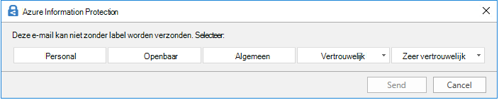

# Meer informatie over vertrouwelijkheidslabelsLearn about sensitivity labels

>*[Richtlijnen voor Microsoft 365-licenties voor beveiliging en compliance](/office365/servicedescriptions/microsoft-365-service-descriptions/microsoft-365-tenantlevel-services-licensing-guidance/microsoft-365-security-compliance-licensing-guidance).**[Microsoft 365 licensing guidance for security & compliance](/office365/servicedescriptions/microsoft-365-service-descriptions/microsoft-365-tenantlevel-services-licensing-guidance/microsoft-365-security-compliance-licensing-guidance).*

> [!NOTE]
> Zie [Vertrouwelijkheidslabels toepassen op uw bestanden en e-mail in Office](https://support.microsoft.com/topic/apply-sensitivity-labels-to-your-files-and-email-in-office-2f96e7cd-d5a4-403b-8bd7-4cc636bae0f9) als u meer informatie zoekt over vertrouwelijkheidslabels die u in uw Office-apps ziet.If you're looking for information about sensitivity labels that you see in your Office apps, see [Apply sensitivity labels to your files and email in Office](https://support.microsoft.com/topic/apply-sensitivity-labels-to-your-files-and-email-in-office-2f96e7cd-d5a4-403b-8bd7-4cc636bae0f9).
>
> De informatie op deze pagina is bedoeld voor IT-beheerders die dergelijke labels kunnen maken en configureren.The information on this page is for IT administrators who can create and configure those labels.

Om hun werk af te krijgen, werken personen in uw organisatie samen met anderen binnen de organisatie, maar ook met externe personen.To get their work done, people in your organization collaborate with others both inside and outside the organization. Dit betekent dat de inhoud niet langer achter een firewall blijft. De inhoud kan overal worden gebruikt, op verschillende apparaten, apps en services.This means that content no longer stays behind a firewall—it can roam everywhere, across devices, apps, and services. Wanneer de inhoud elders wordt gebruikt, wilt u dat dat gebeurt in een veilige, beschermde manier die voldoet aan het bedrijfs- en nalevingsbeleid van uw organisatie.And when it roams, you want it to do so in a secure, protected way that meets your organization's business and compliance policies.

Met vertrouwelijkheidslabels uit het Microsoft Information Protection-oplossing kunt u de gegevens van uw organisatie classificeren en beschermen en ervoor zorgen dat de productiviteit van gebruikers en hun vermogen om samen te werken niet wordt belemmerd.Sensitivity labels from the Microsoft Information Protection solution let you classify and protect your organization's data, while making sure that user productivity and their ability to collaborate isn't hindered.

Voorbeeld met beschikbare vertrouwelijkheidslabels in Excel op het tabblad **Start** op het lint.Example showing available sensitivity labels in Excel, from the **Home** tab on the Ribbon. In dit voorbeeld wordt het toegepaste label weergegeven op de statusbalk:In this example, the applied label displays on the status bar:

Om vertrouwelijkheidslabels toe te passen, moeten gebruikers zijn aangemeld met hun Microsoft 365-werk- of schoolaccount.To apply sensitivity labels, users must be signed in with their Microsoft 365 work or school account.

> [!NOTE]
> Voor tenants van de Amerikaanse overheid worden vertrouwelijkheidslabels nu ondersteund voor alle platforms:For US Government tenants, sensitivity labels are now supported for all platforms:
> - Voor GCC- en GCC Hoog-omgevingen: Opmerkingen bij de release voor [Office voor Windows](/officeupdates/current-channel#version-2101-january-26) en [Office voor Mac](/officeupdates/release-notes-office-for-mac#feature-updates-2)For GCC and GCC High environments: Release notes for [Office for Windows](/officeupdates/current-channel#version-2101-january-26) and [Office for Mac](/officeupdates/release-notes-office-for-mac#feature-updates-2)
> - Voor DoD-omgevingen: Opmerkingen bij de release voor [Office voor Windows](/officeupdates/current-channel#version-2103-march-30)For DoD environments: Release notes for [Office for Windows](/officeupdates/current-channel#version-2103-march-30)
>
> Zie [Azure Information Protection Premium Government Service Description](/enterprise-mobility-security/solutions/ems-aip-premium-govt-service-description) als u de geïntegreerde labelclient en scanner van Azure Information Protection gebruikt voor deze omgevingen.If you use the Azure Information Protection unified labeling client and scanner for these environments, see the [Azure Information Protection Premium Government Service Description](/enterprise-mobility-security/solutions/ems-aip-premium-govt-service-description).

U kunt vertrouwelijkheidslabels gebruiken om:You can use sensitivity labels to:
  
- **Beveiligingsinstellingen te bieden met versleuteling en inhoudsmarkeringen.****Provide protection settings that include encryption and content markings.** Pas bijvoorbeeld een label 'Vertrouwelijk' toe op een document of e-mail en het label versleutelt de inhoud en past een watermerk 'Vertrouwelijk' toe.For example, apply a "Confidential" label to a document or email, and that label encrypts the content and applies a "Confidential" watermark. Inhoudsmarkeringen omvatten kopteksten, voetteksten en watermerken en versleuteling kan ook beperken welke acties geautoriseerde personen kunnen uitvoeren op de inhoud.Content markings include headers and footers as well as watermarks, and encryption can also restrict what actions authorized people can take on the content.

- **Inhoud te beveiligen in Office-apps op verschillende platforms en apparaten.****Protect content in Office apps across different platforms and devices.** Ondersteund door Word, Excel, PowerPoint en Outlook in de Office-bureaubladtoepassingen en de webversie van Office.Supported by Word, Excel, PowerPoint, and Outlook on the Office desktop apps and Office on the web. Ondersteund in Windows, macOS, iOS en Android.Supported on Windows, macOS, iOS, and Android.

- **Inhoud te beveiligen in apps en services van derden** door Microsoft Cloud App Security te gebruiken.**Protect content in third-party apps and services** by using Microsoft Cloud App Security. Met Cloud App Security kunt u inhoud detecteren, classificeren, labelen en beveiligen in apps en services van derden, zoals SalesForce, Box of Dropbox, zelfs als de app of service van derden geen vertrouwelijkheidslabels leest of ondersteunt.With Cloud App Security, you can detect, classify, label, and protect content in third-party apps and services, such as SalesForce, Box, or DropBox, even if the third-party app or service does not read or support sensitivity labels.

- **Containers te beveiligen** die Teams-, Microsoft 365 Groepen- en SharePoint-sites bevatten.**Protect containers** that include Teams, Microsoft 365 Groups, and SharePoint sites. Stel bijvoorbeeld privacy-instellingen, toegang van externe gebruikers en extern delen en toegang van onbeheerde apparaten in.For example, set privacy settings, external user access and external sharing, and access from unmanaged devices.

- **Vertrouwelijkheidslabels uit te breiden naar Power BI**: wanneer u deze mogelijkheid inschakelt, kunt u labels toepassen en zien in Power BI en gegevens beveiligen wanneer die buiten de service worden opgeslagen.**Extend sensitivity labels to Power BI**: When you turn on this capability, you can apply and view labels in Power BI, and protect data when it's saved outside the service.

- **Vertrouwelijkheidslabels uit te breiden naar assets in Azure Purview**: wanneer u deze mogelijkheid inschakelt (momenteel in preview), kunt u uw vertrouwelijkheidslabels toepassen op assets zoals SQL-kolommen, bestanden in Azure Blob Storage en meer.**Extend sensitivity labels to assets in Azure Purview**: When you turn on this capability, currently in preview, you can apply your sensitivity labels to assets such as SQL columns, files in Azure Blob Storage, and more. 

- **Vertrouwelijkheidslabels uitbreiden naar apps en services van derden.****Extend sensitivity labels to third-party apps and services.** Met Microsoft Information Protection SDK kunnen apps van derden vertrouwelijkheidslabels lezen en beveiligingsinstellingen toepassen.Using the Microsoft Information Protection SDK, third-party apps can read sensitivity labels and apply protection settings.

- **Inhoud te classificeren zonder beveiligingsinstellingen.****Classify content without using any protection settings.** U kunt ook gewoon een label toepassen als resultaat van de classificatie van de inhoud.You can also simply assign a label as a result of classifying the content. Hierdoor kunnen gebruikers een visuele toewijzing krijgen van de classificatie van de labelnamen van uw organisatie en kunnen ze de labels gebruiken om gebruiksrapporten te genereren en activiteitsgegevens te zien van uw vertrouwelijke inhoud.This provides users with a visual mapping of classification to your organization's label names, and can use the labels to generate usage reports and see activity data for your sensitive content. Op basis van deze informatie kunt u er altijd voor kiezen om de beveiligingsinstellingen later toe te passen.Based on this information, you can always choose to apply protection settings later.

In al deze gevallen kunnen vertrouwelijkheidslabels in Microsoft 365 u helpen de juiste acties op de juiste inhoud uit te voeren.In all these cases, sensitivity labels in Microsoft 365 can help you take the right actions on the right content. Met vertrouwelijkheidslabels kunt u gegevens in uw organisatie classificeren en beveiligingsinstellingen afdwingen op basis van die classificatie.With sensitivity labels, you can classify data across your organization, and enforce protection settings based on that classification.

Zie [Veelvoorkomende scenario's voor vertrouwelijkheidslabels](get-started-with-sensitivity-labels.md#common-scenarios-for-sensitivity-labels) voor meer informatie over dit en andere scenario's die worden ondersteund door vertrouwelijkheidslabels.For more information about these and other scenarios that are supported by sensitivity labels, see [Common scenarios for sensitivity labels](get-started-with-sensitivity-labels.md#common-scenarios-for-sensitivity-labels). Er worden voortdurend nieuwe functies ontwikkeld die vertrouwelijkheidslabels ondersteunen, daarom is het mogelijk handig om te verwijzen naar de [Microsoft 365 roadmap](https://aka.ms/MIPC/Roadmap).New features are being developed all the time that support sensitivity labels, so you might also find it useful to reference the [Microsoft 365 roadmap](https://aka.ms/MIPC/Roadmap).

## Wat is een vertrouwelijkheidslabel?What a sensitivity label is

Wanneer u een vertrouwelijkheidslabel toewijst aan inhoud, lijkt het op een stempel dat wordt toegepast en is dit:When you assign a sensitivity label to content, it's like a stamp that's applied and is:

- **Aanpasbaar.****Customizable.** U kunt specifiek voor uw organisatie- en bedrijfsbehoeften categorieën maken voor verschillende niveaus van vertrouwelijke inhoud binnen uw organisatie.Specific to your organization and business needs, you can create categories for different levels of sensitive content in your organization. Bijvoorbeeld: Persoonlijk, Openbaar, Algemeen, Vertrouwelijk en Zeer vertrouwelijk.For example, Personal, Public, General, Confidential, and Highly Confidential.

- **Niet-versleutelde tekst.****Clear text.** Aangezien een label wordt opgeslagen in niet-versleutelde tekst in de metagegevens van bestanden en e-mailberichten, kunnen apps en services deze lezen en zo nodig vervolgens hun eigen beveiligingsacties toepassen.Because a label is stored in clear text in the metadata for files and emails, third-party apps and services can read it and then apply their own protective actions, if required.

- **Persistent.****Persistent.** Aangezien het label wordt opgeslagen in de metagegevens van bestanden en e-mailberichten blijft het label bij de inhoud, ongeacht waar die wordt opgeslagen.Because the label is stored in metadata for files and emails, the label roams with the content, no matter where it's saved or stored. De unieke labelidentificatie wordt de basis voor het toepassen en afdwingen van beleid dat u configureert.The unique label identification becomes the basis for applying and enforcing the policies that you configure.

Wanneer een vertrouwelijkheidslabel wordt weergegeven voor gebruikers, lijkt het een tag in de apps die ze gebruiken en kan het eenvoudig worden geïntegreerd in hun bestaande werkstromen.When viewed by users, a sensitivity label appears like a tag on apps that they use and can be easily integrated into their existing workflows.

Er kan één vertrouwelijkheidslabel worden toegepast op elk item dat vertrouwelijkheidslabels ondersteunt.Each item that supports sensitivity labels can have a single sensitivity label applied to it. Op documenten en e-mailberichten kunnen zowel een vertrouwelijkheidslabel als een [retentielabel](retention.md#retention-labels) worden toegepast.Documents and emails can have both a sensitivity label and a [retention label](retention.md#retention-labels) applied to them.

> [!div class="mx-imgBorder"]
> 

## Wat vertrouwelijkheidslabels kunnen doenWhat sensitivity labels can do

Nadat een vertrouwelijkheidslabel is toegepast op een e-mail of document worden alle geconfigureerde beveiligingsinstellingen voor dat label afgedwongen op de inhoud. U kunt een vertrouwelijkheidslabel configureren om:After a sensitivity label is applied to an email or document, any configured protection settings for that label are enforced on the content. You can configure a sensitivity label to:

- **Versleutelen** van e-mailberichten en documenten om te voorkomen dat onbevoegden toegang hebben tot deze gegevens.**Encrypt** emails and documents to prevent unauthorized people from accessing this data. U kunt er daarnaast voor kiezen welke gebruikers of groep machtigingen hebben om welke acties uit te voeren voor hoelang.You can additionally choose which users or group have permissions to perform which actions and for how long. U kunt er bijvoorbeeld voor kiezen om alle gebruikers in uw organisatie een document te laten bewerken, terwijl een specifieke groep in een andere organisatie dit alleen mag bekijken.For example, you can choose to allow all users in your organization to modify a document while a specific group in another organization can only view it. In plaats van door de beheerder gedefinieerde machtigingen kunt u uw gebruikers machtigingen laten toewijzen aan de inhoud wanneer zij een label toepassen.Alternatively, instead of administrator-defined permissions, you can allow your users to assign permissions to the content when they apply the label. 
    
    Zie [Toegang tot inhoud beperken met versleuteling en vertrouwelijkheidslabels](encryption-sensitivity-labels.md) voor meer informatie over de **Versleutelings** instellingen bij het maken of bewerken van een vertrouwelijkheidslabel.For more information about the **Encryption** settings when you create or edit a sensitivity label, see [Restrict access to content by using encryption in sensitivity labels](encryption-sensitivity-labels.md).

- **Markeren van de inhoud** wanneer u Office-apps gebruikt door watermerken, kopteksten of voetteksten toe te voegen aan e-mail of documenten waarop een label is toegepast.**Mark the content** when you use Office apps, by adding watermarks, headers, or footers to email or documents that have the label applied. Watermerken kunnen worden toegepast op documenten, maar niet op e-mailberichten.Watermarks can be applied to documents but not email. Voorbeeld koptekst en watermerk:Example header and watermark:
    
    
    
    Wilt u controleren wanneer inhoudsmarkeringen worden toegepast?Need to check when content markings are applied? Zie [Wanneer Office-apps inhoudsmarkering en versleuteling toepassen](sensitivity-labels-office-apps.md#when-office-apps-apply-content-marking-and-encryption).See [When Office apps apply content marking and encryption](sensitivity-labels-office-apps.md#when-office-apps-apply-content-marking-and-encryption).
    
    Bepaalde, maar niet alle apps ondersteunen dynamische markeringen door het gebruik van variabelen.Some, but not all apps support dynamic markings by using variables. Voeg bijvoorbeeld de labelnaam of documentnaam in de koptekst, voettekst of het watermerk in.For example, insert the label name or document name into the header, footer, or watermark. Zie [Dynamische markeringen met variabelen](sensitivity-labels-office-apps.md#dynamic-markings-with-variables) voor meer informatie.For more information, see [Dynamic markings with variables](sensitivity-labels-office-apps.md#dynamic-markings-with-variables).
    
    Lengte van tekenreeksen: watermerken mogen niet langer zijn dan 255 tekens.String lengths: Watermarks are limited to 255 characters. Kop- en voetteksten mogen niet langer zijn dan 1024 tekens, behalve in Excel.Headers and footers are limited to 1024 characters, except in Excel. In Excel zijn kop- en voetteksten beperkt tot maximaal 255 tekens, maar deze limiet omvat ook tekens die niet zichtbaar zijn, zoals opmaakcodes.Excel has a total limit of 255 characters for headers and footers but this limit includes characters that aren't visible, such as formatting codes. Wanneer die limiet wordt bereikt, wordt de tekenreeks die u invoert niet weergegeven in Excel.If that limit is reached, the string you enter is not displayed in Excel.

- **Inhoud beveiligen in containers, zoals sites en groepen** wanneer u de mogelijkheid inschakelt om [vertrouwelijkheidslabels te gebruiken met Microsoft Teams-, Microsoft 365 Groepen- en SharePoint-sites](sensitivity-labels-teams-groups-sites.md).**Protect content in containers such as sites and groups** when you enable the capability to [use sensitivity labels with Microsoft Teams, Microsoft 365 groups, and SharePoint sites](sensitivity-labels-teams-groups-sites.md).
    
    U kunt beveiligingsinstellingen pas configureren voor groepen en sites wanneer u deze mogelijkheid inschakelt.You can't configure protection settings for groups and sites until you enable this capability. Met deze labelconfiguratie worden documenten of e-mailberichten niet automatisch gelabeld, maar de inhoud wordt beveiligd door de labelinstellingen door de toegang te beheren tot de container waar de inhoud kan worden opgeslagen.This label configuration doesn't result in documents or emails being automatically labeled but instead, the label settings protect content by controlling access to the container where content can be stored. Deze privacy-instellingen omvatten toegang van externe gebruikers en extern delen en toegang van onbeheerde apparaten.These settings include privacy settings, external user access and external sharing, and access from unmanaged devices.

- **Het label automatisch toepassen op bestanden en e-mailberichten of een label aanbevelen.****Apply the label automatically to files and emails, or recommend a label.** Kies hoe vertrouwelijke gegevens die u wilt labelen, worden geïdentificeerd. Het label kan automatisch worden toegepast of u kunt gebruikers vragen om het label dat u aanbeveelt toe te passen.Choose how to identify sensitive information that you want labeled, and the label can be applied automatically, or you can prompt users to apply the label that you recommend. Wanneer u een label aanbeveelt, wordt de prompt weergegeven bij elke tekst.If you recommend a label, the prompt displays whatever text you choose. Bijvoorbeeld:For example:
    
    
    
    Zie [Automatisch een vertrouwelijkheidslabel toepassen op inhoud](apply-sensitivity-label-automatically.md) voor Office-apps en [Automatisch een label toepassen op uw gegevens in Azure Purview](/azure/purview/create-sensitivity-label) voor meer informatie over de instellingen voor het **Automatisch labelen van bestanden en e-mailberichten** bij het maken of bewerken van een vertrouwelijkheidslabel.For more information about the **Auto-labeling for files and emails** settings when you create or edit a sensitivity label, see [Apply a sensitivity label to content automatically](apply-sensitivity-label-automatically.md) for Office apps, and [Automatically label your data in Azure Purview](/azure/purview/create-sensitivity-label).

### LabelbereikenLabel scopes

Wanneer u een vertrouwelijkheidslabel maakt, wordt u gevraagd om het bereik van het label te configureren. Hierdoor worden twee dingen bepaald:When you create a sensitivity label, you're asked to configure the label's scope which determines two things:
- welke labelinstellingen u kunt configureren voor dat labelWhich label settings you can configure for that label
- waar het label zichtbaar is voor de gebruikersWhere the label will be visible to users

Met deze bereikconfiguratie kunt u vertrouwelijkheidslabels maken die alleen gelden voor documenten en e-mailberichten en niet kunnen worden geselecteerd voor containers. This scope configuration lets you have sensitivity labels that are just for documents and emails and can't be selected for containers. En zo kunt u ook vertrouwelijkheidslabels maken die alleen gelden voor containers en niet kunnen worden geselecteerd voor documenten en e-mailberichten.And similarly, sensitivity labels that are just for containers and can't be selected for documents and emails. Nieuw en momenteel in preview: u kunt ook het bereik selecteren voor Azure Purview-assets:New, and currently in preview, you can also select the scope for Azure Purview assets:

Standaard is altijd het bereik **Bestanden en e-mailberichten** geselecteerd.By default, the **Files & emails** scope is always selected. De andere bereikwaarden worden standaard geselecteerd wanneer de functies voor uw tenant zijn ingeschakeld: The other scopes are selected by default when the features are enabled for your tenant:

- **Groepen en sites**: [vertrouwelijkheidslabels voor containers inschakelen en labels synchroniseren](sensitivity-labels-teams-groups-sites.md#how-to-enable-sensitivity-labels-for-containers-and-synchronize-labels)**Groups & sites**: [Enable sensitivity labels for containers and synchronize labels](sensitivity-labels-teams-groups-sites.md#how-to-enable-sensitivity-labels-for-containers-and-synchronize-labels)

- **Azure Purview-assets (preview)**: [automatisch uw inhoud labelen in Azure Purview](/azure/purview/create-sensitivity-label)**Azure Purview assets (preview)**: [Automatically label your content in Azure Purview](/azure/purview/create-sensitivity-label)

Wanneer u de standaardinstellingen wijzigt zodat net alle bereiken zijn geselecteerd, ziet u de eerste pagina van de configuratie-instellingen voor de bereiken die u niet hebt geselecteerd, maar kunt u de instellingen niet configureren.If you change the defaults so not all scopes are selected, you see the first page of the configuration settings for scopes you haven't selected, but you can't configure the settings. Wanneer het bereik voor bestanden en e-mailberichten bijvoorbeeld niet is geselecteerd, kunt u de opties op de volgende pagina niet selecteren:For example, if the scope for files and emails is not selected, you can't select the options on the next page:

Selecteer **Volgende** voor de pagina's met niet-beschikbare opties om door te gaan.For these pages that have unavailable options, select **Next** to continue. Of selecteer **Terug** om het bereik van het label te wijzigen.Or, select **Back** to change the label's scope.

### Labelprioriteit (volgorde is van belang)Label priority (order matters)

Wanneer u in uw beheercentrum vertrouwelijkheidslabels maakt, verschijnen ze in een lijst in het tabblad **Vertrouwelijkheid** op de pagina **Labels**.When you create your sensitivity labels in your admin center, they appear in a list on the **Sensitivity** tab on the **Labels** page. In deze lijst is de volgorde belangrijk, want dat geeft de prioriteit weer.In this list, the order of the labels is important because it reflects their priority. U wilt dat het meest beperkende vertrouwelijkheidslabel, zoals Zeer vertrouwelijk **onderaan** de lijst staat en het minst beperkende vertrouwelijkheidslabel, zoals Openbaar **bovenaan**.You want your most restrictive sensitivity label, such as Highly Confidential, to appear at the **bottom** of the list, and your least restrictive sensitivity label, such as Public, to appear at the **top**.

U kunt maar een vertrouwelijkheidslabel toepassen op een item als een document, e-mail of container.You can apply just one sensitivity label to an item such as a document, email, or container. Als u een optie instelt waarvoor het vereist is dat uw gebruikers een reden hebben om het label te wijzigen naar een lagere classificatie, geeft de volgorde van deze lijst de lagere classificaties weer.If you set an option that requires your users to provide a justification for changing a label to a lower classification, the order of this list identifies the lower classifications. Deze optie is echter niet van toepassing op sublabels.However, this option does not apply to sublabels.

De volgorde van sublabels wordt echter wel gebruikt met [automatisch labelen](apply-sensitivity-label-automatically.md).The ordering of sublabels is used with [automatic labeling](apply-sensitivity-label-automatically.md), though. Wanneer u labels configureert om automatisch te worden toegepast of als aanbeveling, kunnen meerdere overeenkomsten mogelijk zijn voor meer dan één label.When you configure labels to be applied automatically or as a recommendation, multiple matches can result for more than one label. Om te bepalen welk label wordt toegepast of aanbevolen, wordt de volgorde van de labels gebruikt: het laatste vertrouwelijkheidslabel wordt geselecteerd en dan, indien van toepassing, het laatste sublabel.To determine the label to apply or recommend, the label ordering is used: The last sensitive label is selected, and then if applicable, the last sublabel.

### Sublabels (groeperingslabels)Sublabels (grouping labels)

Met sublabels kunt u één of meerdere labels groeperen onder een bovenliggend label dat een gebruiker ziet in een Office-app.With sublabels, you can group one or more labels below a parent label that a user sees in an Office app. Onder Vertrouwelijk kan uw organisatie bijvoorbeeld verschillende andere labels gebruiken voor specifieke typen van die classificatie.For example, under Confidential, your organization might use several different labels for specific types of that classification. In dit voorbeeld is het bovenliggende label Vertrouwelijk eenvoudig een tekstlabel, zonder beveiligingsinstellingen en omdat het sublabels heeft, kan het niet worden toegepast op inhoud.In this example, the parent label Confidential is simply a text label with no protection settings, and because it has sublabels, it can't be applied to content. In plaats daarvan moeten gebruikers Vertrouwelijk kiezen om de sublabels te zien en kunnen ze een sublabel kiezen om toe te passen op inhoud.Instead, users must choose Confidential to view the sublabels, and then they can choose a sublabel to apply to content.

Sublabels zijn gewoon een manier om labels te presenteren aan gebruikers in logische groepen.Sublabels are simply a way to present labels to users in logical groups. Sublabels nemen geen instellingen over van het bovenliggende label.Sublabels don't inherit any settings from their parent label. Wanneer u een sublabel publiceert voor een gebruiker, kan die gebruiker dat sublabel dan toepassen op inhoud, maar niet alleen het bovenliggende label toepassen.When you publish a sublabel for a user, that user can then apply that sublabel to content but can't apply just the parent label.

Kies geen bovenliggend label als standaardlabel en configureer geen bovenliggend label om automatisch te worden toegepast (of aanbevolen).Don't choose a parent label as the default label, or configure a parent label to be automatically applied (or recommended). Als u dat doet, wordt het bovenliggende label niet toegepast op inhoud.If you do, the parent label won't be applied to content.

Voorbeeld hoe sublabels worden weergegeven voor gebruikers:Example of how sublabels display for users:

### Een vertrouwelijkheidslabel bewerken of verwijderenEditing or deleting a sensitivity label

Als u een vertrouwelijkheidslabel verwijdert uit uw beheercentrum, wordt het label niet automatisch verwijderd van inhoud en blijven alle beveiligingsinstellingen van kracht op inhoud waarop dat label was toegepast.If you delete a sensitivity label from your admin center, the label is not automatically removed from content, and any protection settings continue to be enforced on content that had that label applied.

Wanneer u een vertrouwelijkheidslabel bewerkt, wordt de versie van het label dat is toegepast op inhoud, afgedwongen op die inhoud.If you edit a sensitivity label, the version of the label that was applied to content is what's enforced on that content.

## Wat labelbeleid inhoudtWhat label policies can do

Nadat u uw vertrouwelijkheidslabels hebt gemaakt, moet u ze publiceren om ze beschikbaar te stellen aan personen en services in uw organisatie.After you create your sensitivity labels, you need to publish them to make them available to people and services in your organization. De vertrouwelijkheidslabels kunnen dan worden toegepast op Office-documenten en e-mailberichten en andere items die vertrouwelijkheidslabels ondersteunen.The sensitivity labels can then be applied to Office documents and emails, and other items that support sensitivity labels. 

In tegenstelling tot retentielabels, die worden gepubliceerd in locaties zoals alle Exchange-postvakken, worden vertrouwelijkheidslabels gepubliceerd naar gebruikers of groepen.Unlike retention labels, which are published to locations such as all Exchange mailboxes, sensitivity labels are published to users or groups. Apps die vertrouwelijkheidslabels ondersteunen, kunnen die weergeven aan gebruikers als toegepaste labels of als labels die zij kunnen toepassen.Apps that support sensitivity labels can then display them to those users and groups as applied labels, or as labels that they can apply.

Wanneer u labelbeleid configureert, kunt u:When you configure a label policy, you can:

- **kiezen welke gebruikers en groepen de labels zien.****Choose which users and groups see the labels.** Labels kunnen worden gepubliceerd aan specifieke gebruikers of beveiligingsgroepen met e-mailberichten, distributiegroepen of Microsoft 365-groepen (die een[dynamisch lidmaatschap](/azure/active-directory/users-groups-roles/groups-create-rule) kunnen hebben) in Azure AD.Labels can be published to any specific user or email-enabled security group, distribution group, or Microsoft 365 group (which can have [dynamic membership](/azure/active-directory/users-groups-roles/groups-create-rule)) in Azure AD.

- **Een standaardlabel specificeren** voor nieuwe documenten, e-mails zonder label en nieuwe containers [(als u gevoeligheidslabels hebt ingeschakeld voor Microsoft Teams, Microsoft 365-groepen en SharePoint-sites](sensitivity-labels-teams-groups-sites.md)).**Specify a default label** for new documents, unlabeled emails, and new containers (when you've [enabled sensitivity labels for Microsoft Teams, Microsoft 365 groups, and SharePoint sites](sensitivity-labels-teams-groups-sites.md)). U kunt hetzelfde label opgeven voor alle drie de typen items, of  verschillende labels.You can specify the same label for all three types of items, or different labels. Wanneer u een standaardlabel voor documenten opgeeft, past de geïntegreerde labelclient van Azure Information Protection dit standaardlabel ook toe op bestaande documenten die niet zijn gelabeld.When you specify a default label for documents, the Azure Information Protection unified labeling client also applies this label to existing documents that are unlabeled. Gebruikers kunnen het standaardlabel altijd wijzigen als het niet het juiste label is voor hun document of e-mail.Users can always change the default label if it's not the right label for their document or email.
    
    Overweeg om een standaardlabel te gebruiken om een basisniveau in te stellen van beveiligingsinstellingen dat u wilt toepassen op al uw inhoud.Consider using a default label to set a base level of protection settings that you want applied to all your content. Zonder gebruikerstraining en ander beheer kan deze instelling echter ook resulteren in onjuiste labeling.However, without user training and other controls, this setting can also result in inaccurate labeling. Het is gewoonlijk geen goed idee om een label te kiezen dat versleuteling toepast als standaardlabel op documenten.It's usually not a good idea to select a label that applies encryption as a default label to documents. Veel organisaties moeten bijvoorbeeld documenten verzenden naar en delen met externe gebruikers die mogelijk geen apps hebben die de versleuteling ondersteunen of ze gebruiken mogelijk een account die niet geautoriseerd kan worden.For example, many organizations need to send and share documents with external users who might not have apps that support the encryption or they might not use an account that can be authorized. Zie [Versleutelde documenten delen met externe gebruikers](sensitivity-labels-office-apps.md#sharing-encrypted-documents-with-external-users) voor meer informatie over dit scenario.For more information about this scenario, see [Sharing encrypted documents with external users](sensitivity-labels-office-apps.md#sharing-encrypted-documents-with-external-users).

- **argumenten eisen voor het wijzigen van een label.****Require a justification for changing a label.** Als een gebruiker probeert een label te verwijderen of te vervangen door een label met een lager volgnummer, kunt u eisen dat de gebruiker een reden geeft om deze actie uit te kunnen voeren.If a user tries to remove a label or replace it with a label that has a lower-order number, you can require the user provides a justification to perform this action. Een gebruiker opent bijvoorbeeld een document met het label Vertrouwelijk (volgnummer 3) en vervangt dat label met een Openbaar-label (volgnummer 1).For example, a user opens a document labeled Confidential (order number 3) and replaces that label with one named Public (order number 1). Voor Office-apps wordt deze redenprompt eenmaal per app-sessie geactiveerd wanneer u ingebouwde labels gebruikt en per bestand wanneer u de Azure Information Protection Unified labeling-client gebruikt.For Office apps, this justification prompt is triggered once per app session when you use built-in labeling, and per file when you use the Azure Information Protection unified labeling client. Beheerders kunnen de reden samen met de labelwijziging lezen in [Activiteitenverkenner](data-classification-activity-explorer.md).Administrators can read the justification reason along with the label change in [activity explorer](data-classification-activity-explorer.md).

    

- **Vereisen dat gebruikers een label toepassen** op documenten en e-mails, alleen documenten en op containers.**Require users to apply a label** for documents and emails, just documents, and for containers. Deze opties, ook wel verplicht labelen genoemd, zorgen ervoor dat er een label moet worden toegepast voordat gebruikers documenten kunnen opslaan en e-mailberichten verzenden en nieuwe groepen of sites maken.Also known as mandatory labeling, these options ensure a label must be applied before users can save documents and send emails, and create new groups or sites.
    
    Aan documenten en e-mailberichten kan door een gebruiker handmatig een label worden toegewezen, automatisch als gevolg van een voorwaarde die u hebt geconfigureerd of standaard worden toegewezen (de hiervoor beschreven optie standaardlabel). Een voorbeeldprompt die in Outlook wordt weergegeven wanneer een gebruiker een label moet toewijzen:For documents and emails, a label can be assigned manually by the user, automatically as a result of a condition that you configure, or be assigned by default (the default label option previously described). An example prompt shown in Outlook when a user is required to assign a label:

    
    
    Zie [Vereisen dat gebruikers een label toepassen op hun e-mail en documenten](sensitivity-labels-office-apps.md#require-users-to-apply-a-label-to-their-email-and-documents) voor meer informatie.For more information about mandatory labeling for documents and emails, see [Require users to apply a label to their email and documents](sensitivity-labels-office-apps.md#require-users-to-apply-a-label-to-their-email-and-documents).
    
    Aan containers moet een label worden toegewezen op het moment dat de groep of site wordt gemaakt.For containers, a label must be assigned at the time the group or site is created.
    
    U kunt deze optie gebruiken om de dekking van uw labels te vergroten.Consider using this option to help increase your labeling coverage. Zonder gebruikerstraining kunnen deze instellingen echter leiden tot onnauwkeurige labels.However, without user training, these settings can result in inaccurate labeling. Tenzij u ook een bijbehorend standaardlabel instelt, kan verplicht labelen met de geregelde prompts leiden tot frustratie bij uw gebruikers.In addition, unless you also set a corresponding default label, mandatory labeling can frustrate your users with the frequent prompts.

- **Biedt een help-koppeling naar een aangepaste help-pagina.****Provide help link to a custom help page.** Als uw gebruikers niet zeker weten wat uw vertrouwelijkheidslabels betekenen of hoe ze moeten worden gebruikt, kunt u een Meer informatie-URL bieden die verschijnt onderaan het menu **Vertrouwelijkheidslabels** in de Office-apps:If your users aren't sure what your sensitivity labels mean or how they should be used, you can provide a Learn More URL that appears at the bottom of the **Sensitivity label** menu in the Office apps:

    

Nadat u labelbeleid hebt gemaakt dat nieuwe vertrouwelijkheidslabels toewijst aan gebruikers en groepen, beginnen gebruikers die labels te zien in hun Office-apps.After you create a label policy that assigns new sensitivity labels to users and groups, users start to see those labels in their Office apps. Het duurt maximaal 24 uur totdat de laatste wijzigingen binnen uw organisatie zijn gerepliceerd.Allow up to 24 hours for the latest changes to replicate throughout your organization.

Er is geen limiet voor het aantal vertrouwelijkheidslabels dat u kunt maken en publiceren, met één uitzondering: als het label versleuteling toepast die de gebruikers en machtigingen specificeert, wordt er een maximum van 500 labels ondersteund met deze configuratie.There is no limit to the number of sensitivity labels that you can create and publish, with one exception: If the label applies encryption that specifies the users and permissions, there is a maximum of 500 labels supported with this configuration. Probeer echter het aantal labels tot een minimum te beperken om de overhead voor beheerders en de complexiteit voor uw gebruikers te verminderen.However, as a best practice to lower admin overheads and reduce complexity for your users, try to keep the number of labels to a minimum. De praktijk heeft uitgewezen dat de effectiviteit aanzienlijk afneemt als gebruikers meer dan vijf hoofdlabels of meer dan vijf sublabels per hoofdlabel hebben.Real-world deployments have proved effectiveness to be noticeably reduced when users have more than five main labels or more than five sublabels per main label.

### Labelbeleidprioriteit (volgorde is van belang)Label policy priority (order matters)

U stelt uw vertrouwelijkheidslabels beschikbaar aan gebruikers door ze te publiceren in een vertrouwelijkheidsbeleid dat wordt weergegeven in een lijst in het tabblad **Vertrouwelijkheidsbeleid** op de pagina **Labelbeleid**.You make your sensitivity labels available to users by publishing them in a sensitivity label policy that appears in a list on the **Sensitivity policies** tab on the **Label policies** page. Net als bij vertrouwelijkheidslabels (zie [Labelprioriteit (volgorde is van belang)](#label-priority-order-matters)) is de volgorde van vertrouwelijkheidsbeleid belangrijk, want dat bepaalt de prioriteit.Just like sensitivity labels (see [Label priority (order matters)](#label-priority-order-matters)), the order of the sensitivity label policies is important because it reflects their priority. Het labelbeleid met de laagste prioriteit wordt **bovenaan** weergegeven en het beleid met de hoogste prioriteit wordt **onderaan** weergegeven.The label policy with lowest priority is shown at the **top**, and the label policy with the highest priority is shown at the **bottom**.

Labelbeleid bestaat uit:A label policy consists of:

- Een verzameling labels.A set of labels.
- De gebruikers en groepen waaraan het beleid met labels wordt toegewezen.The users and groups that will be assigned the policy with labels.
- Het bereik van het beleid en de beleidsinstellingen voor dat bereik (zoals standaardlabel voor bestanden en e-mailberichten).The scope of the policy and policy settings for that scope (such as default label for files and emails).

U kunt een gebruiker opnemen in meerdere labelbeleidsregels en de gebruiker krijgt alle vertrouwelijkheidslabels en -instellingen van die beleidsregels.You can include a user in multiple label policies, and the user will get all the sensitivity labels and settings from those policies. Als er een conflict is tussen de instellingen van meerdere beleidsregels, worden de instellingen van het beleid met de hoogste prioriteit (laagste positie) toegepast.If there is a conflict in settings from multiple policies, the settings from the policy with the highest priority (lowest position) is applied. Met andere woorden: de hoogste prioriteit wint voor elke instelling.In other words, the highest priority wins for each setting.

Als u niet de verwachte resultaten ziet voor de label- of labelbeleidsinstelling voor een gebruiker of groep, controleer dan de volgorde van het vertrouwelijkheidsbeleid.If you're not seeing the label or label policy setting behavior that you expect for a user or group, check the order of the sensitivity label policies. Mogelijk moet u het beleid omlaag verplaatsen.You might need to move the policy down. Als u de volgorde van het labelbeleid wilt wijzigen, selecteert u een beleidsregel > kies het beletselteken aan de rechterkant > kies dan **Omlaag** of **Omhoog**.To reorder the label policies, select a sensitivity label policy > choose the ellipsis on the right > **Move down** or **Move up**.

> [!NOTE]
> Ter herinnering: Wanneer er een conflict met instellingen is voor een gebruiker aan wie meerdere beleidsregels zijn toegewezen, wordt de instelling van het beleid met de hoogste prioriteit (laagste positie) toegepast.Remember: When there is a conflict of settings for a user who has multiple policies assigned, the setting from the policy with the highest priority (lowest position) is applied.

## Vertrouwelijkheidslabels en Azure Information ProtectionSensitivity labels and Azure Information Protection

Wanneer u vertrouwelijkheidslabels gebruikt in Microsoft 365-apps op Windows-computers kunt u ervoor kiezen labels te gebruiken die zijn ingebouwd in Office-apps of de Azure Information Protection-client.When you use sensitivity labels in Microsoft 365 Apps on Windows computers, you have a choice of using labeling that's built into Office apps, or the Azure Information Protection client.

Standaard is de ingebouwde labeling uitgeschakeld in deze apps wanneer de Azure Information Protection-client wordt geïnstalleerd.By default, built-in labeling is turned off in these apps when the Azure Information Protection client is installed. Zie [Ingebouwde Office-labelclient en de Azure Information Protection-client](sensitivity-labels-office-apps.md#office-built-in-labeling-client-and-the-azure-information-protection-client) voor meer informatie, waaronder het wijzigen van dit standaardgedrag.For more information, including how to change this default behavior, see [Office built-in labeling client and the Azure Information Protection client](sensitivity-labels-office-apps.md#office-built-in-labeling-client-and-the-azure-information-protection-client).

Zelfs wanneer u de ingebouwde labeling in Office-apps gebruikt, kunt u ook de geïntegreerde Azure Information Protection-labelclient met vertrouwelijkheidslabels gebruiken voor het volgende:Even when you use built-in labeling in Office apps, you can also use the Azure Information Protection unified labeling client with sensitivity labels for the following:

- Een scanner om vertrouwelijke gegevens op te sporen die on-premises zijn opgeslagen en dan optioneel die inhoud labelen.A scanner to discover sensitive information that's stored on-premises, and then optionally, label that content

- Opties voor het klikken met de rechtermuisknop in Verkenner zodat gebruikers labels toe kunnen passen op alle bestandstypenRight-click options in File Explorer for users to apply labels to all file types

- Een viewer om versleutelde bestanden voor tekst, afbeeldingen of PDF-bestanden weer te gevenA viewer to display encrypted files for text, images, or PDF documents

- Een PowerShell-module om vertrouwelijke gegevens op te sporen in on-premises bestanden en labels en versleuteling toe te passen op of te verwijderen van deze bestanden.A PowerShell module to discover sensitive information in files on premises, and apply or remove labels and encryption from these files.

Zie [Kies uw Windows-labeloplossing](/azure/information-protection/rms-client/use-client#choose-your-windows-labeling-solution) in de Azure Information Protection-documentatie als u nog niet bekend bent met Azure Information Protection of als u een bestaande Azure Information Protection-klant bent die recentelijk labels heeft gemigreerd.If you are new to Azure Information Protection, or if you are an existing Azure Information Protection customer who has recently migrated your labels, see [Choose your Windows labeling solution](/azure/information-protection/rms-client/use-client#choose-your-windows-labeling-solution) from the Azure Information Protection documentation.

### Azure Information Protection-labelsAzure Information Protection labels

> [!NOTE]
> Labelbeheer voor Azure Information Protection-labels in Azure Portal is **31 maart 2021** afgeschaft.Label management for Azure Information Protection labels in the Azure portal was deprecated **March 31, 2021**. Vind meer informatie in de officiële [afschaffingsmelding](https://techcommunity.microsoft.com/t5/azure-information-protection/announcing-timelines-for-sunsetting-label-management-in-the/ba-p/1226179).Learn more from the official [deprecation notice](https://techcommunity.microsoft.com/t5/azure-information-protection/announcing-timelines-for-sunsetting-label-management-in-the/ba-p/1226179).

Wanneer uw tenant zich nog niet op het [geïntegreerde labelplatform](/azure/information-protection/faqs#how-can-i-determine-if-my-tenant-is-on-the-unified-labeling-platform) bevindt, moet u eerst geïntegreerde labeling activeren voordat u vertrouwelijkheidslabels kunt gebruiken.If your tenant isn't yet on the [unified labeling platform](/azure/information-protection/faqs#how-can-i-determine-if-my-tenant-is-on-the-unified-labeling-platform), you must first activate unified labeling before you can use sensitivity labels. Zie [Azure Information Protection-labels migreren naar geïntegreerde vertrouwelijkheidslabels](/azure/information-protection/configure-policy-migrate-labels) voor instructies.For instructions, see [How to migrate Azure Information Protection labels to unified sensitivity labels](/azure/information-protection/configure-policy-migrate-labels). 

## Vertrouwelijkheidslabels en de Microsoft Information Protection SDKSensitivity labels and the Microsoft Information Protection SDK

Aangezien een vertrouwelijkheidslabel wordt opgeslagen in de metagegevens van een document kunnen apps en services van derden deze labelmetagegevens lezen en schrijven als aanvulling op uw labelimplementatie.Because a sensitivity label is stored in the metadata of a document, third-party apps and services can read from and write to this labeling metadata to supplement your labeling deployment. Daarnaast kunnen softwareontwikkelaars de [Microsoft Information Protection SDK](/information-protection/develop/overview#microsoft-information-protection-sdk) gebruiken om ondersteuning te bieden voor label- en versleutelingsmogelijkheden op meerdere platforms.Additionally, software developers can use the [Microsoft Information Protection SDK](/information-protection/develop/overview#microsoft-information-protection-sdk) to fully support labeling and encryption capabilities across multiple platforms. Zie [Melding algemene beschikbaarheid in het Tech Community-blog](https://techcommunity.microsoft.com/t5/Microsoft-Information-Protection/Microsoft-Information-Protection-SDK-Now-Generally-Available/ba-p/263144) voor meer informatie.To learn more, see the [General Availability announcement on the Tech Community blog](https://techcommunity.microsoft.com/t5/Microsoft-Information-Protection/Microsoft-Information-Protection-SDK-Now-Generally-Available/ba-p/263144). 

U vindt hier ook meer informatie over [partneroplossingen die zijn geïntegreerd met Microsoft Information Protection](https://techcommunity.microsoft.com/t5/Azure-Information-Protection/Microsoft-Information-Protection-showcases-integrated-partner/ba-p/262657).You can also learn about [partner solutions that are integrated with Microsoft Information Protection](https://techcommunity.microsoft.com/t5/Azure-Information-Protection/Microsoft-Information-Protection-showcases-integrated-partner/ba-p/262657).

## ImplementatiebegeleidingDeployment guidance

Zie [Aan de slag met vertrouwelijkheidslabels](get-started-with-sensitivity-labels.md) voor planning en begeleiding van implementaties met onder meer licentiegegevens, machtigingen, implementatiestrategie, een lijst met ondersteunde scenario's en documentatie voor eindgebruikers.For deployment planning and guidance that includes licensing information, permissions, deployment strategy, a list of supported scenarios, and end-user documentation, see [Get started with sensitivity labels](get-started-with-sensitivity-labels.md).

Zie [Informatiebescherming implementeren voor gegevensprivacyvoorschriften met Microsoft 365](../solutions/information-protection-deploy.md)  (aka.ms/m365dataprivacy) voor informatie over hoe u vertrouwelijkheidslabels kunt gebruiken om aan de privacyvoorschriften voor gegevens te voldoen.To learn how to use sensitivity labels to comply with data privacy regulations, see [Deploy information protection for data privacy regulations with Microsoft 365](../solutions/information-protection-deploy.md)  (aka.ms/m365dataprivacy).