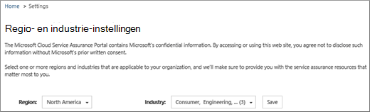
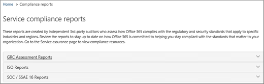
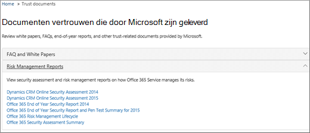
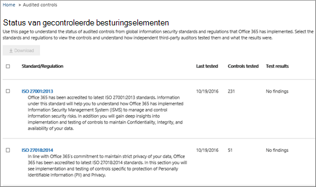

# Servicecontrole in het Beveiligings- en compliancecentrum

Gebruik Servicecontrole in het Beveiligings- & compliancecentrum voor toegang tot documenten die verschillende onderwerpen beschrijven, waaronder: 
  
- Beveiligingspraktijken van Microsoft voor klantgegevens die zijn opgeslagen in Office 365. 
    
- Onafhankelijke auditrapporten van derden van Office 365. 
    
- Implementatie- en testdetails voor beveiligings-, privacy- en compliancebesturingselementen die Office 365 gebruikt om uw gegevens te beveiligen. 
    
U kunt ook zien hoe Office 365 klanten kunnen helpen voldoen aan standaarden, wetten en voorschriften in verschillende bedrijfstakken, zoals:
  
-  Internationale organisatie voor normalisatie (ISO) 27001 en 27018 
    
- Health Insurance Portability and Accountability Act van 1996 (HIPAA)
    
- Federal Risk and Authorization Management Program (FedRAMP)
    
## Wie hebt u toegang Office 365 servicecontrole en hoe?

 **Nieuwe klanten en klanten** die microsoft onlineservices evalueren, hebben toegang tot Servicecontrole die is opgenomen in Office 365 Enterprise E3- en E5-abonnementen (zowel proefabonnementen als betaalde abonnementen). Als u geen van deze abonnementen hebt en servicecontrole wilt proberen, kunt u zich registreren voor een proefversie van [Office 365 Enterprise E5.](https://go.microsoft.com/fwlink/p/?LinkID=698279)
  
 **Leden van het O365-abonnement** hebben standaard toegang tot de sectie Servicecontrole in Office 365 Protection Center. Servicecontrole biedt rapporten en documenten waarin de beveiligingspraktijken van Microsoft worden beschreven voor klantgegevens die zijn opgeslagen in Office 365. Het bevat ook onafhankelijke auditrapporten van derden over Office 365.
 
## Uw branche- en regio-instellingen kiezen

Wanneer u servicecontrole voor het eerst gebruikt, is de eerste stap het configureren van uw branche- en regio-instellingen. U kunt deze instellingen op elk moment wijzigen. Als u deze instellingen configureert, kan Servicecontrole u inhoud bieden die het meest relevant is voor uw organisatie. Uw branche- en regio-instellingen configureren:
  
1. Nadat u servicecontrole hebt gebruikt, **selecteert u Instellingen** en wordt de pagina Regio- en industrieinstellingen weergegeven, zoals wordt weergegeven in de volgende schermafbeelding. 
    
    
  
2. Selecteer op **Instellingen** pagina de pijl-omlaag naast **Regio** en controleer de juiste regio's voor uw organisatie. 
    
3. Selecteer de pijl-omlaag naast **Industrie** en controleer de juiste bedrijfstakken voor uw organisatie. 
    
4. Wanneer u regio's en bedrijfstakken hebt geselecteerd, selecteert u **Opslaan.**
    
## Compliance- en vertrouwensinhoud zoeken, controleren en downloaden

Als u inhoud wilt bekijken en downloaden, selecteert u een optie in het navigatiedeelvenster:
  
- **Compliancerapporten** om onafhankelijke audits en beoordelingen van Office 365 en andere Microsoft-cloudservices weer te geven, zoals wordt weergegeven in de volgende schermafbeelding. 
    
    
  
- **Vertrouw documenten** om informatie weer te geven over hoe Microsoft werkt Office 365 zoals wordt weergegeven in de volgende schermafbeelding. 
    
    
  
- **Gecontroleerde besturingselementen** om informatie weer te geven over hoe Office 365 voldoen aan beveiligings-, compliance- en privacyvereisten, zoals wordt weergegeven in de volgende schermafbeelding. 
    
    
  
Selecteer het rapport dat u wilt downloaden en selecteer **Opslaan** om het te downloaden naar uw computer. Selecteer voor Gecontroleerde besturingselementen het beste rapport en selecteer vervolgens **Downloaden.** In de onderstaande tabel worden de rapporten beschreven die u op elke servicecontrolepagina kunt vinden. 
  
> [!NOTE]
> Servicecontrolerapporten en -documenten kunnen ten minste twaalf maanden na publicatie worden gedownload of totdat er een nieuwe versie van het document beschikbaar komt. 
  
|**Pagina Servicecontrole**|**Beschikbare inhoud**|**Beschrijving**|
|:-----|:-----|:-----|
|Compliancerapporten    | FedRamp     GRC-beoordeling     ISO     SOC/SSAE    |Gebruik service compliancerapporten om auditbeoordelingen te bekijken die zijn uitgevoerd door onafhankelijke externe controleurs van Office 365 Service Delivery Operations.    |
|Documenten vertrouwen    | Veelgestelde vragen en whitepapers     Risicobeheerrapporten    |Gebruik whitepapers, veelgestelde vragen, eindejaarsrapporten en andere Vertrouwelijke microsoft-bronnen die beschikbaar zijn voor u onder geheimhoudingsverklaring voor uw beoordeling/risicobeoordelingen.    |
|Gecontroleerde besturingselementen    |Globale standaarden en voorschriften die Office 365 geïmplementeerd.    | Hulp bij het beoordelen van risico's bij het evalueren, onboarden of gebruiken van Office 365 services. Zoek uit:     - Hoe Office 365 voldoen aan beveiligings-, compliance- en privacyvereisten.   - Over het testen van besturingselementen in Office 365, resultaten van deze tests en wanneer ze zijn voltooid.    |
   
Afhankelijk van uw specifieke set-up, kunnen de opties in uw weergave enkele verschillen hebben.
    
## Hulp krijgen bij Servicecontrole

[Contact opnemen met de ondersteuning voor zakelijke producten - Hulp voor beheerders](../business-video/get-help-support.md).
  
## Veelgestelde vragen

 **Waarom krijg ik een foutmelding dat documenten van Servicecontrole beschadigd zijn?**
  
De meeste servicecontroledocumenten hebben een PDF-indeling. Kies **Opslaan** om deze bestanden op te slaan in en open ze vervolgens vanaf uw lokale computer.