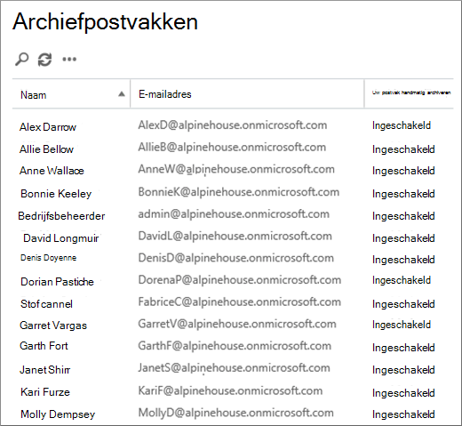
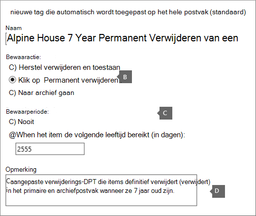
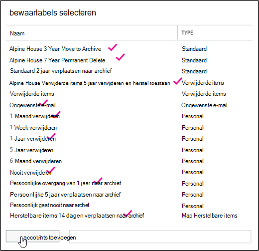

# <a name="set-up-an-archive-and-deletion-policy-for-mailboxes-in-your-organization"></a>Een archief- en verwijderingsbeleid instellen voor postvakken in uw organisatie

In Microsoft 365 kunnen beheerders een archiverings- en verwijderingsbeleid maken dat automatisch items naar het archiefpostvak van een gebruiker verplaatst en automatisch items uit het postvak verwijdert. De beheerder doet dit door een bewaarbeleid te maken dat is toegewezen aan postvakken en items na een bepaalde periode naar het archiefpostvak van een gebruiker te verplaatsten en items ook uit het postvak te verwijderen nadat ze een bepaalde leeftijdslimiet hebben bereikt. De werkelijke regels die bepalen welke items worden verplaatst of verwijderd en wanneer dat gebeurt, worden bewaarlabels genoemd. Bewaarlabels zijn gekoppeld aan een bewaarbeleid, dat op zijn beurt is toegewezen aan het postvak van een gebruiker. Met een bewaarlabel worden bewaarinstellingen toegepast op afzonderlijke berichten en mappen in het postvak van een gebruiker. Hiermee wordt bepaald hoelang een bericht in het postvak blijft staan en welke actie er wordt ondernomen wanneer het bericht de opgegeven bewaarleeftijd bereikt. Wanneer een bericht de bewaarleeftijd bereikt, wordt het verplaatst naar het archiefpostvak van de gebruiker of wordt het verwijderd.
  
In de stappen in dit artikel wordt een archiverings- en bewaarbeleid ingesteld voor een fictieve organisatie genaamd Alpine House. Het instellen van dit beleid omvat de volgende taken:
  
- Een archiefpostvak inschakelen voor elke gebruiker in de organisatie. Dit biedt gebruikers extra postvakopslag en is vereist, zodat een bewaarbeleid items naar het archiefpostvak kan verplaatsen. Daarnaast kan een gebruiker archiefgegevens opslaan door items naar het archiefpostvak te verplaatsen.

- Drie aangepaste bewaarlabels maken die het volgende doen:

  - Items die 3 jaar oud zijn, worden automatisch verplaatst naar het archiefpostvak van de gebruiker. Als u items naar het archiefpostvak verplaatst, wordt ruimte vrij in het primaire postvak van een gebruiker.

  - Items die 5 jaar oud zijn, worden automatisch verwijderd uit de map Verwijderde items. Hierdoor wordt ook ruimte vrij in het primaire postvak van de gebruiker. Gebruikers hebben de mogelijkheid om deze items zo nodig te herstellen. Zie de voetnoot in de sectie [Meer informatie](#more-information) voor meer informatie. 

  - Items die 7 jaar oud zijn, worden automatisch (en permanent) verwijderd uit zowel het primaire postvak als het archiefpostvak. Vanwege nalevingsregels zijn sommige organisaties verplicht om e-mail voor een bepaalde periode te bewaren. Nadat deze periode is verlopen, kan een organisatie deze postvakken van gebruikers definitief verwijderen.

- Een nieuw bewaarbeleid maken en de nieuwe aangepaste bewaarlabels eraan toevoegen. Daarnaast voegt u ingebouwde bewaarlabels toe aan het nieuwe bewaarbeleid. Dit geldt ook voor persoonlijke tags die gebruikers kunnen toewijzen aan items in hun postvak. U voegt ook een bewaarlabel toe die items verplaatst van de map Herstelbare items in het primaire postvak van de gebruiker naar de map Herstelbare items in het archiefpostvak. Hierdoor wordt ruimte vrij gemaakt in de map Herstelbare items van een gebruiker wanneer het postvak in de wacht wordt geplaatst.

U kunt enkele of alle stappen in dit artikel volgen om een archief- en verwijderingsbeleid in te stellen voor postvakken in uw eigen organisatie. U wordt aangeraden dit proces op een paar postvakken te testen voordat u het implementeert op alle postvakken in uw organisatie.
  
## <a name="before-you-set-up-an-archive-and-deletion-policy"></a>Voordat u een archief- en verwijderingsbeleid in stelt

- U moet een globale beheerder in uw organisatie zijn om de stappen in dit onderwerp uit te voeren. 

- Wanneer u een nieuw gebruikersaccount maakt en de gebruiker een Exchange Online toewijst, wordt automatisch een postvak voor de gebruiker gemaakt. Wanneer het postvak wordt gemaakt, wordt er automatisch een standaard bewaarbeleid toegewezen, genaamd Standaard MRM-beleid. In dit artikel maakt u een nieuw bewaarbeleid en wijst u dit toe aan postvakken van gebruikers, ter vervanging van het standaard MRM-beleid. Aan een postvak kan slechts één bewaarbeleid tegelijk zijn toegewezen.

- Zie Bewaarlabels en bewaarbeleid voor meer informatie over bewaarlabels en bewaarbeleid in [Exchange Online.](/exchange/security-and-compliance/messaging-records-management/retention-tags-and-policies)

## <a name="step-1-enable-archive-mailboxes-for-users"></a>Stap 1: Archiefpostvakken inschakelen voor gebruikers

De eerste stap is het inschakelen van het archiefpostvak voor elke gebruiker in uw organisatie. Het archiefpostvak van een gebruiker moet zijn ingeschakeld, zodat een bewaarlabel met de bewaaractie Verplaatsen naar archiveren het item kan verplaatsen nadat de bewaarleeftijd is verlopen.
  
> [!NOTE]
> U kunt archiefpostvakken op elk moment tijdens dit proces inschakelen, net zolang als ze op een bepaald moment zijn ingeschakeld voordat u het proces voltooit. Als een archiefpostvak niet is ingeschakeld, wordt er geen actie ondernomen op items waar een archief- of verwijderingsbeleid aan is toegewezen.
  
1. Ga naar [https://protection.office.com](https://protection.office.com).

2. Meld u aan met uw globale beheerdersaccount.
    
3. Ga in het & Compliancecentrum naar **Information governance** \> **Archive**.

    Er wordt een lijst met de postvakken in uw organisatie weergegeven en of het bijbehorende archiefpostvak is ingeschakeld of uitgeschakeld.

4. Selecteer alle postvakken door op de eerste in de  lijst te klikken, shift ingedrukt te houden en vervolgens op de laatste in de lijst te klikken.

    > [!TIP]
    > Bij deze stap wordt ervan uitgenomen dat er geen archiefpostvakken zijn ingeschakeld. Als u postvakken hebt met het archief ingeschakeld, houdt u **Ctrl** ingedrukt en klikt u op elk postvak met een uitgeschakeld archiefpostvak. U kunt ook  op de kolomkop Archiefpostvak klikken om de rijen te sorteren op basis van of het archiefpostvak is ingeschakeld of uitgeschakeld, zodat u gemakkelijker postvakken kunt selecteren.
  
5. Klik in het detailvenster onder **Bulkbewerking** op **Inschakelen.**

    Er wordt een waarschuwing weergegeven waarin wordt gezegd dat items die ouder zijn dan twee jaar, worden verplaatst naar het nieuwe archiefpostvak. Dit komt omdat het standaard bewaarbeleid dat aan een nieuw gebruikerspostvak is toegewezen wanneer het wordt gemaakt, een archiefbeleidslabel heeft met een bewaarleeftijd van 2 jaar. De standaardbeleidstag voor het aangepaste archief die u in stap 2 maakt, heeft een bewaarleeftijd van 3 jaar. Dit betekent dat items die 3 jaar of ouder zijn, worden verplaatst naar het archiefpostvak.

6. Klik **op Ja** om het waarschuwingsbericht te sluiten en het proces te starten om het archiefpostvak voor elk geselecteerd postvak in te stellen.

7. Wanneer het proces is voltooid, **klikt** u op Vernieuwen om de lijst op de pagina  **Archiveren bij te** werken.

    Het archiefpostvak is ingeschakeld voor alle gebruikers in uw organisatie.

    

## <a name="step-2-create-new-retention-tags-for-the-archive-and-deletion-policies"></a>Stap 2: Nieuwe bewaarlabels maken voor het archief- en verwijderingsbeleid

In deze stap maakt u de drie aangepaste bewaarlabels die eerder zijn beschreven.
  
- Alpine House 3 Year Move to Archive (aangepast archiefbeleid)

- Alpine House 7 Year Permanent Delete (aangepast verwijderingsbeleid)

- Alpine House Verwijderde items 5 jaar verwijderen en herstellen toestaan (aangepaste tag voor de map Verwijderde items)

Als u nieuwe bewaarlabels wilt maken, gebruikt u het Exchange (EAC) in uw Exchange Online organisatie. Gebruik de klassieke versie van de EAC.
  
1. Ga naar [https://admin.protection.outlook.com/ecp/](https://admin.protection.outlook.com/ecp/) en meld u aan met uw referenties.
  
2. Ga in het EAC naar **Compliancebeheerretentielabels**  >  

    Er wordt een lijst met bewaarlabels voor uw organisatie weergegeven.

### <a name="create-a-custom-archive-default-policy-tag"></a>Een aangepaste standaardbeleidstag voor het archief maken
  
Eerst maakt u een aangepaste standaardbeleidstag voor het archief (DPT) die items na 3 jaar naar het archiefpostvak verplaatst.
  
1. Klik op **de pagina Bewaarlabels** op **Pictogram Nieuw label** en selecteer automatisch toegepast op het hele  **postvak (standaard).**

2. Vul op de pagina Nieuwe tag die automatisch is toegepast op het hele **postvak (standaard)** de volgende velden in: 

    
  
   1. **Naam** Typ een naam voor de nieuwe bewaartag. 

   2. **Bewaaractie** Selecteer **Verplaatsen naar archief om** items naar het archiefpostvak te verplaatsen wanneer de bewaarperiode verloopt.

   3. **Bewaarperiode** Selecteer **Wanneer het item de volgende leeftijd bereikt (in dagen)** en voer vervolgens de duur van de bewaarperiode in. In dit scenario worden items na 1095 dagen (3 jaar) verplaatst naar het archiefpostvak.

   4. **Opmerking** (Optioneel) Typ een opmerking waarin het doel van de aangepaste bewaartag wordt uitgelegd.

3. Klik **op Opslaan** om het aangepaste archief-DPT te maken.

    Het nieuwe archief-DPT wordt weergegeven in de lijst met bewaarlabels.

### <a name="create-a-custom-deletion-default-policy-tag"></a>Een aangepaste standaardbeleidstag voor verwijderen maken
  
Vervolgens maakt u een andere aangepaste DPT, maar dit is een verwijderingsbeleid dat items na 7 jaar definitief verwijdert.
  
1. Klik op **de pagina Bewaarlabels** op **Pictogram Nieuw label** en selecteer automatisch toegepast op het hele  **postvak (standaard).**

2. Vul op de pagina Nieuwe tag die automatisch is toegepast op het hele **postvak (standaard)** de volgende velden in: 

    
  
   1. **Naam** Typ een naam voor de nieuwe bewaartag. 

   2. **Bewaaractie** Selecteer **Permanent verwijderen om** items uit het postvak te verwijderen wanneer de bewaarperiode verloopt.

   3. **Bewaarperiode** Selecteer **Wanneer het item de volgende leeftijd bereikt (in dagen)** en voer vervolgens de duur van de bewaarperiode in. In dit scenario worden items na 2555 dagen (7 jaar) verwijderd.

   4. **Opmerking** (Optioneel) Typ een opmerking waarin het doel van de aangepaste bewaartag wordt uitgelegd. 

3. Klik **op Opslaan** om het aangepaste verwijderings-DPT te maken. 

    Het nieuwe verwijderings-DPT wordt weergegeven in de lijst met bewaarlabels.

### <a name="create-a-custom-retention-policy-tag-for-the-deleted-items-folder"></a>Een aangepaste bewaarbeleidstag maken voor de map Verwijderde items
  
De laatste bewaartag die u maakt, is een aangepaste bewaarbeleidstag (RPT) voor de map Verwijderde items. Met deze tag worden items in de map Verwijderde items na 5 jaar verwijderd en wordt een herstelperiode verstrekt waarin gebruikers het hulpprogramma Verwijderde items herstellen kunnen gebruiken om een item te herstellen.
  
1. Klik op **de pagina Bewaarlabels** op **Pictogram Nieuw label** en selecteer automatisch toegepast op een  **standaardmap.**

2. Vul op de pagina Nieuwe tag die automatisch is **toegepast op een standaardmappagina** de volgende velden in:

    
  
   1. **Naam** Typ een naam voor de nieuwe bewaartag. 

   2. **Deze tag toepassen op de volgende standaardmap** Selecteer verwijderde items in **de vervolgkeuzelijst.**

   3. **Bewaaractie** Selecteer **Verwijderen en Herstel** toestaan om items te verwijderen wanneer de bewaarperiode verloopt, maar gebruikers toestaan om een verwijderd item te herstellen binnen de bewaarperiode van het verwijderde item (die standaard 14 dagen is).

   4. **Bewaarperiode** Selecteer **Wanneer het item de volgende leeftijd bereikt (in dagen)** en voer vervolgens de duur van de bewaarperiode in. In dit scenario worden items na 1825 dagen (5 jaar) verwijderd.

   5. **Opmerking** (Optioneel) Typ een opmerking waarin het doel van de aangepaste bewaartag wordt uitgelegd. 

3. Klik **op Opslaan** om de aangepaste RPT voor de map Verwijderde items te maken.

    Het nieuwe RPT wordt weergegeven in de lijst met bewaarlabels.

## <a name="step-3-create-a-new-retention-policy"></a>Stap 3: Een nieuw bewaarbeleid maken

Nadat u de aangepaste bewaarlabels hebt gemaakt, is de volgende stap het maken van een nieuw bewaarbeleid en het toevoegen van de bewaarlabels. U voegt de drie aangepaste bewaarlabels toe die u hebt gemaakt in stap 2 en de ingebouwde tags die in de eerste sectie zijn vermeld. In stap 4 wijst u dit nieuwe bewaarbeleid toe aan postvakken van gebruikers.
  
1. Ga in het EAC naar **Bewaarbeleid voor**  >  **nalevingsbeheer.**

2. Klik op **de pagina Bewaarbeleid** op **Nieuw** pictogram  .

3. Typ in **het** vak Naam een naam voor het nieuwe bewaarbeleid. bijvoorbeeld Alpine **House Archive and Deletion Policy**.

4. Klik **onder Bewaarlabels** op **Pictogram Nieuw**  toevoegen.

    Er wordt een lijst met de bewaarlabels in uw organisatie weergegeven. Houd er rekening mee dat de aangepaste tags die u in stap 2 hebt gemaakt, worden weergegeven.

5. Voeg de 9 bewaarlabels toe die zijn gemarkeerd in de volgende schermafbeelding (deze tags worden in de sectie [Meer informatie](#more-information) in meer detail beschreven). Als u een bewaarlabel wilt toevoegen, selecteert u deze en klikt u op **Toevoegen.**

    
  
    > [!TIP]
    > U kunt meerdere bewaarlabels selecteren door de **Ctrl-toets** ingedrukt te houden en vervolgens op elke tag te klikken. 
  
6. Nadat u de bewaarlabels hebt toegevoegd, klikt u op **OK.**

7. Klik op **de pagina Nieuw bewaarbeleid** op **Opslaan om** het nieuwe beleid te maken.

    Het nieuwe bewaarbeleid wordt weergegeven in de lijst. Selecteer deze optie om de bewaarlabels weer te geven die er aan zijn gekoppeld in het detailvenster.

    
  
## <a name="step-4-assign-the-new-retention-policy-to-user-mailboxes"></a>Stap 4: Het nieuwe bewaarbeleid toewijzen aan postvakken van gebruikers

Wanneer een nieuw postvak wordt gemaakt, wordt er standaard een bewaarbeleid met de naam Standaard MRM-beleid aan het postvak toegewezen. In deze stap vervangt u dit bewaarbeleid (omdat aan een postvak slechts één bewaarbeleid is toegewezen) door het nieuwe bewaarbeleid dat u in stap 3 hebt gemaakt toe te wijzen aan de postvakken van gebruikers in uw organisatie. In deze stap wordt ervan uitgenomen dat u het nieuwe beleid toewijst aan alle postvakken in uw organisatie.
  
1. Ga in het EAC naar **Geadresseerdenpostvakken.**  >  

    Er wordt een lijst met alle postvakken van gebruikers in uw organisatie weergegeven.

2. Selecteer alle postvakken door op de eerste in de  lijst te klikken, shift ingedrukt te houden en vervolgens op de laatste in de lijst te klikken. 

3. Klik in het detailvenster aan de rechterkant van het EAC, onder **Bulkbewerking,** op **Meer opties.**

4. Klik **onder Bewaarbeleid** op **Bijwerken.**

5. Selecteer op **de pagina Bewaarbeleid** bulksgewijs toewijzen in de vervolgkeuzelijst Het bewaarbeleid selecteren het bewaarbeleid dat u in stap 3 hebt gemaakt.  bijvoorbeeld Alpine **House Archive and Retention Policy**.

6. Klik **op Opslaan** om de nieuwe toewijzing voor bewaarbeleid op te slaan.

7. Als u wilt controleren of het nieuwe bewaarbeleid is toegewezen aan postvakken, kunt u het volgende doen:

   1. Selecteer een postvak op de pagina **Postvakken** en klik vervolgens **op**  Bewerken.

   2. Klik op de pagina postvakeigenschappen voor de geselecteerde gebruiker op **Postvakfuncties.**

   De naam van het nieuwe beleid dat aan het postvak is toegewezen, wordt weergegeven in **de** vervolgkeuzelijst Bewaarbeleid.

## <a name="optional-step-5-run-the-managed-folder-assistant-to-apply-the-new-settings"></a>(Optioneel) Stap 5: De assistent voor beheerde mappen uitvoeren om de nieuwe instellingen toe te passen

Nadat u het nieuwe bewaarbeleid hebt toegepast op postvakken in stap 4, kan het tot 7 dagen in Exchange Online duren voordat de nieuwe bewaarinstellingen worden toegepast op de postvakken. Dit komt omdat postvakken in een proces met de naam Beheerde mapassistent ten minste eenmaal per 7 dagen worden verwerkt.  In plaats van te wachten totdat de beheerde mapassistent wordt uitgevoerd, kunt u dit forceeren door de **cmdlet Start-ManagedFolderAssistant** uit te voeren in Exchange Online PowerShell.

 **Wat gebeurt er wanneer u de assistent beheerde map uitwerkt?** Hiermee worden de instellingen in het bewaarbeleid toegepast door items in het postvak te controleren en te bepalen of ze worden behouden. Vervolgens worden items die moeten worden opgeslagen, gestempeld met de juiste bewaarlabel en worden de opgegeven bewaaractie voor items die ouder zijn dan hun bewaarleeftijd.
  
Hier volgen de stappen om verbinding te maken met Exchange Online PowerShell en vervolgens de beheerde mapassistent uit te voeren op elk postvak in uw organisatie.

1. [Verbinding maken met Exchange Online PowerShell](/powershell/exchange/connect-to-exchange-online-powershell).
  
2. Voer de volgende twee opdrachten uit om de beheerde mapassistent te starten voor alle postvakken van gebruikers in uw organisatie.

    ```powershell
    $Mailboxes = Get-Mailbox -ResultSize Unlimited -Filter {RecipientTypeDetails -eq "UserMailbox"}
    ```

    ```powershell
    $Mailboxes.Identity | Start-ManagedFolderAssistant
    ```

Dat is alles. U hebt een archief- en verwijderingsbeleid ingesteld voor de organisatie Alpine House.

> [!NOTE]
> Zoals eerder vermeld, worden postvakken ten minste eenmaal per 7 dagen verwerkt door de beheerde mapassistent. Het is dus mogelijk dat een postvak vaker door de Assistent voor beheerde mappen kan worden verwerkt. Beheerders kunnen ook niet voorspellen wanneer een postvak de volgende keer wordt verwerkt door de Assistent voor beheerde mappen. Dit is een van de redenen waarom u het mogelijk handmatig wilt uitvoeren. Als u echter tijdelijk wilt voorkomen dat de assistent voor beheerde mappen de nieuwe bewaarinstellingen op een postvak kan toepassen, kunt u de opdracht uitvoeren om de assistent voor beheerde mappen tijdelijk uit te schakelen voor het verwerken van een `Set-Mailbox -ElcProcessingDisabled $true` postvak. Als u de assistent voor beheerde mappen opnieuw wilt inschakelen voor een postvak, moet u de opdracht `Set-Mailbox -ElcProcessingDisabled $false` uitvoeren. Als een postvakgebruiker een uitgeschakeld account heeft, worden de items niet verwerkt om de actie voor dat postvak te archiveren.
  
## <a name="optional-step-6-make-the-new-retention-policy-the-default-for-your-organization"></a>(Optioneel) Stap 6: Maak het nieuwe bewaarbeleid de standaardinstelling voor uw organisatie

In stap 4 moet u het nieuwe bewaarbeleid toewijzen aan bestaande postvakken. U kunt de Exchange Online zo configureren dat het nieuwe bewaarbeleid wordt toegewezen aan nieuwe postvakken die in de toekomst worden gemaakt. U doet dit met behulp Exchange Online PowerShell om het standaardpostvakplan van uw organisatie bij te werken. Een *postvakplan* is een sjabloon die automatisch eigenschappen configureert voor nieuwe postvakken.  In deze optionele stap kunt u het huidige bewaarbeleid dat is toegewezen aan het postvakplan (standaard het standaard MRM-beleid) vervangen door het bewaarbeleid dat u in stap 3 hebt gemaakt. Nadat u het postvakplan hebt bijgewerkt, wordt het nieuwe bewaarbeleid toegewezen aan nieuwe postvakken.

1. [Verbinding maken met Exchange Online PowerShell](/powershell/exchange/connect-to-exchange-online-powershell).

2. Voer de volgende opdracht uit om informatie weer te geven over de postvakplannen in uw organisatie.

    ```powershell
    Get-MailboxPlan | Format-Table DisplayName,RetentionPolicy,IsDefault
    ```

    Let op het postvakplan dat is ingesteld als de standaardinstelling.

3. Voer de volgende opdracht uit om het nieuwe bewaarbeleid dat u hebt gemaakt in stap 3 (bijvoorbeeld Alpine **House Archive and Retention Policy)** toe te wijzen aan het standaardpostvakplan. In dit voorbeeld wordt ervan uitgenomen dat de naam van het standaardpostvakplan **ExchangeOnlineEnterprise is.**

    ```powershell
    Set-MailboxPlan "ExchangeOnlineEnterprise" -RetentionPolicy "Alpine House Archive and Retention Policy"
    ```

4. U kunt de opdracht in stap 2 opnieuw uitvoeren om te controleren of het bewaarbeleid dat is toegewezen aan het standaardpostvakplan is gewijzigd.

## <a name="more-information"></a>Meer informatie

- Hoe wordt de bewaarleeftijd berekend? De bewaarleeftijd van postvakitems wordt berekend op basis van de datum van bezorging of de datum waarop u items maakt, zoals conceptberichten die niet worden verzonden, maar die door de gebruiker zijn gemaakt. Wanneer de beheerde mapassistent items in een postvak verwerkt, worden een begindatum en een vervaldatum afgestempeld voor alle items met bewaarlabels met de actie Verwijderen en Herstel toestaan of Definitief verwijderen. Items met een archieflabel worden gestempeld met een verhuisdatum. 

- De volgende tabel bevat meer informatie over elke bewaartag die is toegevoegd aan het aangepaste bewaarbeleid dat is gemaakt door de stappen in dit onderwerp te volgen.

    | Bewaarlabel | Wat deze tag doet | Ingebouwd of aangepast? | Type |
    |:-----|:-----|:-----|:-----|
    |Alpine House 3 Year Move to Archive  <br/> |Hiermee verplaatst u items die 1095 dagen (3 jaar) oud zijn naar het archiefpostvak.  <br/> |Aangepast (Zie [Stap 2: Nieuwe bewaarlabels maken voor het archief- en verwijderingsbeleid](#step-2-create-new-retention-tags-for-the-archive-and-deletion-policies))  <br/> |Standaardbeleidslabel (archief); deze tag wordt automatisch toegepast op het hele postvak.  <br/> |
    |Alpine House 7 Year Permanent Delete  <br/> |Items in het primaire postvak of het archiefpostvak worden permanent verwijderd wanneer ze 7 jaar oud zijn.  <br/> |Aangepast (Zie [Stap 2: Nieuwe bewaarlabels maken voor het archief- en verwijderingsbeleid](#step-2-create-new-retention-tags-for-the-archive-and-deletion-policies))  <br/> |Standaardbeleidstag (verwijdering); deze tag wordt automatisch toegepast op het hele postvak.  <br/> |
    |Alpine House Verwijderde items 5 jaar verwijderen en herstel toestaan  <br/> |Hiermee verwijdert u items uit de map Verwijderde items die 5 jaar oud zijn. Gebruikers kunnen deze items tot 14 dagen nadat ze zijn verwijderd, herstellen.<sup>\*</sup> <br/> |Aangepast (Zie [Stap 2: Nieuwe bewaarlabels maken voor het archief- en verwijderingsbeleid](#step-2-create-new-retention-tags-for-the-archive-and-deletion-policies))  <br/> |Bewaarbeleidslabel (verwijderde items); deze tag wordt automatisch toegepast op items in de map Verwijderde items.  <br/> |
    |Herstelbare items 14 dagen Verplaatsen naar archief  <br/> |Hiermee verplaatst u items die al 14 dagen in de map Herstelbare items staan naar de map Herstelbare items in het archiefpostvak.  <br/> |Ingebouwd  <br/> |Bewaarbeleidslabel (herstelbare items); deze tag wordt automatisch toegepast op items in de map Herstelbare items.  <br/> |
    |Ongewenste e-mail  <br/> |Items die al 30 dagen in de map Ongewenste e-mail staan, worden definitief verwijderd. Gebruikers kunnen deze items tot 14 dagen nadat ze zijn verwijderd, herstellen.<sup>\*</sup> <br/> |Ingebouwd  <br/> |Bewaarbeleidslabel (ongewenste e-mail); deze tag wordt automatisch toegepast op items in de map Ongewenste e-mail.  <br/> |
    |1 maand Verwijderen  <br/> |Items die 30 dagen oud zijn, worden definitief verwijderd. Gebruikers kunnen deze items tot 14 dagen nadat ze zijn verwijderd, herstellen.<sup>\*</sup> <br/> |Ingebouwd  <br/> |Persoonlijk; deze tag kan worden toegepast door gebruikers.  <br/> |
    |1 jaar verwijderen  <br/> |Items die 365 dagen oud zijn, worden definitief verwijderd. Gebruikers kunnen deze items tot 14 dagen nadat ze zijn verwijderd, herstellen.<sup>\*</sup> <br/> |Ingebouwd  <br/> |Persoonlijk; deze tag kan worden toegepast door gebruikers.  <br/> |
    |Nooit verwijderen  <br/> |Met deze tag wordt voorkomen dat items worden verwijderd door een bewaarbeleid.  <br/> |Ingebouwd  <br/> |Persoonlijk; deze tag kan worden toegepast door gebruikers.  <br/> |
    |Persoonlijke overgang van 1 jaar naar archief  <br/> |Items worden na 1 jaar verplaatst naar het archiefpostvak.  <br/> |Ingebouwd  <br/> |Persoonlijk; deze tag kan worden toegepast door gebruikers.  <br/> |

    > <sup>\*</sup>Gebruikers kunnen het hulpprogramma Verwijderde items herstellen in Outlook en Outlook op het web (voorheen bekend als Outlook Web App) gebruiken om een verwijderd item te herstellen binnen de bewaarperiode voor verwijderde items, die standaard 14 dagen in Exchange Online. Een beheerder kan een Windows PowerShell om de bewaarperiode voor verwijderde items te verhogen tot maximaal 30 dagen. Zie voor meer informatie: [Verwijderde items herstellen in](https://support.office.com/article/49e81f3c-c8f4-4426-a0b9-c0fd751d48ce) Outlook voor Windows en De bewaarperiode voor verwijderde items wijzigen voor een [postvak in Exchange Online](https://www.microsoft.com/?ref=go)
  
- Als u **de bewaartag Herstelbare items 14** dagen gebruikt, kunt u opslagruimte vrijmaken in de map Herstelbare items in het primaire postvak van de gebruiker. Dit is handig wanneer het postvak van een gebruiker in de wacht wordt geplaatst, wat betekent dat het postvak van de gebruiker nooit definitief wordt verwijderd. Zonder items naar het archiefpostvak te verplaatsen, is het mogelijk dat het opslagquotum voor de map Herstelbare items in het primaire postvak wordt bereikt. Zie Het quotum Herstelbare items voor postvakken in de wacht zetten voor meer informatie over dit en hoe u dit [kunt voorkomen.](./increase-the-recoverable-quota-for-mailboxes-on-hold.md)