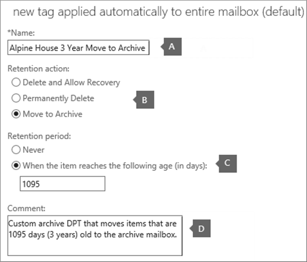

# <a name="set-up-an-archive-and-deletion-policy-for-mailboxes-in-your-organization"></a><span data-ttu-id="20522-103">Een archief en een verwijderingsbeleid instellen voor postvakken in uw organisatie</span><span class="sxs-lookup"><span data-stu-id="20522-103">Set up an archive and deletion policy for mailboxes in your organization</span></span>

<span data-ttu-id="20522-104">In Microsoft 365 kunnen beheerders een archiverings- en verwijderingsbeleid maken dat automatisch items naar het archiefpostvak van een gebruiker verplaatst en automatisch items uit het postvak verwijdert.</span><span class="sxs-lookup"><span data-stu-id="20522-104">In Microsoft 365, admins can create an archiving and deletion policy that automatically moves items to a user's archive mailbox and automatically deletes items from the mailbox.</span></span> <span data-ttu-id="20522-105">De beheerder doet dit door een bewaarbeleid te maken dat is toegewezen aan postvakken en items na een bepaalde periode naar het archiefpostvak van een gebruiker te verplaatsten en items ook uit het postvak te verwijderen nadat ze een bepaalde leeftijdslimiet hebben bereikt.</span><span class="sxs-lookup"><span data-stu-id="20522-105">The admin does this by creating a retention policy that's assigned to mailboxes, and moves items to a user's archive mailbox after a certain period of time and that also deletes items from the mailbox after they reach a certain age limit.</span></span> <span data-ttu-id="20522-106">De werkelijke regels die bepalen welke items worden verplaatst of verwijderd en wanneer dat gebeurt, worden bewaarlabels genoemd.</span><span class="sxs-lookup"><span data-stu-id="20522-106">The actual rules that determine what items are moved or deleted and when that happens are called retention tags.</span></span> <span data-ttu-id="20522-107">Bewaarlabels zijn gekoppeld aan een bewaarbeleid, dat op zijn beurt is toegewezen aan het postvak van een gebruiker.</span><span class="sxs-lookup"><span data-stu-id="20522-107">Retention tags are linked to a retention policy, that in turn is assigned to a user's mailbox.</span></span> <span data-ttu-id="20522-108">Met een bewaarlabel worden bewaarinstellingen toegepast op afzonderlijke berichten en mappen in het postvak van een gebruiker.</span><span class="sxs-lookup"><span data-stu-id="20522-108">A retention tag applies retention settings to individual messages and folders in a user's mailbox.</span></span> <span data-ttu-id="20522-109">Hiermee wordt bepaald hoelang een bericht in het postvak blijft staan en welke actie er wordt ondernomen wanneer het bericht de opgegeven bewaarleeftijd bereikt.</span><span class="sxs-lookup"><span data-stu-id="20522-109">It defines how long a message remains in the mailbox and what action is taken when the message reaches the specified retention age.</span></span> <span data-ttu-id="20522-110">Wanneer een bericht de bewaarleeftijd bereikt, wordt het verplaatst naar het archiefpostvak van de gebruiker of wordt het verwijderd.</span><span class="sxs-lookup"><span data-stu-id="20522-110">When a message reaches its retention age, it's either moved to the user's archive mailbox or it's deleted.</span></span>
  
<span data-ttu-id="20522-111">In de stappen in dit artikel wordt een archiverings- en bewaarbeleid ingesteld voor een fictieve organisatie genaamd Alpine House.</span><span class="sxs-lookup"><span data-stu-id="20522-111">The steps in this article will set up an archiving and retention policy for a fictitious organization named Alpine House.</span></span> <span data-ttu-id="20522-112">Het instellen van dit beleid omvat de volgende taken:</span><span class="sxs-lookup"><span data-stu-id="20522-112">Setting up this policy includes the following tasks:</span></span>
  
- <span data-ttu-id="20522-113">Een archiefpostvak inschakelen voor elke gebruiker in de organisatie.</span><span class="sxs-lookup"><span data-stu-id="20522-113">Enabling an archive mailbox for every user in the organization.</span></span> <span data-ttu-id="20522-114">Dit biedt gebruikers extra postvakopslag en is vereist, zodat een bewaarbeleid items naar het archiefpostvak kan verplaatsen.</span><span class="sxs-lookup"><span data-stu-id="20522-114">This gives users additional mailbox storage, and is required so that a retention policy can move items to the archive mailbox.</span></span> <span data-ttu-id="20522-115">Daarnaast kan een gebruiker archiefgegevens opslaan door items naar het archiefpostvak te verplaatsen.</span><span class="sxs-lookup"><span data-stu-id="20522-115">It also lets a user store archival information by moving items to their archive mailbox.</span></span>

- <span data-ttu-id="20522-116">Drie aangepaste bewaarlabels maken die het volgende doen:</span><span class="sxs-lookup"><span data-stu-id="20522-116">Creating three custom retention tags that do the following:</span></span>

  - <span data-ttu-id="20522-117">Items die 3 jaar oud zijn, worden automatisch verplaatst naar het archiefpostvak van de gebruiker.</span><span class="sxs-lookup"><span data-stu-id="20522-117">Automatically moves items that are 3 years old to the user's archive mailbox.</span></span> <span data-ttu-id="20522-118">Als u items naar het archiefpostvak verplaatst, wordt ruimte vrij in het primaire postvak van een gebruiker.</span><span class="sxs-lookup"><span data-stu-id="20522-118">Moving items to the archive mailbox frees up space in a user's primary mailbox.</span></span>

  - <span data-ttu-id="20522-119">Items die 5 jaar oud zijn, worden automatisch verwijderd uit de map Verwijderde items.</span><span class="sxs-lookup"><span data-stu-id="20522-119">Automatically deletes items that are 5 years old from the Deleted Items folder.</span></span> <span data-ttu-id="20522-120">Hierdoor wordt ook ruimte vrij in het primaire postvak van de gebruiker.</span><span class="sxs-lookup"><span data-stu-id="20522-120">This also frees up space in the user's primary mailbox.</span></span> <span data-ttu-id="20522-121">Gebruikers hebben de mogelijkheid om deze items zo nodig te herstellen.</span><span class="sxs-lookup"><span data-stu-id="20522-121">User's will have the opportunity to recover these items if necessary.</span></span> <span data-ttu-id="20522-122">Zie de voetnoot in de sectie [Meer informatie](#more-information) voor meer informatie.</span><span class="sxs-lookup"><span data-stu-id="20522-122">See the footnote in the [More information](#more-information) section for more details.</span></span> 

  - <span data-ttu-id="20522-123">Items die 7 jaar oud zijn, worden automatisch (en permanent) verwijderd uit zowel het primaire postvak als het archiefpostvak.</span><span class="sxs-lookup"><span data-stu-id="20522-123">Automatically (and permanently) deletes items that are 7 years old from both the primary and archive mailbox.</span></span> <span data-ttu-id="20522-124">Vanwege nalevingsregels zijn sommige organisaties verplicht om e-mail voor een bepaalde periode te bewaren.</span><span class="sxs-lookup"><span data-stu-id="20522-124">Because of compliance regulations, some organization's are required to retain email for a certain period of time.</span></span> <span data-ttu-id="20522-125">Nadat deze periode is verlopen, kan een organisatie deze postvakken van gebruikers definitief verwijderen.</span><span class="sxs-lookup"><span data-stu-id="20522-125">After this time period expires, an organization might want to permanently remove these items user mailboxes.</span></span>

- <span data-ttu-id="20522-126">Een nieuw bewaarbeleid maken en de nieuwe aangepaste bewaarlabels eraan toevoegen.</span><span class="sxs-lookup"><span data-stu-id="20522-126">Creating a new retention policy and adding the new custom retention tags to it.</span></span> <span data-ttu-id="20522-127">Daarnaast voegt u ingebouwde bewaarlabels toe aan het nieuwe bewaarbeleid.</span><span class="sxs-lookup"><span data-stu-id="20522-127">Additionally, you'll also add built-in retention tags to the new retention policy.</span></span> <span data-ttu-id="20522-128">Dit geldt ook voor persoonlijke tags die gebruikers kunnen toewijzen aan items in hun postvak.</span><span class="sxs-lookup"><span data-stu-id="20522-128">This includes personal tags that users can assign to items in their mailbox.</span></span> <span data-ttu-id="20522-129">U voegt ook een bewaarlabel toe die items verplaatst van de map Herstelbare items in het primaire postvak van de gebruiker naar de map Herstelbare items in het archiefpostvak.</span><span class="sxs-lookup"><span data-stu-id="20522-129">You'll also add a retention tag that moves items from the Recoverable Items folder in the user's primary mailbox to the Recoverable Items folder in their archive mailbox.</span></span> <span data-ttu-id="20522-130">Hierdoor wordt ruimte vrij gemaakt in de map Herstelbare items van een gebruiker wanneer het postvak in de wacht wordt geplaatst.</span><span class="sxs-lookup"><span data-stu-id="20522-130">This helps free up space in a user's Recoverable Items folder when their mailbox is placed on hold.</span></span>

<span data-ttu-id="20522-131">U kunt enkele of alle stappen in dit artikel volgen om een archief- en verwijderingsbeleid in te stellen voor postvakken in uw eigen organisatie.</span><span class="sxs-lookup"><span data-stu-id="20522-131">You can follow some or all of the steps in this article to set up an archive and deletion policy for mailboxes in your own organization.</span></span> <span data-ttu-id="20522-132">U wordt aangeraden dit proces op een paar postvakken te testen voordat u het implementeert op alle postvakken in uw organisatie.</span><span class="sxs-lookup"><span data-stu-id="20522-132">We recommend that you test this process on a few mailboxes before implementing it on all mailboxes in your organization.</span></span>
  
## <a name="before-you-set-up-an-archive-and-deletion-policy"></a><span data-ttu-id="20522-133">Voordat u een archief- en verwijderingsbeleid in stelt</span><span class="sxs-lookup"><span data-stu-id="20522-133">Before you set up an archive and deletion policy</span></span>

- <span data-ttu-id="20522-134">U moet een globale beheerder in uw organisatie zijn om de stappen in dit onderwerp uit te voeren.</span><span class="sxs-lookup"><span data-stu-id="20522-134">You have to be a global administrator in your organization to perform the steps in this topic.</span></span> 

- <span data-ttu-id="20522-135">Wanneer u een nieuw gebruikersaccount maakt en de gebruiker een Exchange Online toewijst, wordt automatisch een postvak voor de gebruiker gemaakt.</span><span class="sxs-lookup"><span data-stu-id="20522-135">When you create a new user account and assign the user an Exchange Online license, a mailbox is automatically created for the user.</span></span> <span data-ttu-id="20522-136">Wanneer het postvak wordt gemaakt, wordt er automatisch een standaard bewaarbeleid toegewezen, genaamd Standaard MRM-beleid.</span><span class="sxs-lookup"><span data-stu-id="20522-136">When the mailbox is created, it's automatically assigned a default retention policy, named Default MRM Policy.</span></span> <span data-ttu-id="20522-137">In dit artikel maakt u een nieuw bewaarbeleid en wijst u dit toe aan postvakken van gebruikers, ter vervanging van het standaard MRM-beleid.</span><span class="sxs-lookup"><span data-stu-id="20522-137">In this article, you will create a new retention policy and then assign it to user mailboxes, replacing the Default MRM policy.</span></span> <span data-ttu-id="20522-138">Aan een postvak kan slechts één bewaarbeleid tegelijk zijn toegewezen.</span><span class="sxs-lookup"><span data-stu-id="20522-138">A mailbox can have only one retention policy assigned to it at any one time.</span></span>

- <span data-ttu-id="20522-139">Zie Bewaarlabels en bewaarbeleid voor meer informatie over bewaarlabels en bewaarbeleid in [Exchange Online.](/exchange/security-and-compliance/messaging-records-management/retention-tags-and-policies)</span><span class="sxs-lookup"><span data-stu-id="20522-139">To learn more about retention tags and retention policies in Exchange Online, see [Retention tags and retention policies](/exchange/security-and-compliance/messaging-records-management/retention-tags-and-policies).</span></span>

## <a name="step-1-enable-archive-mailboxes-for-users"></a><span data-ttu-id="20522-140">Stap 1: Archiefpostvakken inschakelen voor gebruikers</span><span class="sxs-lookup"><span data-stu-id="20522-140">Step 1: Enable archive mailboxes for users</span></span>

<span data-ttu-id="20522-141">De eerste stap is het inschakelen van het archiefpostvak voor elke gebruiker in uw organisatie.</span><span class="sxs-lookup"><span data-stu-id="20522-141">The first step is to enable the archive mailbox for each user in your organization.</span></span> <span data-ttu-id="20522-142">Het archiefpostvak van een gebruiker moet zijn ingeschakeld, zodat een bewaarlabel met de bewaaractie Verplaatsen naar archiveren het item kan verplaatsen nadat de bewaarleeftijd is verlopen.</span><span class="sxs-lookup"><span data-stu-id="20522-142">A user's archive mailbox has to be enabled so that a retention tag with a "Move to Archive" retention action can move the item after the retention age expires.</span></span>
  
> [!NOTE]
> <span data-ttu-id="20522-143">U kunt archiefpostvakken op elk moment tijdens dit proces inschakelen, net zolang als ze op een bepaald moment zijn ingeschakeld voordat u het proces voltooit.</span><span class="sxs-lookup"><span data-stu-id="20522-143">You can enable archive mailboxes any time during this process, just as long as they're enabled at some point before you complete the process.</span></span> <span data-ttu-id="20522-144">Als een archiefpostvak niet is ingeschakeld, wordt er geen actie ondernomen op items waar een archief- of verwijderingsbeleid aan is toegewezen.</span><span class="sxs-lookup"><span data-stu-id="20522-144">If an archive mailbox isn't enabled, no action is taken on any items that have an archive or deletion policy assigned to it.</span></span>
  
1. <span data-ttu-id="20522-145">Ga naar [https://protection.office.com](https://protection.office.com).</span><span class="sxs-lookup"><span data-stu-id="20522-145">Go to [https://protection.office.com](https://protection.office.com).</span></span>

2. <span data-ttu-id="20522-146">Meld u aan met uw globale beheerdersaccount.</span><span class="sxs-lookup"><span data-stu-id="20522-146">Sign in using your global administrator account.</span></span>
    
3. <span data-ttu-id="20522-147">Ga in het & Compliancecentrum naar **Information governance** \> **Archive**.</span><span class="sxs-lookup"><span data-stu-id="20522-147">In the Security & Compliance Center, go to **Information governance** \> **Archive**.</span></span>

    <span data-ttu-id="20522-148">Er wordt een lijst met de postvakken in uw organisatie weergegeven en of het bijbehorende archiefpostvak is ingeschakeld of uitgeschakeld.</span><span class="sxs-lookup"><span data-stu-id="20522-148">A list of the mailboxes in your organization is displayed and whether the corresponding archive mailbox is enabled or disabled.</span></span>

4. <span data-ttu-id="20522-149">Selecteer alle postvakken door op de eerste in de  lijst te klikken, shift ingedrukt te houden en vervolgens op de laatste in de lijst te klikken.</span><span class="sxs-lookup"><span data-stu-id="20522-149">Select all the mailboxes by clicking on the first one in the list, holding down the **Shift** key, and then clicking the last one in the list.</span></span>

    > [!TIP]
    > <span data-ttu-id="20522-150">Bij deze stap wordt ervan uitgenomen dat er geen archiefpostvakken zijn ingeschakeld.</span><span class="sxs-lookup"><span data-stu-id="20522-150">This step assumes that no archive mailboxes are enabled.</span></span> <span data-ttu-id="20522-151">Als u postvakken hebt met het archief ingeschakeld, houdt u **Ctrl** ingedrukt en klikt u op elk postvak met een uitgeschakeld archiefpostvak.</span><span class="sxs-lookup"><span data-stu-id="20522-151">If you have any mailboxes with the archive enabled, hold down the **Ctrl** key and click each mailbox that has a disabled archive mailbox.</span></span> <span data-ttu-id="20522-152">U kunt ook  op de kolomkop Archiefpostvak klikken om de rijen te sorteren op basis van of het archiefpostvak is ingeschakeld of uitgeschakeld, zodat u gemakkelijker postvakken kunt selecteren.</span><span class="sxs-lookup"><span data-stu-id="20522-152">Or you can click the **Archive mailbox** column header to sort the rows based on whether the archive mailbox is enabled or disabled to make it easier to select mailboxes.</span></span>
  
5. <span data-ttu-id="20522-153">Klik in het detailvenster onder **Bulkbewerking** op **Inschakelen.**</span><span class="sxs-lookup"><span data-stu-id="20522-153">In the details pane, under **Bulk Edit**, click **Enable**.</span></span>

    <span data-ttu-id="20522-154">Er wordt een waarschuwing weergegeven waarin wordt gezegd dat items die ouder zijn dan twee jaar, worden verplaatst naar het nieuwe archiefpostvak.</span><span class="sxs-lookup"><span data-stu-id="20522-154">A warning is displayed saying that items that are older than two years will be moved to the new archive mailbox.</span></span> <span data-ttu-id="20522-155">Dit komt omdat het standaard bewaarbeleid dat aan een nieuw gebruikerspostvak is toegewezen wanneer het wordt gemaakt, een archiefbeleidslabel heeft met een bewaarleeftijd van 2 jaar.</span><span class="sxs-lookup"><span data-stu-id="20522-155">This is because the default retention policy that's assigned a new user mailbox when it's created has an archive default policy tag that has a retention age of 2 years.</span></span> <span data-ttu-id="20522-156">De standaardbeleidstag voor het aangepaste archief die u in stap 2 maakt, heeft een bewaarleeftijd van 3 jaar.</span><span class="sxs-lookup"><span data-stu-id="20522-156">The custom archive default policy tag that you'll create in Step 2 has a retention age of 3 years.</span></span> <span data-ttu-id="20522-157">Dit betekent dat items die 3 jaar of ouder zijn, worden verplaatst naar het archiefpostvak.</span><span class="sxs-lookup"><span data-stu-id="20522-157">That means items that are 3 years or older will be moved to the archive mailbox.</span></span>

6. <span data-ttu-id="20522-158">Klik **op Ja** om het waarschuwingsbericht te sluiten en het proces te starten om het archiefpostvak voor elk geselecteerd postvak in te stellen.</span><span class="sxs-lookup"><span data-stu-id="20522-158">Click **Yes** to close the warning message and start the process to enable the archive mailbox for each selected mailbox.</span></span>

7. <span data-ttu-id="20522-159">Wanneer het proces is voltooid, **klikt** u op Vernieuwen om de lijst op de pagina  **Archiveren bij te** werken.</span><span class="sxs-lookup"><span data-stu-id="20522-159">When the process is complete, click **Refresh**  to update the list on the **Archive** page.</span></span>

    <span data-ttu-id="20522-160">Het archiefpostvak is ingeschakeld voor alle gebruikers in uw organisatie.</span><span class="sxs-lookup"><span data-stu-id="20522-160">The archive mailbox is enabled for all user's in your organization.</span></span>

    

## <a name="step-2-create-new-retention-tags-for-the-archive-and-deletion-policies"></a><span data-ttu-id="20522-162">Stap 2: Nieuwe bewaarlabels maken voor het archief- en verwijderingsbeleid</span><span class="sxs-lookup"><span data-stu-id="20522-162">Step 2: Create new retention tags for the archive and deletion policies</span></span>

<span data-ttu-id="20522-163">In deze stap maakt u de drie aangepaste bewaarlabels die eerder zijn beschreven.</span><span class="sxs-lookup"><span data-stu-id="20522-163">In this step, you'll create the three custom retention tags that were previously described.</span></span>
  
- <span data-ttu-id="20522-164">Alpine House 3 Year Move to Archive (aangepast archiefbeleid)</span><span class="sxs-lookup"><span data-stu-id="20522-164">Alpine House 3 Year Move to Archive (custom archive policy)</span></span>

- <span data-ttu-id="20522-165">Alpine House 7 Year Permanent Delete (aangepast verwijderingsbeleid)</span><span class="sxs-lookup"><span data-stu-id="20522-165">Alpine House 7 Year Permanently Delete (custom deletion policy)</span></span>

- <span data-ttu-id="20522-166">Alpine House Verwijderde items 5 jaar verwijderen en herstellen toestaan (aangepaste tag voor de map Verwijderde items)</span><span class="sxs-lookup"><span data-stu-id="20522-166">Alpine House Deleted Items 5 Years Delete and Allow Recovery (custom tag for the Deleted Items folder)</span></span>

<span data-ttu-id="20522-167">Als u nieuwe bewaarlabels wilt maken, gebruikt u het Exchange (EAC) in uw Exchange Online organisatie.</span><span class="sxs-lookup"><span data-stu-id="20522-167">To create new retention tags, you'll use the Exchange admin center (EAC) in your Exchange Online organization.</span></span> <span data-ttu-id="20522-168">Gebruik de klassieke versie van de EAC.</span><span class="sxs-lookup"><span data-stu-id="20522-168">Be sure to use the classic version of the EAC.</span></span>
  
1. <span data-ttu-id="20522-169">Ga naar [https://admin.protection.outlook.com/ecp/](https://admin.protection.outlook.com/ecp/) en meld u aan met uw referenties.</span><span class="sxs-lookup"><span data-stu-id="20522-169">Go to [https://admin.protection.outlook.com/ecp/](https://admin.protection.outlook.com/ecp/) and sign in using your credentials.</span></span>
  
2. <span data-ttu-id="20522-170">Ga in het EAC naar **Compliancebeheerretentielabels**  >  </span><span class="sxs-lookup"><span data-stu-id="20522-170">In the EAC, go to **Compliance management** > **Retention tags**</span></span>

    <span data-ttu-id="20522-171">Er wordt een lijst met bewaarlabels voor uw organisatie weergegeven.</span><span class="sxs-lookup"><span data-stu-id="20522-171">A list of the retention tags for your organization is displayed.</span></span>

### <a name="create-a-custom-archive-default-policy-tag"></a><span data-ttu-id="20522-172">Een aangepaste standaardbeleidstag voor het archief maken</span><span class="sxs-lookup"><span data-stu-id="20522-172">Create a custom archive default policy tag</span></span>
  
<span data-ttu-id="20522-173">Eerst maakt u een aangepaste standaardbeleidstag voor het archief (DPT) die items na 3 jaar naar het archiefpostvak verplaatst.</span><span class="sxs-lookup"><span data-stu-id="20522-173">First, you'll create a custom archive default policy tag (DPT) that will move items to the archive mailbox after 3 years.</span></span>
  
1. <span data-ttu-id="20522-174">Klik op **de pagina Bewaarlabels** op **Pictogram Nieuw label** en selecteer automatisch toegepast op het hele  **postvak (standaard).**</span><span class="sxs-lookup"><span data-stu-id="20522-174">On the **Retention tags** page, click **New tag**, and then select **applied automatically to entire mailbox (default)**.</span></span>

2. <span data-ttu-id="20522-175">Vul op de pagina Nieuwe tag die automatisch is toegepast op het hele **postvak (standaard)** de volgende velden in:</span><span class="sxs-lookup"><span data-stu-id="20522-175">On the **New tag applied automatically to entire mailbox (default)** page, complete the following fields:</span></span> 

    
  
   1. <span data-ttu-id="20522-177">**Naam** Typ een naam voor de nieuwe bewaartag.</span><span class="sxs-lookup"><span data-stu-id="20522-177">**Name** Type a name for the new retention tag.</span></span> 

   2. <span data-ttu-id="20522-178">**Bewaaractie** Selecteer **Verplaatsen naar archief om** items naar het archiefpostvak te verplaatsen wanneer de bewaarperiode verloopt.</span><span class="sxs-lookup"><span data-stu-id="20522-178">**Retention action** Select **Move to Archive** to move items to the archive mailbox when the retention period expires.</span></span>

   3. <span data-ttu-id="20522-179">**Bewaarperiode** Selecteer **Wanneer het item de volgende leeftijd bereikt (in dagen)** en voer vervolgens de duur van de bewaarperiode in.</span><span class="sxs-lookup"><span data-stu-id="20522-179">**Retention period** Select **When the item reaches the following age (in days)**, and then enter the duration of the retention period.</span></span> <span data-ttu-id="20522-180">In dit scenario worden items na 1095 dagen (3 jaar) verplaatst naar het archiefpostvak.</span><span class="sxs-lookup"><span data-stu-id="20522-180">For this scenario, items will be moved to the archive mailbox after 1095 days (3 years).</span></span>

   4. <span data-ttu-id="20522-181">**Opmerking** (Optioneel) Typ een opmerking waarin het doel van de aangepaste bewaartag wordt uitgelegd.</span><span class="sxs-lookup"><span data-stu-id="20522-181">**Comment** (Optional) Type a comment that explains the purpose of the custom retention tag.</span></span>

3. <span data-ttu-id="20522-182">Klik **op Opslaan** om het aangepaste archief-DPT te maken.</span><span class="sxs-lookup"><span data-stu-id="20522-182">Click **Save** to create the custom archive DPT.</span></span>

    <span data-ttu-id="20522-183">Het nieuwe archief-DPT wordt weergegeven in de lijst met bewaarlabels.</span><span class="sxs-lookup"><span data-stu-id="20522-183">The new archive DPT is displayed in the list of retention tags.</span></span>

### <a name="create-a-custom-deletion-default-policy-tag"></a><span data-ttu-id="20522-184">Een aangepaste standaardbeleidstag voor verwijderen maken</span><span class="sxs-lookup"><span data-stu-id="20522-184">Create a custom deletion default policy tag</span></span>
  
<span data-ttu-id="20522-185">Vervolgens maakt u een andere aangepaste DPT, maar dit is een verwijderingsbeleid dat items na 7 jaar definitief verwijdert.</span><span class="sxs-lookup"><span data-stu-id="20522-185">Next, you'll create another custom DPT but this one will be a deletion policy that permanently deletes items after 7 years.</span></span>
  
1. <span data-ttu-id="20522-186">Klik op **de pagina Bewaarlabels** op **Pictogram Nieuw label** en selecteer automatisch toegepast op het hele  **postvak (standaard).**</span><span class="sxs-lookup"><span data-stu-id="20522-186">On the **Retention tags** page, click **New tag**, and then select **applied automatically to entire mailbox (default)**.</span></span>

2. <span data-ttu-id="20522-187">Vul op de pagina Nieuwe tag die automatisch is toegepast op het hele **postvak (standaard)** de volgende velden in:</span><span class="sxs-lookup"><span data-stu-id="20522-187">On the **New tag applied automatically to entire mailbox (default)** page, complete the following fields:</span></span> 

    
  
   1. <span data-ttu-id="20522-189">**Naam** Typ een naam voor de nieuwe bewaartag.</span><span class="sxs-lookup"><span data-stu-id="20522-189">**Name** Type a name for the new retention tag.</span></span> 

   2. <span data-ttu-id="20522-190">**Bewaaractie** Selecteer **Permanent verwijderen om** items uit het postvak te verwijderen wanneer de bewaarperiode verloopt.</span><span class="sxs-lookup"><span data-stu-id="20522-190">**Retention action** Select **Permanently Delete** to purge items from the mailbox when the retention period expires.</span></span>

   3. <span data-ttu-id="20522-191">**Bewaarperiode** Selecteer **Wanneer het item de volgende leeftijd bereikt (in dagen)** en voer vervolgens de duur van de bewaarperiode in.</span><span class="sxs-lookup"><span data-stu-id="20522-191">**Retention period** Select **When the item reaches the following age (in days)**, and then enter the duration of the retention period.</span></span> <span data-ttu-id="20522-192">In dit scenario worden items na 2555 dagen (7 jaar) verwijderd.</span><span class="sxs-lookup"><span data-stu-id="20522-192">For this scenario, items will be purged after 2555 days (7 years).</span></span>

   4. <span data-ttu-id="20522-193">**Opmerking** (Optioneel) Typ een opmerking waarin het doel van de aangepaste bewaartag wordt uitgelegd.</span><span class="sxs-lookup"><span data-stu-id="20522-193">**Comment** (Optional) Type a comment that explains the purpose of the custom retention tag.</span></span> 

3. <span data-ttu-id="20522-194">Klik **op Opslaan** om het aangepaste verwijderings-DPT te maken.</span><span class="sxs-lookup"><span data-stu-id="20522-194">Click **Save** to create the custom deletion DPT.</span></span> 

    <span data-ttu-id="20522-195">Het nieuwe verwijderings-DPT wordt weergegeven in de lijst met bewaarlabels.</span><span class="sxs-lookup"><span data-stu-id="20522-195">The new deletion DPT is displayed in the list of retention tags.</span></span>

### <a name="create-a-custom-retention-policy-tag-for-the-deleted-items-folder"></a><span data-ttu-id="20522-196">Een aangepaste bewaarbeleidstag maken voor de map Verwijderde items</span><span class="sxs-lookup"><span data-stu-id="20522-196">Create a custom retention policy tag for the Deleted Items folder</span></span>
  
<span data-ttu-id="20522-197">De laatste bewaartag die u maakt, is een aangepaste bewaarbeleidstag (RPT) voor de map Verwijderde items.</span><span class="sxs-lookup"><span data-stu-id="20522-197">The last retention tag that you'll create is a custom retention policy tag (RPT) for the Deleted Items folder.</span></span> <span data-ttu-id="20522-198">Met deze tag worden items in de map Verwijderde items na 5 jaar verwijderd en wordt een herstelperiode verstrekt waarin gebruikers het hulpprogramma Verwijderde items herstellen kunnen gebruiken om een item te herstellen.</span><span class="sxs-lookup"><span data-stu-id="20522-198">This tag will delete items in the Deleted Items folder after 5 years, and provides a recovery period when users can use the Recover Deleted Items tool to recover an item.</span></span>
  
1. <span data-ttu-id="20522-199">Klik op **de pagina Bewaarlabels** op **Pictogram Nieuw label** en selecteer automatisch toegepast op een  **standaardmap.**</span><span class="sxs-lookup"><span data-stu-id="20522-199">On the **Retention tags** page, click **New tag** , and then select **applied automatically to a default folder**.</span></span>

2. <span data-ttu-id="20522-200">Vul op de pagina Nieuwe tag die automatisch is **toegepast op een standaardmappagina** de volgende velden in:</span><span class="sxs-lookup"><span data-stu-id="20522-200">On the **New tag applied automatically to a default folder** page, complete the following fields:</span></span>

    
  
   1. <span data-ttu-id="20522-202">**Naam** Typ een naam voor de nieuwe bewaartag.</span><span class="sxs-lookup"><span data-stu-id="20522-202">**Name** Type a name for the new retention tag.</span></span> 

   2. <span data-ttu-id="20522-203">**Deze tag toepassen op de volgende standaardmap** Selecteer verwijderde items in **de vervolgkeuzelijst.**</span><span class="sxs-lookup"><span data-stu-id="20522-203">**Apply this tag to the following default folder** In the drop-down list, select **Deleted Items**.</span></span>

   3. <span data-ttu-id="20522-204">**Bewaaractie** Selecteer **Verwijderen en Herstel** toestaan om items te verwijderen wanneer de bewaarperiode verloopt, maar gebruikers toestaan om een verwijderd item te herstellen binnen de bewaarperiode van het verwijderde item (die standaard 14 dagen is).</span><span class="sxs-lookup"><span data-stu-id="20522-204">**Retention action** Select **Delete and Allow Recovery** to delete items when the retention period expires, but allow users to recover a deleted item within the deleted item retention period (which by default is 14 days).</span></span>

   4. <span data-ttu-id="20522-205">**Bewaarperiode** Selecteer **Wanneer het item de volgende leeftijd bereikt (in dagen)** en voer vervolgens de duur van de bewaarperiode in.</span><span class="sxs-lookup"><span data-stu-id="20522-205">**Retention period** Select **When the item reaches the following age (in days)**, and then enter the duration of the retention period.</span></span> <span data-ttu-id="20522-206">In dit scenario worden items na 1825 dagen (5 jaar) verwijderd.</span><span class="sxs-lookup"><span data-stu-id="20522-206">For this scenario, items will be deleted after 1825 days (5 years).</span></span>

   5. <span data-ttu-id="20522-207">**Opmerking** (Optioneel) Typ een opmerking waarin het doel van de aangepaste bewaartag wordt uitgelegd.</span><span class="sxs-lookup"><span data-stu-id="20522-207">**Comment** (Optional) Type a comment that explains the purpose of the custom retention tag.</span></span> 

3. <span data-ttu-id="20522-208">Klik **op Opslaan** om de aangepaste RPT voor de map Verwijderde items te maken.</span><span class="sxs-lookup"><span data-stu-id="20522-208">Click **Save** to create the custom RPT for the Deleted Items folder.</span></span>

    <span data-ttu-id="20522-209">Het nieuwe RPT wordt weergegeven in de lijst met bewaarlabels.</span><span class="sxs-lookup"><span data-stu-id="20522-209">The new RPT is displayed in the list of retention tags.</span></span>

## <a name="step-3-create-a-new-retention-policy"></a><span data-ttu-id="20522-210">Stap 3: Een nieuw bewaarbeleid maken</span><span class="sxs-lookup"><span data-stu-id="20522-210">Step 3: Create a new retention policy</span></span>

<span data-ttu-id="20522-211">Nadat u de aangepaste bewaarlabels hebt gemaakt, is de volgende stap het maken van een nieuw bewaarbeleid en het toevoegen van de bewaarlabels.</span><span class="sxs-lookup"><span data-stu-id="20522-211">After you create the custom retention tags, the next step is to create a new retention policy and add the retention tags.</span></span> <span data-ttu-id="20522-212">U voegt de drie aangepaste bewaarlabels toe die u hebt gemaakt in stap 2 en de ingebouwde tags die in de eerste sectie zijn vermeld.</span><span class="sxs-lookup"><span data-stu-id="20522-212">You'll add the three custom retention tags that you created in Step 2, and the built-in tags that were mentioned in the first section.</span></span> <span data-ttu-id="20522-213">In stap 4 wijst u dit nieuwe bewaarbeleid toe aan postvakken van gebruikers.</span><span class="sxs-lookup"><span data-stu-id="20522-213">In Step 4, you'll assign this new retention policy to user mailboxes.</span></span>
  
1. <span data-ttu-id="20522-214">Ga in het EAC naar **Bewaarbeleid voor**  >  **nalevingsbeheer.**</span><span class="sxs-lookup"><span data-stu-id="20522-214">In the EAC, go to **Compliance management** > **Retention policies**.</span></span>

2. <span data-ttu-id="20522-215">Klik op **de pagina Bewaarbeleid** op **Nieuw** pictogram  .</span><span class="sxs-lookup"><span data-stu-id="20522-215">On the **Retention policies** page, click **New** .</span></span>

3. <span data-ttu-id="20522-216">Typ in **het** vak Naam een naam voor het nieuwe bewaarbeleid. bijvoorbeeld Alpine **House Archive and Deletion Policy**.</span><span class="sxs-lookup"><span data-stu-id="20522-216">In the **Name** box, type a name for the new retention policy; for example, **Alpine House Archive and Deletion Policy**.</span></span>

4. <span data-ttu-id="20522-217">Klik **onder Bewaarlabels** op **Pictogram Nieuw**  toevoegen.</span><span class="sxs-lookup"><span data-stu-id="20522-217">Under **Retention tags**, click **Add** .</span></span>

    <span data-ttu-id="20522-218">Er wordt een lijst met de bewaarlabels in uw organisatie weergegeven.</span><span class="sxs-lookup"><span data-stu-id="20522-218">A list of the retention tags in your organization is displayed.</span></span> <span data-ttu-id="20522-219">Houd er rekening mee dat de aangepaste tags die u in stap 2 hebt gemaakt, worden weergegeven.</span><span class="sxs-lookup"><span data-stu-id="20522-219">Note the custom tags that you created in Step 2 are displayed.</span></span>

5. <span data-ttu-id="20522-220">Voeg de 9 bewaarlabels toe die zijn gemarkeerd in de volgende schermafbeelding (deze tags worden in de sectie [Meer informatie](#more-information) in meer detail beschreven).</span><span class="sxs-lookup"><span data-stu-id="20522-220">Add the 9 retention tags that are highlighted in the following screenshot (these tags are described in more detail in the [More information](#more-information) section).</span></span> <span data-ttu-id="20522-221">Als u een bewaarlabel wilt toevoegen, selecteert u deze en klikt u op **Toevoegen.**</span><span class="sxs-lookup"><span data-stu-id="20522-221">To add a retention tag, select it and then click **Add**.</span></span>

    
  
    > [!TIP]
    > <span data-ttu-id="20522-223">U kunt meerdere bewaarlabels selecteren door de **Ctrl-toets** ingedrukt te houden en vervolgens op elke tag te klikken.</span><span class="sxs-lookup"><span data-stu-id="20522-223">You can select multiple retention tags by holding down the **Ctrl** key and then clicking each tag.</span></span> 
  
6. <span data-ttu-id="20522-224">Nadat u de bewaarlabels hebt toegevoegd, klikt u op **OK.**</span><span class="sxs-lookup"><span data-stu-id="20522-224">After you've added the retention tags, click **OK**.</span></span>

7. <span data-ttu-id="20522-225">Klik op **de pagina Nieuw bewaarbeleid** op **Opslaan om** het nieuwe beleid te maken.</span><span class="sxs-lookup"><span data-stu-id="20522-225">On the **New retention policy** page, click **Save** to create the new policy.</span></span>

    <span data-ttu-id="20522-226">Het nieuwe bewaarbeleid wordt weergegeven in de lijst.</span><span class="sxs-lookup"><span data-stu-id="20522-226">The new retention policy is displayed in the list.</span></span> <span data-ttu-id="20522-227">Selecteer deze optie om de bewaarlabels weer te geven die er aan zijn gekoppeld in het detailvenster.</span><span class="sxs-lookup"><span data-stu-id="20522-227">Select it to display the retention tags linked to it in the details pane.</span></span>

    
  
## <a name="step-4-assign-the-new-retention-policy-to-user-mailboxes"></a><span data-ttu-id="20522-229">Stap 4: Het nieuwe bewaarbeleid toewijzen aan postvakken van gebruikers</span><span class="sxs-lookup"><span data-stu-id="20522-229">Step 4: Assign the new retention policy to user mailboxes</span></span>

<span data-ttu-id="20522-230">Wanneer een nieuw postvak wordt gemaakt, wordt er standaard een bewaarbeleid met de naam Standaard MRM-beleid aan het postvak toegewezen.</span><span class="sxs-lookup"><span data-stu-id="20522-230">When a new mailbox is created, a retention policy named Default MRM policy is assigned to it by default.</span></span> <span data-ttu-id="20522-231">In deze stap vervangt u dit bewaarbeleid (omdat aan een postvak slechts één bewaarbeleid is toegewezen) door het nieuwe bewaarbeleid dat u in stap 3 hebt gemaakt toe te wijzen aan de postvakken van gebruikers in uw organisatie.</span><span class="sxs-lookup"><span data-stu-id="20522-231">In this step, you'll replace this retention policy (because a mailbox can have only one retention policy assigned to it) by assigning the new retention policy that you created in Step 3 to the user mailboxes in your organization.</span></span> <span data-ttu-id="20522-232">In deze stap wordt ervan uitgenomen dat u het nieuwe beleid toewijst aan alle postvakken in uw organisatie.</span><span class="sxs-lookup"><span data-stu-id="20522-232">This step assumes that you'll assign the new policy to all mailboxes in your organization.</span></span>
  
1. <span data-ttu-id="20522-233">Ga in het EAC naar **Geadresseerdenpostvakken.**  >  </span><span class="sxs-lookup"><span data-stu-id="20522-233">In the EAC, go to **Recipients** > **Mailboxes**.</span></span>

    <span data-ttu-id="20522-234">Er wordt een lijst met alle postvakken van gebruikers in uw organisatie weergegeven.</span><span class="sxs-lookup"><span data-stu-id="20522-234">A list of all user mailboxes in your organization is displayed.</span></span>

2. <span data-ttu-id="20522-235">Selecteer alle postvakken door op de eerste in de  lijst te klikken, shift ingedrukt te houden en vervolgens op de laatste in de lijst te klikken.</span><span class="sxs-lookup"><span data-stu-id="20522-235">Select all the mailboxes by clicking on the first one in the list, holding down the **Shift** key, and then clicking the last one in the list.</span></span> 

3. <span data-ttu-id="20522-236">Klik in het detailvenster aan de rechterkant van het EAC, onder **Bulkbewerking,** op **Meer opties.**</span><span class="sxs-lookup"><span data-stu-id="20522-236">In the details pane on the right side of the EAC, under **Bulk Edit**, click **More options**.</span></span>

4. <span data-ttu-id="20522-237">Klik **onder Bewaarbeleid** op **Bijwerken.**</span><span class="sxs-lookup"><span data-stu-id="20522-237">Under **Retention Policy**, click **Update**.</span></span>

5. <span data-ttu-id="20522-238">Selecteer op **de pagina Bewaarbeleid** bulksgewijs toewijzen in de vervolgkeuzelijst Het bewaarbeleid selecteren het bewaarbeleid dat u in stap 3 hebt gemaakt.  bijvoorbeeld Alpine **House Archive and Retention Policy**.</span><span class="sxs-lookup"><span data-stu-id="20522-238">On the **Bulk assign retention policy** page, in the **Select the retention policy** drop-down list, select the retention policy that you created in Step 3; for example, **Alpine House Archive and Retention Policy**.</span></span>

6. <span data-ttu-id="20522-239">Klik **op Opslaan** om de nieuwe toewijzing voor bewaarbeleid op te slaan.</span><span class="sxs-lookup"><span data-stu-id="20522-239">Click **Save** to save the new retention policy assignment.</span></span>

7. <span data-ttu-id="20522-240">Als u wilt controleren of het nieuwe bewaarbeleid is toegewezen aan postvakken, kunt u het volgende doen:</span><span class="sxs-lookup"><span data-stu-id="20522-240">To verify that the new retention policy was assigned to mailboxes, you can do the following:</span></span>

   1. <span data-ttu-id="20522-241">Selecteer een postvak op de pagina **Postvakken** en klik vervolgens **op**  Bewerken.</span><span class="sxs-lookup"><span data-stu-id="20522-241">Select a mailbox on the **Mailboxes** page, and then click **Edit** .</span></span>

   2. <span data-ttu-id="20522-242">Klik op de pagina postvakeigenschappen voor de geselecteerde gebruiker op **Postvakfuncties.**</span><span class="sxs-lookup"><span data-stu-id="20522-242">On the mailbox properties page for the selected user, click **Mailbox features**.</span></span>

   <span data-ttu-id="20522-243">De naam van het nieuwe beleid dat aan het postvak is toegewezen, wordt weergegeven in **de** vervolgkeuzelijst Bewaarbeleid.</span><span class="sxs-lookup"><span data-stu-id="20522-243">The name of the new policy assigned to the mailbox is displayed in the **Retention policy** drop-down list.</span></span>

## <a name="optional-step-5-run-the-managed-folder-assistant-to-apply-the-new-settings"></a><span data-ttu-id="20522-244">(Optioneel) Stap 5: De assistent voor beheerde mappen uitvoeren om de nieuwe instellingen toe te passen</span><span class="sxs-lookup"><span data-stu-id="20522-244">(Optional) Step 5: Run the Managed Folder Assistant to apply the new settings</span></span>

<span data-ttu-id="20522-245">Nadat u het nieuwe bewaarbeleid hebt toegepast op postvakken in stap 4, kan het in Exchange Online tot 7 dagen duren voordat de nieuwe bewaarinstellingen worden toegepast op de postvakken.</span><span class="sxs-lookup"><span data-stu-id="20522-245">After you apply the new retention policy to mailboxes in Step 4, it can take up to 7 days in Exchange Online for the new retention settings to be applied to the mailboxes.</span></span> <span data-ttu-id="20522-246">Dit komt omdat postvakken in een proces met de naam Beheerde mapassistent ten minste eenmaal per 7 dagen worden verwerkt. </span><span class="sxs-lookup"><span data-stu-id="20522-246">This is because a process called the *Managed Folder Assistant* processes mailboxes at least once every 7 days.</span></span> <span data-ttu-id="20522-247">In plaats van te wachten totdat de beheerde mapassistent wordt uitgevoerd, kunt u dit dwingen door de **cmdlet Start-ManagedFolderAssistant** uit te voeren in Exchange Online PowerShell.</span><span class="sxs-lookup"><span data-stu-id="20522-247">Instead of waiting for the Managed Folder Assistant to run, you can force this to happen by running the **Start-ManagedFolderAssistant** cmdlet in Exchange Online PowerShell.</span></span>

 <span data-ttu-id="20522-248">**Wat gebeurt er wanneer u de assistent beheerde map uitwerkt?**</span><span class="sxs-lookup"><span data-stu-id="20522-248">**What happens when you run the Managed Folder Assistant?**</span></span> <span data-ttu-id="20522-249">Hiermee worden de instellingen in het bewaarbeleid toegepast door items in het postvak te controleren en te bepalen of ze worden behouden.</span><span class="sxs-lookup"><span data-stu-id="20522-249">It applies the settings in the retention policy by inspecting items in the mailbox and determining whether they're subject to retention.</span></span> <span data-ttu-id="20522-250">Vervolgens worden items die moeten worden opgeslagen, gestempeld met de juiste bewaarlabel en worden de opgegeven bewaaractie voor items die ouder zijn dan hun bewaarleeftijd.</span><span class="sxs-lookup"><span data-stu-id="20522-250">It then stamps items subject to retention with the appropriate retention tag, and then takes the specified retention action on items past their retention age.</span></span>
  
<span data-ttu-id="20522-251">Hier volgen de stappen om verbinding te maken met Exchange Online PowerShell en vervolgens de beheerde mapassistent uit te voeren op elk postvak in uw organisatie.</span><span class="sxs-lookup"><span data-stu-id="20522-251">Here are the steps to connect to Exchange Online PowerShell, and then run the Managed Folder Assistant on every mailbox in your organization.</span></span>

1. <span data-ttu-id="20522-252">[Verbinding maken met Exchange Online PowerShell](/powershell/exchange/connect-to-exchange-online-powershell).</span><span class="sxs-lookup"><span data-stu-id="20522-252">[Connect to Exchange Online PowerShell](/powershell/exchange/connect-to-exchange-online-powershell).</span></span>
  
2. <span data-ttu-id="20522-253">Voer de volgende twee opdrachten uit om de beheerde mapassistent te starten voor alle postvakken van gebruikers in uw organisatie.</span><span class="sxs-lookup"><span data-stu-id="20522-253">Run the following two commands to start the Managed Folder Assistant for all user mailboxes in your organization.</span></span>

    ```powershell
    $Mailboxes = Get-Mailbox -ResultSize Unlimited -Filter {RecipientTypeDetails -eq "UserMailbox"}
    ```

    ```powershell
    $Mailboxes.Identity | Start-ManagedFolderAssistant
    ```

<span data-ttu-id="20522-254">Dat is alles.</span><span class="sxs-lookup"><span data-stu-id="20522-254">That's it!</span></span> <span data-ttu-id="20522-255">U hebt een archief- en verwijderingsbeleid ingesteld voor de organisatie Alpine House.</span><span class="sxs-lookup"><span data-stu-id="20522-255">You've set up an archive and deletion policy for the Alpine House organization.</span></span>

> [!NOTE]
> <span data-ttu-id="20522-256">Zoals eerder vermeld, worden postvakken ten minste eenmaal per 7 dagen verwerkt door de beheerde mapassistent.</span><span class="sxs-lookup"><span data-stu-id="20522-256">As previously stated, the Managed Folder Assistant processes mailboxes at least once every 7 days.</span></span> <span data-ttu-id="20522-257">Het is dus mogelijk dat een postvak vaker door de Assistent voor beheerde mappen kan worden verwerkt.</span><span class="sxs-lookup"><span data-stu-id="20522-257">So it's possible that a mailbox can be processed by the Managed Folder Assistant more frequently.</span></span> <span data-ttu-id="20522-258">Beheerders kunnen ook niet voorspellen wanneer een postvak de volgende keer wordt verwerkt door de Assistent voor beheerde mappen. Dit is een van de redenen waarom u het mogelijk handmatig wilt uitvoeren.</span><span class="sxs-lookup"><span data-stu-id="20522-258">Also, admins can't predict the next time a mailbox is processed by the Managed Folder Assistant, which is one reason why you may want to run it manually.</span></span> <span data-ttu-id="20522-259">Als u echter tijdelijk wilt voorkomen dat de assistent voor beheerde mappen de nieuwe bewaarinstellingen op een postvak kan toepassen, kunt u de opdracht uitvoeren om de assistent voor beheerde mappen tijdelijk uit te schakelen voor het verwerken van een `Set-Mailbox -ElcProcessingDisabled $true` postvak.</span><span class="sxs-lookup"><span data-stu-id="20522-259">However, if you want to temporarily prevent the Managed Folder Assistant from applying the new retention settings to a mailbox, you can run the `Set-Mailbox -ElcProcessingDisabled $true` command to temporarily disable the the Managed Folder Assistant from processing a mailbox.</span></span> <span data-ttu-id="20522-260">Als u de assistent voor beheerde mappen opnieuw wilt inschakelen voor een postvak, moet u de opdracht `Set-Mailbox -ElcProcessingDisabled $false` uitvoeren.</span><span class="sxs-lookup"><span data-stu-id="20522-260">To re-enable the Managed Folder Assistant for a mailbox, run the `Set-Mailbox -ElcProcessingDisabled $false` command.</span></span> <span data-ttu-id="20522-261">Als een postvakgebruiker een uitgeschakeld account heeft, worden de items niet verwerkt om de actie voor dat postvak te archiveren.</span><span class="sxs-lookup"><span data-stu-id="20522-261">Finally, if a mailbox user has a disabled account, we will not process the move items to archive action for that mailbox.</span></span>
  
## <a name="optional-step-6-make-the-new-retention-policy-the-default-for-your-organization"></a><span data-ttu-id="20522-262">(Optioneel) Stap 6: Maak het nieuwe bewaarbeleid de standaardinstelling voor uw organisatie</span><span class="sxs-lookup"><span data-stu-id="20522-262">(Optional) Step 6: Make the new retention policy the default for your organization</span></span>

<span data-ttu-id="20522-263">In stap 4 moet u het nieuwe bewaarbeleid toewijzen aan bestaande postvakken.</span><span class="sxs-lookup"><span data-stu-id="20522-263">In Step 4, you have to assign the new retention policy to existing mailboxes.</span></span> <span data-ttu-id="20522-264">Maar u kunt Exchange Online zo configureren dat het nieuwe bewaarbeleid wordt toegewezen aan nieuwe postvakken die in de toekomst worden gemaakt.</span><span class="sxs-lookup"><span data-stu-id="20522-264">But you can configure Exchange Online so that the new retention policy is assigned to new mailboxes that are created in the future.</span></span> <span data-ttu-id="20522-265">U doet dit door Exchange Online PowerShell te gebruiken om het standaardpostvakplan van uw organisatie bij te werken.</span><span class="sxs-lookup"><span data-stu-id="20522-265">You do this by using Exchange Online PowerShell to update your organization's default mailbox plan.</span></span> <span data-ttu-id="20522-266">Een *postvakplan* is een sjabloon die automatisch eigenschappen configureert voor nieuwe postvakken.</span><span class="sxs-lookup"><span data-stu-id="20522-266">A *mailbox plan* is a template that automatically configures properties on new mailboxes.</span></span>  <span data-ttu-id="20522-267">In deze optionele stap kunt u het huidige bewaarbeleid dat is toegewezen aan het postvakplan (standaard het standaard MRM-beleid) vervangen door het bewaarbeleid dat u in stap 3 hebt gemaakt.</span><span class="sxs-lookup"><span data-stu-id="20522-267">In this optional step, you can replace the current retention policy that's assigned to the mailbox plan (by default, the Default MRM Policy) with the retention policy that you created in Step 3.</span></span> <span data-ttu-id="20522-268">Nadat u het postvakplan hebt bijgewerkt, wordt het nieuwe bewaarbeleid toegewezen aan nieuwe postvakken.</span><span class="sxs-lookup"><span data-stu-id="20522-268">After you update the mailbox plan, the new retention policy will be assigned to new mailboxes.</span></span>

1. <span data-ttu-id="20522-269">[Verbinding maken met Exchange Online PowerShell](/powershell/exchange/connect-to-exchange-online-powershell).</span><span class="sxs-lookup"><span data-stu-id="20522-269">[Connect to Exchange Online PowerShell](/powershell/exchange/connect-to-exchange-online-powershell).</span></span>

2. <span data-ttu-id="20522-270">Voer de volgende opdracht uit om informatie weer te geven over de postvakplannen in uw organisatie.</span><span class="sxs-lookup"><span data-stu-id="20522-270">Run the following command to display information about the mailbox plans in your organization.</span></span>

    ```powershell
    Get-MailboxPlan | Format-Table DisplayName,RetentionPolicy,IsDefault
    ```

    <span data-ttu-id="20522-271">Let op het postvakplan dat is ingesteld als de standaardinstelling.</span><span class="sxs-lookup"><span data-stu-id="20522-271">Note the mailbox plan that's set as the default.</span></span>

3. <span data-ttu-id="20522-272">Voer de volgende opdracht uit om het nieuwe bewaarbeleid dat u hebt gemaakt in stap 3 (bijvoorbeeld Alpine **House Archive and Retention Policy)** toe te wijzen aan het standaardpostvakplan.</span><span class="sxs-lookup"><span data-stu-id="20522-272">Run the following command to assign the new retention policy that you created in Step 3 (for example, **Alpine House Archive and Retention Policy**) to the default mailbox plan.</span></span> <span data-ttu-id="20522-273">In dit voorbeeld wordt ervan uitgenomen dat de naam van het standaardpostvakplan **ExchangeOnlineEnterprise is.**</span><span class="sxs-lookup"><span data-stu-id="20522-273">This example assumes the name of the default mailbox plan is **ExchangeOnlineEnterprise**.</span></span>

    ```powershell
    Set-MailboxPlan "ExchangeOnlineEnterprise" -RetentionPolicy "Alpine House Archive and Retention Policy"
    ```

4. <span data-ttu-id="20522-274">U kunt de opdracht in stap 2 opnieuw uitvoeren om te controleren of het bewaarbeleid dat is toegewezen aan het standaardpostvakplan is gewijzigd.</span><span class="sxs-lookup"><span data-stu-id="20522-274">You can rerun the command in step 2 to verify that the retention policy assigned to the default mailbox plan was changed.</span></span>

## <a name="more-information"></a><span data-ttu-id="20522-275">Meer informatie</span><span class="sxs-lookup"><span data-stu-id="20522-275">More information</span></span>

- <span data-ttu-id="20522-276">Hoe wordt de bewaarleeftijd berekend?</span><span class="sxs-lookup"><span data-stu-id="20522-276">How is retention age calculated?</span></span> <span data-ttu-id="20522-277">De bewaarleeftijd van postvakitems wordt berekend op basis van de datum van bezorging of de datum waarop u items maakt, zoals conceptberichten die niet worden verzonden, maar die door de gebruiker zijn gemaakt.</span><span class="sxs-lookup"><span data-stu-id="20522-277">The retention age of mailbox items is calculated from the date of delivery or the date of creation for items such as draft messages that aren't sent but are created by the user.</span></span> <span data-ttu-id="20522-278">Wanneer de beheerde mapassistent items in een postvak verwerkt, worden een begindatum en een vervaldatum afgestempeld voor alle items met bewaarlabels met de actie Verwijderen en Herstel toestaan of Definitief verwijderen.</span><span class="sxs-lookup"><span data-stu-id="20522-278">When the Managed Folder Assistant processes items in a mailbox, it stamps a start date and an expiration date for all items that have retention tags with the Delete and Allow Recovery or Permanently Delete retention action.</span></span> <span data-ttu-id="20522-279">Items met een archieflabel worden gestempeld met een verhuisdatum.</span><span class="sxs-lookup"><span data-stu-id="20522-279">Items that have an archive tag are stamped with a move date.</span></span> 

- <span data-ttu-id="20522-280">De volgende tabel bevat meer informatie over elke bewaartag die is toegevoegd aan het aangepaste bewaarbeleid dat is gemaakt door de stappen in dit onderwerp te volgen.</span><span class="sxs-lookup"><span data-stu-id="20522-280">The following table provides more information about each retention tag that is added to the custom retention policy that was created by following the steps in this topic.</span></span>

    | <span data-ttu-id="20522-281">Bewaarlabel</span><span class="sxs-lookup"><span data-stu-id="20522-281">Retention tag</span></span> | <span data-ttu-id="20522-282">Wat deze tag doet</span><span class="sxs-lookup"><span data-stu-id="20522-282">What this tag does</span></span> | <span data-ttu-id="20522-283">Ingebouwd of aangepast?</span><span class="sxs-lookup"><span data-stu-id="20522-283">Built-in or custom?</span></span> | <span data-ttu-id="20522-284">Type</span><span class="sxs-lookup"><span data-stu-id="20522-284">Type</span></span> |
    |:-----|:-----|:-----|:-----|
    |<span data-ttu-id="20522-285">Alpine House 3 Year Move to Archive</span><span class="sxs-lookup"><span data-stu-id="20522-285">Alpine House 3 Year Move to Archive</span></span>  <br/> |<span data-ttu-id="20522-286">Hiermee verplaatst u items die 1095 dagen (3 jaar) oud zijn naar het archiefpostvak.</span><span class="sxs-lookup"><span data-stu-id="20522-286">Moves items that are 1095 days (3 years) old to the archive mailbox.</span></span>  <br/> |<span data-ttu-id="20522-287">Aangepast (Zie [Stap 2: Nieuwe bewaarlabels maken voor het archief- en verwijderingsbeleid](#step-2-create-new-retention-tags-for-the-archive-and-deletion-policies))</span><span class="sxs-lookup"><span data-stu-id="20522-287">Custom (See [Step 2: Create new retention tags for the archive and deletion policies](#step-2-create-new-retention-tags-for-the-archive-and-deletion-policies))</span></span>  <br/> |<span data-ttu-id="20522-288">Standaardbeleidslabel (archief); deze tag wordt automatisch toegepast op het hele postvak.</span><span class="sxs-lookup"><span data-stu-id="20522-288">Default Policy Tag (archive); this tag is automatically applied to the entire mailbox.</span></span>  <br/> |
    |<span data-ttu-id="20522-289">Alpine House 7 Year Permanent Delete</span><span class="sxs-lookup"><span data-stu-id="20522-289">Alpine House 7 Year Permanently Delete</span></span>  <br/> |<span data-ttu-id="20522-290">Items in het primaire postvak of het archiefpostvak worden permanent verwijderd wanneer ze 7 jaar oud zijn.</span><span class="sxs-lookup"><span data-stu-id="20522-290">Permanently deletes items in the primary mailbox or the archive mailbox when they are 7 years old.</span></span>  <br/> |<span data-ttu-id="20522-291">Aangepast (Zie [Stap 2: Nieuwe bewaarlabels maken voor het archief- en verwijderingsbeleid](#step-2-create-new-retention-tags-for-the-archive-and-deletion-policies))</span><span class="sxs-lookup"><span data-stu-id="20522-291">Custom (See [Step 2: Create new retention tags for the archive and deletion policies](#step-2-create-new-retention-tags-for-the-archive-and-deletion-policies))</span></span>  <br/> |<span data-ttu-id="20522-292">Standaardbeleidstag (verwijdering); deze tag wordt automatisch toegepast op het hele postvak.</span><span class="sxs-lookup"><span data-stu-id="20522-292">Default Policy Tag (deletion); this tag is automatically applied to the entire mailbox.</span></span>  <br/> |
    |<span data-ttu-id="20522-293">Alpine House Verwijderde items 5 jaar verwijderen en herstel toestaan</span><span class="sxs-lookup"><span data-stu-id="20522-293">Alpine House Deleted Items 5 Years Delete and Allow Recovery</span></span>  <br/> |<span data-ttu-id="20522-294">Hiermee verwijdert u items uit de map Verwijderde items die 5 jaar oud zijn.</span><span class="sxs-lookup"><span data-stu-id="20522-294">Deletes items from the Deleted Items folder that are 5 years old.</span></span> <span data-ttu-id="20522-295">Gebruikers kunnen deze items tot 14 dagen nadat ze zijn verwijderd, herstellen.<sup>\*</sup></span><span class="sxs-lookup"><span data-stu-id="20522-295">Users can recover these items for up 14 days after they're deleted.<sup>\*</sup></span></span> <br/> |<span data-ttu-id="20522-296">Aangepast (Zie [Stap 2: Nieuwe bewaarlabels maken voor het archief- en verwijderingsbeleid](#step-2-create-new-retention-tags-for-the-archive-and-deletion-policies))</span><span class="sxs-lookup"><span data-stu-id="20522-296">Custom (See [Step 2: Create new retention tags for the archive and deletion policies](#step-2-create-new-retention-tags-for-the-archive-and-deletion-policies))</span></span>  <br/> |<span data-ttu-id="20522-297">Bewaarbeleidslabel (verwijderde items); deze tag wordt automatisch toegepast op items in de map Verwijderde items.</span><span class="sxs-lookup"><span data-stu-id="20522-297">Retention Policy Tag (Deleted Items); this tag is automatically applied to items in the Deleted items folder.</span></span>  <br/> |
    |<span data-ttu-id="20522-298">Herstelbare items 14 dagen Verplaatsen naar archief</span><span class="sxs-lookup"><span data-stu-id="20522-298">Recoverable Items 14 days Move to Archive</span></span>  <br/> |<span data-ttu-id="20522-299">Hiermee verplaatst u items die al 14 dagen in de map Herstelbare items staan naar de map Herstelbare items in het archiefpostvak.</span><span class="sxs-lookup"><span data-stu-id="20522-299">Moves items that have been in the Recoverable Items folder for 14 days to the Recoverable Items folder in the archive mailbox.</span></span>  <br/> |<span data-ttu-id="20522-300">Ingebouwd</span><span class="sxs-lookup"><span data-stu-id="20522-300">Built-in</span></span>  <br/> |<span data-ttu-id="20522-301">Bewaarbeleidslabel (herstelbare items); deze tag wordt automatisch toegepast op items in de map Herstelbare items.</span><span class="sxs-lookup"><span data-stu-id="20522-301">Retention Policy Tag (Recoverable Items); this tag is automatically applied to items in the Recoverable Items folder.</span></span>  <br/> |
    |<span data-ttu-id="20522-302">Ongewenste e-mail</span><span class="sxs-lookup"><span data-stu-id="20522-302">Junk Email</span></span>  <br/> |<span data-ttu-id="20522-303">Items die al 30 dagen in de map Ongewenste e-mail staan, worden definitief verwijderd.</span><span class="sxs-lookup"><span data-stu-id="20522-303">Permanently deletes items that have been in the Junk Email folder for 30 days.</span></span> <span data-ttu-id="20522-304">Gebruikers kunnen deze items tot 14 dagen nadat ze zijn verwijderd, herstellen.<sup>\*</sup></span><span class="sxs-lookup"><span data-stu-id="20522-304">Users can recover these items for up 14 days after they're deleted.<sup>\*</sup></span></span> <br/> |<span data-ttu-id="20522-305">Ingebouwd</span><span class="sxs-lookup"><span data-stu-id="20522-305">Built-in</span></span>  <br/> |<span data-ttu-id="20522-306">Bewaarbeleidslabel (ongewenste e-mail); deze tag wordt automatisch toegepast op items in de map Ongewenste e-mail.</span><span class="sxs-lookup"><span data-stu-id="20522-306">Retention Policy Tag (Junk Email); this tag is automatically applied to items in Junk Email folder.</span></span>  <br/> |
    |<span data-ttu-id="20522-307">1 maand Verwijderen</span><span class="sxs-lookup"><span data-stu-id="20522-307">1 Month Delete</span></span>  <br/> |<span data-ttu-id="20522-308">Items die 30 dagen oud zijn, worden definitief verwijderd.</span><span class="sxs-lookup"><span data-stu-id="20522-308">Permanently deletes items that are 30 days old.</span></span> <span data-ttu-id="20522-309">Gebruikers kunnen deze items tot 14 dagen nadat ze zijn verwijderd, herstellen.<sup>\*</sup></span><span class="sxs-lookup"><span data-stu-id="20522-309">Users can recover these items for up 14 days after they're deleted.<sup>\*</sup></span></span> <br/> |<span data-ttu-id="20522-310">Ingebouwd</span><span class="sxs-lookup"><span data-stu-id="20522-310">Built-in</span></span>  <br/> |<span data-ttu-id="20522-311">Persoonlijk; deze tag kan worden toegepast door gebruikers.</span><span class="sxs-lookup"><span data-stu-id="20522-311">Personal; this tag can be applied by users.</span></span>  <br/> |
    |<span data-ttu-id="20522-312">1 jaar verwijderen</span><span class="sxs-lookup"><span data-stu-id="20522-312">1 Year Delete</span></span>  <br/> |<span data-ttu-id="20522-313">Items die 365 dagen oud zijn, worden definitief verwijderd.</span><span class="sxs-lookup"><span data-stu-id="20522-313">Permanently deletes items that are 365 days old.</span></span> <span data-ttu-id="20522-314">Gebruikers kunnen deze items tot 14 dagen nadat ze zijn verwijderd, herstellen.<sup>\*</sup></span><span class="sxs-lookup"><span data-stu-id="20522-314">Users can recover these items for up 14 days after they're deleted.<sup>\*</sup></span></span> <br/> |<span data-ttu-id="20522-315">Ingebouwd</span><span class="sxs-lookup"><span data-stu-id="20522-315">Built-in</span></span>  <br/> |<span data-ttu-id="20522-316">Persoonlijk; deze tag kan worden toegepast door gebruikers.</span><span class="sxs-lookup"><span data-stu-id="20522-316">Personal; this tag can be applied by users.</span></span>  <br/> |
    |<span data-ttu-id="20522-317">Nooit verwijderen</span><span class="sxs-lookup"><span data-stu-id="20522-317">Never Delete</span></span>  <br/> |<span data-ttu-id="20522-318">Met deze tag wordt voorkomen dat items worden verwijderd door een bewaarbeleid.</span><span class="sxs-lookup"><span data-stu-id="20522-318">This tag prevents items from being deleted by a retention policy.</span></span>  <br/> |<span data-ttu-id="20522-319">Ingebouwd</span><span class="sxs-lookup"><span data-stu-id="20522-319">Built-in</span></span>  <br/> |<span data-ttu-id="20522-320">Persoonlijk; deze tag kan worden toegepast door gebruikers.</span><span class="sxs-lookup"><span data-stu-id="20522-320">Personal; this tag can be applied by users.</span></span>  <br/> |
    |<span data-ttu-id="20522-321">Persoonlijke overgang van 1 jaar naar archief</span><span class="sxs-lookup"><span data-stu-id="20522-321">Personal 1 year move to archive</span></span>  <br/> |<span data-ttu-id="20522-322">Items worden na 1 jaar verplaatst naar het archiefpostvak.</span><span class="sxs-lookup"><span data-stu-id="20522-322">Moves items to the archive mailbox after 1 year.</span></span>  <br/> |<span data-ttu-id="20522-323">Ingebouwd</span><span class="sxs-lookup"><span data-stu-id="20522-323">Built-in</span></span>  <br/> |<span data-ttu-id="20522-324">Persoonlijk; deze tag kan worden toegepast door gebruikers.</span><span class="sxs-lookup"><span data-stu-id="20522-324">Personal; this tag can be applied by users.</span></span>  <br/> |

    > <span data-ttu-id="20522-325"><sup>\*</sup>Gebruikers kunnen het hulpprogramma Verwijderde items herstellen in Outlook en webversie van Outlook (voorheen bekend als Outlook Web App) gebruiken om een verwijderd item te herstellen binnen de bewaarperiode voor verwijderde items, die standaard 14 dagen in Exchange Online.</span><span class="sxs-lookup"><span data-stu-id="20522-325"><sup>\*</sup> Users can use the Recover Deleted Items tool in Outlook and Outlook on the web (formerly known as Outlook Web App) to recover a deleted item within the deleted item retention period, which by default is 14 days in Exchange Online.</span></span> <span data-ttu-id="20522-326">Een beheerder kan een Windows PowerShell om de bewaarperiode voor verwijderde items te verhogen tot maximaal 30 dagen.</span><span class="sxs-lookup"><span data-stu-id="20522-326">An administrator can use Windows PowerShell to increase the deleted item retention period to a maximum of 30 days.</span></span> <span data-ttu-id="20522-327">Zie voor meer informatie: [Verwijderde items herstellen in](https://support.office.com/article/49e81f3c-c8f4-4426-a0b9-c0fd751d48ce) Outlook voor Windows en De bewaarperiode voor verwijderde items wijzigen voor een [postvak in Exchange Online](/exchange/recipients-in-exchange-online/manage-user-mailboxes/change-deleted-item-retention)</span><span class="sxs-lookup"><span data-stu-id="20522-327">For more information, see: [Recover deleted items in Outlook for Windows](https://support.office.com/article/49e81f3c-c8f4-4426-a0b9-c0fd751d48ce) and [Change the deleted item retention period for a mailbox in Exchange Online](/exchange/recipients-in-exchange-online/manage-user-mailboxes/change-deleted-item-retention)</span></span>
  
- <span data-ttu-id="20522-328">Als u **de bewaartag Herstelbare items 14** dagen gebruikt, kunt u opslagruimte vrijmaken in de map Herstelbare items in het primaire postvak van de gebruiker.</span><span class="sxs-lookup"><span data-stu-id="20522-328">Using the **Recoverable Items 14 days Move to Archive** retention tag helps free up storage space in the Recoverable Items folder in the user's primary mailbox.</span></span> <span data-ttu-id="20522-329">Dit is handig wanneer het postvak van een gebruiker in de wacht wordt geplaatst, wat betekent dat het postvak van de gebruiker nooit definitief wordt verwijderd.</span><span class="sxs-lookup"><span data-stu-id="20522-329">This is useful when a user's mailbox is placed on hold, which means nothing is ever permanently deleted the user's mailbox.</span></span> <span data-ttu-id="20522-330">Zonder items naar het archiefpostvak te verplaatsen, is het mogelijk dat het opslagquotum voor de map Herstelbare items in het primaire postvak wordt bereikt.</span><span class="sxs-lookup"><span data-stu-id="20522-330">Without moving items to the archive mailbox, it's possible the storage quota for the Recoverable Items folder in the primary mailbox will be reached.</span></span> <span data-ttu-id="20522-331">Zie Het quotum Herstelbare items voor postvakken in de wacht zetten voor meer informatie over dit en hoe u dit [kunt voorkomen.](./increase-the-recoverable-quota-for-mailboxes-on-hold.md)</span><span class="sxs-lookup"><span data-stu-id="20522-331">For more information about this and how to avoid it, see [Increase the Recoverable Items quota for mailboxes on hold](./increase-the-recoverable-quota-for-mailboxes-on-hold.md).</span></span>
