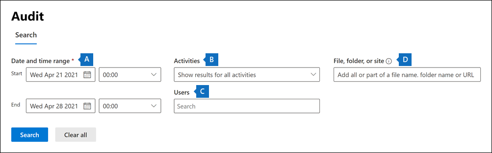

# Basisaudit instellen in Microsoft 365Set up Basic Audit in Microsoft 365

Met Basisaudit in Microsoft 365 kunt u zoeken naar auditrecords voor activiteiten die in de verschillende Microsoft 365 door gebruikers en beheerders worden uitgevoerd.Basic Audit in Microsoft 365 lets you search for audit records for activities performed in the different Microsoft 365 services by users and admins. Omdat Basisaudit standaard is ingeschakeld voor de meeste Microsoft 365- en Office 365-organisaties, hoeft u slechts een paar dingen te doen voordat u en anderen in uw organisatie het auditlogboek kunnen doorzoeken.Because Basic Audit is enabled by default for most Microsoft 365 and Office 365 organizations, there's only a few things you need to do before you and others in your organization can search the audit log.

In dit artikel worden de volgende stappen beschreven die nodig zijn om Basisaudit in te stellen.This article discusses the following steps necessary to set up Basic Audit.

Deze stappen omvatten het waarborgen van de juiste organisatieabonnementen en gebruikerslicenties die nodig zijn voor het genereren en behouden van auditrecords en het toewijzen van machtigingen aan teamleden van uw beveiligingsbewerkingen, IT-, compliance- en juridische teams, zodat ze het auditlogboek kunnen doorzoeken.These steps include ensuring the proper organizational subscriptions and user licensing required to generate and preserve audit records and assigning permissions to team members of your security operations, IT, compliance, and legal teams so that can search the audit log.

Zie Basisaudit [in Microsoft 365.](auditing-solutions-overview.md#basic-audit)For more information, see [Basic Audit in Microsoft 365](auditing-solutions-overview.md#basic-audit).

## Stap 1: Organisatieabonnement en gebruikerslicenties controlerenStep 1: Verify organization subscription and user licensing

Voor licenties voor basisaudit is het juiste organisatieabonnement vereist dat toegang biedt tot het zoekprogramma voor auditlogboek en licenties per gebruiker die nodig zijn voor het aanmelden en behouden van auditrecords.Licensing for Basic Audit requires the appropriate organization subscription that provides access to audit log search tool and per-user licensing that's required to log and retain audit records.

Wanneer een gecontroleerde activiteit wordt uitgevoerd door een gebruiker of beheerder, wordt een auditrecord gegenereerd en opgeslagen in het auditlogboek voor uw organisatie.When an audited activity is performed by a user or admin, an audit record is generated and stored in the audit log for your organization. In Basisaudit worden auditrecords 90 dagen bewaard en doorzocht in het auditlogboek.In Basic Audit, audit records are retained and searchable in the audit log for 90 days.

Zie Auditing solutions in Microsoft 365 voor een lijst met abonnements- en [licentievereisten voor Basisaudit.](auditing-solutions-overview.md#licensing-requirements)For a list of subscription and licensing requirements for Basic Audit, see [Auditing solutions in Microsoft 365](auditing-solutions-overview.md#licensing-requirements).

## Stap 2: Machtigingen toewijzen om het auditlogboek te doorzoekenStep 2: Assign permissions to search the audit log

Beheerders en leden van onderzoeksteams moeten de rol auditlogboeken of auditlogboeken View-Only auditlogboeken in Exchange Online om het auditlogboek te doorzoeken.Admins and members of investigation teams must be assigned the View-Only Audit Logs or Audit Logs role in Exchange Online to search the audit log. Deze rollen worden standaard toegewezen aan de rollengroepen Compliancebeheer en Organisatiebeheer op de pagina **Machtigingen** in het Exchange-beheercentrum.By default, these roles are assigned to the Compliance Management and Organization Management role groups on the **Permissions** page in the Exchange admin center. Globale beheerders in Office 365 en Microsoft 365 worden automatisch toegevoegd als leden van de rollengroep Organisatiebeheer in Exchange Online.Global administrators in Office 365 and Microsoft 365 are automatically added as members of the Organization Management role group in Exchange Online. Als u de gebruiker het auditlogboek wilt laten doorzoeken met minimale rechten, kunt u in Exchange Online een aangepaste rollengroep maken, de rol Auditlogboeken alleen-weergeven of Auditlogboeken toevoegen en vervolgens de gebruiker toevoegen als lid van de nieuwe rollengroep.To give a user the ability to search the audit log with the minimum level of privileges, you can create a custom role group in Exchange Online, add the View-Only Audit Logs or Audit Logs role, and then add the user as a member of the new role group. Zie voor meer informatie [Rollengroepen beheren in Exchange Online](/Exchange/permissions-exo/role-groups).For more information, see [Manage role groups in Exchange Online](/Exchange/permissions-exo/role-groups).

In de volgende schermafbeelding ziet u de twee auditgerelateerde rollen die zijn toegewezen aan de rollengroep Organisatiebeheer in het Exchange beheercentrum.The following screenshot shows the two audit-related roles assigned to the Organization Management role group in the Exchange admin center.

## Stap 3: Het auditlogboek doorzoekenStep 3: Search the audit log

Nu kunt u het auditlogboek doorzoeken in het Microsoft 365 compliancecentrum.Now you're ready to search the audit log in the Microsoft 365 compliance center.

1. Ga naar <https://compliance.microsoft.com> en meld u aan met een account dat de juiste controlemachtigingen heeft gekregen.Go to <https://compliance.microsoft.com> and sign in using an account that has been assigned the appropriate audit permissions.

2. Klik in het linkernavigatiedeelvenster van het Microsoft 365 compliancecentrum op **Alles weergeven** en klik vervolgens op **Controleren.**In the left navigation pane of the Microsoft 365 compliance center, click **Show all** and then click **Audit**.

3. Configureer **de zoekopdracht** op de pagina Controle met behulp van de volgende voorwaarden op het **tabblad** Zoeken.On the **Audit** page, configure the search using the following conditions on the **Search** tab. 

   

   1. **Datum en tijdbereik.****Date and time range**. Selecteer een bereik voor de datum en tijd om de gebeurtenissen weer te geven die in die periode hebben plaatsgevonden. Select a date and time range to display the events that occurred within that period. De datum en tijd worden op lokale tijd weergegeven.The date and time are presented in local time. De laatste zeven dagen zijn standaard geselecteerd.The last seven days are selected by default.
  
   2. **Activiteiten**.**Activities**. Selecteer de activiteiten die u wilt zoeken.Select the activities to search for. Gebruik het zoekvak om te zoeken naar activiteiten die u aan de lijst wilt toevoegen.Use the search box to search for activities to add to the list. Zie Gecontroleerde activiteiten voor een gedeeltelijke lijst met gecontroleerde [activiteiten.](search-the-audit-log-in-security-and-compliance.md#audited-activities)For a partial list of audited activities, see [Audited activities](search-the-audit-log-in-security-and-compliance.md#audited-activities). Laat dit vak leeg als u items wilt retourneren voor alle gecontroleerde activiteiten.Leave this box blank to return entries for all audited activities.
  
   3. **Gebruikers**.**Users**.  Klik in dit vak en typ de naam van gebruikers om zoekresultaten weer te geven.Click in this box and start typing the name of users to display search results for. De controlelogboekgegevens voor de geselecteerde activiteiten die worden uitgevoerd door de gebruikers die u in dit vak selecteert, worden weergegeven in de lijst met resultaten.The audit log entries for the selected activities performed by the users you select in this box are displayed in the list of results. Laat dit vak leeg als u vermeldingen wilt zien voor alle gebruikers (en serviceaccounts) in uw organisatie.Leave this box blank to return entries for all users (and service accounts) in your organization.
  
   4. **Bestand, map of site**.**File, folder, or site**. Typ een of meer bestanden of mappen om te zoeken naar activiteiten die betrekking hebben op het mapbestand dat het opgegeven trefwoord bevat.Type some or all of a file or folder name to search for activity related to the file of folder that contains the specified keyword. U kunt ook een URL van een bestand of map opgeven.You can also specify a URL of a file or folder. Als u een URL van een bestand of map gebruikt, moet u het volledige URL-pad typen of als u een deel van de URL typt, geen speciale tekens of spaties bevatten.If you use a URL of a file or folder, be sure the type the full URL path or if you type a portion of the URL, don't include any special characters or spaces. Laat dit vak leeg als u vermeldingen wilt zien voor alle bestanden en mappen in uw organisatie.Leave this box blank to return entries for all files and folders in your organization.

4. Klik **op Zoeken** om de zoekopdracht uit te voeren.Click **Search** to run the search.

Er wordt een nieuwe pagina weergegeven met de zoekactie in het auditlogboek.A new page is display that shows the audit log search is running. Wanneer de zoekopdracht is voltooid, worden auditrecords weergegeven op de pagina.When the search is completed, audit records are displayed on the page. Klik op een record om een flyoutpagina met gedetailleerde eigenschappen weer te geven.Click a record to display a flyout page with detailed properties.

Zie Het auditlogboek in het [compliancecentrum doorzoeken](search-the-audit-log-in-security-and-compliance.md)voor meer gedetailleerde instructies.For more detailed instructions, see [Search the audit log in the compliance center](search-the-audit-log-in-security-and-compliance.md).
