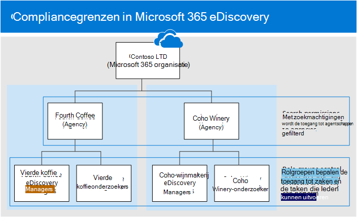

# <a name="set-up-compliance-boundaries-for-ediscovery-investigations"></a>Compliancegrenzen instellen voor eDiscovery-onderzoeken

De richtlijnen in dit artikel kunnen worden toegepast bij het gebruik van Core eDiscovery of Advanced eDiscovery voor het beheren van onderzoeken.

Nalevingsgrenzen maken logische grenzen binnen een organisatie die de locatie van de gebruikersinhoud (zoals postvakken, OneDrive-accounts en SharePoint-sites) bepalen die eDiscovery-beheerders kunnen zoeken. Daarnaast bepalen compliancegrenzen wie toegang heeft tot eDiscovery-zaken die worden gebruikt voor het beheren van juridische, personeelszaken of andere onderzoeken binnen uw organisatie. De noodzaak van compliancegrenzen is vaak nodig voor multinationale ondernemingen die geografische bestuurs- en regelgeving moeten respecteren en voor overheden, die vaak zijn onderverdeeld in verschillende agentschappen. In Microsoft 365 helpen compliancegrenzen u aan deze vereisten te voldoen bij het uitvoeren van inhoudszoekingen en het beheren van onderzoeken met eDiscovery-zaken.
  
We gebruiken het voorbeeld in de volgende afbeelding om uit te leggen hoe nalevingsgrenzen werken.
  

  
In dit voorbeeld is Contoso LTD een organisatie die bestaat uit twee dochterondernemingen, Fourth Coffee en Coho Winery. Het bedrijf vereist dat eDiscovery-gebruikers en -Exchange alleen kunnen zoeken in de Exchange postvakken, OneDrive accounts en SharePoint sites in hun bureau. EDiscovery-managers en -onderzoekers kunnen ook alleen eDiscovery-zaken in hun bureau zien en ze hebben alleen toegang tot de gevallen waar ze lid van zijn. Bovendien kunnen onderzoekers in dit scenario inhoudslocaties niet in de wacht zetten of inhoud uit een zaak exporteren. Nalevingsgrenzen voldoen als eerste aan deze vereisten.
  
- De filterfunctionaliteit voor zoekmachtigingen in Inhoud zoeken bepaalt de inhoudslocaties die eDiscovery-managers en -onderzoekers kunnen zoeken. Dit betekent dat eDiscovery-managers en -onderzoekers in het bureau Fourth Coffee alleen inhoudslocaties kunnen zoeken in de dochteronderneming Fourth Coffee. Dezelfde beperking geldt voor de dochteronderneming van Coho Winery.

- [Rollengroepen](assign-ediscovery-permissions.md#rbac-roles-related-to-ediscovery) bieden de volgende functies voor nalevingsgrenzen:

  - Bepalen wie de eDiscovery-zaken in de Microsoft 365-compliancecentrum. Dit betekent dat eDiscovery-managers en -onderzoekers alleen de eDiscovery-zaken in hun bureau kunnen zien.

  - Bepalen wie leden kan toewijzen aan een eDiscovery-zaak. Dit betekent dat eDiscovery-managers en -onderzoeker alleen leden kunnen toewijzen aan zaken waar ze zelf lid van zijn.

  - Beheer de eDiscovery-gerelateerde taken die leden kunnen uitvoeren door rollen toe te voegen of te verwijderen die specifieke machtigingen toewijzen.

Dit is het proces voor het instellen van compliancegrenzen:
  
[Stap 1: Een gebruikerskenmerk identificeren om uw bureaus te definiëren](#step-1-identify-a-user-attribute-to-define-your-agencies)

[Stap 2: Een rollengroep maken voor elk bureau](#step-2-create-a-role-group-for-each-agency)

[Stap 3: Een zoekmachtigingsfilter maken om de nalevingsgrens af te dwingen](#step-3-create-a-search-permissions-filter-to-enforce-the-compliance-boundary)

[Stap 4: een eDiscovery-zaak maken voor een onderzoek binnen een organisatie](#step-4-create-an-ediscovery-case-for-intra-agency-investigations)

## <a name="before-you-set-up-compliance-boundaries"></a>Voordat u compliancegrenzen in stelt

- Aan gebruikers moet een licentie Exchange Online toegewezen. Als u dit wilt controleren, gebruikt [u de cmdlet Get-User](/powershell/module/exchange/get-user) in Exchange Online PowerShell.

## <a name="step-1-identify-a-user-attribute-to-define-your-agencies"></a>Stap 1: Een gebruikerskenmerk identificeren om uw bureaus te definiëren

De eerste stap is het kiezen van een kenmerk dat u wilt gebruiken om uw bureaus te definiëren. Dit kenmerk wordt gebruikt om het zoekmachtigingsfilter te maken dat een eDiscovery-manager beperkt tot alleen de inhoudslocaties van gebruikers die een specifieke waarde voor dit kenmerk hebben toegewezen. Stel dat Contoso besluit het kenmerk **Afdeling te** gebruiken. De waarde voor dit kenmerk voor gebruikers in de dochteronderneming Fourth Coffee zou zijn en de waarde voor gebruikers  `FourthCoffee`  in Coho Winery-dochteronderneming zou zijn `CohoWinery` . In stap 3 gebruikt u dit paar  `attribute:value`  (bijvoorbeeld *Department:FourthCoffee)* om de gebruikersinhoudslocaties te beperken die eDiscovery-beheerders kunnen zoeken. 
  
Hier zijn enkele voorbeelden van gebruikerskenmerken die u kunt gebruiken voor compliancegrenzen:
  
- Company

- CustomAttribute1 - CustomAttribute15

- Department

- Office

- CountryOrRegion (landcode met twee letters)

Zie de volledige lijst met ondersteunde postvakfilters voor een volledige [lijst.](/powershell/exchange/recipientfilter-properties#filterable-recipient-properties)

## <a name="step-2-create-a-role-group-for-each-agency"></a>Stap 2: Een rollengroep maken voor elk bureau

De volgende stap is het maken van de rollengroepen in het beveiligings- & compliancecentrum dat wordt uitgelijnd met uw agentschappen. U wordt aangeraden een rollengroep te maken door de ingebouwde eDiscovery-beheerdersgroep te kopiëren, de juiste leden toe te voegen en rollen te verwijderen die mogelijk niet van toepassing zijn op uw behoeften. Zie eDiscovery-machtigingen toewijzen voor meer informatie over [eDiscovery-gerelateerde rollen.](assign-ediscovery-permissions.md)
  
Als u de rollengroepen  wilt maken, gaat u naar de pagina Machtigingen in het beveiligings- & compliancecentrum en maakt u een rollengroep voor elk team in elk bureau dat compliancegrenzen en eDiscovery-zaken gebruikt om onderzoeken te beheren.
  
Met het scenario Contoso-compliancegrenzen moeten vier rollengroepen worden gemaakt en moeten de juiste leden aan elk scenario worden toegevoegd.
  
- Fourth Coffee eDiscovery Managers

- Vierde koffieonderzoekers

- Coho Winery eDiscovery Managers

- Coho Winery-onderzoeker
  
Als u wilt voldoen aan de vereisten van het contoso-compliancescenario, verwijdert u ook de rollen In- en exporteren uit de rollengroepen van de onderzoeker om te voorkomen dat onderzoekers inhoudslocaties in de wacht zetten en inhoud exporteren uit een zaak.  

## <a name="step-3-create-a-search-permissions-filter-to-enforce-the-compliance-boundary"></a>Stap 3: Een zoekmachtigingsfilter maken om de nalevingsgrens af te dwingen

Nadat u rollengroepen voor elk bureau hebt gemaakt, is de volgende stap het maken van de zoekmachtigingenfilters die elke rollengroep koppelen aan het specifieke bureau en de compliancegrens zelf definieert. U moet één zoekmachtigingsfilter voor elk bureau maken. Zie Machtigingen filteren voor inhoud zoeken voor meer informatie over het maken van [beveiligingsmachtigingenfilters.](permissions-filtering-for-content-search.md)
  
Hier is de syntaxis die wordt gebruikt om een zoekmachtigingsfilter te maken dat wordt gebruikt voor nalevingsgrenzen.

```powershell
New-ComplianceSecurityFilter -FilterName <name of filter> -Users <role groups> -Filters "Mailbox_<MailboxPropertyName>  -eq '<Value> '", "Site_Path -like '<SharePointURL>*'" -Action <Action>
```

Hier is een beschrijving van elke parameter in de opdracht:
  
- `FilterName`: Geeft de naam van het filter op. Gebruik een naam waarmee het bureau wordt beschreven of geïdentificeerd waarin het filter wordt gebruikt.

- `Users`: Geeft de gebruikers of groepen aan die dit filter toepassen op de zoekacties die ze uitvoeren. Voor compliancegrenzen geeft deze parameter de rollengroepen op (die u hebt gemaakt in stap 3) in het bureau waar u het filter voor maakt. Let op: dit is een parameter met meerdere waarden, zodat u een of meer rollengroepen kunt opnemen, gescheiden door komma's.

- `Filters`: Geeft de zoekcriteria voor het filter op. Voor de nalevingsgrenzen definieert u de volgende filters. Elke locatie is van toepassing op een inhoudslocatie.

    - `Mailbox`: Hiermee geeft u de postvakken of OneDrive accounts op die door de rollengroepen in de `Users` parameter kunnen worden doorzocht. Met dit filter kunnen leden van de rollengroep alleen zoeken in de postvakken of OneDrive accounts in een specifiek bureau. `"Mailbox_Department -eq 'FourthCoffee'"`bijvoorbeeld.

    - `Site_Path`: Geeft de SharePoint sites op die kunnen worden gezocht in de rollengroepen die in de `Users` parameter zijn gedefinieerd. *SharePointURL* geeft de sites in het bureau op die leden van de rollengroep kunnen zoeken. Bijvoorbeeld. `"Site_Path -like 'https://contoso.sharepoint.com/sites/FourthCoffee*'"` U ziet `Site` dat de filters zijn verbonden door een operator of `Site_Path` **operator.**

     > [!NOTE]
     > De syntaxis voor de `Filters` parameter bevat een lijst met *filters*. Een filterslijst is een filter met een postvakfilter en een sitepadfilter gescheiden door een komma. In het vorige voorbeeld ziet u dat een komma de Mailbox_MailboxPropertyName **en** **Site_Path:** `-Filters "Mailbox_<MailboxPropertyName>  -eq '<Value> '", "Site_Path -like '<SharePointURL>*'"` . Wanneer dit filter wordt verwerkt tijdens het uitvoeren van een inhoudszoekactie, worden twee zoekmachtigingenfilters gemaakt uit de lijst met filters: één postvakfilter en één SharePoint filter. Een alternatief voor het gebruik van een filterslijst is het maken van twee afzonderlijke zoekmachtigingenfilters voor elk bureau: één filter voor zoekmachtigingen voor het postvakkenmerk en één filter voor de SharePoint sitekenmerken. In beide gevallen zijn de resultaten hetzelfde. Het gebruik van een filterslijst of het maken van afzonderlijke zoekmachtigingenfilters is een kwestie van voorkeur.

- `Action`: Geeft het type zoekactie op waar het filter op is toegepast. Het filter wordt bijvoorbeeld alleen toegepast wanneer leden van de rollengroep die in de parameter zijn  `-Action Search` `Users` gedefinieerd, een zoekopdracht uitvoeren. In dit geval wordt het filter niet toegepast bij het exporteren van zoekresultaten. Gebruik het filter voor nalevingsgrenzen  `-Action All` zodat het filter van toepassing is op alle zoekacties. 

    Zie de sectie New-ComplianceSecurityFilter in Configure permissions filtering for Content Search (Nieuw compliancebeveiligingsfilter) voor een lijst met [zoekacties.](permissions-filtering-for-content-search.md#new-compliancesecurityfilter)

Hier zijn voorbeelden van de twee zoekmachtigingenfilters die worden gemaakt ter ondersteuning van het contoso-nalevingsscenario. Beide voorbeelden bevatten een lijst met door komma's gescheiden filters, waarin het postvak en de sitefilters zijn opgenomen in hetzelfde filter voor zoekmachtigingen en worden gescheiden door een komma.
  
### <a name="fourth-coffee"></a>Vierde koffie

```powershell
New-ComplianceSecurityFilter -FilterName "Fourth Coffee Security Filter" -Users "Fourth Coffee eDiscovery Managers", "Fourth Coffee Investigators" -Filters "Mailbox_Department -eq 'FourthCoffee'", "Site_Path -like 'https://contoso.sharepoint.com/sites/FourthCoffee*'" -Action ALL
```

### <a name="coho-winery"></a>Coho-wijnmakerij

```powershell
New-ComplianceSecurityFilter -FilterName "Coho Winery Security Filter" -Users "Coho Winery eDiscovery Managers", "Coho Winery Investigators" -Filters "Mailbox_Department -eq 'CohoWinery'", "Site_Path -like 'https://contoso.sharepoint.com/sites/CohoWinery*'" -Action ALL
```

## <a name="step-4-create-an-ediscovery-case-for-intra-agency-investigations"></a>Stap 4: een eDiscovery-zaak maken voor onderzoeken binnen de organisatie

De laatste stap is het maken van een hoofd-eDiscovery-zaak of Advanced eDiscovery-geval in de Microsoft 365-compliancecentrum en vervolgens de rollengroep toevoegen die u in stap 2 hebt gemaakt als lid van de zaak. Dit resulteert in twee belangrijke kenmerken van het gebruik van compliancegrenzen:
  
- Alleen leden van de rollengroep die aan de zaak zijn toegevoegd, kunnen de zaak zien en openen in het beveiligings- & compliancecentrum. Als bijvoorbeeld de rollengroep Vierde koffieonderzoekers het enige lid van een zaak is, kunnen leden van de rollengroep Fourth Coffee eDiscovery Managers (of leden van een andere rollengroep) de zaak niet zien of openen.

- Wanneer een lid van de rollengroep die aan een zaak is toegewezen een zoekopdracht heeft uitgevoerd die aan de zaak is gekoppeld, kunnen ze alleen zoeken in de inhoudslocaties binnen hun bureau (die wordt gedefinieerd door het zoekmachtigingsfilter dat u hebt gemaakt in stap 3.)

Een zaak maken en leden toewijzen:

1. Ga naar de **pagina Core eDiscovery** **of Advanced eDiscovery** in de Microsoft 365-compliancecentrum en maak een zaak.

2. Klik in de lijst met gevallen op de naam van de zaak die u hebt gemaakt.

3. Voeg rollengroepen als leden toe aan de zaak. Zie een van de volgende artikelen voor instructies:

   - [Leden toevoegen aan een core eDiscovery-zaak](get-started-core-ediscovery.md#step-4-optional-add-members-to-a-core-ediscovery-case)

   - [Leden toevoegen aan een Advanced eDiscovery zaak](add-or-remove-members-from-a-case-in-advanced-ediscovery.md)

> [!NOTE]
> Wanneer u een rollengroep toevoegt aan een zaak, kunt u alleen de rollengroepen toevoegen waar u lid van bent.

## <a name="searching-and-exporting-content-in-multi-geo-environments"></a>Inhoud zoeken en exporteren in Multi-Geo-omgevingen

Met zoekmachtigingenfilters kunt u ook bepalen waar inhoud wordt gerouteerd voor export en welk datacenter kan worden gezocht bij het zoeken naar inhoudslocaties in [een SharePoint Multi-Geo omgeving.](../enterprise/multi-geo-capabilities-in-onedrive-and-sharepoint-online-in-microsoft-365.md)
  
- **Zoekresultaten exporteren:** U kunt de zoekresultaten exporteren uit Exchange postvakken, SharePoint sites en OneDrive accounts uit een specifiek datacenter. Dit betekent dat u de datacenterlocatie kunt opgeven waaruit zoekresultaten worden geëxporteerd.

    Gebruik de parameter **Regio** voor **New-ComplianceSecurityFilter-** of **Set-ComplianceSecurityFilter-cmdlets** om te maken of te wijzigen door welk datacenter de export wordt gerouteerd.
  
    |**Parameterwaarde**|**Datacenterlocatie**|
    |:-----|:-----|
    |NAM  <br/> |Noord-Amerikaans (datacenters bevinden zich in de VS)  <br/> |
    |EUR  <br/> |Europa  <br/> |
    |APC  <br/> |Azië en Stille Oceaan  <br/> |
    |KAN <br/> |Canada|
    |||

- **Zoeken naar inhoud routeer:** U kunt de inhoudszoekingen van SharePoint sites en OneDrive naar een satellietcentrum. Dit betekent dat u de datacenterlocatie kunt opgeven waar zoekopdrachten worden uitgevoerd.

    Gebruik een van de volgende waarden voor de **parameter** Regio om de datacenterlocatie te bepalen waarin zoekopdrachten worden uitgevoerd bij het zoeken SharePoint sites en OneDrive accounts. 
  
    |**Parameterwaarde**|**Routeringslocaties voor datacenters voor SharePoint**|
    |:-----|:-----|
    |NAM  <br/> |NL  <br/> |
    |EUR  <br/> |Europa  <br/> |
    |APC  <br/> |Azië en Stille Oceaan  <br/> |
    |KAN  <br/> |NL  <br/> |
    |AUS  <br/> |Azië en Stille Oceaan  <br/> |
    |KOR  <br/> |Het standaardcentrum van de organisatie  <br/> |
    |GBR  <br/> |Europa  <br/> |
    |JPN  <br/> |Azië en Stille Oceaan  <br/> |
    |IND  <br/> |Azië en Stille Oceaan  <br/> |
    |LAM  <br/> |NL  <br/> |
    |NOR  <br/> |Europa |
    |BEHA  <br/> |Datacenters in Noord-Amerika |
    |||

   Als u de parameter  Regio niet opgeeft voor een zoekmachtigingsfilter, wordt het primaire SharePoint van de organisatie doorzocht. Zoekresultaten worden geëxporteerd naar het dichtstbijzijnde datacenter.

   Om het concept te vereenvoudigen, bepaalt de **parameter** Regio het datacenter dat wordt gebruikt voor het zoeken naar inhoud in SharePoint en OneDrive. Dit geldt niet voor het zoeken naar inhoud in Exchange omdat Exchange inhoudszoekingen niet gebonden zijn aan de geografische locatie van datacenters. Dezelfde parameterwaarde regio **kan** ook het datacenter dicteren waaruit de export wordt gerouteerd. Dit is vaak nodig om de verplaatsing van gegevens tussen geografische boarders te controleren.

> [!NOTE]
> Als u een Advanced eDiscovery gebruikt, bepaalt de **parameter** Regio niet het gebied waaruit gegevens worden geëxporteerd. Gegevens worden geëxporteerd vanaf de centrale locatie van de organisatie. Ook is het zoeken naar inhoud in SharePoint en OneDrive niet gebonden aan de geografische locatie van datacenters. Alle datacenters worden doorzocht. Zie Overzicht van de Advanced eDiscovery oplossing in Microsoft 365 voor meer Advanced eDiscovery informatie over [Microsoft 365.](overview-ediscovery-20.md)

Hier zijn voorbeelden van het gebruik van de parameter **Regio** bij het maken van zoekmachtigingsfilters voor compliancegrenzen. Hier wordt ervan uitgenomen dat de dochteronderneming Fourth Coffee zich in Noord-Amerika bevindt en dat Coho Winery zich in Europa bevindt. 
  
```powershell
New-ComplianceSecurityFilter -FilterName "Fourth Coffee Security Filter" -Users "Fourth Coffee eDiscovery Managers", "Fourth Coffee Investigators" -Filters "Mailbox_Department -eq 'FourthCoffee'" -or Site_Path -like 'https://contoso.sharepoint.com/sites/FourthCoffee*'" -Action ALL -Region NAM
```

```powershell
New-ComplianceSecurityFilter -FilterName "Coho Winery Security Filter" -Users "Coho Winery eDiscovery Managers", "Coho Winery Investigators" -Filters "Mailbox_Department -eq 'CohoWinery'" -or Site_Path -like 'https://contoso.sharepoint.com/sites/CohoWinery*'" -Action ALL -Region EUR
```

Houd rekening met de volgende zaken bij het zoeken en exporteren van inhoud in multi-geo-omgevingen.
  
- Met de parameter **Region** kunt u geen zoekopdrachten in Exchange-postvakken beheren. Alle datacenters worden doorzocht wanneer u postvakken zoekt. Gebruik de **parameter** Filters bij het maken of wijzigen van een zoekmachtigingsfilter als u het bereik van Exchange wilt beperken.

- Als een eDiscovery Manager moet zoeken in meerdere SharePoint-regio's, moet u een ander gebruikersaccount maken voor die eDiscovery-manager die u wilt gebruiken in het filter voor zoekmachtigingen om het gebied op te geven waar de SharePoint-sites of OneDrive-accounts zich bevinden. Zie de sectie 'Zoeken naar inhoud in een SharePoint Multi-Geo omgeving' in Inhoud zoeken voor meer informatie over het [instellen van deze instelling.](content-search-reference.md#searching-for-content-in-a-sharepoint-multi-geo-environment)

- Bij het zoeken naar inhoud in SharePoint en OneDrive, wordt met de **parameter** Regio gezocht naar de primaire of satellietlocatie waar eDiscovery-manager eDiscovery-onderzoeken zal uitvoeren. Als een eDiscovery-manager zoekt naar SharePoint en OneDrive sites buiten de regio die is opgegeven in het filter voor zoekmachtigingen, worden er geen zoekresultaten geretourneerd.

- Wanneer u zoekresultaten exporteert vanuit Core eDiscovery, wordt inhoud van alle inhoudslocaties (inclusief Exchange, Skype voor Bedrijven, SharePoint, OneDrive en andere services die u kunt zoeken met behulp van het hulpprogramma Inhoud zoeken) geüpload naar de Azure Storage-locatie in het datacenter dat is opgegeven door de parameter **Regio.** Dit helpt organisaties binnen de naleving te blijven door niet toe te staan dat inhoud wordt geëxporteerd over gecontroleerde randen. Als er geen regio is opgegeven in het filter voor zoekmachtigingen, wordt inhoud geüpload naar het primaire datacenter van de organisatie.

  Wanneer u inhoud exporteert vanuit Advanced eDiscovery, kunt u niet bepalen waar inhoud wordt geüpload met behulp van de parameter **Regio.** Inhoud wordt geüpload naar Azure Storage locatie in een datacenter op de centrale locatie van uw organisatie. Zie voor een lijst met geografische locaties op basis van uw centrale locatie [Microsoft 365 Multi-Geo eDiscovery-configuratie.](../enterprise/multi-geo-ediscovery-configuration.md)

- U kunt een bestaand zoekmachtigingsfilter bewerken om het gebied toe te voegen of te wijzigen door de volgende opdracht uit te voeren:

    ```powershell
    Set-ComplianceSecurityFilter -FilterName <Filter name>  -Region <Region>
    ```

## <a name="using-compliance-boundaries-for-sharepoint-hub-sites"></a>Compliancegrenzen gebruiken voor SharePoint hubsites

[SharePoint hubsites](/sharepoint/dev/features/hub-site/hub-site-overview) worden vaak uitgelijnd met dezelfde geografische of uitzendgrenzen die de nalevingsgrenzen van eDiscovery volgen. Dat betekent dat u de eigenschap site-id van de hubsite kunt gebruiken om een compliancegrens te maken. Hiervoor gebruikt u de [cmdlet Get-SPOHubSite](/powershell/module/sharepoint-online/get-spohubsite#examples) in SharePoint Online PowerShell om de SiteId voor de hubsite te verkrijgen en vervolgens deze waarde voor de eigenschap afdeling-id te gebruiken om een filter voor zoekmachtigingen te maken.

Gebruik de volgende syntaxis om een zoekmachtigingsfilter te maken voor SharePoint hubsite:

```powershell
New-ComplianceSecurityFilter -FilterName <Filter Name> -Users <User or Group> -Filters "Site_Departmentid -eq '{SiteId of hub site}'" -Action ALL
```

Hier is een voorbeeld van het maken van een zoekmachtigingsfilter voor een hubsite voor het Coho Winery-bureau:

```powershell
New-ComplianceSecurityFilter -FilterName "Coho Winery Hub Site Security Filter" -Users "Coho Winery eDiscovery Managers", "Coho Winery Investigators" -Filters "Site_Departmentid -eq '44252d09-62c4-4913-9eb0-a2a8b8d7f863'" -Action ALL
```

## <a name="compliance-boundary-limitations"></a>Limieten voor nalevingsgrenzen

Houd rekening met de volgende beperkingen bij het beheren van eDiscovery-gevallen en onderzoeken waarbij gebruik wordt gemaakt van compliancegrenzen.
  
- Bij het maken en uitvoeren van een zoekopdracht kunt u inhoudslocaties selecteren die zich buiten uw bureau bevinden. Vanwege het filter voor zoekmachtigingen wordt inhoud van die locaties echter niet opgenomen in de zoekresultaten.

- Compliancegrenzen zijn niet van toepassing op in eDiscovery-gevallen. Dat betekent dat een eDiscovery-manager in één bureau een gebruiker in een ander bureau in de wacht kan zetten. De compliancegrens wordt echter afgedwongen als de eDiscovery-manager zoekt naar de inhoudslocaties van de gebruiker die in de wacht is geplaatst. Dat betekent dat de eDiscovery-manager de inhoudslocaties van de gebruiker niet kan doorzoeken, ook al kunnen ze de gebruiker in de wacht zetten.

    Houdstatistieken zijn ook alleen van toepassing op inhoudslocaties in het bureau.

- Als u een zoekmachtigingsfilter (een postvak of een sitefilter) hebt toegewezen en u probeert niet-geïndexeerde items te exporteren voor een zoekopdracht die alle SharePoint-sites in uw organisatie bevat, ontvangt u het volgende foutbericht: `Unable to execute the task. Reason: The scope options UnindexedItemsOnly or BothIndexedandUnindexedItems are not allowed when the executing user has a compliance security filter applied` . Als u een zoekmachtigingsfilter hebt toegewezen en u niet-geïndexeerde items wilt exporteren vanuit SharePoint, moet u de zoekopdracht opnieuw uitvoeren en specifieke SharePoint sites opnemen om te zoeken. Anders kunt u alleen geïndexeerde items exporteren vanuit een zoekopdracht die alle SharePoint bevat. Zie Zoekresultaten exporteren voor meer informatie over de opties wanneer u zoekresultaten [exporteert.](export-search-results.md#step-1-prepare-search-results-for-export)

- Zoekmachtigingenfilters worden niet toegepast op Exchange openbare mappen.

## <a name="more-information"></a>Meer informatie

- Als een postvak is gedelicentieerd of soft-verwijderd, wordt de gebruiker niet meer in aanmerking genomen binnen de compliancegrens. Als er een bewaarfunctie in het postvak is geplaatst toen het werd verwijderd, is de inhoud die in het postvak is bewaard, nog steeds onderworpen aan een compliancegrens of zoekmachtigingsfilter.

- Als compliancegrenzen en zoekmachtigingenfilters voor een gebruiker worden geïmplementeerd, raden we u aan het postvak van een gebruiker niet te verwijderen en niet het OneDrive account. Met andere woorden: als u het postvak van een gebruiker verwijdert, moet u ook het OneDrive-account van de gebruiker verwijderen omdat mailbox_RecipientFilter wordt gebruikt om het filter voor zoekmachtigingen af te dwingen voor OneDrive.

- Compliancegrenzen en zoekmachtigingenfilters zijn afhankelijk van kenmerken die worden gestempeld op inhoud in Exchange, OneDrive en SharePoint en de daaropvolgende indexering van deze gestempelde inhoud.

- Het is niet raadzaam uitsluitingsfilters (zoals het gebruik in een zoekmachtigingsfilter) te gebruiken voor een nalevingsgrens op basis van `-not()` inhoud. Het gebruik van een uitsluitingsfilter kan onverwachte resultaten hebben als inhoud met onlangs bijgewerkte kenmerken niet is geïndexeerd.

## <a name="frequently-asked-questions"></a>Veelgestelde vragen

**Wie kunt u zoekmachtigingenfilters maken en beheren (met New-ComplianceSecurityFilter en Set-ComplianceSecurityFilter cmdlets)?**
  
Als u zoekmachtigingenfilters wilt maken, weergeven en wijzigen, moet u lid zijn van de rollengroep Organisatiebeheer in de Microsoft 365-compliancecentrum.
  
**Als een eDiscovery-manager is toegewezen aan meer dan één rollengroep die meerdere agentschappen omvat, hoe zoeken ze dan naar inhoud in het ene of het andere bureau?**
  
De eDiscovery-manager kan parameters toevoegen aan de zoekquery die de zoekopdracht beperken tot een specifiek bureau. Als een organisatie bijvoorbeeld de eigenschap **CustomAttribute10** heeft opgegeven om agentschappen van elkaar te onderscheiden, kunnen ze het volgende toevoegen aan hun zoekquery om postvakken en OneDrive-accounts in een specifiek bureau te doorzoeken: `CustomAttribute10:<value>` .
  
**Wat gebeurt er als de waarde van het kenmerk dat wordt gebruikt als compliancekenmerk in een zoekmachtigingsfilter wordt gewijzigd?**
  
Het duurt maximaal drie dagen voordat een zoekmachtigingsfilter de nalevingsgrens afdwingt als de waarde van het kenmerk dat in het filter wordt gebruikt, wordt gewijzigd. Stel dat in het scenario Contoso een gebruiker in het bureau Fourth Coffee wordt overgezet naar het coho-wijnbedrijf. Hierdoor wordt de waarde van het **kenmerk Afdeling** op het gebruikersobject gewijzigd van *FourthCoffee* in *CohoWinery.* In deze situatie krijgen Fourth Coffee eDiscovery en investeerders drie dagen nadat het kenmerk is gewijzigd zoekresultaten voor die gebruiker. Op dezelfde manier duurt het maximaal drie dagen voordat Coho Winery eDiscovery-managers en -onderzoekers zoekresultaten voor de gebruiker krijgen.
  
**Kan een eDiscovery-manager inhoud zien van twee afzonderlijke compliancegrenzen?**
  
Ja, dit kan worden gedaan bij het zoeken Exchange postvakken door de eDiscovery-manager toe te voegen aan rollengroepen die zichtbaarheid hebben voor beide bureaus. Wanneer u echter SharePoint sites en OneDrive-accounts zoekt, kan een eDiscovery-manager alleen zoeken naar inhoud in verschillende compliancegrenzen als de agentschappen zich in dezelfde regio of dezelfde geografische locatie bevinden. **Opmerking:** Deze beperking voor sites is niet van toepassing op Advanced eDiscovery omdat het zoeken naar inhoud in SharePoint en OneDrive niet is gebonden door geografische locatie.
  
**Werken zoekmachtigingenfilters voor eDiscovery-case holds, Microsoft 365 bewaarbeleid of DLP?**
  
Nee, op dit moment niet.
  
**Als ik een regio opgeeft om te bepalen waar inhoud wordt geëxporteerd, maar ik heb geen SharePoint organisatie in die regio, kan ik dan nog steeds zoeken SharePoint?**
  
Als het gebied dat is opgegeven in het filter voor zoekmachtigingen niet bestaat in uw organisatie, wordt het standaardgebied doorzocht.
  
**Wat is het maximum aantal zoekmachtigingenfilters dat kan worden gemaakt in een organisatie?**
  
Er is geen limiet voor het aantal zoekmachtigingenfilters dat in een organisatie kan worden gemaakt. De zoekprestaties worden echter beïnvloed wanneer er meer dan 100 zoekmachtigingenfilters zijn. Als u het aantal zoekmachtigingenfilters in uw organisatie zo klein mogelijk wilt houden, maakt u filters die regels voor Exchange, SharePoint en OneDrive zo veel mogelijk combineren tot één zoekmachtigingsfilter.
