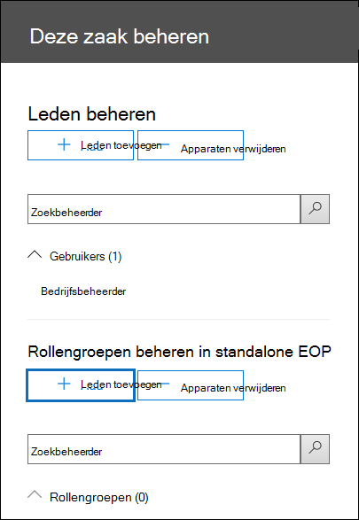

# <a name="set-up-compliance-boundaries-for-ediscovery-investigations"></a><span data-ttu-id="01391-103">Compliancegrenzen instellen voor eDiscovery-onderzoeken</span><span class="sxs-lookup"><span data-stu-id="01391-103">Set up compliance boundaries for eDiscovery investigations</span></span>

<span data-ttu-id="01391-104">De richtlijnen in dit artikel kunnen worden toegepast bij het gebruik van Core eDiscovery of Advanced eDiscovery voor het beheren van onderzoeken.</span><span class="sxs-lookup"><span data-stu-id="01391-104">The guidance in this article can be applied when using either Core eDiscovery or Advanced eDiscovery to manage investigations.</span></span>

<span data-ttu-id="01391-105">Nalevingsgrenzen maken logische grenzen binnen een organisatie die de locatie van de gebruikersinhoud (zoals postvakken, OneDrive-accounts en SharePoint-sites) bepalen die eDiscovery-beheerders kunnen zoeken.</span><span class="sxs-lookup"><span data-stu-id="01391-105">Compliance boundaries create logical boundaries within an organization that control the user content locations (such as mailboxes, OneDrive accounts, and SharePoint sites) that eDiscovery managers can search.</span></span> <span data-ttu-id="01391-106">Daarnaast bepalen compliancegrenzen wie toegang heeft tot eDiscovery-zaken die worden gebruikt voor het beheren van juridische, personeelszaken of andere onderzoeken binnen uw organisatie.</span><span class="sxs-lookup"><span data-stu-id="01391-106">Also, compliance boundaries control who can access eDiscovery cases used to manage the legal, human resources, or other investigations within your organization.</span></span> <span data-ttu-id="01391-107">De noodzaak van compliancegrenzen is vaak nodig voor multinationale ondernemingen die geografische bestuurs- en regelgeving moeten respecteren en voor overheden, die vaak zijn onderverdeeld in verschillende agentschappen.</span><span class="sxs-lookup"><span data-stu-id="01391-107">The need for compliance boundaries is often necessary for multi-national corporations that have to respect geographical boarders and regulations and for governments, which are often divided into different agencies.</span></span> <span data-ttu-id="01391-108">In Microsoft 365 helpen compliancegrenzen u aan deze vereisten te voldoen bij het uitvoeren van inhoudszoekingen en het beheren van onderzoeken met eDiscovery-zaken.</span><span class="sxs-lookup"><span data-stu-id="01391-108">In Microsoft 365, compliance boundaries help you meet these requirements when performing content searches and managing investigations with eDiscovery cases.</span></span>
  
<span data-ttu-id="01391-109">We gebruiken het voorbeeld in de volgende afbeelding om uit te leggen hoe nalevingsgrenzen werken.</span><span class="sxs-lookup"><span data-stu-id="01391-109">We use the example in the following illustration to explain how compliance boundaries work.</span></span>
  

  
<span data-ttu-id="01391-111">In dit voorbeeld is Contoso LTD een organisatie die bestaat uit twee dochterondernemingen, Fourth Coffee en Coho Winery.</span><span class="sxs-lookup"><span data-stu-id="01391-111">In this example, Contoso LTD is an organization that consists of two subsidiaries, Fourth Coffee and Coho Winery.</span></span> <span data-ttu-id="01391-112">Het bedrijf vereist dat eDiscovery-gebruikers en -Exchange alleen kunnen zoeken in de Exchange postvakken, OneDrive accounts en SharePoint sites in hun bureau.</span><span class="sxs-lookup"><span data-stu-id="01391-112">The business requires that eDiscovery mangers and investigators can only search the Exchange mailboxes, OneDrive accounts, and SharePoint sites in their agency.</span></span> <span data-ttu-id="01391-113">EDiscovery-managers en -onderzoekers kunnen ook alleen eDiscovery-zaken in hun bureau zien en ze hebben alleen toegang tot de gevallen waar ze lid van zijn.</span><span class="sxs-lookup"><span data-stu-id="01391-113">Also, eDiscovery managers and investigators can only see eDiscovery cases in their agency, and they can only access the cases that they're a member of.</span></span> <span data-ttu-id="01391-114">Bovendien kunnen onderzoekers in dit scenario inhoudslocaties niet in de wacht zetten of inhoud uit een zaak exporteren.</span><span class="sxs-lookup"><span data-stu-id="01391-114">Additionally in this scenario, investigators cannot place content locations on hold or export content from a case.</span></span> <span data-ttu-id="01391-115">Nalevingsgrenzen voldoen als eerste aan deze vereisten.</span><span class="sxs-lookup"><span data-stu-id="01391-115">Here's how compliance boundaries meet these requirements.</span></span>
  
- <span data-ttu-id="01391-116">De filterfunctionaliteit voor zoekmachtigingen in Inhoud zoeken bepaalt de inhoudslocaties die eDiscovery-managers en -onderzoekers kunnen zoeken.</span><span class="sxs-lookup"><span data-stu-id="01391-116">The search permissions filtering functionality in Content search controls the content locations that eDiscovery managers and investigators can search.</span></span> <span data-ttu-id="01391-117">Dit betekent dat eDiscovery-managers en -onderzoekers in het bureau Fourth Coffee alleen inhoudslocaties kunnen zoeken in de dochteronderneming Fourth Coffee.</span><span class="sxs-lookup"><span data-stu-id="01391-117">This means eDiscovery managers and investigators in the Fourth Coffee agency can only search content locations in the Fourth Coffee subsidiary.</span></span> <span data-ttu-id="01391-118">Dezelfde beperking geldt voor de dochteronderneming van Coho Winery.</span><span class="sxs-lookup"><span data-stu-id="01391-118">The same restriction applies to the Coho Winery subsidiary.</span></span>

- <span data-ttu-id="01391-119">Rollengroepen bieden de volgende functies voor nalevingsgrenzen:</span><span class="sxs-lookup"><span data-stu-id="01391-119">Role groups provide the following functions for compliance boundaries:</span></span>

  - <span data-ttu-id="01391-120">Bepalen wie de eDiscovery-zaken kan zien in het & compliancecentrum.</span><span class="sxs-lookup"><span data-stu-id="01391-120">Control who can see the eDiscovery cases in the Security & Compliance Center.</span></span> <span data-ttu-id="01391-121">Dit betekent dat eDiscovery-managers en -onderzoekers alleen de eDiscovery-zaken in hun bureau kunnen zien.</span><span class="sxs-lookup"><span data-stu-id="01391-121">This means that eDiscovery managers and investigators can only see the eDiscovery cases in their agency.</span></span>

  - <span data-ttu-id="01391-122">Bepalen wie leden kan toewijzen aan een eDiscovery-zaak.</span><span class="sxs-lookup"><span data-stu-id="01391-122">Control who can assign members to an eDiscovery case.</span></span> <span data-ttu-id="01391-123">Dit betekent dat eDiscovery-managers en -onderzoeker alleen leden kunnen toewijzen aan zaken waar ze zelf lid van zijn.</span><span class="sxs-lookup"><span data-stu-id="01391-123">This means eDiscovery managers and investigators can only assign members to cases that they themselves are a member of.</span></span>

  - <span data-ttu-id="01391-124">Beheer de eDiscovery-gerelateerde taken die leden kunnen uitvoeren door rollen toe te voegen of te verwijderen die specifieke machtigingen toewijzen.</span><span class="sxs-lookup"><span data-stu-id="01391-124">Control the eDiscovery-related tasks that members can perform by adding or removing roles that assign specific permissions.</span></span>

<span data-ttu-id="01391-125">Dit is het proces voor het instellen van compliancegrenzen:</span><span class="sxs-lookup"><span data-stu-id="01391-125">Here's the process for setting up compliance boundaries:</span></span>
  
[<span data-ttu-id="01391-126">Stap 1: Een gebruikerskenmerk identificeren om uw bureaus te definiëren</span><span class="sxs-lookup"><span data-stu-id="01391-126">Step 1: Identify a user attribute to define your agencies</span></span>](#step-1-identify-a-user-attribute-to-define-your-agencies)

[<span data-ttu-id="01391-127">Stap 2: Een aanvraag indienen bij Microsoft Support om het gebruikerskenmerk te synchroniseren met OneDrive accounts</span><span class="sxs-lookup"><span data-stu-id="01391-127">Step 2: File a request with Microsoft Support to synchronize the user attribute to OneDrive accounts</span></span>](#step-2-file-a-request-with-microsoft-support-to-synchronize-the-user-attribute-to-onedrive-accounts)

[<span data-ttu-id="01391-128">Stap 3: Een rollengroep maken voor elk bureau</span><span class="sxs-lookup"><span data-stu-id="01391-128">Step 3: Create a role group for each agency</span></span>](#step-3-create-a-role-group-for-each-agency)

[<span data-ttu-id="01391-129">Stap 4: Een zoekmachtigingsfilter maken om de nalevingsgrens af te dwingen</span><span class="sxs-lookup"><span data-stu-id="01391-129">Step 4: Create a search permissions filter to enforce the compliance boundary</span></span>](#step-4-create-a-search-permissions-filter-to-enforce-the-compliance-boundary)

[<span data-ttu-id="01391-130">Stap 5: een eDiscovery-zaak maken voor een onderzoek binnen een organisatie</span><span class="sxs-lookup"><span data-stu-id="01391-130">Step 5: Create an eDiscovery case for an intra-agency investigations</span></span>](#step-5-create-an-ediscovery-case-for-intra-agency-investigations)

## <a name="before-you-set-up-compliance-boundaries"></a><span data-ttu-id="01391-131">Voordat u compliancegrenzen in stelt</span><span class="sxs-lookup"><span data-stu-id="01391-131">Before you set up compliance boundaries</span></span>

<span data-ttu-id="01391-132">U moet aan de volgende vereisten voldoen voordat het Azure Active Directory-kenmerk (Azure AD) dat u identiteit (in stap 1) kunt synchroniseren met het OneDrive-account van een gebruiker (in stap 2):</span><span class="sxs-lookup"><span data-stu-id="01391-132">You have to meet the following prerequisites before the Azure Active Directory (Azure AD) attribute that you identity (in Step 1) can be successfully synched to a user's OneDrive account (in Step 2):</span></span>

- <span data-ttu-id="01391-133">Gebruikers moeten een licentie voor Exchange Online en een SharePoint Online-licentie.</span><span class="sxs-lookup"><span data-stu-id="01391-133">Users must be assigned an Exchange Online license and a SharePoint Online license.</span></span>

- <span data-ttu-id="01391-134">Gebruikerspostvakken moeten ten minste 10 MB groot zijn.</span><span class="sxs-lookup"><span data-stu-id="01391-134">User mailboxes must be at least 10 MB in size.</span></span> <span data-ttu-id="01391-135">Als het postvak van een gebruiker kleiner is dan 10 MB, wordt het kenmerk dat wordt gebruikt om uw bureaus te definiëren, niet gesynchroniseerd met het account van de gebruiker OneDrive account.</span><span class="sxs-lookup"><span data-stu-id="01391-135">If a user's mailbox is less than 10 MB, the attribute used to define your agencies won't be synched to the user's OneDrive account.</span></span>

- <span data-ttu-id="01391-136">Compliancegrenzen en de kenmerken die worden gebruikt om zoekmachtigingenfilters te maken, vereisen dat Azure Active Directory (Azure AD) kenmerken worden gesynchroniseerd met gebruikerspostvakken.</span><span class="sxs-lookup"><span data-stu-id="01391-136">Compliance boundaries and the attributes used to create search permissions filters require that Azure Active Directory (Azure AD) attributes are synchronized to user mailboxes.</span></span> <span data-ttu-id="01391-137">Als u wilt controleren of de kenmerken die u wilt gebruiken, zijn gesynchroniseerd, moet u de [cmdlet Get-User](/powershell/module/exchange/get-user) uitvoeren in Exchange Online PowerShell.</span><span class="sxs-lookup"><span data-stu-id="01391-137">To verify that the attributes that you want to use have been synchronized, run the [Get-User](/powershell/module/exchange/get-user) cmdlet in Exchange Online PowerShell.</span></span> <span data-ttu-id="01391-138">In de uitvoer van deze cmdlet worden de Azure AD-kenmerken weergegeven die zijn gesynchroniseerd met Exchange Online.</span><span class="sxs-lookup"><span data-stu-id="01391-138">The output of this cmdlet displays the Azure AD attributes synchronized to Exchange Online.</span></span>

## <a name="step-1-identify-a-user-attribute-to-define-your-agencies"></a><span data-ttu-id="01391-139">Stap 1: Een gebruikerskenmerk identificeren om uw bureaus te definiëren</span><span class="sxs-lookup"><span data-stu-id="01391-139">Step 1: Identify a user attribute to define your agencies</span></span>

<span data-ttu-id="01391-140">De eerste stap is het kiezen van een Azure AD-kenmerk dat u wilt gebruiken om uw bureaus te definiëren.</span><span class="sxs-lookup"><span data-stu-id="01391-140">The first step is to choose an Azure AD attribute to use that will define your agencies.</span></span> <span data-ttu-id="01391-141">Dit kenmerk wordt gebruikt om het zoekmachtigingsfilter te maken dat een eDiscovery-manager beperkt tot alleen de inhoudslocaties van gebruikers die een specifieke waarde voor dit kenmerk hebben toegewezen.</span><span class="sxs-lookup"><span data-stu-id="01391-141">This attribute is used to create the search permissions filter that limits an eDiscovery manager to search only the content locations of users who are assigned a specific value for this attribute.</span></span> <span data-ttu-id="01391-142">Stel dat Contoso besluit het kenmerk **Afdeling te** gebruiken.</span><span class="sxs-lookup"><span data-stu-id="01391-142">For example, let's say Contoso decides to use the **Department** attribute.</span></span> <span data-ttu-id="01391-143">De waarde voor dit kenmerk voor gebruikers in de dochteronderneming Fourth Coffee zou zijn en de waarde voor gebruikers  `FourthCoffee`  in Coho Winery-dochteronderneming zou zijn `CohoWinery` .</span><span class="sxs-lookup"><span data-stu-id="01391-143">The value for this attribute for users in the Fourth Coffee subsidiary would be  `FourthCoffee`  and the value for users in Coho Winery subsidiary would be `CohoWinery`.</span></span> <span data-ttu-id="01391-144">In stap 4 gebruikt u dit paar  `attribute:value`  (bijvoorbeeld *Department:FourthCoffee)* om de gebruikersinhoudslocaties te beperken die eDiscovery-beheerders kunnen zoeken.</span><span class="sxs-lookup"><span data-stu-id="01391-144">In Step 4, you use this  `attribute:value`  pair (for example, *Department:FourthCoffee*) to limit the user content locations that eDiscovery managers can search.</span></span> 
  
<span data-ttu-id="01391-145">Hier ziet u een lijst met Azure AD-gebruikerskenmerken die u kunt gebruiken voor nalevingsgrenzen:</span><span class="sxs-lookup"><span data-stu-id="01391-145">Here's a list of Azure AD user attributes that you can use for compliance boundaries:</span></span>
  
- <span data-ttu-id="01391-146">Company</span><span class="sxs-lookup"><span data-stu-id="01391-146">Company</span></span>

- <span data-ttu-id="01391-147">CustomAttribute1 - CustomAttribute15</span><span class="sxs-lookup"><span data-stu-id="01391-147">CustomAttribute1 - CustomAttribute15</span></span>

- <span data-ttu-id="01391-148">Department</span><span class="sxs-lookup"><span data-stu-id="01391-148">Department</span></span>

- <span data-ttu-id="01391-149">Office</span><span class="sxs-lookup"><span data-stu-id="01391-149">Office</span></span>

- <span data-ttu-id="01391-150">C (landcode met twee letters) <sup>\*</sup></span><span class="sxs-lookup"><span data-stu-id="01391-150">C (Two-letter country code) <sup>\*</sup></span></span>

  > [!NOTE]
  > <span data-ttu-id="01391-151"><sup>\*</sup>Dit kenmerk wordt toebehoord aan de eigenschap CountryOrRegion die wordt geretourneerd door de **cmdlet Get-User** uit te Exchange Online PowerShell.</span><span class="sxs-lookup"><span data-stu-id="01391-151"><sup>\*</sup> This attribute maps to the CountryOrRegion property that is returned by running the **Get-User** cmdlet in Exchange Online PowerShell.</span></span> <span data-ttu-id="01391-152">De cmdlet retourneert de gelokaliseerde landnaam, die wordt vertaald uit de landcode met twee letters.</span><span class="sxs-lookup"><span data-stu-id="01391-152">The cmdlet returns the localized country name, which is translated from the two-letter country code.</span></span> <span data-ttu-id="01391-153">Zie de beschrijving van de parameter CountryOrRegion in het cmdletverwijzingsartikel [Set-User](/powershell/module/exchange/set-user) voor meer informatie.</span><span class="sxs-lookup"><span data-stu-id="01391-153">For more information, see the CountryOrRegion parameter description in the [Set-User](/powershell/module/exchange/set-user) cmdlet reference article.</span></span>

<span data-ttu-id="01391-154">Hoewel er meer gebruikerskenmerken beschikbaar zijn, met name voor Exchange postvakken, zijn de bovenstaande kenmerken de enige kenmerken die momenteel worden ondersteund door OneDrive.</span><span class="sxs-lookup"><span data-stu-id="01391-154">Although more user attributes are available, particularly for Exchange mailboxes, the attributes listed above are the only ones currently supported by OneDrive.</span></span>
  
## <a name="step-2-file-a-request-with-microsoft-support-to-synchronize-the-user-attribute-to-onedrive-accounts"></a><span data-ttu-id="01391-155">Stap 2: Een aanvraag indienen bij Microsoft Support om het gebruikerskenmerk te synchroniseren met OneDrive accounts</span><span class="sxs-lookup"><span data-stu-id="01391-155">Step 2: File a request with Microsoft Support to synchronize the user attribute to OneDrive accounts</span></span>

<span data-ttu-id="01391-156">De volgende stap is een aanvraag indienen bij Microsoft Support om het Azure AD-kenmerk dat u in stap 1 hebt gekozen, te synchroniseren met alle OneDrive accounts in uw organisatie.</span><span class="sxs-lookup"><span data-stu-id="01391-156">The next step is to file a request with Microsoft Support to synchronize the Azure AD attribute that you chose in Step 1 to all OneDrive accounts in your organization.</span></span> <span data-ttu-id="01391-157">Nadat deze synchronisatie is gebeurd, wordt het kenmerk (en de waarde) dat u hebt gekozen in stap 1, in kaart gebracht aan een verborgen beheerde eigenschap met de naam `ComplianceAttribute` .</span><span class="sxs-lookup"><span data-stu-id="01391-157">After this synchronization occurs, the attribute (and its value) that you chose in Step 1 will be mapped to a hidden managed property named `ComplianceAttribute`.</span></span> <span data-ttu-id="01391-158">U gebruikt dit kenmerk om het filter voor zoekmachtigingen voor OneDrive maken in stap 4.</span><span class="sxs-lookup"><span data-stu-id="01391-158">You use this attribute to create the search permissions filter for OneDrive in Step 4.</span></span>
  
<span data-ttu-id="01391-159">Voeg de volgende informatie toe wanneer u de aanvraag bij Microsoft-ondersteuning indient:</span><span class="sxs-lookup"><span data-stu-id="01391-159">Include the following information when you submit the request to Microsoft support:</span></span>
  
- <span data-ttu-id="01391-160">De standaarddomeinnaam van uw organisatie</span><span class="sxs-lookup"><span data-stu-id="01391-160">The default domain name of your organization</span></span>

- <span data-ttu-id="01391-161">De naam van het Azure AD-kenmerk (van stap 1)</span><span class="sxs-lookup"><span data-stu-id="01391-161">The name of the Azure AD attribute (from Step 1)</span></span>

- <span data-ttu-id="01391-162">De volgende titel of beschrijving van het doel van de ondersteuningsaanvraag: 'Enable OneDrive voor Bedrijven Synchronization with Azure AD for Compliance Security Filters'.</span><span class="sxs-lookup"><span data-stu-id="01391-162">The following title or description of the purpose of the support request: "Enable OneDrive for Business Synchronization with Azure AD for Compliance Security Filters".</span></span> <span data-ttu-id="01391-163">Dit helpt de aanvraag door te sturen naar het eDiscovery-technische team dat de aanvraag implementeert.</span><span class="sxs-lookup"><span data-stu-id="01391-163">This helps route the request to the eDiscovery engineering team who implements the request.</span></span>

<span data-ttu-id="01391-164">Nadat de technische wijziging is aangebracht en het kenmerk is gesynchroniseerd met OneDrive, stuurt Microsoft Support u het buildnummer waarin de wijziging is aangebracht en een geschatte implementatiedatum.</span><span class="sxs-lookup"><span data-stu-id="01391-164">After the engineering change is made and the attribute is synchronized to OneDrive, Microsoft Support will send you the build number that the change was made in and an estimated deployment date.</span></span> <span data-ttu-id="01391-165">Het implementatieproces duurt meestal 4 tot 6 weken nadat u de ondersteuningsaanvraag hebt ingediend.</span><span class="sxs-lookup"><span data-stu-id="01391-165">The deployment process usually takes 4–6 weeks after you submit the support request.</span></span>
  
> [!IMPORTANT]
> <span data-ttu-id="01391-166">U kunt stap 3 tot en met stap 5 voltooien voordat deze kenmerkwijziging wordt geïmplementeerd.</span><span class="sxs-lookup"><span data-stu-id="01391-166">You can complete Step 3 through Step 5 before this attribute change is deployed.</span></span> <span data-ttu-id="01391-167">Bij het uitvoeren van inhoudszoekingen worden echter geen documenten OneDrive accounts die zijn opgegeven in een zoekmachtigingsfilter totdat de kenmerksynchronisatie is geïmplementeerd.</span><span class="sxs-lookup"><span data-stu-id="01391-167">But running content searches won't return documents from OneDrive accounts that are specified in a search permissions filter until after the attribute synch is deployed.</span></span>
  
## <a name="step-3-create-a-role-group-for-each-agency"></a><span data-ttu-id="01391-168">Stap 3: Een rollengroep maken voor elk bureau</span><span class="sxs-lookup"><span data-stu-id="01391-168">Step 3: Create a role group for each agency</span></span>

<span data-ttu-id="01391-169">De volgende stap is het maken van de rollengroepen in het beveiligings- & compliancecentrum dat wordt uitgelijnd met uw agentschappen.</span><span class="sxs-lookup"><span data-stu-id="01391-169">The next step is to create the role groups in the Security & Compliance Center that will align with your agencies.</span></span> <span data-ttu-id="01391-170">U wordt aangeraden een rollengroep te maken door de ingebouwde eDiscovery-beheerdersgroep te kopiëren, de juiste leden toe te voegen en rollen te verwijderen die mogelijk niet van toepassing zijn op uw behoeften.</span><span class="sxs-lookup"><span data-stu-id="01391-170">We recommend that you create a role group by copying the built-in eDiscovery Managers group, adding the appropriate members, and removing roles that may not be applicable to your needs.</span></span> <span data-ttu-id="01391-171">Zie eDiscovery-machtigingen toewijzen in het Office 365 Security & Compliance Center voor meer informatie over [eDiscovery-gerelateerde rollen.](assign-ediscovery-permissions.md)</span><span class="sxs-lookup"><span data-stu-id="01391-171">For more information about eDiscovery-related roles, see [Assign eDiscovery permissions in the Office‍ 365 Security & Compliance Center](assign-ediscovery-permissions.md).</span></span>
  
<span data-ttu-id="01391-172">Als u de rollengroepen  wilt maken, gaat u naar de pagina Machtigingen in het beveiligings- & compliancecentrum en maakt u een rollengroep voor elk team in elk bureau dat compliancegrenzen en eDiscovery-zaken gebruikt om onderzoeken te beheren.</span><span class="sxs-lookup"><span data-stu-id="01391-172">To create the role groups, go to the **Permissions** page in the Security & Compliance Center and create a role group for each team in each agency that will use compliance boundaries and eDiscovery cases to manage investigations.</span></span>
  
<span data-ttu-id="01391-173">Met het scenario Contoso-compliancegrenzen moeten vier rollengroepen worden gemaakt en moeten de juiste leden aan elk scenario worden toegevoegd.</span><span class="sxs-lookup"><span data-stu-id="01391-173">Using the Contoso compliance boundaries scenario, four role groups need to be created and the appropriate members added to each one.</span></span>
  
- <span data-ttu-id="01391-174">Fourth Coffee eDiscovery Managers</span><span class="sxs-lookup"><span data-stu-id="01391-174">Fourth Coffee eDiscovery Managers</span></span>

- <span data-ttu-id="01391-175">Vierde koffieonderzoekers</span><span class="sxs-lookup"><span data-stu-id="01391-175">Fourth Coffee Investigators</span></span>

- <span data-ttu-id="01391-176">Coho Winery eDiscovery Managers</span><span class="sxs-lookup"><span data-stu-id="01391-176">Coho Winery eDiscovery Managers</span></span>

- <span data-ttu-id="01391-177">Coho Winery-onderzoeker</span><span class="sxs-lookup"><span data-stu-id="01391-177">Coho Winery Investigators</span></span>
  
<span data-ttu-id="01391-178">Als u wilt voldoen aan de vereisten van het contoso-compliancescenario, verwijdert u ook de rollen In- en exporteren uit de rollengroepen van de onderzoeker om te voorkomen dat onderzoekers inhoudslocaties in de wacht zetten en inhoud exporteren uit een zaak.  </span><span class="sxs-lookup"><span data-stu-id="01391-178">To meet the requirements of the Contoso compliance boundaries scenario, you would also remove the **Hold** and **Export** roles from the investigators role groups to prevent investigators from placing holds on content locations and exporting content from a case.</span></span>

## <a name="step-4-create-a-search-permissions-filter-to-enforce-the-compliance-boundary"></a><span data-ttu-id="01391-179">Stap 4: Een zoekmachtigingsfilter maken om de nalevingsgrens af te dwingen</span><span class="sxs-lookup"><span data-stu-id="01391-179">Step 4: Create a search permissions filter to enforce the compliance boundary</span></span>

<span data-ttu-id="01391-180">Nadat u rollengroepen voor elk bureau hebt gemaakt, is de volgende stap het maken van de zoekmachtigingenfilters die elke rollengroep koppelen aan het specifieke bureau en de compliancegrens zelf definieert.</span><span class="sxs-lookup"><span data-stu-id="01391-180">After you've created role groups for each agency, the next step is to create the search permissions filters that associate each role group to its specific agency and defines the compliance boundary itself.</span></span> <span data-ttu-id="01391-181">U moet één zoekmachtigingsfilter voor elk bureau maken.</span><span class="sxs-lookup"><span data-stu-id="01391-181">You need to create one search permissions filter for each agency.</span></span> <span data-ttu-id="01391-182">Zie Machtigingen filteren voor inhoud zoeken voor meer informatie over het maken van [beveiligingsmachtigingenfilters.](permissions-filtering-for-content-search.md)</span><span class="sxs-lookup"><span data-stu-id="01391-182">For more information about creating security permissions filters, see [Configure permissions filtering for Content Search](permissions-filtering-for-content-search.md).</span></span>
  
<span data-ttu-id="01391-183">Hier is de syntaxis die wordt gebruikt om een zoekmachtigingsfilter te maken dat wordt gebruikt voor nalevingsgrenzen.</span><span class="sxs-lookup"><span data-stu-id="01391-183">Here's the syntax that's used to create a search permissions filter used for compliance boundaries.</span></span>

```powershell
New-ComplianceSecurityFilter -FilterName <name of filter> -Users <role groups> -Filters "Mailbox_<ComplianceAttribute>  -eq '<AttributeVale> '", "Site_<ComplianceAttribute>  -eq '<AttributeValue>' -or Site_Path -like '<SharePointURL>*'" -Action <Action >
```

<span data-ttu-id="01391-184">Hier is een beschrijving van elke parameter in de opdracht:</span><span class="sxs-lookup"><span data-stu-id="01391-184">Here's a description of each parameter in the command:</span></span>
  
- <span data-ttu-id="01391-185">`FilterName`: Geeft de naam van het filter op.</span><span class="sxs-lookup"><span data-stu-id="01391-185">`FilterName`: Specifies the name of the filter.</span></span> <span data-ttu-id="01391-186">Gebruik een naam waarmee het bureau wordt beschreven of geïdentificeerd waarin het filter wordt gebruikt.</span><span class="sxs-lookup"><span data-stu-id="01391-186">Use a name that describes or identifies the agency that the filter is used in.</span></span>

- <span data-ttu-id="01391-187">`Users`: Geeft de gebruikers of groepen op die dit filter toepassen op de acties voor Inhoud zoeken die ze uitvoeren.</span><span class="sxs-lookup"><span data-stu-id="01391-187">`Users`: Specifies the users or groups who get this filter applied to the Content Search actions they perform.</span></span> <span data-ttu-id="01391-188">Voor compliancegrenzen geeft deze parameter de rollengroepen op (die u hebt gemaakt in stap 3) in het bureau waar u het filter voor maakt.</span><span class="sxs-lookup"><span data-stu-id="01391-188">For compliance boundaries, this parameter specifies the role groups (that you created in Step 3) in the agency that you're creating the filter for.</span></span> <span data-ttu-id="01391-189">Let op: dit is een parameter met meerdere waarden, zodat u een of meer rollengroepen kunt opnemen, gescheiden door komma's.</span><span class="sxs-lookup"><span data-stu-id="01391-189">Note this is a multi-value parameter so you can include one or more role groups, separated by commas.</span></span>

- <span data-ttu-id="01391-190">`Filters`: Geeft de zoekcriteria voor het filter op.</span><span class="sxs-lookup"><span data-stu-id="01391-190">`Filters`: Specifies the search criteria for the filter.</span></span> <span data-ttu-id="01391-191">Voor de nalevingsgrenzen definieert u de volgende filters.</span><span class="sxs-lookup"><span data-stu-id="01391-191">For the compliance boundaries, you define the following filters.</span></span> <span data-ttu-id="01391-192">Elke locatie is van toepassing op een inhoudslocatie.</span><span class="sxs-lookup"><span data-stu-id="01391-192">Each one applies to a content location.</span></span> 

    - <span data-ttu-id="01391-193">`Mailbox`: Geeft de postvakken op die door de rollengroepen in de  `Users` parameter kunnen worden gezocht.</span><span class="sxs-lookup"><span data-stu-id="01391-193">`Mailbox`: Specifies the mailboxes that the role groups defined in the  `Users` parameter can search.</span></span> <span data-ttu-id="01391-194">*ComplianceAttribute* is voor nalevingsgrenzen hetzelfde kenmerk dat u hebt geïdentificeerd in stap 1 en *AttributeValue* geeft het bureau aan.</span><span class="sxs-lookup"><span data-stu-id="01391-194">For compliance boundaries,  *ComplianceAttribute*  is the same attribute that you identified in Step 1 and  *AttributeValue*  specifies the agency.</span></span> <span data-ttu-id="01391-195">Met dit filter kunnen leden van de rollengroep alleen zoeken in de postvakken in een specifiek bureau. `"Mailbox_Department -eq 'FourthCoffee'"`bijvoorbeeld.</span><span class="sxs-lookup"><span data-stu-id="01391-195">This filter allows members of the role group to search only the mailboxes in a specific agency; for example, `"Mailbox_Department -eq 'FourthCoffee'"`.</span></span> 

    - <span data-ttu-id="01391-196">`Site`: Geeft de OneDrive accounts op die kunnen worden gezocht in de rollengroepen die in de `Users` parameter zijn gedefinieerd.</span><span class="sxs-lookup"><span data-stu-id="01391-196">`Site`: Specifies the OneDrive accounts that the role groups defined in the `Users` parameter can search.</span></span> <span data-ttu-id="01391-197">Gebruik voor OneDrive filter de werkelijke `ComplianceAttribute` tekenreeks.</span><span class="sxs-lookup"><span data-stu-id="01391-197">For the OneDrive filter, use the actual string  `ComplianceAttribute`.</span></span> <span data-ttu-id="01391-198">Dit wordt toe te schrijven aan hetzelfde kenmerk dat u hebt geïdentificeerd in stap 1 en dat is gesynchroniseerd met OneDrive-accounts als gevolg van het ondersteuningsverzoek dat u hebt ingediend in stap 2; *AttributeValue* geeft het bureau aan.</span><span class="sxs-lookup"><span data-stu-id="01391-198">This maps to the same attribute that you identified in Step 1 and that's synchronized to OneDrive accounts as a result of the support request that you submitted in Step 2; *AttributeValue*  specifies the agency.</span></span> <span data-ttu-id="01391-199">Met dit filter kunnen leden van de rollengroep alleen zoeken in de OneDrive accounts in een specifiek bureau. `"Site_ComplianceAttribute -eq 'FourthCoffee'"`bijvoorbeeld.</span><span class="sxs-lookup"><span data-stu-id="01391-199">This filter allows members of the role group to search only the OneDrive accounts in a specific agency; for example,  `"Site_ComplianceAttribute -eq 'FourthCoffee'"`.</span></span>

    - <span data-ttu-id="01391-200">`Site_Path`: Geeft de SharePoint sites op die kunnen worden gezocht in de rollengroepen die in de `Users` parameter zijn gedefinieerd.</span><span class="sxs-lookup"><span data-stu-id="01391-200">`Site_Path`: Specifies the SharePoint sites that the role groups defined in the  `Users` parameter can search.</span></span> <span data-ttu-id="01391-201">*SharePointURL* geeft de sites in het bureau op die leden van de rollengroep kunnen zoeken.</span><span class="sxs-lookup"><span data-stu-id="01391-201">The  *SharePointURL*  specifies the sites in the agency that members of the role group can search.</span></span> <span data-ttu-id="01391-202">Bijvoorbeeld. `"Site_Path -like 'https://contoso.sharepoint.com/sites/FourthCoffee*'"`</span><span class="sxs-lookup"><span data-stu-id="01391-202">For example,  `"Site_Path -like 'https://contoso.sharepoint.com/sites/FourthCoffee*'"`.</span></span> <span data-ttu-id="01391-203">U ziet `Site` dat de filters zijn verbonden door een operator of `Site_Path` **operator.**</span><span class="sxs-lookup"><span data-stu-id="01391-203">Notice the `Site` and `Site_Path` filters are connected by an **-or** operator.</span></span>

     > [!NOTE]
     > <span data-ttu-id="01391-204">De syntaxis voor de `Filters` parameter bevat een lijst met *filters*.</span><span class="sxs-lookup"><span data-stu-id="01391-204">The syntax for the `Filters` parameter includes a *filters list*.</span></span> <span data-ttu-id="01391-205">Een filterslijst is een filter met een postvakfilter en een sitefilter gescheiden door een komma.</span><span class="sxs-lookup"><span data-stu-id="01391-205">A filters list is a filter that includes a mailbox filter and a site filter separated by a comma.</span></span> <span data-ttu-id="01391-206">In het vorige voorbeeld ziet u dat een komma de Mailbox_ComplianceAttribute **en** **Site_ComplianceAttribute:** `-Filters "Mailbox_<ComplianceAttribute>  -eq '<AttributeVale> '", "Site_ComplianceAttribute  -eq '<AttributeValue>' -or Site_Path -like '<SharePointURL>*'"` .</span><span class="sxs-lookup"><span data-stu-id="01391-206">In the previous example, notice that a comma separates **Mailbox_ComplianceAttribute** and **Site_ComplianceAttribute**: `-Filters "Mailbox_<ComplianceAttribute>  -eq '<AttributeVale> '", "Site_ComplianceAttribute  -eq '<AttributeValue>' -or Site_Path -like '<SharePointURL>*'"`.</span></span> <span data-ttu-id="01391-207">Wanneer dit filter wordt verwerkt tijdens het uitvoeren van een inhoudszoekactie, worden twee zoekmachtigingenfilters gemaakt uit de lijst met filters: één postvakfilter en één sitefilter.</span><span class="sxs-lookup"><span data-stu-id="01391-207">When this filter is processed during the running of a content search, two search permissions filters are created from the filters list: one mailbox filter and one site filter.</span></span> <span data-ttu-id="01391-208">Een alternatief voor het gebruik van een filterslijst is het maken van twee afzonderlijke zoekmachtigingenfilters voor elk bureau: één filter voor zoekmachtigingen voor het postvakkenmerk en één filter voor de sitekenmerken.</span><span class="sxs-lookup"><span data-stu-id="01391-208">An alternative to using a filters list would be to create two separate search permissions filters for each agency: one search permissions filter for the mailbox attribute and one filter for the site attributes.</span></span> <span data-ttu-id="01391-209">In beide gevallen zijn de resultaten hetzelfde.</span><span class="sxs-lookup"><span data-stu-id="01391-209">In either case, the results will be the same.</span></span> <span data-ttu-id="01391-210">Het gebruik van een filterslijst of het maken van afzonderlijke zoekmachtigingenfilters is een kwestie van voorkeur.</span><span class="sxs-lookup"><span data-stu-id="01391-210">Using a filters list or creating separate search permissions filters is a matter of preference.</span></span>

- <span data-ttu-id="01391-211">`Action`: Geeft het type actie Compliancezoekactie op waar het filter op wordt toegepast.</span><span class="sxs-lookup"><span data-stu-id="01391-211">`Action`: Specifies the type of Compliance Search action that the filter is applied to.</span></span> <span data-ttu-id="01391-212">Het filter wordt bijvoorbeeld alleen toegepast wanneer leden van de rollengroep die in de parameter zijn  `-Action Search` `Users` gedefinieerd, een inhoudszoekactie uitvoeren.</span><span class="sxs-lookup"><span data-stu-id="01391-212">For example,  `-Action Search` would only apply the filter when members of the role group defined in the `Users` parameter run a content search.</span></span> <span data-ttu-id="01391-213">In dit geval wordt het filter niet toegepast bij het exporteren van zoekresultaten.</span><span class="sxs-lookup"><span data-stu-id="01391-213">In this case, the filter wouldn't be applied when exporting search results.</span></span> <span data-ttu-id="01391-214">Gebruik het filter voor nalevingsgrenzen  `-Action All` zodat het filter van toepassing is op alle zoekacties.</span><span class="sxs-lookup"><span data-stu-id="01391-214">For compliance boundaries, use  `-Action All` so the filter applies to all search actions.</span></span> 

    <span data-ttu-id="01391-215">Zie de sectie New-ComplianceSecurityFilter in [Configure permissions filtering for Content Search](permissions-filtering-for-content-search.md#new-compliancesecurityfilter)(Nieuw compliancebeveiligingsfilter) voor een lijst met de acties inhoud zoeken.</span><span class="sxs-lookup"><span data-stu-id="01391-215">For a list of the Content Search actions, see the "New-ComplianceSecurityFilter" section in [Configure permissions filtering for Content Search](permissions-filtering-for-content-search.md#new-compliancesecurityfilter).</span></span>

<span data-ttu-id="01391-216">Hier zijn voorbeelden van de twee zoekmachtigingenfilters die worden gemaakt ter ondersteuning van het contoso-nalevingsscenario.</span><span class="sxs-lookup"><span data-stu-id="01391-216">Here are examples of the two search permissions filters that would be created to support the Contoso compliance boundaries scenario.</span></span> <span data-ttu-id="01391-217">Beide voorbeelden bevatten een lijst met door komma's gescheiden filters, waarin het postvak en de sitefilters zijn opgenomen in hetzelfde filter voor zoekmachtigingen en worden gescheiden door een komma.</span><span class="sxs-lookup"><span data-stu-id="01391-217">Both of these examples include a comma-separated filters list, in which the mailbox and site filters are included in the same search permissions filter and are separated by a comma.</span></span>
  
### <a name="fourth-coffee"></a><span data-ttu-id="01391-218">Vierde koffie</span><span class="sxs-lookup"><span data-stu-id="01391-218">Fourth Coffee</span></span>

```powershell
New-ComplianceSecurityFilter -FilterName "Fourth Coffee Security Filter" -Users "Fourth Coffee eDiscovery Managers", "Fourth Coffee Investigators" -Filters "Mailbox_Department -eq 'FourthCoffee'", "Site_ComplianceAttribute -eq 'FourthCoffee' -or Site_Path -like 'https://contoso.sharepoint.com/sites/FourthCoffee*'" -Action ALL
```

### <a name="coho-winery"></a><span data-ttu-id="01391-219">Coho-wijnmakerij</span><span class="sxs-lookup"><span data-stu-id="01391-219">Coho Winery</span></span>

```powershell
New-ComplianceSecurityFilter -FilterName "Coho Winery Security Filter" -Users "Coho Winery eDiscovery Managers", "Coho Winery Investigators" -Filters "Mailbox_Department -eq 'CohoWinery'", "Site_ComplianceAttribute -eq 'CohoWinery' -or Site_Path -like 'https://contoso.sharepoint.com/sites/CohoWinery*'" -Action ALL
```

## <a name="step-5-create-an-ediscovery-case-for-intra-agency-investigations"></a><span data-ttu-id="01391-220">Stap 5: een eDiscovery-zaak maken voor onderzoeken binnen de organisatie</span><span class="sxs-lookup"><span data-stu-id="01391-220">Step 5: Create an eDiscovery case for intra-agency investigations</span></span>

<span data-ttu-id="01391-221">De laatste stap is het maken van een hoofd-eDiscovery-zaak of Advanced eDiscovery-geval in het Microsoft 365-compliancecentrum en vervolgens de rollengroep toevoegen die u in stap 3 hebt gemaakt als lid van de zaak.</span><span class="sxs-lookup"><span data-stu-id="01391-221">The final step is to create a Core eDiscovery case or Advanced eDiscovery case in the Microsoft 365 compliance center and then add the role group that you created in Step 3 as a member of the case.</span></span> <span data-ttu-id="01391-222">Dit resulteert in twee belangrijke kenmerken van het gebruik van compliancegrenzen:</span><span class="sxs-lookup"><span data-stu-id="01391-222">This results in two important characteristics of using compliance boundaries:</span></span>
  
- <span data-ttu-id="01391-223">Alleen leden van de rollengroep die aan de zaak zijn toegevoegd, kunnen de zaak zien en openen in het beveiligings- & compliancecentrum.</span><span class="sxs-lookup"><span data-stu-id="01391-223">Only members of the role group added to the case will be able to see and access the case in the Security & Compliance Center.</span></span> <span data-ttu-id="01391-224">Als bijvoorbeeld de rollengroep Vierde koffieonderzoekers het enige lid van een zaak is, kunnen leden van de rollengroep Fourth Coffee eDiscovery Managers (of leden van een andere rollengroep) de zaak niet zien of openen.</span><span class="sxs-lookup"><span data-stu-id="01391-224">For example, if the Fourth Coffee Investigators role group is the only member of a case, then members of the Fourth Coffee eDiscovery Managers role group (or members of any other role group) won't be able to see or access the case.</span></span>

- <span data-ttu-id="01391-225">Wanneer een lid van de rollengroep die aan een zaak is toegewezen een zoekopdracht heeft uitgevoerd die aan de zaak is gekoppeld, kunnen ze alleen zoeken in de inhoudslocaties binnen hun bureau (die wordt gedefinieerd door het zoekmachtigingsfilter dat u hebt gemaakt in stap 4.)</span><span class="sxs-lookup"><span data-stu-id="01391-225">When a member of the role group assigned to a case runs a search associated with the case, they will only be able to search the content locations within their agency (which is defined by the search permissions filter that you created in Step 4.)</span></span>

<span data-ttu-id="01391-226">Een zaak maken en leden toewijzen:</span><span class="sxs-lookup"><span data-stu-id="01391-226">To create a case and assign members:</span></span>

1. <span data-ttu-id="01391-227">Ga naar de **pagina Core eDiscovery** of **Advanced eDiscovery** in het Microsoft 365 compliancecentrum en maak een zaak.</span><span class="sxs-lookup"><span data-stu-id="01391-227">Go to the **Core eDiscovery** or **Advanced eDiscovery** page in the Microsoft 365 compliance center and create a case.</span></span>

2. <span data-ttu-id="01391-228">Klik in de lijst met gevallen op de naam van de zaak die u hebt gemaakt.</span><span class="sxs-lookup"><span data-stu-id="01391-228">In the list of cases, click the name of the case you created.</span></span>

3. <span data-ttu-id="01391-229">Klik op **de pagina Dit geval beheren** onder **Rollengroepen beheren** op Pictogram toevoegen  **toevoegen.**</span><span class="sxs-lookup"><span data-stu-id="01391-229">In the **Manage this case** flyout page, under **Manage role groups**, click  **Add**.</span></span>

    
  
4. <span data-ttu-id="01391-231">Selecteer in de lijst met rollengroepen een van de rollengroepen die u hebt gemaakt in stap 3 en klik op **Toevoegen.**</span><span class="sxs-lookup"><span data-stu-id="01391-231">In the list of role groups, select one of the role groups that you created in Step 3, and click **Add**.</span></span>

5. <span data-ttu-id="01391-232">Klik **op Opslaan** in de **flyout Deze zaak beheren** om de wijziging op te slaan.</span><span class="sxs-lookup"><span data-stu-id="01391-232">Click **Save** on the **Manage this case** flyout to save the change.</span></span>

> [!NOTE]
> <span data-ttu-id="01391-233">Wanneer u een rollengroep toevoegt aan een zaak, kunt u alleen de rollengroepen toevoegen waar u lid van bent.</span><span class="sxs-lookup"><span data-stu-id="01391-233">When adding a role group to a case, you can only add the role groups that you are a member of.</span></span>

## <a name="searching-and-exporting-content-in-multi-geo-environments"></a><span data-ttu-id="01391-234">Inhoud zoeken en exporteren in Multi-Geo-omgevingen</span><span class="sxs-lookup"><span data-stu-id="01391-234">Searching and exporting content in Multi-Geo environments</span></span>

<span data-ttu-id="01391-235">Met zoekmachtigingenfilters kunt u ook bepalen waar inhoud wordt gerouteerd voor export en welk datacenter kan worden gezocht bij het zoeken naar inhoudslocaties in [een SharePoint Multi-Geo omgeving.](../enterprise/multi-geo-capabilities-in-onedrive-and-sharepoint-online-in-microsoft-365.md)</span><span class="sxs-lookup"><span data-stu-id="01391-235">Search permissions filters also let you control where content is routed for export and which datacenter can be searched when searching content locations in a [SharePoint Multi-Geo environment](../enterprise/multi-geo-capabilities-in-onedrive-and-sharepoint-online-in-microsoft-365.md).</span></span>
  
- <span data-ttu-id="01391-236">**Zoekresultaten exporteren:** U kunt de zoekresultaten exporteren uit Exchange postvakken, SharePoint sites en OneDrive accounts uit een specifiek datacenter.</span><span class="sxs-lookup"><span data-stu-id="01391-236">**Export search results:** You can export the search results from Exchange mailboxes, SharePoint sites, and OneDrive accounts from a specific datacenter.</span></span> <span data-ttu-id="01391-237">Dit betekent dat u de datacenterlocatie kunt opgeven waaruit zoekresultaten worden geëxporteerd.</span><span class="sxs-lookup"><span data-stu-id="01391-237">This means that you can specify the datacenter location that search results will be exported from.</span></span>

    <span data-ttu-id="01391-238">Gebruik de parameter **Regio** voor **New-ComplianceSecurityFilter-** of **Set-ComplianceSecurityFilter-cmdlets** om te maken of te wijzigen door welk datacenter de export wordt gerouteerd.</span><span class="sxs-lookup"><span data-stu-id="01391-238">Use the **Region** parameter for **New-ComplianceSecurityFilter** or **Set-ComplianceSecurityFilter** cmdlets to create or change which datacenter the export will be routed through.</span></span>
  
    |<span data-ttu-id="01391-239">**Parameterwaarde**</span><span class="sxs-lookup"><span data-stu-id="01391-239">**Parameter value**</span></span>|<span data-ttu-id="01391-240">**Datacenterlocatie**</span><span class="sxs-lookup"><span data-stu-id="01391-240">**Datacenter location**</span></span>|
    |:-----|:-----|
    |<span data-ttu-id="01391-241">NAM</span><span class="sxs-lookup"><span data-stu-id="01391-241">NAM</span></span>  <br/> |<span data-ttu-id="01391-242">Noord-Amerikaans (datacenters bevinden zich in de VS)</span><span class="sxs-lookup"><span data-stu-id="01391-242">North American (datacenters are in the US)</span></span>  <br/> |
    |<span data-ttu-id="01391-243">EUR</span><span class="sxs-lookup"><span data-stu-id="01391-243">EUR</span></span>  <br/> |<span data-ttu-id="01391-244">Europa</span><span class="sxs-lookup"><span data-stu-id="01391-244">Europe</span></span>  <br/> |
    |<span data-ttu-id="01391-245">APC</span><span class="sxs-lookup"><span data-stu-id="01391-245">APC</span></span>  <br/> |<span data-ttu-id="01391-246">Azië en Stille Oceaan</span><span class="sxs-lookup"><span data-stu-id="01391-246">Asia Pacific</span></span>  <br/> |
    |<span data-ttu-id="01391-247">KAN</span><span class="sxs-lookup"><span data-stu-id="01391-247">CAN</span></span> <br/> |<span data-ttu-id="01391-248">Canada</span><span class="sxs-lookup"><span data-stu-id="01391-248">Canada</span></span>|
    |||

- <span data-ttu-id="01391-249">**Zoeken naar inhoud routeer:** U kunt de inhoudszoekingen van SharePoint sites en OneDrive naar een satellietcentrum.</span><span class="sxs-lookup"><span data-stu-id="01391-249">**Route content searches:** You can route the content searches of SharePoint sites and OneDrive accounts to a satellite datacenter.</span></span> <span data-ttu-id="01391-250">Dit betekent dat u de datacenterlocatie kunt opgeven waar zoekopdrachten worden uitgevoerd.</span><span class="sxs-lookup"><span data-stu-id="01391-250">This means you can specify the datacenter location where searches will be run.</span></span>

    <span data-ttu-id="01391-251">Gebruik een van de volgende waarden voor de **parameter** Regio om de datacenterlocatie te bepalen waarin zoekopdrachten worden uitgevoerd bij het zoeken SharePoint sites en OneDrive accounts.</span><span class="sxs-lookup"><span data-stu-id="01391-251">Use one of the following values for the **Region** parameter to control the datacenter location that searches will run in when searching SharePoint sites and OneDrive accounts.</span></span> 
  
    |<span data-ttu-id="01391-252">**Parameterwaarde**</span><span class="sxs-lookup"><span data-stu-id="01391-252">**Parameter value**</span></span>|<span data-ttu-id="01391-253">**Routeringslocaties voor datacenters voor SharePoint**</span><span class="sxs-lookup"><span data-stu-id="01391-253">**Datacenter routing locations for SharePoint**</span></span>|
    |:-----|:-----|
    |<span data-ttu-id="01391-254">NAM</span><span class="sxs-lookup"><span data-stu-id="01391-254">NAM</span></span>  <br/> |<span data-ttu-id="01391-255">NL</span><span class="sxs-lookup"><span data-stu-id="01391-255">US</span></span>  <br/> |
    |<span data-ttu-id="01391-256">EUR</span><span class="sxs-lookup"><span data-stu-id="01391-256">EUR</span></span>  <br/> |<span data-ttu-id="01391-257">Europa</span><span class="sxs-lookup"><span data-stu-id="01391-257">Europe</span></span>  <br/> |
    |<span data-ttu-id="01391-258">APC</span><span class="sxs-lookup"><span data-stu-id="01391-258">APC</span></span>  <br/> |<span data-ttu-id="01391-259">Azië en Stille Oceaan</span><span class="sxs-lookup"><span data-stu-id="01391-259">Asia Pacific</span></span>  <br/> |
    |<span data-ttu-id="01391-260">KAN</span><span class="sxs-lookup"><span data-stu-id="01391-260">CAN</span></span>  <br/> |<span data-ttu-id="01391-261">NL</span><span class="sxs-lookup"><span data-stu-id="01391-261">US</span></span>  <br/> |
    |<span data-ttu-id="01391-262">AUS</span><span class="sxs-lookup"><span data-stu-id="01391-262">AUS</span></span>  <br/> |<span data-ttu-id="01391-263">Azië en Stille Oceaan</span><span class="sxs-lookup"><span data-stu-id="01391-263">Asia Pacific</span></span>  <br/> |
    |<span data-ttu-id="01391-264">KOR</span><span class="sxs-lookup"><span data-stu-id="01391-264">KOR</span></span>  <br/> |<span data-ttu-id="01391-265">Het standaardcentrum van de organisatie</span><span class="sxs-lookup"><span data-stu-id="01391-265">The organization's default datacenter</span></span>  <br/> |
    |<span data-ttu-id="01391-266">GBR</span><span class="sxs-lookup"><span data-stu-id="01391-266">GBR</span></span>  <br/> |<span data-ttu-id="01391-267">Europa</span><span class="sxs-lookup"><span data-stu-id="01391-267">Europe</span></span>  <br/> |
    |<span data-ttu-id="01391-268">JPN</span><span class="sxs-lookup"><span data-stu-id="01391-268">JPN</span></span>  <br/> |<span data-ttu-id="01391-269">Azië en Stille Oceaan</span><span class="sxs-lookup"><span data-stu-id="01391-269">Asia Pacific</span></span>  <br/> |
    |<span data-ttu-id="01391-270">IND</span><span class="sxs-lookup"><span data-stu-id="01391-270">IND</span></span>  <br/> |<span data-ttu-id="01391-271">Azië en Stille Oceaan</span><span class="sxs-lookup"><span data-stu-id="01391-271">Asia Pacific</span></span>  <br/> |
    |<span data-ttu-id="01391-272">LAM</span><span class="sxs-lookup"><span data-stu-id="01391-272">LAM</span></span>  <br/> |<span data-ttu-id="01391-273">NL</span><span class="sxs-lookup"><span data-stu-id="01391-273">US</span></span>  <br/> |
    |<span data-ttu-id="01391-274">NOR</span><span class="sxs-lookup"><span data-stu-id="01391-274">NOR</span></span>  <br/> |<span data-ttu-id="01391-275">Europa</span><span class="sxs-lookup"><span data-stu-id="01391-275">Europe</span></span> |
    |<span data-ttu-id="01391-276">BEHA</span><span class="sxs-lookup"><span data-stu-id="01391-276">BRA</span></span>  <br/> |<span data-ttu-id="01391-277">Datacenters in Noord-Amerika</span><span class="sxs-lookup"><span data-stu-id="01391-277">North American datacenters</span></span> |
    |||

   <span data-ttu-id="01391-278">Als u de parameter  Regio niet opgeeft voor een zoekmachtigingsfilter, wordt het primaire SharePoint van de organisatie doorzocht.</span><span class="sxs-lookup"><span data-stu-id="01391-278">If you don't specify the **Region** parameter for a search permissions filter, the organization's primary SharePoint region will be searched.</span></span> <span data-ttu-id="01391-279">Zoekresultaten worden geëxporteerd naar het dichtstbijzijnde datacenter.</span><span class="sxs-lookup"><span data-stu-id="01391-279">Search results are exported to the closest datacenter.</span></span>

   <span data-ttu-id="01391-280">Om het concept te vereenvoudigen, bepaalt de **parameter** Regio het datacenter dat wordt gebruikt voor het zoeken naar inhoud in SharePoint en OneDrive.</span><span class="sxs-lookup"><span data-stu-id="01391-280">To simplify the concept, the **Region** parameter controls the datacenter that is used to search for content in SharePoint and OneDrive.</span></span> <span data-ttu-id="01391-281">Dit geldt niet voor het zoeken naar inhoud in Exchange omdat Exchange inhoudszoekingen niet gebonden zijn aan de geografische locatie van datacenters.</span><span class="sxs-lookup"><span data-stu-id="01391-281">This doesn't apply to searching for content in Exchange because Exchange content searches aren't bound by the geographic location of datacenters.</span></span> <span data-ttu-id="01391-282">Dezelfde parameterwaarde regio **kan** ook het datacenter dicteren waaruit de export wordt gerouteerd.</span><span class="sxs-lookup"><span data-stu-id="01391-282">Also, the same **Region** parameter value may also dictate the datacenter that exports are routed through.</span></span> <span data-ttu-id="01391-283">Dit is vaak nodig om de verplaatsing van gegevens tussen geografische boarders te controleren.</span><span class="sxs-lookup"><span data-stu-id="01391-283">This is often necessary to control the movement of data across geographic boarders.</span></span>

> [!NOTE]
> <span data-ttu-id="01391-284">Als u een Advanced eDiscovery gebruikt, bepaalt de **parameter** Regio niet het gebied waaruit gegevens worden geëxporteerd.</span><span class="sxs-lookup"><span data-stu-id="01391-284">If you're using Advanced eDiscovery, the **Region** parameter doesn't control the region that data is exported from.</span></span> <span data-ttu-id="01391-285">Gegevens worden geëxporteerd vanuit het primaire datacenter van de organisatie.</span><span class="sxs-lookup"><span data-stu-id="01391-285">Data is exported from the organization's primary datacenter.</span></span> <span data-ttu-id="01391-286">Ook is het zoeken naar inhoud in SharePoint en OneDrive niet gebonden aan de geografische locatie van datacenters.</span><span class="sxs-lookup"><span data-stu-id="01391-286">Also, searching for content in SharePoint and OneDrive isn't bound by the geographic location of datacenters.</span></span> <span data-ttu-id="01391-287">Alle datacenters worden doorzocht.</span><span class="sxs-lookup"><span data-stu-id="01391-287">All datacenters are searched.</span></span> <span data-ttu-id="01391-288">Zie Overzicht van de Advanced eDiscovery oplossing in Microsoft 365 voor meer Advanced eDiscovery informatie over [Microsoft 365.](overview-ediscovery-20.md)</span><span class="sxs-lookup"><span data-stu-id="01391-288">For more information about Advanced eDiscovery, see [Overview of the Advanced eDiscovery solution in Microsoft 365](overview-ediscovery-20.md).</span></span>

<span data-ttu-id="01391-289">Hier zijn voorbeelden van het gebruik van de parameter **Regio** bij het maken van zoekmachtigingsfilters voor compliancegrenzen.</span><span class="sxs-lookup"><span data-stu-id="01391-289">Here are examples of using the **Region** parameter when creating search permission filters for compliance boundaries.</span></span> <span data-ttu-id="01391-290">Hier wordt ervan uitgenomen dat de dochteronderneming Fourth Coffee zich in Noord-Amerika bevindt en dat Coho Winery zich in Europa bevindt.</span><span class="sxs-lookup"><span data-stu-id="01391-290">This assumes that the Fourth Coffee subsidiary is located in North America and that Coho Winery is in Europe.</span></span> 
  
```powershell
New-ComplianceSecurityFilter -FilterName "Fourth Coffee Security Filter" -Users "Fourth Coffee eDiscovery Managers", "Fourth Coffee Investigators" -Filters "Mailbox_Department -eq 'FourthCoffee'", "Site_Department -eq 'FourthCoffee' -or Site_Path -like 'https://contoso.sharepoint.com/sites/FourthCoffee*'" -Action ALL -Region NAM
```

```powershell
New-ComplianceSecurityFilter -FilterName "Coho Winery Security Filter" -Users "Coho Winery eDiscovery Managers", "Coho Winery Investigators" -Filters "Mailbox_Department -eq 'CohoWinery'", "Site_Department -eq 'CohoWinery' -or Site_Path -like 'https://contoso.sharepoint.com/sites/CohoWinery*'" -Action ALL -Region EUR
```

<span data-ttu-id="01391-291">Houd rekening met de volgende zaken bij het zoeken en exporteren van inhoud in multi-geo-omgevingen.</span><span class="sxs-lookup"><span data-stu-id="01391-291">Keep the following things in mind when searching and exporting content in multi-geo environments.</span></span>
  
- <span data-ttu-id="01391-292">Met **de** parameter Regio worden zoekopdrachten naar postvakken Exchange bepaald.</span><span class="sxs-lookup"><span data-stu-id="01391-292">The **Region** parameter doesn't control searches of Exchange mailboxes.</span></span> <span data-ttu-id="01391-293">Alle datacenters worden doorzocht wanneer u postvakken zoekt.</span><span class="sxs-lookup"><span data-stu-id="01391-293">All datacenters will be searched when you search mailboxes.</span></span> <span data-ttu-id="01391-294">Gebruik de **parameter** Filters bij het maken of wijzigen van een zoekmachtigingsfilter als u het bereik van Exchange wilt beperken.</span><span class="sxs-lookup"><span data-stu-id="01391-294">To limit the scope of which Exchange mailboxes are searched, use the **Filters** parameter when creating or changing a search permissions filter.</span></span> 

- <span data-ttu-id="01391-295">Als een eDiscovery Manager moet zoeken in meerdere SharePoint-regio's, moet u een ander gebruikersaccount maken voor die eDiscovery-manager die u wilt gebruiken in het filter voor zoekmachtigingen om het gebied op te geven waar de SharePoint-sites of OneDrive-accounts zich bevinden.</span><span class="sxs-lookup"><span data-stu-id="01391-295">If it's necessary for an eDiscovery Manager to search across multiple SharePoint regions, you need to create a different user account for that eDiscovery manager to use in the search permissions filter to specify the region where the SharePoint sites or OneDrive accounts are located.</span></span> <span data-ttu-id="01391-296">Zie de sectie 'Zoeken naar inhoud in een SharePoint Multi-Geo omgeving' in Inhoud zoeken voor meer informatie over het [instellen van deze instelling.](content-search.md#searching-for-content-in-a-sharepoint-multi-geo-environment)</span><span class="sxs-lookup"><span data-stu-id="01391-296">For more information about setting this up, see the "Searching for content in a SharePoint Multi-Geo environment" section in [Content Search](content-search.md#searching-for-content-in-a-sharepoint-multi-geo-environment).</span></span>

- <span data-ttu-id="01391-297">Bij het zoeken naar inhoud in SharePoint en OneDrive, wordt met de **parameter** Regio gezocht naar de primaire of satellietlocatie waar eDiscovery-manager eDiscovery-onderzoeken zal uitvoeren.</span><span class="sxs-lookup"><span data-stu-id="01391-297">When searching for content in SharePoint and OneDrive, the **Region** parameter directs searches to either the primary or satellite location where the eDiscovery manager will conduct eDiscovery investigations.</span></span> <span data-ttu-id="01391-298">Als een eDiscovery-manager zoekt naar SharePoint en OneDrive sites buiten de regio die is opgegeven in het filter voor zoekmachtigingen, worden er geen zoekresultaten geretourneerd.</span><span class="sxs-lookup"><span data-stu-id="01391-298">If an eDiscovery manager searches SharePoint and OneDrive sites outside of the region that's specified in the search permissions filter, no search results are returned.</span></span>

- <span data-ttu-id="01391-299">Wanneer u zoekresultaten exporteert, wordt inhoud van alle inhoudslocaties (inclusief Exchange, Skype voor Bedrijven, SharePoint, OneDrive en andere services die u kunt zoeken met het hulpprogramma Inhoud zoeken) geüpload naar de Azure Storage-locatie in het datacenter dat is opgegeven door de parameter **Regio.**</span><span class="sxs-lookup"><span data-stu-id="01391-299">When exporting search results, content from all content locations (including Exchange, Skype for Business, SharePoint, OneDrive, and other services that you can search by using the Content Search tool) are uploaded to the Azure Storage location in the datacenter that's specified by the **Region** parameter.</span></span> <span data-ttu-id="01391-300">Dit helpt organisaties binnen de naleving te blijven door niet toe te staan dat inhoud wordt geëxporteerd over gecontroleerde randen.</span><span class="sxs-lookup"><span data-stu-id="01391-300">This helps organizations stay within compliance by not allowing content to be exported across controlled borders.</span></span> <span data-ttu-id="01391-301">Als er geen regio is opgegeven in het filter voor zoekmachtigingen, wordt inhoud geüpload naar het primaire datacenter van de organisatie.</span><span class="sxs-lookup"><span data-stu-id="01391-301">If no region is specified in the search permissions filter, content is uploaded to the organization's primary datacenter.</span></span>

- <span data-ttu-id="01391-302">U kunt een bestaand zoekmachtigingsfilter bewerken om het gebied toe te voegen of te wijzigen door de volgende opdracht uit te voeren:</span><span class="sxs-lookup"><span data-stu-id="01391-302">You can edit an existing search permissions filter to add or change the region by running the following command:</span></span>

    ```powershell
    Set-ComplianceSecurityFilter -FilterName <Filter name>  -Region <Region>
    ```

## <a name="using-compliance-boundaries-for-sharepoint-hub-sites"></a><span data-ttu-id="01391-303">Compliancegrenzen gebruiken voor SharePoint hubsites</span><span class="sxs-lookup"><span data-stu-id="01391-303">Using compliance boundaries for SharePoint hub sites</span></span>

<span data-ttu-id="01391-304">[SharePoint hubsites](/sharepoint/dev/features/hub-site/hub-site-overview) worden vaak uitgelijnd met dezelfde geografische of uitzendgrenzen die de nalevingsgrenzen van eDiscovery volgen.</span><span class="sxs-lookup"><span data-stu-id="01391-304">[SharePoint hub sites](/sharepoint/dev/features/hub-site/hub-site-overview) often align with the same geographical or agency boundaries that eDiscovery compliance boundaries follow.</span></span> <span data-ttu-id="01391-305">Dat betekent dat u de eigenschap site-id van de hubsite kunt gebruiken om een compliancegrens te maken.</span><span class="sxs-lookup"><span data-stu-id="01391-305">That means you can use the site ID property of the hub site to create a compliance boundary.</span></span> <span data-ttu-id="01391-306">Hiervoor gebruikt u de [cmdlet Get-SPOHubSite](/powershell/module/sharepoint-online/get-spohubsite#examples) in SharePoint Online PowerShell om de SiteId voor de hubsite te verkrijgen en vervolgens deze waarde voor de eigenschap afdeling-id te gebruiken om een filter voor zoekmachtigingen te maken.</span><span class="sxs-lookup"><span data-stu-id="01391-306">To do this, use the [Get-SPOHubSite](/powershell/module/sharepoint-online/get-spohubsite#examples) cmdlet in SharePoint Online PowerShell to obtain the SiteId for the hub site and then use this value for the department ID property to create a search permissions filter.</span></span>

<span data-ttu-id="01391-307">Gebruik de volgende syntaxis om een zoekmachtigingsfilter te maken voor SharePoint hubsite:</span><span class="sxs-lookup"><span data-stu-id="01391-307">Use the following syntax to create a search permissions filter for a SharePoint hub site:</span></span>

```powershell
New-ComplianceSecurityFilter -FilterName <Filter Name> -Users <User or Group> -Filters "Site_Departmentid -eq '{SiteId of hub site}'" -Action ALL
```

<span data-ttu-id="01391-308">Hier is een voorbeeld van het maken van een zoekmachtigingsfilter voor een hubsite voor het Coho Winery-bureau:</span><span class="sxs-lookup"><span data-stu-id="01391-308">Here's an example of creating a search permissions filter for a hub site for the Coho Winery agency:</span></span>

```powershell
New-ComplianceSecurityFilter -FilterName "Coho Winery Hub Site Security Filter" -Users "Coho Winery eDiscovery Managers", "Coho Winery Investigators" -Filters "Site_Departmentid -eq '44252d09-62c4-4913-9eb0-a2a8b8d7f863'" -Action ALL
```

## <a name="compliance-boundary-limitations"></a><span data-ttu-id="01391-309">Limieten voor nalevingsgrenzen</span><span class="sxs-lookup"><span data-stu-id="01391-309">Compliance boundary limitations</span></span>

<span data-ttu-id="01391-310">Houd rekening met de volgende beperkingen bij het beheren van eDiscovery-gevallen en onderzoeken waarbij gebruik wordt gemaakt van compliancegrenzen.</span><span class="sxs-lookup"><span data-stu-id="01391-310">Keep the following limitations in mind when managing eDiscovery cases and investigations that use of compliance boundaries.</span></span>
  
- <span data-ttu-id="01391-311">Bij het maken en uitvoeren van een zoekopdracht kunt u inhoudslocaties selecteren die zich buiten uw bureau bevinden.</span><span class="sxs-lookup"><span data-stu-id="01391-311">When creating and running a search, you can select content locations that are outside of your agency.</span></span> <span data-ttu-id="01391-312">Vanwege het filter voor zoekmachtigingen wordt inhoud van die locaties echter niet opgenomen in de zoekresultaten.</span><span class="sxs-lookup"><span data-stu-id="01391-312">However, because of the search permissions filter, content from those locations isn't included in the search results.</span></span>

- <span data-ttu-id="01391-313">Compliancegrenzen zijn niet van toepassing op in eDiscovery-gevallen.</span><span class="sxs-lookup"><span data-stu-id="01391-313">Compliance boundaries don't apply to holds in eDiscovery cases.</span></span> <span data-ttu-id="01391-314">Dat betekent dat een eDiscovery-manager in één bureau een gebruiker in een ander bureau in de wacht kan zetten.</span><span class="sxs-lookup"><span data-stu-id="01391-314">That means an eDiscovery manager in one agency can place a user in a different agency on hold.</span></span> <span data-ttu-id="01391-315">De compliancegrens wordt echter afgedwongen als de eDiscovery-manager zoekt naar de inhoudslocaties van de gebruiker die in de wacht is geplaatst.</span><span class="sxs-lookup"><span data-stu-id="01391-315">However, the compliance boundary will be enforced if the eDiscovery manager searches the content locations of the user who was placed on hold.</span></span> <span data-ttu-id="01391-316">Dat betekent dat de eDiscovery-manager de inhoudslocaties van de gebruiker niet kan doorzoeken, ook al kunnen ze de gebruiker in de wacht zetten.</span><span class="sxs-lookup"><span data-stu-id="01391-316">That means the eDiscovery manager won't be able search the user's content locations, even though they were able to place the user on hold.</span></span>

    <span data-ttu-id="01391-317">Houdstatistieken zijn ook alleen van toepassing op inhoudslocaties in het bureau.</span><span class="sxs-lookup"><span data-stu-id="01391-317">Also, hold statistics will only apply to content locations in the agency.</span></span>

- <span data-ttu-id="01391-318">Zoekmachtigingenfilters worden niet toegepast op Exchange openbare mappen.</span><span class="sxs-lookup"><span data-stu-id="01391-318">Search permissions filters aren't applied to Exchange public folders.</span></span>

## <a name="more-information"></a><span data-ttu-id="01391-319">Meer informatie</span><span class="sxs-lookup"><span data-stu-id="01391-319">More information</span></span>

- <span data-ttu-id="01391-320">Als een postvak is gedelicentieerd of wordt verwijderd, worden Azure AD-kenmerken niet meer gesynchroniseerd met het postvak.</span><span class="sxs-lookup"><span data-stu-id="01391-320">If a mailbox is de-licensed or soft-deleted, Azure AD attributes are no longer synchronized to the mailbox.</span></span> <span data-ttu-id="01391-321">Als er een bewaarfunctie in het postvak is geplaatst toen het werd verwijderd, is de inhoud die in het postvak is bewaard, nog steeds onderworpen aan een compliancegrens of zoekmachtigingsfilter op basis van de laatste keer dat de Azure AD-kenmerken zijn gesynchroniseerd voordat het postvak werd verwijderd.</span><span class="sxs-lookup"><span data-stu-id="01391-321">If a hold was placed on the mailbox when it was deleted, the content preserved in the mailbox is still subject to a compliance boundary or search permissions filter based on the last time the Azure AD attributes were synchronized before the mailbox was deleted.</span></span> 

    <span data-ttu-id="01391-322">Bovendien wordt de synchronisatie tussen het postvak van de gebruiker en OneDrive account stopgezet als het postvak is gedelicentieerd of zacht wordt verwijderd.</span><span class="sxs-lookup"><span data-stu-id="01391-322">Additionally, the synchronization between the user's mailbox and OneDrive account will cease if the mailbox is de-licensed or soft-deleted.</span></span> <span data-ttu-id="01391-323">De laatst gestempelde waarde van het compliancekenmerk voor OneDrive account blijft van kracht.</span><span class="sxs-lookup"><span data-stu-id="01391-323">The last stamped value of the compliance attribute for the OneDrive account will remain in effect.</span></span>

- <span data-ttu-id="01391-324">Het compliancekenmerk wordt elke zeven dagen gesynchroniseerd vanuit het postvak van Exchange gebruiker OneDrive account.</span><span class="sxs-lookup"><span data-stu-id="01391-324">The compliance attribute is synchronized from a user's Exchange mailbox to their OneDrive account every seven days.</span></span> <span data-ttu-id="01391-325">Zoals eerder vermeld, vindt deze synchronisatie alleen plaats wanneer aan de gebruiker zowel een Exchange Online- als SharePoint Online-licentie is toegewezen en het postvak van de gebruiker ten minste 10 MB is.</span><span class="sxs-lookup"><span data-stu-id="01391-325">As previously stated, this synchronization only occurs when the user is assigned both an Exchange Online and SharePoint Online license and the user's mailbox is at least 10 MB.</span></span>

- <span data-ttu-id="01391-326">Als compliancegrenzen en zoekmachtigingenfilters worden geïmplementeerd voor zowel het postvak van een gebruiker als het OneDrive-account, raden we u aan het postvak van een gebruiker niet te verwijderen en niet het OneDrive account.</span><span class="sxs-lookup"><span data-stu-id="01391-326">If compliance boundaries and search permissions filters are implemented for both a user's mailbox and OneDrive account, then we recommend that you don't delete a user's mailbox and not their OneDrive account.</span></span> <span data-ttu-id="01391-327">Met andere woorden: als u het postvak van een gebruiker verwijdert, moet u ook het account van de gebruiker OneDrive verwijderen.</span><span class="sxs-lookup"><span data-stu-id="01391-327">In other words, if you delete a user's mailbox, you should also remove the user's OneDrive account.</span></span>

- <span data-ttu-id="01391-328">Er zijn situaties (zoals een terugkerende werknemer) waarbij een gebruiker mogelijk twee of meer accounts OneDrive heeft.</span><span class="sxs-lookup"><span data-stu-id="01391-328">There are situations (such as a returning employee) where a user might have two or more OneDrive accounts.</span></span> <span data-ttu-id="01391-329">In deze gevallen wordt alleen het primaire OneDrive account dat is gekoppeld aan de gebruiker in Azure AD gesynchroniseerd.</span><span class="sxs-lookup"><span data-stu-id="01391-329">In these cases, only the primary OneDrive account associated with the user in Azure AD will be synchronized.</span></span>

- <span data-ttu-id="01391-330">Compliancegrenzen en zoekmachtigingenfilters zijn afhankelijk van kenmerken die worden gestempeld op inhoud in Exchange, OneDrive en SharePoint en de daaropvolgende indexering van deze gestempelde inhoud.</span><span class="sxs-lookup"><span data-stu-id="01391-330">Compliance boundaries and search permissions filters depend on attributes being stamped on content in Exchange, OneDrive, and SharePoint and the subsequent indexing of this stamped content.</span></span> 

- <span data-ttu-id="01391-331">Het is niet raadzaam uitsluitingsfilters (zoals het gebruik in een zoekmachtigingsfilter) te gebruiken voor een nalevingsgrens op basis van `-not()` inhoud.</span><span class="sxs-lookup"><span data-stu-id="01391-331">We don't recommend using exclusion filters (such as using `-not()` in a search permissions filter) for a content-based compliance boundary.</span></span> <span data-ttu-id="01391-332">Het gebruik van een uitsluitingsfilter kan onverwachte resultaten hebben als inhoud met onlangs bijgewerkte kenmerken niet is geïndexeerd.</span><span class="sxs-lookup"><span data-stu-id="01391-332">Using an exclusion filter can have unexpected results if content with recently updated attributes hasn't been indexed.</span></span> 

## <a name="frequently-asked-questions"></a><span data-ttu-id="01391-333">Veelgestelde vragen</span><span class="sxs-lookup"><span data-stu-id="01391-333">Frequently asked questions</span></span>

<span data-ttu-id="01391-334">**Wie kunt u zoekmachtigingenfilters maken en beheren (met New-ComplianceSecurityFilter en Set-ComplianceSecurityFilter cmdlets)?**</span><span class="sxs-lookup"><span data-stu-id="01391-334">**Who can create and manage search permissions filters (using New-ComplianceSecurityFilter and Set-ComplianceSecurityFilter cmdlets)?**</span></span>
  
<span data-ttu-id="01391-335">Als u filters voor zoekmachtigingen wilt maken, weergeven en wijzigen, moet u lid zijn van de rollengroep Organisatiebeheer in het beveiligings- & Compliancecentrum.</span><span class="sxs-lookup"><span data-stu-id="01391-335">To create, view, and modify search permissions filters, you have to be a member of the Organization Management role group in the Security & Compliance Center.</span></span>
  
<span data-ttu-id="01391-336">**Als een eDiscovery-manager is toegewezen aan meer dan één rollengroep die meerdere agentschappen omvat, hoe zoeken ze dan naar inhoud in het ene of het andere bureau?**</span><span class="sxs-lookup"><span data-stu-id="01391-336">**If an eDiscovery manager is assigned to more than one role group that spans multiple agencies, how do they search for content in one agency or the other?**</span></span>
  
<span data-ttu-id="01391-337">De eDiscovery-manager kan parameters toevoegen aan de zoekquery die de zoekopdracht beperken tot een specifiek bureau.</span><span class="sxs-lookup"><span data-stu-id="01391-337">The eDiscovery manager can add parameters to their search query that restrict the search to a specific agency.</span></span> <span data-ttu-id="01391-338">Als een organisatie bijvoorbeeld de eigenschap **CustomAttribute10** heeft opgegeven om agentschappen van elkaar te onderscheiden, kunnen ze het volgende toevoegen aan hun zoekquery om postvakken en OneDrive-accounts in een specifiek bureau te doorzoeken: `CustomAttribute10:<value> AND Site_ComplianceAttribute:<value>` .</span><span class="sxs-lookup"><span data-stu-id="01391-338">For example, if an organization has specified the **CustomAttribute10** property to differentiate agencies, they can append the following to their search query to search mailboxes and OneDrive accounts in a specific agency:  `CustomAttribute10:<value> AND Site_ComplianceAttribute:<value>`.</span></span>
  
<span data-ttu-id="01391-339">**Wat gebeurt er als de waarde van het kenmerk dat wordt gebruikt als compliancekenmerk in een zoekmachtigingsfilter wordt gewijzigd?**</span><span class="sxs-lookup"><span data-stu-id="01391-339">**What happens if the value of the attribute that's used as the compliance attribute in a search permissions filter is changed?**</span></span>
  
<span data-ttu-id="01391-340">Het duurt maximaal drie dagen voordat een zoekmachtigingsfilter de nalevingsgrens afdwingt als de waarde van het kenmerk dat in het filter wordt gebruikt, wordt gewijzigd.</span><span class="sxs-lookup"><span data-stu-id="01391-340">It takes up to three days for a search permissions filter to enforce the compliance boundary if the value of the attribute that's used in the filter is changed.</span></span> <span data-ttu-id="01391-341">Stel dat in het scenario Contoso een gebruiker in het bureau Fourth Coffee wordt overgezet naar het coho-wijnbedrijf.</span><span class="sxs-lookup"><span data-stu-id="01391-341">For example, in the Contoso scenario let's say that a user in the Fourth Coffee agency is transferred to the Coho Winery agency.</span></span> <span data-ttu-id="01391-342">Hierdoor wordt de waarde van het **kenmerk Afdeling** op het gebruikersobject gewijzigd van *FourthCoffee* in *CohoWinery.*</span><span class="sxs-lookup"><span data-stu-id="01391-342">As a result, the value of the **Department** attribute on the user object is changed from *FourthCoffee* to *CohoWinery*.</span></span> <span data-ttu-id="01391-343">In deze situatie krijgen Fourth Coffee eDiscovery en investeerders drie dagen nadat het kenmerk is gewijzigd zoekresultaten voor die gebruiker.</span><span class="sxs-lookup"><span data-stu-id="01391-343">In this situation, Fourth Coffee eDiscovery and investors will get search results for that user for up three days after the attribute is changed.</span></span> <span data-ttu-id="01391-344">Op dezelfde manier duurt het maximaal drie dagen voordat Coho Winery eDiscovery-managers en -onderzoekers zoekresultaten voor de gebruiker krijgen.</span><span class="sxs-lookup"><span data-stu-id="01391-344">Similarly, it takes up to three days before Coho Winery eDiscovery managers and investigators get search results for the user.</span></span>
  
<span data-ttu-id="01391-345">**Kan een eDiscovery-manager inhoud zien van twee afzonderlijke compliancegrenzen?**</span><span class="sxs-lookup"><span data-stu-id="01391-345">**Can an eDiscovery manager see content from two separate compliance boundaries?**</span></span>
  
<span data-ttu-id="01391-346">Ja, dit kan worden gedaan bij het zoeken Exchange postvakken door de eDiscovery-manager toe te voegen aan rollengroepen die zichtbaarheid hebben voor beide bureaus.</span><span class="sxs-lookup"><span data-stu-id="01391-346">Yes, this can be done when searching Exchange mailboxes by adding the eDiscovery manager to role groups that have visibility to both agencies.</span></span> <span data-ttu-id="01391-347">Wanneer u echter SharePoint sites en OneDrive-accounts zoekt, kan een eDiscovery-manager alleen zoeken naar inhoud in verschillende compliancegrenzen als de agentschappen zich in dezelfde regio of dezelfde geografische locatie bevinden.</span><span class="sxs-lookup"><span data-stu-id="01391-347">However when searching SharePoint sites and OneDrive accounts, an eDiscovery manager can search for content in different compliance boundaries only if the agencies are in the same region or geo location.</span></span> <span data-ttu-id="01391-348">**Opmerking:** Deze beperking voor sites is niet van toepassing op Advanced eDiscovery omdat het zoeken naar inhoud in SharePoint en OneDrive niet is gebonden door geografische locatie.</span><span class="sxs-lookup"><span data-stu-id="01391-348">**Note:** This limitation for sites doesn't apply in Advanced eDiscovery because searching for content in SharePoint and OneDrive isn't bound by geographic location.</span></span>
  
<span data-ttu-id="01391-349">**Werken zoekmachtigingenfilters voor eDiscovery-case holds, Microsoft 365 bewaarbeleid of DLP?**</span><span class="sxs-lookup"><span data-stu-id="01391-349">**Do search permissions filters work for eDiscovery case holds, Microsoft 365 retention policies, or DLP?**</span></span>
  
<span data-ttu-id="01391-350">Nee, op dit moment niet.</span><span class="sxs-lookup"><span data-stu-id="01391-350">No, not at this time.</span></span>
  
<span data-ttu-id="01391-351">**Als ik een regio opgeeft om te bepalen waar inhoud wordt geëxporteerd, maar ik heb geen SharePoint organisatie in die regio, kan ik dan nog steeds zoeken SharePoint?**</span><span class="sxs-lookup"><span data-stu-id="01391-351">**If I specify a region to control where content is exported, but I don't have a SharePoint organization in that region, can I still search SharePoint?**</span></span>
  
<span data-ttu-id="01391-352">Als het gebied dat is opgegeven in het filter voor zoekmachtigingen niet bestaat in uw organisatie, wordt het standaardgebied doorzocht.</span><span class="sxs-lookup"><span data-stu-id="01391-352">If the region specified in the search permissions filter doesn't exist in your organization, the default region will be searched.</span></span>
  
<span data-ttu-id="01391-353">**Wat is het maximum aantal zoekmachtigingenfilters dat kan worden gemaakt in een organisatie?**</span><span class="sxs-lookup"><span data-stu-id="01391-353">**What is the maximum number of search permissions filters that can be created in an organization?**</span></span>
  
<span data-ttu-id="01391-354">Er is geen limiet voor het aantal zoekmachtigingenfilters dat in een organisatie kan worden gemaakt.</span><span class="sxs-lookup"><span data-stu-id="01391-354">There is no limit to the number of search permissions filters that can be created in an organization.</span></span> <span data-ttu-id="01391-355">De zoekprestaties worden echter beïnvloed wanneer er meer dan 100 zoekmachtigingenfilters zijn.</span><span class="sxs-lookup"><span data-stu-id="01391-355">However, search performance will be impacted when there are more than 100 search permissions filters.</span></span> <span data-ttu-id="01391-356">Als u het aantal zoekmachtigingenfilters in uw organisatie zo klein mogelijk wilt houden, maakt u filters die regels voor Exchange, SharePoint en OneDrive zo veel mogelijk combineren tot één zoekmachtigingsfilter.</span><span class="sxs-lookup"><span data-stu-id="01391-356">To keep the number of search permissions filters in your organization as small as possible, create filters that combine rules for Exchange, SharePoint, and OneDrive into a single search permissions filter whenever possible.</span></span>