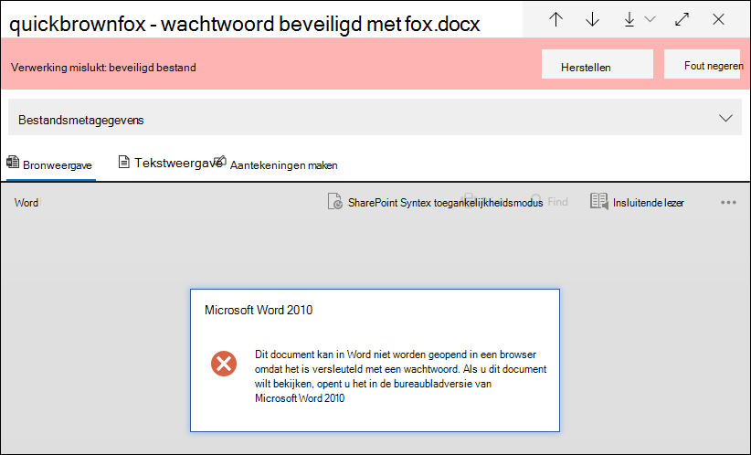
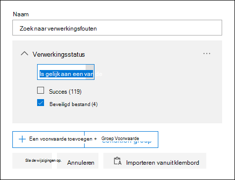
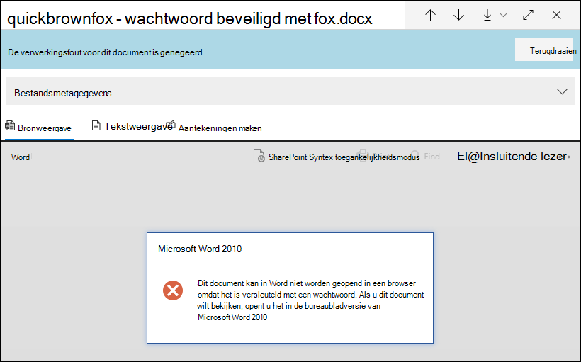
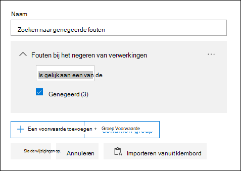
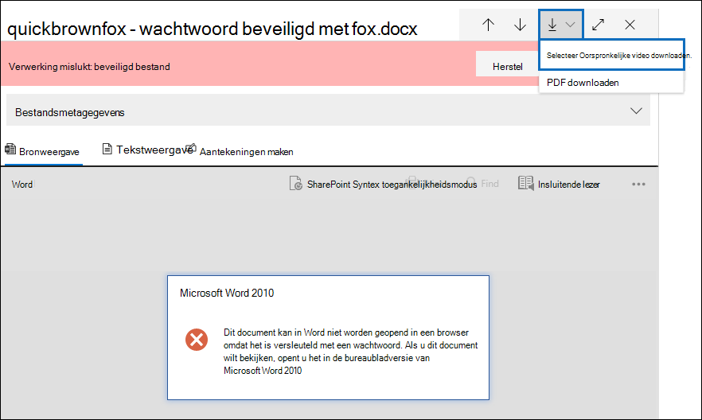
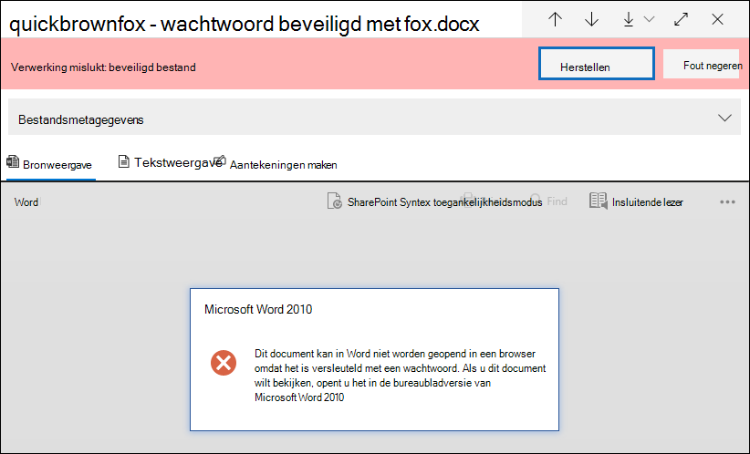
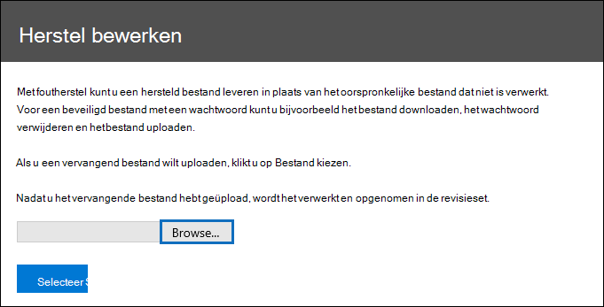
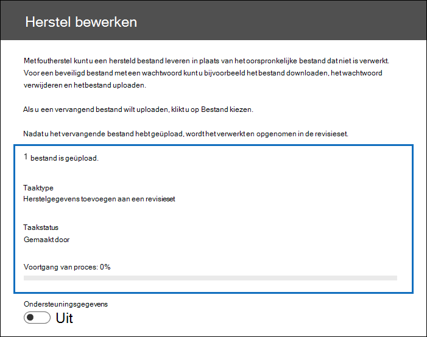
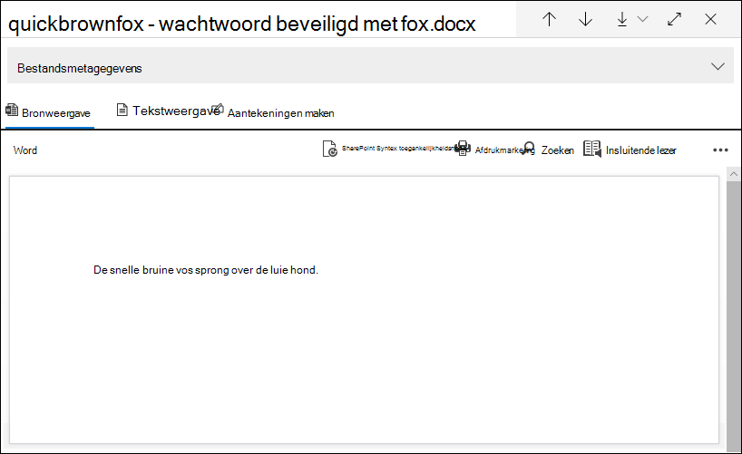

# Herstel van fout met één item in Advanced eDiscovery

Foutsanering biedt Advanced eDiscovery gebruikers de mogelijkheid om gegevensproblemen op te lossen die voorkomen dat Advanced eDiscovery inhoud correct verwerkt. Bestanden die met een wachtwoord zijn beveiligd, kunnen bijvoorbeeld niet worden verwerkt omdat deze bestanden zijn vergrendeld of versleuteld. Voorheen kon u alleen bulksgewijs fouten corrigeren met [behulp van deze werkstroom.](error-remediation-when-processing-data-in-advanced-ediscovery.md) Maar soms is het niet zinvol om fouten in meerdere bestanden te corrigeren wanneer u niet zeker weet of een van deze bestanden reageert op de zaak die u onderzoekt. Het is ook mogelijk niet zinvol om fouten te corrigeren voordat u de kans hebt gehad om de bestandsmetagegevens (zoals bestandslocatie of wie toegang had) te bekijken, om u te helpen bij het nemen van beslissingen over reactiesnelheid. Een nieuwe functie met de naam single *item error remediation geeft* eDiscovery-managers de mogelijkheid om de metagegevens van bestanden te bekijken met een verwerkingsfout en zo nodig de fout rechtstreeks in de revisieset te corrigeren. In het artikel wordt beschreven hoe u bestanden kunt identificeren, negeren en corrigeren met verwerkingsfouten in een revisieset.

## Documenten identificeren met fouten

Documenten met verwerkingsfouten in een revisieset worden nu geïdentificeerd (met een banner). U kunt de fout corrigeren of negeren. In de volgende schermafbeelding ziet u de bewerkingsfoutbanner voor een Word-document in een revisieset die met een wachtwoord is beveiligd. U ziet ook dat u de bestandsmetagegevens van documenten met verwerkingsfouten kunt bekijken.

U kunt ook zoeken naar documenten met verwerkingsfouten met behulp van de **statusstatus** verwerken bij het query's uitvoeren van [de documenten in een revisieset.](review-set-search.md)

### Fouten negeren

U kunt een verwerkingsfout negeren door te klikken op **Negeren** in de banner met verwerkingsfouten. Wanneer u een fout negeert, wordt het document verwijderd uit de [werkstroom bulksgewijs herstellen van fouten.](error-remediation-when-processing-data-in-advanced-ediscovery.md) Nadat een fout is genegeerd, verandert de documentbanner van kleur en wordt aangegeven dat de verwerkingsfout is genegeerd. U kunt de beslissing om de fout te negeren op elk moment herstellen door op **Terugkeren te klikken.**

U kunt ook zoeken naar alle documenten met een verwerkingsfout die is genegeerd met de voorwaarde Genegeerde verwerkingsfouten bij het opvragen van documenten in een revisieset. 

## Een document herstellen met fouten

Soms moet u mogelijk een verwerkingsfout in documenten herstellen (door een wachtwoord te verwijderen, een versleuteld bestand te ontsleutelen of een beschadigd document te herstellen) en vervolgens het herstelde document toe te voegen aan de revisieset. Op deze manier kunt u het foutdocument samen met de andere documenten in de revisieset bekijken en exporteren. 

Als u één document wilt herstellen, gaat u als volgt te werk:

1. Klik **op Origineel**  >  **downloaden** om een kopie van het bestand naar een lokale computer te downloaden.

   

2. Herstel de fout in het bestand offline. Voor versleutelde bestanden, waarvoor ontsleutelingssoftware vereist is, moet u wachtwoordbeveiliging verwijderen door het wachtwoord op te geven en het bestand op te slaan of een wachtwoordkraker te gebruiken. Nadat u het bestand hebt gesaneerd, gaat u naar de volgende stap.

3. Selecteer in de revisieset het bestand met de verwerkingsfout die u hebt gesaneerd en klik vervolgens op **Herstel**.

   

4. Klik **op Bladeren,** ga naar de locatie van het bestand op uw lokale computer en selecteer het bestand.

   

    Nadat u het bestand hebt geselecteerd, wordt het automatisch geüpload naar de revisieset. U kunt de verwerkingsstatus van het bestand bijhouden.

    

   Nadat de verwerking is voltooid, kunt u het gesaneerd document bekijken.

    

Zie Wat gebeurt er wanneer bestanden worden gesaneerd voor meer informatie over wat er gebeurt wanneer een document [wordt gesaneerd.](error-remediation-when-processing-data-in-advanced-ediscovery.md#what-happens-when-files-are-remediated)

## Zoeken naar hersteldocumenten

U kunt zoeken naar alle documenten in een revisieset  die zijn gesaneerd met behulp van de voorwaarde Trefwoorden en de volgende eigenschap:waardepaar opgeven: **IsFromErrorRemediation:true.** Deze eigenschap is ook beschikbaar in het exportladingsbestand wanneer u documenten exporteert uit een revisieset.
