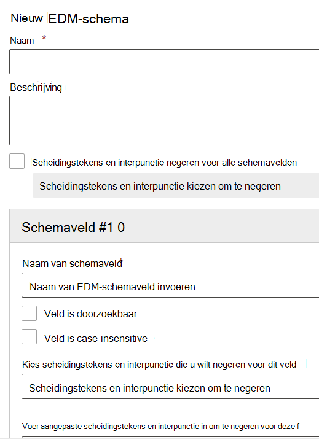

# De wizard voor het schema voor exacte gegevensovereenkomst en het type gevoelige informatie gebruikenUse the Exact Data Match Schema and Sensitive Information Type Wizard

[Het maken van een aangepast type gevoelige informatie met EDM-gebaseerde (exacte gegevensovereenkomst) classificatie](create-custom-sensitive-information-types-with-exact-data-match-based-classification.md) bestaat uit vele stappen.[Creating a custom sensitive information type with Exact Data Match (EDM) based classification](create-custom-sensitive-information-types-with-exact-data-match-based-classification.md)  involves many steps.  U kunt deze wizard gebruiken om bestanden met het schema en het gevoelige informatietype (SIT)-patroon (regelpakket) te maken om het proces te vereenvoudigen.You can use this wizard to create your schema and sensitive information type (SIT) pattern (rule package) files to help simplify the process.

> [!NOTE]
> De wizard voor het schema voor exacte gegevensovereenkomst en het type gevoelige informatie is alleen beschikbaar voor de wereldwijde en GCC-cloud.The Exact Data Match Schema and Sensitive Information Type Wizard is only available for the World Wide and GCC clouds only.

Deze wizard kan worden gebruikt in plaats van de:This wizard can be used instead of the:

- [Het schema voor uw database met gevoelige informatie definiërenDefine the schema for your database of sensitive information](create-custom-sensitive-information-types-with-exact-data-match-based-classification.md#define-the-schema-for-your-database-of-sensitive-information)
- [Een patroon (regelpakket) instellenSet up a pattern (rule package)](create-custom-sensitive-information-types-with-exact-data-match-based-classification.md#set-up-a-rule-package)

stappen in [Deel 1: EDM-gebaseerde classificatie instellen](create-custom-sensitive-information-types-with-exact-data-match-based-classification.md#part-1-set-up-edm-based-classification).steps in [Part 1: Set up EDM-based classification](create-custom-sensitive-information-types-with-exact-data-match-based-classification.md#part-1-set-up-edm-based-classification).

## VereistenPre-requisites

1. Maak uzelf bekend met de stappen voor het maken van een aangepast type gevoelige informatie met EDM [werkstroom in een oogopslag](create-custom-sensitive-information-types-with-exact-data-match-based-classification.md#the-work-flow-at-a-glance).Familiarize yourself with the steps to create a custom sensitive information type with EDM [work flow at a glance](create-custom-sensitive-information-types-with-exact-data-match-based-classification.md#the-work-flow-at-a-glance).

2. Voer de stappen uit in [Gevoelige gegevens opslaan in .csv of .tsv-indeling.](create-custom-sensitive-information-types-with-exact-data-match-based-classification.md#save-sensitive-data-in-csv-or-tsv-format)Perform the steps in [Save sensitive data in .csv or .tsv format](create-custom-sensitive-information-types-with-exact-data-match-based-classification.md#save-sensitive-data-in-csv-or-tsv-format).

## De wizard voor het schema voor exacte gegevensovereenkomst en het patroon voor het type gevoelige informatie gebruikenUse the exact data match schema and sensitive information type pattern wizard

1. Ga in het Microsoft 365-compliancecentrum voor uw tenant naar **Gegevensclassificatie** > **Exacte gegevensoverkomsten**.In the Microsoft 365 Compliance center for your tenant go to **Data classification** > **Exact data matches**.

2. Kies **EDM-schema maken** om de configuratie-flyout van de wizard te openen.Choose **Create EDM schema** to open the schema wizard configuration flyout.

3. Vul een toepasselijke **Naam** en **Beschrijving** in.Fill in an appropriate **Name** and **Description**.

4. Kies **Scheidingstekens en interpunctie negeren** voor alle schemavelden als u dat wilt.Choose **Ignore delimiters and punctuation for all schema fields** if you want that behavior. Zie Een aangepast type gevoelige informatie maken met de classificatie [Exact Data Match (EDM)](create-custom-sensitive-information-types-with-exact-data-match-based-classification.md)voor meer informatie over het configureren van EDM om case's of scheidingstekens te negeren.To learn more about configuring EDM to ignore case or delimiters, see [Creating a custom sensitive information type with Exact Data Match (EDM) based classification](create-custom-sensitive-information-types-with-exact-data-match-based-classification.md).

5. Vul de gewenste waarden in voor uw **Schemaveld #1** en voeg zo nodig meer velden toe.Fill in your desired values for your **Schema field #1** and add more fields as needed. 

> [!IMPORTANT]
> Ten minste één (maar niet meer dan vijf) van uw schemavelden moet worden aangewezen als doorzoekbaar.At least one, but no more than five of your schema fields must be designated as searchable.

6. Kies Opslaan.Choose save. Uw schema wordt nu vermeld.Your schema will now be listed.

7. Kies **Typen gevoelige informatie met EDM** en **Type gevoelige informatie met EDM maken** om de configuratiewizard voor typen gevoelige informatie te openen.Choose **EDM sensitive info types** and **Create EDM sensitive info type** to open the sensitive info type configuration wizard.

8. Kies **Een bestaand EDM-schema kiezen** en kies het schema dat u in stap 2-6 hebt gemaakt uit de lijst.Choose **Choose an existing EDM schema** and choose the schema you created in steps 2-6 from the list.

9. Kies **Volgende** en kies **Patroon maken**.Choose **Next** and choose **Create pattern**.

10. Kies het **Betrouwbaarheidsniveau** en **Primaire element**.Choose the **Confidence level** and **Primary element**.  Zie [Een aangepast type gevoelige informatie maken in het Compliancecentrum](create-a-custom-sensitive-information-type.md) voor meer informatie over het configureren van een patroon.To learn more about configuring a pattern, see [Create a custom sensitive information type in the Compliance Center](create-a-custom-sensitive-information-type.md)

11.  Kies het **Type gevoelige informatie van het primaire element** waaraan het moet worden gekoppeld.Choose the **Primary element's sensitive info type** to associate it with. Zie [Entiteitsdefinities van typen gevoelige informatie](sensitive-information-type-entity-definitions.md) voor meer informatie over de beschikbare typen gevoelige informatie.See [Sensitive Information Type Entity Definitions](sensitive-information-type-entity-definitions.md) to learn more about the available sensitive information types.

12. Kies **Gereed**.Choose **Done**.

13. Kies uw gewenste **Betrouwbaarheidsniveau en tekennabijheid**.Choose your desired **Confidence level and character proximity**.  Dit is de standaardwaarde voor het hele type gevoelige informatie met EDMThis will be the default value for the whole EDM sensitive info type

13. Kies **Patroon maken** als u extra patronen wilt maken voor uw EDM-gevoelige informatietype.Choose **Create pattern** if you want to create additional patterns for your EDM sensitive info type.

14. Kies **Volgende** en vul een **Naam** en **Beschrijving voor beheerders** in.Choose **Next** and fill in a **Name** and **Description for admins**.

15. Controleer uw invoer en kies **Verzenden**.Review and choose **Submit**.

U kunt het patroon voor het type gevoelige informatie verwijderen of bewerken door het te selecteren, waarna de besturingselementen voor bewerken en verwijderen worden weergegeven.You can delete or edit the sensitive information type pattern by selecting it which surfaces the edit and delete controls.

> [!IMPORTANT]
> Als u een schema wilt verwijderen dat al is gekoppeld aan een type gevoelige informatie met EDM, moet u eerst het type gevoelige informatie met EDM verwijderen. Vervolgens kunt u het schema verwijderen.If you want to remove a schema, and it is already associated with an EDM sensitive info type, you must first delete the EDM sensitive info type, then you can delete the schema.

## Stappen voor het maken van berichtenPost creation steps

Nadat u deze wizard hebt gebruikt om uw EDM-schema en patroonbestanden (regelpakket) te maken, moet u nog steeds de stappen in [Deel 2: De gevoelige gegevens hashen en uploaden](create-custom-sensitive-information-types-with-exact-data-match-based-classification.md#part-2-hash-and-upload-the-sensitive-data) uitvoeren voordat u het aangepaste type gevoelige informatie met EDM kunt gebruiken.After you have used this wizard to create your EDM schema and pattern (rule package) files, you still have to perform the steps in [Part 2: Hash and upload the sensitive data](create-custom-sensitive-information-types-with-exact-data-match-based-classification.md#part-2-hash-and-upload-the-sensitive-data) before you can use the EDM custom sensitive information type.

Nadat u hebt gecontroleerd of de tabel met gevoelige informatie correct is geüpload, kunt u testen of deze correct werkt.After verifying that your sensitive information table has correctly been uploaded, you can test that it's working properly.

1. Open **Compliancecentrum**  >  **Gegevensclassificatie**  >  **Gevoelige informatietypen**.Open **Compliance center** > **Data classification** > **Sensitive Information Types**.
2. Selecteer uw EDM SIT in de lijst en selecteer **vervolgens Testen** in het deelvenster Flyout.Select your EDM SIT from the list and then select **Test** in the flyout pane. 
3. Upload item dat gegevens bevat die u wilt detecteren, bijvoorbeeld een item maken dat een deel van de gegevens in de tabel met gevoelige informatie bevat.Upload an item that contains data you want to detect, for example create an item that contains some of the data in your sensitive information table. Als u de configureerbare overeenkomstfunctie in uw schema hebt gebruikt om genegeerde scheidingstekens te definiëren, moet u ervoor zorgen dat het item voorbeelden bevat met en zonder deze scheidingstekens.If you used the configurable match feature in your schema to define ignored delimiters, make sure the item includes examples with and without those delimiters.
4. Nadat het bestand is geüpload en gescand, controleert u op overeenkomsten met uw EDM SIT.After the file has been uploaded and scanned, check for matches to your EDM SIT.
5. Als de **functie Test** in de SIT een overeenkomst detecteert, controleert u of deze niet wordt bijgesneden of niet onjuist wordt geëxtraheert.If the **Test** function in the SIT detects a match, check that it is not trimming it or extracting it incorrectly. Bijvoorbeeld door alleen een subtekenreeks op te halen van de volledige tekenreeks die deze moet detecteren, of door alleen het eerste woord in een tekenreeks met meerdere woorden op te halen, of door extra symbolen of tekens in de extractie op te nemen.For example by extracting only a substring of the full string it is supposed to detect, or picking up only the first word in a multi-word string, or including extra symbols or characters in the extraction. Zie [Normale expressietaal - Snelle verwijzing voor](/dotnet/standard/base-types/regular-expression-language-quick-reference) de reguliere verwijzing naar expressietaal.See [Regular Expression Language - Quick Reference](/dotnet/standard/base-types/regular-expression-language-quick-reference) for the regular expression language reference. 

### Problemen oplossenTroubleshooting

Als u geen overeenkomsten vindt, gaat u als volgt te werk:If you don't find any matches, try the following:
- Controleer of uw gevoelige gegevens correct zijn geüpload met behulp van de opdrachten die worden uitgelegd in de richtlijnen voor het uploaden van uw gevoelige gegevens met het [hulpprogramma EDM.](create-custom-sensitive-information-types-with-exact-data-match-based-classification.md)Confirm that your sensitive data was uploaded correctly using the commands explained in [the guidance for uploading your sensitive data using the EDM tool](create-custom-sensitive-information-types-with-exact-data-match-based-classification.md).
- Controleer of de voorbeelden die u hebt ingevoerd in het item aanwezig zijn in de tabel met gevoelige informatie en of de genegeerde scheidingstekens juist zijn.Check that the examples you entered in the item are present in your sensitive information table and that the ignored delimiters are correct.
- **Test** de SIT die u hebt gebruikt bij het configureren van het primaire element in elk van uw patronen.**Test** the SIT you used when you configured the primary element in each of your patterns. Hiermee wordt bevestigd dat de SIT kan overeenkomen met de voorbeelden in het item.This will confirm that the SIT is able to match the examples in the item. 
  -  Als de SIT die u hebt geselecteerd voor een primair element in het EDM-type, geen overeenkomst in het item vindt of minder overeenkomsten vindt dan u verwacht, controleert u of het scheidingstekens en scheidingstekens ondersteunt die in de inhoud aanwezig zijn.If the SIT you selected for a primary element in the EDM type doesn't find a match in the item or finds fewer matches than you expected, check that it supports separators and delimiters that exist in the content. Zorg ervoor dat u de genegeerde scheidingstekens in uw schema op moet nemen.Be sure to include the ignored delimiters defined in your schema. 
  -  Als de **functie Test** helemaal geen inhoud detecteert, controleert u of de sit die u hebt geselecteerd vereisten bevat voor aanvullende trefwoorden of andere validaties.If the **Test** function does not detect any content at all, check if the SIT you selected includes requirements for additional keywords or other validations. Zie Entiteitsdefinities voor  gevoelige informatietypen voor de ingebouwde ST's om te controleren wat de minimumvereisten zijn voor het overeenkomen van elk type.For the built-in SITs, see [Sensitive information types entity definitions](sensitive-information-type-entity-definitions.md) to verify what the minimum requirements are for matching each type.
