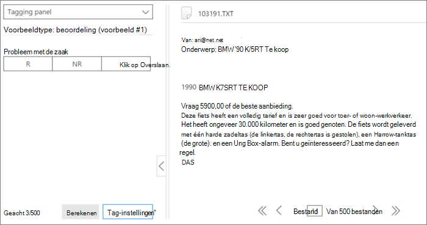

# Labelen en beoordelen in de module Relevantie in Advanced eDiscoveryTagging and Assessment in the Relevance module in Advanced eDiscovery
  
In deze sectie wordt de procedure voor beoordeling beschreven in de module Relevantie in Advanced eDiscovery.This section describes the procedure for Assessment in the Relevance module in Advanced eDiscovery.
  
## Evaluatietraining en -analyse uitvoerenPerforming Assessment training and analysis

1. Klik op **het \> tabblad Relevantie** bijhouden op **Beoordeling om** een beoordeling van de zaak te starten.In the **Relevance \> Track** tab, click **Assessment** to start case assessment.

    In deze procedure wordt bijvoorbeeld een steekproefbeoordelingsset van 500 bestanden gemaakt en wordt het tabblad Tag weergegeven, dat het deelvenster Labelen, weergegeven bestandsinhoud en andere opties voor labelen bevat. For example purposes in this procedure, a sample assessment set of 500 files is created and the **Tag** tab is displayed, which contains the Tagging panel, displayed file content and other tagging options. 

    
  
2. Controleer elk bestand in het voorbeeld, bepaal de relevantie van het bestand voor elk probleem en tag het bestand met de knoppen Relevantie (R), Niet relevant (NR) en Overslaan in het deelvenster **Labelen.**Review each file in the sample, determine the file's relevance for each case issue, and tag the file using the Relevance (R), Not relevant (NR) and Skip buttons in the **Tagging panel** pane. 

    > [!NOTE]
    >  Beoordeling vereist 500 gelabelde bestanden.Assessment requires 500 tagged files. Als bestanden worden overgeslagen, ontvangt u meer bestanden om te taggen.If files are "skipped", you will receive more files to tag. 
  
3. Nadat u alle bestanden in het voorbeeld hebt gelabeld, klikt u op **Berekenen.**After tagging all files in the sample, click **Calculate**.

    De huidige foutmarge en -rijkdom beoordelen worden  berekend en weergegeven op het tabblad Relevantie bijhouden, met uitgebreide details per probleem, zoals hieronder wordt weergegeven.The Assessment current error margin and richness are calculated and displayed in the **Relevance Track** tab, with expanded details per issue, as shown below. Meer informatie over dit dialoogvenster wordt beschreven in [de sectie Beoordelingsresultaten.](#reviewing-assessment-results)More details about this dialog are described in the [Reviewing assessment results](#reviewing-assessment-results) section.

    
  
    > [!TIP]
    > Het is standaard raadzaam om door te gaan met de standaardstap Volgende stap wanneer de voortgangsindicator Evaluatie voor het probleem is voltooid, wat aangeeft dat het beoordelingsvoorbeeld is beoordeeld en dat voldoende relevante bestanden zijn gelabeld.By default, we recommend that you proceed to the default Next step when the Assessment progress indicator for the issue has completed, indicating that the assessment sample was reviewed and sufficient relevant files were tagged. > Als u anders de resultaten  van het tabblad Bijhouden wilt bekijken en de  foutmarge en de volgende stap wilt bepalen, klikt u op Wijzigen naast Volgende **stap,** selecteert u Doorgaan met beoordelen en klikt u vervolgens op **OK.**> Otherwise, if you want to view the **Track** tab results and control the margin of error and the next step, click **Modify** adjacent to **Next Step**, select **Continue assessment**, and then click **OK**.
  
4. Klik **rechts** van het  selectievakje Beoordeling op Wijzigen om de beoordelingsparameters per probleem weer te geven en op te geven.Click **Modify** to the right of the **Assessment** check box to view and specify assessment parameters per issue. Een **dialoogvenster Beoordelingsniveau** voor elk probleem wordt weergegeven, zoals wordt weergegeven in het volgende voorbeeld:An **Assessment level** dialog for each issue is displayed, as shown in the following example: 

    
  
    De volgende parameters voor het probleem worden berekend en weergegeven in het dialoogvenster **Beoordelingsniveau:**The following parameters for the issue are calculated and displayed in the **Assessment level** dialog: 

    **Doelfoutmarge voor rappelschattingen:** Op basis van deze waarde wordt het geschatte aantal extra bestanden berekend dat nodig is om te controleren.**Target error margin for recall estimates**: Based on this value, the estimated number of additional files necessary to review is calculated. De marge die wordt gebruikt voor inroepen is groter dan 75% en met een betrouwbaarheidsniveau van 95%.The margin used for recall is greater than 75% and with a 95% confidence level.

    **Extra beoordelingsbestanden vereist:** geeft aan hoeveel bestanden er nog nodig zijn als niet aan de huidige foutmarge is voldaan.**Additional assessment files required**: Indicates how many more files are necessary if the current error margin's requirements have not been met. 

5. De huidige foutmarge aanpassen en het effect van verschillende foutmarges (per probleem) bekijken:To adjust the current error margin and see the effect of different error margins (per issue):

6. Selecteer een **probleem in de** lijst Probleem selecteren.In the **Select issue** list, select an issue. 

7. Voer **in Doelfoutmarge voor schatting van inroepen** een nieuwe waarde in.In **Target error margin for recall estimates**, enter a new value.

8. Klik **op Waarden bijwerken** om het effect van de aanpassingen te zien.Click **Update values** to see the impact of the adjustments. 

9. Klik **op Geavanceerd** in het dialoogvenster **Beoordelingsniveau** om de volgende aanvullende parameters en details te zien:Click **Advanced** in the **Assessment level** dialog to see the following additional parameters and details: 

    
  
    - **Geschatte rijkheid:** Geschatte rijkheid op basis van de huidige evaluatieresultaten**Estimated richness**: Estimated richness according to the current assessment results

    - **Voor veronderstelde inroeping:** De doelfoutmarge is standaard van toepassing op inroepen boven 75%.**For assumed recall**: By default, the target error margin applies to recall above 75%. Klik **op Bewerken** als u deze parameter wilt wijzigen en de foutmarge voor een ander bereik met inroepwaarden wilt bepalen.Click **Edit** if you want to change this parameter and control the margin of error on a different range of recall values. 

    - **Betrouwbaarheidsniveau:** Standaard is de aanbevolen foutmarge voor betrouwbaarheid 95%.**Confidence level**: By default, the recommended error margin for confidence is 95%. Klik **op Bewerken** als u deze parameter wilt wijzigen.Click **Edit** if you want to change this parameter.

    - **Verwachte foutenmarge :** Gezien de bijgewerkte waarden is dit de verwachte foutmarge van de rijkheid, nadat alle aanvullende beoordelingsbestanden zijn gecontroleerd.**Expected richness error margin**: Given the updated values, this is the expected margin of error of the richness, after all additional assessment files are reviewed.

    - **Aanvullende beoordelingsbestanden vereist:** gezien de bijgewerkte waarden, het aantal extra beoordelingsbestanden dat moet worden gecontroleerd om het doel te bereiken.**Additional assessment files required**: Given the updated values, the number of additional assessment files that need to be reviewed to reach the target.

    - **Totaal vereiste beoordelingsbestanden:** Gezien de bijgewerkte waarden zijn de totale beoordelingsbestanden vereist voor controle.**Total assessment files required**: Given the updated values, total assessment files required for review.

    - **Verwacht aantal relevante bestanden in de beoordeling:** gezien de bijgewerkte waarden, wordt het verwachte aantal relevante bestanden in de hele beoordeling gecontroleerd nadat alle aanvullende beoordelingsbestanden zijn beoordeeld.**Expected number of relevant files in assessment**: Given the updated values, the expected number of relevant files in the entire assessment after all additional assessment files are reviewed.

10. Klik **op Waarden herberekenen** als parameters worden gewijzigd.Click **Recalculate values**, if parameters are changed. Wanneer u klaar bent, als er één probleem is, klikt u op **OK** om de wijzigingen op te slaan (of **Volgende** wanneer er meerdere problemen zijn die u moet controleren of wijzigen en vervolgens **voltooien).**When you're done, if there is one issue, click **OK** to save the changes (or **Next** when there are multiple issues to review or modify and then **Finish**). 

    Wanneer er meerdere problemen zijn, wordt, nadat alle problemen zijn beoordeeld of aangepast, een dialoogvenster **Beoordelingsniveau:** samenvatting weergegeven, zoals wordt weergegeven in het volgende voorbeeld.When there are multiple issues, after all issues have been reviewed or adjusted, an **Assessment level: summary** dialog is displayed, as shown in the following example. 

    
  
    Als de evaluatie is voltooid, gaat u verder met de volgende fase in de relevantietraining.On successful completion of assessment, proceed to the next stage in Relevance training.

## Beoordelingsresultaten bekijkenReviewing assessment results

Nadat een evaluatievoorbeeld is gelabeld, worden de beoordelingsresultaten berekend en weergegeven op het tabblad Relevantie bijhouden.After an Assessment sample is tagged, the assessment results are calculated and displayed in the Relevance Track tab.
  
De volgende resultaten worden weergegeven in de uitgebreide weergave Bijhouden:The following results are displayed in the expanded Track display:
  
- Huidige foutmarge voor schattingen voor inroepen beoordelenAssessment current error margin for recall estimates

- Geschatte rijkheidEstimated richness

- Aanvullende beoordelingsbestanden vereist (voor controle)Additional assessment files required (for review)

De huidige foutmarge beoordelen is de foutmarge die wordt aanbevolen door Advanced eDiscovery.The Assessment current error margin is the error margin recommended by Advanced eDiscovery. Het getal dat wordt weergegeven voor de 'Aanvullende beoordelingsbestanden vereist' komt overeen met die aanbeveling.The number displayed for the "Additional assessment files required" corresponds to that recommendation.
  
De voortgangsindicator Beoordeling geeft het niveau van voltooiing van de beoordeling aan, gezien de huidige foutmarge.The Assessment progress indicator shows the level of completion of the assessment, given the current error margin. Wanneer de evaluatie aan de gang is, tagt de gebruiker een ander beoordelingsvoorbeeld.When assessment is underway, the user will tag another assessment sample.
  
Wanneer de beoordelingsvoortgangsindicator de beoordeling als voltooid weggedreed, betekent dit dat de evaluatie steekproefbeoordeling is voltooid en dat voldoende relevante bestanden zijn gelabeld.When the assessment progress indicator shows assessment as complete, that means the assessment sample review was completed and sufficient relevant files were tagged. 
  
De uitgebreide weergave Bijhouden toont de aanbevolen volgende stap, de beoordelingsstatistieken en toegang tot gedetailleerde resultaten.The expanded Track display shows the recommended next step, the assessment statistics, and access to detailed results.
  
Wanneer de rijkheid erg laag is, is het aantal extra beoordelingsbestanden dat nodig is om een minimaal aantal relevante bestanden te bereiken, zeer hoog om nuttige statistieken te maken.When richness is very low, the number of additional assessment files needed to reach a minimal number of relevant files to produce useful statistics is very high. Advanced eDiscovery raadt u aan over te gaan op de training.Advanced eDiscovery will then recommend moving on to training. De indicator voor de voortgang van de beoordeling wordt gearceerd en er zijn geen statistieken beschikbaar.The assessment progress indicator will be shaded, and no statistics will be available.
  
Als er geen statistische stabilisatie is, zijn er resultaten met een lager nauwkeurigheids- en betrouwbaarheidsniveau.In the absence of statistically based stabilization, there will be results with a lower level of accuracy and confidence level. Deze resultaten kunnen echter worden gebruikt om relevante bestanden te vinden wanneer u niet het percentage gevonden relevante bestanden hoeft te weten.However, these results can be used to find relevant files when you do not need to know the percentage of relevant files found. Op dezelfde manier kan deze status worden gebruikt om problemen met een lage rijkheid op te leiden, waarbij relevantiescores de toegang tot bestanden die relevant zijn voor een specifiek probleem kunnen versnellen.Similarly, this status can be used to train issues with low richness, where Relevance scores can accelerate access to files relevant to a specific issue.
  
> [!TIP]
> Op het **tabblad \> Relevantie** bijhouden, uit uitgebreid probleemweergave, zijn de volgende weergaveopties beschikbaar:In the **Relevance \> Track** tab, expanded issue display, the following viewing options are available: 
> 
> De aanbevolen volgende stap, zoals **Volgende stap:** Labelen kan worden  overgeslagen (per probleem) door op de knop Wijzigen rechts te klikken en vervolgens een andere stap te selecteren in **de volgende stap.**The recommended next step, such as **Next step: Tagging** can be bypassed (per issue) by clicking the **Modify** button to its right, and then selecting an different step in the **Next step**. Wanneer de indicator voor de voortgang van de beoordeling nog niet is voltooid, is evaluatie de volgende aanbevolen optie om meer beoordelingsbestanden te taggen en de nauwkeurigheid van de statistieken te verhogen.When the assessment progress indicator has not completed, assessment will be the next recommended option, to tag more assessment files and increase statistics accuracy. 
> 
> U kunt de foutmarge wijzigen en de impact ervan beoordelen door te klikken op Wijzigen **en** in het dialoogvenster Beoordelingsniveau **de** foutmarge Doel voor inroepingsschattingen te wijzigen en op Waarden bijwerken **te klikken.** You can change the error margin and assess its impact, by clicking **Modify**, and in the **Assessment level dialog**, changing the **Target error margin for recall estimates**, and clicking **Update values**. In dit dialoogvenster kunt u ook geavanceerde opties weergeven door op Geavanceerd te **klikken.**Also, in this dialog, you can view advanced options, by clicking **Advanced**. 
> 
> U kunt aanvullende statistieken op beoordelingsniveau en de impact ervan bekijken door op **Weergave te klikken.**You can view additional assessment level statistics and their impact by clicking **View**. In het dialoogvenster Weergegeven detailresultaten zijn statistieken per probleem beschikbaar, wanneer er ten minste 500 gelabelde beoordelingsbestanden zijn en ten minste 18 bestanden zijn gemarkeerd als Relevant voor het probleem.In the displayed Detail results dialog, statistics are available per issue, when there are at least 500 tagged assessment files and at least 18 files are tagged as Relevant for the issue. 
