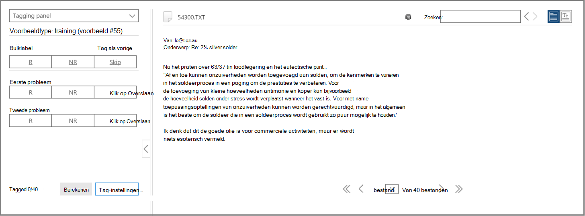
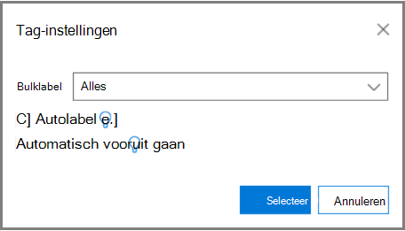
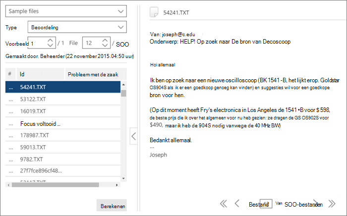

# Training voor labelen en relevantie in Advanced eDiscoveryTagging and Relevance training in Advanced eDiscovery
  
In dit artikel wordt de procedure beschreven voor het werken met de trainingsmodule Relevantie in Advanced eDiscovery.This article describes the procedure for working with the Relevance training module in Advanced eDiscovery.
  
Nadat de evaluatie is voltooid in Advanced eDiscovery en u de trainingsfase Relevantie in gaat, wordt een trainingsvoorbeeld van 40 bestanden naar het tabblad Tag gebracht voor labelen.After Assessment is completed in Advanced eDiscovery, and you enter the Relevance training stage, a training sample of 40 files is brought into the Tag tab for tagging.
  
## Relevantietraining uitvoerenPerforming Relevance training

1. Op **het tabblad \> Relevantielabel** wordt het deelvenster Labelen standaard weergegeven in het linkerdeelvenster en worden de voorbeeldbestanden één voor één weergegeven om te worden gelabeld.In the **Relevance \> Tag** tab, the Tagging pane is displayed by default in the left pane and the sample files are displayed, one at a time for tagging.

    
  
    Op het **tabblad** Tag wordt de weergavenaam van het bestand weergegeven.In the **Tag** tab, the file's display name is shown. Dit kan het pad, het e-mailonderwerp, de titel of de door de gebruiker gedefinieerde naam zijn.This could be the path, email subject, title, or user-defined name. De id, het bestandspad of het tekstpad kunnen worden gekopieerd door met de rechtermuisknop op het pad van het bestand te klikken.The ID, file path or text path can be copied by right-clicking on the file's path.

    In  de statistische tagtatiktalabels ziet u het voorbeeldnummer van het bestand (boven aan het linkerdeelvenster), het nummer van het momenteel weergegeven bestand uit de totale bestanden in het voorbeeld (onder aan het rechterdeelvenster) en het huidige totale aantal gelabelde bestanden in het voorbeeld (onder aan het linkerdeelvenster), die verandert terwijl u bestanden tagt.The **Tag** tab tagging statistics show the file sample number (at the top of the left pane), the number of the currently displayed file out of the total files in the sample (bottom of right pane), and the current total number of tagged files in the sample (bottom of the left pane), which changes as you tag files. Dit is van toepassing op alle relevantielabels die zijn uitgevoerd, ongeacht of dit gebeurt in Assessment, Training, Catch-up of Test.This applies for any Relevance tagging done, whether in Assessment, Training, Catch-up, or Test.

    Pictogrammen die aangeven dat er opmerkingen, tags en gezinsbestanden bestaan, worden weergegeven in de bestandsweergave op een balk boven het bestand.Icons indicating the existence of comments, tags, and family files are displayed in the file view in a bar above the file.

2. Bepaal de relevantie van het bestand voor het probleem met de zaak en tag het bestand met behulp van de knoppen voor de optie Labelen of sneltoetsen, zoals wordt weergegeven in de volgende tabel:Determine the file's relevance for the case issue and tag the file using either the Tagging option icon buttons or keyboard shortcuts, as shown in the following table:

   |**Optie Voor labelen****Tagging option**|**Beschrijving****Description**|**Sneltoets****Keyboard shortcut**|**Sneltoets bulksgewijs labelen (voor meerdere problemen)****Bulk tagging keyboard shortcut (for multiple issues)**|
   |-----|-----|-----|-----|
   |RR    |RelevantRelevant    |ZZ    |`Shift + Z`    |
   |NRNR    |Niet relevantNot relevant    |XX    |`Shift + X`    |
   |OverslaanSkip    |OverslaanSkip    |CC    |`Shift + A`    |
   |||||

   - Wanneer er meerdere problemen zijn voor een bestand, gaat de selectie na het labelen van een probleem naar het volgende probleem (indien aanwezig).When multiple issues exist for a file, after tagging one issue, the selection moves to the next issue (if any).  

   - Trefwoorden die zijn gedefinieerd door de beheerder of casemanager bij het markeren van trefwoorden (Relevantie-instelling Gemarkeerde trefwoorden), worden weergegeven (in opgegeven kleuren) om relevante bestanden te identificeren tijdens het \> labelen.Keywords that were defined by the Administrator or Case manager when highlighting keywords (Relevance setup \> Highlighted keywords), will be displayed (in specified colors) to help identify relevant files while tagging. Als een trefwoord een dubbele onderstreping heeft, kan erop worden geklikt om een knoptip weer te geven met de beschrijving van het trefwoord.If a keyword has a double underline, it can be clicked to display a tool-tip with the keyword's description.

     Klik desgewenst op het tabblad **Tag** op **Tag-instellingen** om de volgende opties in te stellen:Optionally, in the **Tag** tab, click **Tag settings** to set the following options:

      
  
   - **Bulktag:** Gebruik deze optie om meerdere problemen  voor een bestand toe te wijzen door Alles te selecteren om de tag voor het geselecteerde bestand in te stellen voor alle problemen (overschrijven al gemarkeerde problemen) of door **De rest** te selecteren om de tag toe te passen op de resterende niet-gemarkeerde problemen.**Bulk tag**: Use this option to assign multiple issues for a file by selecting **All** to set the tag for the selected file for all issues (overrides already tagged issues) or by selecting **The rest** to apply the tag to the remaining untagged issues. De geselecteerde optie blijft van kracht voor alle gevallen van deze gebruiker totdat deze is gewijzigd door die gebruiker (instelling is per gebruiker voor alle gevallen van de gebruiker).The selected option remains in effect for all of this user's cases until changed by that user (setting is per user for all the user's cases).

   - **Automatische tag:** Schakel dit selectievakje in om andere problemen voor een bestand in te stellen als Niet relevant na één relevante labeling.**Auto tag**: Select this check box to set other issues for a file as Not relevant after a single Relevant tagging.

   - **Automatisch vooraf:** Schakel dit selectievakje in om de weergegeven bestandsselectie naar het volgende bestand te verplaatsen wanneer u het laatste of enige probleem zonder label labelt.**Auto advance**: Select this check box to move the displayed file selection to the next file when tagging the last or only untagged issue.

    Overgeslagen bestanden worden niet in aanmerking genomen voor relevantietraining en relevantiescoredoeleinden.Skipped files will not be considered for Relevance training and Relevance scoring purposes.

3. Opmerkingen met vrije tekst, gekoppeld aan een bestand, kunnen  worden bekeken en bewerkt via de optie Opmerking in de vervolgkeuzelijst van het linkerdeelvenster.Free-text comments, associated with a file, can be viewed and edited via the **Comment** option in the left pane drop-down list. (optioneel)(optional)

4. Richtlijnen voor labelen kunnen worden weergegeven door de optie Richtlijnen **labelen** te selecteren in de vervolgkeuzelijst van het linkerdeelvenster.Guidelines for tagging can be viewed by selecting the **Tagging guidelines** option in the left pane drop-down list.

5. Nadat u alle bestanden in de lijst hebt gelabeld en klaar bent om de resultaten te berekenen, klikt u op **Berekenen.**After you finish tagging all files in the list and are ready to calculate the results, click **Calculate**. Het **tabblad** Bijhouden wordt weergegeven.The **Track** tab is displayed.  

## Werken met de lijst met voorbeeldbestandenWorking with the sample files list

Met de lijst met voorbeeldbestanden kunt u een lijst met de bestanden weergeven in een trainingsvoorbeeld en verschillende acties uitvoeren op een of meer bestanden.The sample files list allows you to view a list of the files in a training sample and perform various actions on one or more files. Op het **tabblad** Relevantielabel wordt in het linkerdeelvenster Voorbeeldbestanden een lijst met voorbeeldbestanden weergegeven voor verwerking met \>  evaluatie-, trainings-, inhaal- en inconsistentiesprocessen. In the **Relevance** \> **Tag** tab, the **Sample files** left pane displays a list of sample files for processing with Assessment, Training, Catch-up, and Inconsistencies processes.
  
1. Selecteer op het tabblad **\> Relevantielabel** de vervolgkeuzelijst Voorbeeldbestanden in het linkerdeelvenster.In the **Relevance \> Tag** tab, select the Sample files in the left pane drop-down list. De voorbeeldbestanden worden weergegeven in het linkerdeelvenster.The sample files are listed in the left pane.

    
  
2. Selecteer een specifiek voorbeeld- of bestandsnummer door het nummer in te vullen of te selecteren in de vakken **Voorbeeld** **of** Bestand.Select a specific sample or file number by entering or selecting its number in the **Sample** or **File** boxes.

   - Een bestandsreeksnummer wordt weergegeven in de linkerkolom van de weergegeven lijst met bestanden op het **tabblad** Tag. Door op de koptekst te klikken, keert de oorspronkelijke weergegeven volgorde van de bestanden terug naar de oorspronkelijke volgorde.A file sequence number is listed in the left column of the displayed file list on the **Tag** tab. By clicking the header, the original displayed order of the files returns to its original order.

   - Als u op een bestandsrij klikt, wordt de inhoud ervan weergegeven in het rechterdeelvenster.Clicking on a file row displays its content in the right pane.

   - Navigeer tussen bestanden in het huidige voorbeeld met behulp van de opties voor de lagere menubalk.Navigate between files in the current sample by using the lower menu bar options. Daarnaast zijn navigatietoetsensneltoetsen beschikbaar:In addition, navigational keyboard shortcuts are available:
  
     - Ga als eerste naar het eerste bestand in het voorbeeld: `Shift + Ctrl + <`To go to the first file in the sample: `Shift + Ctrl + <`

     - Ga als eerste naar het vorige bestand in het voorbeeld: `Shift + <`To go to the previous file in the sample: `Shift + <`

     - Ga als eerste naar het volgende bestand in het voorbeeld: `Shift + >`To go to the next file in the sample: `Shift + >`

     - Ga als eerste naar het laatste bestand in het voorbeeld: `Shift + Ctrl + >`To go to the last file in the sample: `Shift + Ctrl + >`
