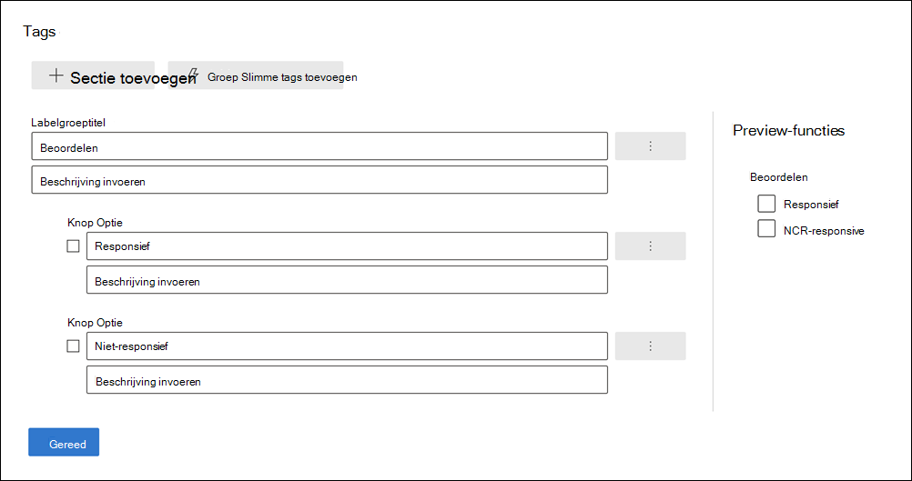
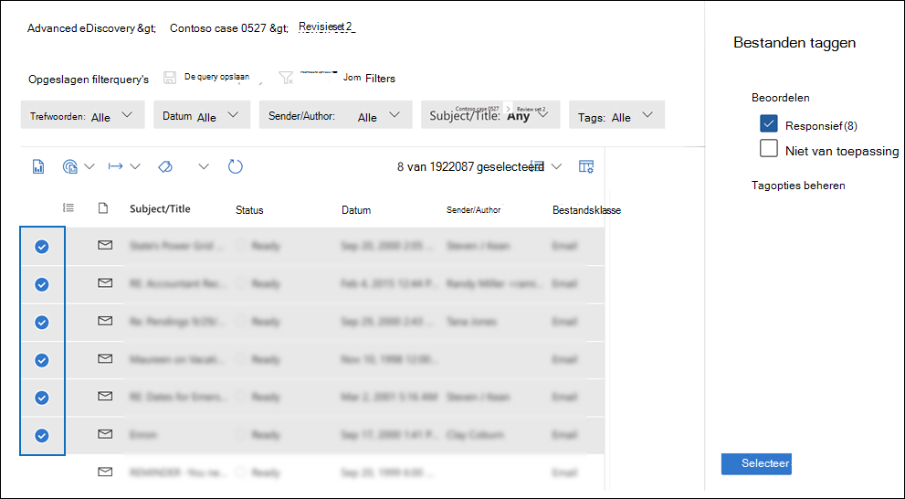
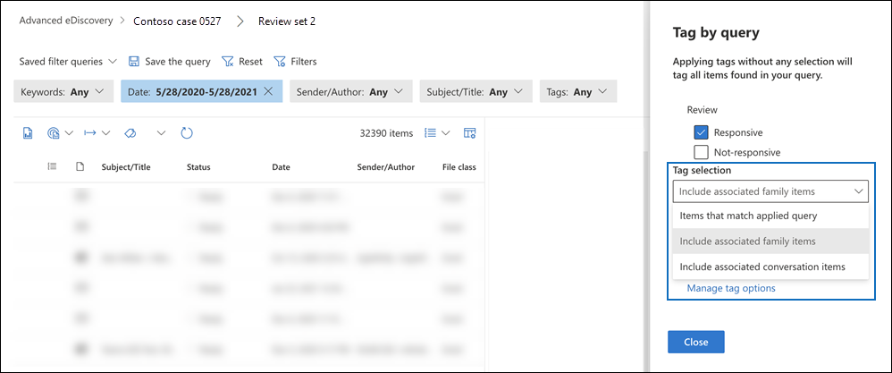

# Documenten taggen in een revisieset in Advanced eDiscovery

Het organiseren van inhoud in een revisieset is belangrijk om verschillende werkstromen in het eDiscovery-proces te voltooien. Dit zijn:

- Overbodige inhoud verwijderen

- Relevante inhoud identificeren

- Inhoud identificeren die moet worden gecontroleerd door een expert of een advocaat

Wanneer experts, advocaten of andere gebruikers inhoud in een revisieset bekijken, kunnen hun adviezen met betrekking tot de inhoud worden vastgelegd met behulp van tags. Als het bijvoorbeeld de bedoeling is om overbodige inhoud te verwijderen, kan een gebruiker documenten taggen met een tag zoals 'niet-responsief'. Nadat inhoud is beoordeeld en gelabeld, kan er een zoekactie voor revisiesets worden gemaakt om inhoud die is gemarkeerd als 'niet-responsief' uit te sluiten. Met dit proces wordt de niet-responsieve inhoud uit de volgende stappen in de eDiscovery-werkstroom weggewerkt. Het labelvenster in een revisieset kan voor elk geval worden aangepast, zodat de tags de beoogde revisiewerkstroom voor de zaak ondersteunen.

> [!NOTE]
> Het bereik van tags is een Advanced eDiscovery geval. Dat betekent dat een zaak slechts één set tags kan bevatten die revisoren kunnen gebruiken om documenten met revisiesets te taggen. U kunt geen andere set tags instellen voor gebruik in verschillende revisiesets in hetzelfde geval.

## Tagtypen

Advanced eDiscovery bevat twee typen tags:

- **Labels met één keuze:** hiermee beperkt u revisoren tot het selecteren van één tag in een groep. Deze typen tags kunnen handig zijn om ervoor te zorgen dat revisoren geen conflicterende tags selecteren, zoals 'responsief' en 'niet-responsief'. Labels met één keuze worden weergegeven als keuzerondjes.

- **Meervoudige keuzelabels:** Toestaan dat beoordelingen meerdere tags in een groep selecteren. Deze typen tags worden weergegeven als selectievakjes.

## Tagstructuur

Naast de tagtypen, kan de structuur van de manier waarop tags zijn ingedeeld in het tagvenster worden gebruikt om het labelen van documenten intuïtiever te maken. Tags worden gegroepeerd op secties. Zoeken in revisieset ondersteunt de mogelijkheid om te zoeken op tag en op tagsectie. Dit betekent dat u een zoekopdracht voor revisiesets kunt maken om documenten op te halen die zijn gemarkeerd met een tag in een sectie.

U kunt tags verder organiseren door ze in een sectie te nesten. Als het bijvoorbeeld de bedoeling is om bevoorrechte inhoud te identificeren en te taggen, kan nesting worden gebruikt om duidelijk te maken dat een revisor een document kan taggen als 'Bevoorrecht' en het type privilege kan selecteren door de juiste geneste tag te controleren.

## Tags maken

Voordat u tags op documenten in de revisieset kunt toepassen, moet u een tagstructuur maken.

1. Open een revisieset en navigeer naar de opdrachtbalk en selecteer **Label op query.**

2. Selecteer in het deelvenster Labelen **de optie Tagopties beheren**

3. Selecteer **Tagsectie toevoegen.**

4. Typ een labelgroeptitel en een optionele beschrijving en klik vervolgens op **Opslaan.**

5. Selecteer de vervolgkeuzelijst met drie puntjes naast de titel van de taggroep en klik op **Selectievakje** Toevoegen of **knop Optie toevoegen.**

6. Typ een naam en beschrijving voor het selectievakje of de optieknop.

7. Herhaal dit proces om nieuwe tagsecties, tagopties en selectievakjes te maken.

   

## Tags toepassen

Met de tagstructuur kunnen revisoren tags toepassen op documenten in een revisieset. Er zijn twee verschillende manieren om tags toe te passen:

- Bestanden taggen

- Labelen op query

### Bestanden taggen

Of u nu één item of meerdere items in een revisieset selecteert, u kunt tags toepassen op de selectie door op **Bestanden** labelen op de opdrachtbalk te klikken. In het labelvenster kunt u een tag selecteren en deze automatisch toepassen op de geselecteerde documenten.

> [!NOTE]
> Tags worden alleen toegepast op geselecteerde items in de lijst met items.

### Labelen op query

Met Labelen op query kunt u tags toepassen op alle items die worden weergegeven door een filterquery die momenteel wordt toegepast in de revisieset.

1. Schakel alle items in de revisieset uit en ga naar de opdrachtbalk en selecteer **Label per query.**

2. Selecteer in het labelvenster de tag die u wilt toepassen.

3. Onder de **vervolgkeuzekeuze van** Tag zijn er drie opties waarmee wordt bepaald op welke items de tag moet worden toegepast.

   - **Items die overeenkomen met toegepaste query:** Hiermee worden tags toegepast op specifieke items die overeenkomen met de voorwaarden voor filterquery's.

   - **Bijbehorende gezinsitems opnemen:** Hiermee past u tags toe op specifieke items die overeenkomen met de filterqueryvoorwaarden en de bijbehorende gezinsitems. *Gezinsitems* zijn items met dezelfde metagegevenswaarde FamilyId.  

   - **Bijbehorende gespreksitems opnemen:** Hiermee worden tags toegepast op items die overeenkomen met de filterqueryvoorwaarden en de bijbehorende gespreksitems. *Gespreksitems* zijn items die dezelfde waarden voor ConversationId-metagegevens delen.

   

4. Klik **op Taak labelen starten** om de labelingsbaan te activeren.

## Labelfilter

Gebruik het labelfilter in de revisieset om snel items te zoeken of uit te sluiten uit de queryresultaten op basis van de manier waarop een item is gelabeld. 

1. Selecteer **Filters om** het filtervenster uit te vouwen.

2. Selecteer en vouw **itemeigenschappen uit.**

3. Schuif omlaag om het filter met de naam **Tag te zoeken,** schakel het selectievakje in en klik vervolgens op **Klaar.**

4. Als u items met een specifieke tag wilt opnemen of uitsluiten uit een query, gaat u op een van de volgende punten te werk:

   - **Items opnemen:** Selecteer de tagwaarde en selecteer **Gelijk aan een van** de items in de vervolgkeuzelijst.

      Of

   - **Items uitsluiten:** Selecteer de tagwaarde en selecteer **Gelijk aan geen van** in de vervolgkeuzelijst.

     

> [!NOTE]
> Zorg ervoor dat u de pagina vernieuwt om ervoor te zorgen dat in het labelfilter de meest recente wijzigingen in de tagstructuur worden weergegeven.
