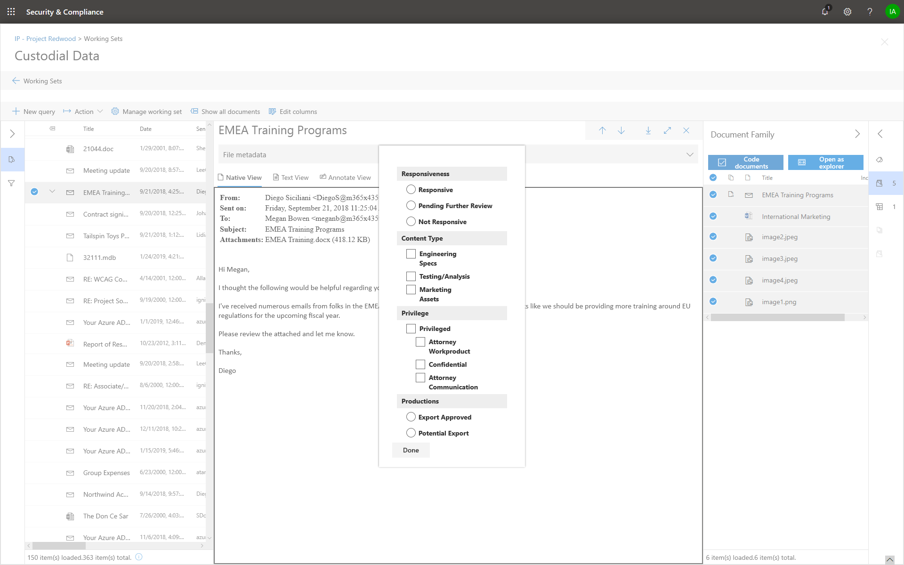

# Documenten taggen in een revisieset in Advanced eDiscoveryTag documents in a review set in Advanced eDiscovery

Het organiseren van inhoud in een revisieset is belangrijk om verschillende werkstromen in het eDiscovery-proces te voltooien.Organizing content in a review set is important to complete various workflows in the eDiscovery process. Dit omvat:This includes:

- Overbodige inhoud verwijderenCulling unnecessary content

- Relevante inhoud identificerenIdentifying relevant content
 
- Inhoud identificeren die moet worden gecontroleerd door een expert of een advocaatIdentifying content that must be reviewed by an expert or an attorney

Wanneer experts, advocaten of andere gebruikers inhoud in een revisieset bekijken, kunnen hun adviezen met betrekking tot de inhoud worden vastgelegd met behulp van tags.When experts, attorneys, or other users review content in a review set, their opinions related to the content can be captured by using tags. Als het bijvoorbeeld de bedoeling is om overbodige inhoud te verwijderen, kan een gebruiker documenten taggen met een tag zoals 'niet-responsief'.For example, if the intent is to cull unnecessary content, a user can tag documents with a tag such as "non-responsive". Nadat inhoud is beoordeeld en gelabeld, kan er een zoekactie voor revisiesets worden gemaakt om inhoud die is gemarkeerd als 'niet-responsief' uit te sluiten, waardoor deze inhoud niet meer in de volgende stappen in de eDiscovery-werkstroom wordt gebruikt.After content has been reviewed and tagged, a review set search can be created to exclude any content tagged as "non-responsive", which eliminates this content from the next steps in the eDiscovery workflow. Het tagvenster kan voor elk geval worden aangepast, zodat de tags de beoogde revisiewerkstroom kunnen ondersteunen.The tag panel can be customized for every case so that the tags can support the intended review workflow.

## TagtypenTag types

Advanced eDiscovery bevat twee typen tags:Advanced eDiscovery provides two types of tags:

- **Labels voor één keuze:** gebruikers worden beperkt tot het selecteren van één tag in een groep.**Single choice tags** - Restricts users to select a single tag within a group. Dit kan handig zijn om ervoor te zorgen dat gebruikers geen conflicterende tags selecteren, zoals 'responsief' en 'niet-responsief'.This can be useful to ensure users don't select conflicting tags such as "responsive" and "non-responsive". Deze worden weergegeven als radioknoppen.These will appear as radio buttons.

- **Meervoudige keuzelabels:** gebruikers toestaan meerdere tags in een groep te selecteren.**Multiple choice tags** - Allow users to select multiple tags within a group. Deze worden weergegeven als selectievakjes.These will appear as checkboxes.

## TagstructuurTag structure

Naast de tagtypen, kan de structuur van de manier waarop tags zijn ingedeeld in het tagvenster worden gebruikt om het labelen van documenten intuïtiever te maken.In addition to the tag types, the structure of how tags are organized in the tag panel can be used to make tagging documents more intuitive. Tags worden gegroepeerd op secties.Tags are grouped by sections. Zoeken in revisieset ondersteunt de mogelijkheid om te zoeken op tag en op tagsectie.Review set search supports the ability to search by tag and by tag section. Dit betekent dat u een zoekopdracht voor revisiesets kunt maken om documenten op te halen die zijn gemarkeerd met een tag in een sectie.This means you can create a review set search to retrieve documents tagged with any tag in a section.

Tags kunnen verder worden georganiseerd door ze in een sectie te nesten.Tags can be further organized by nesting them within a section. Als het bijvoorbeeld de bedoeling is om bevoorrechte inhoud te identificeren en te taggen, kan nesting worden gebruikt om duidelijk te maken dat een gebruiker een document kan taggen als 'Privileged' en het type privilege kan selecteren door de juiste geneste tag te controleren.For example, if the intent is to identify and tag privileged content, nesting can be used to make it clear that a user can tag a document as "Privileged" and select the type of privilege by checking the appropriate nested tag.

## Tags toepassenApplying tags

Er zijn verschillende manieren om een tag toe te passen op inhoud.There are several ways to apply a tag to content.

### Eén document labelenTagging a single document

Wanneer u een document bekijkt in een revisieset, kunt u de tags weergeven die door een revisie kunnen worden gebruikt door te klikken op **Het deelvenster Labelen.**When viewing a document in a review set, you can display the tags that a review can use by clicking **Tagging panel**.

Op deze manier kunt u tags toepassen op het document dat in de viewer wordt weergegeven.This will enable you to apply tags to the document displayed in the viewer.

### BulklabelsBulk tagging

Bulklabels kunnen worden uitgevoerd door meerdere bestanden in het  resultatenraster te selecteren en vervolgens de tags in het deelvenster Labelen te gebruiken, vergelijkbaar met het labelen van afzonderlijke documenten.Bulk tagging can be done by selecting multiple files in the results grid and then using the tags in the **Tagging panel** similar to tagging single documents. Bulk-un-tagging kan worden uitgevoerd door tags tweemaal te selecteren. met de eerste klik wordt de tag toegepast en met de tweede selectie wordt ervoor gezorgd dat de tag voor alle geselecteerde bestanden is geweken.Bulk un-tagging can be done by selecting tags twice; the first click will apply the tag, and the second selection will ensure that tag is cleared for all selected files.

> [!NOTE]
> Wanneer het label bulksgewijs wordt gemarkeerd, wordt in het labelvenster een aantal bestanden weergegeven dat voor elke tag in het deelvenster is gemarkeerd.When bulk tagging, the tagging panel will display a count of files that are tagged for each tag in the panel.

### Labelen in andere revisiepanelenTagging in other review panels

Wanneer u documenten controleert, kunt u de andere revisiepanelen gebruiken om andere kenmerken van documenten in het resultatenraster te bekijken.When reviewing documents, you can use the other review panels to review other characteristics of documents in the results grid. Dit omvat het controleren van andere gerelateerde documenten, e-mailthreads, near duplicates en hash duplicaten.This includes reviewing other related documents, email threads, near duplicates, and hash duplicates. Wanneer u bijvoorbeeld gerelateerde documenten bekijkt (met  behulp van het revisievenster documentfamilie), kunt u de controletijd aanzienlijk verminderen door gerelateerde documenten bulksgewijs te labelen.For example, when you're reviewing related documents (by using the **Document family** review panel), you can significantly reduce review time by bulk tagging related documents. Als een e-mailbericht bijvoorbeeld meerdere bijlagen heeft en u ervoor wilt zorgen dat het hele gezin consistent wordt gelabeld.For example, if an email message has several attachments and you want to ensure that the entire family is tagged consistently.

U kunt bijvoorbeeld als volgende het deelvenster Labelen weergeven **wanneer** u het **revisievenster Documentfamilie** gebruikt:For example, here's how to display the **Tagging panel** when using the **Document family** review panel:

1. Als het revisievenster is geopend voor een geselecteerd document (bijvoorbeeld  door de lijst  met gerelateerde inhoud weer te geven in het revisievenster documentfamilie, klikt u op Documenten taggen onder het documentfamiliebeoordelingsvenster.With the review panel open for a selected document (for example, displaying the list of related content in the **Document family** review panel, click **Tag documents** under the document family review panel.

   Het labelvenster wordt weergegeven als een pop-upvenster.The tagging panel is displayed as a pop-up window.

2. Kies een of meer tags om het geselecteerde document toe te passen.Choose one or more tags to apply the selected document. 

3. Als u alle documenten wilt taggen, selecteert u alle documenten in het deelvenster **Documentfamilie,** klikt u op Documenten labelen **en** kiest u vervolgens de tags die u wilt toepassen op de hele familie documenten.To tag all documents, select all documents in the **Document family** panel, click **Tag documents**, and then choose the tags to apply to the entire family of documents.

