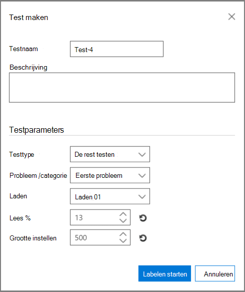
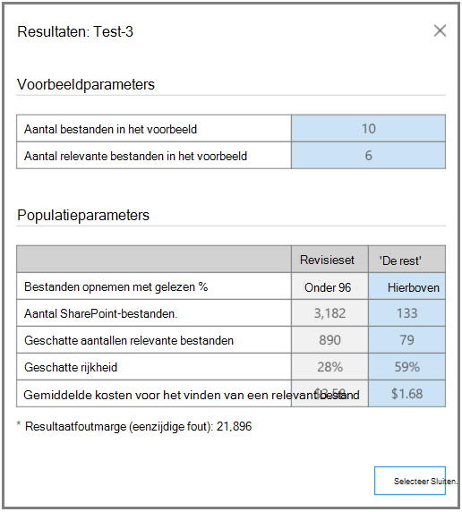

# Test Relevantieanalyse in Advanced eDiscoveryTest Relevance analysis in Advanced eDiscovery
  
Op het tabblad Testen in Advanced eDiscovery kunt u de algehele kwaliteit van de verwerking testen, vergelijken en valideren.The Test tab in Advanced eDiscovery enables you to test, compare, and validate the overall quality of processing. Deze tests worden uitgevoerd na batchberekening.These tests are performed after Batch calculation. Door de bestanden in de verzameling te labelen, maakt een expert het uiteindelijke oordeel over of elk gelabeld bestand relevant is voor de zaak.By tagging the files in the collection, an expert makes the final judgment about whether each tagged file is relevant to the case.
  
In scenario's met één of meerdere problemen worden tests meestal per probleem uitgevoerd.In single and multiple-issue scenarios, tests are typically performed per issue. De resultaten kunnen na elke test worden bekeken en testresultaten kunnen worden herwerkt met opgegeven voorbeeldtestbestanden.Results can be viewed after each test, and test results can be reworked with specified sample test files.
  
## De rest testenTesting the rest

De test 'Test the Rest' wordt gebruikt om selectiebeslissingen te valideren, bijvoorbeeld om alleen bestanden boven een specifieke relevantiescore te controleren op basis van de uiteindelijke Advanced eDiscovery resultaten.The "Test the Rest" test is used to validate culling decisions, for example, to review only files above a specific Relevance cutoff score based on the final Advanced eDiscovery results. De expert bekijkt een steekproef van bestanden onder een geselecteerde cutoffscore om het aantal relevante bestanden in die set te evalueren.The expert reviews a sample of files under a selected cutoff score to evaluate the number of relevant files within that set.
  
Deze test bevat statistieken en een vergelijking tussen de revisieset en de populatie Rest testen.This test provides statistics and a comparison between the Review set and the Test the Rest population. De resultaten van de revisieset zijn de resultaten die worden berekend door Relevantie tijdens de training.The results of the review set are those calculated by Relevance during Training. De resultaten zijn berekeningen op basis van instellingen en invoerparameters, zoals:The results include calculations based on settings and input parameters, such as:
  
- Test voorbeeldstatistieken van het aantal bestanden in een steekproef en identificeer relevante bestanden.Test sample statistics of the number of files in a sample and identified relevant files.

- Tabellaire vergelijking van de parameters Populatie van de revisieset en de Rest, bijvoorbeeld het aantal bestanden, het geschatte aantal relevante bestanden, de geschatte rijkheid en de gemiddelde kosten van het zoeken naar een ander relevant bestand.Tabular comparison of the Population parameters of the Review set and the Rest, for example, the number of files, estimated number of relevant files, estimated richness, and the average cost of finding another relevant file. Instellingen voor kostenparameters kunnen worden ingesteld door de beheerder.Cost parameter settings can be set by the administrator.

De test 'Test de rest' uitvoeren:To run the "Test the Rest" test:

1. Open het **tabblad \> Relevantietoets.**Open the **Relevance \> Test** tab.

2. Klik op **het** tabblad Test op **Nieuwe test.**In the **Test** tab, click **New test**. Het **dialoogvenster Test maken** wordt weergegeven, zoals wordt weergegeven in het volgende voorbeeld.The **Create test** dialog is displayed, as shown in the following example.

    
  
3. Typ **in Testnaam** en **Beschrijving** de naam en beschrijving.In **Test name**, and **Description**, type the name and description.

4. Selecteer in **de lijst Testtype** **de optie Rest testen**In the **Test type** list, select **Test the Rest**

5. Selecteer in **de lijst Probleem/categorie** de naam van het probleem.In the **Issue / Category** list, select the issue name.

6. Selecteer de belasting in **de** lijst Laden.In the **Load** list, select the load. 

7. Accepteer **in Lees %** de standaardwaarde of selecteer een waarde voor de cutoff Relevantiescore.In **Read %**, accept the default value or select a value for the cutoff Relevance score. 

8. In **Grootte instellen** of de standaardwaarde accepteren.In **Set size**, or accept the default value. Met de pictogrammen voor herstellen worden de standaardwaarden hersteld.The restore icons will restore the default values.

9. Klik **op Labelen starten.**Click **Start tagging**. Er wordt een testvoorbeeld gegenereerd.A test sample is generated.

10. Controleer en tag elk van de bestanden op het tabblad **\> Relevantielabel** en klik wanneer u klaar bent op **Berekenen.**Review and tag each of the files in the **Relevance \> Tag** tab and when done, click **Calculate**.

11. Klik op het tabblad Test op **Resultaten weergeven om** de testresultaten te bekijken.In the Test tab, you can click **View results** to see the test results. Een voorbeeld wordt weergegeven in de volgende schermafbeelding.An example is shown in the following screenshot.

    
  
In de vorige schermafbeelding bevat de sectie **Voorbeeldparameters** van de tabel details over het aantal bestanden in het voorbeeld dat door de expert is gelabeld en het aantal relevante bestanden dat in dat voorbeeld is gevonden.In the previous screenshot, the **Sample parameters** section of the table contains details about the number of files in the sample tagged by the expert, and the number of relevant files found in that sample.
  
De sectie **Populatieparameters** van de tabel bevat de testresultaten, inclusief de populatie van bestanden controleren met een score onder de geselecteerde cutoff en 'De rest'-populatie van bestanden met een score boven de geselecteerde cutoff.The **Population parameters** section of the table contains the test results, including the Review set population of files with a score below the selected cutoff and "The Rest" population of files with a score above the selected cutoff. Voor elke populatie worden de volgende resultaten weergegeven:For each population, the following results are displayed:
  
- Bevat bestanden met lees % - Aangegeven cutoffIncludes files with read % - Stated cutoff

- Het totale aantal bestandenThe total number of files

- Het geschatte aantal relevante bestandenThe estimated number of relevant files

- De geschatte rijkheidThe estimated richness

- De gemiddelde revisiekosten voor het zoeken naar een ander relevant bestandThe average review cost of finding another relevant file

## Het segment testenTesting the slice

Met de test 'Test the Slice' worden tests uitgevoerd die vergelijkbaar zijn met de test 'Test the Rest', maar met een segment van het bestand dat is ingesteld op relevantie-lees %.The "Test the Slice" test performs testing similar to the "Test the Rest" test, but to a segment of the file set as specified by Relevance Read %.

De test 'Het segment testen' uitvoeren:To run the "Test the Slice" test:
  
1. Open het **tabblad \> Relevantietoets.**Open the **Relevance \> Test** tab.

2. Klik op **het** tabblad Test op **Nieuwe test.**In the **Test** tab, click **New test**. Het **dialoogvenster Test maken** wordt weergegeven.The **Create test** dialog is displayed.

3. Typ de gegevens **in Testnaam** en Beschrijving.In **Test name** and **Description**, type the information.

4. Selecteer in **de lijst Type** testen de optie Het segment **testen.**In the **Test type** list, select **Test the Slice**.

5. Selecteer in **de** lijst Probleem de naam van het probleem.In the **Issue** list, select the issue name.

6. Selecteer de belasting in **de** lijst Laden.In the **Load** list, select the load.

7. Accepteer **in Lees % tussen,** de standaardwaarden voor laag en hoog bereik of selecteer waarden voor de cutoff Relevantiescores.In **Read % between**, accept the default low and high range values or select values for the cutoff Relevance scores.

8. Selecteer **in Grootte instellen** een waarde of accepteer de standaardwaarde.In **Set size**, select a value or accept the default value.

    Met de pictogrammen voor herstellen wordt de standaardwaarde hersteld.The restore icons will restore the default value.

9. Klik **op Labelen starten.**Click **Start tagging**. Er wordt een testvoorbeeld gegenereerd.A test sample is generated.

10. Controleer en tag elk van de bestanden op het tabblad **\> Relevantielabel** en klik wanneer u klaar bent op **Berekenen.**Review and tag each of the files in the **Relevance \> Tag** tab and when done, click **Calculate**.

11. Klik op het tabblad Test op **Resultaten weergeven om** de testresultaten te bekijken.In the Test tab, you can click **View results** to see the test results.
